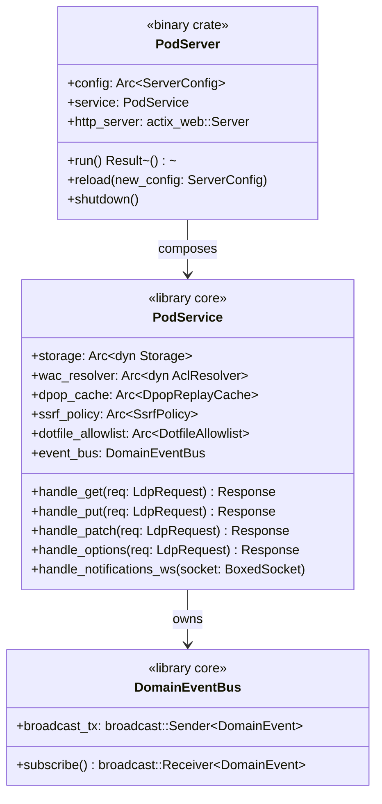

# Bounded Context: Library Surface

> **Sprint 4 / F7**. Realises ADR-054 "library vs server separation"
> referenced throughout GAP-ANALYSIS.md (§C.7a, §F.4, §E.9, §E.3, §E.7).
> PARITY-CHECKLIST.md rows 139, 140.

## Problem statement

`crates/solid-pod-rs` today mixes two concerns:

1. **Library core**: framework-agnostic primitives — `ldp::*`,
   `wac::*`, `oidc::*`, `auth::nip98::*`, `notifications::*`,
   `storage::*`, `security::*`, `provision::*`, `webid::*`, `interop::*`.
2. **Server shell**: `examples/standalone.rs` shows how to bind the
   primitives into actix-web. The example is intentionally small
   (~200 LOC) but consumers without it have to build their own from
   scratch.

JSS is a server. solid-pod-rs is a library. The asymmetry means
operators can't drop solid-pod-rs into a JSS-replacement slot without
writing a wrapper, and downstream extension surfaces (ActivityPub, Git
HTTP, IdP, Nostr relay — all on the v0.5.0 roadmap) have no clean
place to land without either bloating the core crate or creating
ad-hoc sub-crates.

F7 resolves the tension by formalising the split: `solid-pod-rs`
becomes a pure library, `solid-pod-rs-server` becomes the binary crate
with default wiring, and four empty placeholder crates reserve the
namespace for v0.5.0 extensions.

## Decision

The workspace is reshaped as:

```
crates/
├── solid-pod-rs/              # library (no HttpServer, no #[tokio::main])
├── solid-pod-rs-server/       # binary crate + default actix-web wiring
├── solid-pod-rs-activitypub/  # v0.5.0 placeholder — empty Cargo.toml now
├── solid-pod-rs-git/          # v0.5.0 placeholder
├── solid-pod-rs-idp/          # v0.5.0 placeholder
└── solid-pod-rs-nostr/        # v0.5.0 placeholder
```

The library (`solid-pod-rs`) exposes **embeddable handlers + state**.
Consumers provide their own HTTP transport. No `actix_web::HttpServer::new`
at the library boundary; no `#[tokio::main]`; no runtime dependency on a
specific HTTP framework. Framework adapters live in consumer crates.

The server crate (`solid-pod-rs-server`) is the reference binding:
actix-web HttpServer, tokio runtime, `ServerConfig` loader (F6), CLI
parsing, signal handling, graceful shutdown. Its existence means
operators get a one-line-to-run pod: `cargo install solid-pod-rs-server
&& solid-pod-rs-server --config config.json`.

## Aggregates



### `PodService` (library aggregate)

Root of the library. A framework-agnostic request handler surface.
Methods take typed `LdpRequest` / `PatchRequest` / `WsUpgrade` values
and return typed `Response` / `PatchResponse` / `UpgradeResult` values.
No actix-web, axum, hyper types appear in the public signatures.

`PodService::new(config: ServerConfig) -> Self` composes all the
sub-aggregates (Security Primitives, WAC, OIDC, Notifications) from
one config snapshot. Reconfiguration is `PodService::reload(new_config)`
which emits `ConfigReloaded` and atomically swaps the sub-aggregate
`Arc`s.

### `PodServer` (binary aggregate)

Root of `solid-pod-rs-server`. Owns the actix-web `HttpServer` +
`tokio::runtime::Runtime`. Translates actix-web request/response types
to/from the library's typed `LdpRequest`/`Response`. Subscribes to
`DomainEventBus` for observability (tracing spans, metrics, audit log
sinks). Handles SIGTERM/SIGHUP (reload).

## Value objects

| Value object | Fields | Purpose |
|---|---|---|
| `LdpRequest` | method, path, headers, body (bytes), agent (opt) | Framework-neutral request |
| `PatchRequest` | `LdpRequest` + dialect + parsed patch | Typed patch value |
| `WsUpgrade` | connection-id, headers, agent (opt), socket (boxed trait-object) | WS upgrade descriptor |
| `Response` | status, headers, body (stream or bytes) | Framework-neutral response |
| `EmbeddableHandler` | function pointer / Arc<dyn Fn(LdpRequest) -> BoxFuture<Response>> | What the library exposes; binders compose them |

## Domain events

Cross-context (see master doc §3.4). Library core publishes; server
crate subscribes. New events introduced by this context:

| Event | Emitted by | Payload |
|---|---|---|
| `ServiceStarted` | `PodService::new` | timestamp, version, feature flags |
| `ServiceReloaded` | `PodService::reload` | old+new config diff summary |
| `ServiceShutdown` | graceful shutdown initiated | timestamp, pending-request count |

## Ubiquitous language

| Term | Definition |
|---|---|
| **Library core** | The `solid-pod-rs` crate. No HTTP framework, no binary, no `main`. Pure Rust library. |
| **Server shell** | The `solid-pod-rs-server` crate. Owns the HTTP framework, CLI, runtime. Depends on library core. |
| **Embeddable handler** | A library-exported function that takes a typed request and returns a typed response, agnostic of HTTP framework |
| **Composable transport** | A consumer's HTTP layer (actix-web, axum, hyper, tower) that wraps library handlers via framework-specific adapters |
| **Adapter** | Translation code bridging framework types (e.g. `actix_web::HttpRequest`) to library types (`LdpRequest`) |
| **Placeholder crate** | A minimal Cargo.toml + `src/lib.rs` that reserves the crate namespace without yet providing functionality; the four v0.5.0 placeholders |
| **Binary crate** | A Rust crate producing an executable (`src/main.rs`); `solid-pod-rs-server` |

## Invariants

1. **Library has no HTTP framework dep.** `solid-pod-rs/Cargo.toml`
   lists no actix-web, axum, hyper, tower, warp, rocket, or similar.
   Tokio is allowed (async primitives); `tokio-tungstenite` is allowed
   (WS abstraction, framework-agnostic). CI enforces via
   `cargo deny check bans`.
2. **Library has no `#[tokio::main]`.** No `main` function in the
   library crate. `examples/standalone.rs` remains for docs but is
   clearly labelled as a consumer example, not a production shell.
3. **Server crate is the only `[[bin]]`.** `solid-pod-rs-server/Cargo.toml`
   has the only `[[bin]]` target. CI enforces.
4. **Placeholder crates compile and pass `cargo deny`.** Empty
   `Cargo.toml` + `src/lib.rs: pub fn placeholder() {}` is sufficient.
   They're in the workspace members list so workspace commands touch
   them, but they don't pull in any dependencies beyond what's in the
   workspace lockfile.
5. **Domain events flow library → server, never server → library.**
   The library publishes events; the server subscribes. No server-type
   ever leaks into the library's public surface.
6. **Reload is atomic at the service boundary.** `PodService::reload`
   either fully swaps to the new config or returns an error without
   partial state. The server crate's SIGHUP handler respects this.

## Rust module placement

```
crates/solid-pod-rs/                        # library — UNCHANGED internal structure
├── Cargo.toml                              # no HTTP deps; new features from F1–F6
├── src/
│   ├── lib.rs                              # top-level re-exports; PodService root
│   ├── service.rs                          # NEW — PodService aggregate
│   ├── events.rs                           # NEW — DomainEventBus + DomainEvent enum
│   ├── ldp.rs                              # existing
│   ├── wac/                                # existing + F4 origin.rs
│   ├── oidc/                               # existing + F5 replay.rs
│   ├── auth/                               # existing
│   ├── notifications/                      # existing + F3 legacy.rs
│   ├── security/                           # NEW — F1 + F2
│   ├── config/                             # NEW — F6 schema types (loader in server crate)
│   ├── storage/                            # existing
│   ├── provision.rs                        # existing
│   ├── webid.rs                            # existing
│   └── interop.rs                          # existing

crates/solid-pod-rs-server/                 # NEW binary crate
├── Cargo.toml                              # depends on solid-pod-rs + actix-web + F6 loader
├── src/
│   ├── main.rs                             # #[tokio::main], signal handling, reload
│   ├── server.rs                           # PodServer aggregate
│   ├── adapters/
│   │   ├── actix.rs                        # LdpRequest <-> actix_web types
│   │   └── ws.rs                           # WsUpgrade <-> actix-web WS
│   ├── cli.rs                              # clap-based CLI (subset of JSS flags)
│   └── observability.rs                    # DomainEvent subscribers (tracing/metrics/audit)

crates/solid-pod-rs-activitypub/            # v0.5.0 placeholder
├── Cargo.toml                              # empty dependencies, workspace-lints inherited
└── src/lib.rs                              # pub fn placeholder() {}

crates/solid-pod-rs-git/                    # v0.5.0 placeholder (same shape)
crates/solid-pod-rs-idp/                    # v0.5.0 placeholder (same shape)
crates/solid-pod-rs-nostr/                  # v0.5.0 placeholder (same shape)
```

Root `Cargo.toml`'s `[workspace]` members list adds all six new entries.

## Integration points

| Caller | Trigger | Context |
|---|---|---|
| Operators | `solid-pod-rs-server --config config.json` | Server binary runs; loads F6 config; constructs `PodService`; binds actix-web |
| Embedding consumers (e.g. VisionClaw) | `use solid_pod_rs::PodService` | Library usage; consumer provides their own HTTP shell |
| v0.5.0 extension crates | depend on `solid-pod-rs` as a library | Activity Pub, Git HTTP, IdP, Nostr relay each take the placeholder crate slot and fill it |
| All five other contexts | `DomainEvent` publication / subscription | Library core owns the bus; server crate subscribes for observability |

## Test strategy

Unit (library):
- `PodService::new` with minimal config constructs all sub-aggregates
  (1 test).
- `PodService::reload` swaps sub-aggregates atomically, emits
  `ServiceReloaded` (2 tests).
- No HTTP framework symbols in library's public API (1 test — checks
  `rustdoc --output-format json`).

Unit (server):
- Actix adapter: round-trip `LdpRequest` ↔ `actix_web::HttpRequest`
  (3 tests).
- CLI parse: parity with a subset of JSS flags (10 tests).

Integration:
- `solid-pod-rs-server/tests/e2e.rs`: spin up the binary in a
  thread, hit it with an HTTP client, assert Solid Protocol compliance
  on a canonical fixture (shared with JSS's conformance test harness
  where possible).
- `crates/solid-pod-rs/tests/standalone_example.rs`: the existing
  actix example still works as a consumer sample.

Workspace:
- `cargo build --workspace` compiles all six crates.
- `cargo deny check bans` passes: no HTTP framework in library.
- `cargo doc --workspace --no-deps` produces per-crate docs without
  cross-crate errors.

Bench:
- Cold start: `solid-pod-rs-server --config minimal.json` binds port in
  ≤50ms (excluding runtime setup).

## v0.5.0 forward plan

The placeholder crates set the namespace; each will be populated in
sequence:

| Crate | v0.5.0 source | Reference |
|---|---|---|
| `solid-pod-rs-activitypub` | GAP §E.2, checklist rows 102–108, 131 | 1,200 LOC, 40 unit + 15 integration tests |
| `solid-pod-rs-git` | GAP §E.1, checklist row 100 | 450 LOC, 12 integration tests |
| `solid-pod-rs-idp` | GAP §E.3, checklist rows 74–82 | 3,500 LOC + templates; separate release cycle |
| `solid-pod-rs-nostr` | GAP §E.7, checklist row 101 | 800–1,200 LOC; NIP-01/11/16 relay |

The placeholders are kept empty in Sprint 4 so v0.5.0 work can proceed
without another workspace restructure.

## References

- GAP-ANALYSIS.md §C.7, §F.4, §E.1, §E.2, §E.3, §E.7, §I
- PARITY-CHECKLIST.md rows 139, 140
- ADR-054 "library vs server separation" (pending)
- ADR-053 "backend boundary + extraction scope"
- JSS `bin/jss.js`, `src/server.js`
- Related: [00-master.md](./00-master.md), [05-config-platform-context.md](./05-config-platform-context.md) (server crate consumes config loader)
- ADR-056: [../../adr/ADR-056-jss-parity-migration.md](../../adr/ADR-056-jss-parity-migration.md)
