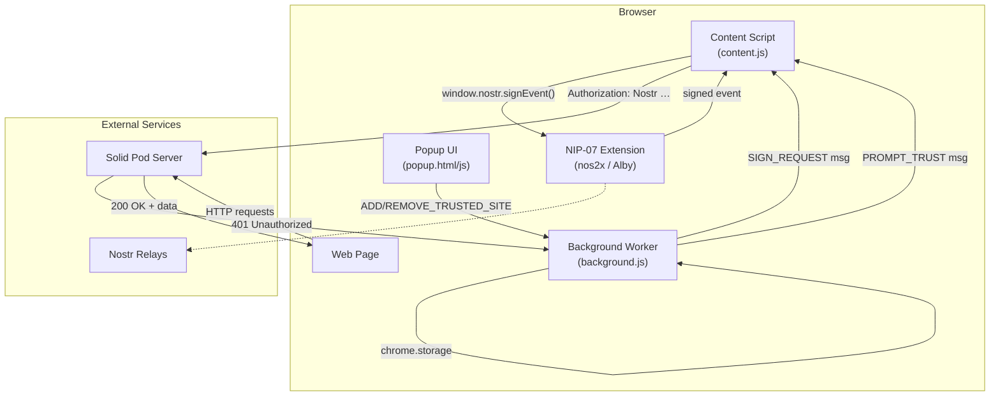
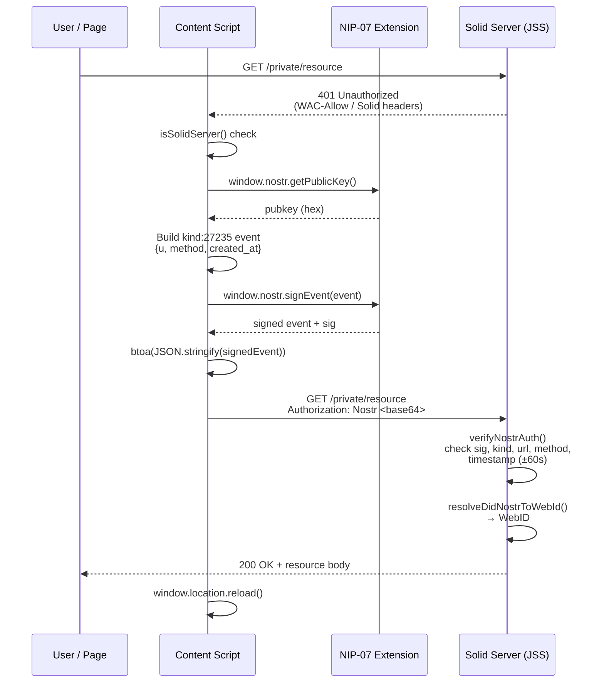
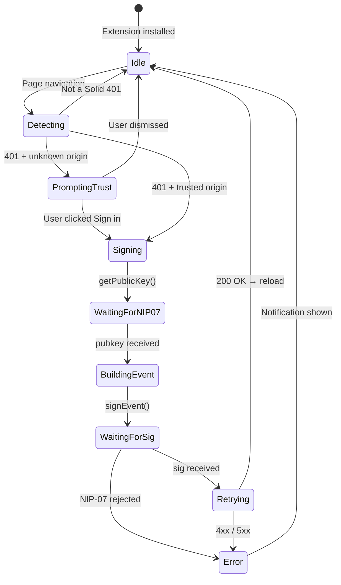
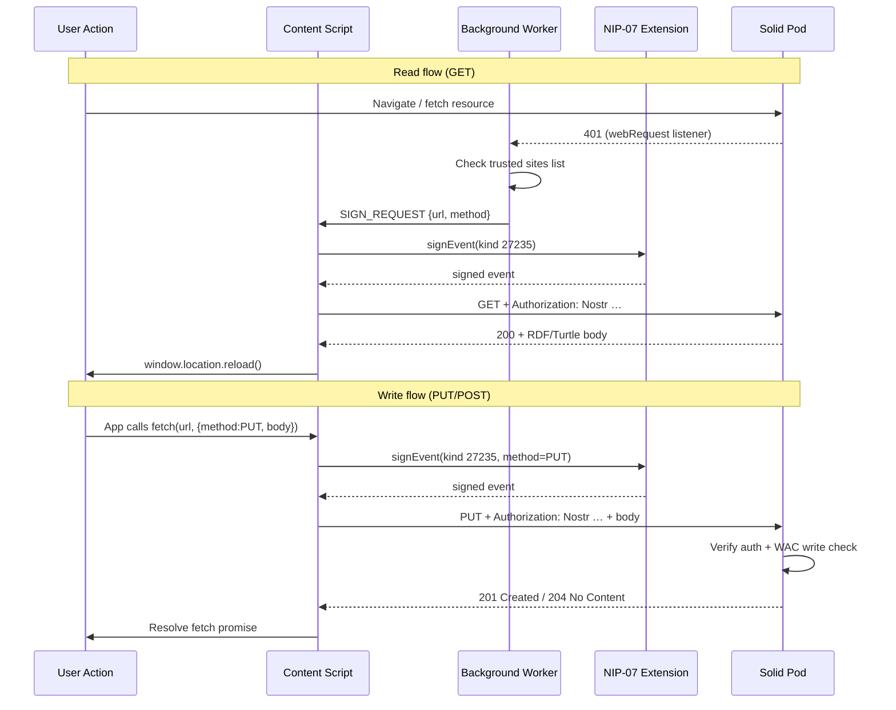

# Nostr-Solid Browser Extension Design

## Executive Summary

A browser extension that enables seamless authentication to Solid servers using Nostr keys, eliminating the OAuth dance entirely. Users with existing Nostr identities can access protected Solid resources by signing HTTP requests with their Nostr keys.

## Problem Statement

### Current Solid Authentication UX

1. User navigates to protected resource
2. Server returns 401 Unauthorized
3. User must initiate OAuth flow (Solid-OIDC)
4. Redirect to Identity Provider with complex parameters
5. Authenticate at IdP (username/password, WebAuthn, etc.)
6. Redirect back with authorization code
7. Token exchange happens
8. Finally, access granted

**Pain points:**
- Multiple redirects
- Requires account creation at an IdP
- Complex client registration (client_id, redirect_uri)
- Different credentials for different pods
- Poor mobile experience

### The Nostr SSO Opportunity

Nostr users already have:
- A cryptographic keypair (secp256k1)
- Key management via browser extensions (nos2x, Alby, nostr-keyx)
- A universal identity (npub) that works everywhere
- Experience signing events/messages

**With did:nostr authentication:**
1. User navigates to protected resource
2. Extension detects 401, signs request with Nostr key
3. Server verifies signature, grants access
4. Done. No redirects, no OAuth dance.

## Current Nostr Extension Landscape

### nos2x (Most Popular)
- **Capabilities:** `window.nostr.getPublicKey()`, `window.nostr.signEvent()`
- **Limitations:** Only signs NIP-07 events, not HTTP requests
- **Users:** ~50,000+

### Alby
- **Capabilities:** NIP-07 + Lightning payments
- **Limitations:** Same as nos2x for signing
- **Users:** ~100,000+

### nostr-keyx
- **Capabilities:** NIP-07 with better UX
- **Limitations:** Same signing limitations

### What's Missing

None of these extensions can:
1. Intercept HTTP 401 responses
2. Sign HTTP request headers (not Nostr events)
3. Automatically retry requests with authentication
4. Understand Solid/WebID concepts

## Architecture Options

### Option A: Standalone Solid-Nostr Extension

A new extension specifically for Solid + Nostr authentication.

```
┌─────────────────────────────────────────────────────────┐
│                    Browser Extension                     │
├─────────────────────────────────────────────────────────┤
│  ┌─────────────┐  ┌─────────────┐  ┌─────────────────┐ │
│  │   Content   │  │ Background  │  │     Popup       │ │
│  │   Script    │  │   Worker    │  │      UI         │ │
│  │             │  │             │  │                 │ │
│  │ - Detect    │  │ - Key mgmt  │  │ - Settings      │ │
│  │   401s      │  │ - Signing   │  │ - Trusted sites │ │
│  │ - Inject    │  │ - Storage   │  │ - Key display   │ │
│  │   headers   │  │             │  │                 │ │
│  └─────────────┘  └─────────────┘  └─────────────────┘ │
└─────────────────────────────────────────────────────────┘
```

**Pros:**
- Full control over UX
- Can optimize for Solid use case
- No dependency on other extensions

**Cons:**
- Users need another extension
- Key management duplication
- Fragmented ecosystem

### Option B: Companion to Existing Nostr Extensions

Leverage nos2x/Alby for key management, add HTTP signing layer.

```
┌─────────────────────────────────────────────────────────┐
│              Solid-Nostr Auth Extension                  │
├─────────────────────────────────────────────────────────┤
│  ┌─────────────────────────────────────────────────┐   │
│  │              HTTP Request Interceptor            │   │
│  │  - webRequest API for 401 detection              │   │
│  │  - Retry logic with auth headers                 │   │
│  └─────────────────────────────────────────────────┘   │
│                          │                              │
│                          ▼                              │
│  ┌─────────────────────────────────────────────────┐   │
│  │              NIP-07 Bridge                       │   │
│  │  - window.nostr.getPublicKey()                   │   │
│  │  - window.nostr.signEvent() → adapt for HTTP     │   │
│  └─────────────────────────────────────────────────┘   │
│                          │                              │
│                          ▼                              │
│  ┌─────────────────────────────────────────────────┐   │
│  │              nos2x / Alby / nostr-keyx           │   │
│  │              (existing extension)                │   │
│  └─────────────────────────────────────────────────┘   │
└─────────────────────────────────────────────────────────┘
```

**Pros:**
- Leverages existing key management
- Users keep their preferred Nostr extension
- Smaller, focused extension

**Cons:**
- Dependency on NIP-07 extensions
- Signing HTTP != signing events (adaptation needed)

### Option C: NIP Proposal for HTTP Signing

Propose a new NIP that standardizes HTTP request signing, then work with nos2x/Alby to implement.

**Pros:**
- Ecosystem-wide solution
- No new extension needed long-term

**Cons:**
- Slow adoption path
- Political/coordination challenges

### Recommended: Option B (Companion Extension)

Best balance of pragmatism and user experience. Users likely already have nos2x or Alby installed.

### Architecture Overview



## Detailed Design

### Extension Components

#### 1. Manifest (manifest.json)

```json
{
  "manifest_version": 3,
  "name": "Solid Nostr Auth",
  "version": "1.0.0",
  "description": "Authenticate to Solid pods using your Nostr identity",
  "permissions": [
    "storage",
    "webRequest",
    "declarativeNetRequestWithHostAccess"
  ],
  "host_permissions": [
    "<all_urls>"
  ],
  "background": {
    "service_worker": "background.js"
  },
  "content_scripts": [
    {
      "matches": ["<all_urls>"],
      "js": ["content.js"],
      "run_at": "document_start"
    }
  ],
  "action": {
    "default_popup": "popup.html",
    "default_icon": {
      "16": "icons/icon16.png",
      "48": "icons/icon48.png",
      "128": "icons/icon128.png"
    }
  },
  "icons": {
    "16": "icons/icon16.png",
    "48": "icons/icon48.png",
    "128": "icons/icon128.png"
  }
}
```

#### 2. Background Service Worker (background.js)

```javascript
/**
 * Solid Nostr Auth - Background Service Worker
 *
 * Responsibilities:
 * - Listen for 401 responses from Solid servers
 * - Coordinate with content script to sign requests
 * - Manage trusted sites list
 * - Handle retry logic
 */

// Storage keys
const STORAGE_KEYS = {
  TRUSTED_SITES: 'trustedSites',
  AUTO_SIGN: 'autoSign',
  PUBKEY_CACHE: 'pubkeyCache'
};

// Track pending auth requests to avoid loops
const pendingAuth = new Map();

/**
 * Detect if a site is a Solid server by checking response headers
 */
function isSolidServer(headers) {
  const dominated = ['solid', 'ms-author-via', 'wac-allow', 'updates-via'];
  return headers.some(h =>
    dominated.some(d => h.name.toLowerCase().includes(d))
  );
}

/**
 * Listen for 401 responses
 */
chrome.webRequest.onCompleted.addListener(
  async (details) => {
    // Only handle 401s
    if (details.statusCode !== 401) return;

    // Avoid infinite loops
    const requestKey = `${details.method}:${details.url}`;
    if (pendingAuth.has(requestKey)) return;

    // Check if it's a Solid server
    if (!isSolidServer(details.responseHeaders || [])) return;

    // Check WWW-Authenticate header for Nostr support
    const wwwAuth = details.responseHeaders?.find(
      h => h.name.toLowerCase() === 'www-authenticate'
    );

    // Get user settings
    const settings = await chrome.storage.local.get([
      STORAGE_KEYS.TRUSTED_SITES,
      STORAGE_KEYS.AUTO_SIGN
    ]);

    const origin = new URL(details.url).origin;
    const trustedSites = settings[STORAGE_KEYS.TRUSTED_SITES] || [];
    const autoSign = settings[STORAGE_KEYS.AUTO_SIGN] ?? false;

    // If auto-sign enabled for trusted sites, or site is trusted
    if (trustedSites.includes(origin) || autoSign) {
      // Mark as pending to avoid loops
      pendingAuth.set(requestKey, Date.now());

      // Send message to content script to initiate signing
      try {
        const [tab] = await chrome.tabs.query({ active: true, currentWindow: true });
        if (tab) {
          chrome.tabs.sendMessage(tab.id, {
            type: 'SIGN_REQUEST',
            url: details.url,
            method: details.method
          });
        }
      } catch (err) {
        console.error('Failed to send sign request:', err);
      }

      // Clean up pending after timeout
      setTimeout(() => pendingAuth.delete(requestKey), 30000);
    } else {
      // Prompt user to trust this site
      chrome.tabs.query({ active: true, currentWindow: true }, ([tab]) => {
        if (tab) {
          chrome.tabs.sendMessage(tab.id, {
            type: 'PROMPT_TRUST',
            origin,
            url: details.url
          });
        }
      });
    }
  },
  { urls: ['<all_urls>'] },
  ['responseHeaders']
);

/**
 * Handle messages from content script and popup
 */
chrome.runtime.onMessage.addListener((message, sender, sendResponse) => {
  switch (message.type) {
    case 'ADD_TRUSTED_SITE':
      addTrustedSite(message.origin).then(sendResponse);
      return true;

    case 'REMOVE_TRUSTED_SITE':
      removeTrustedSite(message.origin).then(sendResponse);
      return true;

    case 'GET_TRUSTED_SITES':
      getTrustedSites().then(sendResponse);
      return true;

    case 'AUTH_COMPLETE':
      // Clean up pending auth
      const key = `${message.method}:${message.url}`;
      pendingAuth.delete(key);
      break;

    case 'SET_AUTO_SIGN':
      chrome.storage.local.set({ [STORAGE_KEYS.AUTO_SIGN]: message.enabled });
      break;
  }
});

async function addTrustedSite(origin) {
  const { trustedSites = [] } = await chrome.storage.local.get(STORAGE_KEYS.TRUSTED_SITES);
  if (!trustedSites.includes(origin)) {
    trustedSites.push(origin);
    await chrome.storage.local.set({ [STORAGE_KEYS.TRUSTED_SITES]: trustedSites });
  }
  return trustedSites;
}

async function removeTrustedSite(origin) {
  const { trustedSites = [] } = await chrome.storage.local.get(STORAGE_KEYS.TRUSTED_SITES);
  const filtered = trustedSites.filter(s => s !== origin);
  await chrome.storage.local.set({ [STORAGE_KEYS.TRUSTED_SITES]: filtered });
  return filtered;
}

async function getTrustedSites() {
  const { trustedSites = [] } = await chrome.storage.local.get(STORAGE_KEYS.TRUSTED_SITES);
  return trustedSites;
}
```

#### 3. Content Script (content.js)

```javascript
/**
 * Solid Nostr Auth - Content Script
 *
 * Responsibilities:
 * - Bridge to NIP-07 (window.nostr)
 * - Sign HTTP requests using Nostr keys
 * - Inject trust prompts into page
 * - Retry requests with authentication
 */

// Check for NIP-07 extension
let nostrAvailable = false;
let nostrCheckAttempts = 0;

function checkNostr() {
  if (window.nostr) {
    nostrAvailable = true;
    console.log('[Solid Nostr Auth] NIP-07 extension detected');
    return true;
  }
  if (nostrCheckAttempts++ < 10) {
    setTimeout(checkNostr, 100);
  }
  return false;
}

checkNostr();

/**
 * Generate HTTP Nostr Authorization header
 *
 * Format: Nostr <base64-encoded-signed-event>
 *
 * The signed event contains:
 * - kind: 27235 (HTTP Auth - proposed)
 * - content: empty
 * - tags: [["u", url], ["method", method]]
 * - created_at: current timestamp
 */
async function generateNostrAuthHeader(url, method) {
  if (!window.nostr) {
    throw new Error('NIP-07 extension not available');
  }

  const pubkey = await window.nostr.getPublicKey();
  const timestamp = Math.floor(Date.now() / 1000);

  // Create event for signing (NIP-98 HTTP Auth style)
  const event = {
    kind: 27235, // HTTP Auth event kind
    created_at: timestamp,
    tags: [
      ['u', url],
      ['method', method.toUpperCase()]
    ],
    content: '',
    pubkey
  };

  // Sign the event using NIP-07
  const signedEvent = await window.nostr.signEvent(event);

  // Encode as base64 for Authorization header
  const encoded = btoa(JSON.stringify(signedEvent));

  return `Nostr ${encoded}`;
}

/**
 * Retry a request with Nostr authentication
 */
async function retryWithAuth(url, method) {
  try {
    const authHeader = await generateNostrAuthHeader(url, method);

    const response = await fetch(url, {
      method,
      headers: {
        'Authorization': authHeader
      },
      credentials: 'omit' // Don't send cookies, we're using Nostr auth
    });

    if (response.ok) {
      // Reload the page to show authenticated content
      window.location.reload();
    } else {
      console.error('[Solid Nostr Auth] Auth failed:', response.status);
      showNotification('Authentication failed. Check server logs.', 'error');
    }

    // Notify background script
    chrome.runtime.sendMessage({
      type: 'AUTH_COMPLETE',
      url,
      method,
      success: response.ok
    });

  } catch (err) {
    console.error('[Solid Nostr Auth] Error:', err);
    showNotification(`Error: ${err.message}`, 'error');
  }
}

/**
 * Show trust prompt UI
 */
function showTrustPrompt(origin, url) {
  // Remove existing prompt if any
  const existing = document.getElementById('solid-nostr-auth-prompt');
  if (existing) existing.remove();

  const prompt = document.createElement('div');
  prompt.id = 'solid-nostr-auth-prompt';
  prompt.innerHTML = `
    <style>
      #solid-nostr-auth-prompt {
        position: fixed;
        top: 20px;
        right: 20px;
        z-index: 999999;
        background: linear-gradient(135deg, #1a1a2e 0%, #16213e 100%);
        color: white;
        padding: 20px;
        border-radius: 12px;
        box-shadow: 0 10px 40px rgba(0,0,0,0.3);
        font-family: -apple-system, BlinkMacSystemFont, 'Segoe UI', Roboto, sans-serif;
        max-width: 360px;
        animation: slideIn 0.3s ease;
      }
      @keyframes slideIn {
        from { transform: translateX(100%); opacity: 0; }
        to { transform: translateX(0); opacity: 1; }
      }
      #solid-nostr-auth-prompt h3 {
        margin: 0 0 12px 0;
        font-size: 16px;
        display: flex;
        align-items: center;
        gap: 8px;
      }
      #solid-nostr-auth-prompt p {
        margin: 0 0 16px 0;
        font-size: 14px;
        color: #a0a0a0;
        line-height: 1.5;
      }
      #solid-nostr-auth-prompt .origin {
        background: rgba(255,255,255,0.1);
        padding: 8px 12px;
        border-radius: 6px;
        font-family: monospace;
        font-size: 13px;
        margin-bottom: 16px;
        word-break: break-all;
      }
      #solid-nostr-auth-prompt .buttons {
        display: flex;
        gap: 10px;
      }
      #solid-nostr-auth-prompt button {
        flex: 1;
        padding: 10px 16px;
        border: none;
        border-radius: 8px;
        font-size: 14px;
        font-weight: 500;
        cursor: pointer;
        transition: transform 0.1s, box-shadow 0.1s;
      }
      #solid-nostr-auth-prompt button:hover {
        transform: translateY(-1px);
      }
      #solid-nostr-auth-prompt .btn-primary {
        background: linear-gradient(135deg, #8b5cf6 0%, #6366f1 100%);
        color: white;
      }
      #solid-nostr-auth-prompt .btn-primary:hover {
        box-shadow: 0 4px 12px rgba(139, 92, 246, 0.4);
      }
      #solid-nostr-auth-prompt .btn-secondary {
        background: rgba(255,255,255,0.1);
        color: white;
      }
      #solid-nostr-auth-prompt .close {
        position: absolute;
        top: 10px;
        right: 10px;
        background: none;
        border: none;
        color: #666;
        cursor: pointer;
        font-size: 18px;
        padding: 4px;
      }
      #solid-nostr-auth-prompt .nostr-icon {
        width: 20px;
        height: 20px;
      }
    </style>
    <button class="close" onclick="this.parentElement.remove()">×</button>
    <h3>
      <svg class="nostr-icon" viewBox="0 0 256 256" fill="currentColor">
        <path d="M128 0C57.3 0 0 57.3 0 128s57.3 128 128 128 128-57.3 128-128S198.7 0 128 0zm0 232c-57.3 0-104-46.7-104-104S70.7 24 128 24s104 46.7 104 104-46.7 104-104 104z"/>
        <circle cx="128" cy="128" r="40"/>
      </svg>
      Sign in with Nostr?
    </h3>
    <p>This Solid server supports Nostr authentication. Would you like to sign in using your Nostr identity?</p>
    <div class="origin">${origin}</div>
    <div class="buttons">
      <button class="btn-secondary" onclick="this.closest('#solid-nostr-auth-prompt').remove()">
        Not now
      </button>
      <button class="btn-primary" id="solid-nostr-trust-btn">
        Sign in
      </button>
    </div>
  `;

  document.body.appendChild(prompt);

  // Handle trust button click
  document.getElementById('solid-nostr-trust-btn').addEventListener('click', async () => {
    if (!nostrAvailable) {
      showNotification('Please install a Nostr extension (nos2x, Alby)', 'error');
      return;
    }

    // Add to trusted sites
    await chrome.runtime.sendMessage({
      type: 'ADD_TRUSTED_SITE',
      origin
    });

    // Remove prompt
    prompt.remove();

    // Retry the request with auth
    await retryWithAuth(url, 'GET');
  });
}

/**
 * Show notification toast
 */
function showNotification(message, type = 'info') {
  const existing = document.getElementById('solid-nostr-notification');
  if (existing) existing.remove();

  const colors = {
    info: '#3b82f6',
    success: '#10b981',
    error: '#ef4444'
  };

  const notification = document.createElement('div');
  notification.id = 'solid-nostr-notification';
  notification.style.cssText = `
    position: fixed;
    bottom: 20px;
    right: 20px;
    z-index: 999999;
    background: ${colors[type]};
    color: white;
    padding: 12px 20px;
    border-radius: 8px;
    font-family: -apple-system, BlinkMacSystemFont, 'Segoe UI', Roboto, sans-serif;
    font-size: 14px;
    box-shadow: 0 4px 12px rgba(0,0,0,0.2);
    animation: fadeIn 0.3s ease;
  `;
  notification.textContent = message;
  document.body.appendChild(notification);

  setTimeout(() => notification.remove(), 5000);
}

/**
 * Listen for messages from background script
 */
chrome.runtime.onMessage.addListener((message, sender, sendResponse) => {
  switch (message.type) {
    case 'SIGN_REQUEST':
      retryWithAuth(message.url, message.method);
      break;

    case 'PROMPT_TRUST':
      showTrustPrompt(message.origin, message.url);
      break;

    case 'CHECK_NOSTR':
      sendResponse({ available: nostrAvailable });
      return true;
  }
});

/**
 * Intercept fetch for automatic signing (optional enhancement)
 * This allows JavaScript apps to automatically get signed requests
 */
const originalFetch = window.fetch;
window.fetch = async function(url, options = {}) {
  const response = await originalFetch(url, options);

  // If 401 and we have Nostr, offer to retry
  if (response.status === 401 && nostrAvailable) {
    // Check if this is a Solid server
    const wacAllow = response.headers.get('WAC-Allow');
    if (wacAllow) {
      // This is a Solid server, could auto-retry with auth
      // For now, just log - could enhance later
      console.log('[Solid Nostr Auth] 401 from Solid server, auth available');
    }
  }

  return response;
};
```

#### 4. Popup UI (popup.html + popup.js)

```html
<!DOCTYPE html>
<html>
<head>
  <meta charset="UTF-8">
  <style>
    * {
      box-sizing: border-box;
      margin: 0;
      padding: 0;
    }

    body {
      width: 320px;
      font-family: -apple-system, BlinkMacSystemFont, 'Segoe UI', Roboto, sans-serif;
      background: linear-gradient(135deg, #1a1a2e 0%, #16213e 100%);
      color: white;
      padding: 20px;
    }

    .header {
      display: flex;
      align-items: center;
      gap: 12px;
      margin-bottom: 20px;
    }

    .header img {
      width: 32px;
      height: 32px;
    }

    .header h1 {
      font-size: 16px;
      font-weight: 600;
    }

    .section {
      background: rgba(255,255,255,0.05);
      border-radius: 10px;
      padding: 16px;
      margin-bottom: 16px;
    }

    .section h2 {
      font-size: 12px;
      text-transform: uppercase;
      letter-spacing: 0.5px;
      color: #888;
      margin-bottom: 12px;
    }

    .identity {
      display: flex;
      align-items: center;
      gap: 12px;
    }

    .identity-icon {
      width: 40px;
      height: 40px;
      background: linear-gradient(135deg, #8b5cf6 0%, #6366f1 100%);
      border-radius: 50%;
      display: flex;
      align-items: center;
      justify-content: center;
    }

    .identity-info {
      flex: 1;
    }

    .identity-npub {
      font-family: monospace;
      font-size: 12px;
      color: #888;
      word-break: break-all;
    }

    .status {
      display: flex;
      align-items: center;
      gap: 8px;
      font-size: 13px;
    }

    .status-dot {
      width: 8px;
      height: 8px;
      border-radius: 50%;
    }

    .status-dot.connected {
      background: #10b981;
    }

    .status-dot.disconnected {
      background: #ef4444;
    }

    .toggle {
      display: flex;
      align-items: center;
      justify-content: space-between;
      padding: 12px 0;
      border-bottom: 1px solid rgba(255,255,255,0.1);
    }

    .toggle:last-child {
      border-bottom: none;
    }

    .toggle label {
      font-size: 14px;
    }

    .toggle-switch {
      width: 44px;
      height: 24px;
      background: rgba(255,255,255,0.2);
      border-radius: 12px;
      position: relative;
      cursor: pointer;
      transition: background 0.2s;
    }

    .toggle-switch.active {
      background: #8b5cf6;
    }

    .toggle-switch::after {
      content: '';
      position: absolute;
      top: 2px;
      left: 2px;
      width: 20px;
      height: 20px;
      background: white;
      border-radius: 50%;
      transition: transform 0.2s;
    }

    .toggle-switch.active::after {
      transform: translateX(20px);
    }

    .trusted-sites {
      max-height: 150px;
      overflow-y: auto;
    }

    .trusted-site {
      display: flex;
      align-items: center;
      justify-content: space-between;
      padding: 8px 0;
      border-bottom: 1px solid rgba(255,255,255,0.1);
    }

    .trusted-site:last-child {
      border-bottom: none;
    }

    .trusted-site-url {
      font-size: 13px;
      font-family: monospace;
      color: #ccc;
    }

    .trusted-site-remove {
      background: none;
      border: none;
      color: #666;
      cursor: pointer;
      font-size: 16px;
    }

    .trusted-site-remove:hover {
      color: #ef4444;
    }

    .empty {
      color: #666;
      font-size: 13px;
      text-align: center;
      padding: 20px;
    }

    .footer {
      text-align: center;
      font-size: 11px;
      color: #666;
    }

    .footer a {
      color: #8b5cf6;
      text-decoration: none;
    }
  </style>
</head>
<body>
  <div class="header">
    
    <h1>Solid Nostr Auth</h1>
  </div>

  <div class="section">
    <h2>Your Identity</h2>
    <div id="identity-container">
      <div class="status">
        <span class="status-dot disconnected"></span>
        <span>No Nostr extension detected</span>
      </div>
    </div>
  </div>

  <div class="section">
    <h2>Settings</h2>
    <div class="toggle">
      <label>Auto-sign for trusted sites</label>
      <div class="toggle-switch" id="auto-sign-toggle"></div>
    </div>
  </div>

  <div class="section">
    <h2>Trusted Sites</h2>
    <div class="trusted-sites" id="trusted-sites">
      <div class="empty">No trusted sites yet</div>
    </div>
  </div>

  <div class="footer">
    <a href="https://github.com/example/solid-nostr-auth">GitHub</a> ·
    <a href="https://solidproject.org">Solid</a> ·
    <a href="https://nostr.com">Nostr</a>
  </div>

  <script src="popup.js"></script>
</body>
</html>
```

```javascript
// popup.js

/**
 * Solid Nostr Auth - Popup Script
 */

// Elements
const identityContainer = document.getElementById('identity-container');
const autoSignToggle = document.getElementById('auto-sign-toggle');
const trustedSitesContainer = document.getElementById('trusted-sites');

/**
 * Initialize popup
 */
async function init() {
  // Check for Nostr extension
  await checkNostrExtension();

  // Load settings
  await loadSettings();

  // Load trusted sites
  await loadTrustedSites();

  // Set up event listeners
  setupEventListeners();
}

/**
 * Check if NIP-07 extension is available
 */
async function checkNostrExtension() {
  try {
    // Query active tab to check for window.nostr
    const [tab] = await chrome.tabs.query({ active: true, currentWindow: true });

    const response = await chrome.tabs.sendMessage(tab.id, { type: 'CHECK_NOSTR' });

    if (response?.available) {
      // Get public key
      const result = await chrome.scripting.executeScript({
        target: { tabId: tab.id },
        func: async () => {
          if (window.nostr) {
            return await window.nostr.getPublicKey();
          }
          return null;
        }
      });

      const pubkey = result[0]?.result;

      if (pubkey) {
        showIdentity(pubkey);
        return;
      }
    }
  } catch (err) {
    console.error('Error checking Nostr:', err);
  }

  showNoNostr();
}

/**
 * Display identity when Nostr is available
 */
function showIdentity(pubkey) {
  // Convert to npub
  const npub = hexToNpub(pubkey);
  const shortNpub = npub.slice(0, 12) + '...' + npub.slice(-8);

  identityContainer.innerHTML = `
    <div class="identity">
      <div class="identity-icon">
        <svg width="20" height="20" viewBox="0 0 256 256" fill="white">
          <circle cx="128" cy="128" r="40"/>
        </svg>
      </div>
      <div class="identity-info">
        <div class="status">
          <span class="status-dot connected"></span>
          <span>Connected</span>
        </div>
        <div class="identity-npub">${shortNpub}</div>
      </div>
    </div>
  `;
}

/**
 * Show message when no Nostr extension
 */
function showNoNostr() {
  identityContainer.innerHTML = `
    <div class="status">
      <span class="status-dot disconnected"></span>
      <span>Install nos2x or Alby extension</span>
    </div>
  `;
}

/**
 * Load settings from storage
 */
async function loadSettings() {
  const { autoSign = false } = await chrome.storage.local.get('autoSign');

  if (autoSign) {
    autoSignToggle.classList.add('active');
  }
}

/**
 * Load trusted sites
 */
async function loadTrustedSites() {
  const sites = await chrome.runtime.sendMessage({ type: 'GET_TRUSTED_SITES' });

  if (!sites || sites.length === 0) {
    trustedSitesContainer.innerHTML = '<div class="empty">No trusted sites yet</div>';
    return;
  }

  trustedSitesContainer.innerHTML = sites.map(site => `
    <div class="trusted-site" data-site="${site}">
      <span class="trusted-site-url">${new URL(site).hostname}</span>
      <button class="trusted-site-remove" title="Remove">×</button>
    </div>
  `).join('');

  // Add remove handlers
  trustedSitesContainer.querySelectorAll('.trusted-site-remove').forEach(btn => {
    btn.addEventListener('click', async (e) => {
      const site = e.target.closest('.trusted-site').dataset.site;
      await chrome.runtime.sendMessage({ type: 'REMOVE_TRUSTED_SITE', origin: site });
      loadTrustedSites();
    });
  });
}

/**
 * Set up event listeners
 */
function setupEventListeners() {
  // Auto-sign toggle
  autoSignToggle.addEventListener('click', async () => {
    autoSignToggle.classList.toggle('active');
    const enabled = autoSignToggle.classList.contains('active');
    await chrome.runtime.sendMessage({ type: 'SET_AUTO_SIGN', enabled });
  });
}

/**
 * Convert hex pubkey to npub (simplified - real impl needs bech32)
 */
function hexToNpub(hex) {
  // This is a placeholder - real implementation needs bech32 encoding
  return 'npub1' + hex.slice(0, 59);
}

// Initialize
init();
```

## Server-Side Implementation (JSS)

The server already supports Nostr authentication via `src/auth/nostr.js`. Key points:

### Current Implementation

```javascript
// src/auth/nostr.js (existing)

/**
 * Verify Nostr HTTP authentication
 * Authorization: Nostr <base64-event>
 */
export async function verifyNostrAuth(authHeader, request) {
  // Extract and decode the signed event
  const base64Event = authHeader.replace(/^Nostr\s+/i, '');
  const event = JSON.parse(atob(base64Event));

  // Verify event signature
  if (!verifyEvent(event)) {
    return { valid: false, error: 'Invalid signature' };
  }

  // Check event kind (27235 for HTTP auth)
  if (event.kind !== 27235) {
    return { valid: false, error: 'Invalid event kind' };
  }

  // Verify URL and method match
  const urlTag = event.tags.find(t => t[0] === 'u');
  const methodTag = event.tags.find(t => t[0] === 'method');

  // Check timestamp (within 60 seconds)
  const now = Math.floor(Date.now() / 1000);
  if (Math.abs(now - event.created_at) > 60) {
    return { valid: false, error: 'Event expired' };
  }

  // Convert pubkey to did:nostr
  const npub = nip19.npubEncode(event.pubkey);
  const didNostr = `did:nostr:${npub}`;

  return { valid: true, did: didNostr, pubkey: event.pubkey };
}
```

### NIP-98 Authentication Flow



### did:nostr → WebID Resolution

```javascript
// src/auth/did-nostr.js (existing)

/**
 * Resolve did:nostr to WebID
 *
 * Resolution order:
 * 1. Check local pod registry
 * 2. Check NIP-05 identifier for WebID
 * 3. Construct default WebID from server
 */
export async function resolveDidNostrToWebId(didNostr, serverBaseUrl) {
  const npub = didNostr.replace('did:nostr:', '');

  // Check local registry first
  const localWebId = await checkLocalRegistry(npub);
  if (localWebId) return localWebId;

  // Try NIP-05 resolution
  const nip05WebId = await resolveViaNip05(npub);
  if (nip05WebId) return nip05WebId;

  // Default: server-local WebID
  return `${serverBaseUrl}/nostr/${npub}#me`;
}
```

## Security Considerations

### 1. Replay Attack Prevention

```javascript
// Event must include timestamp and be within 60 seconds
if (Math.abs(now - event.created_at) > 60) {
  return { valid: false, error: 'Event expired' };
}

// Event must include exact URL being accessed
const urlTag = event.tags.find(t => t[0] === 'u');
if (urlTag[1] !== request.url) {
  return { valid: false, error: 'URL mismatch' };
}
```

### 2. Method Binding

```javascript
// Event must specify HTTP method
const methodTag = event.tags.find(t => t[0] === 'method');
if (methodTag[1] !== request.method) {
  return { valid: false, error: 'Method mismatch' };
}
```

### 3. Trusted Sites List

- Users explicitly approve each origin
- Sites can be removed at any time
- Optional auto-sign for convenience

### 4. No Private Key Exposure

- Extension never touches private keys
- All signing via NIP-07 (nos2x, Alby)
- Keys stay in secure extension storage

### 5. Content Security

- Extension uses minimal permissions
- Content script isolated from page
- No eval() or dynamic code execution

### Extension Lifecycle States



## User Experience Flow

### First-Time User

```
1. User installs "Solid Nostr Auth" extension
   └─> Extension detects existing nos2x/Alby

2. User navigates to https://alice.example.com/private/
   └─> Server returns 401

3. Extension shows trust prompt:
   ┌────────────────────────────────────┐
   │ 🔐 Sign in with Nostr?             │
   │                                    │
   │ This Solid server supports Nostr   │
   │ authentication.                    │
   │                                    │
   │ ┌──────────────────────────────┐   │
   │ │ alice.example.com            │   │
   │ └──────────────────────────────┘   │
   │                                    │
   │  [Not now]  [Sign in]              │
   └────────────────────────────────────┘

4. User clicks "Sign in"
   └─> nos2x prompts to sign event
   └─> Extension retries request with auth
   └─> Page reloads with content
```

### Data Write/Read Flow



### Returning User (Trusted Site)

```
1. User navigates to https://alice.example.com/private/
   └─> Server returns 401

2. Extension auto-signs (if enabled) or shows small notification
   └─> nos2x may prompt based on its settings

3. Request retried with auth
   └─> Page loads immediately
```

## Integration with SolidOS/Mashlib

### Option 1: Extension-Only (Recommended for MVP)

Mashlib doesn't need changes. The extension handles auth before mashlib loads.

```
Browser navigates to protected resource
  └─> 401 returned (with mashlib HTML)
  └─> Extension intercepts, signs, retries
  └─> 200 returned, mashlib loads with authenticated context
```

### Option 2: Mashlib Integration (Future)

Add Nostr as authentication option in mashlib's login UI.

```javascript
// In mashlib/src/login/
class NostrAuthStrategy {
  async login() {
    if (!window.nostr) {
      throw new Error('Install a Nostr extension');
    }

    const pubkey = await window.nostr.getPublicKey();
    const npub = nip19.npubEncode(pubkey);

    // Store WebID for this session
    const webId = await this.resolveWebId(npub);
    this.setAuthenticated(webId);
  }
}
```

## NIP Proposal: HTTP Authentication (NIP-98)

For ecosystem alignment, we should formalize this as a NIP:

```markdown
NIP-98
======

HTTP Auth
---------

This NIP defines how Nostr keys can authenticate HTTP requests.

## Event Format

Kind: 27235

Tags:
- `u` - Full URL being accessed (required)
- `method` - HTTP method (required)
- `payload` - SHA-256 hash of request body (optional, for POST/PUT)

Content: Empty string

## Authorization Header

Format: `Authorization: Nostr <base64-encoded-event>`

## Example

```json
{
  "kind": 27235,
  "created_at": 1704067200,
  "tags": [
    ["u", "https://example.com/private/data.json"],
    ["method", "GET"]
  ],
  "content": "",
  "pubkey": "...",
  "id": "...",
  "sig": "..."
}
```

## Verification

1. Decode base64 event from Authorization header
2. Verify event signature
3. Check kind is 27235
4. Verify `u` tag matches request URL
5. Verify `method` tag matches HTTP method
6. Check `created_at` is within 60 seconds
7. For POST/PUT, verify `payload` hash if present
```

## Implementation Phases

### Phase 1: MVP (1-2 weeks)
- [ ] Basic extension structure
- [ ] NIP-07 integration (use existing keys)
- [ ] 401 detection and signing
- [ ] Trust prompt UI
- [ ] Popup with settings

### Phase 2: Polish (1 week)
- [ ] Auto-sign for trusted sites
- [ ] Better error handling
- [ ] Notification system
- [ ] Icon states (authenticated vs not)

### Phase 3: Ecosystem (2-3 weeks)
- [ ] Submit NIP-98 proposal
- [ ] Firefox extension port
- [ ] Work with nos2x/Alby on native support
- [ ] Mashlib integration PR

### Phase 4: Advanced (Future)
- [ ] Multiple key support
- [ ] Per-site key selection
- [ ] Key backup/recovery hints
- [ ] Integration with DID resolvers

## Testing Strategy

### Manual Testing
1. Install extension + nos2x
2. Navigate to JSS server with protected resource
3. Verify trust prompt appears
4. Verify signing works
5. Verify page loads with content

### Automated Testing
```javascript
// test/extension.test.js
describe('Solid Nostr Auth Extension', () => {
  it('should detect 401 from Solid server', async () => {
    // Use puppeteer/playwright with extension loaded
  });

  it('should generate valid auth header', async () => {
    const header = await generateNostrAuthHeader(
      'https://example.com/test',
      'GET'
    );
    expect(header).toMatch(/^Nostr /);
  });

  it('should verify auth on server', async () => {
    // End-to-end test with running JSS instance
  });
});
```

## Comparison with Alternatives

| Feature | Solid-OIDC | did:nostr + Extension | HTTP Signatures |
|---------|------------|----------------------|-----------------|
| Redirects | 2+ | 0 | 0 |
| Account needed | Yes (IdP) | No | Yes (key reg) |
| Mobile UX | Poor | Good* | Good |
| Browser support | All | Chrome/Firefox | All |
| Key portability | Limited | Excellent | Limited |
| Setup complexity | High | Low | Medium |

*Requires mobile Nostr app with NIP-07 support

## Open Questions

1. **Should we support unsigned requests for public resources?**
   - Current: Yes, auth only added for 401s
   - Alternative: Always sign (proves identity even for public)

2. **How to handle key rotation?**
   - Current: Not addressed
   - Option: Support multiple pubkeys per WebID

3. **Should the extension manage its own keys?**
   - Current: No, rely on nos2x/Alby
   - Trade-off: Convenience vs security

4. **How to surface Nostr identity in Solid apps?**
   - WebID profile could include Nostr pubkey
   - Apps could show npub alongside WebID

## Appendix: Related Standards

- [NIP-07](https://github.com/nostr-protocol/nips/blob/master/07.md): Browser Extension Signing
- [NIP-05](https://github.com/nostr-protocol/nips/blob/master/05.md): DNS-based Nostr Identity
- [DID:nostr](https://github.com/pnp/did-nostr): DID Method for Nostr
- [Solid-OIDC](https://solidproject.org/TR/oidc): Current Solid Auth Spec
- [HTTP Signatures](https://datatracker.ietf.org/doc/html/draft-cavage-http-signatures): IETF Draft

## Repository Structure

```
solid-nostr-auth/
├── manifest.json
├── background.js
├── content.js
├── popup.html
├── popup.js
├── icons/
│   ├── icon16.png
│   ├── icon48.png
│   └── icon128.png
├── lib/
│   └── nostr-tools.min.js  (for bech32/nip19)
├── test/
│   └── extension.test.js
├── README.md
└── LICENSE
```

## Conclusion

A browser extension bridging Nostr keys to Solid authentication provides:

1. **Immediate UX improvement**: No OAuth dance, no redirects
2. **Leverages existing infrastructure**: nos2x, Alby already installed
3. **True SSO**: Same identity across all Solid pods
4. **Progressive enhancement**: Falls back to Solid-OIDC gracefully

The extension is lightweight (~50KB), focused, and can be built incrementally while working toward ecosystem-wide adoption through NIP standardization.
