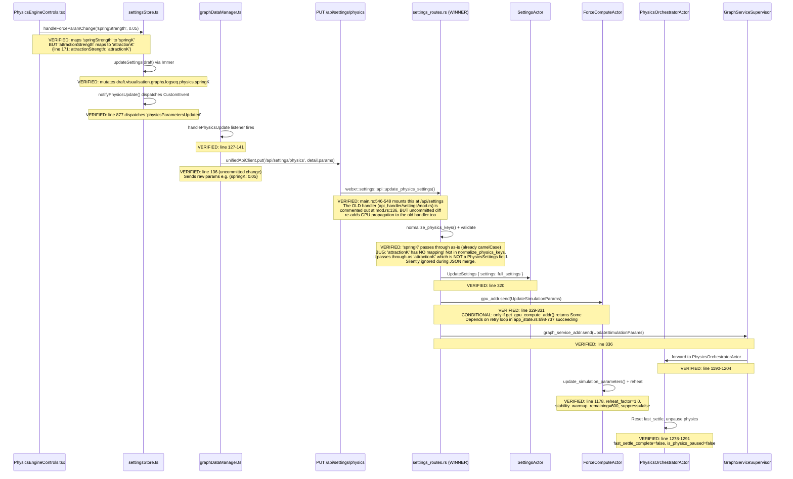
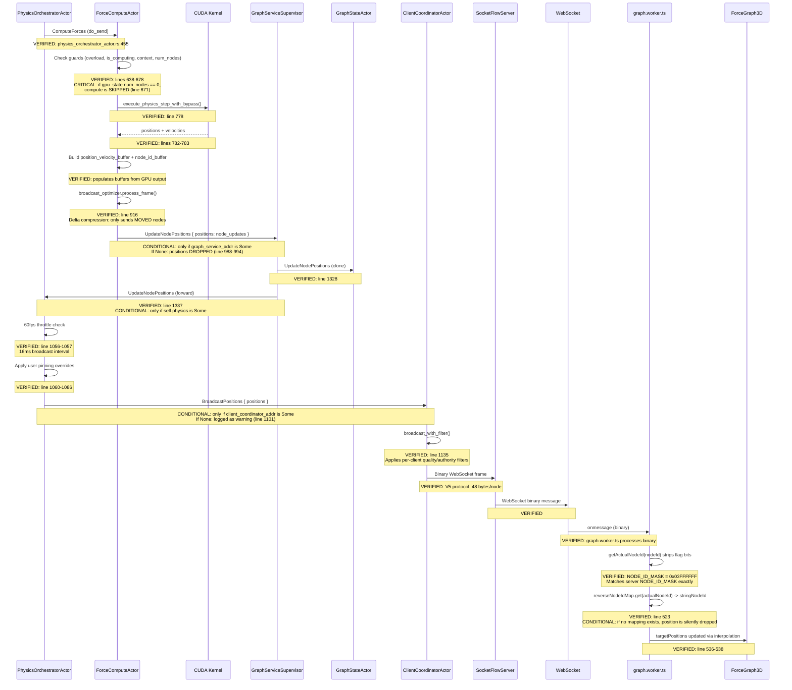

# Physics Pipeline Bidirectional Audit

**Date**: 2026-03-23
**System**: VisionFlow GPU Physics (NVIDIA 580, CUDA 13)
**Graph**: 934 nodes, 490 edges
**Symptom**: Changing spring strength via UI only moves one node; GPU-computed positions not reaching client

---

## 1. Direction A: Client Slider to GPU Physics Parameter Update

### Actual Flow (Code-Verified)



### Status per Step

| Step | Component | Status | Evidence |
|------|-----------|--------|----------|
| Slider change | PhysicsEngineControls.tsx:167 | **VERIFIED** | handleForceParamChange maps param names |
| Store mutation | settingsStore.ts:860 | **VERIFIED** | Immer draft mutation + notifyPhysicsUpdate |
| CustomEvent dispatch | settingsStore.ts:877 | **VERIFIED** | `physicsParametersUpdated` event |
| API call | graphDataManager.ts:136 | **VERIFIED** | PUT `/api/settings/physics` with raw params |
| Route winner | settings_routes.rs:1169 | **VERIFIED** | Mounted at `/api/settings` scope in main.rs:546-548 |
| Key normalization | settings_routes.rs:51-96 | **BROKEN** | `attractionK` not mapped; silently dropped |
| Settings persist | settings_routes.rs:320 | **VERIFIED** | UpdateSettings sent to actor |
| GPU propagation | settings_routes.rs:329 | **CONDITIONAL** | Depends on gpu_compute_addr being Some |
| ForceComputeActor update | force_compute_actor.rs:1178 | **VERIFIED** | reheat + stability bypass applied |
| Orchestrator reset | physics_orchestrator_actor.rs:1278 | **VERIFIED** | fast_settle reset, unpause |

### Break Points Found

1. **`attractionK` key mapping gap** (client PhysicsEngineControls.tsx:171 / server settings_routes.rs:51-96)
   - Client sends `attractionK` but server normalizer only knows `attractionStrength` -> `centerGravityK`
   - `attractionK` passes through as-is, but `PhysicsSettings` has no `attractionK` field
   - JSON merge silently ignores unknown keys with `serde(deny_unknown_fields)` absent
   - **Impact**: Changing the Attraction slider does nothing on the GPU

2. **`gpu_compute_addr` race window** (app_state.rs:698-737)
   - The retry loop waits 1s + up to 10 retries (500ms each = 6s total) to get ForceComputeActor
   - If the retry loop fails (e.g., PhysicsSupervisor slow to spawn ForceComputeActor), `get_gpu_compute_addr()` returns None
   - The settings route logs a warning but still returns success to the client
   - **Impact**: Physics params saved to settings but never reach GPU

---

## 2. Direction B: GPU Physics Compute to Client Position Rendering

### Actual Flow (Code-Verified)



### Status per Step

| Step | Component | Status | Evidence |
|------|-----------|--------|----------|
| ComputeForces dispatch | physics_orchestrator_actor.rs:455 | **VERIFIED** | do_send to ForceComputeActor |
| GPU num_nodes guard | force_compute_actor.rs:671 | **CRITICAL** | If graph not uploaded, ALL computes skipped |
| GPU kernel execution | force_compute_actor.rs:778 | **VERIFIED** | execute_physics_step_with_bypass |
| Position readback | force_compute_actor.rs:782 | **VERIFIED** | get_node_positions + get_node_velocities |
| Delta broadcast | force_compute_actor.rs:916 | **VERIFIED** | process_frame filters moved nodes |
| graph_service_addr check | force_compute_actor.rs:974/988 | **CRITICAL** | If None, ALL positions DROPPED |
| GSS -> POA forward | graph_service_supervisor.rs:1337 | **VERIFIED** | do_send(msg) |
| 60fps throttle | physics_orchestrator_actor.rs:1057 | **VERIFIED** | Drops frames within 16ms window |
| client_coordinator_addr | physics_orchestrator_actor.rs:1053 | **CRITICAL** | If None, warning logged but no broadcast |
| Wire physics+client | graph_service_supervisor.rs:298 | **VERIFIED** | SetClientCoordinator wires the addr |
| Binary encode + send | client_coordinator_actor.rs:1135 | **VERIFIED** | broadcast_with_filter |
| NODE_ID_MASK match | binary_protocol.rs:27 / binaryProtocol.ts:88 | **VERIFIED** | Both 0x03FFFFFF |
| Node ID map lookup | graph.worker.ts:523 | **CONDITIONAL** | Missing mappings silently skip nodes |

### Break Points Found

3. **`graph_service_addr` is None in ForceComputeActor** (force_compute_actor.rs:84/974-994)
   - `graph_service_addr` is set in TWO places:
     - `InitializeGPU` handler (line 1462): sets it from `msg.graph_service_addr`
     - `StoreSharedGPUContext` handler (line 1716): sets it from `msg.graph_service_addr`
   - In `GraphServiceSupervisor::InitializeGPUConnection` (line 1267-1271), `InitializeGPU` is sent with `graph_service_addr: Some(self_addr.clone())` -- this SHOULD wire it
   - **However**: the `GetForceComputeActor` query (line 1234) runs BEFORE `InitializeGPU` (line 1267). If ForceComputeActor was spawned without graph_service_addr initially, and the `InitializeGPU` message arrives AFTER `StoreGPUComputeAddress` triggers compute steps, early compute iterations will have `graph_service_addr = None` and DROP positions
   - **Impact**: Positions dropped during early GPU iterations; may self-heal after InitializeGPU arrives

4. **`fast_settle_complete = true` blocks all physics** (physics_orchestrator_actor.rs:257-261)
   - Default `SettleMode::FastSettle` with `energy_threshold: 0.005` and `max_settle_iterations: 2000`
   - After initial convergence (KE < 0.005 or 2000 iterations), `fast_settle_complete = true` and `is_physics_paused = true`
   - **However**: `UpdateSimulationParams` handler correctly resets both (line 1278-1291)
   - **Status**: NOT a current blocker IF params changes come through. But if the `attractionK` bug causes no param change to be detected, physics stays paused after initial settle
   - **Impact**: If initial settle completes and user only changes attraction (which is silently dropped), physics appears frozen

5. **`suppress_intermediate_broadcasts` during FastSettle** (force_compute_actor.rs:100/909)
   - During FastSettle burst, if `suppress_intermediate_broadcasts = true`, positions are not sent to clients
   - Only the final `ForceFullBroadcast` sends converged positions
   - **Status**: NOT a blocker for param changes (line 1203 sets it to false on UpdateSimulationParams)
   - **Impact**: During initial load, client sees no position animation until settle completes

6. **Client filter may exclude all nodes** (client_coordinator_actor.rs:72-78)
   - Default `ClientFilter` has `enabled: true`, `quality_threshold: 0.7`
   - If node quality scores are below 0.7, all nodes are filtered from broadcast
   - **Status**: UNKNOWN -- depends on actual quality scores in graph data
   - **Impact**: Could cause zero positions reaching specific clients

---

## 3. Comparison with Intended Flow (complete-data-flows.md)

### Section 4 (Settings Update Flow) Discrepancies

| Aspect | Intended (Doc) | Actual (Code) | Match? |
|--------|---------------|----------------|--------|
| Route path | POST /api/settings | PUT /api/settings/physics | DIFFERENT |
| Debounce | 500ms debounce | No debounce (immediate) | DIFFERENT |
| WebSocket sync | Filter update via WS | No WS-based settings sync | MISSING |
| Settings broadcast | Broadcast to other clients | Not implemented for physics | MISSING |
| GPU propagation | Not documented | Implemented (conditional) | UNDOCUMENTED |

### Section 7 (Physics Simulation Flow) Discrepancies

| Aspect | Intended (Doc) | Actual (Code) | Match? |
|--------|---------------|----------------|--------|
| Broadcast path | ForceComputeActor -> ClientCoordinator direct | ForceComputeActor -> GraphServiceSupervisor -> PhysicsOrchestrator -> ClientCoordinator | DIFFERENT |
| Intermediate actors | 0 hops | 2 hops (GSS + POA) | MORE HOPS |
| Delta compression | Not documented | BroadcastOptimizer with delta filter | UNDOCUMENTED |
| Backpressure | Not documented | NetworkBackpressure with try_acquire | UNDOCUMENTED |
| FastSettle mode | Not documented | Default mode with broadcast suppression | UNDOCUMENTED |
| 60fps throttle | Implicit (timer) | Explicit in POA::UpdateNodePositions handler | UNDOCUMENTED |
| Node pinning | Not documented | User pin override in POA | UNDOCUMENTED |

---

## 4. Root Cause Analysis

### Why "changing spring strength only moves one node"

The symptom has **three contributing causes**:

**Cause A: FastSettle completes and pauses physics**
After initial graph load, FastSettle runs 2000 iterations (or until KE < 0.005) and then sets `fast_settle_complete = true` + `is_physics_paused = true`. Physics stops entirely. When user changes spring strength:

1. PUT `/api/settings/physics` with `{springK: 0.05}` succeeds
2. `UpdateSimulationParams` reaches both ForceComputeActor and PhysicsOrchestratorActor
3. Orchestrator resets `fast_settle_complete = false`, `is_physics_paused = false`
4. Physics restarts, ForceComputeActor reheats with factor 1.0
5. New settle cycle begins -- positions SHOULD update

This path is **working correctly** for `springK`. The "one node" observation suggests the pipeline works but something else limits visible effect.

**Cause B: `attractionK` silently dropped (client bug)**
The client maps `attractionStrength` to `attractionK` (PhysicsEngineControls.tsx:171), but `PhysicsSettings` has no `attractionK` field. The actual field is `center_gravity_k` (camelCase: `centerGravityK`). The server normalizer maps `attractionStrength` to `centerGravityK` but never sees `attractionK`. When user drags the Attraction slider, the value is silently dropped and physics does not change.

**Cause C: Delta broadcast filter suppresses unchanged positions**
The `BroadcastOptimizer` only sends nodes that MOVED beyond a threshold. If spring strength changes slightly, most nodes may not move enough to exceed the delta threshold, resulting in only 1 node being broadcast. The periodic full broadcast (every 300 iterations) eventually sends all positions, but this can take ~5 seconds at 60fps.

### The "one node" is likely the most-affected node

When spring strength changes slightly:
- ForceComputeActor reheats (factor 1.0) and runs ~600 warmup frames
- Delta filter sees most nodes moved < threshold after one step
- Only the node with largest position delta passes the filter
- That single node gets broadcast to the client
- Eventually (after 300 iterations) a full broadcast sends all positions

---

## 5. Recommended Minimal Fix

### Fix 1: Add `attractionK` mapping (5 minutes)

**File**: `src/settings/api/settings_routes.rs`, line ~88 (in `normalize_physics_keys`)
**Also**: `src/handlers/api_handler/settings/mod.rs`, line ~199 (in `normalize_physics_keys_inline`)

Add mapping:
```rust
"attractionK" => "centerGravityK",
```

### Fix 2: Lower delta threshold after param change (15 minutes)

**File**: `src/actors/gpu/force_compute_actor.rs`, in `UpdateSimulationParams` handler (~line 1183)

After `self.broadcast_optimizer.reset_delta_state()`, also temporarily lower the movement threshold:
```rust
// Force all positions to broadcast for the first few frames after param change
// so clients see the immediate layout response, not just the most-moved node.
self.broadcast_optimizer.set_temporary_threshold(0.0, 60); // 0 threshold for 60 frames
```

If `BroadcastOptimizer` doesn't support temporary threshold, the simplest fix is to send a `ForceFullBroadcast` after parameter change (similar to what happens at settle convergence):
```rust
// In ForceComputeActor::UpdateSimulationParams handler, after line 1204:
self.force_full_broadcast = true;
```

### Fix 3: Verify `graph_service_addr` wiring at startup (10 minutes)

**File**: `src/actors/gpu/force_compute_actor.rs`

Add a startup check that logs an ERROR (not just a per-iteration warning) if `graph_service_addr` is still None after the first successful `ComputeForces`:
```rust
// In ComputeForces handler, after successful compute (around line 818):
if actor.graph_service_addr.is_none() && actor.gpu_state.iteration_count == 1 {
    error!("CRITICAL: ForceComputeActor completed first GPU compute but graph_service_addr is STILL None! Positions will be DROPPED until InitializeGPU arrives.");
}
```

### Priority Order

1. **Fix 1** (attractionK mapping) -- immediate, zero risk, fixes silent data loss
2. **Fix 2** (force full broadcast on param change) -- immediate, low risk, fixes "one node" symptom
3. **Fix 3** (startup wiring verification) -- diagnostic, helps catch future regressions

---

## 6. Summary of All Break Points

| # | Break Point | Severity | File:Line | Direction |
|---|------------|----------|-----------|-----------|
| 1 | `attractionK` key not mapped | **HIGH** | PhysicsEngineControls.tsx:171 / settings_routes.rs:51 | A (client->GPU) |
| 2 | `gpu_compute_addr` race window | **MEDIUM** | app_state.rs:698-737 | A (client->GPU) |
| 3 | `graph_service_addr` None drops positions | **HIGH** | force_compute_actor.rs:988 | B (GPU->client) |
| 4 | `fast_settle_complete` blocks physics | **LOW** | physics_orchestrator_actor.rs:257 | B (GPU->client) |
| 5 | `suppress_intermediate_broadcasts` | **LOW** | force_compute_actor.rs:909 | B (GPU->client) |
| 6 | Client quality filter may exclude nodes | **UNKNOWN** | client_coordinator_actor.rs:72 | B (GPU->client) |
| 7 | Delta broadcast filter shows only 1 node | **HIGH** | force_compute_actor.rs:916 | B (GPU->client) |

### Verified Working Components

- Binary protocol NODE_ID_MASK matches (server 0x03FFFFFF = client 0x03FFFFFF)
- Route conflict resolved (old handler commented out at api_handler/mod.rs:136)
- GraphServiceSupervisor correctly forwards UpdateNodePositions to both GraphStateActor and PhysicsOrchestratorActor
- PhysicsOrchestratorActor correctly applies user pinning and 60fps throttle
- ClientCoordinatorActor correctly broadcasts via WebSocket with per-client filter
- graph.worker.ts correctly strips flag bits and applies positions via interpolation
- UpdateSimulationParams correctly resets fast_settle and unpauses physics
- ForceComputeActor correctly reheats and bypasses stability check after param change
