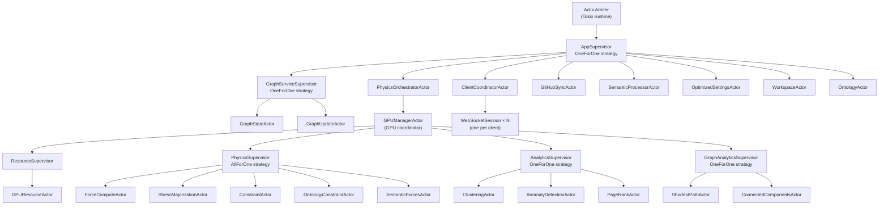
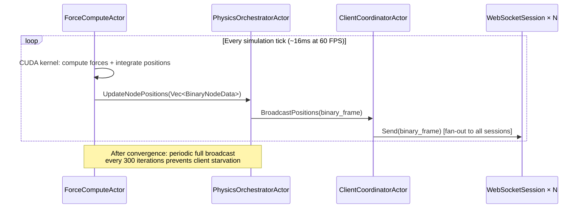
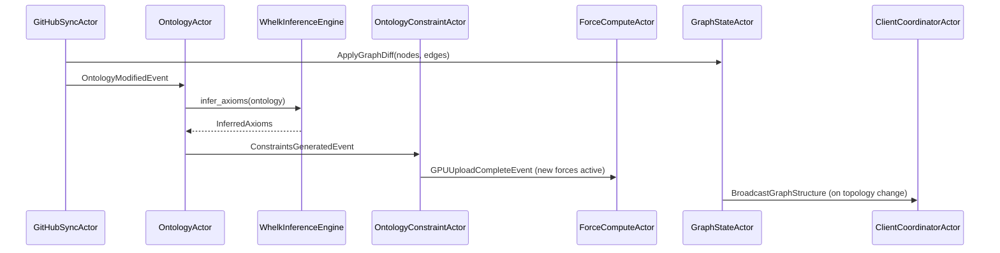
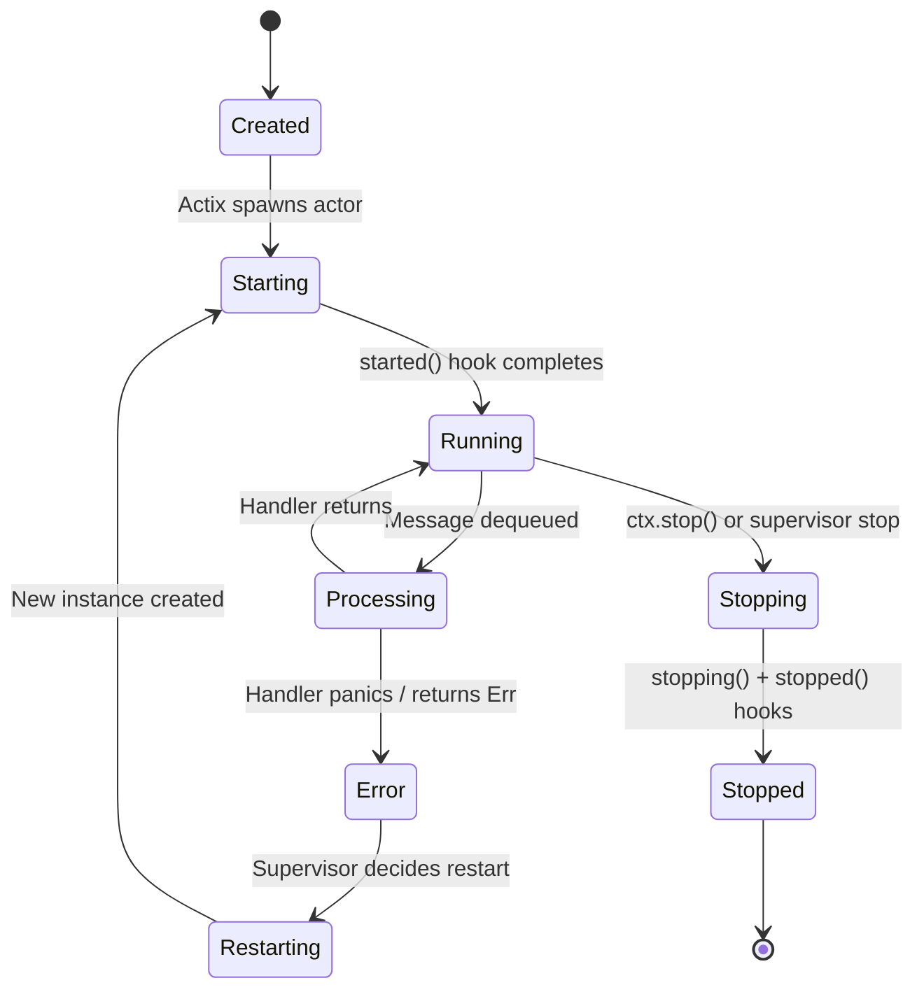
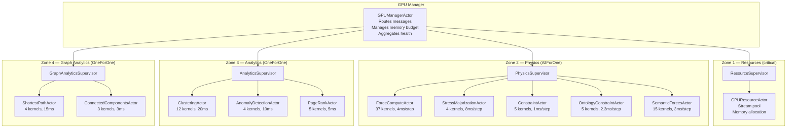

# VisionClaw Actor System Hierarchy

VisionClaw's Rust backend coordinates 23 specialised Actix actors under a hierarchical supervision tree. Actors handle all concurrent concerns — WebSocket client management, GPU physics coordination, graph state, semantic processing, GitHub ingestion, agent monitoring, and task orchestration — without shared mutable state. Communication is exclusively via typed asynchronous messages.

> **Note**: `GraphServiceActor` no longer exists as an active component. It was decomposed into the current 21-actor hierarchy and replaced by CQRS handlers backed by Neo4j. Any reference to `GraphServiceActor` in older documentation is historical.

---

## 1. Overview

The actor system is built on Actix-Web's arbiter model. Each actor owns private state and processes one message at a time from its mailbox. Concurrency arises from many actors running in parallel across the Tokio thread pool. The supervision tree ensures failures are isolated: a CUDA OOM in `ForceComputeActor` restarts only the physics sub-actors, not the graph state or WebSocket connections.

Actors serve as the **Presentation Layer** of the hexagonal architecture. They receive external inputs (HTTP requests, WebSocket messages, timer ticks, GPU callbacks) and translate them into domain operations by dispatching commands and queries through the CQRS bus. Actors never access Neo4j or the GPU directly — they go through port trait adapters.

---

## 2. Actor Supervision Tree



The 23 named actors (excluding the ephemeral `WebSocketSession × N` instances):

1. `GraphStateActor`
2. `GraphUpdateActor`
3. `PhysicsOrchestratorActor`
4. `GPUManagerActor`
5. `GPUResourceActor`
6. `ForceComputeActor`
7. `StressMajorizationActor`
8. `ConstraintActor`
9. `OntologyConstraintActor`
10. `SemanticForcesActor`
11. `ClusteringActor`
12. `AnomalyDetectionActor`
13. `PageRankActor`
14. `ShortestPathActor`
15. `ConnectedComponentsActor`
16. `ClientCoordinatorActor`
17. `SemanticProcessorActor`
18. `OptimizedSettingsActor`
19. `WorkspaceActor`
20. `OntologyActor`
21. `GitHubSyncActor`
22. `AgentMonitorActor`
23. `TaskOrchestratorActor`

---

## 3. Actor Profiles

### GraphStateActor

| Property | Value |
|---|---|
| Supervisor | `GraphServiceSupervisor` |
| Mailbox | Bounded (capacity 1000) |
| Lines of code | ~797 |

**State machine**: `Uninitialized → Initializing → Loading → Ready ↔ Updating ↔ Simulating → Error → Recovering`

Key messages handled:
- `GetGraphData` → `Arc<GraphData>` (request-response)
- `AddNode { node: Node }` → `u32`
- `RemoveNode { id: u32 }` → `()`
- `UpdatePositions { updates: Vec<(u32, Vec3)> }` → `()`
- `GetNode { id: u32 }` → `Option<Node>`

Key messages sent:
- Publishes `GraphUpdateEvent` to `SemanticProcessorActor` subscribers
- Sends `BroadcastPositions` to `ClientCoordinatorActor` after position commits

Critical state: in-memory graph cache, metadata-ID-to-node-ID map, checkpoint timestamps.

---

### GraphUpdateActor

| Property | Value |
|---|---|
| Supervisor | `GraphServiceSupervisor` |
| Mailbox | Unbounded |

Handles incremental graph diffs from the GitHub sync pipeline, coalescing batched node/edge updates before forwarding to `GraphStateActor`. Prevents `GraphStateActor` from processing individual file-level mutations during large syncs.

Key messages handled: `ApplyGraphDiff { diff: GraphDiff }`, `FlushPendingUpdates`.

---

### PhysicsOrchestratorActor

| Property | Value |
|---|---|
| Supervisor | `AppSupervisor` |
| Mailbox | Bounded (capacity 128) |

Coordinates the full GPU physics pipeline per simulation tick. Fans out to `GPUManagerActor`, awaits results, then broadcasts positions to clients. Uses `join!` for parallel force computation paths.

Orchestration sequence per tick:
1. `GPUManagerActor` ← `SimulationStep`
2. `GPUResourceActor` ← `AllocateStream`
3. `PhysicsSupervisor/ForceComputeActor` ← `ComputeForces(stream)`
4. `PhysicsSupervisor/SemanticForcesActor` ← `ComputeSemanticForces(stream)` (parallel with step 3)
5. Merge force vectors
6. `PhysicsSupervisor/ConstraintActor` ← `ApplyConstraints(combined)`
7. `PhysicsSupervisor/OntologyConstraintActor` ← `ApplyOntologyConstraints`
8. `ForceComputeActor` ← `UpdatePositions`
9. `ClientCoordinatorActor` ← `BroadcastPositions(binary)`

---

### GPUManagerActor

| Property | Value |
|---|---|
| Supervisor | `PhysicsOrchestratorActor` |
| Mailbox | Bounded (capacity 64) |

Routes messages to the four GPU sub-supervisors. Tracks GPU memory budget across supervisors. Aggregates health status for diagnostics. Coordinates cascading restart on critical GPU failures.

Key messages handled: `SimulationStep`, `RunAnalytics`, `AllocateMemory`, `GetGpuHealth`.

---

### GPUResourceActor

| Property | Value |
|---|---|
| Supervisor | `ResourceSupervisor` (under `GPUManagerActor`) |
| Mailbox | Bounded |

Manages the CUDA stream pool and device memory allocations. All GPU actors request streams through this actor before launching kernels.

Key messages: `AllocateStream` → `StreamHandle`, `ReleaseStream`, `GetMemoryStats`.

---

### ForceComputeActor

| Property | Value |
|---|---|
| Supervisor | `PhysicsSupervisor` (AllForOne) |
| Mailbox | Bounded (capacity 256) |
| CUDA kernels | 37 |
| Typical latency | 4ms/step |

Barnes-Hut O(n log n) force calculation with Verlet integration. Owns the primary node position CUDA buffers. Runs 600-frame warm-up window before physics is considered converged. Emits periodic full-broadcast (every 300 iterations) to prevent client position starvation after convergence.

Key messages: `ComputeForces`, `UpdatePositions { positions: Vec<BinaryNodeData> }`, `SetSimParams { params: SimParams }`, `GetIterationCount`.

On CUDA OOM: calls `ctx.stop()` to trigger `PhysicsSupervisor` AllForOne restart.

---

### StressMajorizationActor

| Property | Value |
|---|---|
| Supervisor | `PhysicsSupervisor` (AllForOne) |
| CUDA kernels | 4 |
| Typical latency | 8ms/step |

Global layout optimisation via energy minimisation. Invoked optionally by `PhysicsOrchestratorActor` when layout quality metric drops below threshold.

---

### ConstraintActor

| Property | Value |
|---|---|
| Supervisor | `PhysicsSupervisor` (AllForOne) |
| CUDA kernels | 5 |
| Typical latency | 1ms/step |

Hard spatial constraints — collision detection, boundary enforcement, user-pinned node positions.

---

### OntologyConstraintActor

| Property | Value |
|---|---|
| Supervisor | `PhysicsSupervisor` (AllForOne) |
| CUDA kernels | 5 |
| Typical latency | 2.3ms/step |

Receives `ConstraintsGeneratedEvent` from the ontology pipeline and uploads OWL-derived physics forces to GPU. `SubClassOf` axioms become attraction forces; `DisjointWith` axioms become repulsion forces.

---

### SemanticForcesActor

| Property | Value |
|---|---|
| Supervisor | `PhysicsSupervisor` (AllForOne) |
| CUDA kernels | 15 |
| Typical latency | 3ms/step |

AI-driven semantic clustering forces. Uses content embeddings (256-dim) generated by `SemanticProcessorActor` to pull semantically similar nodes together.

---

### ClusteringActor

| Property | Value |
|---|---|
| Supervisor | `AnalyticsSupervisor` (OneForOne) |
| CUDA kernels | 12 |
| Typical latency | 20ms |

K-means, Louvain, and label propagation community detection. On-demand; not part of the per-tick physics loop.

---

### AnomalyDetectionActor

| Property | Value |
|---|---|
| Supervisor | `AnalyticsSupervisor` (OneForOne) |
| CUDA kernels | 4 |
| Typical latency | 10ms |

LOF and Z-score outlier identification. Used for surface-level diagnostics and anomaly highlighting in the visualisation.

---

### PageRankActor

| Property | Value |
|---|---|
| Supervisor | `AnalyticsSupervisor` (OneForOne) |
| CUDA kernels | 5 |
| Typical latency | 5ms |

GPU PageRank centrality scoring. Results feed node sizing and colouring in the client.

---

### ShortestPathActor

| Property | Value |
|---|---|
| Supervisor | `GraphAnalyticsSupervisor` (OneForOne) |
| CUDA kernels | 4 |
| Typical latency | 15ms |

SSSP and APSP via GPU Dijkstra and BFS. Supports landmark-based approximate APSP for large graphs.

---

### ConnectedComponentsActor

| Property | Value |
|---|---|
| Supervisor | `GraphAnalyticsSupervisor` (OneForOne) |
| CUDA kernels | 3 |
| Typical latency | 3ms |

Union-Find connected component labelling. Used by the client to visualise disconnected subgraphs.

---

### ClientCoordinatorActor

| Property | Value |
|---|---|
| Supervisor | `AppSupervisor` |
| Mailbox | Unbounded |
| Lines of code | ~1,593 |

Central WebSocket multiplexer. Manages the registry of active `WebSocketSession` instances. Serialises node positions into the 34-byte binary wire protocol and broadcasts at adaptive rates: 60 FPS when physics is active, 5 Hz when converged.

Key messages handled:
- `RegisterClient { id: ClientId, addr: Addr<WebSocketSession> }` → `()`
- `DeregisterClient { id: ClientId }` → `()`
- `BroadcastPositions { binary: Bytes }` → `()` (fire-and-forget from PhysicsOrchestratorActor)
- `ForwardPositions { binary: Bytes }` → `()` (fan-out to all sessions)

Key state: `HashMap<ClientId, Addr<WebSocketSession>>`, bandwidth throttle counters per client.

---

### SemanticProcessorActor

| Property | Value |
|---|---|
| Supervisor | `AppSupervisor` |
| Mailbox | Bounded (capacity 64) |

AI and ML feature extraction. Generates 256-dim content embeddings, topic classifications, importance scores, and similarity-based constraints that feed into `SemanticForcesActor`.

Subscribed to `GraphUpdateEvent` from `GraphStateActor`; invalidates embedding cache for changed nodes.

---

### OptimizedSettingsActor

| Property | Value |
|---|---|
| Supervisor | `AppSupervisor` |
| Mailbox | Unbounded |

Thin actor wrapper over the `SettingsRepository` port. Provides actor-addressable settings access for components that cannot use `async_trait` directly. Uses `Neo4jSettingsRepository` as the backing adapter with LRU TTL caching (default 300s, ~90× speedup for cache hits).

---

### WorkspaceActor

| Property | Value |
|---|---|
| Supervisor | `AppSupervisor` |
| Mailbox | Unbounded |

Multi-tenant workspace management. Routes graph operations to the correct per-workspace repository instance. Enforces workspace-level access control.

---

### OntologyActor

| Property | Value |
|---|---|
| Supervisor | `AppSupervisor` |
| Mailbox | Bounded (capacity 32) |

Orchestrates the OWL reasoning pipeline: triggers `WhelkInferenceEngine`, caches inferred axioms, and emits `ReasoningCompleteEvent` to the pipeline service. Receives `OntologyModifiedEvent` from `GitHubSyncActor`.

---

### GitHubSyncActor

| Property | Value |
|---|---|
| Supervisor | `AppSupervisor` |
| Mailbox | Bounded (capacity 8) |

Wraps the `GitHubSyncService` domain service. Invoked at startup (after Neo4j connects, before HTTP server starts) and on-demand via the admin API. Emits `OntologyModifiedEvent` on successful file ingestion to trigger the downstream reasoning pipeline.

Startup sequence:
1. `GitHubSyncService::sync_graphs()` — fetch changed `.md` files (SHA1 dedup)
2. Route each file to `KnowledgeGraphParser` (trigger: `public:: true`) or `OntologyParser` (trigger: `### OntologyBlock`)
3. Persist parsed data to Neo4j via port adapters
4. Emit `OntologyModifiedEvent` → `OntologyActor`

---

### AgentMonitorActor

| Property | Value |
|---|---|
| Supervisor | `AppSupervisor` |
| Mailbox | Bounded (capacity 64) |

Monitors the health and lifecycle of all spawned agents. Tracks agent heartbeats, detects stalled or unresponsive agents, and reports health status via the `/api/health` diagnostic endpoint. Receives periodic health pings from active agents and maintains a registry of agent states.

---

### TaskOrchestratorActor

| Property | Value |
|---|---|
| Supervisor | `AppSupervisor` |
| Mailbox | Bounded (capacity 128) |

Manages concurrent task scheduling and execution across agents. Enforces the `MAX_CONCURRENT_TASKS` capacity limit (default 20, configurable via environment variable). Routes incoming task requests to available agents, tracks task progress, handles timeouts, and supports task cancellation. Provides task status via the metrics endpoint.

---

## 4. Inter-Actor Message Flow

### Position Broadcast Pipeline



### Graph Update Pipeline (GitHub → Client)



### Settings Change Pipeline

```mermaid
sequenceDiagram
    participant HTTP as HTTP Handler
    participant CB as CommandBus
    participant SH as UpdateSettingsHandler
    participant SR as Neo4jSettingsRepository
    participant SA as OptimizedSettingsActor
    participant FC as ForceComputeActor

    HTTP->>CB: dispatch(UpdatePhysicsSettingsDirective)
    CB->>SH: handle(directive)
    SH->>SR: save_physics_settings(profile, settings)
    SR-->>SH: Ok(())
    SH->>SA: SettingsUpdated { key, value }
    SA->>FC: SetSimParams { params: SimParams }
    note over FC: Reheat factor 1.0 applied;<br/>gradual decay over ~10 steps
```

---

## 5. Supervision Strategies

| Supervisor | Strategy | Rationale |
|---|---|---|
| `AppSupervisor` | OneForOne | Top-level actors are independent; a settings failure must not restart the physics pipeline |
| `GraphServiceSupervisor` | OneForOne | `GraphStateActor` and `GraphUpdateActor` are independent |
| `PhysicsOrchestratorActor` | AllForOne (for GPU children) | GPU actors share CUDA device state; a CUDA OOM in one actor corrupts shared buffers |
| `ResourceSupervisor` | Restart with backoff | GPU init failures are retried before escalation |
| `PhysicsSupervisor` | AllForOne | Physics state is interdependent across force actors; restarts all 5 children when any fails since they share `SharedGPUContext` (upgraded from OneForOne in ADR-031 sprint) |
| `AnalyticsSupervisor` | OneForOne | Analytics algorithms are independent; clustering failure must not restart PageRank |
| `GraphAnalyticsSupervisor` | OneForOne | Path algorithms are independent |

### Restart Policy

All supervisors use exponential backoff with:

```rust
SupervisorStrategy::OneForOne {
    max_restarts: 3,
    within: Duration::from_secs(10),
    backoff: BackoffStrategy::Exponential {
        initial_interval: Duration::from_millis(500),
        max_interval: Duration::from_secs(5),
        multiplier: 2.0,
    }
}
```

If an actor exceeds 3 restarts in 10 seconds, the failure escalates to its parent supervisor.

### Actor Respawning via ActorFactory

`SupervisorActor` uses a type-erased `ActorFactory` trait to respawn child actors on failure. Each supervisor stores a `Box<dyn ActorFactory>` per child, enabling real actor recreation (with full `started()` lifecycle) rather than simple address re-registration. This ensures GPU actors re-execute their self-init sequence on respawn.

### Graceful Shutdown

Actors support the `InitiateGracefulShutdown` message, which triggers a drain-before-stop sequence: the actor finishes processing its current mailbox, flushes pending state (e.g., position checkpoints, cache writes), and then calls `ctx.stop()`. This prevents data loss during planned restarts or rolling deployments.

### Escalation Wiring

`GraphServiceSupervisor` sends `SetParentSupervisor` to its children during `started()`, wiring the escalation chain so that child actors can report unrecoverable failures to their parent supervisor. This message carries the parent's `Addr<SupervisorActor>`, enabling children to escalate without requiring a global actor registry.

---

## 6. Actor Lifecycle



**Lifecycle hooks**:

- `started()` — initialise resources, start timer intervals (e.g., `GraphStateActor` starts 60-second checkpointing interval here)
- `stopping()` — begin cleanup, flush pending state
- `stopped()` — release CUDA buffers, close DB connections, deregister from pub/sub

**Warm-up window** (`ForceComputeActor`): 600 frames (~10 seconds at 60 FPS). Physics is considered settled only after this window. The periodic full broadcast (every 300 iterations) ensures clients that connect after warm-up and convergence still receive positions.

---

## 7. GPU Supervisor Hierarchy

The GPU subsystem uses a 4-supervisor pattern under `GPUManagerActor`, providing fault isolation zones that prevent analytics failures from affecting physics.



### Fault Isolation by Zone

| Zone | Failure Type | Impact | Escalation |
|---|---|---|---|
| Zone 1 (Resources) | OOM, CUDA init | All GPU ops blocked | Full GPU restart |
| Zone 2 (Physics) | CUDA errors, NaN divergence | Physics paused, CPU fallback | Degraded mode |
| Zone 3 (Analytics) | Algorithm errors | Analytics unavailable | Feature disabled |
| Zone 4 (Graph Analytics) | Path query errors | Path queries fail | Feature disabled |

### GPU Self-Init (`ForceComputeActor`)

`ForceComputeActor` initialises CUDA independently on `started()`:

1. Detect available CUDA device (driver API)
2. Allocate node position and velocity CUDA buffers
3. Compile/load PTX kernels (build.rs downgrades `.version` from 9.2 to 9.0 for driver compatibility)
4. Request stream handle from `GPUResourceActor`
5. Signal `PhysicsOrchestratorActor` readiness via `GpuInitComplete`

On CUDA OOM mid-simulation, `ForceComputeActor` emits `ctx.stop()`. The `PhysicsSupervisor` AllForOne strategy restarts all five physics actors, which re-executes the self-init sequence and re-uploads the current constraint set from `OntologyConstraintActor`.

### Kernel Inventory

| Supervisor | Actors | Total Kernels | Frame Budget |
|---|---|---|---|
| ResourceSupervisor | 1 | 0 | N/A |
| PhysicsSupervisor | 5 | 66 | 8ms |
| AnalyticsSupervisor | 3 | 21 | 4ms (on-demand) |
| GraphAnalyticsSupervisor | 2 | 7 | 2ms (on-demand) |
| **Total** | **11** | **94** | **14ms** |

---

## 8. Message Patterns

### Request-Response

Used when the caller requires the result before proceeding (e.g., API handler fetching graph data):

```rust
let graph_data: Arc<GraphData> = graph_actor.send(GetGraphData).await?;
```

### Fire-and-Forget

Used for position broadcasts where confirmation is not needed:

```rust
client_coordinator.do_send(BroadcastPositions { binary });
```

### Pub/Sub

`GraphStateActor` maintains a subscriber list and notifies on topology changes:

```rust
impl GraphStateActor {
    fn notify_graph_update(&self, event: GraphUpdateEvent) {
        for subscriber in &self.subscribers {
            subscriber.do_send(event.clone());
        }
    }
}
```

### Coordination (Join)

`PhysicsOrchestratorActor` runs force computation in parallel, then sequences constraints:

```rust
let forces_future = self.force_compute.send(ComputeForces);
let semantic_future = self.semantic_forces.send(ComputeSemanticForces);
let (forces, semantic) = join!(forces_future, semantic_future);
let combined = self.merge_forces(forces?, semantic?);
let constrained = self.constraint_actor.send(ApplyConstraints(combined)).await?;
```

---

## 9. Performance Characteristics

| Message Pattern | P50 | P95 | P99 |
|---|---|---|---|
| Local actor (same thread) | 50 µs | 100 µs | 200 µs |
| GPU actor (CUDA kernel) | 2 ms | 5 ms | 10 ms |
| WebSocket broadcast | 10 ms | 30 ms | 100 ms |

| Actor | Message | Throughput |
|---|---|---|
| `GraphStateActor` | `GetGraphData` | ~20,000/s |
| `GraphStateActor` | `AddNode` | ~5,000/s |
| `PhysicsOrchestratorActor` | `SimulationStep` | 60/s |
| `ClientCoordinatorActor` | `BroadcastPositions` | ~20/s |

---

## See Also

- [Backend CQRS Pattern](backend-cqrs-pattern.md) — hexagonal architecture, 9 ports, 12 adapters, 114 handlers
- [Physics & GPU Engine](physics-gpu-engine.md) — GPU supervisor and CUDA force computation
- [System Overview](system-overview.md) — complete hexagonal architecture migration overview
