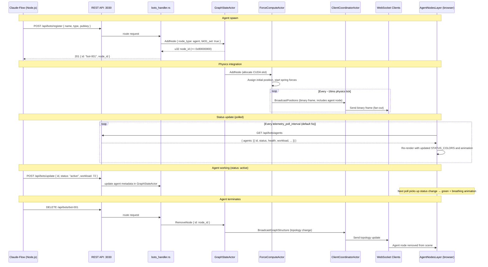
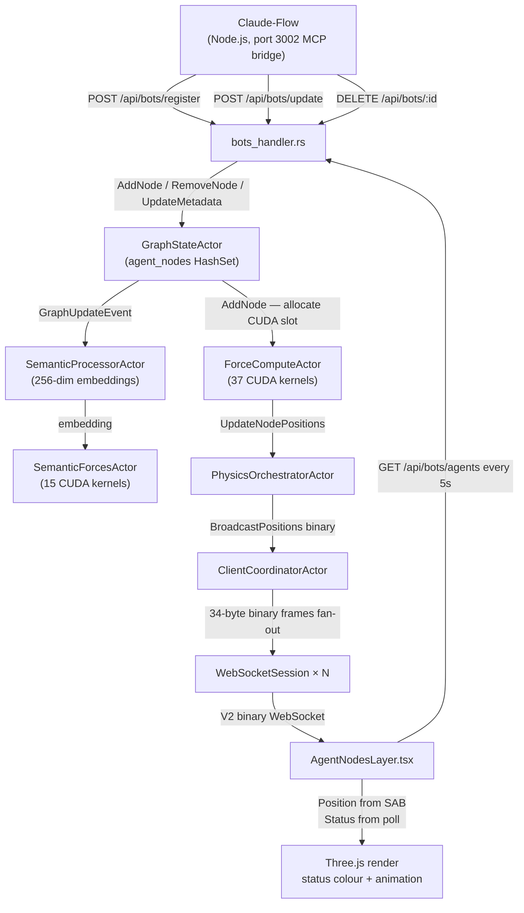

# Agent-to-Physics State Bridge

## Overview

Claude-Flow agents running in the Node.js multi-agent container are first-class citizens of the VisionClaw 3D graph. Every agent that registers with the backend becomes a graph node that participates in the GPU physics simulation alongside knowledge and ontology nodes. The backend assigns the agent node a position in 3D space, applies spring forces between it and related nodes, and streams that position to every connected WebSocket client at up to 60 FPS. When the agent changes status — spawning, executing, waiting, failing — the status field in its graph node metadata changes, and the client re-colours and re-animates the capsule geometry accordingly.

This document explains the full stack: how agent identity is encoded in u32 node IDs, how the `AgentNodesLayer` React component polls the backend for telemetry and maps it to colour and animation, and what happens to physics when an agent node is added or removed mid-simulation.

---

## Agent Node Identity

### Bit-flag encoding

Every graph node is addressed by a `u32`. The upper six bits carry type information; the lower 26 bits carry the sequential counter value assigned by `NEXT_NODE_ID`. The relevant bit assignments are:

| Bit | Mask | Meaning |
|-----|------|---------|
| 31 | `0x80000000` | Agent node |
| 30 | `0x40000000` | Knowledge node |
| 26–28 | `0x1C000000` | Ontology subtype |
| 0–25 | `0x03FFFFFF` | Sequential node ID |

Bit 31 being set means every agent node ID is numerically greater than `2,147,483,647` (`2^31 - 1`). This is relevant when comparing node IDs: JavaScript numbers are 64-bit floats, so a 32-bit unsigned value with bit 31 set must be handled with care — use `String()` coercion when storing IDs as Map keys or performing equality checks.

### GraphStateActor's agent set

`GraphStateActor` maintains a dedicated `agent_nodes: HashSet<u32>` alongside the main graph cache. This set is used when:

- Broadcasting graph structure changes — agent nodes are serialised separately so clients can apply agent-specific rendering
- Filtering `GET /api/graph/data?graph_type=agent` requests
- Cleaning up positions on agent deregistration

The `agent_nodes` set is in addition to the shared reverseNodeIdMap that covers all node types.

### Geometry

Agent nodes render with a distinct geometry in the client. From `first-graph.md` (section 6 deep-path note):

> "AgentCapsule is a Capsule of radius 0.3 height 0.6"

In practice, `AgentNodesLayer.tsx` uses a per-agent-type geometry rather than a single capsule for all agents. The type-to-geometry mapping is defined in the `AgentNode` sub-component:

| Agent type | THREE.js geometry |
|------------|-------------------|
| `researcher` | `OctahedronGeometry(1.0)` |
| `coder` | `BoxGeometry(1.5, 1.5, 1.5)` |
| `analyzer` | `TetrahedronGeometry(1.0)` |
| `tester` | `ConeGeometry(1.0, 2.0, 6)` |
| `optimizer` | `TorusGeometry(0.8, 0.3, 8, 12)` |
| `coordinator` | `IcosahedronGeometry(1.0)` |
| default (any other type) | `SphereGeometry(1.0, 16, 16)` |

All geometries are unit-sized; the actual rendered size is controlled by the mesh `scale` uniform, which is `nodeSize * (1 + workload / 100)`. `nodeSize` defaults to `1.5` and is configurable under `settings.agents.visualization.node_color`.

Knowledge nodes (Icosahedron r=0.5) and ontology nodes (Sphere r=0.5) use fixed geometries that do not change by subtype; only agent nodes have the per-type geometry dispatch.

---

## Agent State → Visual Encoding

### Status colour mapping

`AgentNodesLayer.tsx` defines `STATUS_COLORS` as the primary status indicator applied to the node body and label:

```
active  → #10b981  (emerald green)
idle    → #fbbf24  (amber / yellow)
error   → #ef4444  (red)
warning → #f97316  (orange)
```

The tutorial `first-graph.md` describes this in UI terms:

| Colour | Meaning |
|--------|---------|
| Green | Active / processing |
| Yellow | Waiting for input |
| Orange | Warning |
| Red | Error or blocked |

This aligns with the `STATUS_COLORS` map in `AgentNodesLayer.tsx`.

### Health-based glow colour

A second colour layer, `glowColor`, is derived from `agent.health` (0–100) rather than status. It is applied to the outer bioluminescent membrane sphere, the inner nucleus sphere, the health bar fill, and the workload arc:

| Health range | Glow colour |
|---|---|
| ≥ 95 | `#00FF00` (bright green) |
| ≥ 80 | `#2ECC71` (medium green) |
| ≥ 65 | `#F1C40F` (yellow) |
| ≥ 50 | `#F39C12` (amber) |
| ≥ 25 | `#E67E22` (orange) |
| < 25 | `#E74C3C` (red) |

### Animation by status

The `useFrame` hook drives three distinct animation modes:

**Active / Warning** — organic breathing animation: the main mesh scales between `scaledSize * 0.92` and `scaledSize * 1.08` on an asymmetric inhale/exhale cycle (`delta * 2` phase). The outer membrane breathes with a `0.3 radian` phase delay. The nucleus pulses its opacity between 0.2 and 0.5. The mesh rotates at `0.5 rad/s`.

**Error** — distress flicker: phase advances at `delta * 8`. Scaling is `scaledSize * (1 + |distress|)` where distress is the product of two sine waves, producing irregular spasming. The outer membrane expands and contracts sharply.

**Idle** — minimal life sign: mesh stays at base scale, nucleus pulses opacity between 0.05 and 0.15 at `delta * 0.5`.

### Workload arc

When `agent.status === 'active'` and `agent.workload > 0`, a torus arc rendered as a ring around the capsule shows the proportion of maximum workload. The arc covers `(workload / 100) * 2π` radians. This gives an at-a-glance CPU/task-load indicator without requiring a label.

### Label overlay

Each agent node renders a floating label via `@react-three/drei Text` (or `Html` on WebGPU renderers, due to a Troika `drawIndexed(Infinity)` limitation). The label shows:

- Line 1: `agent.type.toUpperCase()` in the status colour
- Line 2: `status | health%` in white
- Line 3 (optional): `agent.currentTask` in grey, truncated at `maxWidth: 10` (world units)

---

## State Sync Mechanism

### Registration path

When a Claude-Flow agent spawns, it announces itself to the Rust backend via the `/api/bots/register` endpoint. The `bots_handler.rs` handler creates a graph node with `node_type = agent`, sets bit 31 in the assigned u32 ID, adds it to `GraphStateActor.agent_nodes`, and enqueues an `AddNode` message to `GraphStateActor`. `GraphStateActor` in turn publishes a `GraphUpdateEvent` so `SemanticProcessorActor` generates an initial 256-dim embedding for the agent (using the agent name and description as content).

The registration response returns the assigned `bot_id`; the agent stores this for subsequent telemetry pushes.

### Telemetry polling

The `useAgentNodes` hook in `AgentNodesLayer.tsx` polls two endpoints on a configurable interval (default 5 seconds, configurable via `settings.agents.monitoring.telemetry_poll_interval`):

- `GET /api/bots/agents` → `{ agents: AgentNode[] }` — full status snapshot for all registered agents
- `GET /api/bots/data` → `{ edges: AgentConnection[] }` — active inter-agent connections

The polling interval is a floor: the component does not use WebSocket push for status updates. This means there is an inherent **up-to-5-second lag** between a status change in the Claude-Flow runtime and the visual colour change in the client.

### Physics position assignment

On `AddNode`, `GraphStateActor` notifies `ForceComputeActor` of the new node. `ForceComputeActor` allocates a slot in its CUDA position and velocity buffers and assigns the node an initial position (randomised within the scene bounding box). On the next physics tick, spring forces between the agent node and its connected knowledge nodes begin to pull it toward the cluster it is associated with.

The periodic full broadcast (every 300 iterations) ensures clients that connect after GPU convergence still receive the agent node's position. Agent nodes — being loosely connected relative to dense knowledge sub-graphs — tend to remain kinetically active longer, which means the delta-compressor in `BroadcastOptimizer` continues to include them in incremental frames.

### Deregistration path

When an agent terminates, it (or a cleanup process) calls `DELETE /api/bots/:id`. The `bots_handler.rs` handler sends `RemoveNode { id }` to `GraphStateActor`, which removes the node from the cache and the `agent_nodes` set, and broadcasts the topology change to all clients.

---

## Sequence Diagram: Agent Lifecycle



---

## Data Flow Diagram



---

## Reasoning State Visualisation

When an agent is in a long-running reasoning phase — such as a DeepSeek R1 chain-of-thought, a multi-step tool loop, or a Claude-Flow coordinator waiting on sub-agent results — the intermediate state is conveyed through the combination of `status` and `currentTask`:

- The agent pushes `POST /api/bots/update` with `{ status: "active", currentTask: "Analysing subgraph clustering..." }`. The `active` status triggers the organic breathing animation and the emerald `#10b981` body colour. The `currentTask` string appears in the floating label below the node.
- `workload` (0–100) drives the partial torus arc around the node: a full arc at `workload: 100` gives an at-a-glance indication that the agent is fully saturated.
- The glow membrane colour degrades from `#00FF00` toward red as `health` drops, providing a separate channel for system-level health independent of task status.

There is no sub-step progress signalled to the physics layer. The only granularity available is the coarse `status` enum plus the free-text `currentTask` field. If an agent transitions through intermediate tool calls, it must explicitly push `POST /api/bots/update` for each state change; the backend does not infer progress from Claude-Flow internal events.

For the `idle` status — used when an agent completes a task and is waiting for the next assignment — the amber `#fbbf24` body with the slow nucleus pulse (`delta * 0.5`) provides a visually quieter state than `active`, making it easy to distinguish working agents from waiting ones in a busy swarm.

---

## Known Limitations

### Polling latency

Status colour changes are poll-driven, not push-driven. With the default 5-second interval, a status transition from `active` to `error` may take up to 5 seconds to appear visually. For time-critical monitoring, lower `settings.agents.monitoring.telemetry_poll_interval` to 1–2 seconds, noting this increases REST load proportionally to the number of connected browser clients.

### No granular sub-task progress

Only coarse states (`active`, `idle`, `error`, `warning`) are available in the physics layer. Multi-step reasoning phases, individual tool calls, and internal sub-agent handoffs are not individually reflected in the 3D visualisation. The `currentTask` field accepts free text but is display-only; it does not affect physics parameters.

### One-way bridge

The Agent-to-Physics bridge is strictly one-directional. Agent nodes receive positions from the GPU physics simulation (spring-pulled toward associated knowledge nodes), but no API exists for an agent to query its own current 3D position, move itself, or influence physics parameters directly. The physics system treats agent nodes identically to knowledge nodes for force computation purposes.

### Fallback position stability

If an agent's position field is `{ x: 0, y: 0, z: 0 }` (i.e., the physics broadcast has not yet been received), `AgentNodesLayer.tsx` computes a deterministic fallback position from a hash of `agent.id`. This avoids z-fighting at the origin but may place the agent capsule in a visually odd location until the first physics frame arrives. The fallback is stable across re-renders for the same agent ID.

### Connection geometry limitation

`AgentConnection` rendering uses `THREE.LineBasicMaterial`. On WebGL, `linewidth > 1` is ignored on most GPUs due to the WebGL specification; all inter-agent connection lines render at 1px regardless of the `weight` field. The `lineWidth` computation (`connection.weight * 2`) therefore has no visual effect on WebGL renderers; only WebGPU renderers honour non-unit line widths.

---

## Cross-References

- `docs/explanation/actor-hierarchy.md` — `GraphStateActor` message contracts (`AddNode`, `RemoveNode`, `UpdatePositions`), `PhysicsOrchestratorActor` tick sequence, and `ClientCoordinatorActor` binary broadcast pipeline
- `docs/reference/agents-catalog.md` — complete VisionClaw agent skill catalog; the `type` field in `AgentNode` corresponds to agent skill identifiers from this catalog
- `docs/reference/rest-api.md` — `/api/bots/*` endpoint contracts; see the "AI / Agent Endpoints" section for request/response schemas
- `docs/explanation/client-architecture.md` — broader Three.js rendering pipeline within which `AgentNodesLayer` operates
- `client/src/features/visualisation/components/AgentNodesLayer.tsx` — authoritative source for `STATUS_COLORS`, `getGlowColor`, geometry dispatch, `useAgentNodes` polling hook, and animation behaviour
