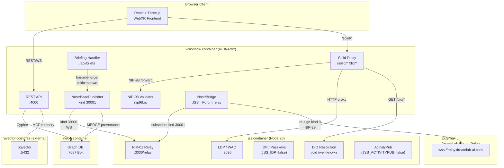
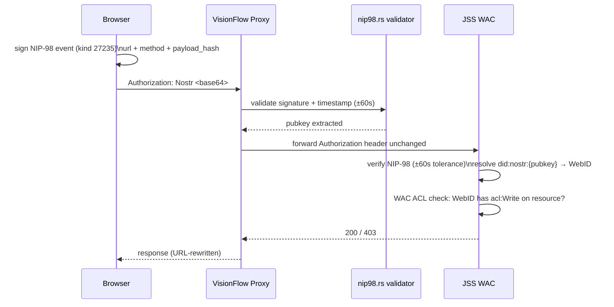
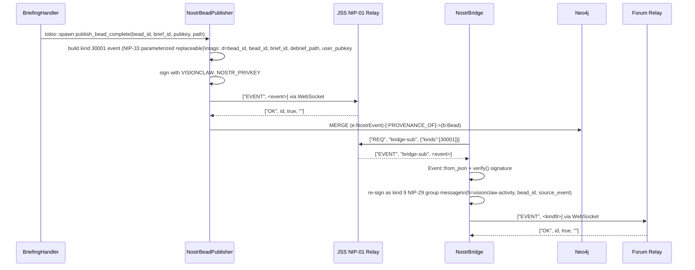

# JSS Integration Evaluation — April 2026

**Decision date:** 2026-04-09
**JSS version evaluated:** v0.0.86 (integrated at v0.0.35 Dec 2025, bumped Jan–Feb 2026)
**Status:** Implemented

---

## Three-Sidecar Architecture

VisionClaw operates three independent sidecar services alongside the main Rust/Actix backend. The diagram below shows the current data flows and integration points.



---

## Identity Stack

The NIP-98 / DID identity chain connects browser keypair to Solid ACLs:



---

## Feature Matrix

Capability coverage across JSS v0.0.86 features:

```mermaid
quadrantChart
    title JSS Features: Enabled vs VisionClaw Usage
    x-axis "Low VisionClaw Usage" --> "High VisionClaw Usage"
    y-axis "Disabled / Unused" --> "Enabled / Active"
    quadrant-1 Core (used + enabled)
    quadrant-2 Waste (enabled, unused)
    quadrant-3 Intentional off
    quadrant-4 Gap (used concept, disabled)
    LDP CRUD: [0.9, 0.9]
    WAC ACLs: [0.85, 0.85]
    NIP-98 Auth: [0.9, 0.9]
    WS Notifications: [0.6, 0.8]
    NIP-01 Relay: [0.8, 0.75]
    Mashlib UI: [0.1, 0.2]
    Git Backend: [0.05, 0.1]
    ActivityPub: [0.2, 0.1]
    IDP Passkeys: [0.5, 0.15]
    DID Resolution: [0.7, 0.6]
    Content Negotiation: [0.4, 0.7]
    Pod Provisioning: [0.8, 0.8]
```

---

## Gap Analysis Results

### Fixed This Session

| Gap | Severity | Fix Applied |
|-----|----------|-------------|
| NIP-98 timestamp mismatch: Rust 300s vs JSS 60s | HIGH | `TOKEN_MAX_AGE_SECONDS` → 60 in `nip98.rs` |
| DID endpoints not proxied (`/did/*`, `/.well-known/did.json`) | MEDIUM | Added `handle_did_wellknown` + `handle_did_proxy` in `solid_proxy_handler.rs` |
| `JSS_MASHLIB_CDN=true` breaks air-gapped deployments | HIGH | Set `false` + `JSS_MASHLIB=false` in `docker-compose.unified.yml` |
| No per-pod storage quota | MEDIUM | Added `JSS_DEFAULT_QUOTA=524288000` (500 MB) |
| Git HTTP backend enabled by default | MEDIUM | Added explicit `JSS_GIT=false` |
| No invite-only mode hook | LOW | Added `JSS_INVITE_ONLY=${JSS_INVITE_ONLY:-false}` |

### Previously Fixed (AQE Fleet, same session)

| Gap | Severity | Fix |
|-----|----------|-----|
| Relay URL SSRF via env injection | HIGH | Scheme validation in publisher + bridge |
| No event signature verification in bridge | HIGH | `Event::from_json + verify()` added |
| `VISIONCLAW_NOSTR_PRIVKEY` in shared env anchor | HIGH | Moved to service-specific env only |
| `SETTINGS_AUTH_BYPASS` always on in dev | HIGH | Changed to opt-in (`${..:-false}`) |

### Remaining (Backlog)

| Gap | Severity | Notes |
|-----|----------|-------|
| Pod directories never written (`ontology_contributions/` etc.) | MEDIUM | Provisioned but no write path exists in any handler |
| Nostr relay in-memory only — events lost on JSS restart | MEDIUM | 1000-event cap, no catchup/replay. Persistence requires RocksDB plugin or relay swap |
| `send_to_forum` opens new TCP connection per event | MEDIUM | Identified by AQE fleet, deferred. Needs persistent pool in `nostr_bridge.rs` |
| JSS v0.0.86 security issues (7 Medium open, 1 High git path traversal) | HIGH | git backend is now disabled; remaining 7 Medium need JSS upstream review |
| ActivityPub microfed unconfigured | LOW | Explicitly disabled; V2 item if DreamLab forum federation desired |

---

## Decision: Rust NIP-98 Re-implementation vs JSS IDP

### Question
Should VisionClaw move NIP-98 validation back into JSS (enable `JSS_IDP=true`) and remove `nip98.rs`?

### Analysis

**Arguments for enabling JSS IDP (`JSS_IDP=true`)**
- JSS v0.0.86 ships a complete NIP-98 / did:nostr / WebAuthn passkey IDP
- Eliminates timestamp mismatch (JSS validates its own tokens consistently)
- Passkeys/FIDO2 for users who don't have a Nostr keypair
- Reduces `solid_proxy_handler.rs` surface area significantly
- Single source of truth for identity in the Solid ecosystem

**Arguments for keeping Rust NIP-98 (`solid_proxy_handler.rs`)**
- Proxy-layer defense: JSS may be unavailable; Rust validates before forwarding
- Existing NIP-98 implementation also signs server requests (`SOLID_PROXY_SECRET_KEY` fallback)
- `nip98.rs` is also used for outbound NIP-98 generation (publisher, bridge tokens)
- JSS IDP adds a stateful session layer we don't currently need
- Timestamp fix closes the main compatibility issue

### Decision

**Keep `nip98.rs`. Fix timestamp (done). Do not enable `JSS_IDP=true` now.**

Rationale:
1. The proxy validates before forwarding — defence in depth, not duplication
2. `nip98.rs` also generates tokens (publisher/bridge); JSS IDP only validates
3. The timestamp mismatch was the source of prod auth failures — now fixed at 60s
4. JSS IDP is a V2 item if passkey authentication becomes a user requirement
5. Enabling `JSS_IDP=true` without also migrating session storage would split identity state across two services

If passkeys are required in future: enable `JSS_IDP=true` + set `JSS_SESSION_SECRET`, remove Rust-side NIP-98 *validation* (keep generation), update `solid_proxy_handler.rs` to delegate all auth to JSS.

---

## Decision: JSS Containerisation

### Question
Should JSS be containerised as a Docker sidecar?

### Answer

**JSS is already containerised.** It has been a `docker-compose.unified.yml` service (`jss`) since initial integration at v0.0.35. The service uses `JavaScriptSolidServer/Dockerfile.jss` (Node 20 Alpine), runs on port 3030, and has been in the `development`, `dev`, `production`, and `prod` profiles since day one.

This question is therefore closed. The only remaining action was the configuration hardening applied in this session (CDN flag, quota, git=false).

---

## Nostr Bead Provenance Wire (Completed)

The highest-value JSS capability identified in the gap analysis was the NIP-01 relay at `wss://jss/relay`. Completed in session 2026-04-09:



---

## Related Documents

- [Solid Sidecar Architecture](solid-sidecar-architecture.md) — original integration design
- [Neo4j Schema Reference](../../reference/database/neo4j-schema.md) — NostrEvent + Bead node labels
- [Configuration Guide](../../how-to/operations/configuration.md) — Nostr env vars
- [REST API Reference](../../reference/api/rest-api-reference.md) — Briefing API
- [Session Handoff 2026-04-09](../../session-handoff-2026-04-09.md) — implementation log
