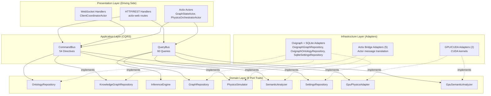
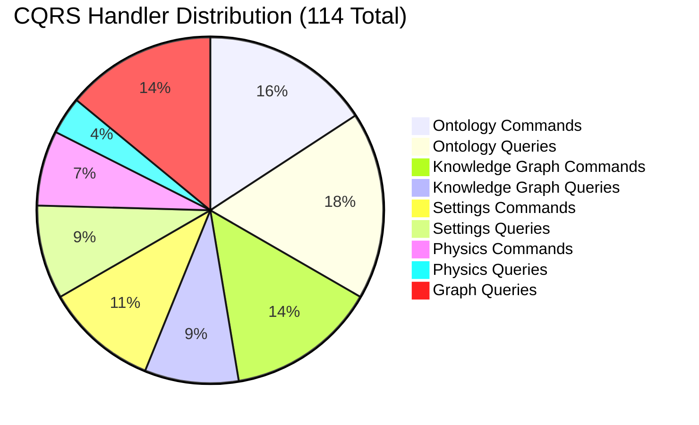
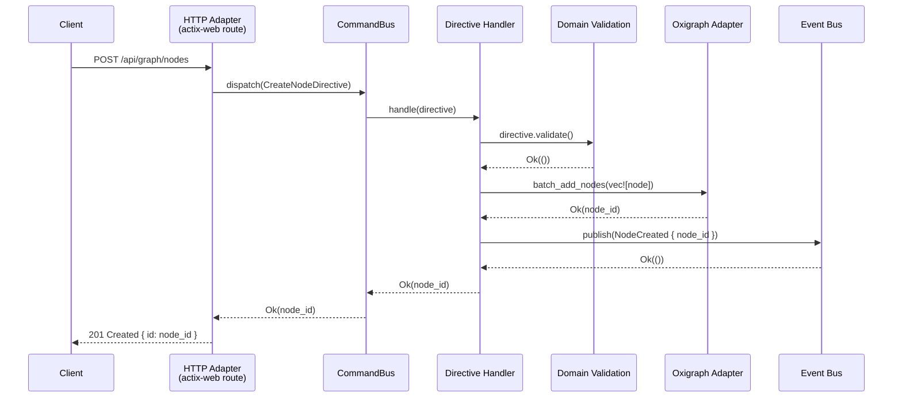
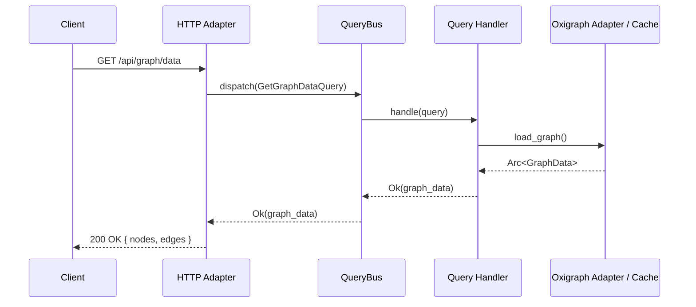
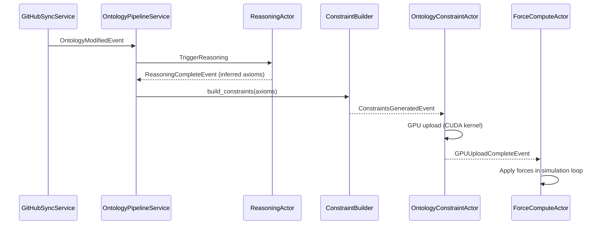

# VisionClaw Backend Architecture — Hexagonal CQRS

> **Adapter layer updated (ADR-11)**: the persistence adapters described below changed. The graph
> store is now an **embedded Oxigraph** RDF triple store (`OxigraphGraphRepository`,
> `OxigraphOntologyRepository`) and settings persist in SQLite (`SqliteSettingsRepository`). The
> former `Neo4jAdapter` / `Neo4jGraphRepository` / `Neo4jSettingsRepository` /
> `Neo4jOntologyRepository` are **deleted**, and Bolt/Cypher no longer apply. The hexagonal
> *structure* is unchanged — only the infrastructure-side adapters were swapped — so wherever this
> document says "Neo4j adapter", read "Oxigraph/SQLite adapter".

VisionClaw's backend is built on hexagonal (ports-and-adapters) architecture combined with Command Query Responsibility Segregation (CQRS). The domain core is insulated from infrastructure by 9 port traits and their adapter implementations. All state mutations and reads pass through 114 typed CQRS handlers, routed via a type-safe bus.

---

## 1. Architecture Overview

The system is divided into four concentric layers. The Presentation layer (Actix actors, REST handlers, WebSocket handlers) receives external inputs and dispatches them as commands or queries. The Application layer hosts the CQRS bus and 114 handlers. The Domain layer defines 9 port traits — technology-agnostic capability boundaries. The Infrastructure layer provides adapter implementations against the embedded Oxigraph store, SQLite, CUDA, Actix, GitHub, and Whelk.



### Migration Context

The architecture was completed in December 2025 after migrating from a monolithic `GraphServiceActor` (48K tokens). Key outcomes:

| Before (Oct 2025) | After (Dec 2025) |
|---|---|
| Monolithic GraphServiceActor | 21 modular actors |
| Stale in-memory cache | Embedded Oxigraph store as source of truth |
| No CQRS separation | 54 directives + 60 queries |
| Fragmented persistence | Unified embedded Oxigraph store (+ SQLite settings) |
| Tight coupling | 9 ports, 12 adapters |

---

## 2. The 9 Port Traits

All ports live in `src/ports/`. Every trait uses `#[async_trait]` and requires `Send + Sync` so instances can be shared across Actix worker threads as `Arc<dyn PortTrait>`.

### Port 1: OntologyRepository

**File**: `src/ports/ontology_repository.rs`
**Purpose**: OWL class, property, and axiom storage; validation; inference result persistence.
**Implemented by**: `OxigraphOntologyRepository`

Key methods: `save_class`, `get_classes`, `save_axioms`, `get_axioms`, `save_inferred_axioms`, `validate_ontology`, `health_check`.

### Port 2: KnowledgeGraphRepository

**File**: `src/ports/knowledge_graph_repository.rs`
**Purpose**: Main knowledge graph CRUD, batch operations, position persistence, node search.
**Implemented by**: `OxigraphGraphRepository`, `ActorGraphRepository`

```rust
#[async_trait]
pub trait KnowledgeGraphRepository: Send + Sync {
    async fn load_graph(&self) -> Result<Arc<GraphData>>;
    async fn save_graph(&self, graph: &GraphData) -> Result<()>;
    async fn add_node(&self, node: &Node) -> Result<u32>;
    async fn batch_add_nodes(&self, nodes: Vec<Node>) -> Result<Vec<u32>>;
    async fn update_node(&self, node: &Node) -> Result<()>;
    async fn remove_node(&self, node_id: u32) -> Result<()>;
    async fn get_node(&self, node_id: u32) -> Result<Option<Node>>;
    async fn search_nodes_by_label(&self, label: &str) -> Result<Vec<Node>>;
    async fn get_node_edges(&self, node_id: u32) -> Result<Vec<Edge>>;
    async fn batch_update_positions(&self, positions: Vec<(u32, f32, f32, f32)>) -> Result<()>;
    async fn get_statistics(&self) -> Result<GraphStatistics>;
    async fn health_check(&self) -> Result<bool>;
}
```

### Port 3: InferenceEngine

**File**: `src/ports/inference_engine.rs`
**Purpose**: OWL reasoning — load ontology, infer axioms, check consistency, explain entailments.
**Implemented by**: `WhelkInferenceEngine` (Rust OWL EL++ reasoner)

Key methods: `load_ontology`, `infer_axioms`, `check_consistency`, `classify_hierarchy`, `get_entailments`.

### Port 4: SettingsRepository

**File**: `src/ports/settings_repository.rs`
**Purpose**: User and system configuration persistence with batch operations and physics profiles.
**Implemented by**: `SqliteSettingsRepository` (active — ADR-11; the former `Neo4jSettingsRepository` was deleted)

```rust
#[async_trait]
pub trait SettingsRepository: Send + Sync {
    async fn get_setting(&self, key: &str) -> Result<Option<SettingValue>>;
    async fn set_setting(&self, key: &str, value: SettingValue, description: Option<&str>) -> Result<()>;
    async fn delete_setting(&self, key: &str) -> Result<()>;
    async fn get_settings_batch(&self, keys: &[String]) -> Result<HashMap<String, SettingValue>>;
    async fn set_settings_batch(&self, updates: HashMap<String, SettingValue>) -> Result<()>;
    async fn load_all_settings(&self) -> Result<Option<AppFullSettings>>;
    async fn save_all_settings(&self, settings: &AppFullSettings) -> Result<()>;
    async fn get_physics_settings(&self, profile_name: &str) -> Result<PhysicsSettings>;
    async fn save_physics_settings(&self, profile_name: &str, settings: &PhysicsSettings) -> Result<()>;
    async fn list_physics_profiles(&self) -> Result<Vec<String>>;
    async fn export_settings(&self) -> Result<serde_json::Value>;
    async fn import_settings(&self, settings_json: &serde_json::Value) -> Result<()>;
    async fn health_check(&self) -> Result<bool>;
}
```

### Port 5: GpuPhysicsAdapter

**File**: `src/ports/gpu_physics_adapter.rs`
**Purpose**: GPU-accelerated force computation and device management.
**Implemented by**: `ActixPhysicsAdapter`

Key methods: `batch_force_compute`, `optimize_layout`, `update_positions`, `get_device_info`, `allocate_buffers`.

### Port 6: GpuSemanticAnalyzer

**File**: `src/ports/gpu_semantic_analyzer.rs`
**Purpose**: GPU-accelerated PageRank, clustering, and pathfinding.
**Implemented by**: `GpuSemanticAnalyzerAdapter`

Key methods: `compute_pagerank`, `detect_communities`, `find_shortest_path`, `compute_embeddings`.

### Port 7: GraphRepository

**File**: `src/ports/graph_repository.rs`
**Purpose**: Core graph node and edge access, used by actors and CQRS handlers for in-memory graph state.
**Implemented by**: `OxigraphGraphRepository`, `ActorGraphRepository`

```rust
#[async_trait]
pub trait GraphRepository: Send + Sync {
    async fn get_node(&self, id: u32) -> Result<Node, RepositoryError>;
    async fn add_node(&self, node: Node) -> Result<u32, RepositoryError>;
    async fn remove_node(&self, id: u32) -> Result<(), RepositoryError>;
    async fn get_edges(&self, node_id: u32) -> Result<Vec<Edge>, RepositoryError>;
    async fn add_edge(&self, edge: Edge) -> Result<(), RepositoryError>;
}
```

### Port 8: PhysicsSimulator

**File**: `src/ports/physics_simulator.rs`
**Purpose**: Abstract physics simulation step computation.
**Implemented by**: `PhysicsOrchestratorAdapter`

Key methods: `simulate_step`, `calculate_forces`, `apply_constraints`, `get_positions`.

### Port 9: SemanticAnalyzer

**File**: `src/ports/semantic_analyzer.rs`
**Purpose**: CPU-based community detection and semantic pattern analysis.
**Implemented by**: `ActixSemanticAdapter`

Key methods: `analyze_communities`, `detect_patterns`, `compute_similarity`, `score_importance`.

---

## 3. The Adapters

Adapters live in `src/adapters/` and are injected via `Arc<dyn PortTrait>` at startup. Swapping a persistence adapter for an in-memory test double requires no changes to the domain or application layers.

### Persistence Adapters (Oxigraph + SQLite, ADR-11)

| Adapter | Implements | Technology | Typical Latency |
|---|---|---|---|
| `OxigraphGraphRepository` | `GraphRepository`, `KnowledgeGraphRepository` | Embedded Oxigraph, SPARQL 1.1 (RocksDB-backed) | ~2ms simple, ~12ms full graph |
| `OxigraphOntologyRepository` | `OntologyRepository` | Embedded Oxigraph, SPARQL traversal | ~25ms traversal |
| `SqliteSettingsRepository` | `SettingsRepository` | SQLite + LRU cache | ~3ms (cached <0.1ms) |
| `ActorGraphRepository` | `GraphRepository` | Actor message bridge | ~15ms (actor overhead) |

> The former `Neo4jAdapter` / `Neo4jGraphRepository` / `Neo4jSettingsRepository` /
> `Neo4jOntologyRepository` (Bolt + Cypher) were **deleted** in ADR-11.

The `ActorGraphRepository` is notable: it implements the `GraphRepository` port by sending Actix messages to `GraphStateActor`. This allows non-actor code (CQRS handlers) to access actor-managed state through the standard port interface.

```rust
// src/adapters/actor_graph_repository.rs
pub struct ActorGraphRepository {
    graph_actor: Addr<GraphStateActor>,
}

#[async_trait]
impl GraphRepository for ActorGraphRepository {
    async fn get_node(&self, id: u32) -> Result<Node, RepositoryError> {
        self.graph_actor
            .send(GetNode { id })
            .await
            .map_err(|e| RepositoryError::Actor(e.to_string()))?
    }
}
```

### GPU Adapters (2)

| Adapter | Implements | Technology | Typical Latency |
|---|---|---|---|
| `GpuSemanticAnalyzerAdapter` | `GpuSemanticAnalyzer` | CUDA kernels (21 total) | ~4ms per step |
| `ActixPhysicsAdapter` | `GpuPhysicsAdapter` | Actor wrapper over CUDA | ~16ms per step |

### Actix Bridge Adapters (5)

| Adapter | Implements | Technology | Typical Latency |
|---|---|---|---|
| `ActixSemanticAdapter` | `SemanticAnalyzer` | Actor wrapper | ~20ms per analysis |
| `PhysicsOrchestratorAdapter` | `PhysicsSimulator` | Actor coordination | ~16ms per step |
| `WhelkInferenceEngine` | `InferenceEngine` | Rust OWL EL++ reasoner | ~100ms per reasoning |
| `ActixWebSocketAdapter` | (implicit) | WebSocket protocol | ~3ms per broadcast |
| `ActixHttpAdapter` | (implicit) | HTTP handlers | <1ms routing |

---

## 4. CQRS Handler Taxonomy

114 handlers are distributed across 5 domains. Commands (directives) mutate state; queries read state without side effects.



| Domain | Queries | Directives | Total |
|---|---|---|---|
| Ontology | 20 | 18 | 38 |
| Knowledge Graph | 10 | 16 | 26 |
| Settings | 10 | 12 | 22 |
| Physics | 4 | 8 | 12 |
| Graph | 16 | 0 | 16 |
| **Total** | **60** | **54** | **114** |

### Bus Implementation

Both buses use `TypeId` for compile-time safe routing:

```rust
// src/cqrs/bus.rs
pub struct CommandBus {
    handlers: HashMap<TypeId, Box<dyn AnyHandler>>,
}

impl CommandBus {
    pub fn register<C, H>(&mut self, handler: H)
    where
        C: 'static,
        H: DirectiveHandler<C> + 'static,
    {
        self.handlers.insert(TypeId::of::<C>(), Box::new(handler));
    }

    pub async fn dispatch<C: 'static>(&self, command: C) -> H::Result {
        let handler = self.handlers.get(&TypeId::of::<C>())
            .ok_or(BusError::NoHandler)?;
        handler.handle(command).await
    }
}
```

Both `CommandBus` and `QueryBus` enforce a **30-second timeout** on `execute()` calls. If a handler does not return within 30 seconds, the bus returns a `BusError::Timeout` error. This prevents runaway handlers from blocking the bus indefinitely.

### Bus Test Coverage

CQRS bus tests (previously commented out) are now re-enabled and passing. These tests validate handler registration, dispatch routing, timeout behaviour, and error propagation.

### Ontology Handler Honesty

Four ontology handler stubs that previously returned silent `Ok(())` responses now return honest errors indicating the operation is not yet implemented. Specifically, `ExportOntologyQuery` returns a structured error rather than fake XML output. This ensures callers receive accurate feedback rather than silently succeeding with empty or invalid data.

---

## 5. Command Flow (Request Lifecycle)



Every directive follows a 4-step pattern:

1. **Validate** — the directive struct implements `validate()` before any I/O.
2. **Persist** — the handler calls the injected port trait method.
3. **Emit event** — a `DomainEvent` is published to the `EventBus`.
4. **Return result** — typed result propagates back through the bus.

---

## 6. Query Flow



Query handlers are read-only. They never publish domain events and never modify state. This separation allows query paths to be independently optimised — for example, adding a Redis cache or read replica — without affecting write consistency.

---

## 7. Event-Driven Architecture

### Domain Events

Domain events are emitted after every successful directive and stored in the `EventStore` for audit trails and replay:

```rust
#[derive(Debug, Clone, Serialize, Deserialize)]
pub enum GraphEvent {
    NodeCreated { node_id: u32, metadata_id: String, label: String, timestamp: DateTime<Utc> },
    NodeDeleted { node_id: u32, timestamp: DateTime<Utc> },
    EdgeCreated { edge_id: String, source: u32, target: u32, edge_type: String, timestamp: DateTime<Utc> },
    NodePositionChanged { node_id: u32, new_position: (f32, f32, f32), source: UpdateSource, timestamp: DateTime<Utc> },
    PositionsUpdated { node_ids: Vec<u32>, count: usize, source: UpdateSource, timestamp: DateTime<Utc> },
    GraphSyncCompleted { total_nodes: usize, total_edges: usize, timestamp: DateTime<Utc> },
}
```

### Event Bus Infrastructure

```rust
pub struct EventBus {
    subscribers: Arc<RwLock<HashMap<String, Vec<Arc<dyn EventHandler>>>>>,
    middleware: Arc<RwLock<Vec<Arc<dyn EventMiddleware>>>>,
    sequence: Arc<RwLock<i64>>,
}
```

The middleware pipeline runs for every published event:

| Middleware | Purpose |
|---|---|
| `LoggingMiddleware` | Structured event logging |
| `MetricsMiddleware` | Performance counters |
| `ValidationMiddleware` | Payload schema validation |
| `EnrichmentMiddleware` | Adds correlation IDs and timestamps |
| `RetryMiddleware` | Exponential backoff on transient handler failures |

### Event Sourcing

The `EventStore` provides full event history for aggregate reconstruction:

```rust
pub trait EventRepository {
    async fn save(&self, event: &StoredEvent) -> EventResult<i64>;
    async fn get_by_aggregate(&self, aggregate_id: &str) -> EventResult<Vec<StoredEvent>>;
    async fn get_since(&self, sequence: i64) -> EventResult<Vec<StoredEvent>>;
}
```

### Ontology Pipeline Events

The GitHubSyncService triggers a chain of domain events that flow through the entire system:



---

## 8. Error Boundaries

Errors are domain-typed at each layer. Port traits define their own error enums (`SettingsRepositoryError`, `KnowledgeGraphRepositoryError`, etc.) that are mapped to application-level `DomainError` at the handler boundary.

| Layer | Error Type | Strategy |
|---|---|---|
| Adapter (Oxigraph) | `RepositoryError::DatabaseError` | Retry 3× with backoff |
| Adapter (CUDA) | `GpuError::OutOfMemory` | Escalate to supervisor, CPU fallback |
| Handler | `DomainError` | Return to bus, propagate to HTTP layer |
| Bus | `BusError::NoHandler` | 500 Internal Server Error |
| HTTP | `actix_web::Error` | Structured JSON error response |

Infrastructure errors never cross the port boundary as raw types. Adapters catch driver-specific errors and convert them to port error variants before returning, ensuring the domain layer remains insulated from technology details.

---

## 9. Directory Structure

```
src/
├── application/              # CQRS layer
│   ├── graph/
│   │   ├── commands.rs       # Write operation structs
│   │   ├── command_handlers.rs
│   │   ├── queries.rs        # Read operation structs
│   │   └── query_handlers.rs
│   ├── ontology/
│   │   ├── directives.rs
│   │   └── queries.rs
│   ├── physics/
│   ├── settings/
│   └── events.rs             # Domain event definitions
│
├── domain/                   # Domain layer (business logic)
│   ├── events.rs
│   └── services/
│       ├── physics_service.rs
│       └── semantic_service.rs
│
├── ports/                    # Port interfaces (9 traits)
│   ├── ontology_repository.rs
│   ├── knowledge_graph_repository.rs
│   ├── inference_engine.rs
│   ├── settings_repository.rs
│   ├── gpu_physics_adapter.rs
│   ├── gpu_semantic_analyzer.rs
│   ├── graph_repository.rs
│   ├── physics_simulator.rs
│   └── semantic_analyzer.rs
│
├── adapters/                 # Adapter implementations (ADR-11)
│   ├── oxigraph_graph_repository.rs     # GraphRepository / KnowledgeGraphRepository (embedded Oxigraph)
│   ├── oxigraph_ontology_repository      # OntologyRepository (module in mod.rs)
│   ├── sqlite_settings_repository.rs    # SettingsRepository (SQLite)
│   ├── actor_graph_repository.rs
│   ├── gpu_semantic_analyzer.rs
│   ├── actix_physics_adapter.rs
│   ├── actix_semantic_adapter.rs
│   ├── physics_orchestrator_adapter.rs
│   └── whelk_inference_engine            # WhelkInferenceEngine (module in mod.rs)
│
└── infrastructure/           # Cross-cutting concerns
    ├── event_bus.rs
    └── cache_service.rs
```

---

## 10. Performance Characteristics

| Operation | Typical Latency |
|---|---|
| CQRS handler dispatch | <1 ms |
| Oxigraph simple query | 2–3 ms |
| Oxigraph full graph load | ~12 ms |
| Settings read (cached) | <0.1 ms |
| Settings read (uncached) | ~3 ms |
| GPU physics step | ~4 ms |
| WebSocket broadcast | ~3 ms |
| Whelk OWL reasoning | ~100 ms |
| Event publication | <10 ms |

---

## Appendix: CQRS Directive Handler Template

Use this template when adding new directive handlers. The pattern is: validate → persist → emit event → return result.

### Directive Struct

```rust
// src/application/graph/directives.rs
use hexser::{Directive, DirectiveHandler, HexResult, HexsError};
use std::sync::Arc;
use crate::application::events::{DomainEventPublisher, GraphEvent};
use crate::ports::graph_repository::GraphRepository;

#[derive(Debug, Clone)]
pub struct CreateNode {
    pub node: Node,
}

impl Directive for CreateNode {
    fn validate(&self) -> HexResult<()> {
        if self.node.metadata_id.is_empty() {
            return Err(HexsError::validation("Node metadata_id cannot be empty"));
        }
        if self.node.label.is_empty() {
            return Err(HexsError::validation("Node label cannot be empty"));
        }
        Ok(())
    }
}
```

### Handler Struct

```rust
pub struct CreateNodeHandler {
    repository: Arc<dyn GraphRepository>,
    event_publisher: Arc<dyn DomainEventPublisher>,
}

impl CreateNodeHandler {
    pub fn new(
        repository: Arc<dyn GraphRepository>,
        event_publisher: Arc<dyn DomainEventPublisher>,
    ) -> Self {
        Self { repository, event_publisher }
    }
}

impl DirectiveHandler<CreateNode> for CreateNodeHandler {
    fn handle(&self, directive: CreateNode) -> HexResult<()> {
        // 1. Validate
        directive.validate()?;

        let node = directive.node.clone();
        let repository = self.repository.clone();
        let event_publisher = self.event_publisher.clone();

        tokio::runtime::Handle::current().block_on(async move {
            // 2. Persist via port
            repository
                .add_nodes(vec![node.clone()])
                .await
                .map_err(|e| HexsError::adapter("E-GRAPH-CREATE-001", &format!("{}", e)))?;

            // 3. Emit domain event
            event_publisher
                .publish(GraphEvent::NodeCreated {
                    node_id: node.id,
                    metadata_id: node.metadata_id.clone(),
                    label: node.label.clone(),
                    timestamp: chrono::Utc::now(),
                })
                .map_err(|e| HexsError::adapter("E-GRAPH-CREATE-002", &format!("{}", e)))?;

            Ok(())
        })
    }
}
```

### AppState Wiring

```rust
// src/app_state.rs
let unified_graph_repo = Arc::new(OxigraphGraphRepository::open(&data_dir)?); // embedded RDF store (ADR-11)
let event_publisher = Arc::new(InMemoryEventBus::new());

command_bus.register::<CreateNode, _>(CreateNodeHandler::new(
    Arc::clone(&unified_graph_repo),
    Arc::clone(&event_publisher),
));
```

### Error Code Convention

| Prefix | Domain |
|---|---|
| `E-GRAPH-CREATE-*` | Graph creation errors |
| `E-GRAPH-UPDATE-*` | Graph update errors |
| `E-GRAPH-DELETE-*` | Graph deletion errors |
| `E-GRAPH-BATCH-*` | Batch operation errors |
| `E-ONTO-*` | Ontology errors |
| `E-SETTINGS-*` | Settings errors |
| `E-PHYSICS-*` | Physics errors |

---

## See Also

- [Actor System Hierarchy](actor-hierarchy.md) — the 21-actor Actix supervision tree
- [System Overview](system-overview.md) — complete hexagonal architecture overview including port definitions
- [Technology Choices](technology-choices.md) — Rust, Actix-Web, and graph-store (embedded Oxigraph) technology rationale
