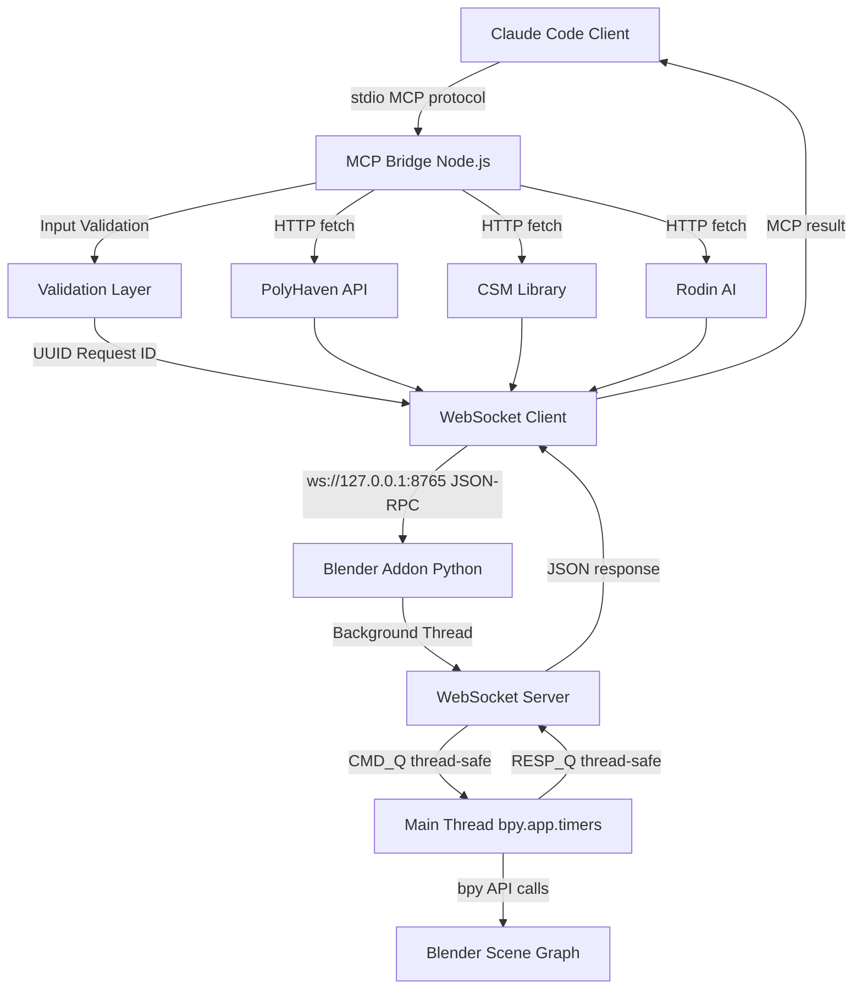
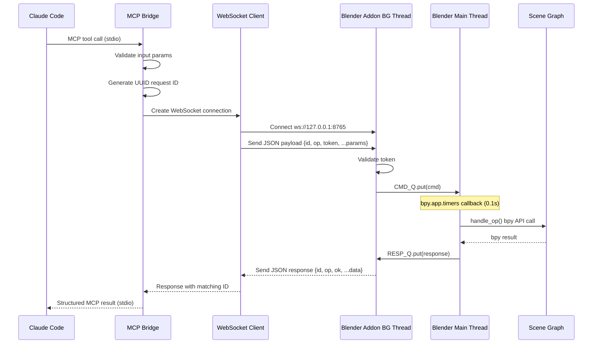
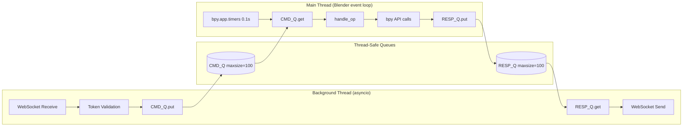
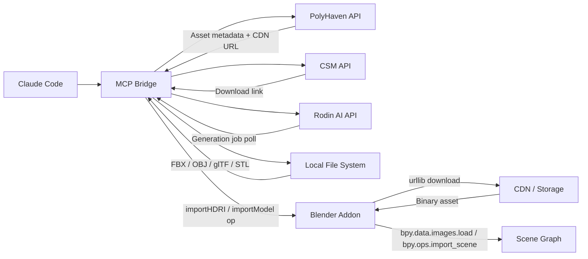

# Blender MCP Unified System Architecture
## Technical Architecture for Blender 5.x on Linux

**Version:** 1.0
**Date:** 2025-12-18
**Target:** Blender 5.x, Linux (Ubuntu 24+), Claude Code Integration
**Status:** Architecture Design Phase

---

## Executive Summary

This document defines the complete technical architecture for the Unified Blender MCP system, enabling Claude Code to control Blender 5.x remotely via WebSocket RPC with MCP tool integration. The system consists of two components:

1. **Blender Addon** - Python WebSocket server running inside Blender's process
2. **MCP Bridge** - TypeScript/Node.js bridge exposing Blender operations as MCP tools

The architecture prioritizes thread safety, security, extensibility, and seamless integration with external asset libraries (PolyHaven, CSM, Rodin).

---

## 1. System Architecture Overview

### Architecture Overview



### 1.1 Component Diagram

```
┌─────────────────────────────────────────────────────────────────┐
│                        Claude Code Client                        │
│                  (claude.ai/code interface)                      │
└──────────────────────────┬──────────────────────────────────────┘
                           │ stdio (MCP protocol)
                           │
┌──────────────────────────▼──────────────────────────────────────┐
│                      MCP Bridge (Node.js)                        │
│  ┌──────────────────────────────────────────────────────────┐   │
│  │ MCP Server (stdio)                                       │   │
│  │  - Tool registry (ping, list_objects, add_primitive...)  │   │
│  │  - Input validation (requireString, requireVec3...)      │   │
│  │  - Request ID generation (UUID v4)                       │   │
│  └───────────────────┬──────────────────────────────────────┘   │
│                      │                                           │
│  ┌───────────────────▼──────────────────────────────────────┐   │
│  │ WebSocket Client                                         │   │
│  │  - Connection per request (stateless)                    │   │
│  │  - Timeout handling (1500ms default)                     │   │
│  │  - Token injection (BLENDER_RPC_TOKEN)                   │   │
│  └───────────────────┬──────────────────────────────────────┘   │
└────────────────────────┼──────────────────────────────────────┬─┘
                         │ ws://127.0.0.1:8765                   │
                         │ (JSON-RPC over WebSocket)             │
┌────────────────────────▼──────────────────────────────────────┐│
│              Blender Addon (Python 3.11+)                      ││
│  ┌──────────────────────────────────────────────────────────┐ ││
│  │ Background Thread (asyncio event loop)                   │ ││
│  │  - WebSocket server (websockets library)                 │ ││
│  │  - Connection handler (accept/receive/send)              │ ││
│  │  - Token validation (optional)                           │ ││
│  │  - Request queueing → CMD_Q                              │ ││
│  └───────────────────┬──────────────────────────────────────┘ ││
│                      │ queue (thread-safe)                     ││
│  ┌───────────────────▼──────────────────────────────────────┐ ││
│  │ Main Thread (Blender event loop)                         │ ││
│  │  - bpy.app.timers callback (0.1s interval)               │ ││
│  │  - Command queue consumer                                │ ││
│  │  - Operation handler (handle_op)                         │ ││
│  │  - Response queueing → RESP_Q                            │ ││
│  └───────────────────┬──────────────────────────────────────┘ ││
│                      │ bpy API calls (thread-safe)             ││
│  ┌───────────────────▼──────────────────────────────────────┐ ││
│  │ Blender Scene Graph                                      │ ││
│  │  - Objects (meshes, lights, cameras)                     │ ││
│  │  - Materials & textures                                  │ ││
│  │  - Modifiers & constraints                               │ ││
│  │  - Collections & hierarchy                               │ ││
│  └──────────────────────────────────────────────────────────┘ ││
└────────────────────────────────────────────────────────────────┘│
                                                                  │
┌─────────────────────────────────────────────────────────────────┘
│ External Asset Integrations (via MCP Bridge)
│  - PolyHaven API (materials, HDRIs, textures)
│  - CSM (3D model library, PBR materials)
│  - Rodin AI (generative 3D models)
│  - Local file system (FBX, OBJ, glTF import)
└─────────────────────────────────────────────────────────────────
```

### 1.2 Data Flow Sequence

### Request/Response Sequence



#### Request Flow (Claude Code → Blender)

```
1. User issues command in Claude Code
   ↓
2. MCP Bridge receives tool call via stdio
   ↓
3. Input validation (types, bounds, required fields)
   ↓
4. Generate unique request ID (UUID)
   ↓
5. Create WebSocket connection to ws://127.0.0.1:8765
   ↓
6. Inject token if BLENDER_RPC_TOKEN is set
   ↓
7. Send JSON payload: {"id": "...", "op": "...", ...params}
   ↓
8. Blender WebSocket handler receives on background thread
   ↓
9. Enqueue command to CMD_Q (thread-safe queue)
   ↓
10. bpy.app.timers callback (main thread) drains CMD_Q
   ↓
11. handle_op() executes whitelisted operation
   ↓
12. Response enqueued to RESP_Q
   ↓
13. Background thread sends response via WebSocket
   ↓
14. MCP Bridge receives response (with matching ID)
   ↓
15. Return structured result to Claude Code via stdio
```

#### Error Flow

```
Error at any step:
  ↓
- MCP Bridge: Validation error → return error to Claude Code
- Blender Addon: Operation error → {"ok": false, "error": "msg"}
- Timeout: No response in 1500ms → connection timeout error
- Token mismatch: {"ok": false, "error": "unauthorized"}
```

---

## 2. WebSocket Message Protocol

### 2.1 Request Format

**Base Structure:**
```json
{
  "id": "string (UUID v4)",
  "op": "string (operation name)",
  "token": "string (optional, if BLENDER_RPC_TOKEN set)"
}
```

**Operation-Specific Parameters:**

```typescript
// Example: add_primitive
{
  "id": "550e8400-e29b-41d4-a716-446655440000",
  "op": "add_primitive",
  "type": "cube" | "uv_sphere" | "ico_sphere" | "cylinder" | "cone" | "torus",
  "location": [x, y, z],  // optional, default [0, 0, 0]
  "token": "secret123"     // optional
}

// Example: move_object
{
  "id": "...",
  "op": "move_object",
  "name": "Cube",
  "location": [1.0, 2.0, 3.0],
  "token": "secret123"
}

// Example: apply_transform
{
  "id": "...",
  "op": "apply_transform",
  "name": "Cube",
  "location": [x, y, z],  // optional
  "rotation": [rx, ry, rz],  // optional (Euler angles, radians)
  "scale": [sx, sy, sz],   // optional
  "token": "secret123"
}
```

### 2.2 Response Format

**Base Structure:**
```json
{
  "id": "string (matches request ID)",
  "op": "string (matches request op)",
  "ok": boolean,
  "error": "string (only if ok=false)"
}
```

**Success Response Examples:**

```json
// ping
{
  "id": "...",
  "op": "ping",
  "ok": true,
  "version": "5.0.0",
  "ts": 1734566400.123
}

// list_objects
{
  "id": "...",
  "op": "list_objects",
  "ok": true,
  "objects": ["Cube", "Light", "Camera"]
}

// move_object
{
  "id": "...",
  "op": "move_object",
  "ok": true,
  "name": "Cube",
  "location": [1.0, 2.0, 3.0]
}
```

**Error Response Example:**

```json
{
  "id": "...",
  "op": "move_object",
  "ok": false,
  "error": "Object 'Cube123' not found in scene"
}
```

### 2.3 Protocol Extensions (Future)

**Binary Payload Support:**
- For large data transfers (textures, meshes)
- WebSocket binary frames with custom header
- Header: `[uint8 protocol_version][uint32 payload_length][utf8 json_metadata]`

**Batch Operations:**
```json
{
  "id": "...",
  "op": "batch",
  "ops": [
    {"op": "add_primitive", "type": "cube", "location": [0,0,0]},
    {"op": "add_primitive", "type": "sphere", "location": [2,0,0]},
    {"op": "add_primitive", "type": "cylinder", "location": [4,0,0]}
  ],
  "token": "..."
}
```

**Event Streaming (Server → Client):**
- Render progress updates
- Scene change notifications
- Error logs

---

## 3. Tool Registry Pattern

### 3.1 Blender Addon (Python)

**Operation Whitelist:**

```python
# blender-server/addon_live_rpc.py

ALLOWED_OPERATIONS = {
    # Core operations
    "ping",
    "list_objects",
    "select_object",
    "move_object",
    "add_primitive",
    "apply_transform",
    "duplicate_object",

    # Future operations (MACROS.md)
    "render_scene",
    "export_model",
    "import_model",
    "set_material",
    "add_modifier",
    "parent_object",
    "camera_setup",
    "lighting_setup"
}

def handle_op(cmd: dict[str, Any]) -> dict[str, Any]:
    """
    Main operation dispatcher.

    CRITICAL: This function ALWAYS runs on Blender's main thread.
    Never call bpy API from background threads.
    """
    rid = cmd.get("id")
    op = cmd.get("op")

    if op not in ALLOWED_OPERATIONS:
        return _err(rid, op, f"Unknown operation: {op}")

    # Dispatch to operation handlers
    if op == "ping":
        return _handle_ping(rid, cmd)
    elif op == "list_objects":
        return _handle_list_objects(rid, cmd)
    elif op == "move_object":
        return _handle_move_object(rid, cmd)
    # ... more handlers

    return _err(rid, op, "Operation not implemented")
```

**Operation Handler Template:**

```python
def _handle_move_object(rid: str, cmd: dict[str, Any]) -> dict[str, Any]:
    """Move object to specified location."""
    # 1. Extract parameters
    name = cmd.get("name")
    location = cmd.get("location")

    # 2. Validate inputs
    if not isinstance(name, str):
        return _err(rid, "move_object", "name must be string")

    loc = _validate_vec3(location)
    if loc is None:
        return _err(rid, "move_object", "location must be [x,y,z]")

    # 3. Check object exists
    obj = bpy.data.objects.get(name)
    if obj is None:
        return _err(rid, "move_object", f"Object '{name}' not found in scene")

    # 4. Execute bpy operation (thread-safe, on main thread)
    try:
        obj.location = loc
        bpy.context.view_layer.update()  # Force update
    except Exception as e:
        return _err(rid, "move_object", f"Failed to move object: {e}")

    # 5. Return success response
    return _ok(rid, "move_object", name=name, location=list(loc))
```

### 3.2 MCP Bridge (TypeScript)

**Tool Registry:**

```typescript
// blender-mcp/src/index.ts

import { requireString, requireVec3, requireEnum } from './validation';

export const tools = {
  async ping(): Promise<PingResponse> {
    return await sendBlenderOp({ op: 'ping' });
  },

  async listObjects(): Promise<ListObjectsResponse> {
    return await sendBlenderOp({ op: 'list_objects' });
  },

  async moveObject(name: string, location: Vec3): Promise<MoveObjectResponse> {
    // Client-side validation (fail fast)
    requireString(name, 'name');
    requireVec3(location, 'location');

    return await sendBlenderOp({
      op: 'move_object',
      name,
      location
    });
  },

  async addPrimitive(
    type: PrimitiveType,
    location?: Vec3
  ): Promise<AddPrimitiveResponse> {
    requireEnum(type, PRIMITIVE_TYPES, 'type');
    if (location !== undefined) {
      requireVec3(location, 'location');
    }

    return await sendBlenderOp({
      op: 'add_primitive',
      type,
      location: location || [0, 0, 0]
    });
  }
};
```

**Tool Definitions (MCP Schema):**

```typescript
// blender-mcp/src/server.ts

const toolDefs = [
  {
    name: 'blender.ping',
    description: 'Health check for Blender RPC server',
    inputSchema: {
      type: 'object',
      properties: {},
      required: []
    }
  },
  {
    name: 'blender.listObjects',
    description: 'List all objects in the current Blender scene',
    inputSchema: {
      type: 'object',
      properties: {},
      required: []
    }
  },
  {
    name: 'blender.moveObject',
    description: 'Move object to specified location',
    inputSchema: {
      type: 'object',
      properties: {
        name: {
          type: 'string',
          description: 'Name of the object to move'
        },
        location: {
          type: 'array',
          items: { type: 'number' },
          minItems: 3,
          maxItems: 3,
          description: 'New location [x, y, z]'
        }
      },
      required: ['name', 'location']
    }
  },
  {
    name: 'blender.addPrimitive',
    description: 'Add primitive mesh to scene',
    inputSchema: {
      type: 'object',
      properties: {
        type: {
          type: 'string',
          enum: ['cube', 'uv_sphere', 'ico_sphere', 'cylinder', 'cone', 'torus'],
          description: 'Type of primitive to create'
        },
        location: {
          type: 'array',
          items: { type: 'number' },
          minItems: 3,
          maxItems: 3,
          description: 'Location [x, y, z] (optional, default [0,0,0])'
        }
      },
      required: ['type']
    }
  }
  // ... more tool definitions
];
```

### 3.3 Extensibility Pattern

**Adding New Operations (3-Step Process):**

1. **Blender Addon:**
   - Add operation name to `ALLOWED_OPERATIONS`
   - Implement handler function `_handle_<operation>()`
   - Update dispatcher in `handle_op()`

2. **MCP Bridge:**
   - Add tool function to `tools` object
   - Add validation logic
   - Add tool definition to `toolDefs`

3. **Testing:**
   - Add smoke test to `blender-server/clients/smoke.py`
   - Test CLI runner: `npm run dev -- <operation>`
   - Test MCP integration with Claude Code

**Example: Adding "set_material" operation:**

```python
# Blender addon
def _handle_set_material(rid: str, cmd: dict[str, Any]) -> dict[str, Any]:
    name = cmd.get("name")
    material_name = cmd.get("material")

    if not isinstance(name, str) or not isinstance(material_name, str):
        return _err(rid, "set_material", "name and material must be strings")

    obj = bpy.data.objects.get(name)
    if obj is None:
        return _err(rid, "set_material", f"Object '{name}' not found")

    mat = bpy.data.materials.get(material_name)
    if mat is None:
        return _err(rid, "set_material", f"Material '{material_name}' not found")

    if obj.data.materials:
        obj.data.materials[0] = mat
    else:
        obj.data.materials.append(mat)

    return _ok(rid, "set_material", name=name, material=material_name)
```

```typescript
// MCP Bridge
async setMaterial(name: string, material: string): Promise<SetMaterialResponse> {
  requireString(name, 'name');
  requireString(material, 'material');

  return await sendBlenderOp({
    op: 'set_material',
    name,
    material
  });
}
```

---

## 4. Error Handling & Reconnection Strategy

### 4.1 Error Categories

**1. Validation Errors (MCP Bridge)**
- Invalid input types
- Missing required parameters
- Out-of-range values
- **Action:** Return error to Claude Code immediately, do not send to Blender

**2. Connection Errors**
- Blender server unreachable
- WebSocket connection failed
- Timeout (no response in 1500ms)
- **Action:** Retry with exponential backoff (3 attempts max)

**3. Authentication Errors**
- Token mismatch
- Missing token when required
- **Action:** Return error immediately, no retry

**4. Operation Errors (Blender)**
- Object not found
- Invalid operation for object type
- bpy API exception
- **Action:** Return error to Claude Code with context

**5. System Errors**
- Blender crash
- Out of memory
- File system errors
- **Action:** Log error, attempt graceful shutdown

### 4.2 Retry Strategy

**MCP Bridge Connection Retry:**

```typescript
// blender-mcp/src/client.ts

interface RetryConfig {
  maxAttempts: number;      // default: 3
  initialDelayMs: number;   // default: 100
  maxDelayMs: number;       // default: 2000
  backoffMultiplier: number; // default: 2
}

async function sendBlenderOpWithRetry(
  payload: BlenderRequest,
  config: RetryConfig = DEFAULT_RETRY_CONFIG
): Promise<BlenderResponse> {
  let attempt = 0;
  let delayMs = config.initialDelayMs;

  while (attempt < config.maxAttempts) {
    try {
      return await sendBlenderOp(payload);
    } catch (error) {
      attempt++;

      if (attempt >= config.maxAttempts) {
        throw new Error(
          `Failed after ${config.maxAttempts} attempts: ${error.message}`
        );
      }

      // Only retry connection errors, not validation/auth errors
      if (isRetryableError(error)) {
        await sleep(delayMs);
        delayMs = Math.min(delayMs * config.backoffMultiplier, config.maxDelayMs);
      } else {
        throw error; // Non-retryable, fail immediately
      }
    }
  }
}

function isRetryableError(error: Error): boolean {
  const retryablePatterns = [
    'ECONNREFUSED',
    'ETIMEDOUT',
    'socket hang up',
    'connection timeout'
  ];

  return retryablePatterns.some(pattern =>
    error.message.includes(pattern)
  );
}
```

### 4.3 Blender Addon Lifecycle

**Graceful Startup:**

```python
def register():
    """Called when addon is enabled."""
    global SERVER_THREAD

    # Start background thread
    SERVER_THREAD = threading.Thread(target=_run_server, daemon=True)
    SERVER_THREAD.start()

    # Register timer callback (main thread)
    bpy.app.timers.register(_drain_queue_timer, persistent=True)

    print(f"[BlenderRPC] Server started on {HOST}:{PORT}")
```

**Graceful Shutdown:**

```python
def unregister():
    """Called when addon is disabled or Blender exits."""
    global LOOP, SERVER_TASK

    # Unregister timer
    if bpy.app.timers.is_registered(_drain_queue_timer):
        bpy.app.timers.unregister(_drain_queue_timer)

    # Stop asyncio event loop
    if LOOP is not None and SERVER_TASK is not None:
        LOOP.call_soon_threadsafe(SERVER_TASK.cancel)

    print("[BlenderRPC] Server stopped")
```

**Crash Recovery:**

- Blender saves crash report to `/tmp/blender.crash.txt`
- MCP Bridge detects connection loss and retries
- User notified of crash via Claude Code error message
- Recommendation: Restart Blender and re-enable addon

### 4.4 Error Response Formatting

**Standard Error Object:**

```typescript
interface BlenderError {
  id: string;
  op: string;
  ok: false;
  error: string;
  category?: 'validation' | 'connection' | 'auth' | 'operation' | 'system';
  retryable?: boolean;
  context?: Record<string, any>;
}
```

**User-Friendly Error Messages:**

```typescript
function formatErrorForUser(error: BlenderError): string {
  const messages = {
    'Object not found': (ctx) =>
      `Object "${ctx.name}" does not exist in scene. Use blender.listObjects to see available objects.`,

    'connection timeout': () =>
      `Blender server not responding. Ensure Blender is running with RPC addon enabled.`,

    'unauthorized': () =>
      `Token authentication failed. Check BLENDER_RPC_TOKEN environment variable.`,

    'invalid location': (ctx) =>
      `Location must be [x, y, z] array of numbers. Got: ${JSON.stringify(ctx.value)}`
  };

  const handler = messages[error.error] || (() => error.error);
  return handler(error.context || {});
}
```

---

## 5. Thread Safety Implementation

### 5.1 Critical Constraint

**Blender's Python API (bpy) is NOT thread-safe.** All `bpy` calls MUST execute on the main thread (Blender's event loop). Accessing `bpy` from background threads causes crashes or undefined behavior.

### 5.2 Threading Architecture

```
┌─────────────────────────────────────────────────────┐
│ Background Thread (WebSocket I/O)                   │
│  - asyncio event loop                               │
│  - WebSocket server (accept, receive, send)         │
│  - Token validation                                 │
│  - NO bpy CALLS                                     │
│  ─────────────────┬─────────────────────────────────┤
│                   │ CMD_Q.put(cmd)                   │
│                   │ (thread-safe queue)              │
└───────────────────┼──────────────────────────────────┘
                    │
┌───────────────────▼──────────────────────────────────┐
│ Main Thread (Blender event loop)                    │
│  - bpy.app.timers callback (every 0.1s)             │
│  - CMD_Q.get() → drain commands                     │
│  - handle_op() → ALL bpy CALLS HERE                 │
│  - RESP_Q.put(response)                             │
│  ─────────────────┬─────────────────────────────────┤
│                   │ RESP_Q.get()                     │
└───────────────────┼──────────────────────────────────┘
                    │
┌───────────────────▼──────────────────────────────────┐
│ Background Thread (response sender)                 │
│  - RESP_Q.get() → send via WebSocket                │
│  - NO bpy CALLS                                     │
└─────────────────────────────────────────────────────┘
```

### Thread Safety Data Flow



### 5.3 Queue Implementation

```python
import queue
import threading

# Thread-safe queues
CMD_Q = queue.Queue(maxsize=100)   # Commands: WebSocket → Main Thread
RESP_Q = queue.Queue(maxsize=100)  # Responses: Main Thread → WebSocket

def _drain_queue_timer() -> float:
    """
    Main thread timer callback.

    Drains CMD_Q and executes operations on main thread.
    Returns interval for next callback (0.1 seconds).

    CRITICAL: This is the ONLY place where bpy API is called.
    """
    try:
        while not CMD_Q.empty():
            cmd = CMD_Q.get_nowait()

            # Execute operation on main thread (thread-safe)
            response = handle_op(cmd)

            # Enqueue response for background thread to send
            RESP_Q.put(response)

    except queue.Empty:
        pass
    except Exception as e:
        print(f"[BlenderRPC] Error in queue drain: {e}")

    # Re-register for next callback
    return 0.1
```

### 5.4 WebSocket Handler (Background Thread)

```python
async def _handle_connection(websocket, path):
    """
    WebSocket connection handler (background thread).

    CRITICAL: NO bpy CALLS in this function or any async functions.
    Only enqueue commands to CMD_Q for main thread processing.
    """
    print(f"[BlenderRPC] Client connected from {websocket.remote_address}")

    try:
        async for message in websocket:
            # Parse request
            try:
                cmd = json.loads(message)
            except json.JSONDecodeError:
                await websocket.send(json.dumps({
                    "ok": False,
                    "error": "Invalid JSON"
                }))
                continue

            # Validate token (if required)
            if TOKEN is not None:
                if cmd.get("token") != TOKEN:
                    await websocket.send(json.dumps({
                        "id": cmd.get("id"),
                        "op": cmd.get("op"),
                        "ok": False,
                        "error": "unauthorized"
                    }))
                    continue

            # Enqueue for main thread processing
            try:
                CMD_Q.put(cmd, timeout=1.0)
            except queue.Full:
                await websocket.send(json.dumps({
                    "id": cmd.get("id"),
                    "op": cmd.get("op"),
                    "ok": False,
                    "error": "Command queue full, server overloaded"
                }))
                continue

            # Wait for response from main thread
            try:
                response = RESP_Q.get(timeout=5.0)
                await websocket.send(json.dumps(response))
            except queue.Empty:
                await websocket.send(json.dumps({
                    "id": cmd.get("id"),
                    "op": cmd.get("op"),
                    "ok": False,
                    "error": "Operation timeout (main thread hung)"
                }))

    except websockets.ConnectionClosed:
        print("[BlenderRPC] Client disconnected")
    except Exception as e:
        print(f"[BlenderRPC] Connection error: {e}")
```

### 5.5 Thread Safety Checklist

**✅ Safe Patterns:**
- `CMD_Q.put(cmd)` from background thread
- `CMD_Q.get()` from main thread
- `bpy.*` calls inside `handle_op()` on main thread
- `RESP_Q.put(response)` from main thread
- `RESP_Q.get()` from background thread

**❌ Unsafe Patterns (NEVER DO THIS):**
- `bpy.data.objects` access from WebSocket handler
- `bpy.context.scene` access from asyncio coroutine
- `bpy.ops.*` operations outside main thread
- Shared mutable state without locks (use queues instead)

---

## 6. Security Considerations

### 6.1 Network Security

**Localhost-Only Binding:**
```python
HOST = "127.0.0.1"  # NEVER use "0.0.0.0"
PORT = 8765
```

**Rationale:**
- Prevents remote access from network
- Blender contains Python interpreter (arbitrary code execution risk)
- Only local processes (MCP Bridge) can connect

**Remote Access (If Required):**
- Use SSH tunneling: `ssh -L 8765:localhost:8765 user@remote-host`
- Do NOT expose port directly to public network
- Consider VPN for team access

### 6.2 Token-Based Authentication

**Environment Variable Setup:**
```bash
export BLENDER_RPC_TOKEN="$(openssl rand -hex 32)"
```

**Blender Addon:**
```python
import os

TOKEN = os.getenv("BLENDER_RPC_TOKEN", None)

def _validate_token(cmd: dict[str, Any]) -> bool:
    if TOKEN is None:
        return True  # No token required

    return cmd.get("token") == TOKEN
```

**MCP Bridge:**
```typescript
const BLENDER_RPC_TOKEN = process.env.BLENDER_RPC_TOKEN;

function injectToken(payload: BlenderRequest): BlenderRequest {
  if (BLENDER_RPC_TOKEN) {
    return { ...payload, token: BLENDER_RPC_TOKEN };
  }
  return payload;
}
```

**Token Rotation:**
- Generate new token periodically (e.g., weekly)
- Update both Blender and MCP Bridge environment variables
- No downtime (graceful transition)

### 6.3 Operation Whitelist

**Principle: Deny by Default**

```python
ALLOWED_OPERATIONS = {
    "ping",
    "list_objects",
    # ... explicit whitelist
}

def handle_op(cmd: dict[str, Any]) -> dict[str, Any]:
    op = cmd.get("op")

    if op not in ALLOWED_OPERATIONS:
        return _err(cmd.get("id"), op, "Operation not allowed")

    # ... dispatch to handlers
```

**Forbidden Operations:**
- `eval()`, `exec()`, `compile()` - arbitrary code execution
- Unrestricted file system access (use allowlist)
- Network operations from Blender (use MCP Bridge instead)
- Addon enable/disable (privilege escalation)

### 6.4 File System Access Control

**Path Allowlist Pattern:**

```python
import os
from pathlib import Path

ALLOWED_PATHS = [
    Path.home() / "blender_projects",
    Path("/tmp/blender_assets"),
    Path("/var/data/models")
]

def _validate_path(path: str) -> Path | None:
    """Validate path against allowlist."""
    try:
        p = Path(path).resolve()

        # Check if path is within allowed directories
        for allowed in ALLOWED_PATHS:
            if p.is_relative_to(allowed):
                return p

        return None
    except Exception:
        return None

def _handle_import_model(rid: str, cmd: dict[str, Any]) -> dict[str, Any]:
    path = cmd.get("path")

    validated_path = _validate_path(path)
    if validated_path is None:
        return _err(rid, "import_model", f"Path not allowed: {path}")

    # Safe to import
    bpy.ops.import_scene.fbx(filepath=str(validated_path))
    return _ok(rid, "import_model", path=str(validated_path))
```

### 6.5 Input Sanitization

**Vector Validation:**
```python
def _validate_vec3(val: Any) -> tuple[float, float, float] | None:
    """Validate and sanitize 3D vector input."""
    if not isinstance(val, (list, tuple)) or len(val) != 3:
        return None

    try:
        x, y, z = float(val[0]), float(val[1]), float(val[2])

        # Sanity checks (prevent extreme values)
        if not (-1e6 < x < 1e6 and -1e6 < y < 1e6 and -1e6 < z < 1e6):
            return None

        return (x, y, z)
    except (ValueError, TypeError):
        return None
```

**String Validation:**
```python
def _validate_object_name(name: Any) -> str | None:
    """Validate object name (prevent injection attacks)."""
    if not isinstance(name, str):
        return None

    # Allow alphanumeric, underscore, hyphen, dot
    if not re.match(r'^[a-zA-Z0-9_\-\.]+$', name):
        return None

    # Limit length
    if len(name) > 64:
        return None

    return name
```

### 6.6 Rate Limiting

**MCP Bridge Rate Limit:**
```typescript
import { RateLimiter } from 'limiter';

const limiter = new RateLimiter({
  tokensPerInterval: 100,  // 100 requests
  interval: 'minute'       // per minute
});

async function sendBlenderOp(payload: BlenderRequest): Promise<BlenderResponse> {
  const allowed = await limiter.removeTokens(1);

  if (!allowed) {
    throw new Error('Rate limit exceeded: max 100 requests/minute');
  }

  // ... proceed with request
}
```

**Blender Addon Queue Size Limit:**
```python
CMD_Q = queue.Queue(maxsize=100)  # Reject new commands if queue full
```

---

## 7. External Asset Integration

### External Asset Integration Overview



### 7.1 PolyHaven Integration

**Architecture:**
```
Claude Code
  ↓ MCP Tool: polyhaven.search()
MCP Bridge
  ↓ HTTP GET https://api.polyhaven.com/assets
PolyHaven API
  ↓ Returns asset metadata
MCP Bridge
  ↓ MCP Tool: blender.importHDRI()
Blender Addon
  ↓ Downloads HDRI from CDN
  ↓ bpy.data.images.load()
Blender Scene
```

**MCP Bridge Tool:**
```typescript
async function searchPolyHaven(
  query: string,
  type: 'hdris' | 'textures' | 'models'
): Promise<PolyHavenAsset[]> {
  const response = await fetch(
    `https://api.polyhaven.com/assets?type=${type}&search=${encodeURIComponent(query)}`
  );

  return await response.json();
}

async function importPolyHavenHDRI(
  assetId: string,
  resolution: '1k' | '2k' | '4k' | '8k' = '4k'
): Promise<ImportHDRIResponse> {
  // 1. Fetch asset metadata
  const metadata = await fetch(`https://api.polyhaven.com/assets/${assetId}`).then(r => r.json());

  // 2. Get download URL
  const downloadUrl = metadata.files.hdri[resolution].url;

  // 3. Send to Blender
  return await tools.importHDRI(downloadUrl);
}
```

**Blender Addon Handler:**
```python
def _handle_import_hdri(rid: str, cmd: dict[str, Any]) -> dict[str, Any]:
    url = cmd.get("url")

    # Validate URL (whitelist PolyHaven CDN)
    if not url.startswith("https://dl.polyhaven.org/"):
        return _err(rid, "import_hdri", "URL not from allowed CDN")

    # Download to temp location
    import urllib.request
    temp_path = f"/tmp/hdri_{rid}.exr"
    urllib.request.urlretrieve(url, temp_path)

    # Load into Blender
    img = bpy.data.images.load(temp_path)

    # Setup world environment
    world = bpy.context.scene.world
    world.use_nodes = True
    env_tex = world.node_tree.nodes.new('ShaderNodeTexEnvironment')
    env_tex.image = img

    return _ok(rid, "import_hdri", image_name=img.name)
```

### 7.2 CSM (Creative Stock Market) Integration

**API Access:**
```typescript
async function searchCSM(
  query: string,
  category: 'models' | 'materials' | 'textures'
): Promise<CSMAsset[]> {
  const response = await fetch(
    `https://api.csmarket.com/v1/search?q=${encodeURIComponent(query)}&category=${category}`,
    {
      headers: {
        'Authorization': `Bearer ${process.env.CSM_API_KEY}`
      }
    }
  );

  return await response.json();
}

async function downloadCSMModel(assetId: string): Promise<ImportModelResponse> {
  // 1. Generate download link (requires authentication)
  const downloadLink = await fetch(
    `https://api.csmarket.com/v1/assets/${assetId}/download`,
    {
      method: 'POST',
      headers: {
        'Authorization': `Bearer ${process.env.CSM_API_KEY}`
      }
    }
  ).then(r => r.json());

  // 2. Send to Blender
  return await tools.importModel(downloadLink.url, 'fbx');
}
```

### 7.3 Rodin AI Integration

**Generative 3D Models:**
```typescript
async function generateRodinModel(
  prompt: string,
  style?: 'realistic' | 'stylized' | 'lowpoly'
): Promise<RodinGenerationJob> {
  // 1. Submit generation job
  const job = await fetch('https://api.rodin.ai/v1/generations', {
    method: 'POST',
    headers: {
      'Authorization': `Bearer ${process.env.RODIN_API_KEY}`,
      'Content-Type': 'application/json'
    },
    body: JSON.stringify({ prompt, style })
  }).then(r => r.json());

  // 2. Poll for completion (async)
  return job;
}

async function checkRodinJob(jobId: string): Promise<RodinJobStatus> {
  const status = await fetch(
    `https://api.rodin.ai/v1/generations/${jobId}`,
    {
      headers: {
        'Authorization': `Bearer ${process.env.RODIN_API_KEY}`
      }
    }
  ).then(r => r.json());

  return status;
}

async function importRodinModel(jobId: string): Promise<ImportModelResponse> {
  // 1. Wait for job completion
  let status = await checkRodinJob(jobId);
  while (status.state === 'processing') {
    await sleep(5000);
    status = await checkRodinJob(jobId);
  }

  if (status.state !== 'completed') {
    throw new Error(`Generation failed: ${status.error}`);
  }

  // 2. Download and import model
  return await tools.importModel(status.model_url, 'glb');
}
```

### 7.4 Local File Import

**Supported Formats:**
- FBX (Autodesk)
- OBJ (Wavefront)
- glTF/GLB (Khronos)
- STL (3D printing)
- Collada (DAE)
- Alembic (ABC)

**Blender Addon Handler:**
```python
IMPORT_HANDLERS = {
    'fbx': lambda path: bpy.ops.import_scene.fbx(filepath=path),
    'obj': lambda path: bpy.ops.import_scene.obj(filepath=path),
    'glb': lambda path: bpy.ops.import_scene.gltf(filepath=path),
    'gltf': lambda path: bpy.ops.import_scene.gltf(filepath=path),
    'stl': lambda path: bpy.ops.import_mesh.stl(filepath=path),
    'dae': lambda path: bpy.ops.wm.collada_import(filepath=path),
    'abc': lambda path: bpy.ops.wm.alembic_import(filepath=path)
}

def _handle_import_model(rid: str, cmd: dict[str, Any]) -> dict[str, Any]:
    path = cmd.get("path")
    format_hint = cmd.get("format", "fbx")

    # Validate path
    validated_path = _validate_path(path)
    if validated_path is None:
        return _err(rid, "import_model", f"Path not allowed: {path}")

    # Check file exists
    if not validated_path.exists():
        return _err(rid, "import_model", f"File not found: {path}")

    # Detect format from extension if not provided
    if format_hint is None:
        format_hint = validated_path.suffix[1:].lower()

    # Import using appropriate handler
    handler = IMPORT_HANDLERS.get(format_hint)
    if handler is None:
        return _err(rid, "import_model", f"Unsupported format: {format_hint}")

    try:
        handler(str(validated_path))
    except Exception as e:
        return _err(rid, "import_model", f"Import failed: {e}")

    return _ok(rid, "import_model", path=str(validated_path), format=format_hint)
```

---

## 8. Implementation Phases

### Phase 1: Core Infrastructure (Weeks 1-2)

**Deliverables:**
- ✅ Blender Addon with WebSocket server (COMPLETED)
- ✅ MCP Bridge with basic tools (COMPLETED)
- ✅ Thread-safe command queue (COMPLETED)
- ✅ Token authentication (COMPLETED)
- ✅ Basic operations: ping, list_objects, move_object, add_primitive (COMPLETED)

**Testing:**
- ✅ Smoke tests with Python client (COMPLETED)
- ✅ CLI dev runner (COMPLETED)
- Manual integration test with Claude Code

### Phase 2: Extended Operations (Weeks 3-4)

**Deliverables:**
- Material assignment (set_material, create_material)
- Modifiers (add_modifier, remove_modifier, apply_modifier)
- Parenting & constraints (parent_object, add_constraint)
- Camera setup (add_camera, set_camera_view, camera_track_to)
- Lighting (add_light, set_light_properties)

**Testing:**
- Automated smoke tests for all operations
- Integration tests with complex scenes
- Performance benchmarks (operations/second)

### Phase 3: Asset Integration (Weeks 5-6)

**Deliverables:**
- PolyHaven integration (search, import HDRI/textures)
- CSM integration (search, download models/materials)
- Rodin AI integration (generate, poll, import)
- Local file import (FBX, OBJ, glTF, STL)

**Testing:**
- API integration tests (mock responses)
- Download reliability tests
- Large file handling (progress reporting)

### Phase 4: Advanced Features (Weeks 7-8)

**Deliverables:**
- Render operations (render_scene, set_render_settings)
- Export operations (export_fbx, export_glb, export_obj)
- Batch operations (execute multiple ops in sequence)
- Event streaming (render progress, scene changes)

**Testing:**
- End-to-end workflow tests
- Performance profiling
- Error recovery scenarios

### Phase 5: Production Hardening (Weeks 9-10)

**Deliverables:**
- Comprehensive error handling
- Retry logic with exponential backoff
- Rate limiting and DoS protection
- Security audit and penetration testing
- Documentation and examples

**Testing:**
- Stress testing (100+ requests/second)
- Failure injection tests
- Security vulnerability scanning

---

## 9. Performance Considerations

### 9.1 Metrics & Targets

| Metric | Target | Measurement |
|--------|--------|-------------|
| Request latency (simple ops) | <50ms | ping, list_objects |
| Request latency (complex ops) | <500ms | add_primitive, apply_transform |
| Throughput | >100 ops/sec | Batch operations |
| Queue drain interval | 100ms | Main thread timer |
| Connection timeout | 1500ms | WebSocket request timeout |
| Memory overhead | <50MB | Addon memory footprint |

### 9.2 Optimization Strategies

**1. Connection Pooling (Future Enhancement):**
```typescript
// MCP Bridge
class BlenderConnectionPool {
  private connections: WebSocket[] = [];
  private maxConnections = 5;

  async getConnection(): Promise<WebSocket> {
    // Reuse idle connection or create new one
  }

  async releaseConnection(ws: WebSocket): Promise<void> {
    // Return to pool
  }
}
```

**2. Batch Operation Optimization:**
```python
def _handle_batch(rid: str, cmd: dict[str, Any]) -> dict[str, Any]:
    ops = cmd.get("ops", [])

    results = []
    for op_cmd in ops:
        # Execute operations sequentially (all on main thread)
        result = handle_op(op_cmd)
        results.append(result)

    return _ok(rid, "batch", results=results)
```

**3. Async Response Queueing:**
- Use asyncio queues instead of blocking queues
- Non-blocking WebSocket sends
- Parallel response delivery for multiple clients

**4. Scene Update Batching:**
```python
def _handle_batch(rid: str, cmd: dict[str, Any]) -> dict[str, Any]:
    # ... execute all operations ...

    # Single scene update at end (instead of after each op)
    bpy.context.view_layer.update()

    return _ok(rid, "batch", results=results)
```

---

## 10. Testing Strategy

### 10.1 Unit Tests

**Blender Addon (Python):**
```python
# blender-server/tests/test_validation.py

import unittest
from addon_live_rpc import _validate_vec3, _validate_object_name

class TestValidation(unittest.TestCase):
    def test_validate_vec3_valid(self):
        self.assertEqual(_validate_vec3([1, 2, 3]), (1.0, 2.0, 3.0))
        self.assertEqual(_validate_vec3([1.5, 2.5, 3.5]), (1.5, 2.5, 3.5))

    def test_validate_vec3_invalid(self):
        self.assertIsNone(_validate_vec3([1, 2]))  # Too few elements
        self.assertIsNone(_validate_vec3([1, 2, 3, 4]))  # Too many elements
        self.assertIsNone(_validate_vec3([1, "two", 3]))  # Invalid type
        self.assertIsNone(_validate_vec3([1e7, 0, 0]))  # Out of bounds

    def test_validate_object_name_valid(self):
        self.assertEqual(_validate_object_name("Cube"), "Cube")
        self.assertEqual(_validate_object_name("Cube_001"), "Cube_001")
        self.assertEqual(_validate_object_name("my-object.001"), "my-object.001")

    def test_validate_object_name_invalid(self):
        self.assertIsNone(_validate_object_name("Cube<script>"))  # Injection
        self.assertIsNone(_validate_object_name("A" * 100))  # Too long
        self.assertIsNone(_validate_object_name(123))  # Wrong type
```

**MCP Bridge (TypeScript):**
```typescript
// blender-mcp/tests/validation.test.ts

import { describe, it, expect } from 'vitest';
import { requireString, requireVec3, requireEnum } from '../src/validation';

describe('Input validation', () => {
  describe('requireString', () => {
    it('accepts valid strings', () => {
      expect(() => requireString('hello', 'name')).not.toThrow();
    });

    it('rejects non-strings', () => {
      expect(() => requireString(123, 'name')).toThrow('name must be string');
      expect(() => requireString(null, 'name')).toThrow();
    });
  });

  describe('requireVec3', () => {
    it('accepts valid vec3 arrays', () => {
      expect(() => requireVec3([1, 2, 3], 'location')).not.toThrow();
      expect(() => requireVec3([1.5, 2.5, 3.5], 'location')).not.toThrow();
    });

    it('rejects invalid vec3 arrays', () => {
      expect(() => requireVec3([1, 2], 'location')).toThrow();
      expect(() => requireVec3([1, 2, 3, 4], 'location')).toThrow();
      expect(() => requireVec3([1, 'two', 3], 'location')).toThrow();
    });
  });
});
```

### 10.2 Integration Tests

**WebSocket Communication:**
```python
# blender-server/tests/test_integration.py

import asyncio
import websockets
import json
import unittest

class TestWebSocketIntegration(unittest.IsolatedAsyncioTestCase):
    async def test_ping(self):
        async with websockets.connect("ws://127.0.0.1:8765") as ws:
            await ws.send(json.dumps({"id": "test-1", "op": "ping"}))
            response = json.loads(await ws.recv())

            self.assertEqual(response["id"], "test-1")
            self.assertEqual(response["op"], "ping")
            self.assertTrue(response["ok"])
            self.assertIn("version", response)

    async def test_add_primitive(self):
        async with websockets.connect("ws://127.0.0.1:8765") as ws:
            await ws.send(json.dumps({
                "id": "test-2",
                "op": "add_primitive",
                "type": "cube",
                "location": [1, 2, 3]
            }))
            response = json.loads(await ws.recv())

            self.assertTrue(response["ok"])
            self.assertEqual(response["type"], "cube")
```

### 10.3 End-to-End Tests

**MCP → Blender Workflow:**
```typescript
// blender-mcp/tests/e2e.test.ts

import { describe, it, expect, beforeAll } from 'vitest';
import { tools } from '../src/index';

describe('End-to-end MCP → Blender', () => {
  beforeAll(async () => {
    // Ensure Blender is running
    const ping = await tools.ping();
    expect(ping.ok).toBe(true);
  });

  it('creates primitive and moves it', async () => {
    // 1. Add primitive
    const addResult = await tools.addPrimitive('cube', [0, 0, 0]);
    expect(addResult.ok).toBe(true);

    // 2. List objects (should include new cube)
    const listResult = await tools.listObjects();
    expect(listResult.objects).toContain('Cube');

    // 3. Move object
    const moveResult = await tools.moveObject('Cube', [5, 5, 5]);
    expect(moveResult.ok).toBe(true);
    expect(moveResult.location).toEqual([5, 5, 5]);
  });
});
```

### 10.4 Performance Benchmarks

```python
# blender-server/tests/benchmark.py

import time
import asyncio
import websockets
import json

async def benchmark_throughput():
    """Measure operations per second."""
    async with websockets.connect("ws://127.0.0.1:8765") as ws:
        start = time.time()
        ops = 0

        for i in range(100):
            await ws.send(json.dumps({
                "id": f"bench-{i}",
                "op": "ping"
            }))
            await ws.recv()
            ops += 1

        elapsed = time.time() - start
        print(f"Throughput: {ops / elapsed:.2f} ops/sec")

asyncio.run(benchmark_throughput())
```

---

## 11. Deployment Guide

### 11.1 Prerequisites

**System Requirements:**
- Ubuntu 24.04+ (or compatible Linux)
- Blender 5.x installed
- Python 3.11+ (bundled with Blender)
- Node.js 18+ (for MCP Bridge)

**Environment Setup:**
```bash
# 1. Install Blender dependencies
blender --background --python-expr "import ensurepip, sys, subprocess; ensurepip.bootstrap(); subprocess.check_call([sys.executable, '-m', 'pip', 'install', '--user', 'websockets'])"

# 2. Install MCP Bridge
cd blender-mcp
npm install

# 3. Generate authentication token
export BLENDER_RPC_TOKEN="$(openssl rand -hex 32)"

# 4. Configure MCP Bridge
cat > .env <<EOF
BLENDER_RPC_URL=ws://127.0.0.1:8765
BLENDER_RPC_TOKEN=${BLENDER_RPC_TOKEN}
BLENDER_RPC_TIMEOUT_MS=1500
EOF
```

### 11.2 Running Blender Server

**Option 1: Headless Script**
```bash
BLENDER_RPC_TOKEN=${BLENDER_RPC_TOKEN} blender --python blender-server/live_rpc.py
```

**Option 2: Blender Addon**
1. Open Blender GUI
2. `Edit > Preferences > Add-ons > Install...`
3. Select `blender-server/addon_live_rpc.py`
4. Enable "Development: Blender RPC Server"
5. Set environment variable before starting Blender:
   ```bash
   BLENDER_RPC_TOKEN=${BLENDER_RPC_TOKEN} blender
   ```

**Verify Server Running:**
```bash
python blender-server/clients/smoke.py ping
# Expected output: {"id": "...", "op": "ping", "ok": true, "version": "5.0.0", ...}
```

### 11.3 Running MCP Bridge

**Standalone Test:**
```bash
cd blender-mcp
npm run dev -- ping
# Expected output: {"ok": true, "version": "5.0.0", ...}
```

**MCP Server (for Claude Code):**
```bash
cd blender-mcp
npm run server
# Listens on stdio for MCP protocol
```

### 11.4 Claude Code Configuration

**Add MCP Server to Claude Code:**
```bash
# ~/.claude/mcp.json
{
  "mcpServers": {
    "blender": {
      "command": "node",
      "args": ["/path/to/blender-mcp/dist/server.js"],
      "env": {
        "BLENDER_RPC_URL": "ws://127.0.0.1:8765",
        "BLENDER_RPC_TOKEN": "YOUR_TOKEN_HERE"
      }
    }
  }
}
```

**Test in Claude Code:**
```
User: Use the blender.ping tool to check if Blender is running.
Claude: [Invokes blender.ping tool]
Result: {"ok": true, "version": "5.0.0", "ts": 1734566400.123}
```

### 11.5 Systemd Service (Production)

**Blender Server Service:**
```ini
# /etc/systemd/system/blender-rpc.service

[Unit]
Description=Blender RPC Server
After=network.target

[Service]
Type=simple
User=blender
WorkingDirectory=/opt/blender-rpc
Environment="BLENDER_RPC_TOKEN=YOUR_TOKEN_HERE"
ExecStart=/usr/bin/blender --python /opt/blender-rpc/live_rpc.py
Restart=on-failure
RestartSec=10

[Install]
WantedBy=multi-user.target
```

**Enable and Start:**
```bash
sudo systemctl daemon-reload
sudo systemctl enable blender-rpc
sudo systemctl start blender-rpc
sudo systemctl status blender-rpc
```

---

## 12. Troubleshooting Guide

### 12.1 Common Issues

**Issue: "Connection refused"**
```
Error: connect ECONNREFUSED 127.0.0.1:8765
```
**Solution:**
1. Verify Blender is running: `ps aux | grep blender`
2. Check if addon is enabled: Blender → Edit → Preferences → Add-ons
3. Verify port: `netstat -tuln | grep 8765`
4. Check Blender console for errors

**Issue: "Token authentication failed"**
```
{"ok": false, "error": "unauthorized"}
```
**Solution:**
1. Verify `BLENDER_RPC_TOKEN` is set in both Blender and MCP Bridge
2. Tokens must match exactly (no trailing whitespace)
3. Check environment variable: `echo $BLENDER_RPC_TOKEN`

**Issue: "Operation timeout"**
```
Error: Operation timeout (main thread hung)
```
**Solution:**
1. Check if main thread is stuck (complex operation running)
2. Increase timeout: `BLENDER_RPC_TIMEOUT_MS=5000`
3. Check Blender console for Python errors
4. Restart Blender

**Issue: "Command queue full"**
```
{"ok": false, "error": "Command queue full, server overloaded"}
```
**Solution:**
1. Reduce request rate
2. Increase queue size in addon (CMD_Q maxsize)
3. Use batch operations instead of sequential requests

### 12.2 Debugging Tools

**Enable Blender Debug Logging:**
```python
# Add to addon_live_rpc.py
import logging
logging.basicConfig(level=logging.DEBUG)
```

**MCP Bridge Debug Mode:**
```bash
DEBUG=blender-mcp:* npm run dev -- ping
```

**WebSocket Traffic Inspection:**
```bash
# Install websocket-client
pip install websocket-client

# Test connection
python -c "
import websocket
ws = websocket.create_connection('ws://127.0.0.1:8765')
ws.send('{\"id\":\"test\",\"op\":\"ping\"}')
print(ws.recv())
ws.close()
"
```

### 12.3 Performance Profiling

**Blender Addon Profiling:**
```python
import cProfile
import pstats

def profile_operation():
    profiler = cProfile.Profile()
    profiler.enable()

    # Execute operation
    handle_op({"id": "test", "op": "add_primitive", "type": "cube"})

    profiler.disable()
    stats = pstats.Stats(profiler)
    stats.sort_stats('cumulative')
    stats.print_stats(10)
```

**MCP Bridge Profiling:**
```bash
node --inspect blender-mcp/dist/server.js
# Open chrome://inspect in Chrome
```

---

## 13. Security Audit Checklist

- [ ] Server binds to 127.0.0.1 only (not 0.0.0.0)
- [ ] Token authentication enabled in production
- [ ] Token stored in environment variable (not hardcoded)
- [ ] Operation whitelist enforced (no eval/exec)
- [ ] File path allowlist implemented
- [ ] Input validation on all parameters
- [ ] SQL injection not applicable (no database)
- [ ] XSS not applicable (no HTML rendering)
- [ ] Rate limiting configured
- [ ] Queue size limits enforced
- [ ] Error messages don't leak sensitive info
- [ ] Logging excludes tokens/secrets
- [ ] HTTPS/TLS not required (localhost only)
- [ ] Dependencies scanned for vulnerabilities
- [ ] Code reviewed for security issues

---

## 14. Future Enhancements

### 14.1 Roadmap

**Q1 2026:**
- Binary payload support (large mesh/texture transfers)
- Event streaming (render progress, scene changes)
- Connection pooling (performance optimization)
- Blender 6.x compatibility

**Q2 2026:**
- Advanced rendering operations (denoising, compositing)
- Animation support (keyframe manipulation)
- Simulation integration (physics, fluids)
- Geometry nodes access

**Q3 2026:**
- Multi-Blender orchestration (distributed rendering)
- Cloud asset caching
- Real-time collaboration features
- WebXR integration (view scenes in VR)

**Q4 2026:**
- Machine learning integration (AI-assisted modeling)
- Procedural generation tools
- Performance optimization (Rust bindings)
- Comprehensive plugin ecosystem

### 14.2 Research Areas

- **Performance:** WebAssembly for critical path operations
- **Security:** Sandboxed Python execution environment
- **Scalability:** Distributed task queue (Redis/RabbitMQ)
- **UX:** Visual programming interface for operations

---

---

## Related Documentation

- [Agent/Bot System Architecture](../diagrams/server/agents/agent-system-architecture.md)
- [VisionClaw Client Architecture Analysis](../visionclaw-architecture-analysis.md)
- [Agent Orchestration & Multi-Agent Systems](../diagrams/mermaid-library/04-agent-orchestration.md)
- [VisionClaw Complete Architecture Documentation](../architecture/overview.md)
- [What is VisionClaw?](../OVERVIEW.md)

## 15. Appendix

### 15.1 Complete Operation Reference

| Operation | Parameters | Returns | Description |
|-----------|-----------|---------|-------------|
| `ping` | None | `version`, `ts` | Health check |
| `list_objects` | None | `objects: string[]` | List scene objects |
| `select_object` | `name: string` | `name: string` | Select and activate object |
| `move_object` | `name: string`, `location: [x,y,z]` | `name`, `location` | Set object location |
| `add_primitive` | `type: string`, `location?: [x,y,z]` | `type`, `name`, `location` | Create primitive mesh |
| `apply_transform` | `name: string`, `location?`, `rotation?`, `scale?` | `name`, transforms | Apply transformations |
| `duplicate_object` | `name: string`, `new_name?: string` | `name`, `new_name` | Duplicate object |

**Future Operations (MACROS.md):**
- `render_scene`, `set_render_settings`, `render_animation`
- `export_fbx`, `export_obj`, `export_glb`, `export_stl`
- `import_fbx`, `import_obj`, `import_glb`, `import_stl`
- `set_material`, `create_material`, `assign_material`
- `add_modifier`, `remove_modifier`, `apply_modifier`
- `parent_object`, `unparent_object`, `add_constraint`
- `add_camera`, `set_camera_view`, `camera_track_to`
- `add_light`, `set_light_type`, `set_light_energy`

### 15.2 Type Definitions

**TypeScript (MCP Bridge):**
```typescript
type Vec3 = [number, number, number];
type PrimitiveType = 'cube' | 'uv_sphere' | 'ico_sphere' | 'cylinder' | 'cone' | 'torus';

interface BlenderRequest {
  id: string;
  op: string;
  token?: string;
  [key: string]: any;
}

interface BlenderResponse {
  id: string;
  op: string;
  ok: boolean;
  error?: string;
  [key: string]: any;
}

interface PingResponse extends BlenderResponse {
  version: string;
  ts: number;
}

interface ListObjectsResponse extends BlenderResponse {
  objects: string[];
}

interface MoveObjectResponse extends BlenderResponse {
  name: string;
  location: Vec3;
}
```

**Python (Blender Addon):**
```python
from typing import Any, TypedDict, Literal

Vec3 = tuple[float, float, float]
PrimitiveType = Literal['cube', 'uv_sphere', 'ico_sphere', 'cylinder', 'cone', 'torus']

class BlenderRequest(TypedDict):
    id: str
    op: str
    token: str | None

class BlenderResponse(TypedDict):
    id: str
    op: str
    ok: bool
    error: str | None
```

### 15.3 Environment Variables Reference

| Variable | Component | Required | Default | Description |
|----------|-----------|----------|---------|-------------|
| `BLENDER_RPC_HOST` | Addon | No | `127.0.0.1` | Server bind address |
| `BLENDER_RPC_PORT` | Addon | No | `8765` | Server port |
| `BLENDER_RPC_TOKEN` | Both | Recommended | None | Shared secret |
| `BLENDER_RPC_URL` | Bridge | Yes | `ws://127.0.0.1:8765` | Server WebSocket URL |
| `BLENDER_RPC_TIMEOUT_MS` | Bridge | No | `1500` | Request timeout |
| `CSM_API_KEY` | Bridge | For CSM | None | Creative Stock Market API key |
| `RODIN_API_KEY` | Bridge | For Rodin | None | Rodin AI API key |

### 15.4 References

**Documentation:**
- Blender Python API: https://docs.blender.org/api/current/
- MCP Protocol Spec: https://modelcontextprotocol.io
- WebSocket Protocol (RFC 6455): https://tools.ietf.org/html/rfc6455

**External APIs:**
- PolyHaven API: https://polyhaven.com/api
- CSM API: https://docs.csmarket.com
- Rodin AI API: https://rodin.ai/docs

**Tools:**
- Blender: https://www.blender.org
- Node.js: https://nodejs.org
- Claude Code: https://claude.ai/code

---

**Document Version:** 1.0
**Last Updated:** 2025-12-18
**Next Review:** 2026-01-18
**Maintainer:** Architecture Team
