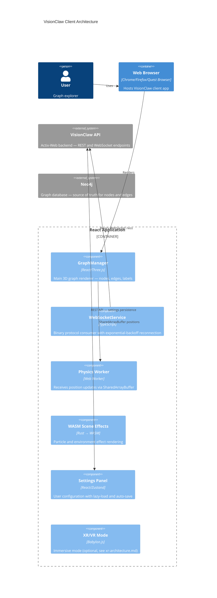
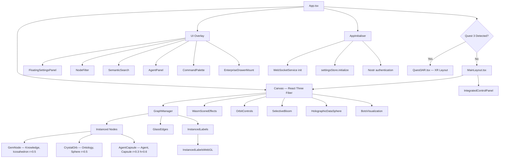
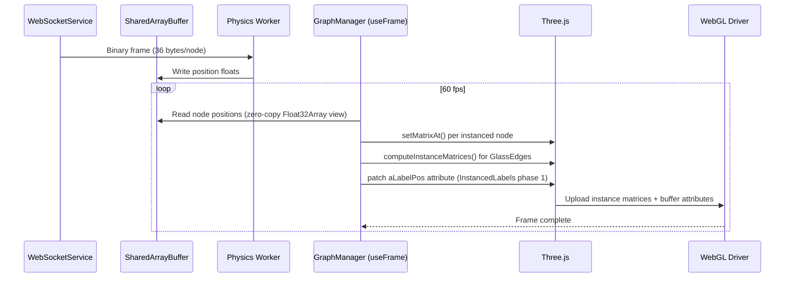
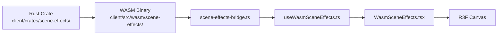
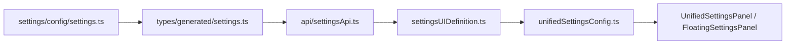
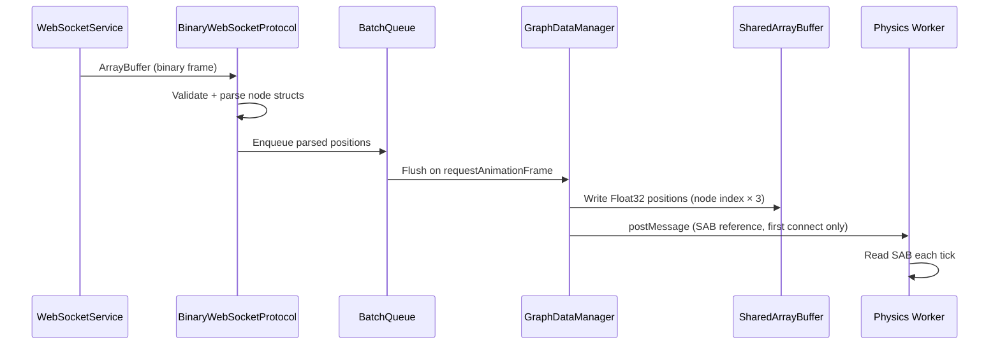
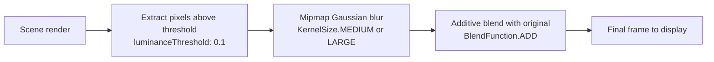

# VisionClaw Client Architecture

## Overview

VisionClaw's client is a React 19 application that renders interactive 3D knowledge graphs using Three.js via React Three Fiber (R3F). Real-time node positions arrive over a compact binary WebSocket protocol; a Shared Array Buffer (SAB) carries those positions zero-copy into a dedicated Web Worker and back to the rendering thread. WASM scene effects are compiled from a Rust crate and bridge into the R3F scene through typed TypeScript bindings. Application state is managed with Zustand, using lazy-loaded path-based subscriptions that cut initial load time by 87% compared to a full-load approach.



---

## Component Hierarchy



`EnterpriseDrawerMount` is the top-level mount for the enterprise slide-out drawer. It renders the drawer itself, a floating trigger button, and registers a global keyboard shortcut: **Ctrl+Shift+E** (Windows/Linux) or **Cmd+Shift+E** (Mac) toggles the drawer open/closed (defined in `EnterpriseDrawerMount.tsx` line ~25). The shortcut is suppressed when focus is inside an `<input>`, `<textarea>`, or `contenteditable` element.

---

## Rendering Pipeline

The rendering loop runs inside `GraphManager` at 60 fps, driven by the R3F `useFrame` hook. Each frame reads node positions from the SharedArrayBuffer, updates InstancedMesh matrices, recomputes edge geometries, and passes everything to Three.js for a single draw call per node type.



The full CPU-to-GPU pipeline includes:
- React state change → `useFrame` callback
- Worker thread writes Float32Array via SAB (zero-copy, no serialisation)
- Uniform upload: `time`, `baseColor`, `emissiveColor`, `opacity`
- Vertex shader: instance matrix transform, pulsing vertex displacement
- Fragment shader: rim lighting (Fresnel), hologram scanlines, distance fade
- Post-processing: `SelectiveBloom` via `EffectComposer` (luminance extract → mipmap blur → additive blend)

---

## Node Rendering (Instanced)

Each node type uses a separate `InstancedMesh` — one draw call per type regardless of node count.

| Node type | Geometry | Radius | Flag bits in ID |
|-----------|----------|--------|-----------------|
| Knowledge (`page`) | `IcosahedronGeometry` | 0.5 | Bit 30: `0x40000000` |
| Ontology (`owl_*`) | `SphereGeometry` | 0.5 | Bits 26–28 |
| Agent | `CapsuleGeometry` r=0.3, h=0.6 | — | Bit 31: `0x80000000` |

Node IDs are sequential `u32` values starting at 1 from a `NEXT_NODE_ID` atomic counter on the server. The upper bits carry type flags; bits 0–29 hold the actual ID (supports up to 1,073,741,823 nodes). **Always coerce to `String()` before using as a Map key or in `===` comparisons** — the backend returns numeric IDs and the edge `source`/`target` fields must match the same string representation used for node IDs.

Per-instance data uploaded each frame:
- **Transform**: `setMatrixAt(i, matrix)` — position, rotation, scale
- **Color**: `setColorAt(i, color)` — tint blended in `HologramNodeMaterial`

The `HologramNodeMaterial` GLSL shader (`client/src/rendering/materials/HologramNodeMaterial.ts`) applies rim lighting, animated scanlines, random glitch flickers, and distance fade. `toneMapped: false` is required for bloom to work on emissive surfaces.

---

## Edge Rendering (GlassEdges)

`GlassEdges` uses `InstancedMesh` of unit-height cylinders (`CylinderGeometry` radius=0.03, height=1). The `computeInstanceMatrices` function:
1. Places each cylinder midpoint at `(src + tgt) / 2`
2. Scales the Y axis to the edge length
3. Rotates to align the cylinder axis along `src → tgt`
4. Applies surface-to-surface offset: `computeNodeScale * nodeSize` (matches visual radius for r=0.5 geometries)

**Hash dedup bug (fixed)**: An earlier version used a `${len}-${pts[0]}-${pts[len-1]}` hash. When the first and last edge endpoints were stable (common after physics convergence), the hash matched and the GPU update was skipped, causing edges to appear frozen. The fix was to remove the hash and always recompute matrices every frame.

---

## Label Rendering (InstancedLabels)

`InstancedLabels` → `InstancedLabelsWebGL` uses a two-phase `useFrame`:

**Phase 1 (every frame):** Patch the `aLabelPos` InstancedBufferAttribute directly from SAB for all existing glyphs. This keeps labels co-located with moving nodes with zero allocation.

**Phase 2 (every 3 frames):** Full layout rebuild — frustum cull, compute visible set, call `layoutTextInline()` which writes directly into the InstancedBufferAttribute arrays (no per-node `GlyphInstance[]` heap allocation).

**SAB consistency rule:** Capture `nodePositionsRef?.current` once at the top of the `useFrame` callback and reuse the reference for both phases within the same tick.

**Wrapper prop-forwarding pitfall:** When `InstancedLabels` was extracted into `InstancedLabelsWebGL`, all props must be both destructured and forwarded. Missing `nodePositionsRef` caused labels to fall back to stale `labelPositionsRef` instead of reading the SAB directly.

---

## WASM Scene Effects

Scene effects (particles, environmental fog, bloom halos) are implemented in a Rust crate compiled to WASM and bridged into the R3F scene through a thin TypeScript API.



**Zero-copy pattern:** The Rust crate exposes raw pointers via `get_*_ptr()` / `get_*_len()` methods. `scene-effects-bridge.ts` creates `Float32Array` views directly over `WebAssembly.Memory.buffer` — no copy, no serialisation. The views remain valid as long as WASM memory is not reallocated (i.e., avoid growing the WASM heap while views are held).

---

## State Management

### Zustand Stores

| Store | File | Purpose |
|-------|------|---------|
| `settingsStore` | `client/src/store/settingsStore.ts` (1,070 lines) | All user/system config — partial, lazy-loaded, path-based |
| `graphDataManager` | `graphDataManager.ts` | Current graph state: node positions (WebSocket), metadata (REST) |
| `analyticsStore` | analytics store | GPU analytics results: clustering, anomaly scores, community IDs |
| `BotsDataProvider` | React context | Agent positions (WebSocket) + metadata (REST polling) |

### Settings Lazy-Loading

The settings store loads only 16 essential paths at startup (203ms), then fetches additional sections on demand (89ms per section). This achieves an 87% reduction in initial load time vs loading all 150+ settings up front.

```typescript
const ESSENTIAL_PATHS = [
  'system.debug.enabled',
  'system.websocket.updateRate',
  'system.websocket.reconnectAttempts',
  'auth.enabled', 'auth.required',
  'visualisation.rendering.context',
  'xr.enabled', 'xr.mode',
  'visualisation.graphs.logseq.physics',
  'visualisation.graphs.visionclaw.physics',
  'nodeFilter.enabled', 'nodeFilter.qualityThreshold',
  'nodeFilter.authorityThreshold', 'nodeFilter.filterByQuality',
  'nodeFilter.filterByAuthority', 'nodeFilter.filterMode'
];
```

Use `ensureLoaded(['section.*'])` in a `useEffect` before accessing any non-essential setting. Group related paths into a single call to batch the API request.

### Auto-Save Manager

`autoSaveManager` (`client/src/store/autoSaveManager.ts`) accumulates setting changes in a `Map<string, any>` and flushes the entire queue as a single batched API call after 500ms of inactivity. A `beforeunload` handler calls `forceFlush()` to capture changes just before tab close. This reduces API call volume by 93% under normal usage.

### Path-Based Subscriptions

```typescript
// Subscribe to one setting — only this component re-renders on bloom changes
const unsubscribe = useSettingsStore.getState().subscribe(
  'visualisation.bloom.intensity',
  () => updateBloomEffect()
);
```

Subscribing to a specific dot-notation path rather than the whole store reduces re-renders by 98% compared to `useSettingsStore(state => state.settings)`.

### Worker Position Data Race (fixed)

`handleGraphUpdate` generates `dataWithPositions` with server-assigned initial positions. The caller **must send `dataWithPositions` to the worker**, not the original `data` object. Sending the original causes the worker to initialise all nodes at (0,0,0), producing zero-length edge vectors and invisible edges on the first `useFrame` tick.

---

## Settings Architecture



`settingsApi` (430 lines) handles debouncing, batching, and priority queuing. `AutoSaveManager` lives outside the store and is registered at store initialisation. LocalStorage persistence uses Zustand's `persist` middleware but only persists authentication state and essential path values — the full settings tree is always fetched fresh from the server on startup.

---

## Binary WebSocket Consumption

The client connects to the server's `/wss` endpoint immediately on `AppInitialiser` mount.

### Wire Format

**Protocol V2 (current default — 36 bytes/node):**

| Offset | Bytes | Field | Notes |
|--------|-------|-------|-------|
| 0 | 4 | `node_id` (u32) | Upper bits encode type flags |
| 4 | 12 | `position` ([f32; 3]) | X, Y, Z in world units |
| 16 | 12 | `velocity` ([f32; 3]) | Used for client-side interpolation |
| 28 | 4 | `sssp_distance` (f32) | Shortest-path distance from source |
| 32 | 4 | `sssp_parent` (i32) | Parent node in shortest-path tree |

**Protocol V3 (analytics — 48 bytes/node):** adds `cluster_id` (u32), `anomaly_score` (f32, 0–1), and `community_id` (u32). Decoded in `BinaryWebSocketProtocol.ts` when the frame header indicates V3.

Bandwidth: 316 nodes × 36 bytes × 60 fps ≈ 684 KB/s. At 100K nodes: 3.6 MB/frame vs ~18 MB for equivalent JSON (80% savings).

### Connection Lifecycle

```typescript
class WebSocketService {
  private config = {
    reconnect: { maxAttempts: 10, baseDelay: 1000, maxDelay: 30000, backoffFactor: 2 },
    heartbeat: { interval: 30000, timeout: 10000 }
  };
  // connect → sendHandshake → startHeartbeat
  // onclose → scheduleReconnect with exponential backoff
  // onmessage → BinaryWebSocketProtocol.parse → BatchQueue → GraphDataManager
}
```

`BatchQueue` accumulates frames and applies them in a single animation-frame callback to prevent mid-frame partial updates. `ValidationMiddleware` checks node ID ranges and rejects malformed frames before they reach the scene graph.

### SAB Write Path



---

## Post-Processing

`SelectiveBloom` (`client/src/rendering/SelectiveBloom.tsx`) uses `@react-three/postprocessing` with `EffectComposer`:



Safari does not support `EXT_color_buffer_float`; bloom is disabled automatically via user-agent detection to prevent visible banding. Mobile GPUs are capped at 2K nodes (iOS) or 5K nodes (Android) via server-side node filtering before transmission.

---

## Performance Optimisations Summary

| Technique | Mechanism | Measured gain |
|-----------|-----------|---------------|
| Binary protocol | 36-byte wire format | 80–95% bandwidth vs JSON |
| Instanced rendering | One draw call per node type | Constant GPU cost vs node count |
| SharedArrayBuffer | Zero-copy position transfer | Eliminates worker serialisation |
| Frustum culling (labels) | Distance threshold in `InstancedLabels` | 200 labels rendered vs 10K: 2× FPS |
| BatchQueue | Accumulate WebSocket frames, apply once per RAF | No mid-frame partial updates |
| Settings lazy-load | Essential paths only at startup | 87% faster initial load (203ms vs 1,650ms) |
| Auto-save debounce | 500ms queue flush | 93% reduction in REST calls |
| Smart agent polling | 3s active / 15s idle interval | 70% reduction in server load |

---

## REST API Layer

`UnifiedApiClient` (526 lines) is the HTTP transport foundation. Domain API modules build on top:

| Module | Lines | Purpose |
|--------|-------|---------|
| `settingsApi` | 430 | Debouncing, batching, priority queuing |
| `analyticsApi` | 582 | GPU analytics results — clustering, anomaly detection |
| `optimisationApi` | 376 | Graph layout triggers: stress majorisation, constraints |
| `exportApi` | 329 | Graph export, publishing, sharing |
| `workspaceApi` | 337 | Multi-tenant workspace CRUD |
| `batchUpdateApi` | 135 | Batch node/edge operations |

---

## See Also

- [XR Architecture](xr-architecture.md) — Babylon.js immersive mode, Vircadia multi-user, WebXR
- [System Overview](system-overview.md) — Hexagonal architecture, CQRS pattern, actor model
- [Physics & GPU Engine](physics-gpu-engine.md) — CUDA force computation
- [Backend CQRS Pattern](backend-cqrs-pattern.md) — Rust/Actix backend, command/query separation
- [Deployment Topology](deployment-topology.md) — Service containers and data flow
