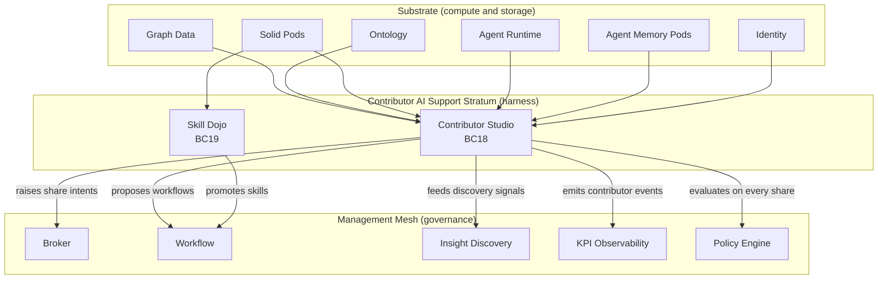

# The Contributor AI Support Stratum

## Why this layer exists

VisionClaw has spent two years building a strong substrate (graph, ontology,
Solid Pods, agent runtime, GPU physics) and a strong management mesh
(Judgment Broker, Workflow Lifecycle, KPI Observability, Connector
Ingestion, Policy Engine). Between those two layers, where the actual
knowledge work of the organisation happens every day, there is no
VisionClaw-native surface. Contributors use Logseq to draft, the CLI to
run agents, the MCP palette to call tools, their personal pod to store
memory, and the backend API to move things around. The surfaces exist.
They do not compose into a harness.

The consequence is visible in every honest internal measurement. Lots of
individual AI activity; no institutional compounding. Brilliant work from
one team member never becomes the team's baseline. The broker inbox fills
slowly because candidates never reach it; the ontology grows slowly
because contributor intent never becomes a promotion signal; the workflow
catalogue stalls because nobody is authoring proposals that are fit for
review. The substrate is underused in the same way that an excellent
engine is underused without a steering wheel.

This diagnosis is not parochial. It is the consistent finding in the
current industry evidence base:

- **PwC's 2026 CEO Survey** separates leaders from laggards on whether
  they are building AI *foundations* (data productisation, agentic
  governance, human-in-the-loop review) or just deploying AI *tools*.
  The foundations-builders compound; the tool-deployers do not.
- **McKinsey's Agentic AI Manifesto** makes the same point with
  different vocabulary: "enduring capabilities" require data plumbed
  into workflows, not pilots. The Manifesto's language — "data
  productisation, agentic engineering, enduring capabilities" —
  describes exactly the gap between VisionClaw's substrate and its
  mesh.
- **a16z's Institutional AI thesis** argues coordination beats
  individual productivity. "The next S-curve is not a smarter model;
  it is the interface layer that turns one person's breakthrough into
  the team's baseline."
- **Ramp Glass** is the most concrete available reference architecture.
  Ramp's positioning note on their harness reads almost as a spec for
  what VisionClaw's stratum should be: *"It is not about the model.
  It is about the harness: invisible complexity, memory by default,
  workspace not chat, one person's breakthrough becomes everyone's
  baseline, everything connected on day one."*
- **Anthropic Skills v2 discipline** (the public skill lifecycle with
  evals, benchmarks, and explicit retirement) is the operational
  pattern for skill management at scale. Ad hoc "prompts people copy
  around" is not a substitute.

VisionClaw's competitive thesis — sovereign data, ontology-guided work,
broker-governed sharing — only pays off if there is a daily surface that
makes the thesis felt. The Contributor AI Support Stratum is that
surface.

---

## Layering model

The system has three layers, and each owns a different kind of problem.

```
┌───────────────────────────────────────────────────────────┐
│  MANAGEMENT MESH                                          │
│  BC11 Broker · BC12 Workflow · BC13 Insight               │
│  BC15 KPI · BC16 Connectors · BC17 Policy                 │
│                                                           │
│  Role: governs, measures, adjudicates                     │
│  Does not own: daily work, skill authoring                │
└──────────────────────┬────────────────────────────────────┘
                       │
┌──────────────────────┴────────────────────────────────────┐
│  CONTRIBUTOR AI SUPPORT STRATUM  ◀── THIS DOC             │
│  BC18 Contributor Enablement · BC19 Skill Lifecycle       │
│                                                           │
│  Role: assembles context, guides work,                    │
│        packages outputs, raises share intents             │
│  Does not own: governance, the compounding loop itself    │
└──────────────────────┬────────────────────────────────────┘
                       │
┌──────────────────────┴────────────────────────────────────┐
│  SUBSTRATE                                                │
│  BC1 Auth · BC2 Graph · BC3 Physics · BC4 WebSocket       │
│  BC5 Settings · BC6 Analytics · BC7 Ontology              │
│  BC8 Agent/Bot · BC9 Rendering · BC10 Binary Protocol     │
│  BC14 Identity · BC30 Agent Memory Pods                   │
│                                                           │
│  Role: stores, computes, reasons, renders                 │
│  Does not own: intent, authorship, review                 │
└───────────────────────────────────────────────────────────┘
```

*The three-layer model. The stratum is not the mesh; it is not the
substrate. It is the thin, contributor-facing layer between them.*

%%{init: {'theme': 'base', 'themeVariables': {'primaryColor': '#4A90D9', 'primaryTextColor': '#fff', 'lineColor': '#2C3E50'}}}%%


### What each layer owns

The **substrate** owns facts, structure, storage, identity, reasoning. It
answers questions like: *what nodes exist, what axioms hold, what is
this WebID, what is in this pod?* It does not care about intent or
authorship.

The **stratum** owns work-in-progress. It answers questions like: *what
am I focused on, what would help me right now, what do I want to share
with my team, what automation runs overnight while I sleep, what skill
do I want to install for this task?* It does not own governance or
global state; it raises intents that the mesh adjudicates.

The **management mesh** owns decisions and their consequences. It
answers questions like: *should this share be promoted to the
organisation, what policy applies, what is the current mesh velocity,
which workflow is drifting?* It does not own day-to-day creation of
content.

Each layer can fail without the others collapsing. A weak substrate
makes the stratum feel sluggish and the mesh feel arbitrary. A weak
stratum (what we have today) leaves the mesh starved and the substrate
underused. A weak mesh leaves the stratum with no governance and the
substrate with no quality control. All three layers are necessary; the
stratum is the one currently missing.

---

## The compounding loop

The architectural promise of the stratum is simple: **private work
becomes team work becomes mesh baseline**. Monotonic. Deliberate.
Visible. Each step records its provenance so that the organisation can
trace any shared pattern back to the original contributor moment that
produced it.

### Rosa's case (product lead)

Rosa is a product lead at a mid-sized fintech. She writes decision
memos, drafts investor updates, and maintains a personal ontology of
product bets in her Logseq graph. On a Wednesday afternoon she opens
the Contributor Studio focused on a feature she is scoping: a
merchant-side fee dispute workflow.

The Studio assembles her focus. Her graph selection pulls in the fee
dispute node and its neighbours; the ontology rail shows her the
canonical terms VisionClaw currently recognises (`vc:bc/dispute`,
`vc:bc/merchant`, `vc:ops/escalation-path`); BC30's episodic memory
reminds her that two weeks ago she wrote something related on a
different feature. The Sensei offers three suggestions: one canonical
term (`vc:bc/dispute-cycle-time`, a term her team has referenced but
never declared), one precedent (a decision memo from her VP six months
ago), and one skill (`dispute-summary` authored by an engineering
colleague).

She accepts the canonical term and the skill. The skill runs inside the
session, takes her current draft as input, and produces a three-bullet
executive summary she can paste into the memo. She marks the memo as
a `WorkArtifact`, sets `public:: true`, and raises a `ShareIntent` to
Team.

The policy engine evaluates and allows. Her pod MOVEs the memo into
`/shared/product-team/kg/`. Three colleagues see it within the next
hour. One of them accepts the same canonical term on their own work
the following day. BC13's `PatternDetector` clusters the signals; by
Friday it has enough evidence to raise a `MigrationCandidate`. The
broker approves; `vc:bc/dispute-cycle-time` becomes a governed
ontology class. Rosa's Wednesday afternoon became the organisation's
Friday vocabulary.

Nothing in this sequence required Rosa to know about BC13 or BC17 or
the broker workflow. The stratum handled the mesh side; Rosa's
experience was: focus, accept a suggestion, share.

### Idris's case (regulated-industry specialist)

Idris is a compliance analyst at a pharma company. His auditors
require every claim in a regulatory submission to trace to a
controlled vocabulary. In today's world he spends three days a quarter
hand-reconciling terms across submissions. Tomorrow's world is this:

He opens the Studio focused on a submission draft. The Sensei surfaces
`vc:pharma/adverse-event` as the canonical term for a phrase he has
just written. He accepts. The artifact lineage now includes that
acceptance. When the auditor later asks how he arrived at that term,
the provenance chain points to the Sensei suggestion and the ontology
class it references. Idris no longer writes a term-mapping appendix;
he delegates the mapping to the lineage.

A month later, an ontology inference fires because Whelk has
determined a new subclass relationship. Next time Idris opens the
Studio on a related submission, the Sensei surfaces the new axiom as
a `canonical_term` suggestion. Regulatory vocabulary, continuously
maintained. No taxonomy project; the taxonomy is the by-product of
his work.

### Chen's case (consulting partner)

Chen is a partner at a small strategy consultancy. Her firm's
intellectual property is scattered across ten years of bespoke client
deliverables. When a junior consultant joins, there is no way to
onboard them on "how this firm thinks" without a senior consultant
manually narrating old decks.

Chen uses the Studio to convert her own deliverables into Work
Artifacts. She shares them to Team with rationale. She authors two
skills: `strategy-framing-five-forces` and `strategy-framing-jtbd`,
runs eval suites against them, benchmarks them on three junior-led
projects, and shares to Team. The Mesh Dojo surfaces them to everyone
at the firm.

The junior consultants now have an institutional memory that was
previously trapped in Chen's head and her file share. Six months in,
they are producing first-draft work at the partner-review-ready tier
because the skills encoded the first-draft reasoning. That is Ramp
Glass's "one person's breakthrough becomes everyone's baseline"
realised on VisionClaw primitives.

---

## Day in the life

What does a contributor's day actually look like inside the stratum?

**Morning.** The contributor opens VisionClaw Studio in a browser tab.
Their NIP-07 session authenticates them transparently. The Studio
lays out in four panes: a 3D graph context on the left, a
markdown/editor work lane in the centre, an AI partner lane on the
right, and an ontology guidance rail running along the right edge.
The inbox pane at the top-right shows three entries: a morning brief
(scheduled automation), a team share from yesterday awaiting their
review, and a suggestion to install an updated version of a skill they
use often.

The morning brief was produced overnight by an automation routine the
contributor authored last month. The routine scrapes yesterday's
commits in repositories they care about, cross-references the
ontology, and writes a three-section brief to `/inbox/`. The
contributor reads it, promotes two items into Work Artifacts, and
archives the rest. The inbox stays clean.

**Midday.** The contributor begins substantive work on a project. They
select five nodes in the graph pane; the focus snapshot updates; the
ontology rail refreshes with canonical terms for the selection. A
Sensei nudge surfaces: *"You worked on
`vc:bc/merchant-fee-dispute` last week. Here are three relevant
continuations: a precedent from your VP, a skill your colleague
published, a canonical term we detected in your draft."* The
contributor accepts the skill, runs it against their draft, and the
output lands in the editor lane.

A second nudge arrives later: *"Two colleagues accepted
`vc:bc/dispute-cycle-time` this week. You referenced the same concept
three times. Consider accepting it or proposing a revision."* This is
the stratum telling the contributor about the mesh's emergent
consensus before it becomes canonical.

**Afternoon.** The contributor finishes the artifact and decides to
share it to Team. They click the share control. The policy engine
evaluates; an overlay shows the evaluation result and the
anti-corruption translation ("this will be written to
`/shared/product-team/kg/`, indexed by Neo4j, visible to product-team
WAC group, tagged with lineage id L-7a3f"). The contributor confirms.
The pod MOVE completes. Two colleagues see a notification.

They also decide to schedule a new automation: a weekly synthesis of
all fee-dispute-related artifacts from the team, written to
`/inbox/weekly-dispute-synthesis.md` every Friday at 05:00. They
configure the routine in three fields, save to
`/private/automations/weekly-dispute-synthesis.json`, and close the
tab.

**Evening.** The automation scheduler picks up the routine definition
on the next scheduler tick. On Friday at 05:00 the agent runs under a
session-bounded delegation, writes the synthesis to the inbox, emits
`AutomationTriggered`. BC15 records a contributor-productivity event.

**Next morning.** The contributor opens the Studio again. The inbox
shows the weekly synthesis. They skim it, promote one paragraph into
a Work Artifact, raise a `ShareIntent` to Mesh because they think the
pattern in the synthesis is organisation-worthy. The broker sees the
intent in their inbox as a `contributor_mesh_share` case later that day.

The compounding loop has completed one turn. The contributor did not
coordinate manually with anyone. They did not query the mesh
directly. They did their work; the stratum converted it into signals,
intents, and proposals that the mesh adjudicated. The substrate
recorded the whole trace.

---

## The four pillars narrated

The stratum delivers four pillars. A PRD lists them as functional
requirements; this document describes what they feel like.

### Sovereign Workspace

The workspace is yours. Your focus snapshot, your active artifacts,
your installed skills, your partner bindings — all stored in your pod
under ADR-052 WAC rules. The backend indexes for performance but the
write-master is you. If VisionClaw goes away, your `/public/` pod
container still serves your work; your `/private/` pod container
still holds your drafts; your profile card still claims your Nostr
key.

The NIP-07 session authenticates you transparently to the Solid Pod
and to MCP tool calls. You never see a separate login. You never
manage credentials manually. Your identity is one thing with two
surfaces: a browser-signed Nostr session and a pod-resident delegation
per ADR-040.

Deep-linking works by default: a graph selection is part of your
focus; a URL reproduces it; an agent call receives it as context.
"Workspace not chat" per Ramp Glass: your work sits in one place,
with all its context loaded, instead of being re-described to an AI
every time you start a session.

### Mesh Dojo

Skills are first-class citizens with a lifecycle. Create a skill, run
evals against it, share to Personal, then Team, then (if it benchmarks
well) to Mesh through a broker review. Uninstall when the base model
catches up and a scanner recommends retirement.

The Dojo is where you discover skills. Filtering by distribution
scope (mine, my team, my company, public) uses the ADR-029 Type
Index and ADR-052 WAC to keep visibility honest. A skill you see in
the dojo is a skill you may install; installation is explicit and
versioned; updates are monotonic.

The discipline is Anthropic-v2: evals are not optional, benchmarks
are not optional, retirement is not optional. Skills that cannot be
evaluated do not leave Personal scope. Skills that cannot be
benchmarked against a predecessor do not leave Team scope. Skills
that fall behind the base model's capability are retired with a
successor reference or a `BaseModelAbsorbed` verdict.

### Ontology Sensei

The Sensei is the background synthesis process that watches your work
and proposes three-suggestion nudges from the ontology, from BC13's
insight signals, from BC19's installed skills, and from BC30's
episodic memory. It does not interrupt. It does not insist. It lays
three options in a quiet part of the UI; you accept or dismiss.

The Sensei's job is to make the ontology feel like a tailwind rather
than a tax. Canonical terms surface when you are about to write a
phrase that overlaps one. Precedents surface when you are working in
a region of the graph where a previous decision might be relevant.
Skills surface when your focus matches the skill's stated scope.

Acceptance feeds BC13 as a discovery signal; dismissal trains the
local ranking without signalling to the mesh. Over time, the Sensei
gets better at you specifically — your goals, your cadence, your
vocabulary — while still surfacing the mesh's canonical terms in
priority.

### Pod-Native Automations

Automation routines live in your pod. A routine is a small JSON
document under `/private/automations/` that names an agent class,
declares its scope, sets a cadence, and specifies an inbox target.
The scheduler reads the routine, dispatches the agent under a
session-bounded delegation, writes the output to `/inbox/`, and fires
a `AutomationTriggered` event.

You review the inbox on your own schedule. Nothing an automation
produces is mesh-visible until you raise a `ShareIntent`. The
automation cannot publish to `/public/` or to `/shared/` on your
behalf; ADR-052's double-gate enforcement and BC17 policy rules
prevent it. Overnight work becomes morning inputs, not unreviewed
broadcasts.

This is what "memory by default" means on VisionClaw. Your pod is
the memory. Automations populate it; you curate it; the Studio
renders it.

---

## How Contributor Studio differs from Broker Workbench

Both surfaces run on the same substrate. Both emit provenance events.
Both respect BC17 policy. But they answer different questions, and
the difference is load-bearing for the architecture.

| Dimension | Broker Workbench (BC11) | Contributor Studio (BC18) |
|-----------|--------------------------|---------------------------|
| Verb | Review, adjudicate, govern | Produce, guide, share |
| Unit of work | `BrokerCase` (escalation, proposal, share review) | `WorkArtifact`, `GuidanceSession`, `ShareIntent` |
| Default pane | Decision Canvas with provenance and past decisions | Multi-pane workspace with graph, editor, partner, rail |
| Intervention | Discrete — one case at a time, with side-effects | Continuous — work happens in-flight, suggestions overlay |
| Provenance emphasis | Inbound: *why should I approve this?* | Outbound: *this is what I did; here is the trace* |
| KPI role | HITL Precision, Mesh Velocity, Trust Variance | Activation, Time-to-first-result, Ontology guidance hit rate, Share conversion |
| Permission scope | Broker or Admin role | Contributor role (all authenticated users) |
| Where an hour goes | Reviewing 6–10 cases | Authoring artifacts, running skills, reviewing inbox |

The two surfaces are **explicitly non-overlapping**. The Studio never
adjudicates shares; it raises intents. The Workbench never authors
artifacts; it reviews. If a decision is required, it goes to the
Workbench. If work is being produced, it happens in the Studio. When
the two must meet (a share intent has to be adjudicated), the
hand-off is through a `BrokerCase` — an anti-corruption-layered
translation of the contributor's `ShareIntent` into the broker's
domain language.

This separation is why the stratum is a new layer rather than an
extension of the Workbench. Cramming authoring into the Workbench
would distort the broker's role; cramming adjudication into the
Studio would distort the contributor's. Each surface is optimised for
the cognitive load of its role.

---

## How it differs from external tools

Honest comparison. Where we are better; where we are narrower.

### vs Notion

Notion is a block editor with permissions. The Studio is a workspace
with ontology, physics, broker-governed sharing, and pod-native data
sovereignty. **Better:** canonical vocabulary, governed mesh
promotion, pod write-master, physics-visible graph context, skill
lifecycle discipline. **Narrower:** Notion has a first-class block
editor, rich embeds, and a mature template ecosystem we do not yet
have and do not plan to replicate.

### vs Obsidian

Obsidian is local-first markdown with a plugin ecosystem. The Studio
is pod-first markdown with ontology binding and mesh-visible sharing.
**Better:** collaborative by design, ontology-reasoning behind every
note, broker-governed organisational publishing, KPI observability,
skill evals. **Narrower:** Obsidian's plugin ecosystem is vastly
larger; local-only workflow is simpler; single-user cognition is the
default.

### vs Ramp Glass

Ramp Glass is the closest analogue and the most useful comparison.
Glass turns finance-team workflows into a harness; the Studio turns
knowledge-work into a harness. **Parity:** invisible complexity,
memory by default, workspace not chat, one person's breakthrough
becomes baseline, everything connected day one — all shared goals.
**Better than Glass:** data sovereignty (Glass is SaaS, we are
pod-first), ontology reasoning (Glass has no ontology layer),
broker-governed promotion (Glass has no explicit governance
surface), open skill lifecycle (Glass's automations are vendor-opaque).
**Narrower than Glass:** Glass has a polished finance-specific UX we
will not match on day one; Glass integrates deeply with ERP; we do
not.

### vs Cursor

Cursor is a code editor with an AI partner. The Studio is a knowledge
workspace with an AI partner, ontology rail, and governed sharing.
**Better:** ontology-guided work, pod sovereignty, broker review,
skill dojo with evals, non-code scope (compliance memos,
architecture decisions, product bets). **Narrower:** we are not a
code editor. Cursor's code-specific cognition (symbol lookup, edits
across files, inline diffs) is deliberately not our territory.

### Summary

We lead on sovereignty, ontology, and governed sharing. We trail on
block-editor polish and on any single domain's vertical depth.
Teams that value their intellectual property more than a polished
single-player editor will prefer VisionClaw; teams that want a
single-player-polished editor with zero governance overhead will
prefer Notion or Obsidian. We do not try to win both audiences.

---

## Sovereignty and trust guarantees

The stratum makes four promises, enforced by substrate:

1. **Pod-first data.** Your contributor profile, your artifacts, your
   automation routines, your skill packages — all write-mastered in
   your pod. The backend indexes for performance; the pod is the
   source of truth. If we go away, you keep your data.
2. **WAC-gated sharing.** Share state transitions correspond to pod
   MOVE operations across `./private/`, `./shared/`, and `./public/`
   containers. ADR-052's double-gate (page flag + container path)
   means no accidental publication is possible.
3. **NIP-07 delegation.** Your Nostr session authenticates you to the
   backend, the pod, and MCP tool calls transparently. For enterprise
   contributors without NIP-07 extensions, ADR-040's OIDC-to-ephemeral
   Nostr keypair flow provides the same provenance signing without
   requiring browser extensions.
4. **Broker audit on every mesh promotion.** No artifact becomes mesh
   baseline without a broker decision. No skill is promoted without a
   broker decision. Every decision is a Nostr-signed bead; every
   decision links to its source `ShareIntent`; every `ShareIntent`
   links to the `GuidanceSession` that produced it. The provenance
   chain is end-to-end.
5. **Policy engine at every share transition.** BC17 evaluates every
   `ShareIntent` before the downstream case is created. Rules cover
   distribution widening, automation publication attempts, and
   partner-binding scope. Policy changes are versioned per BC17's
   existing model.

None of these are new infrastructure. They are the stratum's
responsible use of the substrate that already exists. That is the
point of the layering.

---

## Measurement model

BC15 KPI Observability extends its metric catalogue to include
stratum-level KPIs. These are defined in PRD-003 §12 and in the KPI
ADR-043; this document merely points at them.

- **Contributor activation**: fraction of invited contributors who
  complete a first `GuidanceSession` within seven days of invitation.
- **Time-to-first-result**: median seconds from `WorkspaceOpened` to
  first `WorkArtifactCreated` in a new contributor's session.
- **Skill reuse**: number of distinct `ContributorWorkspace`s in which
  a skill is invoked over a rolling 30-day window.
- **Share-to-mesh conversion**: fraction of `ShareIntentApproved
  { to_state: Team }` events that become `ShareIntentApproved
  { to_state: Mesh }` within 30 days.
- **Ontology guidance hit rate**: ratio of `SuggestionAccepted` to
  `SuggestionEmitted` per contributor, per focus class.
- **Redundant skill retirement rate**: `SkillRetired` events with
  reason `BaseModelAbsorbed` per rolling 90-day window, normalised
  by active skill count.

Every metric is computed with lineage to source events per BC15's
existing invariants. None are aggregates without traceable source. The
metric catalogue is append-only.

---

## Risks of not building this stratum

If we do not build the stratum, six failure modes are predictable.

1. **Broker bottleneck.** The Workbench exists, but candidates reach
   it only through automated discovery. Human contributors have no
   low-friction path to raise a `ShareIntent`. The broker inbox
   stays thin; the mesh compounds slowly.
2. **Power-user islands.** The contributors with the deepest product
   knowledge build their own personal harnesses using Logseq + CLI +
   MCP. Their breakthroughs never become the team's baseline. The
   organisation depends on individual memory.
3. **Ontology starvation.** Without a Sensei nudging contributors to
   accept canonical terms, the ontology grows only through the
   automated discovery path (BC13). Canonical-term adoption lags
   organic vocabulary drift; Whelk's reasoning catches less.
4. **Pod under-delivery.** Pods become a storage backend for a
   backend, not a sovereignty surface. Contributors never touch
   their pod directly; they never feel the sovereignty thesis. The
   walk-away guarantee is theoretical.
5. **Skill fragmentation.** Skills proliferate as ad-hoc prompts.
   No eval discipline; no versioning; no compatibility scanning.
   Skills drift silently as base models advance; contributors keep
   running obsolete prompts; quality erodes.
6. **Great substrate, weak harness.** The platform's investment in
   ontology, physics, pods, and agents becomes visible only in demos
   and broker dashboards. Day-to-day contributors feel none of it.
   The substrate is architecturally beautiful and operationally
   unused.

Each failure mode is recoverable with the stratum in place. None are
recoverable by another mesh context, because the mesh cannot itself
drive contributor behaviour. The substrate cannot either. Only the
harness can.

---

## What the stratum is deliberately not

One definitional clarification, because the space is crowded:

- The stratum is **not a rewrite of Logseq**. Contributors can still
  write in Logseq; the Studio reads and writes the same pod
  containers. The Studio is the multi-pane workspace; Logseq remains
  a valid single-user editor surface for those who prefer it.
- The stratum is **not a chat interface**. AI partners appear in a
  lane with structured bindings, not as a conversation thread
  competing with your work. The Studio is a workspace; chat is a
  tool inside it, not the frame around it.
- The stratum is **not a new governance mechanism**. BC11, BC12,
  BC13, BC17 already govern. The stratum raises intents that those
  contexts adjudicate; it does not adjudicate anything itself.
- The stratum is **not a replacement for the Broker Workbench**. The
  two surfaces are explicitly non-overlapping (see the comparison
  table above).

Keeping these boundaries clean keeps each layer responsible for what
it is good at.

---

## Further reading

- [PRD-003: Contributor AI Support Stratum](../prd-003-contributor-ai-support-stratum.md)
- [ADR-057: Contributor Enablement Platform](../adr/ADR-057-contributor-enablement-platform.md)
- [DDD Contributor Enablement Contexts](./ddd-contributor-enablement-context.md)
- [DDD Enterprise Bounded Contexts](./ddd-enterprise-contexts.md)
- [The Insight Migration Loop](./insight-migration-loop.md)
- [ADR-030: Agent Memory Pods](../adr/ADR-030-agent-memory-pods.md)
- [ADR-040: Enterprise Identity Strategy](../adr/ADR-040-enterprise-identity-strategy.md)
- [ADR-049: Insight Migration Broker Workflow](../adr/ADR-049-insight-migration-broker-workflow.md)
- [ADR-052: Pod Default WAC + Public Container](../adr/ADR-052-pod-default-wac-public-container.md)
- [Contributor Studio master design](../design/2026-04-20-contributor-studio/00-master.md)
