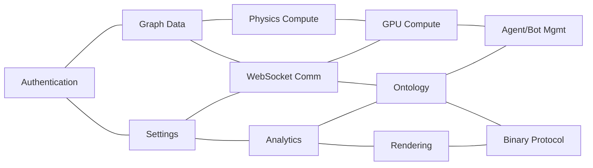
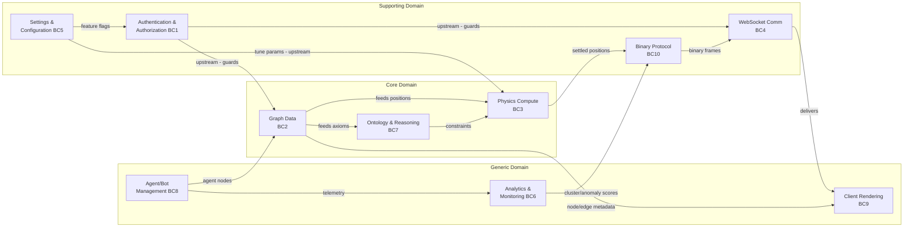

# DDD Bounded Contexts - VisionClaw

## Context Map

*Context map showing the ten bounded contexts and their upstream/downstream relationships across Authentication, Data, Physics, and Presentation layers.*

%%{init: {'theme': 'base', 'themeVariables': {'primaryColor': '#4A90D9', 'primaryTextColor': '#fff', 'lineColor': '#2C3E50'}}}%%

## BC1: Authentication & Authorization
**Aggregate Root**: `NostrSession`
**Entities**: `UserSession`, `ApiKey`, `FeatureAccess`
**Services**: `NostrService`, `AuthExtractor`
**Ports**: `AuthenticationPort`, `SessionStore`
**Key Files**: `nostr_service.rs`, `auth_extractor.rs`, `nostr_handler.rs`,
`nostrAuthService.ts`
**Invariants**:
- Private keys never persisted to browser storage
- All mutation endpoints require valid session
- Session tokens compared constant-time

## BC2: Graph Data Management
**Aggregate Root**: `GraphData`
**Entities**: `Node`, `Edge`, `GraphMetadata`
**Services**: `GraphStateActor`, `GraphDataManager`, `FileService`
**Ports**: `GraphRepository` (Neo4j), `GraphPersistence`
**Key Files**: `graph_state_actor.rs`, `neo4j_adapter.rs`, `graphDataManager.ts`,
`graph.worker.ts`
**Invariants**:
- Single position source of truth (no data.x vs x duplication)
- Persist-first-then-mutate for critical operations
- Single ingestion pipeline for all data sources
- Node IDs coerced to String everywhere

## BC3: Physics Compute
**Aggregate Root**: `PhysicsSimulation`
**Entities**: `SimulationParams`, `ForceConfig`, `ConstraintData`
**Services**: `PhysicsOrchestratorActor`, `ForceComputeActor`
**Key Files**: `physics_orchestrator_actor.rs`, `force_compute_actor.rs`,
`stress_majorization.rs`, `simd_forces.rs`
**Invariants**:
- Step completion tracked by state machine with IDs
- Mass values always > epsilon before SIMD division
- Sparse representation for large graph distances

## BC4: WebSocket Communication
**Aggregate Root**: `WebSocketConnection`
**Entities**: `ConnectionState`, `MessageQueue`, `BinaryFrame`
**Services**: `ConnectionLifecycle`, `BinaryProtocol`, `MessageQueue`
**Key Files**: `websocketStore.ts`, `socket_flow_handler/`, `binary_protocol.rs`
**Invariants**:
- Auth before any protocol activity
- Binary payloads capped before allocation
- Update intervals clamped server-side
- No module-level mutable state

## BC5: Settings & Configuration
**Aggregate Root**: `AppSettings`
**Entities**: `PhysicsSettings`, `VisualSettings`, `FeatureFlags`
**Services**: `SettingsStore`, `SettingsApi`
**Key Files**: `settingsStore.ts`, `settingsApi.ts`, `app_settings.rs`,
`feature_access.rs`
**Invariants**:
- One authoritative source per setting category
- No .env file mutation at runtime
- Feature flags persisted in database, not process-local statics

## BC6: Analytics & Monitoring
**Aggregate Root**: `AnalyticsState`
**Entities**: `ClusteringTask`, `AnomalyState`, `GpuMetrics`
**Services**: `AnalyticsStore`, health handlers
**Key Files**: `analytics/state.rs`, `analyticsStore.ts`, `consolidated_health_handler.rs`
**Invariants**:
- GPU metrics are real or explicitly marked unavailable
- Feature flag changes atomic with backend state
- Health checks non-blocking (cached background results)

## BC7: Ontology & Reasoning
**Aggregate Root**: `Ontology`
**Entities**: `OntologyAxiom`, `InferredRelation`, `OntologyClass`
**Services**: `OntologyPipelineService`, `OntologyReasoningService`
**Key Files**: `ontology_pipeline_service.rs`, `ontology_actor.rs`,
`ontology_reasoning_service.rs`
**Invariants**:
- Depth/descendant computation has cycle detection
- Single API surface (remove duplicate ontology handlers)
- Inferred axioms deduplicated

## BC8: Agent/Bot Management
**Aggregate Root**: `AgentSwarm`
**Entities**: `Agent`, `SwarmStatus`, `TelemetryMessage`
**Services**: `AgentPollingService`, `BotsDataContext`
**Key Files**: `BotsControlPanel.tsx`, `AgentPollingService.ts`, `BotsVisualization.tsx`
**Invariants**:
- Polling stop only when subscriber count = 0
- WebSocket URLs absolute (ws://)
- No remote script injection
- Per-frame rendering zero-allocation

## BC9: Client Rendering
**Aggregate Root**: `GraphScene`
**Entities**: `GemNode`, `GlassEdge`, `ClusterHull`, `SceneEffect`
**Services**: `GraphManager`, `GraphWorkerProxy`, `WasmSceneEffects`
**Key Files**: `GraphManager.tsx`, `GemNodes.tsx`, `GlassEdges.tsx`,
`scene-effects-bridge.ts`
**Invariants**:
- No allocations in useFrame
- InstancedMesh capacity handles overflow
- useMemo never used for side effects
- Three.js resources disposed in useEffect cleanup

## BC10: Binary Protocol
**Aggregate Root**: `BinaryMessage`
**Entities**: `NodeUpdate`, `DeltaFrame`, `ProtocolVersion`
**Services**: `BinaryProtocolService`, `DeltaEncoding`
**Key Files**: `binary_protocol.rs`, `delta_encoding.rs`,
`BinaryWebSocketProtocol.ts`
**Invariants**:
- Max payload size enforced before allocation
- One canonical wire format spec (generated from code)
- Version byte validated before processing
