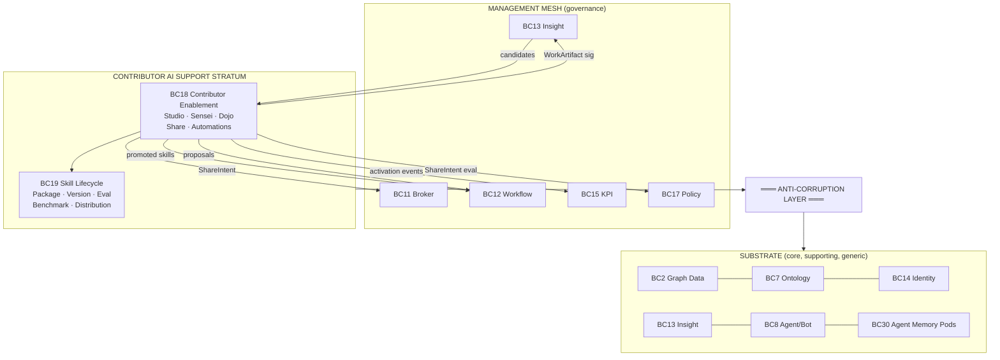
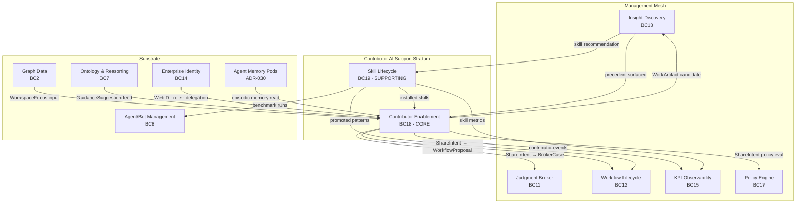
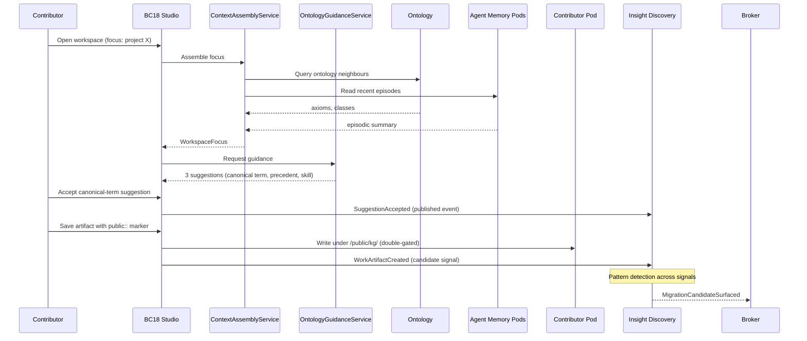
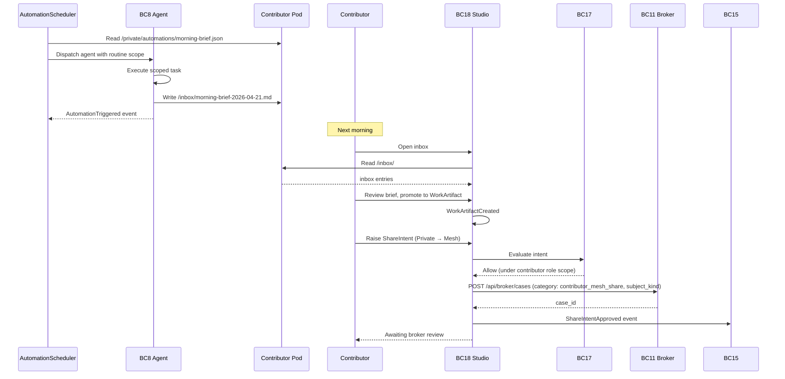

# DDD Contributor Enablement Contexts — VisionClaw

This document extends the enterprise context map defined in
[`ddd-enterprise-contexts.md`](ddd-enterprise-contexts.md) (BC1–BC17) with two
further contexts required to deliver the **Contributor AI Support Stratum**: the
harness that sits above the substrate (BC1–BC10) and below the management mesh
(BC11–BC17), turning day-to-day knowledge work into governed institutional
assets.

The stratum is named, framed, and motivated in
[`contributor-support-stratum.md`](contributor-support-stratum.md). This
document is its tactical-DDD companion: aggregates, entities, value objects,
domain services, ports, domain events, invariants, and anti-corruption layers.

The additions are:

- **BC18 Contributor Enablement** — the **Core** context that owns
  `ContributorWorkspace`, `GuidanceSession`, `WorkArtifact`, and `ShareIntent`.
  It is where private work is converted into shared assets through
  ontology-guided sessions and pod-native automations.
- **BC19 Skill Lifecycle** — the **Supporting** context that owns
  `SkillPackage`, `SkillVersion`, `SkillEvalSuite`, `SkillBenchmark`, and
  `SkillDistribution`. It is the substrate of portable, evaluated, versioned
  capability that contributors carry across GuidanceSessions.

---

## Relationship to existing context map

The Contributor Enablement stratum does not replace or fork any existing
context. It stitches substrate to mesh. BC18 consumes aggregates from BC2
(Graph Data), BC7 (Ontology), BC13 (Insight Discovery), BC14 (Enterprise
Identity), and the Agent Memory Pods surface exposed by ADR-030 (referred to
here as BC30 Agent Memory Pods for pointer clarity). It produces to BC11
(Judgment Broker), BC12 (Workflow Lifecycle), BC13 (Insight Discovery), BC15
(KPI Observability), and BC17 (Policy Engine). BC19 is supporting to BC18 and
reaches back to BC8 (Agent/Bot Management) for benchmark runs.



*Context map showing BC18 and BC19 sitting as the stratum between substrate
(BC1–BC10, BC30, the identity and ontology contexts) and management mesh
(BC11–BC17). The stratum is the only context population that contributors
interact with directly in the Contributor Studio.*

%%{init: {'theme': 'base', 'themeVariables': {'primaryColor': '#4A90D9', 'primaryTextColor': '#fff', 'lineColor': '#2C3E50'}}}%%


---

## Domain Classification

| Context | Classification | Justification |
|---------|---------------|---------------|
| BC18 Contributor Enablement | **Core** | Origin of the compounding loop. Every governed asset in the management mesh starts as a WorkArtifact in a ContributorWorkspace. The thesis fails without this context. |
| BC19 Skill Lifecycle | **Supporting** | Substrate of portable capability. Skills compose the hands of a GuidanceSession; without versioning, evaluation, and benchmarking there is no safe way to promote a skill from personal to team to mesh. Supporting, not core, because the compounding loop can exist with a minimal skill model — but it scales poorly without BC19. |

BC18 is deliberately core despite being new. The four pillars of the stratum
(Sovereign Workspace, Mesh Dojo, Ontology Sensei, Pod-Native Automations) all
live in BC18. BC19 is a cross-cutting substrate that BC18 consumes but does
not own.

---

## BC18: Contributor Enablement

**Purpose**: Convert day-to-day knowledge work into governed institutional
assets through a pod-native, ontology-guided contributor harness. BC18 owns
the Contributor Studio as the single surface through which an enterprise
contributor works with AI partners, curates their own ontology of re-usable
outputs, and advances those outputs through explicit share states.

**Aggregate Root**: `ContributorWorkspace`

### Entities

- **`ContributorWorkspace`** (aggregate root) — a live multi-pane work
  session tied to a contributor's WebID. Contains active `WorkArtifact`s,
  open `GuidanceSession`s, installed skills, open `ShareIntent`s, and the
  current focus snapshot. Owns the lifecycle of all other entities in this
  context.
- **`GuidanceSession`** — an ontology-guided work episode scoped by a single
  `WorkspaceFocus`. Contains the assembled context, the sequence of
  `GuidanceSuggestion`s emitted by the Sensei, and the active partner
  bindings. Sessions are append-only audit objects.
- **`WorkArtifact`** — a reusable output (note, snippet, draft skill, draft
  graph view, draft proposal) with lineage, current share state, and
  canonical pod URI. Artifacts are the units that advance through share
  states; they are not workflow proposals themselves.
- **`ShareIntent`** — an explicit request to move an artifact from its
  current share state to the next. Carries the policy evaluation id, the
  downstream case id, and the rationale. Represents the moment a contributor
  chooses to let the mesh see their work.
- **`ContributorProfile`** — the pod-resident record of role, goals, active
  projects, preferred AI partners, and collaborator graph. Pod is the
  write-master; the Neo4j projection is a derived read model.

### Value Objects

- **`ShareState`** — enum: `Private` | `Team` | `Mesh`. The only three
  legitimate states. Monotonic progression only.
- **`WorkspaceFocus`** — `{ project_ref, graph_selection[], ontology_context,
  captured_at }`. Immutable snapshot per `GuidanceSession`.
- **`GuidanceSuggestion`** — `{ kind: canonical_term | precedent_ref |
  skill_ref | policy_hint, payload, confidence, rationale, source_signals[]
  }`. Confidence is a float in [0, 1]; rationale is a short human-readable
  string.
- **`ArtifactLineage`** — ordered chain of `ShareIntent → BrokerDecision |
  WorkflowPromotion | MigrationPromotion` ids that record every transition
  an artifact has made. Append-only.
- **`PartnerBinding`** — `{ partner_type: AI | Human | Automation,
  partner_id, delegation_scope, permissions, bound_at, expires_at }`.
  Delegation scope is always narrower than the contributor's session scope.
- **`NudgeEnvelope`** — `{ session_id, suggestions: GuidanceSuggestion[3],
  composed_at, dismissable: true }`. Sensei nudges are emitted in threes by
  design to avoid monopolising attention.
- **`InboxRef`** — pod URI of an automation or agent output awaiting review.
  Always under the contributor's `/inbox/` container.

### Domain Services

- **`ContextAssemblyService`** — composes `WorkspaceFocus` from the
  contributor profile (pod), recent episodic memory (BC30), current graph
  selection (BC2), and ontology neighbours (BC7). Idempotent for a given
  cursor; side-effect-free.
- **`OntologyGuidanceService`** — queries
  `ontology_discover`/`ontology_read`/`ontology_traverse` MCP tools to
  produce `GuidanceSuggestion`s for the active focus. Uses BC7's reasoner
  output but does not modify the ontology.
- **`PartnerOrchestrationService`** — manages AI partner bindings, human
  collaborator invites, and scheduled automation handoffs within a single
  `GuidanceSession`. Enforces delegation scoping and session-bounded
  expiry.
- **`ShareOrchestrator`** — transitions artifacts across `ShareState`s.
  Invokes BC17 Policy Engine at each transition; on approval, opens
  exactly one of `BrokerCase` (BC11), `WorkflowProposal` (BC12), or
  `MigrationCandidate` (BC13) depending on artifact kind and share target.
- **`NudgeComposer`** — generates three-suggestion `NudgeEnvelope`s from
  the assembled context without blocking the user. Dismissals feed BC15
  KPI for guidance hit rate.
- **`AutomationScheduler`** — reads `/private/automations/*.json`,
  dispatches scheduled routines through BC8 or BC18-native workers, writes
  output to `/inbox/`, emits `AutomationTriggered`.

### Ports

- **`PodContributorRepository`** (Solid Pod) — read/write to
  `/private/contributor-profile/`, `/private/workspaces/`,
  `/private/automations/`, `/inbox/`. Write-master for contributor-facing
  data.
- **`WorkspaceRepository`** (Neo4j) — performance index of live workspaces
  and open share intents. Read model; pod is authoritative.
- **`SensieiPublisher`** (WebSocket) — pushes `NudgeEnvelope`s to active
  workspaces. Non-blocking; failure of this port must not block the
  contributor.
- **`ShareIntentPort`** — translates approved `ShareIntent`s into
  `BrokerCase`, `WorkflowProposal`, or `MigrationCandidate` payloads.
  Single direction only (outbound).
- **`GuidancePort`** (MCP) — bridges `ontology_discover`, `ontology_read`,
  `ontology_traverse`, `ontology_propose` tools. Read tools are
  free-tier; `ontology_propose` requires a `ShareIntent` to Mesh.
- **`InboxPort`** (Solid Pod) — writes agent and automation outputs into
  `/inbox/`. Reads are visible only to the owner until a `ShareIntent` is
  raised.
- **`SkillInstallPort`** — consumes from BC19 (`SkillPackage`,
  `SkillVersion`) to install a skill into a `ContributorWorkspace`.

### Domain Events

- `WorkspaceOpened { workspace_id, webid, focus, timestamp }`
- `WorkspaceClosed { workspace_id, duration_seconds, artifacts_created,
  timestamp }`
- `GuidanceSessionStarted { session_id, workspace_id, focus_snapshot,
  timestamp }`
- `GuidanceSessionEnded { session_id, suggestions_accepted,
  suggestions_dismissed, artifacts_produced, timestamp }`
- `SuggestionAccepted { session_id, suggestion_kind, suggestion_ref,
  latency_ms, timestamp }`
- `SuggestionDismissed { session_id, suggestion_ref, reason_hint,
  timestamp }`
- `WorkArtifactCreated { artifact_id, workspace_id, kind, pod_uri,
  timestamp }`
- `WorkArtifactUpdated { artifact_id, new_pod_uri, change_summary,
  timestamp }`
- `ShareIntentCreated { intent_id, artifact_id, from_state, to_state,
  rationale, timestamp }`
- `ShareIntentApproved { intent_id, policy_eval_id, downstream_case_id,
  downstream_kind, timestamp }`
- `ShareIntentRejected { intent_id, policy_eval_id, reason, timestamp }`
- `ShareIntentRevoked { intent_id, by_webid, reason, timestamp }`
- `AutomationTriggered { routine_id, workspace_id, output_inbox_uri,
  timestamp }`
- `PartnerBound { session_id, partner_type, partner_id, scope, timestamp }`
- `NudgeEmitted { envelope_id, session_id, suggestion_count, timestamp }`

### Invariants

1. Every `WorkArtifact` has exactly one current `ShareState` and exactly
   one canonical pod URI. Multiple share states for one artifact are
   illegal; multi-pod replicas must be representable as separate artifacts
   with a lineage edge.
2. `ShareIntent` transitions are monotonic: `Private → Team → Mesh`. No
   downward transitions except via explicit `ContributorRevocation`, which
   emits `ShareIntentRevoked` and is itself auditable.
3. A `ShareIntent` targeting `Mesh` MUST produce exactly one of
   `BrokerCase` | `WorkflowProposal` | `MigrationCandidate`. Zero is a
   violation (the share did nothing); two is a violation (the mesh sees a
   single artifact in two places).
4. `ContributorProfile` is pod-first. The Neo4j projection must lag the pod
   by at most one notification cycle under ADR-052 cache coherence, and
   must be reconstructible from the pod alone.
5. `GuidanceSession`s are append-only. Their suggestion traces feed BC15
   KPI hit rate and are non-mutable audit objects.
6. A contributor cannot accept a `GuidanceSuggestion` that references a
   skill they have not installed. Acceptance of an un-installed skill
   transparently triggers `SkillInstalled` first (implicit install → then
   accept).
7. `PartnerBinding` delegation scope must be a strict subset of the
   contributor's session scope. An AI partner cannot be granted
   permissions the contributor lacks.
8. Every `WorkArtifact` lineage chain is rooted in a `ContributorWorkspace`.
   An artifact with no root workspace is orphaned and must be quarantined.
9. `/inbox/` writes from automations are visible only to the owner until
   an explicit `ShareIntent` is raised. No automation may publish directly
   to `/public/` or to the mesh.
10. A `ShareIntent` emitted during a `GuidanceSession` references the
    session id; broker and workflow consumers can trace any promoted
    artifact back to the session that produced it.

### Key API Surface

- `GET/POST /api/studio/workspaces`
- `GET/PUT /api/studio/workspaces/{id}`
- `POST /api/studio/workspaces/{id}/sessions`
- `POST /api/studio/artifacts`
- `GET /api/studio/artifacts/{id}/lineage`
- `POST /api/studio/artifacts/{id}/share-intent`
- `POST /api/studio/share-intents/{id}/approve` (broker side, delegates to BC11/12/13)
- `POST /api/studio/share-intents/{id}/revoke`
- `GET /api/studio/inbox`
- `POST /api/studio/automations` (CRUD on `/private/automations/`)
- `WS /ws/studio/nudges` (Sensei push channel)

---

## BC19: Skill Lifecycle

**Purpose**: Provide the portable, versioned, evaluated capability substrate
that contributors carry across `GuidanceSession`s and that the mesh
eventually adopts as a shared pattern. BC19 owns how a skill is authored,
scoped, evaluated, benchmarked, distributed, and retired across Personal,
Team, Company, and Public audiences.

BC19 is the Anthropic-v2-discipline substrate for the Mesh Dojo pillar. It
is separated from BC18 because skills have their own lifecycle
(version immutability, benchmark signatures, compatibility scans) that does
not belong inside the contributor's workspace aggregate.

**Aggregate Root**: `SkillPackage`

### Entities

- **`SkillPackage`** (aggregate root) — `{ name, description, category,
  current_version_id, maintainer_webid, distribution, lifecycle_state,
  pod_uri }`. Names are unique within a distribution scope. The package is
  the identity that persists across versions.
- **`SkillVersion`** — `{ version (semver), changelog, tool_sequence_spec,
  prerequisites, pod_uri, signature }`. Versions are immutable once
  benchmarked; a fix ships as a new version. Signatures are Nostr-signed
  by the maintainer.
- **`SkillEvalSuite`** — `{ suite_id, prompts[], assertions[], grader_ref,
  baseline_model_tier }`. Grader may be deterministic
  (pattern/structural assertions), model-graded (a scoring agent), or
  hybrid.
- **`SkillBenchmark`** — `{ benchmark_id, suite_id, version_ref, results[],
  drift_score, run_at }`. Drift score compares against the previous
  benchmark of the same package on the same suite.
- **`SkillDistribution`** — `{ scope: Personal | Team | Company | Public,
  allow_list[] | group_ref, wac_refs[] }`. Scope maps to ADR-052 WAC
  containers; distribution changes are audit events, not silent edits.

### Value Objects

- **`SkillLifecycleState`** — enum: `Draft | Personal | TeamShared |
  Benchmarked | MeshCandidate | Promoted | Retired`. Transitions are
  monotonic except for `Retired`, which is terminal.
- **`EvalVerdict`** — enum: `Pass | Fail | Regression | Inconclusive`. A
  regression fires a `SkillCompatibilityDrift` event.
- **`BaselineComparison`** — `{ baseline_version_ref, delta_pass_rate,
  delta_latency_ms, notes }`. Attached to every benchmark.
- **`CompatibilitySignal`** — `{ signal_type: BaseModelAbsorbed |
  ContextShift | DependencyBreak, confidence, suggested_action }`.
  Produced by `SkillCompatibilityScanner`.
- **`ToolSequenceSpec`** — ordered list of tool calls the skill makes,
  with arguments and expected shape. Source of truth for eval grading.
- **`SkillFingerprint`** — content hash of the `SkillVersion` for
  signature verification and deduplication across pods.

### Domain Services

- **`SkillRegistryService`** — `publish`, `install`, `uninstall`,
  `list-by-distribution`. Enforces distribution scope against WAC.
- **`SkillEvaluationService`** — executes a `SkillEvalSuite` against a
  `SkillVersion`, produces an `EvalVerdict`. May dispatch grader runs to
  BC8 agents under session-bounded delegations.
- **`SkillRecommendationService`** — given a `WorkspaceFocus` (from BC18),
  ranks installed and discoverable skills by estimated utility. Consumes
  from BC13 (insight) to weight recommendations by recent precedent.
- **`SkillCompatibilityScanner`** — monitors installed skills for drift
  signals (e.g., base-model capability growth absorbing the skill's
  function). Emits `SkillCompatibilityDrift` for the
  `SkillRetirementAdvisor` to triage.
- **`SkillRetirementAdvisor`** — recommends retirement when the
  `CompatibilitySignal` confidence is high. Retirement is not automatic;
  it raises a `SkillRetirementProposal` for the maintainer and, for
  mesh-scoped skills, the broker.

### Ports

- **`PodSkillRepository`** (Solid Pod) — read/write to
  `/public/skills/` and `/private/skill-evals/` per ADR-052 WAC.
- **`SkillIndex`** (Neo4j) — read model for the Mesh Dojo: discovery,
  filtering, recommendation. Pod is authoritative.
- **`EvalRunner`** (MCP tool dispatcher) — dispatches deterministic and
  model-graded evaluations through the same MCP transport that
  contributors use in sessions, keeping skill behaviour identical in
  eval and production.
- **`SignaturePort`** — Nostr-signs `SkillVersion`s and verifies
  incoming versions against their fingerprint.

### Domain Events

- `SkillPublished { skill_id, version_id, maintainer_webid, distribution,
  timestamp }`
- `SkillInstalled { skill_id, version_id, installer_webid, scope,
  timestamp }`
- `SkillUninstalled { skill_id, installer_webid, reason, timestamp }`
- `SkillEvalRun { benchmark_id, suite_id, version_id, verdict, timestamp }`
- `SkillBenchmarkCompleted { benchmark_id, version_id, baseline_delta,
  timestamp }`
- `SkillCompatibilityDrift { skill_id, signal_type, confidence,
  suggested_action, timestamp }`
- `SkillRetired { skill_id, final_version_id, reason, successor_ref,
  timestamp }`
- `SkillMeshCandidateProposed { skill_id, version_id, proposer_webid,
  timestamp }` — emitted by BC18 `ShareOrchestrator` when a skill
  `ShareIntent` hits Mesh.
- `SkillPromoted { skill_id, version_id, workflow_pattern_id, timestamp }`
  — emitted when a mesh-candidate skill is adopted as a
  `WorkflowPattern` (BC12).

### Invariants

1. A `SkillVersion` is immutable once `Benchmarked`. Any change produces a
   new version. `Draft` and `Personal` versions may be mutated.
2. Retirement requires either a successor skill or a `BaseModelAbsorbed`
   verdict. Silent retirement is forbidden.
3. Team-scoped skills require at least one passing eval run in the last
   30 days. Stale skills are flagged for benchmark refresh.
4. A `SkillPackage` may only be promoted to `MeshCandidate` via a BC18
   `ShareIntent` targeting `Mesh`. Self-promotion is forbidden.
5. `SkillDistribution.scope` changes are audit events. Widening from
   `Team` to `Company` or `Public` requires policy evaluation (BC17).
6. `SkillFingerprint` must match the signed value on install. A
   mismatch raises a security alert and blocks installation.
7. A benchmark result references both the absolute pass rate and the
   `BaselineComparison` against the previous benchmark. Missing baseline
   on a non-initial version is a violation.
8. `SkillEvalSuite.baseline_model_tier` is recorded on every benchmark
   so that capability drift can be distinguished from skill drift.

### Key API Surface

- `GET /api/skills` (filtered by distribution scope)
- `POST /api/skills` (publish)
- `GET /api/skills/{id}/versions`
- `POST /api/skills/{id}/versions` (new version)
- `POST /api/skills/{id}/install`
- `POST /api/skills/{id}/eval` (run suite)
- `POST /api/skills/{id}/benchmark`
- `POST /api/skills/{id}/retire`
- `GET /api/skills/recommendations?focus=...`

---

## Context Relationships

### BC18 upstream/downstream

| Counterpart | Direction | Pattern | Translation |
|-------------|-----------|---------|-------------|
| BC2 Graph Data | Upstream (BC18 consumes) | **Conformist** | BC18 conforms to the node/edge model for `WorkspaceFocus.graph_selection` |
| BC7 Ontology | Upstream (BC18 consumes) | **Customer-Supplier** | BC18 defines guidance query shape; BC7 supplies axioms and classes |
| BC13 Insight Discovery | Upstream (BC18 consumes) | **Published Language** | BC18 reads `Insight` and `DiscoverySignal` via shared schema for precedent surfacing |
| BC14 Enterprise Identity | Upstream (BC18 consumes) | **Anti-Corruption Layer** | BC18 sees only a `NostrSession` after BC14 resolves OIDC |
| BC30 Agent Memory Pods | Upstream (BC18 consumes) | **Customer-Supplier** | BC18 defines episodic read shape; BC30 supplies episodes |
| BC11 Judgment Broker | Downstream (BC18 produces) | **Customer-Supplier** | BC18 emits `ShareIntent → BrokerCase` payloads; BC11 defines the case schema |
| BC12 Workflow Lifecycle | Downstream (BC18 produces) | **Partnership** | `ShareIntent → WorkflowProposal` is a tight contract; BC18 and BC12 co-design the proposal schema additions |
| BC13 Insight Discovery | Downstream (BC18 produces) | **Customer-Supplier** | `WorkArtifact` with lineage feeds discovery candidates |
| BC15 KPI Observability | Downstream (BC18 produces) | **Conformist** | BC18 conforms to BC15 event schema; contributor activation, guidance hit rate, share-to-mesh conversion |
| BC17 Policy Engine | Downstream (BC18 consumes + produces) | **Published Language** | Every `ShareIntent` is policy-evaluated; BC17 returns `Allow | Deny | Escalate` |
| BC19 Skill Lifecycle | Peer-supporting | **Partnership** | BC18 consumes installed skills; BC19 consumes `WorkspaceFocus` for recommendation |

### BC19 upstream/downstream

| Counterpart | Direction | Pattern | Translation |
|-------------|-----------|---------|-------------|
| BC18 Contributor Enablement | Upstream (BC19 consumes) | **Partnership** | `WorkspaceFocus` drives recommendation; `SkillInstalled` triggered by BC18 |
| BC13 Insight Discovery | Upstream (BC19 consumes) | **Published Language** | Recent insights reweight skill recommendation |
| BC8 Agent/Bot Management | Downstream (BC19 uses) | **Customer-Supplier** | Benchmark grader dispatches use BC8 agent pool |
| BC12 Workflow Lifecycle | Downstream (BC19 produces) | **Published Language** | `SkillPromoted` adopts skill as `WorkflowPattern` |
| BC15 KPI Observability | Downstream (BC19 produces) | **Conformist** | Skill reuse, retirement rate, drift rate |
| BC17 Policy Engine | Downstream (BC19 consumes) | **Conformist** | Distribution scope widening is policy-gated |

---

## Anti-Corruption Layer

BC18 and BC19 talk to the substrate (BC2, BC7, BC8, BC14, BC30) and to the
mesh (BC11, BC12, BC13, BC15, BC17) through explicit ACL adapters so that
the stratum's ubiquitous language (Contributor Studio, Sensei, Dojo, Share
State, Share Intent, Work Artifact, Guidance Session) never leaks into
those contexts and vice versa.

### ACL 7: ShareIntent → BrokerCase (BC18 → BC11)

| Stratum concept | Mesh concept | Translation |
|-----------------|--------------|-------------|
| `ShareIntent { to_state: Mesh, artifact: note-or-proposal }` | `BrokerCase { category: contributor_mesh_share, subject_kind: skill \| work_artifact \| ontology_term \| workflow \| graph_view }` | `ShareOrchestrator` constructs a subject-kind-specific payload from the artifact's content plus lineage, preserving contributor identity as `source_webid`; `subject_kind=ontology_term` further delegates to ADR-049 `migration_candidate` downstream on broker approve |
| `ArtifactLineage` | `CaseProvenance` chain | Each lineage entry becomes a provenance edge in BC11 |
| `ContributorRevocation` | `BrokerCase { category: contributor_mesh_share, subject_kind: <original>, action_hint: rollback }` | Revocation of a Mesh-promoted artifact opens a rollback-flavoured case (same category + subject_kind as the original promotion; `action_hint: rollback` discriminates); BC18 does not silently revert BC11 state |

Adapter: `ShareIntentBrokerAdapter` in BC18. Constructs `BrokerCase`
payload, invokes BC11 `POST /api/broker/cases` with the
`contributor_mesh_share` category and a `subject_kind` discriminator,
receives `case_id` back, writes to `ShareIntent.downstream_case_id`.

### ACL 8: ShareIntent → WorkflowProposal (BC18 → BC12)

| Stratum concept | Mesh concept | Translation |
|-----------------|--------------|-------------|
| `WorkArtifact { kind: draft-skill }` shared to Mesh | `WorkflowProposal { source: skill-promotion }` | `ShareOrchestrator` translates the skill's `ToolSequenceSpec` into a `WorkflowProposal` submission |
| `WorkArtifact { kind: draft-workflow }` shared to Mesh | `WorkflowProposal { source: contributor-authored }` | Direct translation; keeps `ContributorProfile.webid` as `author_id` |
| `SkillPackage → SkillPromoted` | `WorkflowPattern` | After broker approval of a skill proposal, BC12 creates the pattern and emits `SkillPromoted` back to BC19 via `WorkflowPromotedEvent` |

Adapter: `SkillWorkflowAdapter` in BC19 (for skill-typed shares) and
`ArtifactWorkflowAdapter` in BC18 (for workflow-draft artifacts).

### ACL 9: WorkArtifact → MigrationCandidate (BC18 → BC13)

| Stratum concept | Mesh concept | Translation |
|-----------------|--------------|-------------|
| `WorkArtifact { kind: note }` with public marker and ontology hits | `MigrationCandidate` (per ADR-049) | `ShareOrchestrator` raises a candidate with `source: contributor_direct` distinct from automated discovery; broker sees both streams distinctly |
| `GuidanceSuggestion { kind: canonical_term }` with acceptance | `DiscoverySignal { pattern_type: RepeatedPrompt }` | Acceptance of canonical-term suggestions increments a signal; signals may converge into a `MigrationCandidate` without contributor intervention |

Adapter: `ArtifactMigrationAdapter` in BC18.

### ACL 10: GuidanceSession → ContextAssembly inputs (BC18 ← substrate)

| Substrate source | Translation into stratum |
|------------------|--------------------------|
| BC2 `Node[]` + `Edge[]` selected | `WorkspaceFocus.graph_selection` value-object projection; no BC2 identity leaks |
| BC7 `OntologyClass`, `OntologyAxiom` neighbours | `GuidanceSuggestion` of kind `canonical_term` with IRI and rationale |
| BC30 episodic memory entries | `WorkspaceFocus.recent_episodes[]` bounded by recency window; PII-redacted per BC30 |
| BC14 `NostrSession` | `ContributorWorkspace.webid` + delegation scope |

Adapter: `SubstrateContextAdapter` in BC18.

### ACL 11: Skill publish → Pod + Neo4j index (BC19 ↔ BC2/Pods)

| Stratum concept | Substrate representation |
|-----------------|--------------------------|
| `SkillVersion` | Markdown + YAML under `/public/skills/{slug}/v{semver}/SKILL.md` (pod) |
| `SkillIndex` read model | `:Skill` and `:SkillVersion` nodes in Neo4j with WAC-derived visibility flags |
| `SkillPublished` event | Pod write under WAC + Neo4j upsert via `SkillIndexAdapter` |

Adapter: `SkillIndexAdapter` in BC19. Pod is write-master per ADR-052;
Neo4j index reconstructs from pod on cold start.

### ACL 12: Contributor events → KPI lineage (BC18/BC19 → BC15)

| Stratum event | KPI consumption |
|---------------|-----------------|
| `WorkspaceOpened`, `SuggestionAccepted`, `WorkArtifactCreated` | Contributor activation, time-to-first-result |
| `ShareIntentApproved` (Team, Mesh) | Share-to-mesh conversion |
| `SuggestionAccepted`/`SuggestionDismissed` | Ontology guidance hit rate |
| `SkillRetired` with `BaseModelAbsorbed` | Redundant-skill retirement rate |
| `SkillInstalled` across distinct workspaces | Skill reuse |

Adapter: `KPIEventForwarder` in BC18 (skills forward via BC19's adapter).
No direct Neo4j writes by BC18 for KPI; BC15 owns the projection.

---

## Ubiquitous Language Additions

| Term | Definition | Context |
|------|-----------|---------|
| **Contributor Studio** | The primary surface of BC18: a multi-pane workspace combining graph context, editor, AI partner lane, ontology rail, skill dojo, and pod memory | BC18 |
| **Sensei** | The background ontology guidance process that produces three-suggestion nudges for the active `WorkspaceFocus` without blocking the user | BC18 |
| **Dojo** | The curated, discoverable, installable surface of skills across Personal, Team, Company, and Public scopes | BC18, BC19 |
| **Share State** | One of `Private`, `Team`, `Mesh`; the three legitimate visibility levels for a `WorkArtifact` | BC18 |
| **Share Intent** | An explicit request to transition a `WorkArtifact` from one `ShareState` to the next | BC18 |
| **Work Artifact** | A reusable output produced in a `ContributorWorkspace`: note, snippet, draft skill, draft graph view, draft proposal | BC18 |
| **Guidance Session** | An ontology-guided work episode within a `ContributorWorkspace`, append-only, traceable to KPI | BC18 |
| **Skill Package** | The identity of a reusable tool-sequence capability, persisting across versions | BC19 |
| **Skill Eval Suite** | A versioned set of prompts, assertions, and grader references that determine whether a skill meets its stated function | BC19 |
| **Benchmark** | A single run of a `SkillEvalSuite` against a `SkillVersion`, producing verdict and baseline comparison | BC19 |
| **Compatibility Scanner** | The BC19 service that monitors installed skills for signals of base-model absorption, context shift, or dependency break | BC19 |
| **Retirement** | The terminal lifecycle state of a `SkillPackage`, required to be justified by a successor or a `BaseModelAbsorbed` verdict | BC19 |
| **Automation Routine** | A scheduled agentic task defined in `/private/automations/*.json`, writing output to `/inbox/` | BC18 |
| **Inbox** | The pod container `/inbox/` where automation and agent outputs land, visible only to the owner until a `ShareIntent` is raised | BC18 |
| **Partner Binding** | The session-bounded, scope-limited delegation that allows an AI, human collaborator, or automation to act within a `GuidanceSession` | BC18 |
| **Nudge** | A three-suggestion `NudgeEnvelope` produced by the Sensei; dismissable, never modal | BC18 |

---

## Integration with Semantic Pipeline (BC7) and Insight Discovery (BC13)

BC18 sits at a specific junction in VisionClaw's compounding loop: it is the
point where contributor intent becomes ontology candidate and where ontology
structure becomes contributor guidance. The integration is bidirectional and
deliberate.

### Contributor work → ontology candidate

A contributor opens a workspace focused on a project. The
`ContextAssemblyService` composes a `WorkspaceFocus` that includes the
contributor's current graph selection, their recent episodic memory, and
ontology neighbours of the selected nodes. The contributor drafts a note,
accepts a `GuidanceSuggestion` of kind `canonical_term` (a suggested
ontology concept to link against), and saves the artifact. Three things
happen:

1. The `SuggestionAccepted` event is emitted. BC15 consumes it as a
   guidance hit. The acceptance trace is kept in the `GuidanceSession`'s
   append-only log so the broker can see, later, that the promoted artifact
   traces back to an accepted ontology suggestion.
2. The `WorkArtifact` is written to the contributor's pod with a
   `public::` marker if the contributor sets it so. Under ADR-052 rules, a
   write to `/public/kg/` requires the page flag and the path; otherwise
   the artifact remains under `/private/`. The Sensei does not publish on
   the contributor's behalf.
3. If the accepted term appears in many contributors' recent artifacts,
   BC13's `PatternDetector` clusters these signals into a
   `PatternCandidate`. That candidate may, after the broker review per
   ADR-049, become an ontology-promoted class. The contributor's
   `GuidanceSession` is a provenance input into that eventual migration.

The Mermaid flow:

%%{init: {'theme': 'base', 'themeVariables': {'primaryColor': '#4A90D9', 'primaryTextColor': '#fff', 'lineColor': '#2C3E50'}}}%%


### Ontology structure → contributor guidance

In the opposite direction, when the ontology evolves (a new class is
promoted, a new axiom inferred by Whelk), BC18's `OntologyGuidanceService`
sees the change through BC7's event stream. The next time a contributor
opens a workspace whose focus overlaps the changed region, the Sensei's
three-suggestion nudge surfaces the new canonical term, a precedent from
BC13, and a skill from BC19 that is relevant to working with the new term.
The contributor gets the benefit of the organisational learning without
having to track ontology changes manually.

This is why `OntologyGuidanceService` is a BC18 service, not a BC7 service.
The guidance logic is contributor-facing: it weighs ontology changes by
their relevance to the current workspace focus, by the recency of the
contributor's work in that area, and by precedents from BC13. BC7 remains
purely a reasoning and storage context; BC18 is where ontology becomes
guidance.

### Signal flow table

| Stratum event | Semantic/Insight consequence | Where it fires |
|---------------|------------------------------|----------------|
| `SuggestionAccepted { kind: canonical_term }` | `DiscoverySignal { pattern_type: RepeatedPrompt, strength: +0.1 per acceptance }` | BC13 |
| `SuggestionDismissed { kind: canonical_term }` | Down-weight signal strength for that term in the contributor's workspace | BC18 local; no BC13 signal |
| `WorkArtifactCreated { kind: note, with public:: }` | Candidate feed into `PatternDetector` for term co-occurrence | BC13 |
| `ShareIntentApproved { to_state: Mesh }` on a note | Direct `MigrationCandidate` raise (contributor-direct channel) | BC13 |
| `SkillInstalled` in workspace focused on domain D | Co-occurrence signal: skill ↔ domain D, used by BC19 recommendation | BC19 |
| Whelk inference of new axiom | `OntologyGuidanceService` refreshes suggestions for all workspaces whose focus overlaps the axiom's class | BC18 |

---

## Aggregate Design Rules (Stratum)

These extend the enterprise aggregate design rules:

1. **Pod-first, index-second.** BC18 contributor-owned aggregates
   (`ContributorProfile`, `WorkArtifact`, automation routines, skill
   packages under `/public/skills/`) are pod-resident write-masters. Neo4j
   projections are derived and reconstructible from the pod.
2. **Workspace aggregate stays small.** One open workspace = one
   `ContributorWorkspace`. Bulk operations (multi-artifact moves) pass
   through a `ShareOrchestrator` batch; they do not bloat the aggregate.
3. **Monotonic share state.** The three `ShareState`s progress forward
   only. Backward is always a new, audit-visible intent (revocation), not
   an edit of the prior state.
4. **Session-bounded delegation.** `PartnerBinding` scope expires with the
   `GuidanceSession`. No long-lived AI partner with implicit access to the
   contributor's pod.
5. **Skills are immutable after benchmark.** A fix ships a new version.
   This lets promoted patterns reference a specific skill version that
   cannot silently change.
6. **Stratum never writes directly to mesh aggregates.** BC18 never
   mutates `BrokerCase` or `WorkflowProposal` directly; it raises the
   intent and lets the mesh aggregate own its own lifecycle.
7. **Every acceptance is an event.** `SuggestionAccepted` and
   `SuggestionDismissed` are first-class domain events because they drive
   BC15 KPI and because the broker needs the acceptance trace to
   evaluate a migration candidate.

---

## Neo4j Node Type Extensions

| Node Type | Label | Stratum Context | Properties |
|-----------|-------|-----------------|------------|
| ContributorWorkspace | `:ContributorWorkspace` | BC18 | webid, focus_snapshot_id, opened_at, closed_at |
| GuidanceSession | `:GuidanceSession` | BC18 | workspace_id, focus_hash, started_at, ended_at, suggestions_accepted, suggestions_dismissed |
| WorkArtifact | `:WorkArtifact` | BC18 | kind, pod_uri, share_state, workspace_id, lineage_id |
| ShareIntent | `:ShareIntent` | BC18 | artifact_id, from_state, to_state, policy_eval_id, downstream_case_id, status |
| SkillPackage | `:SkillPackage` | BC19 | name, maintainer_webid, distribution_scope, lifecycle_state, current_version_id |
| SkillVersion | `:SkillVersion` | BC19 | version, pod_uri, signature, fingerprint, benchmark_id |
| SkillBenchmark | `:SkillBenchmark` | BC19 | suite_id, verdict, pass_rate, baseline_delta, run_at |

### Neo4j Relationship Type Extensions

| Relationship | From | To | Stratum Context |
|--------------|------|----|-----------------|
| `OWNED_BY` | ContributorWorkspace | (WebID identity node) | BC18 |
| `PRODUCED` | GuidanceSession | WorkArtifact | BC18 |
| `RAISED` | WorkArtifact | ShareIntent | BC18 |
| `ROUTED_TO` | ShareIntent | BrokerCase, WorkflowProposal, MigrationCandidate | BC18 |
| `INSTALLED_IN` | SkillVersion | ContributorWorkspace | BC18, BC19 |
| `VERSION_OF` | SkillVersion | SkillPackage | BC19 |
| `BENCHMARKED_AS` | SkillVersion | SkillBenchmark | BC19 |
| `PROMOTED_FROM` | WorkflowPattern | SkillVersion | BC12, BC19 |

---

## Data Ownership Table

| Entity | Owning Context | Primary Storage | Secondary Storage | Notes |
|--------|---------------|-----------------|-------------------|-------|
| ContributorWorkspace | BC18 | Neo4j (live index) | — | Workspaces are ephemeral; closed workspaces retain a summary node |
| ContributorProfile | BC18 | Solid Pod (`/private/contributor-profile/`) | Neo4j (read model) | Pod is write-master per ADR-052 |
| WorkArtifact | BC18 | Solid Pod (`/private/kg/` or `/public/kg/` per share state) | Neo4j (metadata projection) | Content lives in pod; Neo4j carries metadata and lineage |
| GuidanceSession | BC18 | Neo4j (append-only) | — | Traces feed BC15 KPI |
| ShareIntent | BC18 | Neo4j | Nostr (provenance event on approval/rejection) | Signed event carries contributor WebID and decision |
| PartnerBinding | BC18 | Session-scoped in-memory + Neo4j | — | Expires with session |
| Automation Routine | BC18 | Solid Pod (`/private/automations/`) | — | Per ADR-052; never mesh-writable by the automation |
| Inbox entry | BC18 | Solid Pod (`/inbox/`) | — | Owner-only visibility by default |
| SkillPackage | BC19 | Solid Pod (`/public/skills/` or `/private/skills/`) | Neo4j (SkillIndex read model) | Pod is write-master |
| SkillVersion | BC19 | Solid Pod (signed markdown) | Neo4j (version node) | Immutable after benchmark |
| SkillEvalSuite | BC19 | Solid Pod (`/private/skill-evals/`) or shared container | Neo4j (suite node) | Team/Company suites via WAC groups |
| SkillBenchmark | BC19 | Neo4j | Nostr (signed result bead) | Append-only; referenced by SkillVersion |
| SkillDistribution | BC19 | Application DB (policy projection) | Neo4j (relationship) | Driven by ADR-052 WAC |

---

## Event Flow Diagrams

### Scenario A: Contributor accepts a canonical-term suggestion and shares to Team

```
Contributor opens workspace (focus: blockchain project)
    │
    ▼
BC18 ContextAssemblyService assembles focus
    │  ├── BC2 graph selection
    │  ├── BC7 ontology neighbours
    │  ├── BC30 recent episodic memory
    │  └── BC13 recent precedents
    ▼
BC18 OntologyGuidanceService produces NudgeEnvelope (3 suggestions)
    │
    ▼
Contributor accepts canonical-term suggestion "vc:bc/smart-contract"
    │
    ├── SuggestionAccepted event
    └── WorkArtifactCreated (note with term)
    │
    ▼
Contributor marks artifact for Team share
    │
    ▼
BC18 ShareOrchestrator raises ShareIntent (Private → Team)
    │
    ├── BC17 Policy Engine evaluates (Allow)
    │
    ▼
Pod MOVE artifact to /shared/team-xyz/kg/
    │
    ├── ShareIntentApproved event
    └── BC15 KPI: share-to-team conversion incremented
    │
    ▼
Neo4j projection updates; Team dojo sees the artifact
```

### Scenario B: Pod-native automation writes to inbox; contributor reviews and shares to Mesh

%%{init: {'theme': 'base', 'themeVariables': {'primaryColor': '#4A90D9', 'primaryTextColor': '#fff', 'lineColor': '#2C3E50'}}}%%


### Scenario C: Skill authored, evaluated, shared to Team, promoted to Mesh

```
Contributor authors skill in studio
    │
    ▼
BC19 SkillRegistryService publishes Draft version to pod /private/skills/
    │
    ▼
Contributor runs eval suite
    │
    ├── BC19 SkillEvaluationService dispatches via EvalRunner (MCP)
    └── SkillEvalRun event
    │
    ▼
Eval passes → version transitions Draft → Personal
    │
    ▼
Contributor shares skill to Team
    │
    ├── BC17 Policy Engine: Allow
    └── BC18 ShareOrchestrator: pod MOVE to /shared/team-xyz/skills/
    │
    ▼
SkillPublished { distribution: Team } event
    │
    ├── Team dojo surfaces skill
    └── BC19 SkillRecommendationService weighs skill for team members
    │
    ▼
Benchmark run with ≥3 team users; BaselineComparison computed
    │
    ├── SkillBenchmarkCompleted event
    └── Lifecycle: TeamShared → Benchmarked
    │
    ▼
Contributor raises ShareIntent (Team → Mesh)
    │
    ├── BC18 ShareOrchestrator routes to BC12 WorkflowProposal
    │      (skill-typed share → workflow pattern candidate)
    └── BC11 Broker reviews; BC12 promotes
    │
    ▼
SkillPromoted event
    │
    └── BC19 lifecycle: Benchmarked → MeshCandidate → Promoted
```

---

## Stratum-specific Policy Interactions (BC17)

BC17 Policy Engine evaluates every `ShareIntent` before it becomes a
downstream case. The rules that BC18 adds to the policy rule-set:

| Rule | Condition | Default action |
|------|-----------|----------------|
| `share_private_to_team_scope` | `ShareIntent.to_state = Team` AND contributor has `contributor:share:team` claim | Allow |
| `share_team_to_mesh_requires_broker` | `ShareIntent.to_state = Mesh` | Escalate (to BC11) |
| `share_skill_widening` | `SkillDistribution` scope widens (Personal → Team, Team → Company, Company → Public) | Evaluate against distribution-widening rule set; default Escalate |
| `automation_inbox_write` | Automation routine writes to `/inbox/` | Allow (owner-only visibility) |
| `automation_public_write` | Automation routine attempts `/public/` or `/shared/` write | Deny — only contributor-initiated ShareIntent may cross container boundary |
| `partner_binding_scope` | `PartnerBinding.delegation_scope` exceeds contributor's session scope | Deny |

These rules are versioned under BC17 and appear in the policy rule set
`contributor-stratum-v1`. They do not require a new rule engine — only
new rules.

---

## Open Questions

1. **Workspace identity across devices.** A contributor opens the Studio on
   a laptop and their phone concurrently. Is this one `ContributorWorkspace`
   or two? If one, how do we reconcile focus snapshots when both devices
   accept different suggestions simultaneously? If two, what does the
   `WorkArtifact.workspace_id` point to for an artifact created on one
   device and subsequently edited on the other? The pod remains the
   write-master either way, but the Neo4j index shape changes.
2. **Suggestion-acceptance as graph mutation.** When a contributor accepts
   a `canonical_term` suggestion, should BC18 emit a `BRIDGE_TO` candidate
   edge in the dual-tier identity model (ADR-048) immediately, or only on
   share to Team/Mesh? Early emission surfaces more candidates to BC13 but
   pollutes the graph with private intent; late emission delays discovery.
3. **Skill version retirement with in-flight workflows.** If a
   `SkillVersion` is retired but an active `WorkflowPattern` (BC12) still
   references it, what is the transition? A grace window with pattern
   refresh? An immediate pattern-level retirement propagation? The current
   model has a `successor_ref` but does not specify propagation semantics
   to BC12.
4. **Inbox retention and GDPR.** `/inbox/` accumulates automation outputs
   that may contain personal data about third parties (e.g., meeting
   summaries mentioning colleagues). Does BC18 need an explicit inbox
   retention policy, and if so, is retention owned by BC18 or by the
   redaction pipeline (BC16)? ADR-052 says pods are contributor-owned;
   ADR-041 says audit is append-only. These conflict for inbox-held PII.
5. **Multi-partner orchestration invariants.** A `GuidanceSession` may
   bind one AI partner and one human collaborator simultaneously. If both
   produce artifacts in the same session, whose lineage root does the
   artifact claim? Currently the session owner (the contributor) is
   claimed as the root; is that sufficient for audit in regulated
   pilots where the collaborator's contribution may be materially
   different?
6. **Skill benchmark baseline staleness.** A `SkillEvalSuite`'s baseline
   model tier is recorded on each benchmark, but the tier itself may
   advance (Haiku → Sonnet). Should BC19 auto-rerun benchmarks when a
   tier boundary is crossed, or leave that to the maintainer? Auto-rerun
   increases KPI fidelity; maintainer-owned rerun respects the
   maintainer's intent but risks staleness.
7. **Sensei fatigue.** Nudges are three-suggestion envelopes by design.
   If a contributor dismisses nudges repeatedly, does the Sensei back
   off globally, or only for that focus class? If back-off is global,
   low-guidance contributors may miss high-value suggestions on new
   focus classes. Neither direction is obviously right.

---

## Cross-Reference to PRD and ADRs

| Artifact | Context | Relevance |
|----------|---------|-----------|
| PRD-003 Contributor AI Support Stratum | BC18, BC19 | Functional requirements, KPIs |
| ADR-057 Contributor Enablement Platform | BC18, BC19 | Platform-level decision for this stratum |
| ADR-027 Pod-Backed Graph Views | BC18 | Pod as write-master for contributor artifacts |
| ADR-029 Type Index Discovery | BC19 | Skill discovery via Solid Type Index |
| ADR-030 Agent Memory Pods | BC18 | Episodic memory consumption in `ContextAssemblyService` |
| ADR-040 Enterprise Identity Strategy | BC18 | WebID + delegation model |
| ADR-041 Judgment Broker Workbench | BC18 → BC11 | Share-to-Mesh broker review surface |
| ADR-042 Workflow Proposal Object Model | BC19 → BC12 | Skill promotion as workflow pattern |
| ADR-045 Policy Engine Approach | BC18 → BC17 | ShareIntent policy evaluation |
| ADR-046 Enterprise UI Architecture | BC18 | Studio as peer of /broker |
| ADR-048 Dual-Tier Identity Model | BC18 | `BRIDGE_TO` edges from workspace suggestions |
| ADR-049 Insight Migration Broker Workflow | BC18 → BC13 → BC11 | Contributor-direct migration channel |
| ADR-052 Pod Default WAC + Public Container | BC18, BC19 | Share state → pod path mapping |
