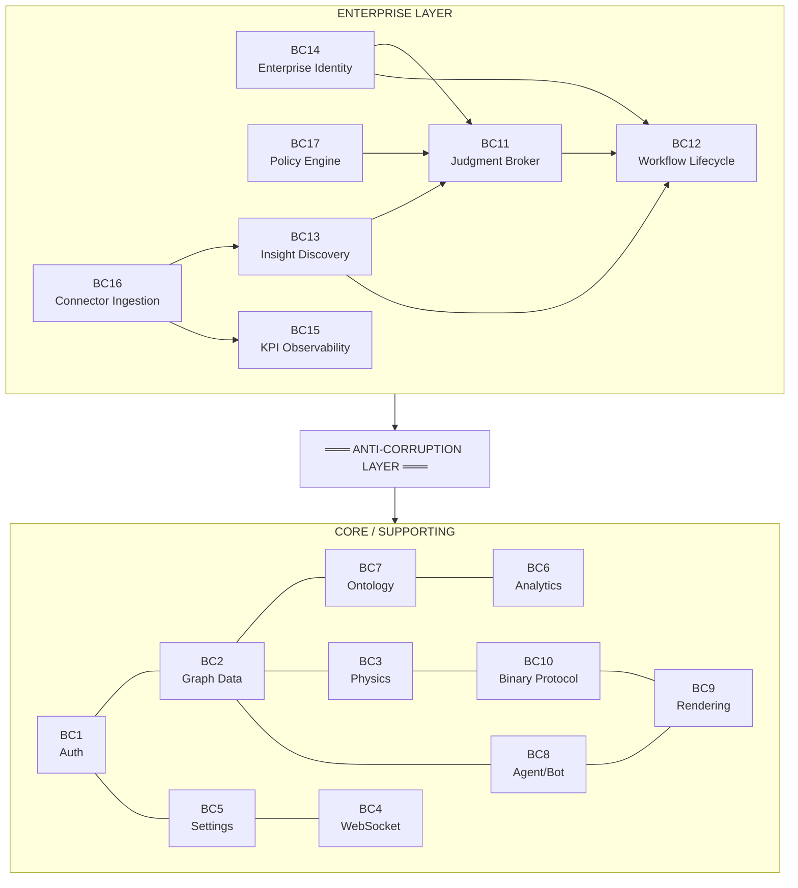
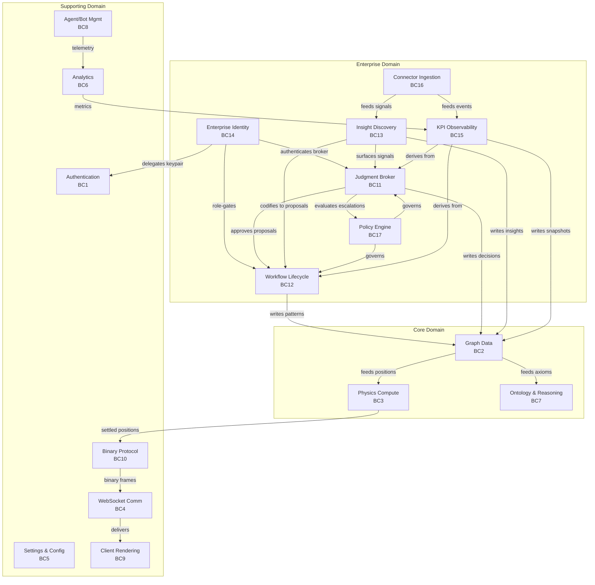
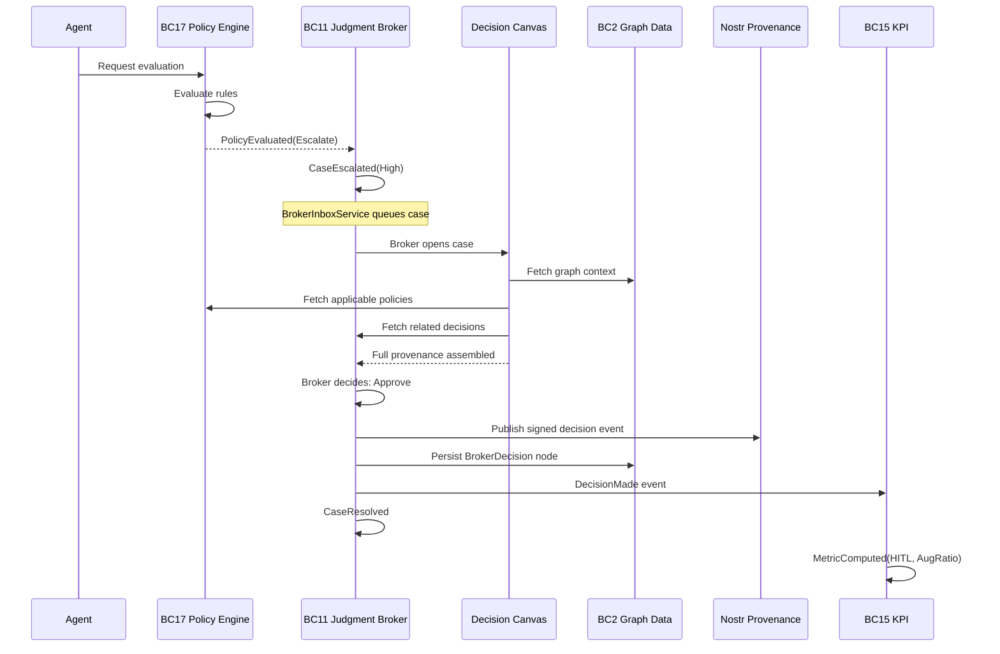
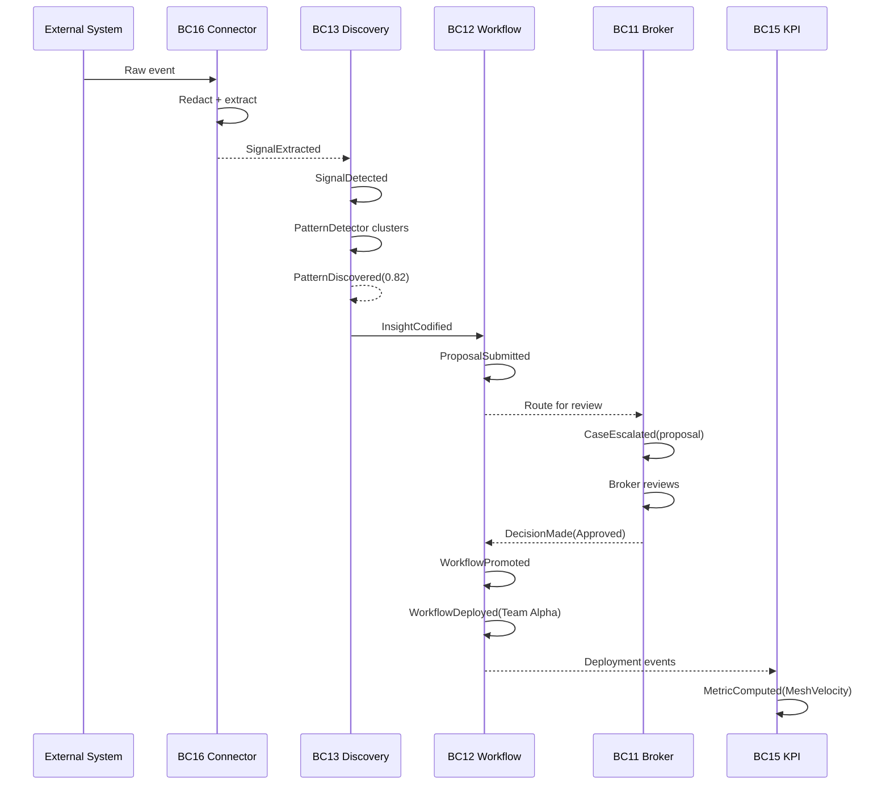

# DDD Enterprise Bounded Contexts - VisionClaw

This document extends the core bounded contexts (BC1--BC10) defined in
[`ddd-bounded-contexts.md`](ddd-bounded-contexts.md) with seven enterprise
contexts (BC11--BC17) required to operationalise the Dynamic Agentic Mesh
thesis. It also extends the identity contexts defined in
[`ddd-identity-contexts.md`](ddd-identity-contexts.md) and the semantic
pipeline contexts defined in [`ddd-semantic-pipeline.md`](ddd-semantic-pipeline.md).

The enterprise contexts implement the six workstreams from the
[Enterprise PRD](../../presentation/enterprise-prd.md): Judgment Broker
Workbench, Insight Ingestion Loop, Organisational KPI & Observability,
Enterprise Identity & Access, Discovery Connectors, and Provenance, Policy,
and Digital Twin Reframing.

---

## Full Context Map (BC1--BC17)



*Context map showing all seventeen bounded contexts across enterprise, core, supporting, and generic layers. The anti-corruption layer isolates enterprise concerns from the existing substrate.*

%%{init: {'theme': 'base', 'themeVariables': {'primaryColor': '#4A90D9', 'primaryTextColor': '#fff', 'lineColor': '#2C3E50'}}}%%


---

## Domain Classification

| Context | Classification | Justification |
|---------|---------------|---------------|
| BC11 Judgment Broker | **Core** | Central to the thesis: humans judge where agents cannot |
| BC12 Workflow Lifecycle | **Core** | The compounding loop -- discovery to institutionalisation |
| BC13 Insight Discovery | **Core** | Origin of organisational learning |
| BC14 Enterprise Identity | **Supporting** | Enables enterprise adoption without replacing core identity |
| BC15 KPI Observability | **Supporting** | Measures the thesis; does not define it |
| BC16 Connector Ingestion | **Generic** | Replaceable integration plumbing |
| BC17 Policy Engine | **Supporting** | Cross-cutting governance; serves broker and workflow |

---

## BC11: Judgment Broker

**Purpose**: Provide the human control plane for cases the agentic mesh cannot
safely resolve autonomously. The Judgment Broker is the central product surface
of the Dynamic Agentic Mesh thesis.

**Aggregate Root**: `BrokerCase`

**Entities**:
- `EscalationCase` -- a runtime issue requiring broker review (confidence below threshold, trust drift, policy exception, cross-functional conflict)
- `BrokerDecision` -- the adjudication record: approve, reject, amend, delegate, promote, or mark as precedent
- `DecisionHistory` -- immutable append-only log of all decisions on a case
- `TrustAlert` -- a signal that trust variance for a workflow or agent has crossed a threshold

**Value Objects**:
- `DecisionOutcome` -- enum: Approved, Rejected, Amended, Delegated, EvidenceRequested, PromotedAsWorkflow, MarkedAsPrecedent
- `ConfidenceLevel` -- float [0.0, 1.0] with source attribution
- `EscalationPriority` -- enum: Critical, High, Medium, Low, derived from business impact and age
- `CaseProvenance` -- chain of originating signals, participating agents, graph entities, and policies evaluated

**Domain Services**:
- `BrokerInboxService` -- aggregates open escalations, proposals, trust alerts, and policy exceptions into a prioritised queue
- `DecisionCanvasService` -- assembles full provenance, suggested decisions, applicable policies, and related past decisions for a case
- `CaseRoutingService` -- routes cases to appropriate brokers based on domain expertise, workload, and separation-of-duty rules

**Ports**:
- `BrokerRepository` (Neo4j) -- persistence of BrokerCase, EscalationCase, BrokerDecision, DecisionHistory
- `ProvenancePort` (Nostr events) -- publishes signed provenance events (NIP-based) for every decision

**Domain Events**:
- `CaseEscalated { case_id, source, priority, confidence, timestamp }`
- `DecisionMade { case_id, broker_id, outcome, provenance_event_id, timestamp }`
- `CaseResolved { case_id, final_outcome, resolution_time, timestamp }`
- `TrustDriftDetected { workflow_id, agent_id, variance, threshold, timestamp }`

**Invariants**:
- Every decision must have a provenance chain linking to source signals and participating agents
- No self-review: a broker cannot adjudicate a case they originated or that involves their own workflow submissions
- Auto-resolution is only permitted when confidence exceeds the configured threshold AND no applicable policy requires human review
- DecisionHistory is append-only; decisions cannot be deleted or modified after recording
- Cases older than the configured SLA window auto-escalate in priority

**Key API Surface**: `/api/broker/inbox`, `/api/broker/cases/{id}`, `/api/broker/cases/{id}/decide`

---

## BC12: Workflow Lifecycle

**Purpose**: Manage the full lifecycle of organisational workflows from proposal
through promotion, deployment, adoption measurement, and rollback. This is the
mechanism through which the compounding loop produces lasting organisational
capability.

**Aggregate Root**: `WorkflowProposal`

**Entities**:
- `WorkflowVersion` -- immutable snapshot of a proposal at a point in time, supporting diff and audit
- `WorkflowPattern` -- an approved, reusable workflow template published into live orchestration
- `DeploymentRecord` -- tracks pilot rollout, staged rollout, and production deployment of a pattern
- `RollbackRecord` -- captures when, why, and by whom a deployment was rolled back

**Value Objects**:
- `WorkflowStatus` -- enum: Draft, Submitted, UnderReview, Approved, Rejected, Promoted, Deployed, RolledBack, Archived
- `VersionDiff` -- structured diff between two WorkflowVersion snapshots
- `DeploymentScope` -- teams, functions, or agent types a deployment targets
- `AdoptionMetric` -- reuse count, adaptation count, team spread, time-to-first-reuse

**Domain Services**:
- `WorkflowProposalService` -- creates proposals, manages versioning, validates schema
- `PromotionService` -- promotes approved proposals to WorkflowPattern, manages staged rollout
- `RollbackService` -- reverts a deployment, records rollback reason and restores previous state

**Ports**:
- `WorkflowRepository` (Neo4j) -- persistence of proposals, versions, patterns, and deployment records
- `WorkflowPatternStore` -- read-optimised store for active patterns used by agent orchestration

**Domain Events**:
- `ProposalSubmitted { proposal_id, author_id, source_insight_id, timestamp }`
- `ProposalReviewed { proposal_id, broker_id, outcome, timestamp }`
- `WorkflowPromoted { proposal_id, pattern_id, scope, timestamp }`
- `WorkflowDeployed { pattern_id, deployment_id, scope, timestamp }`
- `WorkflowRolledBack { pattern_id, deployment_id, reason, rolled_back_by, timestamp }`

**Invariants**:
- Proposals are immutable after submission; amendments create a new WorkflowVersion
- Promoted workflows must have at least one broker approval (no self-promotion)
- Every WorkflowPattern must reference the proposal and decision that created it
- Deployment scope must be explicitly configured by an admin; no unbounded rollout
- Rollback preserves the rolled-back version for audit; it does not delete it

**Key API Surface**: `/api/workflows/proposals`, `/api/workflows/patterns`, `/api/workflows/deploy`, `/api/workflows/rollback`

---

## BC13: Insight Discovery

**Purpose**: Detect, aggregate, and codify organisational patterns from signals
originating in human actions, agent actions, and connected enterprise systems.
Insights are the raw material of the compounding loop.

**Aggregate Root**: `Insight`

**Entities**:
- `DiscoverySignal` -- a single observation: repeated workaround, repeated prompt, repeated graph traversal, approval bottleneck, shadow workflow
- `PatternCandidate` -- a cluster of related signals that may constitute a codifiable workflow
- `IngestionRecord` -- tracks which connector, batch, and time window produced a signal

**Value Objects**:
- `SignalStrength` -- float [0.0, 1.0] representing confidence that the signal is meaningful
- `PatternType` -- enum: RecurringWorkaround, RepeatedPrompt, ApprovalBottleneck, ShadowWorkflow, CrossFunctionalHandoffFailure, LocalAutomation
- `SourceReference` -- connector type, external system ID, and timestamp of the original observation

**Domain Services**:
- `DiscoveryEngine` -- orchestrates pattern detection across signals from all sources
- `PatternDetector` -- applies detection algorithms (frequency, clustering, anomaly) to signal streams
- `SignalAggregator` -- deduplicates, merges, and strengthens signals from multiple sources

**Ports**:
- `ConnectorPort` (trait per connector type) -- receives signals from BC16 Connector Ingestion
- `InsightRepository` (Neo4j) -- persistence of Insight, DiscoverySignal, PatternCandidate

**Domain Events**:
- `SignalDetected { signal_id, source, pattern_type, strength, timestamp }`
- `PatternDiscovered { pattern_id, signal_ids, pattern_type, confidence, timestamp }`
- `InsightCodified { insight_id, proposal_id, timestamp }` -- insight has been converted to a WorkflowProposal
- `InsightDismissed { insight_id, reason, dismissed_by, timestamp }`

**Invariants**:
- Insights must reference at least one DiscoverySignal
- Codification (conversion to WorkflowProposal) requires a minimum evidence threshold: at least N signals above strength S
- Dismissed insights preserve the dismissal reason for future learning
- Signals from redacted sources must not contain PII or content that violates redaction rules (enforced at ingestion boundary)

**Key API Surface**: `/api/insights`, `/api/insights/{id}/codify`, `/api/insights/{id}/dismiss`

---

## BC14: Enterprise Identity

**Purpose**: Bridge enterprise identity systems (OIDC, SAML) with VisionClaw's
Nostr-native identity and Solid Pod data sovereignty model. Enterprise users
authenticate via their organisation's identity provider while the system
transparently manages delegated Nostr keypairs for signed provenance.

**Aggregate Root**: `EnterpriseUser`

**Entities**:
- `OIDCSession` -- an active session from an enterprise identity provider, holding claims, token expiry, and refresh state
- `NostrKeyDelegation` -- a server-managed, ephemeral secp256k1 keypair delegated to an enterprise user for provenance signing
- `RoleAssignment` -- maps an enterprise user to one or more VisionClaw roles with effective dates
- `GroupMembership` -- enterprise group or team membership, synced from SCIM or OIDC claims

**Value Objects**:
- `EnterpriseRole` -- enum: Broker, Admin, Auditor, Contributor
- `OIDCClaims` -- issuer, subject, email, groups, custom claims extracted from the ID token
- `DelegatedKeyPair` -- the ephemeral Nostr keypair, its NIP-26 delegation token, and expiry

**Domain Services**:
- `IdentityBridgeService` -- maps OIDC sessions to Nostr key delegations, manages the dual identity model
- `RoleMappingService` -- derives VisionClaw roles from enterprise group memberships and custom claims
- `KeyDelegationService` -- generates, stores (in Solid Pod or secure enclave), rotates, and revokes delegated Nostr keypairs

**Ports**:
- `OIDCProviderPort` -- integration with enterprise identity providers (Microsoft Entra ID, Okta, Google Workspace, etc.)
- `NostrKeyStore` (Solid Pod) -- secure storage of delegated keypairs in the user's own Pod
- `EnterpriseUserRepository` -- persistence of user-role-group mappings

**Domain Events**:
- `UserAuthenticated { user_id, oidc_issuer, enterprise_groups, timestamp }`
- `RoleAssigned { user_id, role, assigned_by, effective_from, timestamp }`
- `KeyDelegated { user_id, delegated_pubkey, delegation_token, expires_at, timestamp }`
- `SessionExpired { user_id, session_id, timestamp }`

**Invariants**:
- One OIDC identity maps to exactly one delegated Nostr keypair at any point in time
- Role changes require admin approval; self-elevation is prohibited
- Delegated keypairs expire with the OIDC session; expired keys cannot sign events
- The private half of a delegated keypair is stored only in the user's Solid Pod or a secure enclave, never in the application database
- Audit logs preserve both enterprise identity (OIDC subject) and Nostr pubkey for every action

**Key API Surface**: `/api/auth/oidc/callback`, `/api/auth/roles`, `/api/auth/delegation`

**Relationship to BC1 (Authentication)**: BC14 sits upstream of BC1. The IdentityBridgeService produces a valid NostrSession (BC1 aggregate root) from an OIDC login, shielding the rest of the system from enterprise identity complexity.

---

## BC15: KPI Observability

**Purpose**: Continuously compute, store, and expose the four organisational
KPIs defined in the Dynamic Agentic Mesh thesis. Every metric must be traceable
from its displayed value to the source events that produced it.

**Aggregate Root**: `OrganisationalMetricSnapshot`

**Entities**:
- `MeshVelocityMetric` -- time from first discovery signal to approved reusable workflow
- `AugmentationRatioMetric` -- proportion of decision or workflow volume resolved without escalation
- `TrustVarianceMetric` -- rolling variance in decision quality, override rates, or policy exceptions
- `HITLPrecisionMetric` -- percentage of escalations where human intervention materially changed the outcome

**Value Objects**:
- `MetricValue` -- the computed value, its unit, and its computation timestamp
- `TimeWindow` -- start, end, and granularity (hourly, daily, weekly, monthly)
- `MetricLineage` -- references to the source events, workflows, and decisions that fed the computation
- `ConfidenceBand` -- upper and lower bounds reflecting data completeness and statistical confidence

**Domain Services**:
- `KPIComputationService` -- computes each KPI from event streams within configured time windows
- `LineageTracker` -- records which source events contributed to each metric snapshot for full auditability
- `DashboardService` -- provides sliced, filtered, and aggregated views for executive, broker, ops, and pilot dashboards

**Ports**:
- `MetricRepository` (Neo4j) -- persistence of OrganisationalMetricSnapshot and lineage
- `EventSourcePort` -- subscribes to domain events from BC11, BC12, BC13, BC16, and BC17

**Domain Events**:
- `MetricComputed { metric_type, value, time_window, lineage_count, timestamp }`
- `ThresholdBreached { metric_type, value, threshold, direction, timestamp }`
- `TrendDetected { metric_type, trend_direction, duration, confidence, timestamp }`

**Invariants**:
- Every metric must have traceable lineage to source events; no metric without provenance
- Snapshots are append-only; historical values are never overwritten
- Confidence bands must be computed and displayed; metrics without sufficient data are marked as provisional
- Freshness window is configurable per metric; stale metrics are flagged
- KPI values can be sliced by workflow, team, function, agent type, and time window

**Key API Surface**: `/api/mesh-metrics`, `/api/mesh-metrics/{type}`, `/api/mesh-metrics/{type}/lineage`

---

## BC16: Connector Ingestion

**Purpose**: Ingest structured events from enterprise collaboration and work
systems, applying redaction, scoping, and rate control before passing signals
to the Insight Discovery context. Connectors are the system's eyes into the
enterprise.

**Aggregate Root**: `ConnectorSource`

**Entities**:
- `IngestionJob` -- a single execution of a connector sync: batch ID, time range, status, record count
- `SyncState` -- the high-water mark for incremental sync: last sync time, cursor, page token
- `RedactionRule` -- a configured rule for removing or masking PII, content, or metadata before storage

**Value Objects**:
- `ConnectorType` -- enum: Slack, MicrosoftTeams, Jira, Confluence, Notion, GoogleWorkspace, GitHub, ServiceNow, Salesforce, Custom
- `SyncFrequency` -- enum: RealTime, Hourly, Daily, Weekly, Manual
- `IngestionScope` -- teams, channels, projects, or repositories the connector is permitted to access
- `RedactionConfig` -- the set of active RedactionRules for a connector source

**Domain Services**:
- `ConnectorManager` -- registers, configures, enables, disables, and monitors connector sources
- `IngestionOrchestrator` -- schedules and executes ingestion jobs, manages retries and backoff
- `RedactionPipeline` -- applies RedactionRules to raw events before they enter the system

**Ports**:
- `ExternalSystemPort` (trait per connector type) -- the integration interface each connector implements
- `IngestionRepository` -- persistence of ConnectorSource, IngestionJob, SyncState

**Domain Events**:
- `IngestionStarted { job_id, connector_id, connector_type, scope, timestamp }`
- `SignalExtracted { job_id, signal_count, redacted_count, timestamp }`
- `IngestionCompleted { job_id, records_processed, signals_extracted, duration, timestamp }`
- `IngestionFailed { job_id, error, retry_count, timestamp }`

**Invariants**:
- Redaction runs before storage; no raw external content is persisted without passing through the RedactionPipeline
- Ingestion scope must be admin-configured; connectors cannot expand their own scope
- No unbounded ingestion: every connector must have a configured scope and rate limit
- Failed ingestion jobs do not block other connectors or downstream processing
- Connector credentials are stored in the platform's secret manager, never in the application database

**Key API Surface**: `/api/connectors`, `/api/connectors/{id}/sync`, `/api/connectors/{id}/status`

---

## BC17: Policy Engine

**Purpose**: Evaluate configurable policy rules against broker decisions,
workflow promotions, agent actions, and system events. The policy engine is the
governance backbone that ensures the agentic mesh operates within organisational
and regulatory constraints.

**Aggregate Root**: `PolicyRuleSet`

**Entities**:
- `PolicyRule` -- a single evaluable rule: condition, action (Allow/Deny/Escalate), priority, and scope
- `PolicyEvaluation` -- the record of a rule evaluation: input, matched rules, result, and timestamp
- `PolicyOverride` -- an explicit override of a policy result by a broker, with justification

**Value Objects**:
- `PolicyResult` -- enum: Allow, Deny, Escalate
- `RuleCondition` -- the predicate: role, domain, confidence threshold, workflow type, agent type, etc.
- `OverrideJustification` -- free-text justification plus references to supporting evidence

**Domain Services**:
- `PolicyEvaluationService` -- evaluates a request against all applicable rules, returns the resulting PolicyResult
- `RuleConfigurationService` -- manages the creation, update, and deactivation of policy rules

**Ports**:
- `PolicyRepository` -- persistence of PolicyRuleSet, PolicyRule, PolicyEvaluation
- `AuditLogPort` -- publishes all evaluations and overrides to the audit trail

**Domain Events**:
- `PolicyEvaluated { evaluation_id, request_type, matched_rules, result, timestamp }`
- `PolicyOverridden { evaluation_id, override_id, broker_id, justification, timestamp }`
- `RuleSetUpdated { rule_set_id, change_type, updated_by, timestamp }`

**Invariants**:
- All evaluations are logged; no policy check can execute without producing an audit record
- Overrides require a justification and broker approval; unjustified overrides are rejected
- Rule changes are versioned; the active rule set at any historical point can be reconstructed
- Escalate results route to BC11 (Judgment Broker); they do not silently default to Allow
- Rules are evaluated in priority order; first match wins within a rule set

**Key API Surface**: `/api/policy/evaluate`, `/api/policy/rules`, `/api/policy/overrides`

---

## Anti-Corruption Layers

The enterprise contexts (BC11--BC17) communicate with the existing core and
supporting contexts (BC1--BC10) through explicit anti-corruption layers. These
layers translate between the enterprise ubiquitous language and the core
ubiquitous language, preventing semantic leakage.

### ACL 1: Enterprise Identity --> Authentication (BC14 --> BC1)

| Enterprise Concept | Core Concept | Translation |
|--------------------|-------------|-------------|
| `OIDCSession` | `NostrSession` | IdentityBridgeService creates a NostrSession from OIDC claims + delegated keypair |
| `EnterpriseRole` | `FeatureAccess` | RoleMappingService converts roles to feature access flags |
| `GroupMembership` | (not present in BC1) | Groups are consumed by BC17 Policy Engine, not by core auth |

**Implementation**: The `IdentityBridgeService` in BC14 acts as an adapter. It
accepts an OIDC callback, generates or retrieves the delegated Nostr keypair,
and produces a `NostrSession` that BC1 understands. The rest of the system sees
only a standard NostrSession.

### ACL 2: Judgment Broker --> Graph Data (BC11 --> BC2)

| Enterprise Concept | Core Concept | Translation |
|--------------------|-------------|-------------|
| `BrokerCase` | `Node` (type: EscalationCase) | BrokerCase is persisted as a typed graph node with metadata |
| `BrokerDecision` | `Node` (type: BrokerDecision) | Decisions are graph nodes linked to cases via typed edges |
| `CaseProvenance` | `Edge` (type: ProvenanceChain) | Provenance chains become graph edges linking decisions to source nodes |

**Implementation**: A `BrokerGraphAdapter` translates between the rich domain
objects in BC11 and the flattened node/edge model in BC2. The adapter ensures
that enterprise metadata (confidence, priority, outcome) is stored as node
properties while maintaining BC2's invariant of string node IDs.

### ACL 3: Workflow Lifecycle --> Graph Data (BC12 --> BC2)

| Enterprise Concept | Core Concept | Translation |
|--------------------|-------------|-------------|
| `WorkflowProposal` | `Node` (type: WorkflowProposal) | Proposals become graph nodes with status and version metadata |
| `WorkflowPattern` | `Node` (type: WorkflowPattern) | Approved patterns are graph nodes linked to proposal nodes |
| `DeploymentRecord` | `Edge` (type: DeployedTo) | Deployments are edges from patterns to scope nodes (teams, functions) |

### ACL 4: Insight Discovery --> Graph Data (BC13 --> BC2)

| Enterprise Concept | Core Concept | Translation |
|--------------------|-------------|-------------|
| `Insight` | `Node` (type: Insight) | Insights are graph nodes linked to signal source nodes |
| `DiscoverySignal` | `Node` (type: DiscoverySignal) | Signals are nodes linked to connectors and graph entities |
| `InsightCodified` event | `Edge` (type: CodifiedAs) | Codification creates an edge from Insight to WorkflowProposal |

### ACL 5: KPI Observability --> Analytics (BC15 --> BC6)

| Enterprise Concept | Core Concept | Translation |
|--------------------|-------------|-------------|
| `OrganisationalMetricSnapshot` | `AnalyticsState` extension | KPI snapshots extend the analytics model with enterprise metrics |
| `MetricLineage` | (not present in BC6) | Lineage is a BC15-only concept; BC6 sees only aggregated values |

**Implementation**: BC15 subscribes to domain events from BC11, BC12, BC13,
and BC16. It computes metrics independently and writes snapshots to Neo4j
through a `MetricGraphAdapter`. BC6 can read these snapshots for display but
does not compute them.

### ACL 6: Connector Ingestion --> External Systems (BC16 --> external)

| Enterprise Concept | External Concept | Translation |
|--------------------|-----------------|-------------|
| `DiscoverySignal` | Slack message, Jira issue, GitHub PR, etc. | Each connector adapter extracts structured signals from raw external events |
| `RedactionRule` | (no external equivalent) | Redaction is applied at the boundary before any external content enters the system |

**Implementation**: Each connector implements the `ExternalSystemPort` trait.
The adapter normalises external events into `DiscoverySignal` value objects,
applies `RedactionPipeline`, and emits `SignalExtracted` events. The rest of
the system never sees raw external content.

---

## Context Mapping Patterns

| Relationship | Pattern | Direction | Notes |
|-------------|---------|-----------|-------|
| BC14 --> BC1 | **Anti-Corruption Layer** | Upstream (BC14) to Downstream (BC1) | Enterprise identity shields core auth from OIDC complexity |
| BC11 --> BC2 | **Customer-Supplier** | Customer (BC11) defines needs, Supplier (BC2) stores | Broker defines what graph entities it needs |
| BC12 --> BC2 | **Customer-Supplier** | Customer (BC12) defines needs, Supplier (BC2) stores | Workflow defines its graph representation |
| BC13 --> BC12 | **Partnership** | Tight collaboration | Insights codify into WorkflowProposals |
| BC11 <--> BC12 | **Partnership** | Bidirectional | Broker approves proposals; proposals create escalation cases |
| BC16 --> BC13 | **Customer-Supplier** | Customer (BC13) defines signal schema, Supplier (BC16) delivers | Connectors conform to the signal schema |
| BC17 --> BC11 | **Published Language** | Policy emits Escalate results consumed by Broker | Shared event schema |
| BC15 --> BC11,12,13,16 | **Conformist** | BC15 conforms to domain events from all upstream contexts | KPI reads events, never writes to upstream |
| BC14 --> Identity Contexts | **Open Host Service** | BC14 exposes a standard OIDC callback consumed by enterprise IdPs | Standard protocol |

---

## Ubiquitous Language Additions

| Term | Definition | Context |
|------|-----------|---------|
| **Judgment Broker** | A human role that reviews cases the agentic mesh cannot safely resolve autonomously | BC11 |
| **Escalation Case** | A runtime situation requiring broker review: confidence too low, trust drift, policy exception, or cross-functional conflict | BC11 |
| **Decision Canvas** | The full-context view a broker uses to adjudicate a case: provenance, graph, policies, past decisions | BC11 |
| **Trust Drift** | A measurable increase in variance of decision quality, override rates, or policy exceptions for a workflow or agent | BC11, BC15 |
| **Workflow Proposal** | A structured candidate workflow submitted for broker review, either manually or via automated discovery | BC12 |
| **Workflow Pattern** | An approved, reusable workflow template published into live orchestration | BC12 |
| **Promotion** | The act of converting an approved WorkflowProposal into a live WorkflowPattern | BC12 |
| **Rollback** | Reverting a deployed WorkflowPattern to its previous state while preserving audit history | BC12 |
| **Insight** | A codified pattern discovered from one or more signals, representing potential organisational learning | BC13 |
| **Discovery Signal** | A single observation of a potentially meaningful organisational pattern | BC13 |
| **Codification** | Converting an Insight into a structured WorkflowProposal | BC13 |
| **Enterprise User** | A user authenticated via OIDC whose Nostr keypair is managed by the platform via delegation | BC14 |
| **Key Delegation** | Server-side generation of an ephemeral Nostr keypair mapped to an OIDC session, stored in the user's Solid Pod | BC14 |
| **Mesh Velocity** | KPI: time from first discovery signal to approved reusable workflow | BC15 |
| **Augmentation Ratio** | KPI: proportion of decision volume resolved without escalation | BC15 |
| **Trust Variance** | KPI: rolling variance in decision quality and override rates | BC15 |
| **HITL Precision** | KPI: percentage of escalations where human intervention materially changed the outcome | BC15 |
| **Metric Lineage** | The traceable chain from a displayed metric value to the source events that produced it | BC15 |
| **Connector Source** | A configured integration with an external enterprise system | BC16 |
| **Redaction** | Removing or masking PII and sensitive content from ingested signals before storage | BC16 |
| **Policy Rule Set** | A versioned collection of rules governing what actions are allowed, denied, or escalated | BC17 |
| **Policy Override** | An explicit broker exception to a policy result, requiring justification and audit | BC17 |

---

## Event Flow Diagrams

### Scenario 1: Escalation Flow (Confidence Below Threshold)

```
Agent action
    │
    ▼
BC17 Policy Engine ──── PolicyEvaluated(result: Escalate)
    │
    ▼
BC11 Judgment Broker ── CaseEscalated(priority: High)
    │
    ├── BrokerInboxService adds to queue
    │
    ▼
Broker opens Decision Canvas
    │
    ├── DecisionCanvasService assembles provenance
    │   ├── Source signals (BC13)
    │   ├── Graph context (BC2)
    │   ├── Applicable policies (BC17)
    │   └── Related past decisions (BC11)
    │
    ▼
Broker decides: Approve
    │
    ├── DecisionMade(outcome: Approved)
    │   ├── ProvenancePort publishes signed Nostr event
    │   └── BrokerRepository persists decision
    │
    ├── CaseResolved(final_outcome: Approved)
    │
    └── BC15 KPI ── MetricComputed(HITLPrecision, AugmentationRatio)
```

%%{init: {'theme': 'base', 'themeVariables': {'primaryColor': '#4A90D9', 'primaryTextColor': '#fff', 'lineColor': '#2C3E50'}}}%%


### Scenario 2: Workflow Promotion (Discovery to Deployment)

```
External system event (e.g., Jira)
    │
    ▼
BC16 Connector ──── IngestionStarted
    │
    ├── RedactionPipeline applies rules
    │
    ▼
BC16 ──── SignalExtracted ──── IngestionCompleted
    │
    ▼
BC13 Insight Discovery ── SignalDetected (repeated workaround)
    │
    ├── PatternDetector clusters signals
    │
    ▼
BC13 ──── PatternDiscovered (confidence: 0.82)
    │
    ├── Evidence threshold met
    │
    ▼
BC13 ──── InsightCodified ──── creates WorkflowProposal in BC12
    │
    ▼
BC12 Workflow ──── ProposalSubmitted
    │
    ▼
BC11 Broker ──── CaseEscalated (proposal review)
    │
    ├── Broker reviews proposal on Decision Canvas
    │
    ▼
BC11 ──── DecisionMade(Approved)
    │
    ▼
BC12 ──── ProposalReviewed(Approved) ──── WorkflowPromoted
    │
    ├── PromotionService creates WorkflowPattern
    │
    ▼
BC12 ──── WorkflowDeployed (scope: Team Alpha, pilot)
    │
    ▼
BC15 KPI ──── MetricComputed(MeshVelocity: 12 days)
```

%%{init: {'theme': 'base', 'themeVariables': {'primaryColor': '#4A90D9', 'primaryTextColor': '#fff', 'lineColor': '#2C3E50'}}}%%


### Scenario 3: KPI Computation (Trust Variance Breach)

```
BC11 Broker ──── DecisionMade (override of prior decision)
    │
    ▼
BC15 KPI EventSourcePort receives event
    │
    ├── KPIComputationService recalculates TrustVariance
    │   ├── Rolls over configured time window
    │   ├── Computes variance across override rates
    │   └── Compares against threshold
    │
    ▼
BC15 ──── MetricComputed(TrustVariance: 0.34)
    │
    ├── Threshold is 0.25
    │
    ▼
BC15 ──── ThresholdBreached(TrustVariance, 0.34, 0.25, Rising)
    │
    ▼
BC11 Broker ──── TrustDriftDetected (from threshold breach)
    │
    ├── BrokerInboxService creates TrustAlert
    │
    ▼
Broker investigates drift in Decision Canvas
```

---

## Data Ownership Table

| Entity | Owning Context | Primary Storage | Secondary Storage | Notes |
|--------|---------------|-----------------|-------------------|-------|
| BrokerCase | BC11 | Neo4j | -- | Graph node with typed edges to decisions and escalations |
| EscalationCase | BC11 | Neo4j | -- | Graph node linked to source entities |
| BrokerDecision | BC11 | Neo4j | Nostr (provenance event) | Decision node + signed NIP event |
| DecisionHistory | BC11 | Neo4j | -- | Append-only edge chain |
| TrustAlert | BC11 | Neo4j | -- | Transient; resolved alerts archived |
| WorkflowProposal | BC12 | Neo4j | -- | Immutable versions as separate nodes |
| WorkflowVersion | BC12 | Neo4j | -- | Linked to proposal via VERSIONED_AS edge |
| WorkflowPattern | BC12 | Neo4j | Pattern cache (read replica) | Active patterns cached for orchestration |
| DeploymentRecord | BC12 | Neo4j | -- | Edge from pattern to scope |
| RollbackRecord | BC12 | Neo4j | -- | Edge from deployment to rollback cause |
| Insight | BC13 | Neo4j | -- | Graph node linked to signals |
| DiscoverySignal | BC13 | Neo4j | -- | Graph node linked to connector source |
| PatternCandidate | BC13 | Neo4j | -- | Intermediate; promoted to Insight or discarded |
| IngestionRecord | BC13 | Neo4j | -- | Linked to connector source and job |
| EnterpriseUser | BC14 | Application DB | -- | OIDC claims + role mappings |
| OIDCSession | BC14 | Application DB (ephemeral) | -- | Session-scoped; expires with token |
| NostrKeyDelegation | BC14 | Solid Pod (private half) | Application DB (public half) | Private key never in app DB |
| RoleAssignment | BC14 | Application DB | -- | Versioned with effective dates |
| GroupMembership | BC14 | Application DB | -- | Synced from SCIM or OIDC claims |
| OrganisationalMetricSnapshot | BC15 | Neo4j | -- | Append-only time series |
| MetricLineage | BC15 | Neo4j | -- | Edges from snapshot to source events |
| ConnectorSource | BC16 | Application DB | -- | Credentials in secret manager |
| IngestionJob | BC16 | Application DB | -- | Transient execution records |
| SyncState | BC16 | Application DB | -- | High-water marks for incremental sync |
| RedactionRule | BC16 | Application DB | -- | Admin-configured |
| PolicyRuleSet | BC17 | Application DB | Neo4j (for graph queries) | Versioned rule sets |
| PolicyRule | BC17 | Application DB | -- | Individual rules within a set |
| PolicyEvaluation | BC17 | Application DB | Audit log | Every evaluation logged |
| PolicyOverride | BC17 | Application DB | Audit log + Nostr event | Overrides are signed provenance events |

**Storage Legend**:
- **Neo4j**: Graph entities that participate in the knowledge graph, visible in the coordination digital twin
- **Application DB**: Operational data (PostgreSQL) that does not need graph traversal
- **Solid Pod**: User-owned data under the user's sovereignty
- **Nostr**: Signed, append-only provenance events
- **Secret Manager**: Connector credentials and sensitive configuration

---

## Aggregate Design Rules (Enterprise Contexts)

These rules extend the aggregate design rules from the core DDD document:

1. **Aggregates are small** -- one case = one BrokerCase, one proposal = one WorkflowProposal
2. **Reference between contexts by ID** -- enterprise contexts reference core entities by string ID (node ID, edge ID), never by direct object reference
3. **Domain events for cross-context communication** -- all inter-context communication uses published domain events, not direct method calls
4. **Enterprise contexts NEVER modify core context aggregates directly** -- they go through anti-corruption layer adapters
5. **Provenance is mandatory** -- every state change in BC11, BC12, and BC17 produces a signed provenance event
6. **Append-only where audit matters** -- DecisionHistory, MetricSnapshot, PolicyEvaluation, and RollbackRecord are append-only
7. **Redaction at the boundary** -- BC16 applies redaction before any data crosses into the system; downstream contexts can assume data is clean

---

## Neo4j Node Type Extensions

The enterprise contexts add the following node types to the existing type system
(see ADR-036 for the consolidated node type enum):

| Node Type | Label | Enterprise Context | Properties |
|-----------|-------|-------------------|------------|
| EscalationCase | `:EscalationCase` | BC11 | priority, confidence, source, status, created_at |
| BrokerDecision | `:BrokerDecision` | BC11 | outcome, broker_id, provenance_event_id, decided_at |
| TrustAlert | `:TrustAlert` | BC11 | workflow_id, variance, threshold, status |
| WorkflowProposal | `:WorkflowProposal` | BC12 | status, author_id, source_insight_id, version |
| WorkflowPattern | `:WorkflowPattern` | BC12 | name, scope, deployment_status, approved_at |
| Insight | `:Insight` | BC13 | pattern_type, signal_count, strength, status |
| DiscoverySignal | `:DiscoverySignal` | BC13 | source, pattern_type, strength, connector_id |
| MetricSnapshot | `:MetricSnapshot` | BC15 | metric_type, value, time_window, confidence_band |

### Neo4j Relationship Type Extensions

| Relationship | From | To | Enterprise Context |
|-------------|------|----|--------------------|
| `ESCALATED_FROM` | EscalationCase | (source node) | BC11 |
| `DECIDED_BY` | BrokerDecision | EscalationCase or WorkflowProposal | BC11 |
| `PROVENANCE_CHAIN` | BrokerDecision | (any source node) | BC11 |
| `VERSIONED_AS` | WorkflowProposal | WorkflowProposal (prev version) | BC12 |
| `PROMOTED_TO` | WorkflowProposal | WorkflowPattern | BC12 |
| `DEPLOYED_TO` | WorkflowPattern | (scope node: team, function) | BC12 |
| `DISCOVERED_FROM` | Insight | ConnectorSource | BC13 |
| `CODIFIED_AS` | Insight | WorkflowProposal | BC13 |
| `SIGNAL_OF` | DiscoverySignal | Insight | BC13 |
| `DERIVED_FROM` | MetricSnapshot | (source event nodes) | BC15 |
| `POLICY_APPLIED` | PolicyEvaluation | (target node) | BC17 |

---

## Supporting Infrastructure Contexts

The following are cross-cutting infrastructure concerns consumed by all 17 bounded contexts. They are **not** DDD bounded contexts in the enterprise sense — they carry no enterprise domain logic, define no organisational ubiquitous language, and are not bounded by a strategic domain decision. They are shared platform plumbing.

### Workspace Context (Infrastructure)

**Domain**: persisted graph configurations — layout, physics parameters, node filters — saved as named workspaces per authenticated user.

**Aggregate**: `Workspace` (id, name, description, type: `personal | team | public`, status: `active | archived`, WorkspaceSettings: autoSave, syncEnabled, collaborationEnabled, backupEnabled, maxMembers).

**Runtime**: `WorkspaceActor` (Actix actor) manages in-memory state; persistence via `workspace_handler.rs` REST API backed by the same storage layer as the rest of the platform.

**Relationship to enterprise BCs**: Workspaces are consumed by all 17 BCs — a broker session review, a KPI dashboard configuration, a policy audit layout can each be saved as a workspace. No enterprise domain logic lives here; workspaces are a UI persistence mechanism, not a domain object. BC11–BC17 reference workspace IDs by convention, not by domain invariant.

**API**: `GET/POST /api/workspace/list`, `POST /api/workspace/create`, `GET|PUT|DELETE /api/workspace/{id}`, `POST /api/workspace/{id}/favorite|archive`. All routes require authentication; rate-limited to 60 requests/minute.

---

### Monitoring/Health Context (Infrastructure)

**Domain**: operational health signals for the running VisionClaw platform instance.

**Components monitored**: database connectivity, graph service, physics simulation (running state, step count, energy level, GPU memory), WebSocket service, MCP relay.

**Key types**:
- `HealthStatus` — top-level status with a `components` map keyed by component name
- `PhysicsHealth` — physics-specific detail: running, steps, energy, GPU memory used/total

**Runtime**: `useHealthService` React hook polls `GET /health` (HealthStatus) and `GET /health/physics` (PhysicsHealth). MCP relay controls: `POST /health/mcp/start`, `GET /health/mcp/logs`.

**Relationship to enterprise BCs**: BC15 KPI Observability consumes health signals as one input to the platform's operational KPIs (e.g. physics simulation uptime feeds augmentation ratio calculations). Monitoring is **not** itself a BC — it is the infrastructure layer that BC15 observes. The `HealthStatus.components` map covers: `database`, `graph`, `physics`, `websocket`. No enterprise domain logic or provenance requirements apply here.

---

## Cross-Reference to Enterprise PRD

| PRD Workstream | Enterprise Context(s) | PRD Functional Requirement |
|---------------|----------------------|---------------------------|
| WS2: Enterprise Identity & Access | BC14 | FR6 |
| WS3: Judgment Broker Workbench | BC11 | FR1, FR2 |
| WS4: Insight Ingestion Loop | BC13, BC12 | FR3, FR4, FR7 |
| WS5: Organisational KPI & Observability | BC15 | FR5 |
| WS6: Discovery Connectors | BC16 | FR7 |
| WS7: Provenance, Policy, Digital Twin | BC17, BC11 (provenance) | FR8, FR9 |
| (cross-cutting) | BC17 | FR9, FR10 |
