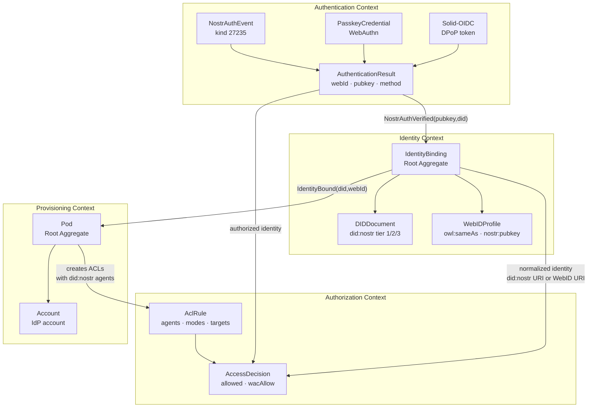

# Domain-Driven Design: Identity Bounded Contexts

**Date**: 2026-02-21 | **Scope**: did:nostr + PodKey + Passkey Integration

---

## Bounded Contexts

### 1. Authentication Context

**Responsibility**: Verify identity claims from HTTP requests.

**Aggregates**:
- `AuthenticationResult` — Value object: `{webId, pubkey, method, error}`
- `NostrAuthEvent` — Entity: kind 27235 event with signature verification
- `PasskeyCredential` — Entity: WebAuthn credential with challenge-response

**Domain Events**:
- `NostrAuthVerified(pubkey, did, webidTag)`
- `PasskeyAuthVerified(credentialId, webId)`
- `OidcAuthVerified(webId, issuer)`
- `AuthFailed(method, reason)`

**Key Files**:
- `src/auth/nostr.js` — NIP-98 Schnorr verification
- `src/auth/solid-oidc.js` — DPoP token verification
- `src/auth/token.js` — Auth dispatcher
- `src/idp/passkey.js` — WebAuthn ceremonies (from upstream)

### 2. Identity Context

**Responsibility**: Map between identity representations (did:nostr, WebID, passkey credential).

**Aggregates**:
- `IdentityBinding` — Root aggregate linking did:nostr <-> WebID <-> passkey credential
- `DIDDocument` — Value object: Tier 1/2/3 did:nostr document
- `WebIDProfile` — Value object: Turtle/JSON-LD profile with nostr:pubkey

**Domain Events**:
- `IdentityBound(did, webId)`
- `DIDDocumentGenerated(pubkey, tier)`
- `WebIDProfileEnhanced(webId, pubkey)`
- `PasskeyLinked(credentialId, did)`

**Key Files**:
- `src/auth/identity-normalizer.js` — Cross-identity matching (NEW)
- `src/auth/did-nostr.js` — DID resolution (from upstream)
- `src/did/resolver.js` — DID document generation and serving (NEW)
- `src/webid/profile.js` — WebID profile generation (enhanced)

### 3. Authorization Context

**Responsibility**: WAC-based access control using normalized identities.

**Aggregates**:
- `AccessDecision` — Value object: `{allowed, wacAllow}`
- `AclRule` — Entity: parsed ACL authorization with agents, modes, targets

**Domain Events**:
- `AccessGranted(identity, resource, mode)`
- `AccessDenied(identity, resource, mode)`

**Key Files**:
- `src/wac/checker.js` — WAC access evaluation
- `src/wac/parser.js` — ACL Turtle/JSON-LD parsing
- `src/auth/middleware.js` — Authorization middleware

### 4. Provisioning Context

**Responsibility**: Create and configure pods for new identities.

**Aggregates**:
- `Pod` — Root aggregate: directory structure, ACLs, WebID profile, DID document
- `Account` — Entity: IdP account linked to identity

**Domain Events**:
- `PodProvisioned(podName, did, webId)`
- `AccountCreated(accountId, did, webId)`
- `AccountLinked(accountId, did)`

**Key Files**:
- `src/idp/auto-provision.js` — Auto-provisioning on first auth (NEW)
- `src/idp/accounts.js` — Account CRUD
- `src/idp/interactions.js` — SSO login handlers
- `src/idp/views.js` — Login page UI

---

## Context Map

```
+------------------+     authenticates     +------------------+
| Authentication   |--------------------->| Identity         |
| Context          |                      | Context          |
|                  |<---------------------+                  |
| NIP-98, Passkey  |     resolves DID     | did:nostr, WebID |
| Solid-OIDC       |                      | Normalization    |
+------------------+                      +------------------+
        |                                          |
        | authorized identity                      | normalized identity
        v                                          v
+------------------+                      +------------------+
| Authorization    |<---------------------+ Provisioning     |
| Context          |  creates ACLs with   | Context          |
|                  |  did:nostr agents     |                  |
| WAC Checker      |                      | Auto-provision   |
| ACL Parser       |                      | Pod + Account    |
+------------------+                      +------------------+
```

*Component diagram showing the four identity bounded contexts, their aggregates, and the cross-context flows via domain events and identity references.*

%%{init: {'theme': 'base', 'themeVariables': {'primaryColor': '#4A90D9', 'primaryTextColor': '#fff', 'lineColor': '#2C3E50'}}}%%


## Ubiquitous Language

| Term | Definition |
|------|-----------|
| **did:nostr** | DID method using 64-char hex Nostr pubkey as identifier |
| **PodKey** | Chrome extension providing NIP-07 + transparent NIP-98 injection |
| **Passkey** | WebAuthn/FIDO2 credential for passwordless authentication |
| **NIP-98** | Nostr event kind 27235 for HTTP request authentication |
| **webid tag** | Optional `["webid", "did:nostr:<hex>"]` tag in NIP-98 events |
| **Identity Normalization** | Resolving did:nostr and WebID to canonical pubkey for matching |
| **Auto-provisioning** | Creating pod + account on first Nostr authentication |
| **Tier 1 DID Document** | Minimal, offline-resolvable document from pubkey alone |
| **Bidirectional Binding** | WebID profile links to DID via owl:sameAs; DID links back via alsoKnownAs |

## Aggregate Design Rules

1. Aggregates are small — one identity = one binding
2. Reference between contexts by identity string (did:nostr URI or WebID URI)
3. Domain events for cross-context communication
4. Authentication context NEVER modifies Authorization context directly
5. Provisioning context creates artifacts consumed by Identity and Authorization contexts
