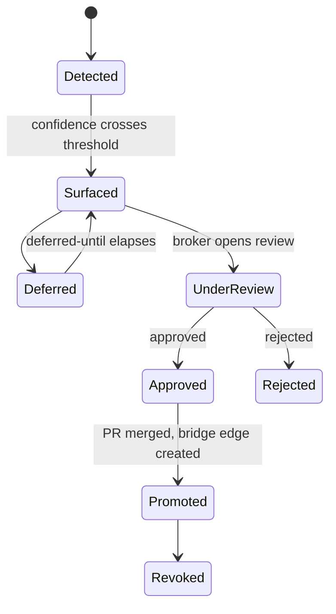

# DDD: Insight Migration Context

This document extends the enterprise bounded contexts defined in
[`ddd-enterprise-contexts.md`](ddd-enterprise-contexts.md) with migration-specific
tactical design. Migration is not a new bounded context: introducing one would
split the ubiquitous language across an artificial seam, forcing translation of
concepts that are already coherent within BC13 and BC11. Instead, migration is
modelled as a first-class concern *within* the existing contexts, adding new
aggregates, events, and ACL mappings where each concept naturally belongs.

---

## 1. Migration Aggregate Shape (BC13 Insight Discovery)

`MigrationCandidate` is a new aggregate root within BC13. It represents a KG
note that accumulated enough evidence to warrant formal promotion into the
ontology. It is distinct from `Insight` (which codifies into a `WorkflowProposal`
in BC12): a `MigrationCandidate` targets the formal ontology via BC2, not the
workflow library via BC12.

```
MigrationCandidate {
  id:                   UUID,
  canonical_iri:        String,          // ADR-048: the proposed stable IRI
  kg_node_id:           u32,             // source KGNode in BC3 graph
  proposed_ontology_iri: String,         // target OntologyClass IRI
  confidence:           f32,             // [0.0, 1.0]
  signals:              Vec<MigrationSignal>,
  detected_at:          DateTime<Utc>,
  detected_by:          ActorIdentity,   // agent npub | "system"
  status:               MigrationStatus,
  bridge_edge_id:       Option<String>,  // BRIDGE_TO edge once promoted
}
```

`ActorIdentity` is a value object whose variants cover both autonomous detection
(`System { detector_version }`) and agent-initiated proposals
(`Agent { npub: String, rationale: String }`). This variant is surfaced on the
broker canvas when a human reviews the case.

### MigrationSignal (Value Object)

Signals are the composable evidence units that drive `confidence`. Each signal
type carries enough detail for a broker to assess provenance without consulting
external systems.

| Variant | Fields |
|---------|--------|
| `WikilinkToOntology` | `target_iri: String`, `count: u32` |
| `SemanticCooccurrence` | `cluster_id: String`, `similarity: f32` |
| `ExplicitDeclaration` | `property: String`, `value: String` (e.g. `owl:class:: SomeClass`) |
| `AgentProposal` | `agent_identity: ActorIdentity`, `rationale: String` |
| `MaturityMarker` | `maturity: String`, `status: String` |

Signals are **append-only** within a candidate's lifetime. Contradictory or
superseding evidence requires a new `MigrationCandidate`; it cannot overwrite
signals on an existing one. This preserves the auditable confidence trajectory.

### MigrationStatus State Machine



---

## 2. Domain Events

All events are published by BC13 (Insight Discovery). Subscribers are listed per
event; they receive the event via the published-language event bus, not via direct
call.

### MigrationCandidateDetected

Emitted when the `DiscoveryEngine` first constructs a `MigrationCandidate`
from accumulated signals, regardless of whether confidence crosses the surfacing
threshold.

**Payload**: `{ candidate_id, kg_node_id, canonical_iri, confidence, detected_by, detected_at }`

**Subscribers**: BC15 KPI Observability (MeshVelocity clock starts).

### MigrationCandidateSurfaced

Emitted when `confidence` first crosses the configured surfacing threshold. Events
below threshold are suppressed to prevent broker inbox saturation.

**Payload**: `{ candidate_id, canonical_iri, proposed_ontology_iri, confidence, signals_count, surfaced_at }`

**Subscribers**: BC11 Judgment Broker (creates a `MigrationCase`), BC15 KPI Observability.

### MigrationReviewStarted

Emitted when a broker opens the `MigrationCase` on the Decision Canvas.

**Payload**: `{ candidate_id, case_id, broker_identity, started_at }`

**Subscribers**: BC15 KPI Observability (HITL clock starts).

### MigrationApproved

Emitted from BC11 after broker approval; BC13 receives it and transitions status
to `Approved`.

**Payload**: `{ candidate_id, pr_url, broker_identity, timestamp }`

**Subscribers**: BC13 (status transition), BC2 Ontology Governance
(`OntologyMutationService.propose()` invoked), BC15 KPI Observability.

### MigrationRejected

**Payload**: `{ candidate_id, reason: String, broker_identity, timestamp }`

**Subscribers**: BC13 (status → `Rejected`), BC15 KPI Observability.

### MigrationDeferred

**Payload**: `{ candidate_id, until: DateTime<Utc>, broker_identity, timestamp }`

**Subscribers**: BC13 (status → `Deferred`, schedules re-surface).

### MigrationPromoted

Emitted by BC13 after the ontology PR is confirmed merged and the bridge edge is
written.

**Payload**: `{ candidate_id, bridge_edge_id: String, ontology_mutation_id: String, provenance_bead_id: NostrEventId, timestamp }`

**Subscribers**: BC3 Knowledge Graph (updates `BRIDGE_TO.kind` from `"candidate"` to `"promoted"`), BC15 KPI Observability (MeshVelocity clock stops).

### MigrationRevoked

Emitted when a previously promoted ontology class is rolled back.

**Payload**: `{ candidate_id, reason: String, broker_identity, compensating_pr_url: String, timestamp }`

**Subscribers**: BC3 Knowledge Graph (updates `BRIDGE_TO.kind` to `"revoked"`),
BC2 Ontology Governance (applies compensating mutation), BC15 KPI Observability.

---

## 3. Invariants

These rules are enforced inside the `MigrationCandidate` aggregate root. Violations
produce domain errors before any state change is applied.

1. **Confidence is monotonically non-decreasing until Surfaced.** Only appending
   new signals increases `confidence`; no operation may reduce it once the
   candidate is `Surfaced`. Post-`Surfaced` re-scoring to `Rejected` or `Deferred`
   does not alter the recorded confidence value — it is the basis on which the
   broker decided.

2. **Status transitions follow the state machine exactly.** The aggregate rejects
   arbitrary transitions (e.g. `Promoted → Detected`) with
   `InvalidMigrationTransition`. The only permitted backward transitions are
   `Approved → Surfaced` (auto-revert on PR timeout) and `Deferred → Surfaced`
   (re-surface after deadline).

3. **Approved must produce a `pr_url` within five minutes.** If no
   `MigrationPromoted` event arrives within the SLA window, the aggregate
   auto-reverts to `Surfaced` and raises `MigrationPromotionTimedOut`. This
   prevents stale approvals from blocking the broker inbox.

4. **Revoked requires a compensating PR URL.** A `MigrationRevoked` transition
   without a non-empty `compensating_pr_url` is rejected. The ontology cannot be
   left in an inconsistent state with a `Promoted` bridge edge and no reversal
   commit.

5. **Signals list is append-only.** Mutation of existing signals — including
   correction of erroneous evidence — requires creating a new
   `MigrationCandidate` referencing the corrected signal set. The original
   candidate is marked `Rejected` with reason `"superseded_by:{new_id}"`.

---

## 4. Anti-Corruption Layer: BC13 to BC11 Broker

BC13 publishes `MigrationCandidateSurfaced`. BC11's `BrokerInboxService` consumes
it via the ACL and creates a `MigrationCase`, which is a subtype of `BrokerCase`
(per ADR-049). The ACL translation prevents the broker model from importing
migration-specific types.

| BC13 Field | BC11 Field | Mapping Rule |
|-----------|-----------|--------------|
| `candidate_id` | `case_id` | Direct; type changes from `UUID` to `CaseId` |
| `signals` | `case.context` | Serialised as structured evidence blocks; each signal variant becomes a named context entry |
| `confidence` | `case.priority` | `>= 0.9` → `Critical`; `0.7–0.89` → `High`; `0.5–0.69` → `Medium`; `< 0.5` → `Low` |
| `proposed_ontology_iri` | `case.target` | Stored as a string reference; BC11 does not dereference ontology IRIs |
| `canonical_iri` | `case.subject` | Human-readable label for the Decision Canvas |
| `detected_by` | `case.originator` | `ActorIdentity` serialised to broker's `OriginatorRef` |

The `MigrationCase` carries the additional field `case.type = MigrationPromosal`
to distinguish it from `EscalationCase` (confidence-breach) and
`PolicyExceptionCase` in the broker inbox. The `CaseRoutingService` uses this
type to route migration cases to brokers with ontology governance expertise.

No BC11 type crosses back into BC13 via this ACL. BC11 publishes
`BrokerApprovedMigration` (see Section 5); BC13 receives it as a plain domain
event payload, not as a BC11 object.

---

## 5. Cross-Context Events: BC11 to BC2

When the broker approves a `MigrationCase`, BC11 emits `BrokerApprovedMigration`:

```
BrokerApprovedMigration {
  case_id:              CaseId,
  candidate_id:         UUID,              // foreign key back to BC13
  proposed_ontology_iri: String,
  canonical_iri:        String,
  broker_identity:      BrokerIdentity,
  pr_url:               String,
  provenance_event_id:  NostrEventId,
  timestamp:            DateTime<Utc>,
}
```

BC2 Ontology Governance subscribes and invokes
`OntologyMutationService.propose()` (established in ADR-028 via SPARQL PATCH).
The migration payload maps directly onto the mutation request:

- `proposed_ontology_iri` → new `OntologyClass` IRI
- `canonical_iri` → `rdfs:label` on the new class
- `provenance_event_id` → stored as `prov:wasGeneratedBy` on the mutation

When agents initiate migration proposals (rather than humans), they call the
`ontology_propose` MCP tool directly. That path invokes the same
`OntologyMutationService.propose()` endpoint but bypasses the broker. The broker
path adds a human-in-the-middle gate governed by BC11 policy; both paths converge
on the same BC2 mutation service, ensuring the ontology itself has one write path.

---

## 6. MigrationMutation in BC2 (Ontology Governance)

`MigrationMutation` is a specialisation of `OntologyMutation` within BC2. It
carries back-references that enable the full round-trip audit from ontology class
to originating KG note.

```
MigrationMutation {
  id:                   OntologyMutationId,
  source_candidate_id:  UUID,             // back-reference to BC13 aggregate
  target_class_iri:     String,
  axiom_delta:          Vec<AxiomChange>,
  provenance_bead:      NostrEventId,
  reversible:           bool,             // false only for schema-breaking additions
}
```

`AxiomChange` covers: `AddSubClassOf`, `RemoveSubClassOf`, `AddLabel`,
`AddEquivalentClass`, `AddRestriction`. The `reversible` flag gates
`MigrationRevoked` handling: a non-reversible mutation requires a BC11 broker
review before the compensating SPARQL PATCH is applied.

BC2 raises `OntologyMutationApplied` after the SPARQL PATCH commits. BC13
subscribes to this event and emits `MigrationPromoted` only after confirmation,
preventing `MigrationPromoted` from firing against an uncommitted mutation.

---

## 7. Bridge Edges in BC3 (Knowledge Graph)

BC3 gains a `BRIDGE_TO` relationship type (per ADR-048). Its lifecycle is driven
entirely by events from BC13; BC3 does not contain migration logic.

| Event | BC3 Action |
|-------|-----------|
| `MigrationCandidateSurfaced` | Creates `BRIDGE_TO` edge with `kind: "candidate"`, `confidence`, `candidate_id` as properties |
| `MigrationPromoted` | Updates `BRIDGE_TO.kind` to `"promoted"`, adds `bridge_edge_id` and `ontology_mutation_id` |
| `MigrationRejected` | Removes the `BRIDGE_TO` edge (candidate edges have no audit requirement) |
| `MigrationRevoked` | Updates `BRIDGE_TO.kind` to `"revoked"`, preserves the edge for provenance traversal |

A `"revoked"` edge is never deleted. It records that the KG note was once
promoted and later reversed, which is relevant both for future re-evaluation and
for BC11 broker context on subsequent proposals. Revoked edges are filtered from
the default graph view by `EdgeType.Bridge` weight rules but remain traversable
via explicit query.

The `BRIDGE_TO` edge sits alongside the existing `Bridge = 5` `EdgeType` in the
semantic pipeline (see `ddd-semantic-pipeline.md`). Physics treats it with a
`0.5x` spring multiplier; the cross-domain weak pull is intentional — KG notes
should not collapse into their ontology class under physics force.

---

## 8. Ubiquitous Language Additions

| Term | Definition | Context |
|------|-----------|---------|
| **Candidate** | A KG note whose accumulated signals suggest it belongs in the formal ontology as a named class | BC13 |
| **Surfacing** | The transition in which a `MigrationCandidate`'s confidence crosses the configured threshold, triggering broker review | BC13 |
| **Promotion** | The acceptance of a candidate into the formal ontology, materialised as a GitHub PR merge and a `BRIDGE_TO.kind = "promoted"` edge | BC13, BC2, BC3 |
| **Bridge** | The directed `BRIDGE_TO` edge from a `KGNode` to its proposed or confirmed `OntologyClass`; kind is one of `candidate`, `promoted`, `revoked` | BC3 |
| **MigrationCase** | A `BrokerCase` subtype in BC11 representing a surfaced `MigrationCandidate` awaiting broker adjudication | BC11 |
| **Revocation** | The reversal of a promotion, creating a compensating ontology mutation and updating the bridge edge to `kind = "revoked"` without deleting provenance | BC13, BC2, BC3 |
| **ActorIdentity** | The originator of a migration signal or candidate — either the detection system or a named agent identified by Nostr public key | BC13 |
| **AxiomDelta** | The set of `AxiomChange` entries applied to the ontology as part of a `MigrationMutation` | BC2 |

---

## 9. Happy-Path Sequence Diagram

```mermaid
sequenceDiagram
    participant KG as BC3 Knowledge Graph
    participant DE as BC13 DiscoveryEngine
    participant MC as BC13 MigrationCandidate
    participant ACL as BC13→BC11 ACL
    participant JB as BC11 Judgment Broker
    participant PE as BC17 Policy Engine
    participant OG as BC2 Ontology Governance
    participant GH as GitHub PR

    KG->>DE: WikilinkToOntology signal (count=7)
    DE->>MC: append signal; recalculate confidence
    MC-->>DE: confidence=0.61 (below threshold)
    DE->>MC: SemanticCooccurrence signal (similarity=0.88)
    MC-->>DE: confidence=0.81 (threshold crossed)
    MC->>KG: create BRIDGE_TO(kind="candidate")
    MC-->>ACL: MigrationCandidateSurfaced

    ACL->>JB: create MigrationCase(priority=High, target=proposed_iri)
    JB->>PE: evaluate policy for MigrationCase
    PE-->>JB: PolicyEvaluated(Allow with human review required)
    JB->>JB: CaseEscalated → broker inbox

    Note over JB: Broker opens Decision Canvas
    JB->>MC: MigrationReviewStarted
    JB->>OG: fetch existing axioms for proposed_iri
    OG-->>JB: axiom context returned
    JB->>JB: Broker approves

    JB-->>MC: BrokerApprovedMigration(pr_url, provenance_event_id)
    MC->>MC: status → Approved
    JB->>OG: BrokerApprovedMigration event

    OG->>OG: OntologyMutationService.propose(MigrationMutation)
    OG->>GH: SPARQL PATCH → open PR
    GH-->>OG: PR merged
    OG-->>MC: OntologyMutationApplied(mutation_id)

    MC->>KG: MigrationPromoted(bridge_edge_id, mutation_id)
    KG->>KG: BRIDGE_TO.kind = "promoted"
    MC->>MC: status → Promoted
```

---

## 10. Integration Map Update

This table extends the event flow table in `ddd-enterprise-contexts.md`. New
events are marked **bold**; subscribers are listed as the contexts that react,
not merely observe.

| Event | Publisher | Subscribers | Notes |
|-------|-----------|-------------|-------|
| **MigrationCandidateDetected** | BC13 | BC15 | MeshVelocity clock starts |
| **MigrationCandidateSurfaced** | BC13 | BC11, BC3, BC15 | BC11 creates MigrationCase; BC3 creates BRIDGE_TO candidate edge |
| **MigrationReviewStarted** | BC13 | BC15 | HITL clock starts |
| **MigrationApproved** | BC11 | BC13, BC2, BC15 | BC13 transitions to Approved; BC2 invokes OntologyMutationService |
| **MigrationRejected** | BC11 | BC13, BC3, BC15 | BC3 removes BRIDGE_TO candidate edge |
| **MigrationDeferred** | BC11 | BC13 | BC13 schedules re-surface |
| **MigrationPromoted** | BC13 | BC3, BC15 | BC3 updates BRIDGE_TO to promoted; BC15 stops MeshVelocity clock |
| **MigrationRevoked** | BC11 | BC13, BC2, BC3, BC15 | BC2 applies compensating mutation; BC3 sets BRIDGE_TO to revoked |
| BrokerApprovedMigration | BC11 | BC2 | Internal routing event; BC2 triggers SPARQL PATCH |
| OntologyMutationApplied | BC2 | BC13 | Triggers MigrationPromoted only after confirmed commit |
| `CaseEscalated` (existing) | BC11 | BC15 | Unchanged; MigrationCase flows through this existing event |
| `DecisionMade` (existing) | BC11 | BC15, BC2 (for migration subtype) | BC11 decision record applies to migration cases without schema change |

The existing `BC11 → BC2` relationship changes from no direct relationship to a
**Customer-Supplier** pattern for migration decisions: BC11 defines what approval
means for a migration, and BC2 conforms to the approval payload. All other
BC11 ↔ BC2 interactions remain absent; this is the only direct channel.

The existing **Partnership** between BC13 and BC12 (`Insight → WorkflowProposal`)
is unchanged. `MigrationCandidate` and `Insight` are sibling aggregate roots in
BC13 — they share the `DiscoveryEngine` service and the `ConnectorPort` but
maintain separate lifecycles, separate event streams, and separate downstream
targets (BC2 vs. BC12).
