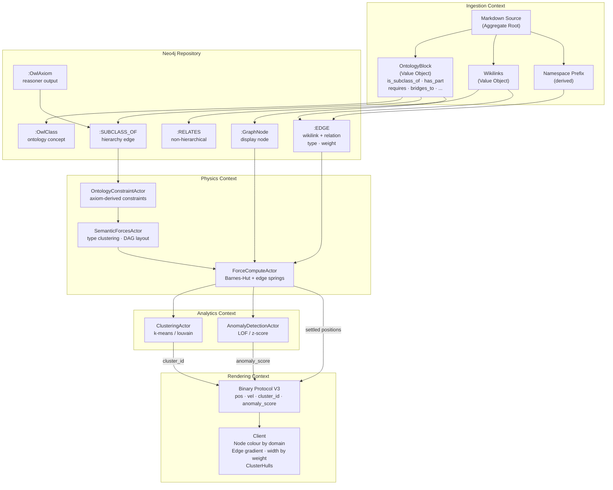

# DDD: Semantic Pipeline — Bounded Contexts

**Date**: 2026-03-25

## Domain Model

```
Markdown Source (Aggregate Root)
  ├── OntologyBlock (Value Object)
  │     ├── is_subclass_of: Vec<String>     → "hierarchical" edge, weight 2.5
  │     ├── has_part: Vec<String>           → "structural" edge, weight 1.5
  │     ├── is_part_of: Vec<String>         → "structural" edge, weight 1.5
  │     ├── requires: Vec<String>           → "dependency" edge, weight 1.5
  │     ├── depends_on: Vec<String>         → "dependency" edge, weight 1.5
  │     ├── enables: Vec<String>            → "dependency" edge, weight 1.5
  │     ├── relates_to: Vec<String>         → "associative" edge, weight 1.0
  │     ├── bridges_to: Vec<String>         → "bridge" edge, weight 1.0
  │     └── bridges_from: Vec<String>       → "bridge" edge, weight 1.0
  ├── Wikilinks (Value Object)              → "explicit_link" edge, weight 1.0
  └── Namespace Prefix (derived)            → "namespace" edge, weight 0.3

Neo4j (Repository)
  ├── :GraphNode — display nodes
  ├── :OwlClass — ontology concepts
  ├── :EDGE — wikilink + relationship edges (with relation_type, owl_property_iri)
  ├── :SUBCLASS_OF — hierarchy edges
  ├── :RELATES — non-hierarchical ontology edges (NEW)
  └── :OwlAxiom — reasoner output (materialised → SUBCLASS_OF)

GPU Physics (Domain Service)
  ├── ForceComputeActor — Barnes-Hut forces + edge springs
  │     └── CSR graph: (col_indices, edge_weights, edge_types)
  ├── SemanticForcesActor — type clustering + DAG layout
  │     └── Reads: node type_id (domain), edge_type for spring differentiation
  ├── OntologyConstraintActor — axiom-derived constraints
  │     └── Reads: DisjointWith → separation, SubClassOf → clustering
  ├── ClusteringActor — k-means / louvain
  │     └── Writes: cluster_id per node → app_state.node_analytics
  └── AnomalyDetectionActor — LOF / z-score
        └── Writes: anomaly_score per node → app_state.node_analytics

Client Rendering (Presentation)
  ├── Binary Protocol V3: [pos, vel, cluster_id, anomaly_score, community_id]
  ├── Node colour: domain palette (AI=#4FC3F7, BC=#81C784, MV=#CE93D8, ...)
  ├── Edge gradient: source_domain_colour → target_domain_colour
  ├── Edge width: relationship weight (2.5 hierarchical → 1.0 associative)
  └── ClusterHulls: convex hull per domain/cluster with domain colour
```

*Flowchart of the semantic pipeline domain model — from Markdown source through Neo4j, GPU physics, analytics, and into client rendering.*

%%{init: {'theme': 'base', 'themeVariables': {'primaryColor': '#4A90D9', 'primaryTextColor': '#fff', 'lineColor': '#2C3E50'}}}%%


## Bounded Contexts

### 1. Ingestion Context
**Responsibility**: Markdown → Neo4j
**Files**: github_sync_service.rs, ontology_parser.rs, knowledge_graph_parser.rs, neo4j_ontology_repository.rs, neo4j_adapter.rs
**Invariant**: Every relationship in an OntologyBlock becomes a Neo4j edge with type and weight

### 2. Physics Context
**Responsibility**: Neo4j → GPU forces → settled positions
**Files**: graph_state_actor.rs, force_compute_actor.rs, semantic_forces_actor.rs, ontology_constraint_actor.rs
**Invariant**: Edge type influences spring strength. Domain membership influences clustering force.

### 3. Analytics Context
**Responsibility**: GPU clustering/anomaly → client metadata
**Files**: clustering_actor.rs, anomaly_detection_actor.rs, app_state.rs, binary_protocol.rs
**Invariant**: Every node has a cluster_id and anomaly_score delivered to the client

### 4. Rendering Context
**Responsibility**: Positions + metadata → visual output
**Files**: GraphManager.tsx, ClusterHulls.tsx, GlassEdges, binaryProtocol.ts, graph.worker.ts
**Invariant**: Edges are coloured by domain gradient. Nodes are coloured by cluster. Hulls wrap clusters.

## Anti-Corruption Layer

None. Single codebase, single data flow. The markdown parser IS the domain model. Everything downstream is a projection of the parsed OntologyBlock.

## Edge Type Enum (shared across all contexts)

```rust
#[repr(u8)]
pub enum EdgeType {
    ExplicitLink = 0,   // [[wikilink]]
    Hierarchical = 1,   // is-subclass-of (rdfs:subClassOf)
    Structural = 2,     // has-part, is-part-of
    Dependency = 3,     // requires, depends-on, enables
    Associative = 4,    // relates-to
    Bridge = 5,         // bridges-to, bridges-from
    Namespace = 6,      // shared prefix grouping
    Inferred = 7,       // whelk reasoner output
}
```

Weight table:
| EdgeType | Default Weight | Spring Multiplier | Colour Influence |
|----------|---------------|-------------------|-----------------|
| Hierarchical | 2.5 | 2.0x | Strong domain pull |
| Structural | 1.5 | 1.5x | Medium clustering |
| Dependency | 1.5 | 1.5x | Medium clustering |
| Associative | 1.0 | 1.0x | Gentle grouping |
| Bridge | 1.0 | 0.5x | Cross-domain (weaker) |
| ExplicitLink | 1.0 | 1.0x | Standard spring |
| Namespace | 0.3 | 0.3x | Weak grouping |
| Inferred | 0.8 | 0.8x | Reasoner-derived |
