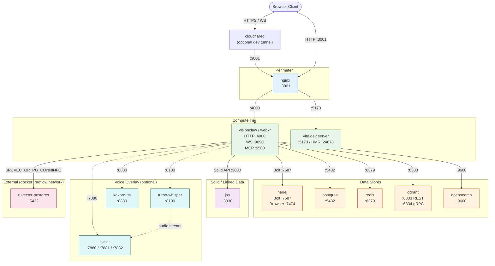
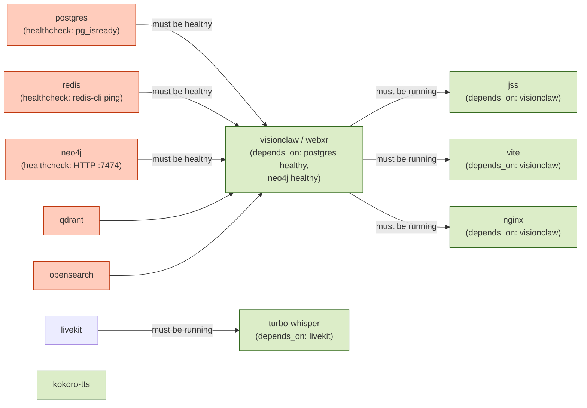
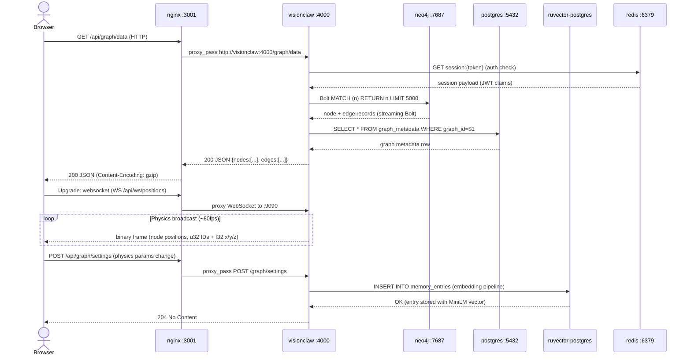

# Deployment Topology

VisionClaw runs as a composed set of Docker containers whose arrangement is not accidental — each boundary exists to enforce a specific isolation contract. This document explains what the topology looks like, why the dependency graph is shaped the way it is, and how data moves between services once a request enters the stack. Understanding this structure is prerequisite knowledge for diagnosing startup failures, planning capacity, and reasoning about what breaks when any individual service is unavailable.

The topology is intentionally layered: a reverse proxy sits at the perimeter, stateless compute services sit in the middle tier, and stateful data stores sit at the base. No browser client ever connects directly to a database. No database ever initiates a connection outward. This separation keeps the blast radius of any compromise small and makes TLS termination, auth enforcement, and rate limiting straightforward to apply at a single chokepoint.

---

## Service Map

The table below lists every service defined across the compose files. The `profile` column shows which Docker Compose profile activates the service — `dev` means it runs only during development, `prod` means production-only, and `all` means it runs under any profile invocation.

| Service | Port(s) | Role | Profile | depends_on |
|---------|---------|------|---------|------------|
| `nginx` | 3001 (HTTP) | Reverse proxy — routes `/api/*` to Actix-web, `/` to Vite; terminates TLS in prod | dev | visionclaw, webxr |
| `visionclaw` / `webxr` | 4000 (HTTP), 9090 (WS), 9500 (MCP TCP) | Rust Actix-web backend — graph API, physics orchestration, WebSocket binary stream, MCP server | dev, prod | neo4j (healthy), postgres (healthy) |
| `vite` | 5173 (HTTP), 24678 (WS HMR) | Vite dev server — Three.js/React frontend with Hot Module Replacement | dev | visionclaw |
| `neo4j` | 7474 (HTTP browser UI), 7687 (Bolt) | Graph database — stores knowledge graph nodes, edges, ontology, agent nodes | all | — |
| `jss` | 3030 (HTTP), 9090 (Solid WS) | JavaScript Solid Server — Linked Data Platform for per-user RDF pods | all | visionclaw |
| `solid-pod` | 9090 (HTTP) | Solid pod storage endpoint (separate from JSS in some deployments) | prod | jss |
| `postgres` | 5432 (TCP) | PostgreSQL 16 — relational store for application state, session data, RBAC | all | — |
| `redis` | 6379 (TCP) | Redis 7 — session cache, rate-limit counters, pub/sub for physics convergence events | all | — |
| `qdrant` | 6333 (HTTP REST), 6334 (gRPC) | QDrant vector database — embedding-based similarity search for knowledge retrieval | all | — |
| `opensearch` | 9600 (HTTP) | OpenSearch — full-text search across markdown knowledge base | all | — |
| `livekit` | 7880 (HTTP/WS signaling), 7881 (TCP RTC), 7882 (UDP media) | WebRTC room server for voice overlay | dev, prod (voice overlay) | — |
| `turbo-whisper` | 8100 (HTTP/WS) | Speech-to-text — Whisper inference endpoint for voice transcription | dev, prod (voice overlay) | livekit |
| `kokoro-tts` | 8880 (HTTP) | Text-to-speech — Kokoro inference endpoint for voice synthesis | dev, prod (voice overlay) | — |
| `cloudflared` | — (outbound only) | Cloudflare Tunnel — exposes local dev stack to a public HTTPS URL without port forwarding | dev (optional) | nginx |
| `ruvector-postgres` | 5432 (TCP, external network `docker_ragflow`) | External RuVector PostgreSQL instance — MiniLM-L6-v2 384-dim vector store for agent memory | all (external) | — |

> Note: `ruvector-postgres` is an **external** service on the `docker_ragflow` network. It is not started by VisionClaw's compose files — it must be running before the stack starts. The Rust backend and MCP agents connect to it via `$RUVECTOR_PG_CONNINFO`.

---

## Network Architecture

The following diagram shows all services as nodes. Solid arrows represent active connections initiated by the tail service. Port labels show the listening port on the target. Dashed arrows indicate optional or profile-conditional connections.



In development, Nginx proxies both the Vite dev server (for the frontend) and the Actix-web API, presenting a unified origin at `:3001`. This avoids CORS issues during development without requiring any special client configuration. In production, Vite is replaced by pre-built static assets served directly by Nginx, so the Vite container is not present.

---

## Service Dependency Chain

Container startup order matters because the Rust backend performs database schema migrations and Neo4j constraint creation at startup. Starting the backend before its dependencies results in crash-restart loops. The diagram below shows which services block which.



The critical path at startup is:

1. `postgres`, `redis`, `neo4j`, `qdrant`, `opensearch` — all start in parallel, no inter-dependencies.
2. `visionclaw` starts only after `postgres` and `neo4j` pass their health checks (condition: `service_healthy`). On a cold machine this typically takes 30–45 seconds for Neo4j to complete JVM initialisation.
3. `nginx`, `vite`, and `jss` start once `visionclaw` is running.
4. `livekit` starts independently; `turbo-whisper` waits for it.

If Neo4j fails its health check after the configured `retries` (default: 10, with 10-second intervals), the `visionclaw` container will exit and Docker will not restart it until Neo4j recovers. This is intentional — a backend running without a graph database would serve corrupt or empty graph data.

---

## Data Flow Between Services

The sequence diagram below traces a complete browser request for the main knowledge graph through the stack and back.



Key observations from this flow:

- **Auth is checked against Redis**, not the database, on every request. This keeps the hot path sub-millisecond even under high request volume.
- **Graph data comes from Neo4j via Bolt**, not REST. The Bolt protocol is binary and supports streaming, so large graphs (50k+ nodes) do not require the backend to buffer the full result set before responding.
- **Physics position data flows over a dedicated WebSocket connection**, not HTTP polling. The binary frame format encodes each node as a `u32` ID followed by three `f32` values (x, y, z), keeping frames small even for graphs with thousands of nodes.
- **Agent memory writes go to RuVector**, the external PostgreSQL instance. These writes run through the MiniLM-L6-v2 embedding pipeline so the stored entries are visible to HNSW semantic search. Plain SQL inserts that bypass this pipeline produce entries invisible to vector search.

---

## Profile System

Docker Compose profiles allow a single compose file to describe multiple deployment configurations. VisionClaw uses three profiles.

### `dev` Profile

Activated with `--profile dev`. Starts:

- `nginx` (reverse proxy on :3001)
- `visionclaw` / `webxr` (Rust backend compiled on startup from source — allow ~5 minutes on first run)
- `vite` (dev server with HMR on :5173 and :24678)
- `neo4j`
- `postgres`
- `redis`
- `qdrant`
- `opensearch`
- `jss` (optional Solid sidecar)
- `cloudflared` (optional, if `CLOUDFLARE_TUNNEL_TOKEN` is set)

The dev profile mounts the source tree as bind volumes so that Rust recompilation and Vite HMR reflect code changes without image rebuilds. The tradeoff is that the first cold start is slow because Cargo must compile the full Rust workspace inside the container.

```bash
docker compose -f docker-compose.unified.yml --profile dev up -d
```

### `prod` Profile

Activated with `--profile prod`. Starts:

- `nginx` (serving pre-built static assets + proxying API)
- `visionclaw` (pre-compiled binary baked into the image — starts in seconds)
- `neo4j`, `postgres`, `redis`, `qdrant`, `opensearch`
- `jss`

No Vite container runs in production. Static assets are built during the image build step (`npm run build`) and copied into the Nginx image layer. The Rust binary is also compiled at image build time, not at container startup.

```bash
docker compose -f docker-compose.unified.yml --profile prod up -d
```

### Voice Overlay (compose file overlay)

The voice pipeline is not a profile but a separate compose file overlay. It adds `livekit`, `turbo-whisper`, and `kokoro-tts` to whichever profile is active.

```bash
# Development with voice
docker compose \
  -f docker-compose.unified.yml \
  -f docker-compose.voice.yml \
  --profile dev up -d

# Production with voice
docker compose \
  -f docker-compose.unified.yml \
  -f docker-compose.voice.yml \
  --profile prod up -d
```

The voice overlay requires additional environment variables: `LIVEKIT_API_KEY`, `LIVEKIT_API_SECRET`, and `LIVEKIT_URL`. See [Environment Variables Reference](../reference/configuration/environment-variables.md) for the full list.

### XR Profile (`docker-compose.vircadia.yml`)

A separate compose file for Vircadia XR integration. This adds a Vircadia domain server and the VisionClaw XR bridge service. It is experimental and not recommended for production deployments without specific XR hardware requirements.

---

## Volume Mounts

Persistent data is managed through named Docker volumes. Bind mounts (host path → container path) are used only in the `dev` profile for source code and configuration files.

### Named Volumes

| Volume | Container path | Purpose | Profile |
|--------|---------------|---------|---------|
| `neo4j-data` | `/data` in `neo4j` | Graph database store — nodes, relationships, properties | all |
| `neo4j-logs` | `/logs` in `neo4j` | Neo4j query and server logs | all |
| `neo4j-conf` | `/conf` in `neo4j` | Custom Neo4j configuration overrides (`neo4j.conf`) | all |
| `neo4j-plugins` | `/plugins` in `neo4j` | APOC plugin JAR and other Neo4j extensions | all |
| `postgres_data` | `/var/lib/postgresql/data` in `postgres` | PostgreSQL data directory — all relational tables | all |
| `redis_data` | `/data` in `redis` | Redis persistence (AOF or RDB snapshots) | all |
| `visionclaw_data` | `/app/data` in `visionclaw` | Application data — downloaded markdown, metadata, processed knowledge files | all |
| `visionclaw_logs` | `/app/logs` in `visionclaw` | Rust tracing output, Nginx access logs | all |
| `npm-cache` | `/root/.npm` in `visionclaw` | npm package cache (speeds up reinstalls) | dev |
| `cargo-cache` | `/usr/local/cargo/registry` in `visionclaw` | Cargo registry cache (avoids re-downloading crates) | dev |
| `cargo-target-cache` | `/app/target` in `visionclaw` | Rust build artifact cache (incremental compilation) | dev |
| `jss_pods` | `/data/pods` in `jss` | JavaScript Solid Server pod storage — per-user RDF/Turtle files | all |
| `qdrant_storage` | `/qdrant/storage` in `qdrant` | QDrant collections and vector index data | all |
| `opensearch_data` | `/usr/share/opensearch/data` in `opensearch` | OpenSearch index shards | all |

### Dev Bind Mounts

In the `dev` profile, the following host directories are mounted read-write into containers:

| Host path | Container path | Service | Purpose |
|-----------|---------------|---------|---------|
| `./client/src` | `/app/client/src` | `visionclaw` | TypeScript/React source for Vite HMR |
| `./src` | `/app/src` | `visionclaw` | Rust source for cargo-watch recompilation |
| `./config` | `/app/config` (read-only) | `visionclaw` | Runtime configuration files |
| `./data` | `/app/data` | `visionclaw` | Development data directory |

> Cargo build caches (`cargo-cache`, `cargo-target-cache`) are named volumes rather than bind mounts. This prevents the Linux container filesystem from interfering with macOS host filesystem case-sensitivity issues and keeps build artefacts inside the Docker volume subsystem where I/O performance is consistent.

---

## Scaling Considerations

Not all services can be scaled horizontally. The table below classifies each service and explains the constraint.

### Stateless Services (Horizontal Scale Permitted)

| Service | Scale strategy | Notes |
|---------|---------------|-------|
| `nginx` | Multiple replicas behind a load balancer | Session affinity not required — all state is in downstream stores |
| `visionclaw` HTTP handlers | Multiple replicas with a load balancer | Stateless per-request handlers; connection pool per replica |
| `turbo-whisper` | Multiple replicas, round-robin or GPU-affinity routing | GPU-bound; one replica per physical GPU is the practical limit |
| `kokoro-tts` | Multiple replicas | CPU or GPU-bound depending on model size |

When running multiple `visionclaw` replicas, the WebSocket physics broadcast path requires sticky sessions or a pub/sub fan-out layer (Redis pub/sub is already present). Each replica runs its own physics simulation actor; without coordination, different clients connected to different replicas will see different node positions. The recommended approach for multi-replica deployments is a single physics-authoritative instance behind a sticky load balancer for WebSocket connections, with HTTP API handlers freely distributed.

### Stateful Services (Singletons in Standard Deployment)

| Service | Constraint | Path to scale |
|---------|------------|--------------|
| `neo4j` | Single-writer graph database; read replicas available in Neo4j Enterprise | Neo4j Causal Cluster (Enterprise licence required) for multi-writer HA |
| `postgres` | Single primary; read replicas possible with streaming replication | Patroni or Citus for HA; PgBouncer for connection pooling at scale |
| `redis` | Single instance in default config | Redis Cluster or Redis Sentinel for HA; Valkey is a drop-in alternative |
| `qdrant` | Single node in default config | QDrant distributed mode with a collection replication factor ≥ 2 |
| `opensearch` | Single node in default config | OpenSearch cluster with dedicated data and coordinating nodes |
| `jss` | Pod storage is on a named volume tied to the single instance | Solid pod replication requires a shared storage backend (NFS, S3-compatible) |
| `livekit` | Stateful room server; participants connect to a specific room | LiveKit Cloud or LiveKit distributed mode with Redis-backed room registry |
| `ruvector-postgres` | External singleton; owns the embedding pipeline | Patroni HA + read replicas for the vector store; write path must remain single-primary |

The GPU physics engine (`visionclaw` with CUDA) is a special case. The `ForceComputeActor` self-initialises GPU context at startup and broadcasts positions to all connected clients. This actor is inherently stateful and single-instance per deployment. Horizontal scaling of the physics engine would require partitioning the graph across GPU workers and a synchronisation protocol for cross-partition edge forces — this is not implemented in the current architecture.

---

## Cross-References

For step-by-step deployment instructions, environment variable values, and troubleshooting commands, see:

- [Deployment Guide](../how-to/deployment-guide.md) — prerequisites, quick start, profile activation commands, Neo4j configuration, production hardening checklist
- [Docker Compose Options Reference](../reference/configuration/docker-compose-options.md) — full YAML snippets for every service configuration option, GPU setup, resource limits, logging drivers
- [Environment Variables Reference](../reference/configuration/environment-variables.md) — complete variable table with types, defaults, and examples for all services
- [System Overview](./system-overview.md) — higher-level architectural context, technology choices, and bounded context diagram
- [Security Model](./security-model.md) — how authentication, authorisation, and network isolation are enforced across the topology
- [RuVector Integration](./ruvector-integration.md) — detailed explanation of the external vector memory service, embedding pipeline, and HNSW search behaviour
