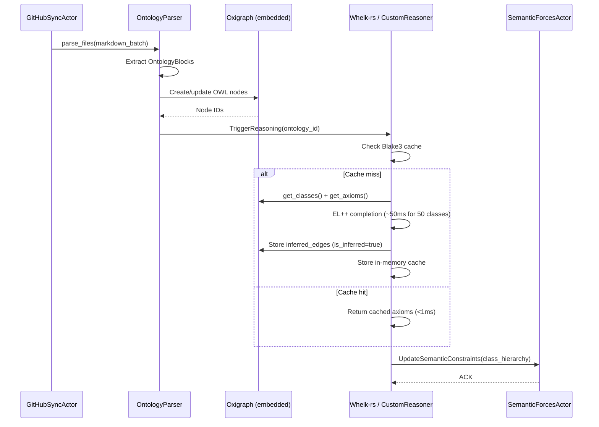

# VisionClaw Ontology Pipeline

End-to-end guide to VisionClaw's OWL 2 ontology processing pipeline — from GitHub Markdown ingestion through embedded Oxigraph storage to Whelk-rs EL++ reasoning and GPU constraint application.

> **Graph store changed (ADR-11)**: storage is now an **embedded Oxigraph** RDF triple store
> (in-process, RocksDB-backed, W3C SPARQL 1.1) — there is no Neo4j container, Bolt URI, or
> `NEO4J_*` configuration. Where this document says "Neo4j", read "the embedded Oxigraph
> graph store". The Cypher snippets are historical (Neo4j-era) and are retained only to show
> the shape of each query; the live system resolves the equivalent patterns via SPARQL
> (endpoints that still accept a `cypher` field do so for backwards compatibility only).

---

## 1. Pipeline Overview

The ontology pipeline is a 5-stage process that converts Logseq-formatted Markdown files from a GitHub repository into GPU-enforced semantic physics constraints rendered in the 3D graph.


**End-to-end timing** (production, warm cache):
- GitHub sync → Oxigraph save: ~10 ms per file
- Reasoning (cache hit): < 1 ms
- Reasoning (cache miss, 50 classes): ~50 ms
- Constraint generation: ~1 ms per 100 axioms
- GPU upload: ~10–50 ms for 1,000 constraints
- **Total pipeline**: ~65–600 ms depending on ontology size and cache state

---

## 2. Stage 1: GitHub Markdown Ingestion

### Entry point

`GitHubSyncService::sync_graphs()` in `src/services/github-sync-service.rs` is the synchronization entry point. It fetches Markdown files from the configured GitHub repository (default path: `mainKnowledgeGraph/pages/`) in batches of 50 files.

### Incremental filtering

Sync uses SHA1 hashing to skip unchanged files. Set `FORCE_FULL_SYNC=1` to bypass SHA1 filtering and reprocess all files. Reset to `0` after a forced sync.

### File type detection

`detect_file_type()` classifies each file. Files tagged `public:: true` become `KnowledgeGraph` page nodes. Files lacking this tag are still scanned for `### OntologyBlock` sections (see below).

### OntologyBlock extraction

**Only `public:: true` files** produce KG page nodes and `[[wikilink]]` → `linked_page` conversions.

**All files regardless of `public:: true` status** are scanned for `### OntologyBlock` sections. These sections contain OWL class definitions, axioms, and properties in a structured Logseq property format.

```
### OntologyBlock
- term-id:: CL:0000540
- preferred-term:: Neuron
- owl:class:: Cell
- is-subclass-of:: [[Cell]]
- owl-axioms:: DisjointClasses(Neuron, Astrocyte)
```

After detecting an OntologyBlock, `save_ontology_data()` triggers the full downstream pipeline.

### Data flow in this stage

```
sync_graphs()
  └── process_single_file(page.md)
        ├── detect_file_type() → KnowledgeGraph | Ontology
        ├── KnowledgeGraphParser::parse() → page/linked_page nodes
        └── OntologyParser::parse() → OntologyData
              └── save_ontology_data()
                    ├── UnifiedOntologyRepository::save_ontology()
                    └── OntologyPipelineService::on_ontology_modified() [async task]
```

---

## 3. Stage 2: OWL Parsing

### Enhanced parser architecture

The enhanced OntologyParser (`src/services/parsers/ontology_parser.rs`, version 2.0.0) extracts the complete metadata set from OntologyBlock sections. It compiles regex patterns once at startup using `Lazy<Regex>` for zero-overhead parsing.

Key regex patterns:
- Property extraction: `^\s*-\s*([a-zA-Z0-9_:-]+)::\s*(.+)$`
- Wiki links: `\[\[([^\]]+)\]\]` — converted to `linked_page` nodes
- OWL axioms in code blocks: ` ```clojure ... ``` `
- Cross-domain bridges: `^\s*-\s*(bridges-(?:to|from))::\s*\[\[([^\]]+)\]\]\s*via\s+(\w+)`

### Three-tier property validation

Properties are divided into three tiers:

| Tier | Requirement | Examples |
|------|-------------|---------|
| 1 | Required | `term-id`, `preferred-term`, `owl:class`, `is-subclass-of` |
| 2 | Recommended | `alt-terms`, `quality-score`, `source`, `has-part`, `depends-on` |
| 3 | Optional | `bridges-to`, `bridges-from`, `owl-axioms`, domain extensions |

### OWL 2 EL profile support

The parser recognises the OWL 2 EL subset: SubClassOf, EquivalentClasses, DisjointClasses, ObjectSomeValuesFrom, ObjectIntersectionOf, transitive and reflexive properties. Universal quantification, negation, cardinality restrictions, and disjunction are outside EL++ scope and will produce "missing inferred axioms" warnings if used.

### Node types created

| Node Type | Source |
|-----------|--------|
| `page` | File with `public:: true` |
| `linked_page` | `[[wikilink]]` targets |
| `owl_class` | OntologyBlock with `owl:class` |
| `owl_property` | OntologyBlock with `owl:role` |
| `owl_individual` | OntologyBlock individual declarations |

---

## 4. Stage 3: Graph-Store Persistence (embedded Oxigraph)

### Embedded Oxigraph as the sole graph store

The graph store is an **embedded Oxigraph** RDF triple store (in-process, RocksDB-backed,
W3C SPARQL 1.1), the **primary and sole** store as of ADR-11 (Neo4j removed). Nodes and
relationships are persisted as RDF triples in named graphs; the `OxigraphGraphRepository` and
`OxigraphOntologyRepository` adapters serialise the logical `KGNode`/`EDGE` model below into
subject–predicate–object triples.

> The Cypher node/edge/index snippets in this section are **historical (Neo4j-era)**. They
> describe the same logical schema that Oxigraph now stores as RDF — Oxigraph maintains
> SPO/POS/OSP indexes automatically, so the `CREATE CONSTRAINT`/`CREATE INDEX` statements no
> longer apply.

### Node schema (logical model)

```cypher
(:KGNode {
  id: Integer,              // Sequential u32 from NEXT_NODE_ID atomic counter
  metadata_id: String,      // File path or IRI
  label: String,
  owl_class_iri: String,    // OWL ontology class (populated for owl_* nodes)
  node_type: String,        // "page", "linked_page", "owl_class", etc.
  x, y, z: Float,          // Physics positions
  vx, vy, vz: Float        // Velocities
})
```

```cypher
[:EDGE {
  weight: Float,
  relation_type: String,   // "SUBCLASS_OF", "LINKS_TO", "HAS_PROPERTY", etc.
  owl_property_iri: String
}]
```

### Indexes and constraints

```cypher
CREATE CONSTRAINT kg_node_id IF NOT EXISTS FOR (n:KGNode) REQUIRE n.id IS UNIQUE
CREATE INDEX kg_node_metadata_id IF NOT EXISTS FOR (n:KGNode) ON (n.metadata_id)
CREATE INDEX kg_node_owl_class IF NOT EXISTS FOR (n:KGNode) ON (n.owl_class_iri)
```

### Edge types created by the ontology pipeline

| Relationship | Meaning |
|--------------|---------|
| `SUBCLASS_OF` | OWL SubClassOf axiom |
| `LINKS_TO` | `[[wikilink]]` or `relates-to` |
| `HAS_PROPERTY` | `owl:role` declaration |
| `EQUIVALENT_TO` | EquivalentClasses axiom |
| `DISJOINT_WITH` | DisjointClasses axiom |
| `HAS_PART` | `has-part` property |
| Namespace edges | Generated from `--` prefix convention |

### The 623 SUBCLASS_OF relationships

There are 623 `SUBCLASS_OF` relationships originating from `OwlClass` nodes in the graph store. These require **label matching** to link `OwlClass` nodes to the corresponding `KGNode` entries. Without this mapping, the client graph receives isolated OwlClass nodes — see the **Ontology Edge Gap** section below.

### Namespace edge generation

Nodes whose `metadata_id` contains a `--` prefix (e.g., `ai--machine-learning`) automatically generate namespace grouping edges during `GraphStateActor` startup, placing them into the correct sub-graph cluster.

---

## 5. Stage 4: Whelk-rs Reasoning (EL++)

### What is Whelk-rs?

Whelk-rs is a high-performance OWL 2 EL reasoner written in Rust. It offers 10–100× speedup over traditional Java-based reasoners (Pellet, HermiT). Integration uses `horned-owl` (a Rust OWL parser) as the parsing layer.

```toml
horned-owl = { version = "1.2.0", features = ["remote"], optional = true }
whelk = { path = "./whelk-rs", optional = true }
```

### EL++ reasoning capabilities

| Construct | Inference |
|-----------|-----------|
| SubClassOf transitivity | A ⊑ B, B ⊑ C ⇒ A ⊑ C |
| DisjointClasses propagation | A ⊥ B, C ⊑ A ⇒ C ⊥ B |
| EquivalentClasses | Symmetric and transitive |
| Transitive properties | part-of-part propagates |
| FunctionalProperty constraints | Cardinality enforcement |

### Reasoning algorithms in CustomReasoner

The `CustomReasoner` (`src/reasoning/custom-reasoner.rs`, 466 lines) implements three algorithms:

1. **infer_transitive_subclass()** — computes transitive closure of SubClassOf, using `transitive_cache: HashMap<String, HashSet<String>>`. Worst-case O(n³), average O(n²).
2. **infer_disjoint()** — propagates disjointness to subclasses. Example: `Neuron ⊥ Astrocyte` → `PyramidalNeuron ⊥ Astrocyte`.
3. **infer_equivalent()** — symmetric and transitive equivalence closure.

All inferred axioms receive `confidence: 1.0` (deductive reasoning is certain).

### Inference caching

Results are cached with a Blake3 hash key:

```rust
let cache_key = blake3::hash(
    format!("{}:{}:{}", ontology_id, cache_type, ontology_hash).as_bytes()
).to_hex();
```

The in-memory `RwLock<HashMap<String, InferenceCacheEntry>>` provides sub-millisecond cache hits. A persistent SQLite `inference_cache` table exists for cross-session persistence (optional, database-backed caching).

Cache invalidation triggers when the ontology content hash changes or on explicit `InvalidateCache` message.

### Sequence diagram



### Performance benchmarks

| Operation | 10 classes | 50 classes | 100+ classes |
|-----------|-----------|-----------|--------------|
| Cold reasoning | ~15 ms | ~50 ms | ~150 ms |
| Cached retrieval | < 1 ms | < 1 ms | < 1 ms |
| Cache hit rate | > 90% in production |

| Operation | 1,000 classes | 5,000 classes | 10,000 classes |
|-----------|---------------|---------------|----------------|
| First inference | ~500 ms | ~2,000 ms | ~5,000 ms |
| Cached retrieval | < 10 ms | < 15 ms | < 20 ms |

---

## 6. Stage 5: GPU Constraint Application

### Axiom-to-constraint translation

`OntologyPipelineService::generate_constraints_from_axioms()` converts inferred axioms to typed physics constraints:

| Axiom Type | Constraint Kind | Default Strength | Effect |
|------------|----------------|-----------------|--------|
| `SubClassOf(A, B)` | Clustering / HierarchicalAttraction | 1.0× | Child nodes cluster near parent |
| `EquivalentClass(A, B)` | Alignment / Colocation | 1.5× | Nodes align strongly |
| `DisjointWith(A, B)` | Separation | 2.0× | Nodes repel (strong force) |

The `constraint_strength` multiplier in `SemanticPhysicsConfig` scales all constraint forces:

```rust
pub struct SemanticPhysicsConfig {
    pub auto_trigger_reasoning: bool,      // default: true
    pub auto_generate_constraints: bool,    // default: true
    pub constraint_strength: f32,           // default: 1.0 (range 0–10)
    pub use_gpu_constraints: bool,          // default: true
    pub max_reasoning_depth: usize,         // default: 10
    pub cache_inferences: bool,             // default: true
}
```

### Priority blending

When multiple constraints affect the same nodes, priorities resolve conflicts using exponential decay:

```
weight(priority) = 10^(-(priority-1)/9)

Priority 1: User-defined  → weight = 1.000 (100%)
Priority 5: Asserted axioms → weight = 0.359 (36%)
Priority 7: Inferred axioms → weight = 0.215 (22%)
Priority 10: Lowest        → weight = 0.100 (10%)
```

Inferred constraints receive priority 7; asserted constraints priority 5; user-defined priority 1.

### GPU upload path

1. `OntologyPipelineService::upload_constraints_to_gpu()` sends `ApplyOntologyConstraints` to `OntologyConstraintActor`
2. `OntologyConstraintActor` converts `Constraint` structs to `ConstraintData` (GPU format, 64-byte aligned) via `OntologyConstraintTranslator`
3. `upload_constraints_to_gpu()` calls `unified_compute.upload_constraints(&self.constraint_buffer)`
4. `ForceComputeActor` receives `UpdateOntologyConstraintBuffer` and caches the buffer
5. Each physics frame: `apply_ontology_forces()` re-uploads cached buffer before main force pass

### CUDA kernel invocations

Constraint kind `SEMANTIC = 10` in `ontology_constraints.cu`:
- `apply_disjoint_classes_kernel` — block size 256, target ~0.8 ms / 10K nodes
- `apply_subclass_hierarchy_kernel` — block size 256, target ~0.6 ms / 10K nodes
- `apply_sameas_colocate_kernel` — block size 256, target ~0.3 ms / 10K nodes
- **Total ontology constraint overhead**: ~2 ms / frame for 10K nodes

GPU data structures (64-byte aligned):

```cuda
struct OntologyNode {
    uint32_t graph_id;         // 4 bytes
    uint32_t node_id;          // 4 bytes
    uint32_t ontology_type;    // 4 bytes
    uint32_t constraint_flags; // 4 bytes
    float3 position;           // 12 bytes
    float3 velocity;           // 12 bytes
    float mass;                // 4 bytes
    float radius;              // 4 bytes
    uint32_t parent_class;     // 4 bytes
    uint32_t property_count;   // 4 bytes
    uint32_t padding[6];       // 24 bytes — TOTAL: 64 bytes
};

struct OntologyConstraint {
    uint32_t type;             // DisjointClasses=1, SubClassOf=2
    uint32_t source_id;        // 4 bytes
    uint32_t target_id;        // 4 bytes
    uint32_t graph_id;         // 4 bytes
    float strength;            // 4 bytes
    float distance;            // 4 bytes
    float padding[10];         // 40 bytes — TOTAL: 64 bytes
};
```

Memory footprint: 10K nodes = 640 KB, 1K constraints = 64 KB.

---

## 7. Ontology Query Interface

### Graph traversal patterns (historical Cypher → Oxigraph SPARQL)

> The Cypher patterns below are **historical (Neo4j-era)**. They show the shape of the
> traversals the system performs; the live store is embedded Oxigraph and resolves the
> equivalent property paths via SPARQL.

```cypher
-- Find all subclasses of a given class (including inferred)
MATCH (n:KGNode {owl_class_iri: $iri})<-[:SUBCLASS_OF*]-(child)
RETURN child.label, child.id

-- Find nodes by OWL class
MATCH (n:KGNode {owl_class_iri: $iri})
RETURN n.id, n.label, n.metadata

-- Multi-hop ontology path
MATCH (n:KGNode {id: $start})-[:SUBCLASS_OF|:LINKS_TO*1..5]-(m:KGNode)
RETURN DISTINCT m.id, m.label
```

### REST API (ontology query service)

> **Removed (ADR-11)**: the dedicated `POST /api/query/cypher` endpoint and its `CypherQueryHandler`
> were **deleted** in the Oxigraph migration (see `src/main.rs`: "Cypher query endpoint removed").
> Graph queries now go through the ontology / natural-language query services
> (e.g. `/api/nl-query/*`), which accept a `cypher` field for backwards compatibility but resolve
> it against the embedded Oxigraph store via SPARQL, with safety limits (timeout, result cap,
> read-only enforcement).

**POST** `/api/ontology-physics/enable` — Enable ontology force constraints:
```json
{
  "ontologyId": "university-ontology",
  "mergeMode": "replace",
  "strength": 0.8
}
```

**GET** `/api/ontology-physics/constraints` — List active constraints with GPU stats.

**PUT** `/api/ontology-physics/weights` — Adjust constraint strength at runtime.

### MCP Ontology Tools (7 tools)

The system exposes 7 MCP tools for ontology operations:
1. `infer_axioms` — trigger EL++ reasoning for an ontology ID
2. `get_class_hierarchy` — retrieve complete class tree
3. `get_disjoint_classes` — list disjoint class pairs
4. `invalidate_cache` — force cache invalidation
5. `get_cache_stats` — reasoning cache statistics
6. `query_cypher` — execute a Cypher-style query (resolved against the embedded Oxigraph store; `cypher` field kept for backwards compatibility)
7. `get_constraints` — list active GPU constraints

### OntologyReasoningService API

```rust
// Core service methods
pub async fn infer_axioms(&self, ontology_id: &str) -> Result<Vec<InferredAxiom>>
pub async fn get_class_hierarchy(&self, ontology_id: &str) -> Result<ClassHierarchy>
pub async fn get_disjoint_classes(&self, ontology_id: &str) -> Result<Vec<DisjointClassPair>>

// Data structures
pub struct InferredAxiom {
    pub axiom_type: String,       // "SubClassOf", "DisjointWith", etc.
    pub subject_iri: String,
    pub object_iri: Option<String>,
    pub confidence: f32,          // 1.0 for deductive, 0.7-0.9 for inferred
    pub inference_path: Vec<String>,
    pub user_defined: bool,
}

pub struct ClassHierarchy {
    pub root_classes: Vec<String>,
    pub hierarchy: HashMap<String, ClassNode>,
}

pub struct ClassNode {
    pub iri: String,
    pub label: String,
    pub parent_iri: Option<String>,
    pub children_iris: Vec<String>,
    pub node_count: usize,  // Descendant count
    pub depth: usize,
}
```

---

## 8. The Ontology Edge Gap Problem

This is a known architectural debt item affecting the current production system.

### Symptom

62% of `OwlClass` nodes in the client graph are isolated — they have no edges connecting them to other nodes, even though 623 `SUBCLASS_OF` relationships exist in the graph store.

### Root cause

`OwlClass` nodes in the graph store have a different label format than `KGNode` entries. The 623 `SUBCLASS_OF` relationships originate from `OwlClass` source nodes, but the client-side `KGNode` entries use a different ID scheme. The mapping between `OwlClass` nodes and `KGNode` entries requires label-based matching that is not currently implemented.

### Impact

- 62% of ontology nodes are visually isolated in the 3D graph
- Ontology hierarchy is not visually represented
- SemanticForcesActor receives incomplete constraint data

### Proposed fix

Map `OwlClass` → `KGNode` via `owl_class_iri` field matching:

```cypher
MATCH (oc:OwlClass)-[:SUBCLASS_OF]->(parent:OwlClass)
MATCH (gn_child:KGNode {owl_class_iri: oc.iri})
MATCH (gn_parent:KGNode {owl_class_iri: parent.iri})
CREATE (gn_child)-[:SUBCLASS_OF]->(gn_parent)
```

This is tracked as a P1 architectural debt item.

---

## 9. Environment Variables and Configuration

```bash
# Reasoning configuration
REASONING_CACHE_TTL=3600          # Cache lifetime (seconds)
REASONING_TIMEOUT=30000           # Max reasoning time (ms)
REASONING_MAX_AXIOMS=100000       # Axiom limit

# Sync configuration
FORCE_FULL_SYNC=0                 # Set to 1 to bypass SHA1 filtering
GITHUB_BASE_PATH=mainKnowledgeGraph/pages/

# Graph store (embedded Oxigraph — ADR-11)
# No connection URI / user / password: Oxigraph runs in-process.
# The RocksDB dataset lives under ${DATA_DIR}/oxigraph/ (DATA_DIR defaults to ./data;
# Docker images set it to /app/data). The former NEO4J_URI / NEO4J_USER /
# NEO4J_PASSWORD / NEO4J_ENABLED variables are removed and no longer read.
DATA_DIR=/app/data
```

```toml
[features]
ontology_validation = true
reasoning_cache = true
ontology = ["horned-owl", "whelk", "walkdir", "clap"]
```

---

## 10. Troubleshooting

| Symptom | Cause | Fix |
|---------|-------|-----|
| "Reasoning timeout" | Large ontology / complex axioms | Increase `REASONING_TIMEOUT` or reduce ontology size |
| "Cache invalidation loop" | Ontology hash changes on every read | Ensure consistent serialisation; normalise whitespace |
| "Missing inferred axioms" | Axiom uses OWL 2 construct outside EL++ | Verify no universal quantification, negation, or cardinality restrictions |
| Constraints not applied | `auto_generate_constraints` disabled | Check pipeline config |
| GPU upload failures | Constraint actor not initialized / OOM | Check CUDA logs; CPU fallback activates automatically |
| OntologyBlock not detected | Missing `### OntologyBlock` header | Verify exact header format in Markdown |

**Debug log patterns to watch:**
```
🔄 Triggering ontology reasoning pipeline after ontology save
✅ Reasoning complete: 67 inferred axioms
🔧 Generating constraints from 67 axioms
📤 Uploading 67 constraints to GPU
✅ Constraints uploaded to GPU successfully
🎉 Ontology pipeline complete: 67 axioms inferred, 67 constraints generated, GPU upload: true
```

---

## Related Documentation

- [Physics & GPU Engine](physics-gpu-engine.md) — how constraints affect node positioning
- `docs/explanation/ontology-pipeline.md` — actor wire-up analysis
- `docs/reference/neo4j-schema-unified.md` — full graph storage schema (Oxigraph/RDF, ADR-11)
- `docs/explanation/ontology-pipeline.md` — detailed sequence diagrams including error and backpressure paths
