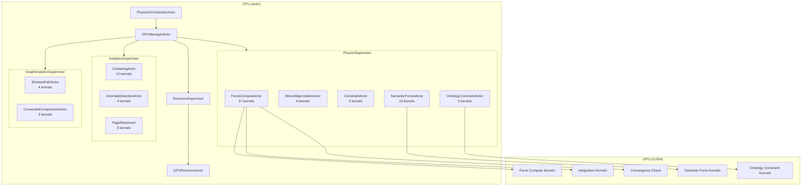
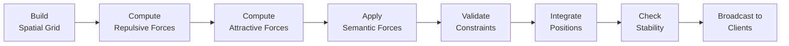
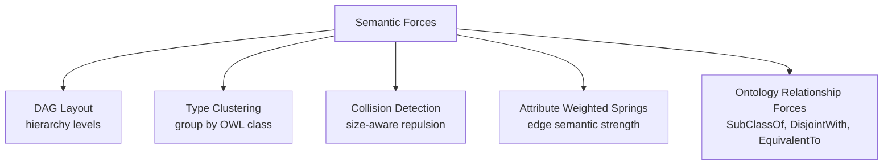
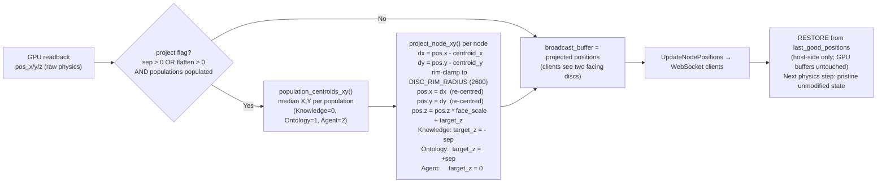

# VisionClaw Physics & GPU Engine

> **Updated 2026-06-03.** This document has been reconciled against the verified
> system diagrams in `docs/architecture/diagrams/` produced by the 2026-06-03
> cartography sprint. Where earlier prose conflicted with the diagrams, the
> diagrams win; this document now agrees. Key changes: §5 binary wire format
> corrected from 34 B to 52 B (V3); §8 settings pipeline updated to single
> debounced path (T2 resolved); §10 dual-graph disc projection section added;
> §11 canonical physics defaults section added.

Technical deep-dive into VisionClaw's CUDA-accelerated force-directed physics engine, dual-graph disc projection, semantic forces, and GPU supervision architecture.

---

## 1. Overview

VisionClaw's physics engine computes force-directed graph layouts on the GPU, producing spatial positions for every node in the knowledge graph in real time.

**Key characteristics:**

- **55× GPU speedup** over CPU serial implementation (Rayon + SIMD CPU fallback achieves within 2–4× of GPU)
- **Server-authoritative simulation**: the server is the single source of truth for node positions; clients receive binary position updates and render them
- **87 production CUDA kernels** across 13 files — 37 dedicated to physics, 15 to semantic forces, 5 to ontology constraints
- **Structure-of-Arrays (SoA)** memory layout for 8–10× better memory bandwidth than Array-of-Structures
- **Semantic forces from OWL ontology**: class hierarchy drives node clustering in 3D space
- **Convergence detection + delta compression**: periodic full broadcast (every 300 iterations) prevents late-connecting clients from receiving stale positions

The simulation loop runs at up to 60 Hz when the graph is actively settling, dropping to 5 Hz once kinetic energy falls below a stability threshold.

---

## 2. GPU Architecture

### Actor hierarchy



**PhysicsSupervisor fault strategy**: AllForOne restart (physics state is interdependent — a failed ForceComputeActor invalidates all cached constraint buffers).

**AnalyticsSupervisor / GraphAnalyticsSupervisor**: OneForOne restart (independent algorithms, failures are isolated).

### GPU memory architecture

Three CUDA streams enable concurrent execution:
- **Stream 0**: Physics simulation (critical path)
- **Stream 1**: Graph algorithms (independent, runs between physics steps)
- **Stream 2**: Analytics/clustering (on-demand)

Memory hierarchy used by physics kernels:

```
Registers    — 64K per SM, ~1 cycle latency
Shared Mem   — 48–96 KB per SM, ~5 cycle latency  (used by reduction kernels)
L1 Cache     — 48 KB per SM
L2 Cache     — 40–72 MB total (entire working set for 100K nodes fits here)
Global Mem   — 16–80 GB HBM/GDDR
```

Working set for 100K nodes:
- Positions: 2.4 MB (3 × 100K × 4 bytes)
- Velocities: 2.4 MB
- Forces: 2.4 MB
- Graph CSR structure: 3.2 MB
- **Total: ~10–22 MB** (fits entirely in L2 cache)

---

## 3. Force Model

### Per-frame pipeline



Force computation and semantic force computation run in parallel (both read positions, do not write). Constraint validation and integration are sequential.

### Force types

| Force Type | Algorithm | Complexity |
|------------|-----------|-----------|
| Node-node repulsion | Barnes-Hut with theta=0.5 | O(n log n) |
| Edge spring attraction | Hooke's law per edge | O(m) |
| Center gravity | Per-node pull toward origin | O(n) |
| Damping | Velocity multiplication per step | O(n) |
| Collision detection | 3D spatial grid, 27-cell neighbourhood | O(n log n) |
| Semantic class forces | Per-constraint kernel | O(n × C_avg) |
| Stress majorization | SMACOF variant, every 120 frames | O(n²) |

### Integration method

Verlet integration with adaptive timestep:

```
Position(t+dt) = Position(t) + Velocity(t)*dt + 0.5*Acceleration(t)*dt²
Velocity(t+dt) = Velocity(t) + 0.5*(Acceleration(t) + Acceleration(t+dt))*dt
```

Velocity damping (default 0.9) prevents oscillation:
```
velocity(t+dt) = velocity(t) × damping_factor
```

### SimParams struct

The `SimParams` struct drives all physics computation. It is a single struct — there is no per-node-type differentiation in the force model.

Key fields relevant to ontology integration and known-issue context:

| Field | Type | Description |
|-------|------|-------------|
| `repulsion_strength` | f32 | Node-node repulsion coefficient (default: 1000) |
| `attraction_strength` | f32 | Edge spring strength (default: 0.01) |
| `damping` | f32 | Velocity damping per step (default: 0.9) |
| `timestep` | f32 | Integration step size (default: 0.016) |
| `gravity_strength` | f32 | Center attraction (default: 0.1) |
| `theta` | f32 | Barnes-Hut approximation threshold (default: 0.5) |
| `reheat_factor` | f32 | Energy injection on settings change (range 0–1; updated 0.3→1.0) |
| `damping_override` | f32 | FastSettle override damping (updated 0.95→0.75) |
| `rest_length` | f32 | SSSP-aware spring rest length |
| `ENABLE_SSSP_SPRING_ADJUST` | feature flag | Enables SSSP-based spring rest length adjustment |

**SSSP integration**: SSSP distances computed by `ShortestPathActor` feed back into the GPU force kernel via `d_sssp_dist` buffer, enabling graph-distance-aware spring rest lengths when `ENABLE_SSSP_SPRING_ADJUST` is active.

### Barnes-Hut approximation

The spatial grid builds a 3D hash grid each frame (~0.3 ms for 100K nodes). Each node checks only 27 neighbouring cells instead of all O(n) nodes. For distant clusters, the Barnes-Hut tree treats the cluster as a single mass when `dist / cluster_size > theta`.

```c
// Warp reduction — no __syncthreads needed
__device__ float warpReduceSum(float val) {
    for (int offset = 16; offset > 0; offset /= 2) {
        val += __shfl_down_sync(0xffffffff, val, offset);
    }
    return val;
}
```

---

## 4. Semantic Forces

### Overview

Semantic forces extend the base physics model with five ontology-aware force types, all driven by the OWL class hierarchy loaded from the ontology pipeline.



### SemanticForcesActor

`SemanticForcesActor` (`src/actors/gpu/semantic_forces_actor.rs`) manages the configuration and dispatch of semantic GPU kernels. It caches:

- `hierarchy_levels`: computed on demand via topological sort (O(V+E), cached after first compute)
- `type_centroids`: recomputed each frame
- `node_types: Vec<i32>`: OWL class ID per node
- Edge source/target/weight arrays for attribute springs

### GPU kernel FFI declarations

```c
extern "C" {
    fn set_semantic_config(config: *const SemanticConfigGPU);

    fn apply_dag_force(
        node_hierarchy_levels: *const i32,
        node_types: *const i32,
        positions: *mut Float3,
        forces: *mut Float3,
        num_nodes: i32,
    );

    fn apply_type_cluster_force(
        node_types: *const i32,
        type_centroids: *const Float3,
        positions: *mut Float3,
        forces: *mut Float3,
        num_nodes: i32,
        num_types: i32,
    );

    fn apply_collision_force(
        node_radii: *const f32,
        positions: *mut Float3,
        forces: *mut Float3,
        num_nodes: i32,
    );

    fn apply_attribute_spring_force(
        edge_sources: *const i32,
        edge_targets: *const i32,
        edge_weights: *const f32,
        edge_types: *const i32,
        positions: *mut Float3,
        forces: *mut Float3,
        num_edges: i32,
    );
}
```

### OWL-to-physics translation table

| OWL Axiom | Physics Constraint | Min Distance | Strength | Force Clamp |
|-----------|-------------------|-------------|---------|-------------|
| `DisjointWith(A, B)` | Separation (repulsion) | 70 units | 0.8 | 1000.0 |
| `SubClassOf(C, P)` | HierarchicalAttraction (spring) | 20 units ideal | 0.3 | 500.0 |
| `EquivalentClasses(A, B)` | Colocation + BidirectionalEdge | 2 units max | 0.9 | 800.0 |
| `SameAs(A, B)` | Colocation | 0 units | 1.0 | 800.0 |
| `PartOf(P, W)` | Containment boundary | radius: 30 | 0.8 | — |
| `InverseOf(P, Q)` | BidirectionalEdge | equal midpoint | 0.7 | 400.0 |

### class_charge and class_id per-node buffers

Each node carries two GPU-side metadata fields:
- `class_id`: OWL class index (maps to constraint lookup)
- `ontology_type`: bitmask encoding class membership for fast constraint matching

These are populated by `OntologyConstraintTranslator` when constraints are uploaded. The CUDA kernels use these fields to apply class-specific forces without per-frame CPU involvement.

### Force blending

After base physics forces and semantic forces are both computed, `blend_semantic_physics_forces` kernel blends them:

```cuda
priority_weight = min(avg_priority / 10.0, 1.0)
final_force = base_force * (1 - priority_weight) + semantic_force * priority_weight
```

NaN/Inf guards ensure automatic fallback to pure physics forces if semantic forces diverge.

### Progressive activation

Constraints ramp in over `constraint_ramp_frames` to prevent physics instability on ontology load:

```cuda
if (frames >= 0 && frames < c_params.constraint_ramp_frames) {
    multiplier = float(frames) / float(c_params.constraint_ramp_frames);
}
```

---

## 5. Convergence Detection and Broadcasting

### The critical broadcast pipeline

```mermaid
sequenceDiagram
    participant GPU as ForceComputeActor
    participant Opt as BroadcastOptimizer
    participant State as GraphStateActor
    participant WS as WebSocket / ClientCoordinatorActor

    loop Every frame
        GPU->>GPU: Compute forces (CUDA)
        GPU->>GPU: check_system_stability_kernel (KE threshold)
        alt Nodes still moving
            GPU->>Opt: UpdateNodePositions(delta_mask)
            Note over GPU: Also check: iters_since_full >= 300
            GPU->>Opt: PeriodicFullBroadcast (every 300 iters)
        else All nodes converged (vel < threshold)
            GPU->>Opt: PeriodicFullBroadcast (every 300 iters)
        end
        Opt->>Opt: Delta compress
        Opt->>State: UpdatePositions
        State->>WS: BinaryBroadcast (34 bytes × N active nodes)
    end
```

### The periodic full broadcast fix

**Bug**: After physics converges (all velocities near zero), the delta compressor filtered ALL nodes — nothing passed the delta threshold. `UpdateNodePositions` was never sent. `GraphStateActor` retained stale positions. Clients connecting after convergence received random initial positions.

**Fix**: Added periodic full broadcast every 300 iterations, checked **both** inside the `filtered_indices.is_empty()` branch AND inside the `!filtered_indices.is_empty()` branch. This means:

- If some nodes still move but the interval fires: those converged nodes also get their positions broadcast
- If all nodes are converged: the periodic interval still fires

Without this fix, late-connecting clients see no positions. With it, the maximum stale-position window is 300 frames (~5 seconds at 60 FPS).

### Binary wire format (V3, 52 B — ADR-031)

> **Updated 2026-06-03.** The previous description cited a 34-byte record; that
> was the pre-ADR-031 V1 format. The live protocol is the 52-byte V3 layout
> described below. See `docs/architecture/diagrams/05-wire-analytics-types.md`
> for the full encoder/decoder inventory.

Each node update is serialised into a **52-byte V3 wire record** (little-endian),
preceded by a 1-byte protocol-version header (value `3`). V5 frames add an
8-byte broadcast-sequence prefix before the V3 body.

| Offset | Field | Type | Bytes | Notes |
|--------|-------|------|-------|-------|
| @0 | `node_id` | `u32` | 4 | bit 31=Agent, 30=Knowledge, 26–28=Ontology type, 0–25=compact id |
| @4 | `position` | `f32×3` | 12 | x, y, z — projected disc coords (display-only) |
| @16 | `velocity` | `f32×3` | 12 | vx, vy, vz |
| @28 | `sssp_distance` | `f32` | 4 | INFINITY when absent |
| @32 | `sssp_parent` | `i32` | 4 | -1 when absent |
| @36 | `cluster_id` | `u32` | 4 | 1-based; 0 = unclustered |
| @40 | `anomaly_score` | `f32` | 4 | LOF/z-score, 0.0–1.0 |
| @44 | `community_id` | `u32` | 4 | Louvain partition label |
| @48 | `centrality` | `f32` | 4 | PageRank, normalised [ADR-031 D2] |

Total: **52 bytes per node.** The live encoder is
`src/utils/binary_protocol.rs::encode_node_data_extended_with_sssp()`. A shadow
48-byte copy exists in `crates/visionclaw-protocol/src/binary_protocol.rs` (no
centrality field, zero external callers; T6 deferred cleanup).

`ClientCoordinatorActor` manages per-client viewport filtering and adapts
broadcast frequency (60 FPS settling → 5 Hz stable). The `z` coordinate in
the position field carries the disc Z offset (Knowledge at `−sep`, Ontology at
`+sep`, Agents at `0`) — see §10 for the projection model.

---

## 6. CUDA Build System

### nvcc and PTX ISA version handling

VisionClaw's `build.rs` contains automatic PTX ISA version patching:

- `nvcc 13.2` emits `.version 9.2` PTX but the driver only supports `.version 9.0`
- `build.rs` post-processes compiled PTX to downgrade `.version 9.2 → 9.0` for driver compatibility

This prevents `CUDA_ERROR_INVALID_PTX` on host systems with older drivers.

### CUDA_ARCH in multi-stage Docker builds

`ARG` does not inherit into child stages in multi-stage Docker builds. The `CUDA_ARCH` build argument **must** be promoted to `ENV` in each stage that needs it:

```dockerfile
# Correct — ENV propagates through stages
ENV CUDA_ARCH=86

# Wrong — ARG is stage-scoped
ARG CUDA_ARCH=86
```

Failure to do this results in the CUDA kernels being compiled for the wrong architecture (default sm_52 fallback), causing significant performance regression or `CUDA_ERROR_NO_BINARY_FOR_GPU` at runtime.

### CachyOS path difference

On CachyOS hosts, the CUDA toolkit installs to `/opt/cuda`, not `/usr/local/cuda`. Any Docker build arguments or `nvcc` path references must account for this.

### Minimum hardware requirements

| Level | GPU | VRAM | CUDA |
|-------|-----|------|------|
| Minimum | Compute Capability 3.5+ | 4 GB | 11.0+ driver |
| Recommended | RTX 3080 or better | 10+ GB | 12.0+ driver |

---

## 7. Warm-Up Window

The physics simulation has a **600-frame (~10 second) warm-up period** during which forces are applied at full strength to settle the initial layout.

**Implications:**

- If a client connects **during** the warm-up window: they receive frequent position updates as the graph settles.
- If a client connects **after** warm-up and **after** convergence (velocities → 0): without the periodic full broadcast fix, they receive no positions at all.
- With the periodic full broadcast fix in place: worst-case wait for initial positions is 300 iterations / 60 FPS ≈ 5 seconds.
- The `ForceComputeActor` preserves `iteration_count`, `stability_iterations`, and `reheat_factor` across settings changes (as of February 2026) — simulation does not restart from scratch when users adjust graph parameters.

---

## 8. Settings → Physics Pipeline

> **Updated 2026-06-03.** The signal path below replaces the stale description.
> T2 resolved: one debounced persistence path, one GPU dispatch path.
> See `docs/architecture/diagrams/01-settings-flow.md` for the full sequence
> diagram and `docs/architecture/diagrams/04-updates-backoff.md` for the
> settle/converge lifecycle.

When the user changes graph layout settings through the UI, the following sequence occurs:

### Signal path (single path — T2 resolved 2026-06-03)

1. UI slider → `physicsSlice.updatePhysics()` (local Zustand store only)
2. `coreSlice.autoSaveManager.queueChange()` (500 ms debounce)
3. `updateSettingsByPaths()` → `PUT /api/settings/physics` (single PUT, no duplicate)
4. `settings_routes.rs` → `OptimizedSettingsActor` (`UpdateSettings`) → `GraphServiceSupervisor` → `PhysicsOrchestratorActor` → `ForceComputeActor` via `UpdateSimulationParams`
5. SQLite written by the route handler after in-memory update succeeds
6. `ForceResumePhysics` sent to unpause physics and begin reheat

The immediate `notifyPhysicsUpdate` direct-PUT that previously fired a second
parallel pipeline from `physicsSlice.ts:130` has been removed. The direct-GPU
send that previously existed in `settings_handler/enhanced.rs` has also been
removed. There is now exactly one persistence owner and one GPU dispatch path
per settings change.

### The "only agent nodes move" symptom

A common observation when changing physics parameters:

**Symptom**: Only loosely-connected agent nodes visibly reposition. Dense knowledge/ontology subgraphs appear frozen.

**Root cause**: Not a pipeline bug. The physics model is uniform — all node types receive the same `SimParams`. Agent nodes are loosely connected (few edges → spring forces are weak), so small force changes produce visible movement. Ontology and knowledge nodes form dense subgraphs where spring forces dominate over the injected reheat energy.

**Three fixes applied to improve responsiveness:**

| Parameter | Before | After | Effect |
|-----------|--------|-------|--------|
| `reheat_factor` | 0.3 | 1.0 with ~10-step decay | Full energy injection on settings change |
| `suppress_intermediate_broadcasts` | true | false | Users see layout morphing in real time |
| `damping_override` (FastSettle) | 0.95 | 0.75 | Reduced damping lets reheat energy propagate through dense subgraphs |

### CUDA kernel SSSP integration paths

There are three paths to GPU for spring force computation. All three paths must set the `ENABLE_SSSP_SPRING_ADJUST` feature flag consistently and use the same `rest_length` value. Inconsistency between paths causes visual artifacts where some nodes use graph-distance-aware springs and others use Euclidean springs.

---

## 9. Stress Majorization

Stress majorization (SMACOF variant) provides global layout optimization, complementing the local force-directed simulation:

```
Stress = Σ weight_ij × (distance_ij - ideal_distance_ij)²
```

- Runs periodically: every 120 frames (every 2 seconds at 60 FPS)
- Early convergence detection terminates early if stress is already minimal
- Blended with running simulation at blend factor 0.2 (80% local dynamics, 20% global optimisation)
- GPU implementation handles graphs up to 100K nodes
- `StressMajorizationActor` manages 4 kernels; supervised by PhysicsSupervisor with AllForOne restart

---

## 10. Dual-Graph Disc Projection (verified 2026-06-03)

> Added 2026-06-03. See `docs/architecture/diagrams/06-gpu-physics.md` for the
> full sequence diagram including the apply/undo per-step cycle.
> See `docs/architecture/diagrams/02-population-handoff.md` for how nodes are
> classified into populations.

VisionClaw separates its two graph populations — **Knowledge** (logseq pages,
linked_page stubs) and **Ontology** (OWL classes and individuals) — into two
facing discs in the 3-D layout. A third population, **Agents**, occupies the
mid-plane between the discs. The separation is a **display-only transformation**:
it is applied to the broadcast buffer after each GPU readback and undone before
the next physics step. The GPU physics state never sees the disc offsets.

### Why display-only?

The ~56 k KG-to-Ontology cross-links have spring rest lengths calibrated to the
raw 3-D physics layout (~30 units). If the projected positions were fed back into
the GPU buffer, every spring would span the full separation gap and exert a large
restoring force that collapses both discs back toward the centre. The discs would
never stabilise. The display-only model avoids this at the cost of three O(N)
host passes per frame (centroid computation, project, restore).

### Projection mechanics



Key parameters (all in `SimulationParams` / `PhysicsSettings`):

| Parameter | Default | Effect |
|-----------|---------|--------|
| `graph_separation_x` | 100.0 | Half-gap between disc centres (Knowledge at `z=−100`, Ontology at `z=+100`) |
| `axis_compression_z` | 0.9 | Flatten factor; `face_scale = 1 − axis_compression_z`. 0.9 → disc thickness is 10% of original Z spread |
| `DISC_RIM_RADIUS` | 2600.0 | Fixed rim clamp radius, **decoupled** from separation (was previously `sep * 0.85`; that coupling was removed so close discs stay full-size) |

The rim clamp (`DISC_RIM_RADIUS = 2600.0`) is a compile-time constant in
`force_compute_actor.rs`. It is independent of `graph_separation_x` so that
setting a small separation (close discs) does not also shrink the disc footprint.

### Classification authority

Population classification (`Knowledge`, `Ontology`, `Agent`) is determined at
graph-upload time from `metadata["type"]` via `Node::population()` in
`crates/visionclaw-domain/src/models/node.rs`. The result is cached in
`node_population[gpu_index]`. All readers — GPU disc projection, binary wire
flags, server filter gate, and client visual/filter hooks — route through this
single authority. `node_type` / the top-level `type` wire field is demoted to a
non-classifying legacy fallback when `metadata["type"]` is absent (T1 resolved
2026-06-03).

### Two code paths must stay in sync

The projection runs in two places in `force_compute_actor.rs`:

1. **Main physics loop** (~line 1830): applied after each successful physics step.
2. **`ForceFullBroadcast` handler** (~line 2314): applied on the post-convergence
   snapshot read (no integration step). Both paths call `population_centroids_xy`
   and `project_node_xy` with the same parameters.

A future refactor (projection-as-Z-force) would eliminate the apply/undo cycle
and merge the two code paths into the CUDA force kernel, but requires
re-calibrating the Z-spring coefficient against the existing cross-link springs.
This is deferred (T7.2, anomaly register).

---

## 11. Canonical Physics Defaults (verified 2026-06-03)

> Added 2026-06-03. See `docs/architecture/diagrams/01-settings-flow.md` §3
> (Server Boot Physics Resolution) for the boot flowchart.

The **single source of truth** for all physics defaults is
`PhysicsSettings::default()` in
`crates/visionclaw-domain/src/types/physics_config.rs`.

| Parameter | Canonical default | Source |
|-----------|-------------------|--------|
| `repel_k` | 120.0 | `physics_config.rs:351` |
| `spring_k` | 12.0 | `physics_config.rs:352` |
| `max_velocity` | 100.0 | `physics_config.rs:348` |
| `max_force` | 150.0 | `physics_config.rs:350` |
| `global_speed` | 0.4 | `physics_config.rs:386` |
| `graph_separation_x` | 100.0 | `physics_config.rs:385` — close full-size dual-disc |
| `axis_compression_z` | 0.9 | `physics_config.rs:386` — 10% residual Z spread |

**Boot resolution** (verified against `app_state.rs:557-614`):

1. SQLite `get_setting("physics")` → if found and deserializable, use it.
2. If SQLite miss/error → `PhysicsSettings::default()` is used AND seeded back
   into SQLite, so subsequent boots read a consistent persisted value.
3. YAML (`data/settings.yaml`) is no longer the boot fallback; `AppFullSettings`
   defaults now delegate to `PhysicsSettings::default()`.

**Reset** (`POST /api/settings/physics/reset-layout`, `settings_routes.rs:1210`):
applies `PhysicsSettings::default()` to the live GPU actor AND persists it to
SQLite, then sends `ResetPositions` (random sphere) and `ForceResumePhysics`.
No hand-coded literals; the reset returns to the same canonical close-disc layout
as a fresh boot.

**Validation bounds** (`src/actors/gpu/physics_bounds.rs`): all `(MIN, MAX)` const
pairs are defined in a single module imported by both `OptimizedSettingsActor`'s
path-pattern validator and `validate_physics_settings()` in `settings_routes.rs`.
The canonical defaults all fall within the unified bounds (T4 resolved 2026-06-03).

---

## 12. CPU Fallback

When CUDA hardware is unavailable, VisionClaw automatically falls back to CPU with Rayon parallelism and SIMD intrinsics:

| Algorithm | GPU (RTX 4090) | CPU Serial | CPU Rayon | CPU Rayon + SIMD |
|-----------|---------------|-----------|----------|-----------------|
| Force (10K nodes) | 0.8 ms | 180 ms | 25 ms | 4–6 ms |
| K-means (10K) | 4.0 ms | 120 ms | 18 ms | 3–5 ms |
| PageRank (10K) | 3.5 ms | 95 ms | 15 ms | 3–4 ms |

**SIMD implementation**:
- Runtime detection: `is_x86_feature_detected!` for AVX2 and SSE4.1
- AVX2: processes 8 node-pairs per cycle (256-bit lanes)
- SSE4.1: processes 4 node-pairs per cycle
- Scalar fallback for non-x86 (ARM, RISC-V)

CPU fallback achieves interactive performance for graphs up to ~10K nodes. Above that, GPU is required for real-time (< 17 ms) frame times.

**Error recovery flow:**

```
CUDA kernel failure
  → Check cudaGetLastError()
  → Retry (3 attempts)
  → On 3rd failure: cudaDeviceReset() + reinitialise GPU
  → If reinit fails: CPU fallback mode
```

OntologyConstraintActor tracks `gpu_failure_count` and `cpu_fallback_count` in its stats, accessible via `GET /api/ontology-physics/constraints`.

---

## 13. Performance Metrics

### Benchmark results (NVIDIA RTX 4090)

| Graph Size | Force Computation | Integration | Grid Construction | Total Frame |
|------------|------------------|-------------|-------------------|-------------|
| 10K nodes | 0.8 ms | 0.2 ms | 0.1 ms | 2.6 ms |
| 100K nodes | 2.5 ms | 0.5 ms | 0.3 ms | 10.8 ms |

At 100K nodes, total frame time of 10.8 ms = 65% of the 16.67 ms budget at 60 FPS.

### Frame budget breakdown (100K nodes)

```
Grid construction:      0.3 ms
Force computation:      2.5 ms
Integration:            0.5 ms
Graph algorithms:       3.5 ms
Clustering:             4.0 ms
Semantic forces:        2.5 ms
Stability checks:       0.7 ms
─────────────────────────────
Total:                 14.0 ms  (85% budget used)
Remaining headroom:     2.7 ms
```

### Ontology kernel performance (10K nodes)

| Kernel | Time |
|--------|------|
| `apply_disjoint_classes_kernel` | ~0.8 ms |
| `apply_subclass_hierarchy_kernel` | ~0.6 ms |
| `apply_sameas_colocate_kernel` | ~0.3 ms |
| `apply_inverse_symmetry_kernel` | ~0.2 ms |
| `apply_functional_cardinality_kernel` | ~0.4 ms |
| **Total ontology overhead** | **~2.3 ms** |

### Memory bandwidth

- SoA layout achieves 8–10× better effective bandwidth than AoS
- GPU memory bandwidth: 500+ GB/s (vs CPU ~50 GB/s)
- **55× speedup** achieved from combination of parallelism + bandwidth + reduced algorithmic complexity

### Node/edge limits

| Scenario | Max nodes before degradation |
|----------|----------------------------|
| Real-time 60 FPS | ~50K nodes (RTX 3080), ~100K (RTX 4090) |
| Interactive 30 FPS | ~100K nodes (RTX 3080) |
| CPU fallback interactive | ~10K nodes |

---

## Related Documentation

- [Ontology Pipeline](ontology-pipeline.md) — how OWL axioms become GPU constraints
- `docs/explanation/concepts/constraint-system.md` — constraint type catalog with parameters
- `docs/explanation/actor-hierarchy.md` — full actor supervision tree
- `docs/explanation/ontology-pipeline.md` — OntologyConstraintActor ↔ ForceComputeActor wire-up analysis

### Verified architecture diagrams (2026-06-03)

- [`docs/architecture/diagrams/06-gpu-physics.md`](../architecture/diagrams/06-gpu-physics.md) — one physics step end-to-end, disc projection apply/undo, shared-Mutex poison risk
- [`docs/architecture/diagrams/01-settings-flow.md`](../architecture/diagrams/01-settings-flow.md) — physics settings write/hydration paths, boot resolution, validation bounds
- [`docs/architecture/diagrams/04-updates-backoff.md`](../architecture/diagrams/04-updates-backoff.md) — param change → settle → idle lifecycle, FastSettle, convergence detectors
- [`docs/architecture/diagrams/02-population-handoff.md`](../architecture/diagrams/02-population-handoff.md) — dual-graph population classification, Z-spray resolution
- [`docs/architecture/diagrams/05-wire-analytics-types.md`](../architecture/diagrams/05-wire-analytics-types.md) — 52-byte V3 wire layout, GPU → render analytics channel
- [`docs/architecture/diagrams/07-analysis-clustering.md`](../architecture/diagrams/07-analysis-clustering.md) — analytics trigger paths, single writer per field, hull render chain
