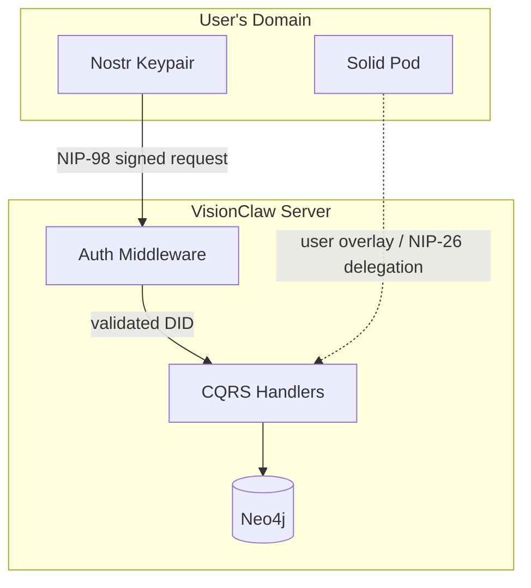
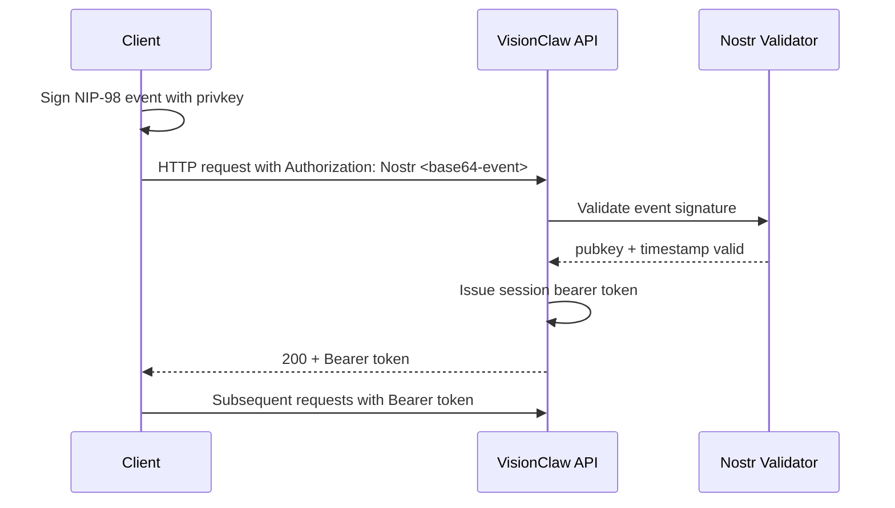

# VisionClaw Security Model

---

## 1. Security Philosophy

VisionClaw's security model is built on three principles:

**Decentralised Identity** — Identity is rooted in a Nostr keypair (secp256k1). There is no central authentication server that can be compromised or that holds user credentials. A user's identity is their private key; the corresponding public key (`npub`) is their stable identifier across the entire system.

**Data Sovereignty** — User-generated overlays, agent memories, and personal preferences are stored in the user's own Solid Pod, not in the shared Neo4j graph. The server cannot access Pod data without an active, user-granted delegation. Revoking Pod access removes the server's ability to read or write user data immediately.

**Semantic Governance** — The OWL ontology layer enforces coarse-grained access patterns at query time. Node types (knowledge, ontology, agent) carry class flags in their IDs; CQRS handlers inspect these flags before executing mutations. Access patterns are expressed as ontology constraints, not as ad-hoc permission checks scattered through the codebase.

### Trust Boundary Model



The dashed arrow from Solid Pod represents an optional, user-initiated delegation. The server never holds the user's private key.

---

## 2. Authentication Architecture

### Nostr Keypair Generation

Keypairs use the secp256k1 curve — the same elliptic curve used by Bitcoin. The private key is a 32-byte scalar; the public key is its compressed point representation. VisionClaw never generates keys on behalf of the user; the client either derives them from a NIP-07 browser extension (Alby, nos2x) or from locally generated material.

```typescript
import { generatePrivateKey, getPublicKey } from 'nostr-tools';

const sk = generatePrivateKey();   // 32-byte hex
const pk = getPublicKey(sk);       // compressed secp256k1 pubkey, hex
```

### NIP-98 HTTP Authentication

NIP-98 is a Nostr-native HTTP authentication scheme. The client constructs a kind-27235 Nostr event, signs it with the private key, base64-encodes it, and sends it as an `Authorization` header. No password or shared secret is involved.

**Required event tags**:

| Tag | Description | When required |
|-----|-------------|---------------|
| `u` | Full request URL including query string | Always |
| `method` | HTTP method in uppercase (`GET`, `POST`, …) | Always |
| `payload` | SHA-256 hex digest of the request body | POST / PUT only |

**Validity constraints enforced by the server**:
- `created_at` must be within 60 seconds of server clock (replay window)
- Schnorr signature over the serialised event ID must verify against the embedded `pubkey`
- Each event is single-use: the server maintains a short-lived replay cache keyed on event ID

**Example — constructing an auth header**:

```typescript
import { finishEvent } from 'nostr-tools';

const authEvent = finishEvent({
  kind: 27235,
  created_at: Math.floor(Date.now() / 1000),
  tags: [
    ['u', 'https://api.example.com/api/settings/bulk'],
    ['method', 'POST'],
    ['payload', sha256HexOfBody]
  ],
  content: ''
}, privateKey);

const authHeader = `Nostr ${btoa(JSON.stringify(authEvent))}`;
```

### Session Bearer Tokens

Performing a full NIP-98 signature on every request is unnecessary and computationally expensive for high-frequency operations. After the first successful NIP-98 validation, the server issues a session bearer token:

- Stored client-side in `localStorage` under the key `nostr_session_token`
- Bound to the validated `pubkey`; the server rejects tokens presented with a mismatched `X-Nostr-Pubkey` header
- Lifetime controlled by `AUTH_TOKEN_EXPIRY` (default: 3600 seconds)
- No automatic refresh: the client must re-authenticate via NIP-98 after expiry

**Subsequent requests**:
```http
Authorization: Bearer <nostr_session_token>
X-Nostr-Pubkey: <hex_pubkey>
```

Server-side validation path: `nostr_service.validate_session(&pubkey, &token)`.

### DID Resolution Flow

VisionClaw treats the Nostr `pubkey` as a lightweight DID. There is no external DID resolver call; the public key is self-certifying. The Solid Pod profile at `/pods/{npub}/profile/card` links the Nostr identity to a WebID via a `foaf:Person` record, making the identity resolvable in Linked Data contexts.

### Why Not JWT (Deprecated November 2025)

JWT email/password login was removed because:
1. It required a credential store (email + bcrypt hash) that became an attack surface
2. JWTs are bearer tokens with no built-in revocation; a stolen token was valid until expiry
3. The `VIRCADIA_JWT_SECRET` environment variable default (`change_this_in_production`) was routinely left unchanged in early deployments, invalidating the security guarantee
4. Nostr NIP-98 provides equivalent session bootstrapping with zero server-side secrets and replay protection built in

**Do not use JWT endpoints in new integrations.** The `VIRCADIA_JWT_SECRET` env var is retained only for legacy Vircadia World Server compatibility.

### NIP-98 Authentication Sequence



---

## 3. Authorization Model

### CQRS Boundary Checks

VisionClaw follows a CQRS pattern (see `docs/explanation/backend-cqrs-pattern.md`). Authorization is enforced at the handler boundary before any command or query reaches the domain model:

- **Commands** (POST, PUT, DELETE): require an authenticated session; the validated `pubkey` is injected into the command envelope and becomes the `author` field in event-sourced state changes
- **Queries** (GET): graph data and ontology queries are public by default; settings queries require authentication; analytics requiring user-specific state require authentication

### RBAC Roles

VisionClaw uses a four-tier role-based access control model:

| Role | How assigned | Capabilities |
|------|-------------|--------------|
| `ReadOnly` | Default for unauthenticated or minimal-privilege sessions | Read graph data, view public ontology hierarchy, access health endpoints |
| `WriteGraph` | Authenticated pubkey with graph write permissions | All ReadOnly capabilities + create/update/delete graph nodes and edges |
| `WriteSettings` | Authenticated pubkey | All WriteGraph capabilities + modify own settings, provision own Pod |
| `Admin` | `pubkey` listed in `POWER_USER_PUBKEYS` env var | All capabilities + modify physics simulation parameters, force graph resync, access admin diagnostics, trigger sync, manage ontology |

There is no role stored in a database. Admin status is determined solely by membership in the comma-separated `POWER_USER_PUBKEYS` list at startup. This eliminates privilege escalation via database mutation.

Auth guards are applied to 17 write endpoints across graph mutations, ontology modifications, admin sync triggers, and settings updates. Each guarded endpoint checks the caller's role before dispatching the command through the CQRS bus.

### Public vs Protected Operations

| Operation | Auth required |
|-----------|--------------|
| `GET /api/graph/data` | No (public read) |
| `GET /api/ontology/hierarchy` | No |
| `GET /api/health/*` | No |
| `GET /api/settings/:key` | Yes (own settings only) |
| `PUT /api/settings/*` | Yes |
| `POST /api/graph/*` (mutations) | Yes, power user |
| `DELETE /api/graph/node/:id` | Yes, power user |
| `POST /api/bots/*` | Yes |
| Solid Pod (`/solid/pods/{npub}/*`) | Yes, delegated NIP-26 token |
| WebSocket upgrade (`/wss`) | Token in query param |

### Graph Node/Edge Access

Node IDs encode type in their upper flag bits (bits 26–31). The CQRS handlers check the flag before applying mutations: ontology nodes (`owl_*`) are immutable by standard users; agent nodes can be mutated by the owning pubkey only. Knowledge nodes are read-only for all non-power users.

### Settings Isolation

Settings are stored keyed by `pubkey`. A request for `GET /api/settings/physics` returns settings for the pubkey in the bearer token, not a global value. There is no cross-user settings leakage.

---

## 4. Data Sovereignty (Solid Pods)

### What Lives Where

| Data | Location | Rationale |
|------|----------|-----------|
| Knowledge graph nodes / edges | Shared Neo4j | Content is public or organisation-wide |
| Ontology classes and relations | Shared Neo4j | Immutable reference data |
| Physics simulation parameters | Settings table (keyed by pubkey) | Per-user preference |
| Agent episodic / semantic memories | User's Solid Pod | User owns their agent's memory |
| Agent session summaries | User's Solid Pod | Personal data |
| WebID profile | User's Solid Pod | Self-sovereign identity |
| Delegation tokens | User's Solid Pod (`/delegations/`) | User grants and revokes |

### WAC / ACP Access Control

Each pod is provisioned with a `.acl` resource at its root. The default ACL grants:
- **Owner** (the `npub` WebID): read, write, append, control
- **VisionClaw server WebID**: read, write (scoped to `agent-memory/`)
- **Public**: no access

Access Control Policies follow WAC (Web Access Control) semantics. The server presents a delegation token (NIP-26 signed by the user) to JSS on each Pod request; JSS validates the delegation chain before granting access.

### NIP-26 Delegation Flow

```
1. User authenticates to VisionClaw (NIP-07 browser extension)
2. VisionClaw generates an ephemeral agent keypair (session-scoped)
3. User signs a NIP-26 delegation: "I delegate {agent_pubkey} until {unix_expiry}"
4. Delegation is stored in the user's Pod at /delegations/
5. Agents use the delegated key to sign NIP-98 requests to JSS
6. JSS validates the delegation chain; grants access as the user
```

### Pod Access Revocation

When the user revokes delegation (or the delegation expires):
- JSS rejects all subsequent NIP-98 requests signed by the delegated key
- VisionClaw agents lose Pod access immediately (next Pod request returns 403)
- No cached copy of Pod data is retained on the server; the agent gracefully degrades to shared Neo4j data only

### GDPR Implications

Because personal data lives in the user's Pod:
- VisionClaw does not need to respond to data deletion requests for Pod content — the user deletes it themselves
- The server's Neo4j graph contains only knowledge graph nodes (public content); no personal data is stored there
- Settings stored server-side are keyed by pubkey (a pseudonymous identifier); users can request deletion via the `DELETE /api/settings/user` endpoint
- The server MUST NOT log Pod payload contents (see Section 7)

---

## 5. Transport Security

### TLS Requirements

All production traffic must use TLS 1.2 or later. The minimum cipher suite list follows Mozilla's Intermediate profile. Self-signed certificates are not acceptable for production deployments; use Let's Encrypt or an internal CA with a trusted root.

- HTTP API: serve on port 443 (TLS); redirect 80 → 443
- WebSocket: `wss://` only; `ws://` is permitted only for `localhost` in development
- Solid Pod (JSS): `https://` required; JSS must be behind the same reverse proxy as the main API or have its own TLS termination

### WebSocket Upgrade Security

The WebSocket upgrade request is validated before the connection is accepted:

1. `Upgrade: websocket` header must be present and correct
2. Auth token must be present in the query string (`?token=<bearer>`) at upgrade time — the WebSocket API does not permit custom headers after the upgrade
3. **Token validation via `validate_session()`**: The server validates the session token against the authenticated session store before completing the WebSocket upgrade. Invalid or expired tokens are rejected with a 401 before the upgrade completes.
4. After upgrade, the client sends an explicit `authenticate` message `{token, pubkey}` which is validated again server-side
5. Connections that fail to send the auth message within 5 seconds are closed

### Binary Protocol Security

The binary position update protocol (single unified format — see [docs/binary-protocol.md](../binary-protocol.md) and [ADR-061](../adr/ADR-061-binary-protocol-unification.md)) carries only numeric node IDs and f32 position/velocity components. No user-identifying information, pubkeys, or session tokens appear in binary frames. An eavesdropper on the binary channel learns only that nodes moved — no identity linkage is possible from the binary stream alone.

The fixed preamble byte (0x42) is validated on every frame as a sanity check; mismatches are rejected, not truncated. Payload length must match `9 + 24 × node_count`. The preamble is not a version dispatch — there is one binary protocol, and any future evolution gets a new endpoint.

### Content Security Policy

The client's `index.html` includes a Content-Security-Policy (CSP) header that restricts script sources, style sources, and connection targets. This mitigates XSS and data exfiltration risks in the WebXR client.

### Rate Limiting

Rate limiting is applied per IP address at the API gateway layer:

| Parameter | Default | Environment variable |
|-----------|---------|---------------------|
| Window size | 60 seconds | `RATE_LIMIT_WINDOW_MS` |
| Max requests | 100 per window | `RATE_LIMIT_MAX_REQUESTS` |
| WebSocket connections | 100 concurrent | `WS_MAX_CONNECTIONS` |
| TCP connections | 50 concurrent | `TCP_MAX_CONNECTIONS` |

IPs exceeding the limit receive `429 Too Many Requests`. Backing off with exponential backoff is the expected client behaviour; the server does not communicate retry-after in the current implementation.

---

## 6. Secret Management

### Environment Variables for Secrets

All secrets are injected via environment variables. The following variables MUST be set to non-default values before production deployment:

| Variable | Purpose | Default (INSECURE — change immediately) |
|----------|---------|------------------------------------------|
| `SESSION_SECRET` | Session token signing key | none — required |
| `WS_AUTH_TOKEN` | WebSocket pre-auth token | none — required |
| `VIRCADIA_JWT_SECRET` | Legacy Vircadia JWT signing | `change_this_in_production` |
| `POSTGRES_PASSWORD` | Neo4j / RuVector DB password | `visionclaw_secure` |
| `NEO4J_PASSWORD` | Neo4j database password | none — **required** (no default; server fails fast if unset) |
| `POWER_USER_PUBKEYS` | Comma-separated power user pubkeys | none (no power users) |
| `AUTH_TOKEN_EXPIRY` | Session token TTL in seconds | `3600` |
| `RUVECTOR_PG_CONNINFO` | RuVector connection string | — |

### Production Security Hardening (`APP_ENV=production`)

When `APP_ENV` is set to `production`, several additional security constraints are enforced:

- **`ALLOW_INSECURE_DEFAULTS` is blocked**: The server refuses to start if any secret retains its insecure default value. In non-production environments, insecure defaults are permitted with a warning.
- **`SETTINGS_AUTH_BYPASS` is blocked**: This variable has been removed from `docker-compose.yml` and is rejected at startup in production mode. It previously allowed unauthenticated access to settings endpoints during development.
- **API keys masked in `Debug` output**: All API key and secret types implement custom `Debug` formatting that masks the value, preventing accidental credential leakage in log output or error messages.
- **Docker socket mount removed**: The Docker socket (`/var/run/docker.sock`) is no longer mounted into any service container in the compose files, eliminating a container escape vector.

### What MUST NOT Be Hardcoded

- Private keys of any kind (Nostr, TLS, JWT)
- Database passwords
- API tokens for external services (GitHub, Nostr relays)
- `POWER_USER_PUBKEYS` list (encodes operational privilege — changes frequently)

### Docker Secrets Integration

For Docker Swarm or Kubernetes deployments, use native secrets management rather than environment variables in `docker-compose.yml`:

```yaml
secrets:
  session_secret:
    external: true
  postgres_password:
    external: true

services:
  webxr:
    secrets:
      - session_secret
      - postgres_password
    environment:
      SESSION_SECRET_FILE: /run/secrets/session_secret
```

The application reads `SESSION_SECRET_FILE` and `POSTGRES_PASSWORD_FILE` (the `_FILE` suffix convention) when the plain variable is absent.

### Key Rotation Procedure

1. Generate a new secret value (minimum 32 random bytes, base64-encoded)
2. Set the new value in your secrets manager
3. Restart the service (rolling restart for multi-replica deployments)
4. All existing session tokens become invalid immediately; users must re-authenticate via NIP-98
5. Nostr keypairs belong to users and are not rotated by the server

---

## 7. Audit Trail

### Logged Events

The following events are written to the structured log at `INFO` level or above:

| Event | Fields logged |
|-------|--------------|
| NIP-98 authentication attempt | `timestamp`, `pubkey`, `method`, `url`, `result` (success/fail), `ip` |
| Session token issued | `timestamp`, `pubkey`, `expiry` |
| Session token rejected | `timestamp`, `pubkey_claimed`, `reason`, `ip` |
| CQRS command received | `timestamp`, `pubkey`, `command_type`, `entity_id` |
| CQRS command rejected (authz) | `timestamp`, `pubkey`, `command_type`, `reason` |
| WebSocket connection opened | `timestamp`, `ip`, `pubkey` |
| WebSocket connection closed | `timestamp`, `pubkey`, `duration_s`, `reason` |
| Rate limit exceeded | `timestamp`, `ip`, `endpoint` |
| Pod delegation validated | `timestamp`, `pubkey`, `delegated_key`, `resource` |
| Pod access denied (403) | `timestamp`, `pubkey`, `resource`, `reason` |
| Settings mutation | `timestamp`, `pubkey`, `setting_key` (value NOT logged) |

### Log Format

Logs are structured JSON emitted to stdout, consumed by the container runtime. Example:

```json
{
  "timestamp": "2026-04-09T14:23:01.442Z",
  "level": "INFO",
  "event": "nip98_auth",
  "pubkey": "3bf0c63fcb93463407af97a5e5ee64fa883d107ef9e558472c4eb9aaaefa459d",
  "method": "POST",
  "url": "/api/settings/bulk",
  "result": "success",
  "ip": "10.0.0.5"
}
```

### Telemetry Integration

The Rust backend emits OpenTelemetry spans for authentication and CQRS handler paths. Span attributes mirror the log fields above. Configure the OTLP exporter via `OTEL_EXPORTER_OTLP_ENDPOINT`.

### GDPR: What Cannot Be Logged

- Pod payload contents (user's personal data lives in their Pod; the server must not copy it to logs)
- Setting values (only the key is logged, never the value — values may contain personal data)
- Full request bodies for mutation endpoints
- NIP-98 event `content` field (reserved for future use but could carry personal data)
- IP addresses beyond the current request context (do not persist IPs to a database)

---

## 8. Known Security Constraints

This section documents what is deliberately not covered in the current architecture. These are honest constraints, not oversights — each has a recorded rationale.

### No mTLS Between Internal Services

Communication between the Rust backend, Neo4j, JSS, and RuVector uses plain TCP within the Docker network. mTLS between internal services would require a certificate authority, certificate rotation, and per-service identity — engineering overhead not yet justified for single-host deployments. The Docker network boundary is the current internal isolation mechanism. For multi-host deployments, use a service mesh (Istio, Linkerd) or overlay network with encryption.

### No Automated Secret Rotation

`AUTH_TOKEN_EXPIRY` limits session token lifetimes, but rotation of the `SESSION_SECRET` itself is a manual procedure (see Section 6). There is no automated rotation or SOPS integration. Key rotation causes a service restart and session invalidation — the operational cost is acceptable for current deployment scale.

### Vircadia Uses Its Own Authentication

The Vircadia World Server validates connections using its own token mechanism (`system` or `nostr` provider via the Vircadia auth layer). This authentication is separate from VisionClaw's NIP-98 flow. A user who authenticates to VisionClaw is not automatically authenticated to the Vircadia World Server. The two auth systems are bridged only when the client explicitly passes its Vircadia session token alongside the VisionClaw bearer token.

### Token in WebSocket URL

WebSocket bearer tokens are passed as a URL query parameter (`?token=…`) because the WebSocket protocol does not support custom headers at upgrade time. This means the token appears in server access logs and browser history. Mitigation: use short-lived tokens (`AUTH_TOKEN_EXPIRY=300` for WebSocket sessions) and ensure WSS is enforced so the URL is not visible in transit.

### Non-Parameterised SQL in Legacy Vircadia Clients

`SpatialAudioManager`, `NetworkOptimizer`, and `Quest3Optimizer` in the Vircadia client layer use string-interpolated SQL for entity names and JSON payloads (see `docs/security.md`). These values originate from trusted client-side state, but the pattern should be migrated to parameterised queries. This is tracked as a known issue.

---

## 9. Security Checklist

Use this table to verify a deployment before exposing it to production traffic.

### Pre-Deployment

| Check | Verified |
|-------|---------|
| All required environment variables set (no defaults remaining) | [ ] |
| `VIRCADIA_JWT_SECRET` changed from `change_this_in_production` | [ ] |
| `POSTGRES_PASSWORD` changed from `visionclaw_secure` | [ ] |
| `SESSION_SECRET` set to a random 32+ byte value | [ ] |
| `WS_AUTH_TOKEN` set to a random value | [ ] |
| `.env` file absent from version control (check `.gitignore`) | [ ] |
| `POWER_USER_PUBKEYS` contains only intended pubkeys | [ ] |
| `SETTINGS_AUTH_BYPASS` is `false` or unset (blocked in production mode) | [ ] |
| `ALLOW_INSECURE_DEFAULTS` is `false` or unset (blocked when `APP_ENV=production`) | [ ] |
| `NEO4J_PASSWORD` set (no default — server fails fast if unset) | [ ] |
| `APP_ENV` set to `production` for production deployments | [ ] |
| Rate limiting parameters reviewed for expected traffic | [ ] |
| CORS origins restricted to known domains (`CORS_ALLOWED_ORIGINS`) | [ ] |

### Transport

| Check | Verified |
|-------|---------|
| TLS 1.2+ configured on reverse proxy | [ ] |
| HTTP→HTTPS redirect active | [ ] |
| `ws://` disabled; only `wss://` accepted in production | [ ] |
| JSS (Solid) served over HTTPS | [ ] |
| HSTS header configured on reverse proxy | [ ] |

### Container / Network

| Check | Verified |
|-------|---------|
| Docker containers run as non-root user | [ ] |
| Docker socket (`/var/run/docker.sock`) not mounted into containers | [ ] |
| `no-new-privileges` security option set | [ ] |
| Only required ports exposed on host | [ ] |
| Internal services (Neo4j, RuVector, JSS) not exposed on host | [ ] |
| Docker image built from pinned base image (no `latest`) | [ ] |

### Operational

| Check | Verified |
|-------|---------|
| Structured log output flowing to central log aggregator | [ ] |
| Alert configured for repeated `nip98_auth` failures from same IP | [ ] |
| Alert configured for `rate_limit_exceeded` spikes | [ ] |
| Solid Pod backups scheduled | [ ] |
| Key rotation procedure documented and tested | [ ] |
| Incident response contact list current | [ ] |

---

## Related Documentation

- [Solid Sidecar Architecture](solid-sidecar-architecture.md) — JSS deployment, LDP container structure, NIP-98 handler
- [User-Agent Pod Design](user-agent-pod-design.md) — NIP-26 delegation, per-user Pod provisioning pseudocode
- [Backend CQRS Pattern](backend-cqrs-pattern.md) — command/query handler structure and authorization injection points
- [REST API Reference](../reference/rest-api.md) — endpoint authentication requirements, NIP-98 header construction
- [Nostr Authentication How-To](../how-to/features/nostr-auth.md) — client-side implementation guide
- [Security Operations](../how-to/operations/security.md) — deployment checklist, rate limiting configuration, Docker hardening
