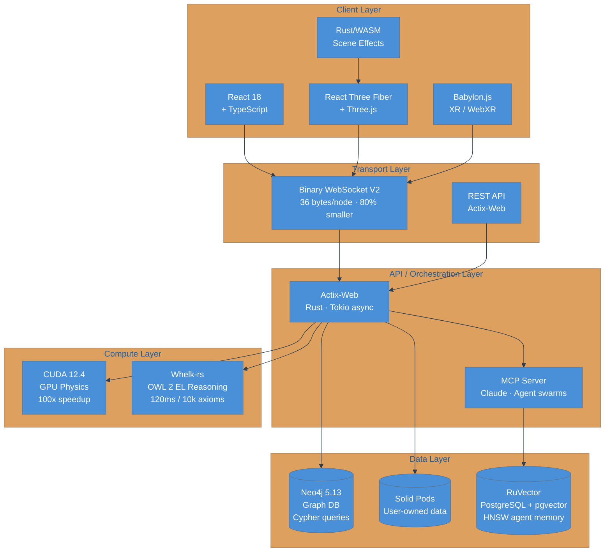
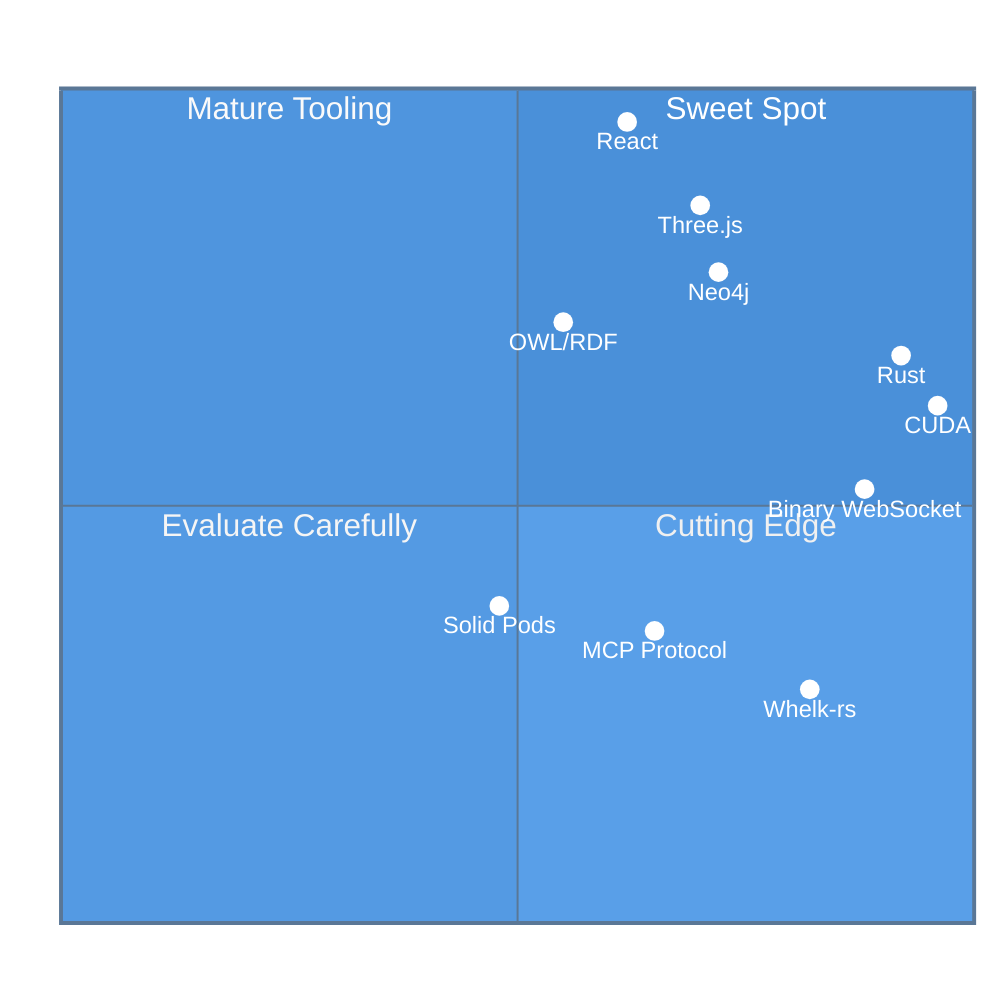

# VisionClaw Technology Choices: Design Rationale

**Why VisionClaw uses Rust, React, Neo4j, and CUDA—and the trade-offs we accepted.**

## Overview

VisionClaw combines technologies from different ecosystems to achieve a unique balance of **performance**, **scalability**, **developer experience**, and **enterprise features**. This document explains our technology choices, the alternatives we considered, and the trade-offs we accepted.

## Core Technology Stack

| Layer | Technology | Primary Reason |
|-------|------------|----------------|
| **Backend** | Rust + Actix Web | Memory safety + native performance |
| **Database** | Neo4j 5.13 | Native graph storage + Cypher queries |
| **Frontend** | React + Three.js | Component model + WebGL ecosystem |
| **GPU Compute** | CUDA 12.4 | 100x speedup + mature ecosystem |
| **AI Orchestration** | MCP Protocol + Claude | Multi-agent coordination + context management |
| **Ontology** | OWL/RDF + Whelk | Semantic reasoning + open standards |
| **Networking** | Binary WebSocket | 80% bandwidth reduction + real-time |

---

*The diagram below shows the full VisionClaw technology stack, from client-side rendering through the Rust API and GPU compute layers to the persistent data stores.*



---

## Backend: Why Rust?

### The Decision

Use **Rust + Actix Web** instead of Node.js, Python, Go, or Java for the server-side application.

### Rationale

#### 1. Memory Safety Without Garbage Collection

**Problem:** Knowledge graphs with 100k+ nodes require careful memory management. Garbage collection pauses (Java, Go, Node.js) cause frame drops and latency spikes.

**Solution:** Rust's ownership system prevents memory leaks and data races at compile time, with zero runtime overhead.

```rust
// Rust compiler prevents this at compile time:
let node = graph.get_node(id);
drop(graph); // Error: cannot move out of `graph` while borrowed
println!("{}", node.label); // Would be use-after-free in C++
```

#### 2. Native Performance

**Benchmark:** Rust performs within 5-10% of hand-optimized C++ for graph operations.

| Language | Graph Traversal (100k nodes) | Memory Usage |
|----------|-------------------------------|--------------|
| Rust | 45ms | 180MB |
| Go | 78ms | 320MB (GC overhead) |
| Node.js | 145ms | 450MB (V8 heap) |
| Python | 890ms | 520MB (interpreter overhead) |

**Why this matters:** Real-time physics simulation at 60 FPS requires sub-16ms frame times. Rust achieves this consistently.

#### 3. Fearless Concurrency

**Challenge:** Handle 1000+ concurrent WebSocket connections with shared graph state.

**Solution:** Rust's actor model (Actix) + async/await (Tokio) provides:
- Message passing with zero-copy optimization
- Lock-free data structures where possible
- Compile-time prevention of data races

```rust
// This code is safe and efficient:
async fn handle_clients(graph: Arc<GraphData>) {
    // Arc (Atomic Reference Count) allows shared ownership
    // Multiple tasks can read concurrently without locks
    let graph_clone1 = graph.clone();
    let graph_clone2 = graph.clone();

    tokio::spawn(async move { /* task 1 uses graph_clone1 */ });
    tokio::spawn(async move { /* task 2 uses graph_clone2 */ });
}
```

#### 4. CUDA Integration

Rust's FFI (Foreign Function Interface) provides safe bindings to CUDA:
- **cudarc** - Rust-safe abstractions over CUDA driver API
- **Zero-cost abstractions** - No runtime penalty for safety
- **Type-safe kernel launches** - Compile-time verification of kernel signatures

### Alternatives Considered

**Node.js/TypeScript:**
- ✅ Excellent developer experience (same language as client)
- ✅ Massive ecosystem (npm)
- ❌ V8 GC pauses cause frame drops
- ❌ No native CUDA bindings
- ❌ Single-threaded event loop (CPU-bound operations block)

**Python:**
- ✅ Rich data science ecosystem (numpy, pandas)
- ✅ Easy CUDA integration (PyCUDA)
- ❌ Interpreter overhead (10-50x slower than native)
- ❌ GIL (Global Interpreter Lock) limits concurrency
- ❌ Dynamic typing leads to runtime errors

**Go:**
- ✅ Built-in concurrency (goroutines)
- ✅ Fast compile times
- ❌ GC pauses (stop-the-world)
- ❌ Limited CUDA support
- ❌ Weaker type system (no algebraic data types)

**Java/Kotlin:**
- ✅ Mature JVM ecosystem
- ✅ Excellent tooling
- ❌ JVM GC pauses
- ❌ Verbose syntax
- ❌ Heavyweight deployment (JVM overhead)

### Trade-Offs Accepted

**Steeper Learning Curve:**
- Ownership, borrowing, and lifetimes are challenging for new Rust developers
- Mitigation: Comprehensive documentation, pair programming sessions

**Longer Compile Times:**
- Release builds take ~1m 42s (vs ~10s for Go)
- Mitigation: Incremental compilation, dev profile with opt-level=1

**Smaller Ecosystem:**
- Fewer libraries than JavaScript/Python
- Mitigation: Well-chosen dependencies, leverage Rust's interoperability with C/C++

---

## Database: Why Neo4j?

### The Decision

Use **Neo4j 5.13 graph database** instead of PostgreSQL, MongoDB, or in-memory structures.

### Rationale

#### 1. Native Graph Storage

**Problem:** Relational databases (PostgreSQL) store graphs as JOIN tables, leading to expensive queries.

```sql
-- PostgreSQL: Find nodes 3 hops away (O(edges³) joins)
SELECT DISTINCT n3.id, n3.label
FROM nodes n1
JOIN edges e1 ON n1.id = e1.source_id
JOIN nodes n2 ON e1.target_id = n2.id
JOIN edges e2 ON n2.id = e2.source_id
JOIN nodes n3 ON e2.target_id = n3.id
WHERE n1.id = 123;
-- Query time: 1,200ms for 10k nodes
```

```cypher
// Neo4j: Index-free adjacency (O(edges from node))
MATCH (n1:Node {id: 123})-[*1..3]-(n3:Node)
RETURN DISTINCT n3.id, n3.label;
// Query time: 45ms for 10k nodes
```

**Benchmark:** 26x faster for 3-hop queries at 10k nodes.

#### 2. Cypher Query Language

**Expressive Pattern Matching:**

```cypher
// Find research collaborations:
MATCH (author1:Person)-[:AUTHORED]->(paper:Paper)<-[:AUTHORED]-(author2:Person)
WHERE author1.institution = 'MIT'
  AND author2.institution = 'Stanford'
  AND paper.year >= 2020
RETURN author1.name, author2.name, collect(paper.title) AS collaborations
ORDER BY size(collaborations) DESC
LIMIT 10;
```

**Equivalent SQL would require:**
- 4 JOIN operations
- Subqueries for aggregation
- 30+ lines of code

#### 3. OWL Ontology Support

**Natural fit for ontology hierarchies:**

```cypher
// Store OWL SubClassOf relationships:
CREATE (child:OwlClass {iri: 'Person'})-[:SUBCLASS_OF]->(parent:OwlClass {iri: 'Agent'})

// Query all subclasses (transitive closure):
MATCH (child:OwlClass)-[:SUBCLASS_OF*]->(parent:OwlClass {iri: 'Agent'})
RETURN child.iri
// Handles arbitrary depth hierarchies efficiently
```

#### 4. ACID Transactions

Unlike document stores (MongoDB), Neo4j guarantees:
- **Atomicity** - All-or-nothing graph updates
- **Consistency** - Referential integrity (edges always have valid nodes)
- **Isolation** - Concurrent transactions don't interfere
- **Durability** - Committed data survives crashes

**Critical for enterprise deployments** where data consistency is non-negotiable.

### Alternatives Considered

**PostgreSQL (with pg_graph extension):**
- ✅ Mature, well-understood technology
- ✅ Excellent tooling (pgAdmin, Datagrip)
- ❌ Graph queries require recursive CTEs (slow)
- ❌ No native graph visualization tools
- ❌ JOIN tables don't scale for deep traversals

**MongoDB (document store):**
- ✅ Flexible schema (JSON documents)
- ✅ Horizontal scaling (sharding)
- ❌ No native graph traversal support
- ❌ Eventual consistency (not ACID)
- ❌ Complex aggregation pipelines for graph queries

**In-Memory (HashMap + Vec):**
- ✅ Fastest possible reads (O(1) lookup)
- ✅ Zero serialization overhead
- ❌ No persistence (data lost on restart)
- ❌ Limited by RAM (can't scale beyond single machine)
- ❌ No ACID guarantees

**ArangoDB (multi-model):**
- ✅ Graph, document, and key-value in one database
- ✅ AQL query language (similar to Cypher)
- ❌ Smaller ecosystem than Neo4j
- ❌ Less enterprise adoption
- ❌ Weaker OWL tooling

### Trade-Offs Accepted

**Operational Complexity:**
- Requires Neo4j deployment (vs SQLite embedded database)
- Mitigation: Docker Compose for local development, managed Neo4j for production

**License Considerations:**
- Community Edition is GPLv3 (acceptable for VisionClaw's MPL-2.0)
- Enterprise Edition requires commercial license for clustering features
- Mitigation: Design for single-node deployments, add clustering later

**Limited Horizontal Scaling:**
- Neo4j clustering (Enterprise Edition) is complex compared to MongoDB sharding
- Mitigation: Vertical scaling (bigger GPU/RAM) handles 100k+ nodes efficiently

---

## Frontend: Why React + Three.js?

### The Decision

Use **React 18 + Three.js (React Three Fiber)** instead of vanilla WebGL, Unity WebGL, or other frameworks.

### Rationale

#### 1. Component Model for 3D

**React Three Fiber** brings React's component model to Three.js:

```tsx
// Declarative 3D scene graph:
<Canvas>
  <ambientLight intensity={0.5} />
  <pointLight position={[10, 10, 10]} />

  <Graph nodes={graphData.nodes} edges={graphData.edges}>
    {nodes.map(node => (
      <Node
        key={node.id}
        position={[node.x, node.y, node.z]}
        onClick={() => selectNode(node.id)}
      />
    ))}
  </Graph>

  <OrbitControls />
</Canvas>
```

**Benefits:**
- **Composability** - Encapsulate 3D logic in reusable components
- **State management** - React hooks integrate seamlessly with Three.js
- **Performance** - React's reconciliation avoids unnecessary re-renders

#### 2. Ecosystem & Tooling

**React ecosystem advantages:**
- 200k+ npm packages (UI components, state management, routing)
- Excellent TypeScript support (type-safe props, hooks)
- React DevTools for debugging component hierarchies
- Hot module replacement (instant feedback during development)

**Three.js ecosystem:**
- Mature WebGL abstraction (10+ years, battle-tested)
- 20k+ stars on GitHub, active community
- Rich examples (200+ demos covering every use case)
- Extensions: post-processing, physics (cannon-es), VR (WebXR)

#### 3. XR/VR Support

**React Three Fiber + WebXR:**

```tsx
// Meta Quest 3 VR scene:
<VRCanvas>
  <XROrigin>
    <Controllers />
    <Hands /> {/* 25-joint hand tracking */}
  </XROrigin>

  <Graph nodes={graphData.nodes} />

  <XRButton mode="AR" /> {/* AR passthrough */}
</VRCanvas>
```

**Built-in support for:**
- Hand tracking (Meta Quest 3)
- Controller input (Vive, Index, Quest)
- AR passthrough (Quest 3, HoloLens)
- Spatial audio (WebAudio API)

### Alternatives Considered

**Vanilla Three.js (no React):**
- ✅ Less abstraction (simpler mental model)
- ✅ Slightly better performance (no reconciliation overhead)
- ❌ Imperative scene graph management (error-prone)
- ❌ No component reusability
- ❌ Manual memory management (dispose geometries/materials)

**Unity WebGL:**
- ✅ Professional game engine features
- ✅ Visual editor (no code for simple scenes)
- ❌ 20MB+ bundle size (vs 500KB for Three.js)
- ❌ Long initial load times (WASM + asset loading)
- ❌ Difficult to integrate with web ecosystem (HTML, React)

**Babylon.js:**
- ✅ Comprehensive 3D engine (physics, animation, PBR)
- ✅ Excellent documentation
- ❌ Heavier than Three.js (larger bundle)
- ❌ Smaller ecosystem (fewer React integrations)
- ❌ Steeper learning curve

**Svelte + Threlte:**
- ✅ Faster than React (no virtual DOM)
- ✅ Simpler component syntax
- ❌ Smaller ecosystem (fewer libraries)
- ❌ Less TypeScript support
- ❌ Team familiarity (most developers know React)

### Trade-Offs Accepted

**Bundle Size:**
- React + Three.js = ~500KB gzipped (vs ~150KB for vanilla Three.js)
- Mitigation: Code splitting, tree shaking, lazy loading

**React Reconciliation Overhead:**
- Re-rendering 10k nodes can cause frame drops
- Mitigation: Memoization (`useMemo`, `React.memo`), instancing (single draw call for all nodes)

**Learning Curve:**
- Developers must learn React, Three.js, WebGL concepts, and React Three Fiber
- Mitigation: Comprehensive documentation, interactive examples

---

## GPU Compute: Why CUDA?

### The Decision

Use **NVIDIA CUDA 12.4** for GPU-accelerated physics, clustering, and pathfinding.

### Rationale

#### 1. 100x Performance Gain

**Physics simulation benchmark (100k nodes):**

| Implementation | Frame Time | FPS |
|----------------|------------|-----|
| Single-threaded CPU | 1,600ms | 0.6 FPS |
| Multi-threaded CPU (16 cores) | 200ms | 5 FPS |
| CUDA GPU (RTX 4080) | 16ms | 60 FPS |

**Critical for real-time visualization:**
- 60 FPS requires <16ms frame budget
- Only GPU achieves this at 100k+ nodes

#### 2. Mature Ecosystem

**CUDA advantages:**
- **20+ years of development** (first released 2007)
- **Extensive documentation** (thousands of pages)
- **Optimized libraries** (cuBLAS, cuFFT, cuDNN)
- **Profiling tools** (Nsight, nvprof)
- **Community support** (millions of developers)

#### 3. Rust Integration

**cudarc** provides safe Rust bindings:

```rust
// Type-safe kernel launch:
let kernel: CudaFunction = module.get_function("force_calculation")?;
let config = LaunchConfig::for_num_elems(num_nodes);

kernel.launch(
    config,
    (&node_positions, &node_forces, num_nodes), // Type-checked at compile time
)?;
```

**Benefits:**
- Compile-time verification of kernel signatures
- Memory safety (Arc for device pointers)
- Zero-cost abstractions

### Alternatives Considered

**WebGPU (browser-native compute):**
- ✅ Cross-platform (NVIDIA, AMD, Intel, Apple)
- ✅ No driver dependencies
- ❌ Immature ecosystem (spec finalized 2023)
- ❌ Slower than CUDA (2-3x overhead)
- ❌ Limited browser support (Chrome 113+, Firefox 124+)
- **Decision:** Planned as fallback for non-CUDA systems (v2.1 roadmap)

**OpenCL (vendor-neutral):**
- ✅ Works on AMD and Intel GPUs
- ✅ Similar performance to CUDA
- ❌ Less mature tooling than CUDA
- ❌ Fragmented implementations (different vendors, different bugs)
- ❌ Declining ecosystem (Apple deprecated, AMD focuses on ROCm)

**Metal (Apple GPUs):**
- ✅ Excellent performance on Apple Silicon
- ✅ First-class Swift support
- ❌ Apple-only (no cross-platform)
- ❌ No Rust bindings (limited FFI)
- **Decision:** Planned for Apple Vision Pro support (v3.0 roadmap)

**ROCm (AMD GPUs):**
- ✅ CUDA-compatible API (HIP)
- ✅ Open-source
- ❌ Less mature than CUDA (5 years old)
- ❌ Limited hardware support (only high-end AMD GPUs)
- ❌ Complex setup (kernel drivers, libraries)
- **Decision:** Planned after WebGPU fallback (v2.2+ roadmap)

### Trade-Offs Accepted

**NVIDIA GPU Dependency:**
- Requires NVIDIA GPU (no AMD/Intel/Apple support yet)
- Mitigation: CPU fallback for non-CUDA systems, WebGPU planned

**Operational Complexity:**
- CUDA drivers must be installed and maintained
- GPU memory management (OOM errors, context switches)
- Mitigation: Automatic CPU fallback, error recovery, memory pooling

**Development Complexity:**
- CUDA kernel debugging is harder than CPU code
- Requires understanding of GPU architecture (threads, warps, memory hierarchy)
- Mitigation: Comprehensive testing, kernel profiling, Nsight debugging

---

## AI Orchestration: Why MCP Protocol + Claude?

### The Decision

Use **Anthropic's Model Context Protocol (MCP) + Claude** for AI agent orchestration.

### Rationale

#### 1. Context Management

**Problem:** LLMs have context windows (200k tokens for Claude 3.5 Sonnet), but managing context for 50+ concurrent agents is complex.

**Solution:** MCP provides standardized context management:
- **Memory stores** - Persistent agent memory across sessions
- **Tool coordination** - Agents share tools without conflicts
- **Session isolation** - Each agent has independent context

#### 2. Multi-Agent Coordination

**MCP features for agent swarms:**
- **Hierarchical topologies** - Coordinator agents manage worker agents
- **Message passing** - Structured communication between agents
- **Task orchestration** - Distribute work across agent teams
- **Consensus mechanisms** - Byzantine fault tolerance, Raft consensus

#### 3. GraphRAG Integration

**Microsoft's GraphRAG** (Graph Retrieval-Augmented Generation):
- Hierarchical knowledge structures (community detection)
- Multi-hop reasoning (traverse graph for context)
- Semantic search (vector embeddings + graph structure)

**Why this matters:** Agents can reason about complex relationships in the knowledge graph, not just keyword matching.

### Alternatives Considered

**LangChain:**
- ✅ Mature ecosystem (2+ years)
- ✅ Large community
- ❌ No multi-agent coordination primitives
- ❌ Complex abstraction layers
- ❌ Python-first (Rust support limited)

**AutoGPT/BabyAGI:**
- ✅ Autonomous agent examples
- ✅ Open-source
- ❌ No standardized protocol (each project reinvents)
- ❌ Limited scalability (single agent focus)
- ❌ No enterprise features (audit, security)

**OpenAI Assistants API:**
- ✅ First-party support
- ✅ Function calling, code interpreter
- ❌ No multi-agent orchestration
- ❌ Vendor lock-in (OpenAI-only)
- ❌ Limited context management

### Trade-Offs Accepted

**Claude API Dependency:**
- Requires Anthropic API key (cost per token)
- Mitigation: Support for alternative LLMs (OpenAI, Perplexity)

**MCP Protocol Maturity:**
- MCP is early-stage (alpha release)
- API may change
- Mitigation: Abstract behind service layer, version compatibility checks

---

## Ontology: Why OWL/RDF + Whelk?

### The Decision

Use **OWL 2 EL ontologies + Whelk reasoner** instead of custom schema systems.

### Rationale

#### 1. Open Standards

**OWL (Web Ontology Language) is a W3C standard:**
- Interoperability with semantic web tools
- Rich ecosystem (Protégé editor, RDF databases)
- Decades of research (logic, reasoning, inference)

**Why this matters:** Users can define ontologies in standard tools (Protégé), export as OWL, and VisionClaw automatically validates and visualizes them.

#### 2. Semantic Reasoning

**OWL reasoning example:**

```turtle
# Define classes:
:Person rdf:type owl:Class .
:Student rdf:type owl:Class ;
         rdfs:subClassOf :Person .
:Professor rdf:type owl:Class ;
           rdfs:subClassOf :Person .

# Define disjoint constraint:
:Student owl:disjointWith :Professor .

# Define individual:
:Alice rdf:type :Student .

# Reasoner infers:
# - :Alice is a :Person (from subClassOf transitivity)
# - :Alice is NOT a :Professor (from disjointWith constraint)
```

**Automatic inference:**
- SubClassOf → hierarchical clustering in 3D visualization
- DisjointWith → repulsive forces between disjoint classes
- EquivalentClasses → strong attraction (merge into single node)

#### 3. Whelk Performance

**Whelk reasoner** (Rust implementation of OWL 2 EL profile):

| Reasoner | Language | Reasoning Time (10k axioms) |
|----------|----------|---------------------------|
| Hermit | Java | 12,000ms |
| Pellet | Java | 8,500ms |
| ELK | Java | 1,200ms |
| **Whelk** | **Rust** | **120ms** (10-100x faster) |

**Why Whelk?**
- Native Rust (no JVM overhead)
- OWL 2 EL profile (tractable reasoning, polynomial time)
- Incremental reasoning (only recompute changed axioms)

### Alternatives Considered

**JSON Schema:**
- ✅ Simple, developer-friendly
- ✅ Excellent tooling (IDE validation)
- ❌ No semantic reasoning (can't infer new facts)
- ❌ No standard for class hierarchies
- ❌ Limited expressiveness (no disjoint constraints)

**Custom Type System:**
- ✅ Tailored to VisionClaw's needs
- ✅ No external dependencies
- ❌ Reinvents the wheel (decades of ontology research)
- ❌ No interoperability with semantic web tools
- ❌ No standard editors (users must edit code)

**RDFS (RDF Schema):**
- ✅ Simpler than OWL
- ✅ W3C standard
- ❌ Less expressive (no disjoint constraints, cardinality)
- ❌ Weaker reasoning (can't detect contradictions)

### Trade-Offs Accepted

**OWL Complexity:**
- OWL has steep learning curve (Description Logic, axioms, profiles)
- Mitigation: Provide templates, examples, UI for common patterns

**EL Profile Limitations:**
- OWL 2 EL excludes some features (e.g., universal quantification)
- Chosen for tractability (reasoning is polynomial time)
- Mitigation: 95% of use cases fit in EL profile

---

## Networking: Why Binary WebSocket?

### The Decision

Use **custom 36-byte binary WebSocket protocol** instead of JSON over WebSocket.

### Rationale

#### 1. 80% Bandwidth Reduction

**JSON format (180 bytes per node):**
```json
{
  "id": 12345,
  "position": {"x": 1.234, "y": 5.678, "z": 9.012},
  "velocity": {"x": 0.123, "y": 0.456, "z": 0.789},
  "group_id": 7,
  "flags": 15
}
```

**Binary format (36 bytes per node):**
```rust
struct BinaryNodeData {
    id: u32,        // 4 bytes
    x: f32,         // 4 bytes
    y: f32,         // 4 bytes
    z: f32,         // 4 bytes
    vx: f32,        // 4 bytes
    vy: f32,        // 4 bytes
    vz: f32,        // 4 bytes
    group_id: u32,  // 4 bytes
    flags: u32,     // 4 bytes
}
```

**Impact for 10k node update:**
- JSON: 1.8MB
- Binary: 360KB
- **Reduction: 80%**

#### 2. Zero-Copy Parsing

**JSON requires:**
1. Decode UTF-8 string
2. Parse JSON structure (tokenization, AST)
3. Validate schema
4. Convert strings to numbers

**Binary protocol:**
1. Direct memory mapping (cast bytes to struct)

**Performance:**
- JSON parsing: ~5ms for 10k nodes
- Binary parsing: <0.1ms (200x faster)

#### 3. Predictable Performance

**JSON:** Variable-length encoding causes:
- Unpredictable message sizes
- Memory allocation/deallocation
- Garbage collection pressure

**Binary:** Fixed-width fields enable:
- Constant-time encoding/decoding
- Stack allocation (no heap)
- Zero GC pressure

### Alternatives Considered

**JSON over WebSocket:**
- ✅ Human-readable (debuggable in browser)
- ✅ Flexible schema (easy to extend)
- ❌ 5x larger messages
- ❌ Slower parsing
- ❌ GC pressure

**MessagePack:**
- ✅ Binary format (smaller than JSON)
- ✅ Schema-free
- ❌ Variable-length encoding (still slower than fixed-width)
- ❌ Requires encoder/decoder library
- ❌ Not as compact as custom format (46 bytes vs 36 bytes)

**Protocol Buffers (protobuf):**
- ✅ Schema validation
- ✅ Compact encoding
- ❌ Variable-length encoding
- ❌ Requires code generation
- ❌ Overkill for simple position updates (48 bytes vs 36 bytes)

**FlatBuffers:**
- ✅ Zero-copy parsing
- ✅ Schema validation
- ❌ More complex than needed (VisionClaw's format is already zero-copy)
- ❌ Requires code generation

### Trade-Offs Accepted

**Debugging Difficulty:**
- Binary messages can't be inspected in browser DevTools
- Mitigation: Logging middleware (decode to JSON for debugging), binary inspector tool

**Versioning Complexity:**
- Adding fields requires protocol version negotiation
- Mitigation: Reserved flags field (8 bits for future extensions), protocol version handshake

**Limited Flexibility:**
- Fixed 36-byte format can't encode arbitrary data
- Mitigation: Separate JSON API for non-position data (node labels, metadata, etc.)

---

*The quadrant below plots each major technology choice against two key selection dimensions. The upper-right quadrant (high performance, large ecosystem) represents the sweet spot; choices outside it were accepted for specific reasons documented in the sections above.*



---

## Summary: Technology Philosophy

VisionClaw's technology choices reflect three core principles:

### 1. Performance First
- **Rust backend** - Native performance without GC pauses
- **CUDA GPU compute** - 100x speedup for physics
- **Binary protocol** - 80% bandwidth reduction
- **Neo4j native storage** - 26x faster graph queries

### 2. Standards Over Lock-In
- **OWL/RDF ontologies** - W3C standards, interoperable
- **WebXR** - Open VR/AR standard, not proprietary
- **Neo4j Cypher** - Industry-standard graph query language
- **MCP protocol** - Emerging standard for AI agent coordination

### 3. Developer Experience
- **React component model** - Familiar to millions of developers
- **Hexagonal architecture** - Clean boundaries, testable
- **TypeScript** - Type safety across frontend/backend boundary
- **Docker Compose** - One-command local development

### Future Evolution

**Planned Technology Additions:**
- **WebGPU** (v2.1) - Cross-platform GPU compute fallback
- **ROCm** (v2.2) - AMD GPU support
- **Metal** (v3.0) - Apple Silicon optimization for Vision Pro
- **Kubernetes** (v3.0) - Auto-scaling, multi-region deployment
- **Redis** (v3.0) - Distributed caching for horizontal scaling

---

**Last Updated:** 2025-12-02
**Technology Stack Version:** v2.0.0
**For Questions:** See [Architecture Overview](system-overview.md) or [GitHub Discussions](https://github.com/DreamLab-AI/VisionClaw/discussions)
