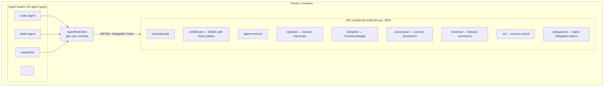
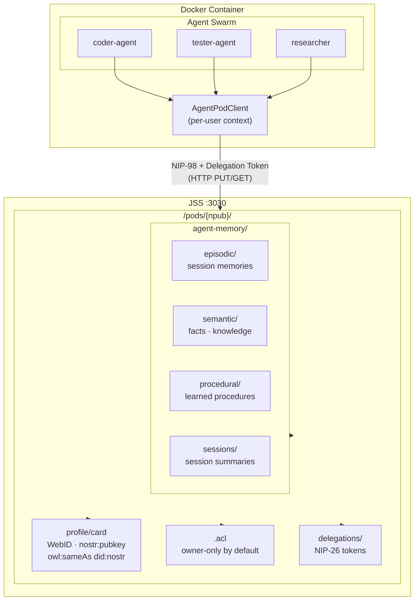
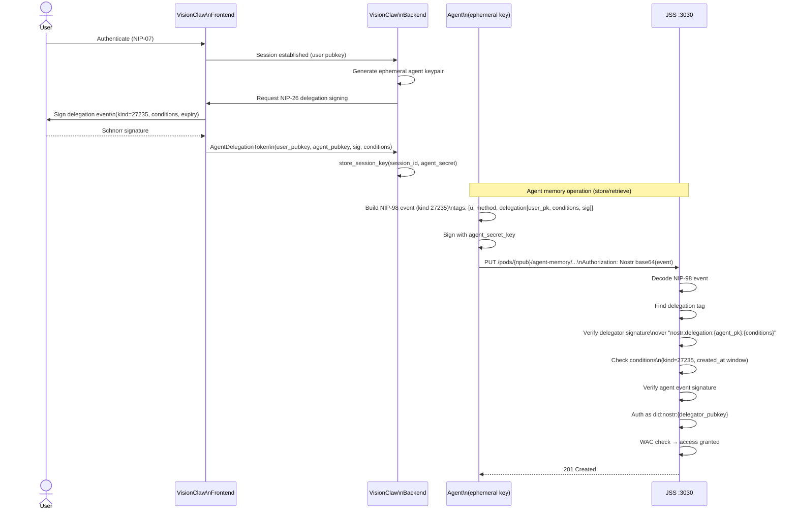

# User-Agent Pod Architecture Design

## Problem Statement

Agents run in a shared Docker container but need to read/write to user-specific Solid pods.
Each user authenticates via Nostr (npub), and their agent memories should be:
1. Owned by the user (stored in their pod)
2. Accessible by agents acting on their behalf
3. Isolated from other users' data

## Architecture Overview



*Component diagram showing the per-user Solid Pod directory structure, resources, and ACL layout within JSS.*

%%{init: {'theme': 'base', 'themeVariables': {'primaryColor': '#4A90D9', 'primaryTextColor': '#fff', 'lineColor': '#2C3E50'}}}%%


## Authentication Flow

### Option A: NIP-26 Delegation (Recommended)

User delegates signing authority to a session-scoped agent key.

```
1. User authenticates to VisionClaw (NIP-07)
2. VisionClaw generates ephemeral agent keypair
3. User signs NIP-26 delegation: "I delegate {agent_pubkey} until {expiry}"
4. Agents use delegated key to sign NIP-98 requests to JSS
5. JSS validates delegation chain, grants access as user
```

*Sequence diagram showing the NIP-26 delegation flow — from user key delegation through agent-signed NIP-98 requests to JSS access granted as the delegating user.*

%%{init: {'theme': 'base', 'themeVariables': {'primaryColor': '#4A90D9', 'primaryTextColor': '#fff', 'lineColor': '#2C3E50'}}}%%


### Option B: WAC + Server Proxy

User grants server ACL access, server proxies with user identity.

```
1. User authenticates to VisionClaw (NIP-07)
2. User's pod has ACL granting visionclaw-server read/write
3. Agents call VisionClaw backend with user session
4. Backend proxies to JSS with X-On-Behalf-Of header
5. JSS checks ACL, allows access
```

## Pseudocode

### 1. User Pod Provisioning

```pseudocode
FUNCTION provision_user_pod(user_npub: string) -> PodInfo:
    pod_path = "/pods/" + user_npub + "/"

    # Check if pod exists
    IF NOT pod_exists(pod_path):
        # Create pod container
        create_container(pod_path)

        # Create WebID profile linking Nostr identity
        profile = {
            "@context": ["https://www.w3.org/ns/solid/terms"],
            "@id": pod_path + "profile/card#me",
            "@type": "foaf:Person",
            "solid:oidcIssuer": "did:nostr:" + npub_to_hex(user_npub),
            "nostr:pubkey": npub_to_hex(user_npub)
        }
        write_resource(pod_path + "profile/card", profile)

        # Create agent-memory structure
        FOR memory_type IN ["episodic", "semantic", "procedural", "sessions"]:
            create_container(pod_path + "agent-memory/" + memory_type + "/")

        # Set default ACL (owner only)
        acl = generate_owner_acl(user_npub)
        write_resource(pod_path + ".acl", acl)

        # Create delegations container
        create_container(pod_path + "delegations/")

    RETURN PodInfo(path=pod_path, webid=pod_path + "profile/card#me")
```

### 2. Agent Delegation Token

```pseudocode
STRUCT AgentDelegationToken:
    user_pubkey: string          # User's Nostr hex pubkey
    agent_pubkey: string         # Ephemeral agent key
    delegated_kinds: int[]       # Allowed event kinds [27235] for HTTP auth
    valid_until: timestamp       # Expiration
    conditions: string           # Query string conditions
    signature: string            # User's signature over delegation

FUNCTION create_agent_delegation(
    user_secret_key: string,     # From NIP-07 or stored
    session_id: string,
    validity_hours: int = 24
) -> AgentDelegationToken:

    # Generate ephemeral agent keypair
    agent_keypair = generate_nostr_keypair()

    # Build NIP-26 delegation string
    conditions = "kind=27235&created_at>" + now() + "&created_at<" + (now() + hours(validity_hours))
    delegation_string = "nostr:delegation:" + agent_keypair.pubkey + ":" + conditions

    # User signs the delegation
    signature = schnorr_sign(user_secret_key, sha256(delegation_string))

    token = AgentDelegationToken(
        user_pubkey = derive_pubkey(user_secret_key),
        agent_pubkey = agent_keypair.pubkey,
        delegated_kinds = [27235],
        valid_until = now() + hours(validity_hours),
        conditions = conditions,
        signature = signature
    )

    # Store agent secret key securely for this session
    store_session_key(session_id, agent_keypair.secret_key)

    RETURN token
```

### 3. Agent Pod Client

```pseudocode
CLASS AgentPodClient:
    user_npub: string
    delegation_token: AgentDelegationToken
    agent_secret_key: string
    jss_base_url: string

    CONSTRUCTOR(user_npub: string, session_id: string):
        self.user_npub = user_npub
        self.jss_base_url = env("JSS_URL", "http://jss:3030")

        # Load delegation for this session
        self.delegation_token = load_delegation(session_id)
        self.agent_secret_key = load_session_key(session_id)

        # Ensure pod exists
        provision_user_pod(user_npub)

    FUNCTION sign_request(method: string, url: string, payload_hash: string?) -> string:
        # Create NIP-98 event using DELEGATED key
        event = {
            "kind": 27235,
            "created_at": now(),
            "tags": [
                ["u", url],
                ["method", method],
                ["delegation",
                    self.delegation_token.user_pubkey,
                    self.delegation_token.conditions,
                    self.delegation_token.signature
                ]
            ],
            "content": ""
        }

        IF payload_hash:
            event.tags.push(["payload", payload_hash])

        # Sign with AGENT key (delegated authority)
        event.pubkey = self.delegation_token.agent_pubkey
        event.id = calculate_event_id(event)
        event.sig = schnorr_sign(self.agent_secret_key, event.id)

        RETURN "Nostr " + base64_encode(json_encode(event))

    FUNCTION store_memory(memory_type: string, memory: Memory) -> Result:
        path = "/pods/" + self.user_npub + "/agent-memory/" + memory_type + "/" + memory.id + ".jsonld"
        url = self.jss_base_url + path

        body = memory.to_jsonld()
        auth_header = self.sign_request("PUT", url, sha256(body))

        response = http_put(url, body, {
            "Authorization": auth_header,
            "Content-Type": "application/ld+json"
        })

        RETURN response.ok

    FUNCTION retrieve_memories(memory_type: string, query: Query?) -> Memory[]:
        path = "/pods/" + self.user_npub + "/agent-memory/" + memory_type + "/"
        url = self.jss_base_url + path

        auth_header = self.sign_request("GET", url, null)

        response = http_get(url, {
            "Authorization": auth_header,
            "Accept": "application/ld+json"
        })

        IF NOT response.ok:
            RETURN []

        container = parse_jsonld(response.body)
        memories = []

        FOR resource_url IN container.contains:
            memory_response = http_get(resource_url, {
                "Authorization": self.sign_request("GET", resource_url, null),
                "Accept": "application/ld+json"
            })
            IF memory_response.ok:
                memories.push(Memory.from_jsonld(memory_response.body))

        RETURN filter_by_query(memories, query)
```

### 4. Agent Context Injection

```pseudocode
# In claude-flow hooks or agent spawning

FUNCTION spawn_agent_with_user_context(
    agent_type: string,
    user_npub: string,
    session_id: string,
    task: Task
) -> Agent:

    # Create or load delegation for this user/session
    IF NOT delegation_exists(session_id):
        # This requires user interaction (NIP-07 signing)
        delegation = request_user_delegation(user_npub, session_id)
        store_delegation(session_id, delegation)

    # Create pod client for this user
    pod_client = AgentPodClient(user_npub, session_id)

    # Inject into agent context
    agent_context = {
        "user_npub": user_npub,
        "session_id": session_id,
        "pod_client": pod_client,
        "memory": {
            "store": pod_client.store_memory,
            "retrieve": pod_client.retrieve_memories
        }
    }

    # Spawn agent with context
    agent = spawn_agent(agent_type, task, agent_context)

    RETURN agent
```

### 5. JSS Delegation Validation

```pseudocode
# In JSS auth middleware (src/auth/nostr.js)

FUNCTION validate_delegated_nip98(auth_header: string, request: Request) -> AuthResult:
    event = decode_nip98_event(auth_header)

    # Check for delegation tag
    delegation_tag = find_tag(event.tags, "delegation")

    IF delegation_tag:
        delegator_pubkey = delegation_tag[1]
        conditions = delegation_tag[2]
        delegator_sig = delegation_tag[3]

        # Verify delegation signature
        delegation_string = "nostr:delegation:" + event.pubkey + ":" + conditions
        IF NOT verify_signature(delegator_pubkey, sha256(delegation_string), delegator_sig):
            RETURN AuthResult.error("Invalid delegation signature")

        # Verify conditions are met
        IF NOT check_conditions(conditions, event):
            RETURN AuthResult.error("Delegation conditions not met")

        # Verify the event signature (by delegatee/agent)
        IF NOT verify_signature(event.pubkey, event.id, event.sig):
            RETURN AuthResult.error("Invalid event signature")

        # Auth succeeds AS THE DELEGATOR (user), not the agent
        RETURN AuthResult.success(
            identity = "did:nostr:" + delegator_pubkey,
            delegated_by = event.pubkey
        )
    ELSE:
        # Regular NIP-98 validation (no delegation)
        RETURN validate_standard_nip98(event, request)
```

## File Structure

```
project/
├── src/
│   ├── services/
│   │   └── agent_pod_service.rs       # Rust backend pod management
│   └── utils/
│       └── nip26.rs                   # NIP-26 delegation utilities
├── client/
│   └── src/
│       └── services/
│           └── AgentDelegationService.ts  # Frontend delegation creation
├── JavaScriptSolidServer/
│   └── src/
│       └── auth/
│           └── nostr-delegation.js    # Delegated NIP-98 validation
├── multi-agent-docker/
│   └── hooks/
│       └── agent-pod-context.js       # Hook to inject pod client
└── tests/
    └── agent-pod/
        ├── delegation.test.ts         # Delegation creation/validation
        ├── pod-provisioning.test.ts   # Pod creation tests
        └── agent-memory.test.ts       # Memory store/retrieve tests
```
