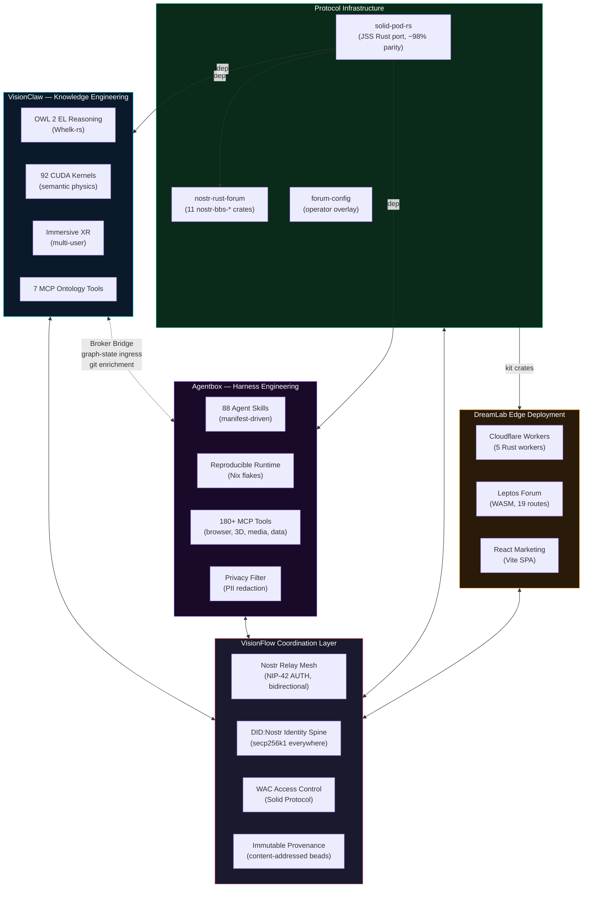
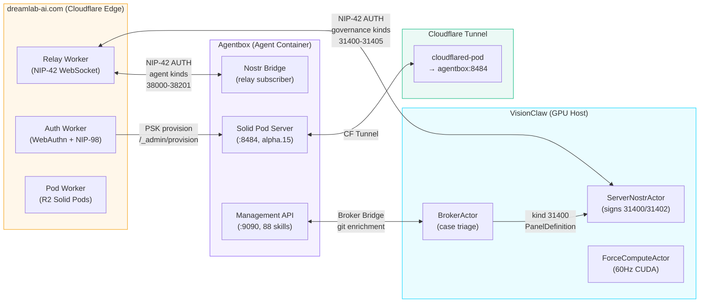
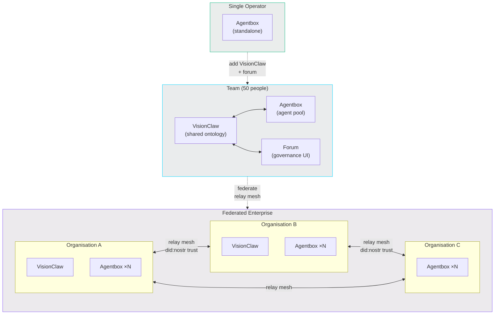

# VisionFlow — Coordination Engineering at Scale

VisionFlow is the distributed coordination platform that emerges when VisionClaw, Agentbox, the Nostr+Solid protocol layer, and the DreamLab forum mesh together. No single repository *is* VisionFlow — it is the coordination layer binding five independent systems into a platform for solving hard problems with distributed human and AI intelligence.

## The Problem

Hard problems — climate modelling, drug discovery, organisational transformation, creative production at scale — share a common shape: they require diverse intelligence (human intuition, domain expertise, machine pattern recognition, formal reasoning) to collaborate across trust boundaries, at scales that defeat centralised coordination.

Existing approaches fail in predictable ways:

- **Centralised AI platforms** scale tokens but not trust. One vendor, one failure mode, one billing relationship.
- **Agent frameworks** scale tasks but not governance. Fast and broken is still broken.
- **Knowledge management tools** scale information but not reasoning. More data doesn't mean better decisions.
- **Collaboration platforms** scale communication but not coordination. More Slack channels don't solve alignment.

VisionFlow solves all four simultaneously because the substrate handles identity, provenance, access control, and semantic reasoning as first-class architectural primitives — not bolted-on features.

## Five Substrates, One Identity

Every actor — human, agent, server, worker — is identified by a single secp256k1 keypair expressed as `did:nostr:<hex-pubkey>`. This identity is:

- **Verified at the relay** via NIP-42 AUTH challenge-response
- **Verified at every HTTP request** via NIP-98 Schnorr signatures (URL + method + body hash binding)
- **Evaluated against WAC ACLs** on every Solid pod read/write
- **Embedded in every provenance bead** as the event author
- **Resolvable as a DID Document** at `/.well-known/did.json`

No shared session store. No token exchange between tiers. The cryptographic primitive is the coordination primitive.

## Substrate Roles

### VisionClaw — Knowledge Engineering

The shared semantic substrate where humans and agents reason together. VisionClaw ingests knowledge, applies OWL 2 EL formal reasoning, renders it as a navigable 3D space, and exposes it to agents through MCP tools. Its unique contribution to the coordination layer:

- **Shared ontology** — agents and humans work against the same formal vocabulary. "Deliverable" means the same thing to a Creative Production agent and a Governance agent.
- **GPU-accelerated sense-making** — semantic forces make related concepts cluster visually. Humans see patterns; agents traverse them algorithmically.
- **Judgment Broker** — the human-in-the-loop governance surface. Agents publish control panels (kind 31400); humans approve/reject via signed Nostr events (kind 31403).
- **Immutable provenance** — every reasoning chain traces back through content-addressed beads to source evidence.

### Agentbox — Harness Engineering

The reproducible, hardened runtime for sovereign AI agents. Agentbox provides the container, the tools, the identity, and the privacy guarantees. Its unique contribution:

- **Manifest-driven reproducibility** — one `agentbox.toml`, one Nix flake, byte-for-byte identical containers. No `npm install` at runtime.
- **Sovereign data stack** — every agent action is stamped with a `did:nostr` identity and stored in an embedded Solid pod. The agent owns its data cryptographically.
- **Five-slot adapter architecture** — swap between standalone (SQLite, local JSONL) and federated (PostgreSQL pgvector, VisionClaw beads) by editing TOML. No recompilation.
- **Privacy filter** — every persistent write passes through a 1.5B-parameter MoE model that redacts PII before it reaches storage.
- **180+ tools** — browser automation, 3D modelling, geospatial analysis, media processing, data science — all delivered as Nix packages, gated by manifest flags.

### Protocol Infrastructure — Identity and Provenance

The Nostr+Solid layer provides the binding protocols that make coordination possible across trust boundaries:

- **solid-pod-rs** — the cryptographic foundation. Rust port of JSS (~98% parity). Provides LDP containers, WAC access control, DID:Nostr resolution, NIP-98 auth, HTTP 402 Web Ledger micropayments. Compiles to both native (Tokio) and WASM (CF Workers) targets via the `core` feature flag.
- **nostr-rust-forum** — the forum kit. 11 `nostr-bbs-*` crates implementing passkey-first auth (WebAuthn PRF → HKDF → secp256k1), zone-based access control, governance event routing, and the Agent Control Surface Protocol (kinds 31400-31405).
- **forum-config** — the operator overlay. Identity roster, trust thresholds, feature flags, payment configuration. The single source of truth for who can do what in a given deployment.

### DreamLab Edge — Branded Deployment

The user-facing surface: React marketing site, Leptos WASM forum, and five Cloudflare Workers. Consumes the protocol infrastructure as library crates. Demonstrates the VisionFlow architecture at production scale on dreamlab-ai.com.

## Coordination Topology

### Cross-Substrate Event Kinds

| Kind Range | Owner | Purpose |
|---|---|---|
| 1, 4, 42 | Forum users | Text notes, DMs, channel messages |
| 27235 | Any authenticated actor | NIP-98 HTTP auth tokens |
| 30001 | VisionClaw | Provenance beads (content-addressed) |
| 30910-30916 | Forum admins | Moderation (ban, mute, warning, report) |
| 31400-31405 | Registered agents | Agent Control Surface (panel, state, action, response) |
| 38000-38201 | Agentbox agents | Agent intent, job estimates, settlements |

### Two-Tier Pod Architecture

| Tier | Host | Storage | Git | Provisioning | Identity |
|---|---|---|---|---|---|
| **CF Workers** | Cloudflare edge | R2 + KV | No (runtime limitation) | Auto at registration | Same `did:nostr` |
| **Native (Agentbox)** | Docker + CF Tunnel | Host filesystem | Yes (`/_git/<pk>/`) | Admin PSK via auth-worker | Same `did:nostr` |

Both tiers verify NIP-98 independently. Same passkey-derived keypair authenticates to both. No shared session store, no token exchange. The identity is portable because the cryptographic primitive is portable.

## Scaling Model

VisionFlow scales along three axes simultaneously:

### Token Efficiency (Single Operator)

One agentbox in standalone mode. Local SQLite beads, local Solid pod, local JSONL events. 88 skills available, 180+ tools, privacy filter active. A single operator solving tasks with AI agents — token-efficient because the agent has sovereign tools, persistent memory, and doesn't need to rediscover context each session.

**Cost profile:** One API key. One container. Minutes to deploy.

### Governed Collaboration (Team)

VisionClaw + forum + agentbox on a shared relay mesh. The ontology provides shared vocabulary. The Judgment Broker provides human oversight. Agents publish control panels; humans approve actions. Every mutation passes through a GitHub PR. Every agent decision traces back through provenance beads.

**Cost profile:** One GPU host (VisionClaw), one agent container (agentbox), Cloudflare Workers (forum). 50-person team validated at DreamLab.

### Federated Intelligence (Enterprise / Cross-Organisation)

Multiple agentbox instances federated via the Nostr relay mesh. Governance event kinds (31400-31405) propagate across substrates. Each node is independently hardened (Nix reproducible, read-only filesystem, capability-dropped, seccomp-profiled). Nodes trust each other via `did:nostr` identity verification, not network topology.

**Cost profile:** Horizontal. Add nodes. Each node is sovereign — it owns its data, controls its agents, sets its trust thresholds. The mesh coordinates; no node controls.

## Why This Architecture

### Platform Agnostic

solid-pod-rs compiles to both native Rust (Tokio) and WASM (Cloudflare Workers). The same crate powers edge pods on R2 and native pods on host filesystems. Agents run in Nix containers on any Linux host. The forum runs on CF Workers. VisionClaw runs on any CUDA-capable machine. No vendor lock-in at any layer.

### Self-Sovereign Data

Every actor owns a Solid pod. WAC ACLs — evaluated against `did:nostr` identities — control access. The pod is the canonical data store; the relay mesh is the coordination transport. If an organisation leaves the mesh, it takes its data with it. No migration. No export. The data was always theirs.

### Provenance by Construction

Every write is signed. Every event is content-addressed. Every governance decision is an immutable Nostr event with a `prior_decision_id` provenance chain. Auditors traverse the chain from any point back to first principles. This isn't an audit log — it's a structural guarantee.

### Governance as an Accelerant

The Judgment Broker isn't a bottleneck — it's a filter that lets everything else move faster. When agents know their authority boundary and can surface exceptions cleanly, the 90% of decisions that don't need human judgment flow without friction. The 10% that do get clean, contextualised escalation with full provenance.

## Repository Map

| Repository | Role | Key Technology |
|---|---|---|
| [VisionClaw](https://github.com/DreamLab-AI/VisionClaw) | Knowledge engineering substrate | OWL 2 EL, 92 CUDA kernels, multi-user XR, 7 MCP tools |
| [Agentbox](https://github.com/DreamLab-AI/agentbox) | Harness engineering runtime | Nix flakes, 88 skills, 180+ tools, sovereign Solid pods |
| [solid-pod-rs](https://github.com/DreamLab-AI/solid-pod-rs) | Cryptographic foundation | JSS Rust port, DID:Nostr, WAC, Web Ledgers, HTTP 402 |
| [nostr-rust-forum](https://github.com/DreamLab-AI/nostr-rust-forum) | Forum kit | 11 crates, passkey auth, governance event routing |
| [dreamlab-ai-website](https://github.com/DreamLab-AI/dreamlab-ai-website) | Branded deployment | React SPA, WASM forum, operator overlay |

## Wardley Map

The following Wardley map positions VisionFlow's components along the value chain (visibility to the user) and evolution axis (genesis → custom → product → commodity). It illustrates why certain layers are custom-built (semantic physics, ontology reasoning, governance protocol) while others leverage commodity infrastructure (Cloudflare, CUDA, WebSocket).

Key observations:

- **Identity and provenance** sit in the custom-built zone — `did:nostr` and content-addressed beads are novel protocol primitives, not yet commoditised.
- **Agent runtime** (Agentbox) occupies the product space — reproducible containers and tool orchestration are maturing but not yet commodity.
- **GPU compute and relay infrastructure** are approaching commodity — CUDA kernels and WebSocket relays are well-understood engineering, differentiated only by domain-specific application.
- **The coordination layer** (VisionFlow itself) is genesis — no existing platform combines formal reasoning, sovereign identity, and agent governance at this architectural level.

## Upstream

VisionFlow's protocol layer is built on [Melvin Carvalho](https://github.com/melvincarvalho)'s [JavaScriptSolidServer (JSS)](https://github.com/JavaScriptSolidServer/JavaScriptSolidServer) and [DID:Nostr](https://github.com/nicholasgasior/did-nostr). JSS is the AGPL-3.0 reference implementation of the Solid Protocol and the canonical source for the feature set, protocol extensions, and Web Ledger micropayment system. solid-pod-rs is a Rust port; protocol-level decisions defer to the upstream JSS repository. See [MAINTAINERS.md](../../MAINTAINERS.md).
