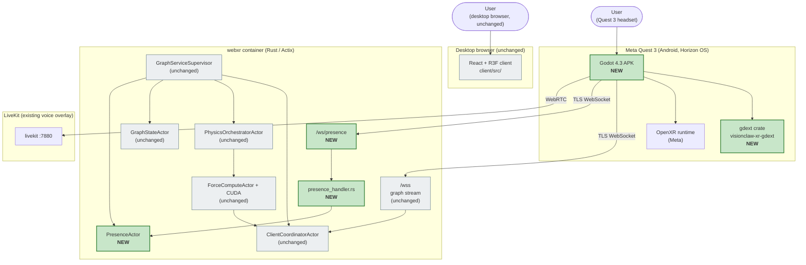
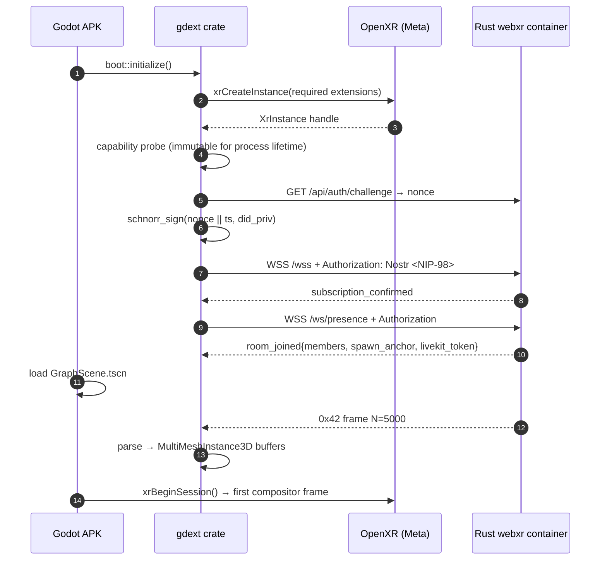
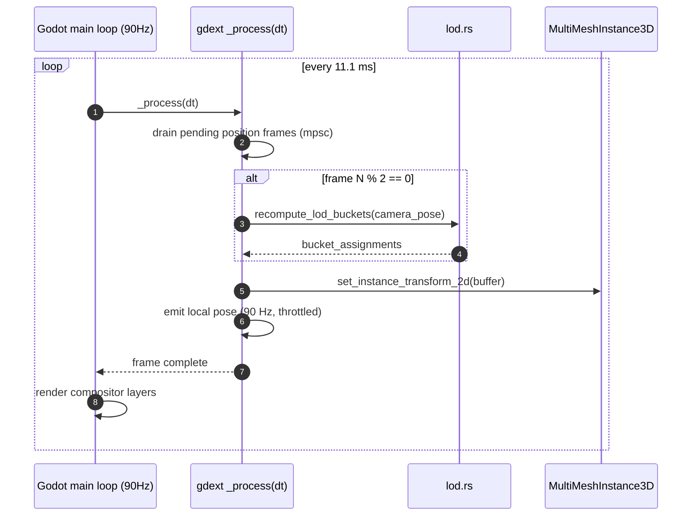

# VisionClaw XR Architecture

> **Architectural decision.** VisionClaw's XR client is a **native Meta Quest 3
> APK** built from a **Godot 4.3** project, with performance-critical paths
> implemented in **Rust via godot-rust (gdext)** and runtime XR access through
> **OpenXR**. Multi-user presence rides a new **`/ws/presence`** WebSocket
> served by a Rust `PresenceActor`; the existing 28 B/node binary position
> stream (per [ADR-061](../adr/ADR-061-binary-protocol-unification.md)) is
> consumed unchanged. Voice continues to ride **LiveKit** (Android AAR on the
> headset; HRTF spatialised in the Godot audio bus).
>
> **Predecessor.** The prior browser-hosted WebXR client is removed wholesale
> per [PRD-008](../PRD-008-xr-godot-replacement.md) and
> [ADR-071](../adr/ADR-071-godot-rust-xr-replacement.md); both documents
> reference the file-by-file removal manifest. The browser entry point is
> gone. Quest 3 users side-load `visionclaw-xr.apk`; non-XR users continue
> to use the desktop browser graph view (unchanged).

---

## 1. Why a native APK

The browser-hosted WebXR client could not deliver the headline experience on
the headline device, for five structural reasons documented in PRD-008 §1:

1. **Silent-fail multi-user coupling** — the prior world-server detector was
   hard-coded against `ws://localhost:3020`; users entered "VR" against a stub.
2. **Two competing renderers** — separate immersive and fallback render trees;
   identity, scene graph, and input pipelines duplicated.
3. **JS/PostgreSQL multi-user against a Rust substrate** — the prior world
   server owned its own entity store in its own Postgres; VisionClaw's
   authoritative graph state lives in Neo4j + RuVector + `GraphStateActor`.
   Two sources of truth.
4. **WebXR feature ceiling on Quest 3** — no scene mesh, no spatial anchors,
   no FB passthrough composition layer, no foveated-rendering hints; JS GC in
   the render loop competing with the WebXR compositor for an 11.1 ms budget.
5. **The reach we actually have is Quest Browser** — Safari has no WebXR; the
   "browser-universal" justification was never real.

The native APK lifts the ceiling: full OpenXR extension surface, no JS GC,
Rust-substrate alignment, and the same 28 B/node binary protocol the desktop
client speaks. See
[ADR-071](../adr/ADR-071-godot-rust-xr-replacement.md) for the full decision
analysis (six options considered).

---

## 2. System view



The five highlighted components are the entire server-side surface area of
this work. Neo4j, the GPU physics pipeline, the broadcast optimiser, the
desktop client, and the LiveKit voice overlay are consumed as-is.

---

## 3. Repository layout

```
xr-client/                              Godot 4.3 project (NEW)
├── project.godot
├── scenes/
│   ├── XRBoot.tscn                    OpenXR init, capability probe, error overlay
│   ├── GraphScene.tscn                MultiMeshInstance3D nodes + ImmediateMesh edges
│   ├── AvatarRig.tscn                 Head + 2 hands + nameplate (one per remote user)
│   ├── LocalRig.tscn                  XROrigin3D + XRCamera3D + XRController3D x2
│   └── HUD.tscn                       Settings, room picker, mute, debug overlay
├── scripts/                           GDScript: scene wiring, signal dispatch, UI
├── addons/
│   ├── visionclaw_xr_gdext/           Compiled gdext .so, packaged with the APK
│   └── livekit/                       LiveKit Android AAR + binding shim
├── export_presets.cfg                 Quest 3 export preset (arm64-v8a, OpenXR)
└── android/                           Custom Gradle template (NDK r26+)

crates/
├── visionclaw-xr-gdext/               gdext crate (NEW) — APK hot paths
│   └── src/{lib,protocol_decoder,presence_client,pose_validator,lod,perf_tap}.rs
├── visionclaw-xr-presence/            Server presence crate (NEW)
│   └── src/{lib,room,pose_validator,messages,auth}.rs
└── binary-protocol/                   (extracted per PRD-007) — workspace member

src/
├── handlers/presence_handler.rs       Actix WS handler at /ws/presence (NEW)
└── actors/presence_actor.rs           Wires into GraphServiceSupervisor (NEW)
```

The desktop browser tree (`client/src/` non-`immersive/`) is untouched. The
prior immersive and world-server-bridge trees are deleted per the removal
plan referenced by [PRD-008 §5.6](../PRD-008-xr-godot-replacement.md) and
[ADR-071](../adr/ADR-071-godot-rust-xr-replacement.md).

---

## 4. gdext modules (Godot ↔ Rust split)

The split is deliberate:

- **GDScript** owns scene composition, signal wiring, UI state, OpenXR
  feature toggles, and scene-graph manipulation in response to gdext
  signals. **No** wire-format parsing, **no** WebSocket state, **no** pose
  validation.
- **gdext (Rust)** owns protocol decode, WS lifecycle, NIP-98 auth, pose
  validation, LOD math, and perf taps. Exposed to GDScript via
  `#[derive(GodotClass)]` classes that emit signals to the scene tree.

The shared `crates/visionclaw-xr-presence` library is **transport-agnostic**
— it is consumed by both the gdext crate (on the APK) and
`presence_actor.rs` (on the server). Wire-level pose semantics cannot drift
between client and server because both link the same encoder.

---

## 5. Boot sequence



Graph WS connects before presence WS — graph state is the load-bearing
context. Presence is allowed to fail without aborting boot; the user enters
a single-user session and a yellow indicator appears in the HUD. Cold-launch
to first immersive frame: **≤ 3 s** on warm cache (PRD-008 M2).

---

## 6. Frame loop

Quest 3 target: 90 Hz steady state. Render loop splits between Godot's main
loop and the gdext per-frame Rust callback.



LOD recomputation is **every 2 frames** to keep CPU under 8 ms. Bucket
assignments are diffed; only changed instances incur a transform write. If
the local user is stationary (head pose Δ < 1 cm and quaternion dot >
0.9999) the frame is dropped server-side by the delta encoder — bandwidth
stays near zero for AFK users.

---

## 7. Binary protocol — reuse and extension

[ADR-061](../adr/ADR-061-binary-protocol-unification.md) fixes the per-frame
node size at **28 bytes** and forbids version negotiation. The Godot client
consumes the same position stream byte-for-byte. The avatar pose frame is
added **as a sibling opcode** dispatched on the existing WS endpoint by
preamble byte — not a version bump.

### 7.1 Opcode dispatch

| Preamble | Opcode | Sender | Description | Spec |
|---|---|---|---|---|
| `0x42` | position_frame | server → all subscribed clients | 28 B/node position + velocity | [`docs/binary-protocol.md`](../binary-protocol.md) |
| `0x50` | avatar_pose_frame | bidirectional, presence-room scoped | Head + hand transforms at 90 Hz | [PRD-008 §5.2](../PRD-008-xr-godot-replacement.md) |

Future opcodes (e.g. spatial annotations) do not break existing clients —
the dispatch table treats unknown opcodes as a logged drop, not a
connection close.

### 7.2 Avatar pose frame layout

Per `AvatarPose` (76 bytes fixed):

```
[u32 user_id_LE]                                         room-local id, server-bound
[f32 head_x][f32 head_y][f32 head_z]                     12 B head position
[f32 head_qx][f32 head_qy][f32 head_qz][f32 head_qw]     16 B head orientation (quat)
[f32 lhand_x][f32 lhand_y][f32 lhand_z]                  12 B left hand position
[f32 lhand_qx][f32 lhand_qy][f32 lhand_qz][f32 lhand_qw] 16 B left hand orientation
[f32 rhand_x][f32 rhand_y][f32 rhand_z]                  12 B right hand position
[f32 rhand_qx][f32 rhand_qy][f32 rhand_qz][f32 rhand_qw] 16 B right hand orientation
                                                           = 76 B per avatar
```

Steady-state per-avatar wire cost: 76 B × 90 Hz ≈ 6.8 KB/s. A 4-user room
broadcasts ~27 KB/s of pose to each participant.

---

## 8. Presence service

`PresenceActor` joins the `GraphServiceSupervisor` tree as a sibling of
`GraphStateActor` and `PhysicsOrchestratorActor`. Per-room state is
in-memory; an optional audit-trail RuVector entry is written per
join/leave/kick if `PRESENCE_AUDIT=true`. Room membership does not survive
a server restart.

`src/handlers/presence_handler.rs` mounts at `/ws/presence`:

1. **Auth on upgrade.** Inspect `Authorization: Nostr <NIP-98 token>`.
   Verify Schnorr signature against claimed `did:nostr:<hex-pubkey>`.
   On failure → HTTP 401, no upgrade. The pubkey is bound to the socket;
   mid-session impersonation is impossible.
2. **Init handshake.** First post-upgrade message is JSON
   `presence_init { room_id, display_name }`. Server replies with
   `presence_room_state`, establishing the `user_id ↔ did:nostr` mapping.
3. **Pose ingest.** Inbound `0x50` frames are decoded via the
   `binary-protocol` crate, validated by `pose_validator`, then forwarded
   to `PresenceActor`.
4. **Broadcast.** `PresenceActor` coalesces in-flight poses per room at
   90 Hz, encodes one `0x50` frame containing all current members'
   latest pose (with a stale-flag bit for any member whose last pose is
   older than 200 ms), and sends to each subscribed socket **except** the
   sender.
5. **Visibility filter.** Re-broadcast respects [ADR-050](../adr/ADR-050-sovereign-graph-visibility.md)
   sovereign visibility — invisible avatars are dropped from the frame
   each receiver sees.

### 8.1 Pose validation

| Check | Bound | Action |
|---|---|---|
| Head position within world bounds | per-room (default ±50 m) | Drop frame, increment `presence.invalid_pose.bounds` |
| Head linear velocity | ≤ 20 m/s | Drop frame, increment `…head_velocity` |
| Hand-to-head distance | ≤ 1.2 m (anatomical reach) | Drop frame, increment `…hand_reach` |
| Quaternion magnitude | within [0.99, 1.01] | Drop frame, increment `…bad_quat` |
| Frame rate per user | ≤ 120 Hz averaged over 1 s | Token-bucket throttle |

A user accumulating > 5 invalid frames in a 10-s window is disconnected
with a `presence_kick` reason code.

---

## 9. OpenXR feature set

A missing **required** extension produces a fatal user-visible error;
there is no degraded mode.

| Feature | OpenXR ID | Required? |
|---|---|---|
| Hand tracking | `XR_EXT_hand_tracking` | required |
| Hand interaction | `XR_EXT_hand_interaction` | required |
| Passthrough | `XR_FB_passthrough` | required |
| Scene mesh | `XR_FB_scene` + `XR_FB_scene_capture` | required |
| Spatial anchors | `XR_FB_spatial_entity` + `XR_FB_spatial_entity_storage` | required |
| Foveated rendering | `XR_FB_foveation` + `XR_FB_foveation_configuration` | required |
| Composition layer depth | `XR_KHR_composition_layer_depth` | required |
| Performance settings | `XR_EXT_performance_settings` | required |
| Display refresh rate | `XR_FB_display_refresh_rate` | required |
| Local floor reference | `XR_EXT_local_floor` | required |
| Visibility mask | `XR_KHR_visibility_mask` | optional |
| Eye tracking | `XR_EXT_eye_gaze_interaction` | optional (Pro variants only; PII-gated) |

---

## 10. Voice routing

LiveKit is retained. Its Android AAR is exposed to Godot via a binding shim
in `addons/livekit/`. LiveKit room id is the same as the presence room id
(1:1). The auth token is minted by `src/handlers/livekit_token_handler.rs`
(no changes from the existing desktop voice path) and requested by gdext
over the existing HTTPS API at session start.

```
[Quest mic] -> AudioStreamMicrophone -> LiveKit AAR encoder (Opus) -> LiveKit room
                                                                          ^
[remote audio] <- LiveKit AAR decoder <- LiveKit room <-------------------/

Per remote track: AAR exposes a PCM stream to AudioStreamPlayer3D
positioned at the remote AvatarRig.HeadPivot. AudioServer applies HRTF
on the dedicated bus with attenuation_model = ATTENUATION_INVERSE_DISTANCE.
```

Bandwidth: Opus at 32 kbps mono (default); ~64 kbps wire cost per track
with redundancy. 4-user room ≈ 256 kbps voice — comfortably inside the
100 KB/s per-user network budget.

---

## 11. Performance budget

CI gates fail on any sustained breach.

| Resource | Budget |
|---|---|
| CPU per frame | 8 ms |
| GPU per frame | 8 ms |
| Draw calls | ≤ 50 |
| Triangles | ≤ 100 K |
| Allocations per frame | 0 in steady state |
| Network ingress | < 80 KB/s per user |
| Network egress | < 30 KB/s per user |
| Battery drain | < 12 %/hour |

Headline targets (PRD-008 G1–G3): **90 fps stable on Quest 3 with 5 K
visible nodes + 4 remote avatars, 99th-pct frame time ≤ 12 ms, MTP < 20 ms,
presence join < 500 ms p95.**

---

## 12. Failure modes and resilience

The XR client is more sensitive to transient failure than the desktop
client — losing positional tracking for 200 ms in VR is nauseating. The
state machines below degrade gracefully rather than crash or freeze.

| Failure | Behaviour |
|---|---|
| **WebSocket disconnect** | Exponential backoff 1 s → 30 s cap, 10 attempts. Last-received graph snapshot continues to render at 90 Hz so the compositor stays alive. After 5 failures, snapshot mode pauses pose tx; the HUD shows a reconnecting spinner. |
| **OpenXR runtime crash** (`XR_ERROR_INSTANCE_LOST`) | gdext flips to a 2D error overlay and tears down OpenXR. Restart requires a fresh APK launch — Meta's runtime owns process-wide GPU compositor resources. |
| **Voice failure** (LiveKit `RoomDisconnected`) | Non-fatal. Voice indicators hide; mic-off icon appears in HUD. Pose continues. LiveKit reconnect every 30 s. |
| **Packet-loss degradation** | Pose tx ladder per remote avatar: 90 Hz → 30 Hz (loss > 5%) → 10 Hz (loss > 15%) → snapshot-on-significant-change (loss > 30%). Recovery on the same thresholds in reverse. |

The full state-diagrams are in
[`docs/xr-godot-system-architecture.md` §11](../xr-godot-system-architecture.md).

---

## 13. Security baseline

Full STRIDE/DREAD analysis: [`docs/xr-godot-threat-model.md`](../xr-godot-threat-model.md).
Invariants this architecture relies on:

| Invariant | Threat ID |
|---|---|
| **NIP-98 challenge handshake** at WS upgrade; HTTP 401 fails closed; pubkey bound to socket | T-WS-1, T-WS-3 |
| **Server-bound avatar id** — client cannot select its own; any `user_id` in inbound pose is ignored | T-AVATAR-1 |
| **`validate_pose()` gate** — velocity ≤ 20 m/s, position within world AABB, hand reach ≤ 1.2 m, quat magnitude in [0.99, 1.01] | T-POSE-1, T-HAND-1 |
| **Rate limit** at 120 Hz/session via token bucket; per-room actor isolation prevents cross-room starvation | T-DOS-1 |
| **Frame format frozen** — additions require an ADR superseding ADR-061; enforced by `crates/binary-protocol/tests/frame_field_snapshot.rs` | T-PROTO-3 |
| **Scene mesh stays client-side** — gdext `XR_FB_scene` binding is `pub(crate)` only with no serialiser; CI lints reject `serde::Serialize` on scene-mesh types | T-PII-1 |
| **Eye tracking is opt-in** — default disabled; consent flow in `XRBoot.tscn`; gaze stays local | T-PII-2 |
| **Visibility filter** — same per-user rule that drops invisible nodes (ADR-050) drops invisible avatars; anonymous viewers cannot enumerate the room | (architectural) |
| **APK supply chain** — `cargo-deny` + `cargo-audit` in CI; SBOM per release; v3 APK signing; in-app About screen shows signing fingerprint | T-APK-1, T-APK-3 |

---

## 14. Migration map

The full removal manifest is referenced by [PRD-008 §5.6](../PRD-008-xr-godot-replacement.md)
and [ADR-071 §"Implementation Plan"](../adr/ADR-071-godot-rust-xr-replacement.md).
The wholesale removal of the prior browser-hosted XR stack
(`client/src/immersive/*`, world-server bridges and contexts, WebXR npm
deps, vendored world-server SDK, and the world-server compose file) lands
in a single cutover commit; the new layout is `xr-client/` (Godot project)
+ `crates/visionclaw-xr-gdext/` + `crates/visionclaw-xr-presence/` plus the
two new server files (`src/handlers/presence_handler.rs`,
`src/actors/presence_actor.rs`). The desktop browser path
(`client/src/` non-`immersive/`) is **untouched**.

---

## 15. Troubleshooting

| Symptom | Likely cause | Fix |
|---|---|---|
| APK fails to launch with OpenXR error | Missing required extension | Confirm Horizon OS ≥ 71; check `adb logcat -s visionclaw-xr` for the failing extension ID |
| Black screen after first frame | Graph WS not connected before XR session begin | Boot aborts XR begin if `graph_ws_ready` not signalled — check NIP-98 auth in logcat |
| 401 from `/wss` or `/ws/presence` | NIP-98 signature invalid or replayed nonce | Regenerate Nostr key; verify clock skew < 60 s; check `presence.auth.rejected` server counter |
| Remote avatars not appearing | Pose frames dropping validation | Inspect `presence.invalid_pose.*` counters; widen room policy thresholds for unusually tall users |
| Frame rate dips below 90 fps | LOD policy too permissive | Verify `lod.rs` is in Tier2Standalone bucket; enable `aggressive_culling`; reduce visible node count |
| Voice plays but is not spatial | `AudioStreamPlayer3D` not parented to remote `AvatarRig.HeadPivot` | Inspect `avatar_rig.gd::on_voice_track_attached`; confirm HRTF bus assigned |
| APK size exceeds 80 MB | Debug symbols not stripped from gdext `.so` | Add `strip xr-client/addons/visionclaw_xr_gdext/aarch64/*.so` to CI |
| Hand tracking does not detect pinch | Headset in controller mode | Quest Settings → Movement Tracking → Hand and Controller Tracking → Hand Tracking |

CI artefact capture: `adb logcat -d -s visionclaw-xr` is saved to
`xr-client/build/logs/run-<timestamp>.log` and uploaded to the GitHub
Actions run. Setup-time troubleshooting lives in
[`xr-setup-quest3.md`](../how-to/xr-setup-quest3.md).

---

## 16. See also

- [PRD-008 — XR Client Replacement](../PRD-008-xr-godot-replacement.md)
- [ADR-071 — Godot 4 + godot-rust + OpenXR](../adr/ADR-071-godot-rust-xr-replacement.md)
- [DDD: XR Godot Bounded Context](../ddd-xr-godot-context.md)
- [XR Godot System Architecture](../xr-godot-system-architecture.md) — authoritative deep-dive
- [XR Godot Threat Model](../xr-godot-threat-model.md)
- [Quest 3 APK Setup](../how-to/xr-setup-quest3.md)
- [Binary Protocol](../binary-protocol.md) — wire format, opcode registry
- [ADR-061 — Binary Protocol Unification](../adr/ADR-061-binary-protocol-unification.md)
- [Client Architecture](client-architecture.md) — desktop React Three Fiber graph view (unchanged)
