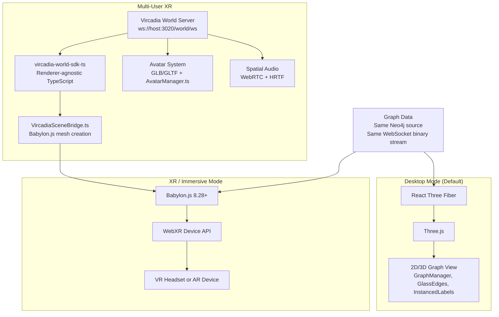
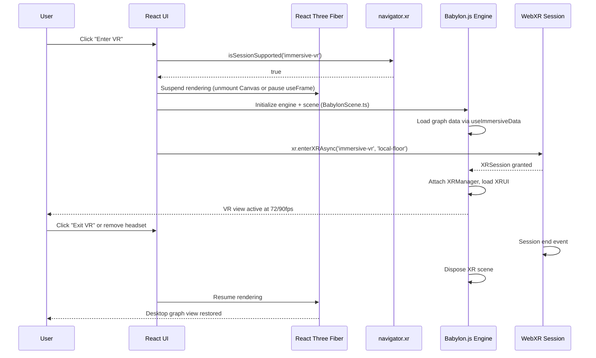
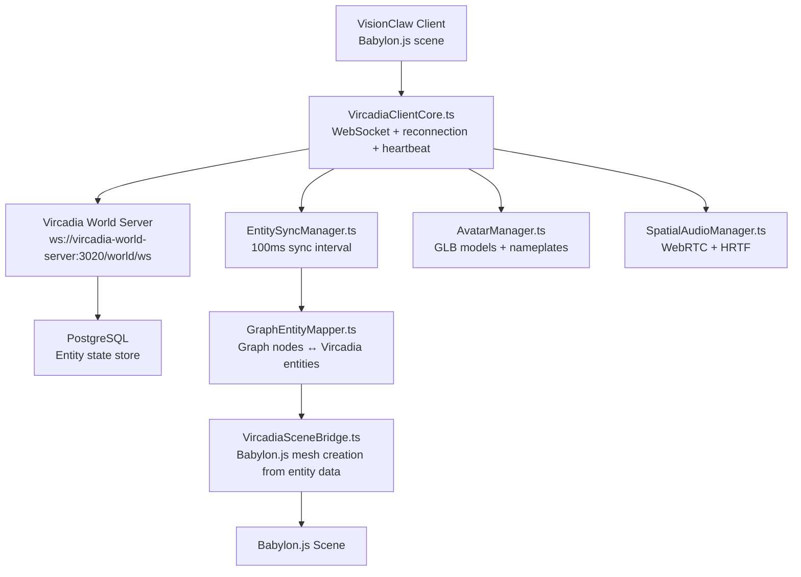
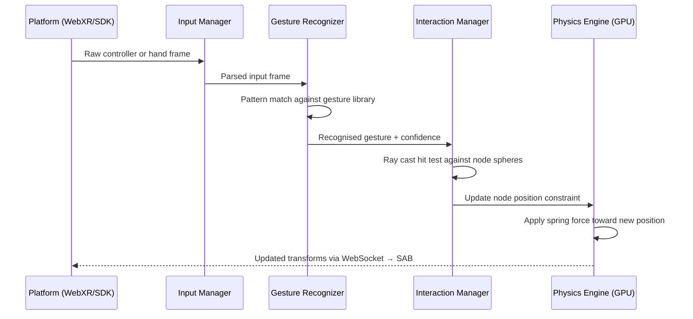
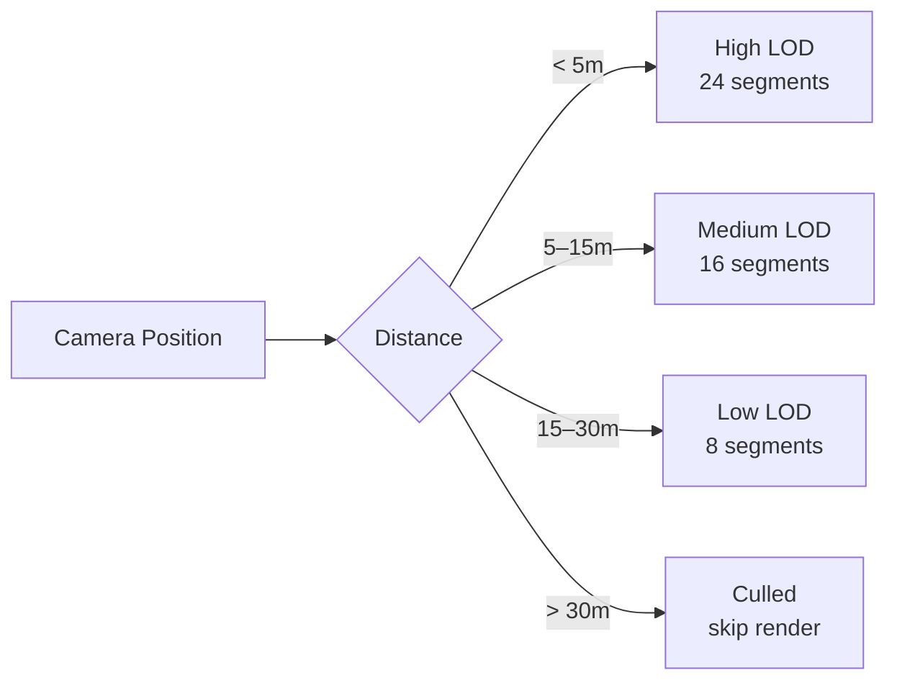

# VisionClaw XR/VR Immersive Architecture

## Architectural Decision: Babylon.js for All XR Modes

**VisionClaw uses Babylon.js for XR and immersive modes. React Three Fiber (Three.js) is used exclusively for the desktop graph view.**

This is a definitive architectural position established during the Vircadia integration and renderer consolidation analysis. The rationale:

1. **Native WebXR support.** Babylon.js provides `WebXRExperienceHelper`, built-in `WebXRHandTracking`, `WebXRMotionControllerTeleportation`, and `WebXRController` without polyfills. Three.js requires a WebXR polyfill and manual implementation of hand tracking.
2. **Quest 3 optimisation.** Babylon.js has WASM-accelerated physics, foveated rendering hooks, and a guardian-system integration that match Quest 3's 90fps requirements. The `Quest3Optimizer.ts` module was written specifically against Babylon.js APIs.
3. **Vircadia native alignment.** The Vircadia SDK (`vircadia-world-sdk-ts`) is renderer-agnostic (pure TypeScript, no 3D engine dependencies), and the existing `VircadiaSceneBridge.ts` creates Babylon.js meshes from Vircadia entity data. Rebuilding this bridge on Three.js would provide no benefit.
4. **XR UI layer.** Babylon.js `AdvancedDynamicTexture` provides a 3D GUI system used for in-headset control panels. The equivalent in Three.js requires third-party libraries.
5. **Desktop 3D graph stays on Three.js.** R3F's declarative component model and the existing instanced rendering pipeline (GraphManager, GlassEdges, InstancedLabels) are well-optimised for the desktop use case. There is no reason to migrate them.

The two renderers **coexist but do not overlap**: desktop mode renders via R3F; entering XR suspends R3F rendering and activates the Babylon.js scene.

---

## Two-Renderer Architecture



The Vircadia SDK has **no dependency on Three.js or Babylon.js**. Its `package.json` lists only `postgres`, `zod`, `lodash-es`, `jsonwebtoken`, and Vue utilities — no renderer. This is the technical proof that the SDK is renderer-agnostic and that any future renderer migration would require changing only `VircadiaSceneBridge.ts`.

---

## Babylon.js Client File Structure

```
client/src/immersive/
├── components/
│   └── ImmersiveApp.tsx          # Main XR entry point
├── babylon/
│   ├── BabylonScene.ts           # Babylon Engine + Scene setup
│   ├── XRManager.ts              # WebXRExperienceHelper wrapper
│   ├── GraphRenderer.ts          # Instanced graph rendering in Babylon
│   ├── DesktopGraphRenderer.ts   # Babylon desktop fallback (no WebXR)
│   ├── XRUI.ts                   # AdvancedDynamicTexture in-headset GUI
│   └── VircadiaSceneBridge.ts    # Vircadia entities → Babylon meshes
├── hooks/
│   ├── useImmersiveData.ts       # Graph data subscription for XR
│   ├── useVRConnectionsLOD.ts    # Distance-based LOD management
│   └── useVRHandTracking.ts      # Hand and controller state
└── threejs/
    ├── VRGraphCanvas.tsx          # R3F XR canvas (legacy path)
    ├── VRAgentActionScene.tsx     # Agent visualisation in VR
    ├── VRActionConnectionsLayer.tsx
    └── VRInteractionManager.tsx   # Node selection and dragging
```

The `threejs/` subdirectory under `immersive/` represents an earlier WebXR implementation using `@react-three/xr`. New XR feature development targets `babylon/`.

---

## Mode Switching: Desktop to XR



Quest 3 user-agent detection caps `devicePixelRatio` at **1.0** to prevent the render target from exceeding panel resolution and to keep the physics tick budget under 11ms:

```typescript
function getEffectiveDpr(): number {
  const isQuest = /Quest/i.test(navigator.userAgent);
  return isQuest ? Math.min(window.devicePixelRatio, 1.0) : window.devicePixelRatio;
}
```

A `?force=quest3` URL parameter bypasses user-agent detection for development testing.

---

## WebXR Setup

### Browser Requirements

| Browser | Minimum version | Notes |
|---------|----------------|-------|
| Chrome / Edge | 79+ | Full WebXR |
| Meta Quest Browser | Any | Primary target |
| Firefox Reality | Any | Supported |
| Safari | Not supported | No WebXR Device API |

### Session Initialisation

```typescript
import { WebXRFeatureName, WebXRExperienceHelper } from "@babylonjs/core";

async function setupXR(engine: Engine, scene: Scene) {
  const xr = new WebXRExperienceHelper(scene);
  await xr.baseExperience.enterXRAsync(
    "immersive-vr",
    "local-floor",
    xr.teleportation.locomotionType
  );

  // Hand tracking (Quest 3, Vision Pro)
  xr.baseExperience.featuresManager.enableFeature(
    WebXRFeatureName.HAND_TRACKING, "latest"
  );

  // Near interaction for in-space UI panels
  xr.baseExperience.featuresManager.enableFeature(
    WebXRFeatureName.NEAR_INTERACTION, "latest"
  );

  return xr;
}
```

### Supported Devices

| Device | Support level | Target frame rate |
|--------|--------------|-------------------|
| Meta Quest 3 | Full | 90fps |
| Meta Quest 2 / Pro | Full | 72fps (may need `aggressiveCulling: true`) |
| Apple Vision Pro | Via WebXR polyfill + RealityKit bridge | 90–120fps |
| HTC Vive / Valve Index | Via SteamVR + Babylon.js OpenVR adapter | 90fps |
| Windows Mixed Reality | Basic | 60fps |

### WebXR Fallback Chain

```typescript
async function initializeXR() {
  try {
    return await navigator.xr?.requestSession('immersive-vr', {
      requiredFeatures: ['local-floor'],
      optionalFeatures: ['hand-tracking'],
    });
  } catch {
    if (isMetaQuest()) return await initializeMetaNative();
    if (isVisionOS())  return await initializeVisionOSBridge();
    if (isSteamVR())   return await initializeOpenVR();
    // Final fallback: Babylon.js desktop renderer (no headset)
    return await initializeDesktopGraphRenderer();
  }
}
```

---

## Vircadia Multi-User Integration

### Architecture

Vircadia provides a multi-user virtual world server. VisionClaw registers as a world script and synchronises graph entities (nodes and edges) into Vircadia world-space. Users with Vircadia clients see the same knowledge graph as VisionClaw users.



### Graph–Entity Mapping

Each graph node becomes a Vircadia entity:

```
VisionClaw graph node (id, position, type, label)
    ↓ GraphEntityMapper.mapGraphToEntities()
Vircadia entity (uuid, worldPosition, modelUrl, properties)
    ↓ EntitySyncManager — 100ms batched SQL updates
Vircadia PostgreSQL
    ↓ EntitySyncManager → VircadiaSceneBridge
Babylon.js mesh at entity position
```

Entity synchronisation uses a 100ms update interval. Lowering this increases network traffic; raising it introduces noticeable lag in collaborative sessions.

### Avatar System

Each connected user is represented by an avatar with:
- Head mesh and eye gaze direction
- Left and right hand meshes (or controller representations)
- Name label above head
- Spatial voice volume indicator

```typescript
class UserAvatar {
  async updateFromNetworkState(state: UserState) {
    this.headMesh.position = state.headPosition;
    this.headMesh.rotationQuaternion = state.headRotation;
    this.leftHand.updatePoses(state.leftHandPoses);
    this.rightHand.updatePoses(state.rightHandPoses);
    this.voiceIndicator.setAmplitude(state.voiceAmplitude);
  }
}
```

Avatar state is broadcast at 90Hz. Binary delta compression reduces the per-user bandwidth to approximately 3.24 MB/s for full transforms.

### Spatial Audio (HRTF via LiveKit)

VisionClaw routes participant audio through LiveKit rooms. Each remote audio track is positioned at the corresponding avatar's world coordinates using a Web Audio API `PannerNode`:

```typescript
const panner = audioCtx.createPanner();
panner.panningModel = 'HRTF';
panner.distanceModel = 'inverse';
panner.refDistance = 1;
panner.maxDistance = 50;
panner.rolloffFactor = 1.5;
```

On every Babylon.js render frame, each panner's position is updated to match the avatar's current world-space coordinates, providing natural distance-based audio attenuation.

### Docker Deployment

```bash
# Start VisionClaw with Vircadia XR profile
docker compose -f docker-compose.yml \
  -f docker-compose.vircadia.yml --profile xr up -d
```

| Setting | Default | Notes |
|---------|---------|-------|
| Vircadia Server URL | `ws://vircadia-world-server:3020/world/ws` | Docker-internal address |
| Auto-Connect | `true` | Reconnects on page load |
| Entity Sync Interval | `100ms` | Lower = more traffic |

---

## XR Navigation and Input

### Locomotion

Default locomotion is **teleportation** via `WebXRMotionControllerTeleportation`. Continuous movement is available but disabled by default to reduce motion sickness risk.

### Controller Bindings (Quest Controllers)

| Button | Index | XR Action |
|--------|-------|-----------|
| Trigger | 0 | Select node / confirm |
| Grip | 1 | Grab and reposition node |
| Thumbstick | 3 | Navigation (teleport arc / smooth turn) |
| A / X | 4 | Context action 1 |
| B / Y | 5 | Context action 2 / dismiss menu |

```typescript
import { useXREvent } from '@react-three/xr'; // legacy path
// Babylon.js path: xr.baseExperience.sessionManager.onXRSessionInit

xr.input.onControllerAddedObservable.add((controller) => {
  controller.onMotionControllerInitObservable.add((motionController) => {
    const trigger = motionController.getComponent('xr-standard-trigger');
    trigger.onButtonStateChangedObservable.add(() => {
      if (trigger.pressed) handleNodeSelect(currentlyTargetedNode);
    });
  });
});
```

### Hand Tracking

`useVRHandTracking` (`client/src/immersive/hooks/useVRHandTracking.ts`) manages hand/controller state and ray-cast target detection.

```typescript
const {
  primaryHand,        // Right hand state (position, direction, pinchStrength)
  secondaryHand,      // Left hand state
  targetedNode,       // Currently targeted graph node
  previewStart,       // Ray origin
  previewEnd,         // Ray end or hit position
  triggerHaptic,      // Trigger controller haptic feedback
} = useVRHandTracking({
  maxRayDistance: 30,        // metres
  targetRadius: 1.0,         // hit detection radius
  activationThreshold: 0.7,  // pinch strength threshold (0–1)
  enableHaptics: true,
});
```

Supported gestures (Babylon.js `WebXRHandTracking` feature):

| Gesture | Fingers | Action |
|---------|---------|--------|
| Pinch | Thumb + index | Select / grab |
| Point | Index extended | Ray cast for targeting |
| Palm open | All fingers extended | Menu / dismiss |
| Two-hand scale | Both hands moving apart | Scale node group |
| Two-hand rotate | Both hands rotating | Rotate subgraph |

### Spatial Interaction Pipeline



---

## Level of Detail (LOD) System

`useVRConnectionsLOD` (`client/src/immersive/hooks/useVRConnectionsLOD.ts`) reduces geometry complexity based on camera distance to maintain 72/90fps targets.

| LOD level | Distance | Curve segments | Sphere segments |
|-----------|----------|----------------|-----------------|
| High | < 5m | 24 | 12 |
| Medium | 5–15m | 16 | 8 |
| Low | 15–30m | 8 | 6 |
| Culled | > 30m | 0 (not rendered) | 0 |



LOD is recalculated every 2 frames (`updateInterval: 2`) and cache is cleared on teleport. `calculateOptimalThresholds(targetFps, connectionCount)` adjusts thresholds dynamically based on device capability and active connection count.

Opacity is also scaled down when many connections are active to reduce GPU fill rate pressure:

```typescript
const opacity = activeCount > 18 ? 0.6 : activeCount > 12 ? 0.8 : 1.0;
```

---

## XR Performance Targets

| Metric | Quest 3 target | Quest 2 target | PCVR target |
|--------|---------------|---------------|-------------|
| Frame rate | 90fps stable | 72fps stable | 90fps stable |
| Input-to-display latency | < 20ms | < 20ms | < 20ms |
| Max draw calls | < 50 | < 30 | < 80 |
| Max triangles | < 100K | < 60K | < 200K |
| Max active connections | 20 | 15 | 30 |

Physics simulation budget per frame: < 5ms. WebSocket round-trip for collaborative sync: < 100ms acceptable.

Memory per user session:
- Avatar mesh + animations: 15 MB
- User state buffer: 2 MB
- Network receive buffer: 5 MB
- Total: ~25 MB per connected user

---

## Development Setup

```bash
# Enable WebXR in Chrome (desktop testing with emulator)
# Navigate to: chrome://flags/#webxr-runtime-selection
# Set to "Test (Emulated devices)"

# Pair Quest for developer access
adb pair <device-ip>:<port>

# Run dev server accessible to Quest browser (same network)
npm run dev -- --host 0.0.0.0

# Access from Quest browser:
# https://<dev-machine-ip>:5173
# (Self-signed cert required — add exception in Quest browser)

# Test with Quest user-agent forced on desktop
# Add ?force=quest3 to URL to activate DPR capping and Quest layout
```

Enable Vircadia XR integration:

```bash
docker compose -f docker-compose.yml \
  -f docker-compose.vircadia.yml --profile xr up -d

# Verify world server is accepting connections
docker logs vircadia-world-server
```

---

## Security Considerations

XR introduces unique attack surfaces that require server-side validation:

```typescript
class XRSecurityValidator {
  validatePose(userId: string, pose: Pose): boolean {
    // Reject out-of-bounds positions
    if (!this.isWithinWorldBounds(pose.position)) return false;

    // Reject physically impossible velocity (teleportation exploit)
    const maxVelocity = 20; // metres per second
    const dt = performance.now() - this.lastUpdate[userId];
    const velocity = Vector3.Distance(pose.position, this.lastPosition[userId]) / (dt / 1000);
    if (velocity > maxVelocity) return false;

    return true;
  }
}
```

Additional XR-specific concerns:
- **Spatial injection:** Validate all entity positions against world bounds before applying
- **Voice spoofing:** Verify audio data originates from authenticated WebRTC track
- **Eye tracking data:** Per-frame gaze vectors are PII — encrypt in transit and do not persist without consent
- **Hand kinematics:** Validate joint angles against human anatomical limits to detect spoofed hand data

---

## Known Limitations

| Limitation | Status | Notes |
|------------|--------|-------|
| R3F nodes not visible in XR mode | By design | Separate renderer; graph data is re-rendered by Babylon.js GraphRenderer |
| Full server-side physics in XR mode | Working | Same CUDA backend; positions arrive via same WebSocket binary stream |
| Vircadia multi-user | In development | EntitySyncManager functional; avatar animations in progress |
| Apple Vision Pro hand gestures | Partial | WebXR polyfill maps basic gestures; eye tracking requires native bridge |
| WebXR on Safari | Not supported | Apple has not shipped WebXR in Safari; use Firefox Reality or Quest Browser |

---

## Troubleshooting

| Symptom | Likely cause | Fix |
|---------|-------------|-----|
| Black screen in headset | DPR too high | Verify Quest DPR cap is active — check console for `effectiveDpr` log |
| No spatial audio | Microphone permission denied | Grant mic access; click page to unblock AudioContext autoplay policy |
| WebXR session fails | Browser lacks WebXR support | Use Quest Browser or Chrome 113+ |
| Vircadia entities not visible | World server unreachable | `docker logs vircadia-world-server`; check port 3020 is open |
| 30fps in headset | Too many draw calls or LOD not active | Enable `aggressiveCulling: true` in `useVRConnectionsLOD` |
| Hand tracking not detected | Feature not enabled | Confirm `WebXRFeatureName.HAND_TRACKING` is registered in `XRManager.ts` |

---

## See Also

- [Client Architecture](client-architecture.md) — React Three Fiber desktop graph, state management, binary WebSocket
- [Quest 3 VR Setup](../how-to/xr-setup-quest3.md) — Quest DPR capping, LiveKit HRTF, connection settings
- [Physics & GPU Engine](physics-gpu-engine.md) — GPU force computation pipeline
- [Deployment Topology](deployment-topology.md) — service containers and XR runtime
