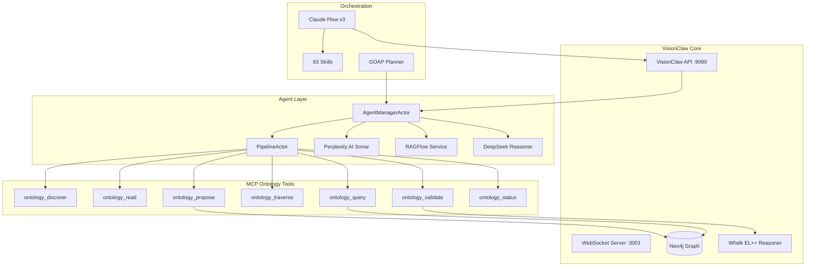
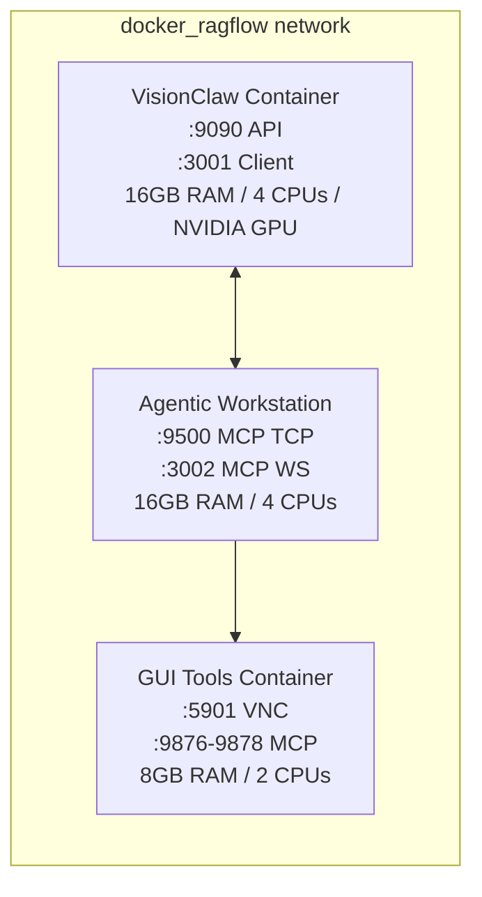
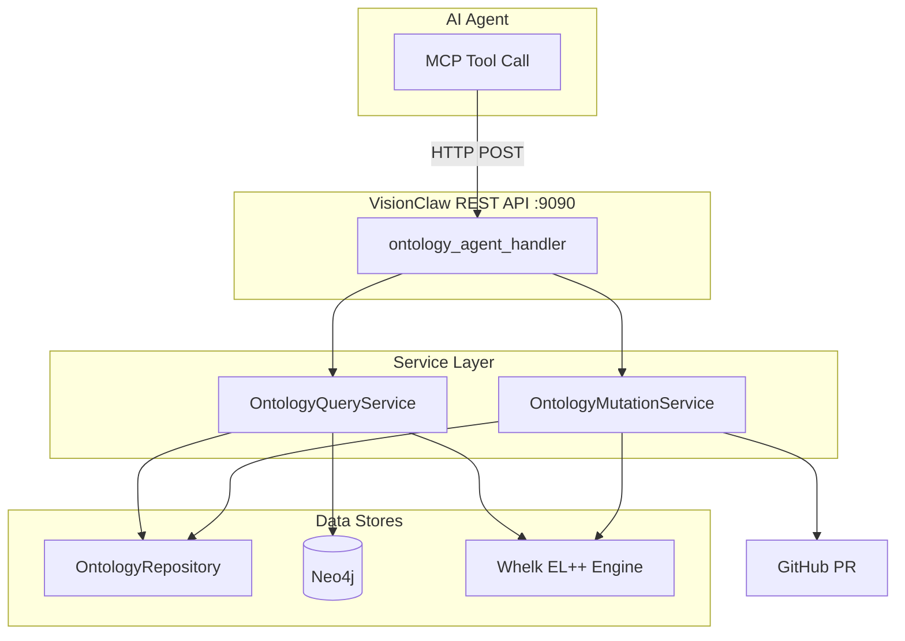

# VisionClaw Agent Orchestration Guide

## Overview

VisionClaw integrates a multi-agent AI system that extends the core knowledge graph with autonomous reasoning, research, and knowledge-authoring capabilities. The system is composed of:

- **83 specialist agent skills** across code, research, media, infrastructure, and knowledge domains
- **7 MCP Ontology Tools** — `ontology_discover`, `ontology_read`, `ontology_query`, `ontology_traverse`, `ontology_propose`, `ontology_validate`, `ontology_status`
- **Perplexity AI** (Sonar API) for real-time web research with citations
- **RAGFlow** for document ingestion and semantic search
- **DeepSeek Reasoning** for complex multi-step analysis
- **Claude Flow v3** for swarm coordination and agent lifecycle management
- **Docker multi-container deployment** across VisionClaw, Agentic Workstation, and GUI Tools containers



---

## Quick Start

```bash
# Start the full multi-container stack (dev profile)
docker compose --profile dev up -d

# Verify agent manager is responding
curl http://localhost:9090/api/bots/agents

# Check the MCP TCP server
curl http://localhost:9500/health

# Verify VisionClaw API health
curl http://localhost:9090/api/health

# Spawn a researcher agent via REST
curl -X POST http://localhost:9090/api/bots/spawn-agent-hybrid \
  -H "Content-Type: application/json" \
  -d '{"agent-type":"researcher","swarm-id":"main-swarm","method":"mcp-fallback","priority":"medium","strategy":"adaptive"}'
```

---

## Docker Multi-Container Setup

VisionClaw uses three cooperating containers on a shared Docker network (`docker_ragflow`).



### VisionClaw Container (`webxr` service)

The core graph and physics engine:

- Rust backend (Actix-web)
- Neo4j graph database
- CUDA physics engine (NVIDIA 12.0)
- React + Babylon.js WebXR client
- Whelk EL++ ontology reasoner
- All 7 ontology MCP tool handlers

**Resource requirements**: 16 GB RAM, 4 CPUs, NVIDIA GPU

### Agentic Workstation Container

Hosts Claude Code and skill execution:

- Claude Code with MCP protocol
- 83 specialist skills installed at `/home/devuser/.claude/skills/`
- Polyglot runtime (Python, Node.js, Rust, Deno)
- Docker socket mounted for container management
- MCP TCP server (port 9500) and WebSocket (port 3002)
- SSH and Code Server access

**Key networking**:
- Docker socket: `/var/run/docker.sock` (container management)
- Shared workspace volume with VisionClaw container
- Bridge to GUI container via TCP ports 9876–9878

### GUI Tools Container

Resource-intensive GUI applications:

- Blender 4.x — 3D modelling via Python API
- QGIS 3.x — geospatial analysis
- XFCE desktop (accessible via VNC at `:5901`, password: `turboflow`)
- MCP bridges for remote AI control over TCP

### Rebuild and Restart

```bash
# Rebuild only the VisionClaw service
docker compose --profile dev up -d --build webxr

# View VisionClaw logs
docker logs visionclaw_container -f

# Execute a command inside VisionClaw
docker exec visionclaw_container cargo test

# Check resource usage across containers
docker stats
```

---

## The 7 MCP Ontology Tools

All 7 tools are invokable as MCP tool calls (`POST` to the MCP TCP server on `:9500`) or directly via the VisionClaw REST API (`POST /api/ontology-agent/<tool-name>`).

### Tool Architecture



### Typical Agent Workflow

1. **Discover** relevant classes with `ontology_discover`
2. **Read** promising hits via `ontology_read` to inspect definitions and axioms
3. **Traverse** the graph around a concept to understand context
4. **Query** with Cypher for precise relationship patterns
5. **Validate** new axioms without side-effects before committing
6. **Propose** a new note or amendment, triggering Whelk consistency checks
7. **Status** at any time to confirm service health

### 1. `ontology_discover` — Semantic Discovery

Find relevant ontology classes by keyword with Whelk inference expansion.

**REST**: `POST /api/ontology-agent/discover`

**Input**:
```json
{
  "query": "neural network",
  "limit": 10,
  "domain": "ai"
}
```

| Field | Type | Required | Description |
|-------|------|----------|-------------|
| `query` | string | Yes | Keywords to search for |
| `limit` | integer | No | Max results (default: 20) |
| `domain` | string | No | Filter by domain prefix (e.g., `"ai"`, `"mv"`) |

**Output**: Array of `DiscoveryResult` objects, each with `iri`, `preferred_term`, `definition_summary`, `relevance_score`, `quality_score`, `domain`, `relationships[]`, `whelk_inferred`.

**Discovery pipeline**: keyword match → Whelk transitive closure expansion → semantic relationship fan-out → ranked results.

---

### 2. `ontology_read` — Read Enriched Note

Fetch a full ontology note with axioms, relationships, and schema context.

**REST**: `POST /api/ontology-agent/read`

**Input**:
```json
{ "iri": "mv:Person" }
```

**Output** (`EnrichedNote`): Full Logseq markdown, OWL metadata (physicality, role, domain, quality score), Whelk-inferred axioms, related notes with summaries, schema context for LLM grounding.

---

### 3. `ontology_query` — Validated Cypher Execution

Execute Cypher queries against Neo4j with schema-aware validation.

**REST**: `POST /api/ontology-agent/query`

**Input**:
```json
{ "cypher": "MATCH (n:Person) RETURN n LIMIT 10" }
```

**Validation features**: checks all node labels against known OWL classes; Levenshtein distance hints for typos (e.g., `"Perzon"` → `"Did you mean Person?"`); built-in labels always pass; errors returned before execution.

---

### 4. `ontology_traverse` — BFS Graph Walk

Walk the ontology graph via breadth-first search from a starting class.

**REST**: `POST /api/ontology-agent/traverse`

**Input**:
```json
{
  "start_iri": "mv:Person",
  "depth": 3,
  "relationship_types": ["subClassOf", "has-part"]
}
```

| Field | Type | Required | Description |
|-------|------|----------|-------------|
| `start_iri` | string | Yes | Starting class IRI |
| `depth` | integer | No | Max BFS depth (default: 3) |
| `relationship_types` | array | No | Filter to specific relationship types |

**Output** (`TraversalResult`): nodes and edges discovered during BFS walk.

---

### 5. `ontology_propose` — Propose Create or Amend

Create new notes or amend existing ones, with full Whelk consistency checks and optional GitHub PR creation.

**REST**: `POST /api/ontology-agent/propose`

**Create input**:
```json
{
  "action": "create",
  "preferred_term": "Quantum Computing",
  "definition": "A type of computation using quantum mechanics",
  "owl_class": "tc:QuantumComputing",
  "physicality": "non-physical",
  "role": "concept",
  "domain": "tc",
  "is_subclass_of": ["mv:Technology"],
  "relationships": { "requires": ["tc:Qubit"] },
  "alt_terms": ["QC"],
  "owner_user_id": "user-123",
  "agent_context": {
    "agent_id": "researcher-001",
    "agent_type": "researcher",
    "task_description": "Research quantum computing concepts",
    "confidence": 0.85,
    "user_id": "user-123"
  }
}
```

**Amend input**:
```json
{
  "action": "amend",
  "target_iri": "mv:Person",
  "amendment": {
    "add_relationships": { "has-part": ["mv:Brain"] },
    "update_definition": "A human being or sentient entity"
  },
  "agent_context": { "..." : "..." }
}
```

**Proposal pipeline**:
1. Generate Logseq markdown with `OntologyBlock` header
2. OntologyParser round-trip validation
3. Whelk EL++ consistency check
4. Quality score computation (0.0–1.0)
5. Stage in OntologyRepository
6. Create GitHub PR if `GITHUB_TOKEN` is set

**Output** (`ProposalResult`): `proposal_id`, `consistency`, `quality_score`, `markdown_preview`, `pr_url`, `status` (Staged | PRCreated | Merged | Rejected).

Proposals scoring above `auto_merge_threshold` (default 0.95) merge automatically; lower-scoring proposals await human review.

---

### 6. `ontology_validate` — Axiom Consistency Check

Pre-flight axiom consistency against Whelk without creating a proposal.

**REST**: `POST /api/ontology-agent/validate`

**Input**:
```json
{
  "axioms": [
    { "axiom_type": "SubClassOf", "subject": "Cat", "object": "Animal" },
    { "axiom_type": "DisjointWith", "subject": "Cat", "object": "Dog" }
  ]
}
```

**Output** (`ConsistencyReport`): consistency status and explanation. Use before `ontology_propose` to avoid failed proposals.

---

### 7. `ontology_status` — Service Health

Check ontology service health and statistics.

**REST**: `GET /api/ontology-agent/status`

**Output**: class count, axiom count, service health status. Poll at any time to detect unexpected state changes caused by concurrent agents.

### Ontology Tool Configuration

```toml
[ontology_agent]
auto_merge_threshold = 0.95
min_confidence       = 0.6
max_discovery_results = 50
require_consistency_check = true
github_owner         = "DreamLab-AI"
github_repo          = "VisionClaw"
github_base_branch   = "main"
notes_path_prefix    = "pages/"
pr_labels            = ["ontology", "agent-proposed"]
```

| Variable | Required | Description |
|----------|----------|-------------|
| `GITHUB_TOKEN` | No | Enables automatic PR creation |
| `GITHUB_OWNER` | No | GitHub repository owner |
| `GITHUB_REPO` | No | GitHub repository name |

---

## Perplexity AI Integration

Perplexity provides real-time web research with source citations. It is integrated at two levels: the MCP skill layer (for Claude Code agents) and the Rust service layer (for VisionClaw API handlers).

### Integration Points

| Layer | Location |
|-------|----------|
| MCP Skill | `multi-agent-docker/skills/perplexity/` |
| Rust Service | `src/services/perplexity_service.rs` |
| API Handler | `src/handlers/perplexity_handler.rs` |
| Config | `PERPLEXITY_API_KEY` environment variable |

### Available Models

| Model | Speed | Sources | Use Case |
|-------|-------|---------|----------|
| `sonar` | Fast | 5–10 | Quick factual lookups (default) |
| `sonar-pro` | Medium | 10–15 | Comprehensive research |
| `sonar-reasoning` | Slower | 15+ | Complex multi-step analysis |

### MCP Tools

**`perplexity_search`** — Quick factual search:
```javascript
perplexity_search({
  query: "current UK mortgage rates major banks",
  max_sources: 10
})
// Returns: { content: "...", sources: [{title, url}, ...] }
```

**`perplexity_research`** — Deep research with synthesis:
```javascript
perplexity_research({
  topic: "AI trends UK enterprise 2025",
  format: "executive summary",
  depth: "deep",
  max_sources: 15
})
// Returns: { summary, key_points[], sources[], confidence }
```

**`perplexity_generate_prompt`** — Prompt optimisation using five-element framework:
```javascript
perplexity_generate_prompt({
  goal: "market research for renewable energy ETFs",
  context: "UK retail investor £10K budget",
  constraints: "focus on 2024-2025 performance"
})
// Returns: { optimized_prompt, framework: {instruction, context, input, keywords[], output_format} }
```

### Query Routing

Perplexity is best used for:
- Current events and live web data not in Neo4j
- Market research and competitive analysis
- Technical documentation lookups with cited sources
- UK/European-centric research queries

Responses from `perplexity_research` can be piped into `ontology_propose` to create new knowledge graph nodes from discovered research.

---

## RAGFlow Integration

RAGFlow provides document ingestion, vector storage, and semantic search for building persistent knowledge bases.

### Network Configuration

| Setting | Value |
|---------|-------|
| Docker network | `docker_ragflow` (external bridge) |
| Hostname | `turbo-devpod.ragflow` |
| Aliases | `turbo-devpod.ragflow`, `turbo-unified.local` |

### Rust Service Layer

| Component | Location |
|-----------|----------|
| Service | `src/services/ragflow_service.rs` |
| API Handler | `src/handlers/ragflow_handler.rs` |
| Data models | `src/models/ragflow_chat.rs` |

### Features

1. **Document ingestion** — PDF, Markdown, plain text; text extraction → chunking → embedding → vector storage
2. **Semantic vector search** — similarity matching, relevance ranking, context retrieval
3. **Chat interface** — conversational Q&A over the knowledge base with streaming responses and source citations
4. **Streaming** — real-time response generation via the VisionClaw WebSocket

### Connectivity Check

```bash
# Verify RAGFlow is reachable
docker network inspect docker_ragflow
docker exec visionclaw_container ping turbo-devpod.ragflow -c 3
```

---

## Natural Language Queries

Agents translate natural language queries into ontology tool calls or Perplexity/RAGFlow searches. The routing decision is made by the `AgentManagerActor` based on query semantics.

| Query Type | Routed To |
|------------|-----------|
| Graph structure / class hierarchy | `ontology_traverse` + `ontology_query` |
| Definition of a concept | `ontology_read` |
| Real-time / current information | Perplexity `sonar-pro` |
| Document search | RAGFlow vector search |
| New concept proposal | `ontology_propose` |
| Consistency check | `ontology_validate` |

**Example natural language → tool mapping**:

```
"What classes are related to NeuralNetwork?"
  → ontology_discover({query: "neural network"})
  → ontology_traverse({start_iri: "ai:NeuralNetwork", depth: 2})

"What are current AI trends in enterprise?"
  → perplexity_research({topic: "AI trends enterprise 2025", depth: "deep"})

"Is Cat a subclass of Animal consistent?"
  → ontology_validate({axioms: [{SubClassOf, Cat, Animal}]})
```

---

## Agent Lifecycle Management

### Agent Types

| Type | Role | Recommended Provider | Priority |
|------|------|----------------------|----------|
| **Coordinator** | Orchestration, task decomposition | Gemini (fast) | Critical |
| **Researcher** | Information gathering, analysis | Gemini | Medium–High |
| **Coder** | Code generation, refactoring | Claude | High |
| **Architect** | System design, patterns | Claude | High |
| **Tester** | Test creation, validation | OpenAI | High |
| **Reviewer** | Code review, security | Claude | Medium |
| **Analyzer** | Data analysis, insights | Gemini | Medium |
| **Optimizer** | Performance tuning | Claude | Medium |

### Spawning Agents

Via REST API:
```bash
POST /api/bots/spawn-agent-hybrid
{
  "agent-type": "researcher",
  "swarm-id": "main-swarm",
  "method": "mcp-fallback",
  "priority": "medium",
  "strategy": "adaptive",
  "config": {
    "search-depth": 5,
    "max-concurrent-tasks": 3,
    "timeout": 600
  }
}
```

Via Claude Flow CLI:
```bash
# Initialise a hierarchical swarm
claude-flow swarm init --topology hierarchical --max-agents 10 --strategy adaptive

# Spawn specialist workers
claude-flow agent spawn researcher --capabilities="research,analysis"
claude-flow agent spawn coder --capabilities="implementation,testing"

# Orchestrate a task across the swarm
claude-flow task orchestrate "Build authentication service" \
  --strategy=sequential --priority=high
```

Via MCP tools:
```bash
# List active agents
GET /api/bots/agents

# Terminate a specific agent
DELETE /api/bots/agents/{agent_id}
```

### Per-User Note Ownership

Every ontology note has an `owner_user_id`. Agents inherit their user's identity through `AgentContext.user_id`:

```json
{
  "agent_context": {
    "agent_id": "researcher-001",
    "agent_type": "researcher",
    "user_id": "user-456",
    "confidence": 0.9
  }
}
```

Ownership rules:
- Agents can **create** notes only under their user's namespace
- Agents can **amend** only notes where `owner_user_id` matches their `user_id`
- **Read** and **discover** are unrestricted — the full graph is visible to all agents

### Agent Health Monitoring

```bash
# Health check interval: 10–120s (default 30s)
# Auto-restart on failure: configurable per deployment

# Check via telemetry poll
GET /api/bots/agents
# Returns: agent ID, type, health%, tasks completed, uptime

# View agent logs
docker logs agentic-workstation -f
```

---

## WebUI Control Panel

Access via **Settings → Agents** in the VisionClaw Control Centre.

### Agent Spawner

Six pre-configured agent type buttons: Researcher, Coder, Analyzer, Tester, Optimizer, Coordinator. Each spawns with default settings (priority, strategy, provider).

### Active Agents Monitor

Real-time view with status indicators: green (active), orange pulse (busy), red (error), gray (idle). Displays agent ID, type, health percentage, task count, uptime.

### Settings (20+ options)

| Category | Setting | Range | Default |
|----------|---------|-------|---------|
| Spawning | Max Concurrent Agents | 1–50 | 10 |
| Spawning | Auto-Scale | on/off | off |
| Spawning | AI Provider | gemini/openai/claude | claude |
| Spawning | Default Priority | low/medium/high/critical | medium |
| Spawning | Default Strategy | parallel/sequential/adaptive | adaptive |
| Lifecycle | Idle Timeout | 60–600s | 300s |
| Lifecycle | Auto-Restart Failed | on/off | on |
| Lifecycle | Health Check Interval | 10–120s | 30s |
| Monitoring | Enable Telemetry | on/off | on |
| Monitoring | Poll Interval | 1–30s | 5s |
| Monitoring | Log Level | debug/info/warn/error | info |
| Visualisation | Show in Main Graph | on/off | on |
| Visualisation | Agent Node Size | 0.5–3.0 | 1.0 |
| Visualisation | Agent Node Color | hex | configurable |

Settings persist to `settings.agents.*` via the REST API and survive page refreshes.

### Telemetry Stream

Dual display: **TELEMETRY mode** (DSEG font, timestamped status with color-coded severity) and **GOAP mode** (Goal-Oriented Action Planning with A* pathfinding visualisation, double-click to open full interface).

### Graph Integration

Agents appear as nodes in the main VisionClaw knowledge graph when "Show in Main Graph" is enabled. Node ID flag bits encode type:

- Bit 31 (`0x80000000`): agent node
- Bit 30 (`0x40000000`): knowledge node

Disable graph visualisation for swarms larger than 20 agents to maintain render performance.

---

## Troubleshooting

### Agents Won't Spawn

```bash
# Check concurrent agent limit
GET /api/bots/agents   # count active agents

# Terminate idle agents
DELETE /api/bots/agents/{id}

# Increase limit in settings
settings.agents.spawn.maxConcurrentAgents = 20
```

### MCP Server Unresponsive

```bash
# TCP server health
curl http://localhost:9500/health

# Check MCP server process
docker exec agentic-workstation mcp-tcp-status

# Restart agentic workstation
docker restart agentic-workstation
```

### Ontology Tools Return Errors

```bash
# Check VisionClaw API
curl http://localhost:9090/api/health

# Check ontology service status
curl http://localhost:9090/api/ontology-agent/status

# Review VisionClaw logs for Whelk errors
docker logs visionclaw_container | grep -i whelk
```

### GUI Skills Timeout (Blender, QGIS, KiCad)

```bash
# Check GUI container is running
docker ps | grep gui-tools-container

# Access GUI via VNC
# vnc://localhost:5901  password: turboflow

# Check TCP bridge ports
docker exec agentic-workstation nc -zv gui-tools-container 9876
```

### Perplexity / RAGFlow Not Responding

```bash
# Perplexity: verify API key
echo $PERPLEXITY_API_KEY

# RAGFlow: verify network
docker network inspect docker_ragflow
ping turbo-devpod.ragflow

# Z.AI service
curl http://localhost:9600/health
sudo supervisorctl status claude-zai
```

### High CPU / Memory

- Reduce max concurrent agents (start at 5–10)
- Increase telemetry poll interval to 10–15s
- Disable graph visualisation for large swarms
- Check idle timeout — agents holding resources should be terminated

---

## Related Documentation

- [Agent Skills Catalog](../reference/agents-catalog.md) — all registered agent skills
- [System Overview](../explanation/system-overview.md) — hexagonal architecture and actor model
- [Actor Hierarchy](../explanation/actor-hierarchy.md) — 21-actor Actix supervision tree
