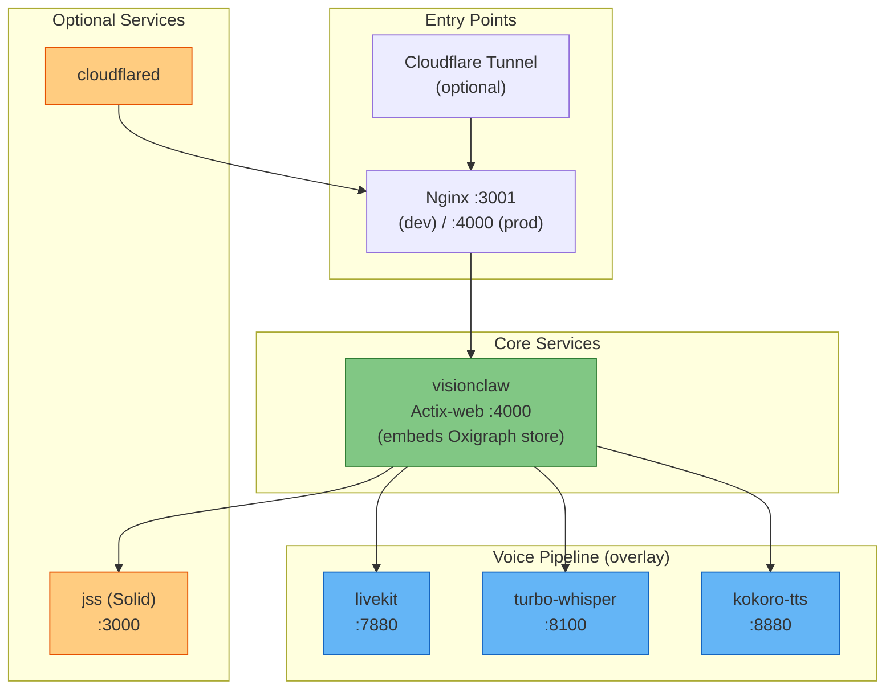
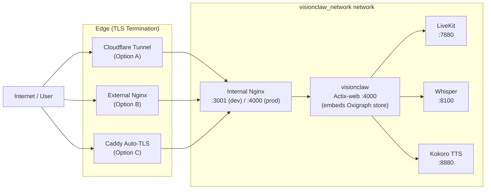

# VisionClaw Deployment Guide

## Table of Contents

1. [Prerequisites](#prerequisites)
2. [Quick Start](#quick-start)
3. [Docker Compose Architecture](#docker-compose-architecture)
4. [Environment Variables](#environment-variables)
5. [NVIDIA GPU Setup](#nvidia-gpu-setup)
6. [Service Profiles](#service-profiles)
7. [Graph Store (Oxigraph)](#graph-store-oxigraph)
8. [Network Configuration](#network-configuration)
9. [Production Hardening](#production-hardening)
10. [Health Checks and Monitoring](#health-checks-and-monitoring)
11. [Troubleshooting](#troubleshooting)

---

## 1. Prerequisites

### System Requirements

**Development:**
- CPU: 4+ cores, 2.5 GHz+
- RAM: 16 GB minimum (24 GB recommended)
- Storage: 20 GB available SSD space
- OS: Ubuntu 22.04+, macOS 12+, or Windows 10+ with WSL2

**Production:**
- CPU: 8+ cores, 3.5 GHz+
- RAM: 32 GB minimum (48 GB recommended)
- Storage: 100 GB+ SSD
- GPU: NVIDIA GPU with CUDA compute capability 8.6+ (e.g., RTX 3080+)
- Network: 1 Gbps minimum

### Required Software

```bash
# Docker Engine 24+ with Compose V2
docker --version
docker compose version

# Install Docker if needed
curl -fsSL https://get.docker.com -o get-docker.sh
sh get-docker.sh
sudo apt-get install docker-compose-plugin

# NVIDIA Container Toolkit (for GPU support)
distribution=$(. /etc/os-release;echo $ID$VERSION_ID)
curl -s -L https://nvidia.github.io/nvidia-docker/gpgkey | sudo apt-key add -
curl -s -L https://nvidia.github.io/nvidia-docker/$distribution/nvidia-docker.list | \
  sudo tee /etc/apt/sources.list.d/nvidia-docker.list
sudo apt-get update && sudo apt-get install -y nvidia-container-toolkit
sudo systemctl restart docker
```

### Ports Used by VisionClaw

| Port | Service | Protocol | Purpose |
|------|---------|----------|---------|
| 3001 | Nginx (dev) | HTTP | Frontend + API reverse proxy |
| 4000 | Actix-web API | HTTP | Rust backend direct access |
| 5173 | Vite dev server | HTTP | Hot Module Replacement (internal) |
| 7880 | LiveKit | HTTP/WS | WebRTC signaling (voice overlay) |
| 7881 | LiveKit RTC | TCP | WebRTC TCP fallback |
| 7882 | LiveKit RTC | UDP | WebRTC media transport |
| 8100 | Turbo Whisper | HTTP/WS | Speech-to-text API (voice overlay) |
| 8880 | Kokoro TTS | HTTP | Text-to-speech API (voice overlay) |
| 9500 | MCP TCP Server | TCP | Multi-agent MCP protocol |
| 9380 | RAGFlow | HTTP | Knowledge retrieval service |
| 24678 | Vite HMR | WS | Hot Module Replacement socket |

---

## 2. Quick Start

```bash
# Clone the repository
git clone https://github.com/your-org/VisionClaw.git
cd VisionClaw

# Create the shared Docker network (one time only)
docker network create visionclaw_network

# Copy and configure environment
cp .env.example .env
# Edit .env -- review secrets / API keys (the graph store is embedded; no DB password needed)
nano .env

# Start the development stack
docker compose -f docker-compose.unified.yml --profile dev up -d

# Verify all services are healthy (allow ~40 seconds)
docker compose -f docker-compose.unified.yml --profile dev ps

# Confirm backend liveness / readiness / diagnostics
curl http://localhost:3001/healthz   # liveness  (process is up)
curl http://localhost:3001/readyz    # readiness (Oxigraph populated, not DEGRADED)
curl http://localhost:3001/api/health  # full diagnostics
```

The application is available at `http://localhost:3001` once `/readyz` returns ready (the embedded Oxigraph store has finished populating from local files).

To add voice services (LiveKit, Whisper, Kokoro TTS):

```bash
docker compose \
  -f docker-compose.unified.yml \
  -f docker-compose.voice.yml \
  --profile dev up -d
```

---

## 3. Docker Compose Architecture

VisionClaw uses several compose files for different deployment scenarios.

### Compose Files

| File | Purpose | Profile |
|------|---------|---------|
| `docker-compose.unified.yml` | Unified stack (`visionclaw` backend with embedded Oxigraph store, JSS, profile-based config) | `dev`, `prod` |
| `docker-compose.voice.yml` | Voice pipeline overlay (LiveKit, Whisper, Kokoro TTS) | `dev`, `prod` |
| `docker-compose.yml` | Base development services (`visionclaw` + Cloudflare tunnel) | `dev` |
| `docker-compose.production.yml` | Legacy production-only compose | default |
| `docker-compose.vircadia.yml` | ~~Vircadia XR~~ (deprecated — replaced by Godot native APK) | — |

`docker-compose.unified.yml` is the recommended entry point for all deployments.

### Service Topology



> The knowledge/ontology graph store is **embedded in-process** inside the `visionclaw` backend (Oxigraph RDF triple store, RocksDB-backed — ADR-11). There is no separate Neo4j (or other graph-database) container in the current stack.

### Volume Summary

| Volume | Purpose |
|--------|---------|
| `visionclaw-data` | Application data — markdown, metadata, **and the embedded Oxigraph dataset** (`/app/data/oxigraph/`, RocksDB column families — ADR-11) |
| `visionclaw-logs` | Application and Nginx logs |
| `npm-cache` | npm package cache |
| `cargo-cache` | Cargo registry cache |
| `cargo-target-cache` | Rust build artifact cache |
| `jss-data` | JavaScript Solid Server pod storage |

---

## 4. Environment Variables

Create a `.env` file in the project root. All variables are read at container startup.

### Core Application

| Variable | Required | Default | Description |
|----------|----------|---------|-------------|
| `ENVIRONMENT` | no | `development` | Mode: `development`, `staging`, `production` |
| `DEBUG_MODE` | no | `false` | Enable debug logging |
| `RUST_LOG` | no | `info` | Rust log level: `trace`, `debug`, `info`, `warn`, `error` |
| `HOST_PORT` | no | `3001` | HTTP server port |
| `NODE_ENV` | no | `development` | Node environment |
| `SYSTEM_NETWORK_PORT` | no | `4000` | Internal Actix-web API port |

### Graph Store (Oxigraph — embedded)

The knowledge/ontology graph store is the **embedded Oxigraph** RDF triple store
(ADR-11). It runs in-process inside the `visionclaw-server` binary against a RocksDB
dataset on disk — there is **no graph-database container, no Bolt URI, and no graph
DB password**. The `NEO4J_*` variables are obsolete and should be removed from `.env`.

| Variable | Required | Default | Description |
|----------|----------|---------|-------------|
| `DATA_DIR` | no | `/app/data` | Application data root; the Oxigraph dataset lives at `${DATA_DIR}/oxigraph/` |

> Migration note: legacy `NEO4J_URI` / `NEO4J_USER` / `NEO4J_PASSWORD` / `NEO4J_DATABASE`
> are no longer read by the backend. A one-shot importer (`tools/migrate-neo4j-to-oxigraph`)
> exists for converting an old Neo4j export into the Oxigraph dataset; it is not part of
> the running stack.

### Security and Authentication

| Variable | Required | Default | Description |
|----------|----------|---------|-------------|
| `JWT_SECRET` | yes | — | JWT signing secret (256-bit hex) |
| `AUTH_PROVIDER` | no | `nostr` | Auth provider: `jwt`, `nostr`, `oauth` |
| `AUTH_REQUIRED` | no | `true` | Require authentication for API |
| `SESSION_TIMEOUT` | no | `86400` | Session timeout in seconds |
| `WS_AUTH_ENABLED` | no | `false` | Require auth on WebSocket connections |

> **Release env hygiene (ADR-06 §D11)**: a **release** build of `visionclaw-server`
> refuses to boot (hard exit) if any dev-mode escape hatch is present in the
> environment — `SETTINGS_AUTH_BYPASS`, `VISIONCLAW_DEV_MODE`, or
> `ALLOW_INSECURE_DEFAULTS` (also `NODE_ENV=development` together with `DOCKER_ENV`).
> These vars cannot actually enable a bypass in release (the codepaths are
> `#[cfg]`-stripped), but their presence signals that a dev configuration was promoted
> to production, so the binary fails fast (exit code 2) rather than starting in a
> deceptive state. The `--allow-skip-auth` argv flag is likewise rejected in release
> builds. Keep these unset in any production `.env`.

### GPU Configuration

| Variable | Required | Default | Description |
|----------|----------|---------|-------------|
| `ENABLE_GPU` | no | `false` | Enable GPU acceleration |
| `NVIDIA_VISIBLE_DEVICES` | no | `0` | GPU device IDs (comma-separated) |
| `CUDA_ARCH` | no | `86` | CUDA compute capability (86 = RTX 30xx, 89 = RTX 40xx) |
| `GPU_MEMORY_LIMIT` | no | `8g` | GPU memory limit |
| `NVIDIA_DRIVER_CAPABILITIES` | no | `compute,utility` | Driver capabilities |

### Voice Pipeline

| Variable | Required | Default | Description |
|----------|----------|---------|-------------|
| `LIVEKIT_API_KEY` | no | `visionclaw` | LiveKit API key |
| `LIVEKIT_API_SECRET` | no | `visionclaw-voice-secret-change-in-prod` | LiveKit API secret — **change in production** |
| `LIVEKIT_URL` | no | `ws://livekit:7880` | LiveKit WebSocket URL |

### MCP and Agent Coordination

| Variable | Required | Default | Description |
|----------|----------|---------|-------------|
| `MCP_HOST` | no | `agentic-workstation` | MCP server hostname |
| `MCP_TCP_PORT` | no | `9500` | MCP TCP port |
| `ORCHESTRATOR_WS_URL` | no | `ws://mcp-orchestrator:9001/ws` | Orchestrator WebSocket |

### External AI Services

| Variable | Required | Default | Description |
|----------|----------|---------|-------------|
| `OPENAI_API_KEY` | no | `""` | OpenAI API key |
| `ANTHROPIC_API_KEY` | no | `""` | Anthropic API key |
| `PERPLEXITY_API_KEY` | no | `""` | Perplexity API key |
| `RAGFLOW_API_BASE_URL` | no | `http://ragflow-server:9380` | RAGFlow endpoint |
| `RAGFLOW_API_KEY` | no | — | RAGFlow API key |
| `CLOUDFLARE_TUNNEL_TOKEN` | no | — | Cloudflare tunnel token |

### Resource Limits

| Variable | Required | Default | Description |
|----------|----------|---------|-------------|
| `MEMORY_LIMIT` | no | `16g` | Container memory limit |
| `CPU_LIMIT` | no | `8.0` | Maximum CPU cores |
| `CPU_RESERVATION` | no | `4.0` | Reserved CPU cores |
| `MAX_AGENTS` | no | `20` | Maximum concurrent agents |
| `WORKER_THREADS` | no | `8` | Worker thread count |

### Feature Flags

| Variable | Required | Default | Description |
|----------|----------|---------|-------------|
| `ENABLE_XR` | no | `false` | Enable XR/VR features |
| `ENABLE_VOICE` | no | `false` | Enable voice interaction |
| `ENABLE_GITHUB_SYNC` | no | `true` | Enable GitHub synchronisation |
| `ENABLE_METRICS` | no | `true` | Enable Prometheus metrics |
| `ENABLE_SOLID` | no | `false` | Enable Solid/LDP pod integration |
| `JSS_ENABLED` | no | `false` | Enable JavaScript Solid Server sidecar |

### Minimal `.env` for Development

```bash
# Required
JWT_SECRET=$(openssl rand -hex 32)

# GPU (adjust for your hardware)
ENABLE_GPU=true
CUDA_ARCH=86        # RTX 30-series; use 89 for RTX 40-series

# Logging
RUST_LOG=debug
NODE_ENV=development

# Hot reload
HOT_RELOAD=true
VITE_DEV_SERVER_PORT=5173
VITE_HMR_PORT=24678
```

---

## 5. NVIDIA GPU Setup

### Installing NVIDIA Container Toolkit

```bash
# Ubuntu / Debian
distribution=$(. /etc/os-release;echo $ID$VERSION_ID)
curl -s -L https://nvidia.github.io/nvidia-docker/gpgkey | sudo apt-key add -
curl -s -L https://nvidia.github.io/nvidia-docker/$distribution/nvidia-docker.list | \
  sudo tee /etc/apt/sources.list.d/nvidia-docker.list
sudo apt-get update
sudo apt-get install -y nvidia-container-toolkit
sudo nvidia-ctk runtime configure --runtime=docker
sudo systemctl restart docker
```

### Verify GPU Access

```bash
# Test GPU passthrough into Docker
docker run --rm --gpus all nvidia/cuda:12.0-base nvidia-smi

# Verify within the VisionClaw container
docker exec -it visionclaw_container nvidia-smi
```

### Docker Daemon Configuration

After installing the toolkit, `/etc/docker/daemon.json` should contain:

```json
{
  "runtimes": {
    "nvidia": {
      "path": "nvidia-container-runtime",
      "runtimeArgs": []
    }
  },
  "default-runtime": "nvidia"
}
```

### CUDA Architecture Values

Set `CUDA_ARCH` in `.env` to match your GPU generation:

| GPU Generation | Compute Capability | CUDA_ARCH value |
|---------------|-------------------|----------------|
| RTX 30-series (Ampere) | 8.6 | `86` |
| RTX 40-series (Ada) | 8.9 | `89` |
| RTX A6000 (Ampere) | 8.6 | `86` |
| A100 | 8.0 | `80` |

### CachyOS-Specific Note

On CachyOS, the CUDA toolkit installs to `/opt/cuda`, not `/usr/local/cuda`. The `build.rs` script handles this automatically, but if you compile outside Docker, set:

```bash
export CUDA_HOME=/opt/cuda
export PATH=$CUDA_HOME/bin:$PATH
```

### GPU Compose Configuration

The `docker-compose.unified.yml` GPU resource section:

```yaml
deploy:
  resources:
    reservations:
      devices:
        - driver: nvidia
          count: 1
          capabilities: [gpu, compute, utility]
```

Set `NVIDIA_VISIBLE_DEVICES=0,1` for multi-GPU use. Note: the CUDA physics kernels target a single GPU by default.

---

## 6. Service Profiles

### `dev` Profile

```bash
docker compose -f docker-compose.unified.yml --profile dev up -d
```

| Feature | Value |
|---------|-------|
| Dockerfile | `Dockerfile.dev` |
| Rust compilation | On container startup (~5 min cold) |
| Ports exposed | 3001 (Nginx), 4000 (API), 7474, 7687 |
| Source mounts | Yes (hot reload) |
| Docker socket | Mounted (for MCP tools) |
| RUST_LOG | `debug` |
| NODE_ENV | `development` |
| HMR | Enabled on port 24678 |

Hot reload behaviour: Rust source files mounted read-only. The entrypoint script watches for changes and triggers `cargo build` automatically. Build artifacts are cached in `cargo-target-cache`.

### `prod` Profile

```bash
docker compose -f docker-compose.unified.yml --profile prod up -d
```

| Feature | Value |
|---------|-------|
| Dockerfile | `Dockerfile.production` |
| Rust compilation | Pre-compiled in image (`opt-level=3`, LTO) |
| Ports exposed | 4000 (API only, behind Nginx) |
| Source mounts | None (code baked into image) |
| Docker socket | Not mounted |
| RUST_LOG | `warn` |
| NODE_ENV | `production` |
| HMR | Disabled |

Production resource limits (from `docker-compose.unified.yml`):

```yaml
deploy:
  resources:
    limits:
      memory: 8G
      cpus: '4'
    reservations:
      memory: 2G
      cpus: '1'
```

Adjust these based on your graph size. For graphs above 100K nodes, increase to `32G` / `16` CPUs.

### Voice Overlay

```bash
docker compose \
  -f docker-compose.unified.yml \
  -f docker-compose.voice.yml \
  --profile prod up -d
```

Adds three GPU-aware services:

| Service | Image | Port | Role |
|---------|-------|------|------|
| `livekit` | `livekit/livekit-server:v1.7` | 7880 (HTTP/WS), 7881 (TCP), 7882 (UDP) | WebRTC SFU for spatial audio |
| `turbo-whisper` | `fedirz/faster-whisper-server:latest-cuda` | 8100 | Streaming speech-to-text |
| `kokoro-tts` | `ghcr.io/remsky/kokoro-fastapi-cpu:latest` | 8880 | Text-to-speech |

LiveKit configuration lives in `config/livekit.yaml` (mounted read-only at `/etc/livekit.yaml`). It sets Opus codec defaults, 50-participant room limits, and WebRTC media ports 50000–50200/udp.

### Deployment Size Profiles

| Scale | Nodes | Memory | CPU | GPU |
|-------|-------|--------|-----|-----|
| Small | < 10K | 8 GB | 4 | Optional |
| Medium | 10K–100K | 16 GB | 8 | Recommended |
| Large | 100K+ | 32 GB | 16 | Required |

---

## 7. Graph Store (Oxigraph)

The knowledge/ontology graph is held in an **embedded Oxigraph** RDF triple store
(W3C SPARQL 1.1 Query + Update, RocksDB-backed), opened in-process by the
`visionclaw-server` binary at startup (ADR-11). There is **no separate graph-database
container** — Neo4j was removed entirely. The dataset lives on disk inside the
application data volume at `/app/data/oxigraph/`.

### Startup behaviour

At boot the backend opens the Oxigraph dataset and populates it from local files. If
population fails, the backend enters a **DEGRADED** state rather than serving empty
graph data; `/readyz` reports not-ready until the store is populated. No memory-tuning
env vars are required — Oxigraph manages its own RocksDB column families.

### Resetting the graph data

```bash
docker compose -f docker-compose.unified.yml --profile dev down
# The Oxigraph dataset lives inside the visionclaw-data volume.
# Remove just the dataset directory rather than nuking all app data:
docker run --rm -v visionclaw-data:/data alpine rm -rf /data/oxigraph
docker compose -f docker-compose.unified.yml --profile dev up -d
# On next boot the store is re-populated from local files.
```

### Backup

```bash
# Backup application data (includes the Oxigraph dataset under /data/oxigraph)
docker run --rm \
  -v visionclaw-data:/data \
  -v $(pwd):/backup alpine \
  tar czf /backup/visionclaw-data-$(date +%Y%m%d).tar.gz /data
```

> Migration from Neo4j: a one-shot importer at `tools/migrate-neo4j-to-oxigraph`
> converts a legacy Neo4j Bolt export into the Oxigraph dataset. It is a standalone
> workspace tool, not part of the running stack.

Schedule daily backups:

```bash
# crontab -e
0 2 * * * /path/to/backup.sh >> /var/log/visionclaw-backup.log 2>&1
```

---

## 8. Network Configuration

All services join the external `visionclaw_network` network. Create it once:

```bash
docker network create visionclaw_network
```

Service hostnames on this network: `visionclaw` (alias `visionclaw-server`), `livekit`, `turbo-whisper`, `kokoro-tts`, `jss`, `cloudflared-tunnel`. (There is no `neo4j` host — the graph store is embedded in the `visionclaw` backend.)

### Network Topology



### Reverse Proxy Options

**Option A — Cloudflare Tunnel (recommended):** Set `CLOUDFLARE_TUNNEL_TOKEN` in `.env`. The `cloudflared` sidecar handles TLS, DDoS protection, and DNS automatically. No additional Nginx or Caddy required.

```bash
CLOUDFLARE_TUNNEL_TOKEN=your-tunnel-token-here
docker compose -f docker-compose.unified.yml --profile prod up -d cloudflared
```

**Option B — External Nginx with Let's Encrypt:**

```nginx
server {
    listen 443 ssl http2;
    server_name your-domain.com;

    ssl_certificate /etc/letsencrypt/live/your-domain.com/fullchain.pem;
    ssl_certificate_key /etc/letsencrypt/live/your-domain.com/privkey.pem;
    ssl_protocols TLSv1.2 TLSv1.3;

    add_header Strict-Transport-Security "max-age=31536000; includeSubDomains" always;

    location / {
        proxy_pass http://127.0.0.1:3001;
        proxy_set_header Host $host;
        proxy_set_header X-Real-IP $remote_addr;
        proxy_set_header X-Forwarded-Proto $scheme;
    }

    location /wss {
        proxy_pass http://127.0.0.1:3001;
        proxy_http_version 1.1;
        proxy_set_header Upgrade $http_upgrade;
        proxy_set_header Connection "upgrade";
        proxy_read_timeout 600m;
    }

    location /ws/speech {
        proxy_pass http://127.0.0.1:3001;
        proxy_http_version 1.1;
        proxy_set_header Upgrade $http_upgrade;
        proxy_set_header Connection "upgrade";
        proxy_read_timeout 600m;
    }
}
```

**Option C — Caddy (auto-TLS):**

```
your-domain.com {
    reverse_proxy localhost:3001
}
```

### WebSocket Endpoints

| Path | Purpose |
|------|---------|
| `/wss` | Graph data binary stream |
| `/ws/speech` | Voice input/output |
| `/ws/mcp` | MCP protocol relay |

All WebSocket paths require the reverse proxy to support HTTP Upgrade headers.

### Firewall Rules

```bash
sudo ufw allow 22/tcp    # SSH
sudo ufw allow 80/tcp    # HTTP (redirect to HTTPS)
sudo ufw allow 443/tcp   # HTTPS
sudo ufw enable
```

Internal ports (3001, 4000, 7474, 7687, 9500) should not be exposed to the public internet in production.

---

## 9. Production Hardening

### Generate Secure Secrets

```bash
JWT_SECRET=$(openssl rand -hex 32)
LIVEKIT_API_SECRET=$(openssl rand -hex 32)
CLOUDFLARE_TUNNEL_TOKEN="your-cloudflare-token"

cat > .env.production << EOF
ENVIRONMENT=production
DEBUG_MODE=false
RUST_LOG=warn
NODE_ENV=production

JWT_SECRET=$JWT_SECRET
LIVEKIT_API_SECRET=$LIVEKIT_API_SECRET
CLOUDFLARE_TUNNEL_TOKEN=$CLOUDFLARE_TUNNEL_TOKEN

# Do NOT set SETTINGS_AUTH_BYPASS / VISIONCLAW_DEV_MODE / ALLOW_INSECURE_DEFAULTS
# in production — a release build refuses to boot if any are present (ADR-06 §D11).

WS_AUTH_ENABLED=true
CORS_ALLOWED_ORIGINS=https://yourdomain.com

ENABLE_GPU=true
CUDA_ARCH=86
MEMORY_LIMIT=32g
CPU_LIMIT=16.0
MAX_AGENTS=50
ENABLE_METRICS=true
EOF

chmod 600 .env.production
```

### Container Security

The production profile enforces these constraints:

- **No Docker socket mount** — code cannot interact with the host Docker daemon.
- **Code baked into image** — no host source mounts at runtime.
- **Network isolation** — only the Nginx port (3001) is exposed to the host; all other service communication is internal to `visionclaw_network`.
- **Content Security Policy** — configured in `nginx.production.conf`.

Add further hardening in `docker-compose.prod.yml`:

```yaml
services:
  visionclaw-production:
    security_opt:
      - no-new-privileges:true
    read_only: true
    tmpfs:
      - /tmp
    cap_drop:
      - ALL
    cap_add:
      - NET_BIND_SERVICE
```

### Log Management

Production uses JSON-file logging with rotation:

```yaml
logging:
  driver: "json-file"
  options:
    max-size: "10m"
    max-file: "3"
```

Configure logrotate for persistent log files:

```bash
cat > /etc/logrotate.d/visionclaw << 'EOF'
/var/log/visionclaw/*.log {
    daily
    rotate 7
    compress
    missingok
    notifempty
    postrotate
        docker compose kill -s USR1 visionclaw-production
    endscript
}
EOF
logrotate -f /etc/logrotate.d/visionclaw
```

### TLS Notes

- The internal Nginx does NOT terminate TLS itself.
- TLS must be terminated at the edge: Cloudflare tunnel, external Nginx, or Caddy.
- Set `Strict-Transport-Security` headers (already in `nginx.production.conf`).
- WebSocket paths require Upgrade header support from the edge proxy.

### Rate Limiting (Nginx)

```nginx
limit_req_zone $binary_remote_addr zone=api:10m rate=100r/m;
limit_req_zone $binary_remote_addr zone=websocket:10m rate=50r/m;
limit_conn_zone $binary_remote_addr zone=addr:10m;

location / {
    limit_req zone=api burst=20 nodelay;
    limit_conn addr 10;
}

location /wss {
    limit_req zone=websocket burst=10 nodelay;
}
```

---

## 10. Health Checks and Monitoring

### Service Health Check Endpoints

The backend exposes three distinct health endpoints:

| Endpoint | Purpose | Use for |
|----------|---------|---------|
| `GET /healthz` | **Liveness** — process is up and serving | Kubernetes/Docker liveness probes, load-balancer up checks |
| `GET /readyz` | **Readiness** — Oxigraph store populated and backend not in DEGRADED state | Kubernetes/Docker readiness probes, "is it safe to route traffic?" |
| `GET /api/health` | **Diagnostics** — full JSON health/status report (subsystems, physics, MCP relay) | Operators, dashboards, debugging |

| Service | Endpoint | Interval | Retries | Start Period |
|---------|----------|----------|---------|--------------|
| VisionClaw | `GET http://localhost:3001/readyz` | 30s | 3 | 60s |
| LiveKit | `wget http://localhost:7880` | 10s | 3 | 5s |
| Turbo Whisper | `GET http://localhost:8000/health` | 15s | 3 | 30s |
| Kokoro TTS | `GET http://localhost:8880/health` | 15s | 3 | 20s |
| RAGFlow | `GET http://ragflow-server:9380/api/health` | 30s | 3 | 30s |

> The graph store has no independent health endpoint because it is embedded in the
> backend; its readiness is folded into `/readyz`.

### Checking Status

```bash
# All service states
docker compose -f docker-compose.unified.yml --profile prod ps

# Individual container health
docker inspect --format='{{.State.Health.Status}}' visionclaw_container

# VisionClaw liveness / readiness / full diagnostics
curl http://localhost:3001/healthz
curl http://localhost:3001/readyz
curl http://localhost:3001/api/health

# GPU utilisation
nvidia-smi dmon -s pucvmet -c 10
```

### Log Streaming

```bash
# Follow all services
docker compose -f docker-compose.unified.yml --profile prod logs -f

# Single service
docker logs -f visionclaw_container

# Last 50 lines
docker logs --tail 50 visionclaw_container
```

### Performance Monitoring

```bash
# Real-time container resource usage
docker stats

# Snapshot to file
docker stats --no-stream > /var/log/docker-stats-$(date +%Y%m%d).log

# GPU monitoring
nvidia-smi dmon -s pucvmet -c 100 > /var/log/gpu-stats-$(date +%Y%m%d).log
```

### Keeping Images Updated

```bash
# Pull latest images
docker compose -f docker-compose.unified.yml pull

# Recreate containers with new images
docker compose -f docker-compose.unified.yml --profile prod up -d --force-recreate

# Clean up unused resources
docker system prune -a --volumes
```

---

## 11. Troubleshooting

### Container Will Not Start

```bash
# Check logs for startup errors
docker logs visionclaw_container

# Most common causes:
# 1. Embedded Oxigraph store failed to populate (backend logs "DEGRADED") — check
#    /app/data permissions and local source files; /readyz stays not-ready
# 2. A dev env var is set in a release build (SETTINGS_AUTH_BYPASS / VISIONCLAW_DEV_MODE /
#    ALLOW_INSECURE_DEFAULTS) — release binary hard-exits with code 2 (ADR-06 §D11)
# 3. visionclaw_network network does not exist

# Fix network
docker network create visionclaw_network
docker compose -f docker-compose.unified.yml --profile dev up -d --force-recreate
```

### Port Already in Use

```bash
# Find the conflicting process
sudo netstat -tulpn | grep -E '3001|4000|9090|9500'

# Change ports in .env
HOST_PORT=3003
MCP_TCP_PORT=9501

# Restart
docker compose -f docker-compose.unified.yml --profile dev down
docker compose -f docker-compose.unified.yml --profile dev up -d
```

### GPU Not Detected

```bash
# Verify host GPU is visible
nvidia-smi

# Test Docker GPU passthrough
docker run --rm --gpus all nvidia/cuda:12.0-base nvidia-smi

# Check NVIDIA runtime is configured
docker info | grep -i nvidia

# Restart Docker daemon after toolkit install
sudo systemctl restart docker
docker compose -f docker-compose.unified.yml --profile dev up -d --force-recreate
```

### Graph Store DEGRADED / Empty Graph

The graph store is the embedded Oxigraph dataset (ADR-11) — there is no Neo4j
container to connect to. If the graph is empty or the backend reports DEGRADED:

```bash
# Check the backend logs for Oxigraph population errors
docker logs visionclaw_container 2>&1 | grep -iE 'oxigraph|degraded|populat'

# Confirm readiness
curl http://localhost:3001/readyz

# Reset the Oxigraph dataset (it re-populates from local files on next boot)
docker compose -f docker-compose.unified.yml --profile dev down
docker run --rm -v visionclaw-data:/data alpine rm -rf /data/oxigraph
docker compose -f docker-compose.unified.yml --profile dev up -d
```

### Service Communication Failures

```bash
# Inspect the visionclaw_network network
docker network inspect visionclaw_network

# Verify both containers are on the network
# Look for "Containers" section in JSON output

# Reconnect a container manually
docker network connect visionclaw_network visionclaw_container
```

### MCP Bridge Tool Connection Refused

```bash
# Verify both containers are running
docker ps | grep -E 'multi-agent|gui-tools'

# Test network from inside multi-agent container
docker exec -it multi-agent-container ping gui-tools-service

# GUI container takes 30-60s to start all services
docker logs gui-tools-container | tail -30
```

### RAGFlow Connection Failures

```bash
# Check RAGFlow is running and on the shared network
docker ps | grep ragflow
docker network inspect visionclaw_network | grep ragflow

# Reconnect if needed
docker network connect visionclaw_network ragflow-server

# Test from VisionClaw container
docker exec visionclaw_container curl http://ragflow-server:9380/api/health
```

### High Memory Usage

```bash
# Check per-container memory
docker stats --no-stream

# Increase limits in .env
MEMORY_LIMIT=32g

# The embedded Oxigraph store needs no separate JVM tuning (RocksDB manages its own
# page cache); large graphs are bounded mainly by the visionclaw container memory limit.

# Apply changes
docker compose -f docker-compose.unified.yml --profile prod up -d --force-recreate
```

### SSL Certificate Issues (Staging)

```bash
# Regenerate self-signed certificate
openssl req -x509 -nodes -days 365 -newkey rsa:2048 \
  -keyout key.pem -out cert.pem \
  -subj "/CN=staging.yourdomain.com"

# Let's Encrypt renewal
sudo certbot renew --nginx
```

---

## See Also

- [Environment Variables Reference](../reference/configuration/environment-variables.md) — Complete variable list
- [Docker Compose Options](../reference/configuration/docker-compose-options.md) — Compose options reference
- [Development Guide](./development-guide.md) — Developer setup and workflow
- `docker-compose.unified.yml` — Primary compose file (source of truth)
- `Dockerfile.production` — Production multi-stage build

---

*Updated: 2026-04-09*
