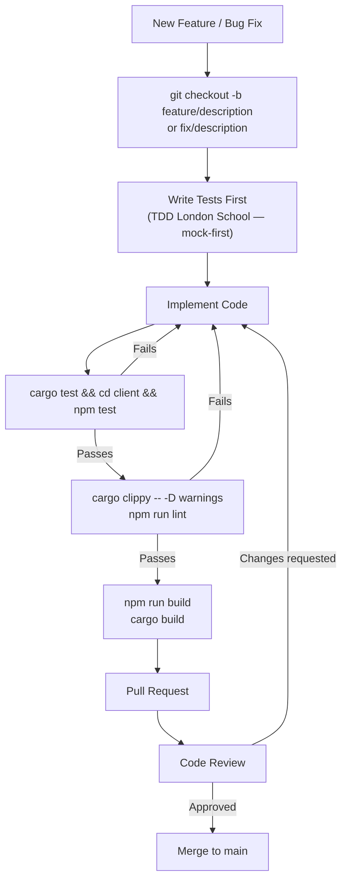
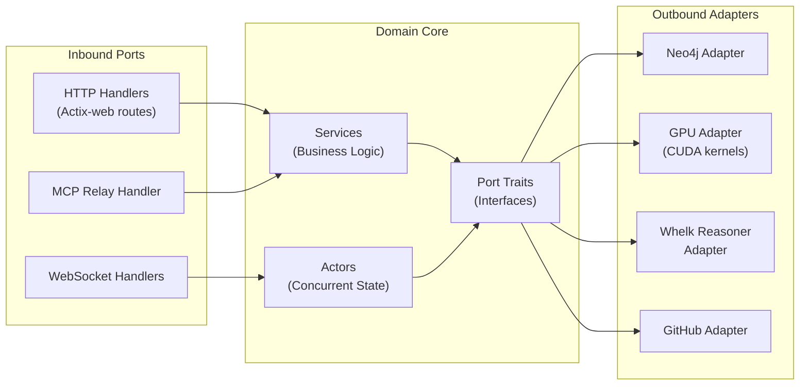
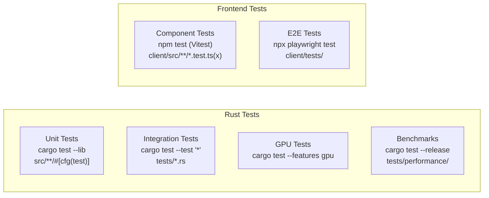
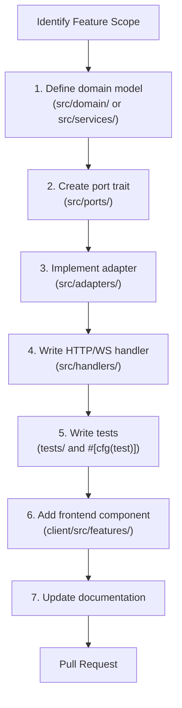
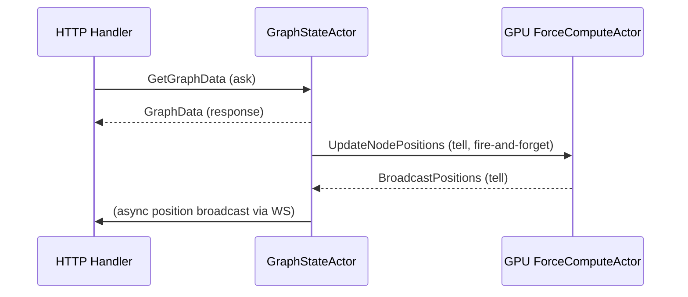

# VisionClaw Development Guide

## Table of Contents

1. [Development Environment Setup](#development-environment-setup)
2. [Project Structure](#project-structure)
3. [Development Workflow](#development-workflow)
4. [Backend Development (Rust)](#backend-development-rust)
5. [Frontend Development (React + Three.js)](#frontend-development-react--threejs)
6. [Testing](#testing)
7. [Adding New Features](#adding-new-features)
8. [Common Patterns](#common-patterns)
9. [Code Style](#code-style)
10. [Debugging](#debugging)

---

## 1. Development Environment Setup

### Required Toolchain Versions

| Tool | Required Version | Purpose |
|------|-----------------|---------|
| Docker Engine | 24+ | Container runtime |
| Docker Compose | V2 (`docker compose`) | Multi-container orchestration |
| Rust | 1.70+ (stable) | Backend language |
| Node.js | 18.x or 20.x LTS | Frontend build tooling |
| npm | 9.x+ | Package management |
| Git | 2.30+ | Version control |

Optional:
- Python 3.10+ (MCP tooling in `multi-agent-docker/`)
- NVIDIA CUDA 12.4 drivers + Container Toolkit (GPU physics)

### Install Rust

```bash
# Install via rustup
curl --proto '=https' --tlsv1.2 -sSf https://sh.rustup.rs | sh

# Add required components
rustup component add clippy rustfmt

# Verify
rustup show
```

### Install Node.js

```bash
# Use nvm for version management
curl -o- https://raw.githubusercontent.com/nvm-sh/nvm/v0.39.0/install.sh | bash
nvm install 20
nvm use 20

# Verify
node --version
npm --version
```

### Clone and Bootstrap

```bash
# Clone
git clone --recursive https://github.com/your-org/VisionClaw.git
cd VisionClaw

# Create the shared network
docker network create docker_ragflow

# Configure environment
cp .env.example .env
# Edit .env -- minimum: set NEO4J_PASSWORD and JWT_SECRET
nano .env

# Install frontend dependencies
cd client
npm install
cd ..

# Verify Rust compiles
cargo check
```

### Start the Development Stack

```bash
docker compose -f docker-compose.unified.yml --profile dev up -d

# Wait for health checks (~40s), then verify
docker compose -f docker-compose.unified.yml --profile dev ps
curl http://localhost:3001/api/health
```

| URL | Purpose |
|-----|---------|
| `http://localhost:3001` | VisionClaw UI (via Nginx) |
| `http://localhost:3001/api/health` | Backend health check |
| `http://localhost:7474` | Neo4j Browser |
| `ws://localhost:3001/wss` | Graph data WebSocket |
| `ws://localhost:3001/ws/speech` | Voice WebSocket |

### IDE Setup

**VS Code** (recommended): create `.vscode/settings.json`:

```json
{
  "editor.formatOnSave": true,
  "editor.codeActionsOnSave": {
    "source.fixAll.eslint": true
  },
  "rust-analyzer.cargo.features": ["all"],
  "[typescript]": {
    "editor.defaultFormatter": "esbenp.prettier-vscode"
  },
  "[rust]": {
    "editor.defaultFormatter": "rust-lang.rust-analyzer"
  },
  "files.watcherExclude": {
    "**/target/**": true,
    "**/node_modules/**": true,
    "**/dist/**": true
  }
}
```

**Recommended extensions:**
- `rust-lang.rust-analyzer` — Rust language support with inline types
- `esbenp.prettier-vscode` — TypeScript/React formatting
- `dbaeumer.vscode-eslint` — ESLint integration
- `ms-azuretools.vscode-docker` — Container management
- `eamodio.gitlens` — Git history and blame
- `rangav.vscode-thunder-client` — API testing

---

## 2. Project Structure

VisionClaw is a Rust/Actix-web backend with a React 19 + Three.js frontend, Neo4j graph database, and CUDA GPU physics kernels. The backend follows hexagonal (ports and adapters) architecture.

### Repository Root

```
VisionClaw/
├── Cargo.toml                   # Rust workspace manifest
├── Cargo.lock                   # Locked dependency versions
├── build.rs                     # Build script (PTX compilation, CUDA codegen)
├── docker-compose.unified.yml   # Primary compose file
├── docker-compose.voice.yml     # Voice pipeline overlay
├── Dockerfile.dev               # Development image
├── Dockerfile.production        # Production image (pre-compiled, opt-level=3)
├── nginx.conf / nginx.dev.conf / nginx.production.conf
├── supervisord.dev.conf / supervisord.production.conf
│
├── src/                         # Rust backend source
├── client/                      # React + Three.js frontend
├── tests/                       # Backend integration tests
├── multi-agent-docker/          # Multi-agent Docker infrastructure
├── scripts/                     # Build and utility scripts
├── docs/                        # Documentation (Diataxis structure)
├── schema/                      # Database and API schema definitions
├── config/                      # Runtime configuration files
├── data/                        # Default data, ontology examples, settings
├── whelk-rs/                    # Whelk OWL reasoning engine (subcrate)
└── output/                      # Build artifacts
```

### Rust Backend (`src/`)

```
src/
├── main.rs                      # Entry point, Actix-web server bootstrap
├── lib.rs                       # Library root and module re-exports
├── app_state.rs                 # Arc-wrapped shared application state
│
├── ports/                       # Hexagonal architecture: port trait definitions
│   ├── graph_repository.rs      # Graph persistence trait
│   ├── ontology_repository.rs   # Ontology storage trait
│   ├── physics_simulator.rs     # Physics simulation trait
│   ├── gpu_physics_adapter.rs   # GPU physics computation trait
│   └── inference_engine.rs      # OWL inference engine trait
│
├── adapters/                    # Concrete port implementations
│   ├── neo4j_adapter.rs         # Neo4j database driver
│   ├── actix_physics_adapter.rs # Actix actor-based physics
│   ├── whelk_inference_engine.rs # Whelk OWL reasoner
│   └── gpu_semantic_analyzer.rs # GPU-accelerated semantic adapter
│
├── handlers/                    # HTTP and WebSocket request handlers
│   ├── graph_state_handler.rs   # Graph CRUD
│   ├── physics_handler.rs       # Physics parameter endpoints
│   ├── settings_handler.rs      # Settings read/write
│   ├── ontology_handler.rs      # Ontology management
│   ├── socket_flow_handler.rs   # Binary WebSocket stream
│   ├── speech_socket_handler.rs # Voice/STT/TTS socket
│   ├── mcp_relay_handler.rs     # MCP protocol relay
│   └── consolidated_health_handler.rs
│
├── services/                    # Domain/business logic
│   ├── github/                  # GitHub sync and PR services
│   ├── ontology_reasoning_service.rs
│   ├── semantic_analyzer.rs
│   ├── speech_service.rs
│   ├── ragflow_service.rs
│   └── github_sync_service.rs
│
└── actors/                      # Actix actor system
    ├── graph_state_actor.rs      # Graph state management
    ├── physics_orchestrator_actor.rs # Physics tick loop
    ├── client_coordinator_actor.rs   # WebSocket sessions
    ├── ontology_actor.rs         # Ontology lifecycle
    └── gpu/                     # GPU-specific actors (ForceComputeActor, etc.)
```

### React Frontend (`client/`)

```
client/
├── src/
│   ├── components/              # Shared UI components
│   ├── features/
│   │   ├── graph/               # Core graph rendering (GraphManager, GraphCanvas)
│   │   ├── settings/            # Settings panel and configuration
│   │   └── ontology/            # Ontology viewer
│   ├── hooks/                   # Custom React hooks
│   │   ├── useWasmSceneEffects.ts
│   │   └── useGraphData.ts
│   ├── workers/                 # Web Workers for off-thread computation
│   ├── wasm/                    # WASM module bindings
│   └── api/                     # REST and WebSocket clients
│
└── crates/                      # Rust WASM crates (compiled to client/src/wasm/)
    └── scene-effects/           # Particle and visual effects
```

### Key Configuration Files

| File | Purpose |
|------|---------|
| `data/settings.yaml` | Runtime graph and physics defaults |
| `config/livekit.yaml` | LiveKit SFU configuration |
| `ontology_physics.toml` | Physics-ontology force mapping rules |
| `config.yml` | Application runtime configuration |

---

## 3. Development Workflow

### Branch and Commit Strategy



### Branch Naming Convention

| Type | Pattern | Example |
|------|---------|---------|
| Feature | `feature/description` | `feature/add-ontology-clustering` |
| Bug fix | `fix/description` | `fix/edge-hash-dedup` |
| Hotfix | `hotfix/description` | `hotfix/gpu-memory-overflow` |
| Refactor | `refactor/description` | `refactor/extract-instanced-labels` |
| Docs | `docs/description` | `docs/update-actor-guide` |

### Commit Message Convention (Conventional Commits)

```
<type>(<scope>): <subject>

# Types
feat:      New feature
fix:       Bug fix
docs:      Documentation only
refactor:  Code restructuring without behaviour change
test:      Adding or updating tests
chore:     Maintenance (deps, CI, tooling)
perf:      Performance improvement
```

Examples:

```bash
git commit -m "feat(graph): add ontology-driven edge clustering"
git commit -m "fix(gpu): periodic full broadcast when physics converges"
git commit -m "test(ontology): add transitive inference integration test"
```

### Hot Reload Behaviour

In the `dev` profile, source directories are mounted read-only into the container:

- **Rust changes**: The entrypoint script detects file changes and triggers `cargo build`. Incremental builds use the `cargo-target-cache` volume. Typical rebuild: 15–60 seconds.
- **TypeScript/React changes**: Vite HMR picks up changes instantly (< 1 second) via port 24678.

Manually trigger a Rust rebuild:

```bash
docker compose exec visionclaw_container /app/scripts/dev-rebuild-rust.sh
```

Shell into the container:

```bash
docker exec -it visionclaw_container bash
```

---

## 4. Backend Development (Rust)

### Hexagonal Architecture



### Adding a New HTTP Handler

1. Define the handler function in `src/handlers/`:

```rust
// src/handlers/my_feature_handler.rs
use actix_web::{web, HttpResponse};
use serde::{Deserialize, Serialize};
use crate::app_state::AppState;

#[derive(Deserialize)]
pub struct MyRequest {
    pub node_id: String,
}

#[derive(Serialize)]
pub struct MyResponse {
    pub result: String,
}

pub async fn handle_my_feature(
    state: web::Data<AppState>,
    params: web::Json<MyRequest>,
) -> HttpResponse {
    // Validate input
    // Call service
    // Return response
    HttpResponse::Ok().json(MyResponse {
        result: format!("processed {}", params.node_id),
    })
}
```

2. Register the route in `src/main.rs` or the appropriate `api_handler/` file:

```rust
.route("/api/my-feature", web::post().to(my_feature_handler::handle_my_feature))
```

3. Write tests in `tests/` or inline `#[cfg(test)]` modules.

### Adding a New Actix Actor

```rust
// src/actors/my_actor.rs
use actix::prelude::*;

pub struct MyActor {
    pub state: Vec<String>,
}

impl Actor for MyActor {
    type Context = Context<Self>;

    fn started(&mut self, _ctx: &mut Context<Self>) {
        log::info!("MyActor started");
    }
}

// Define a message
#[derive(Message)]
#[rtype(result = "String")]
pub struct ProcessItem {
    pub item: String,
}

// Handle the message
impl Handler<ProcessItem> for MyActor {
    type Result = String;

    fn handle(&mut self, msg: ProcessItem, _ctx: &mut Context<Self>) -> String {
        self.state.push(msg.item.clone());
        format!("processed: {}", msg.item)
    }
}
```

Spawn from `GraphServiceSupervisor` or `app_state`:

```rust
let addr = MyActor { state: vec![] }.start();
```

### Port/Adapter Pattern

Define a port trait in `src/ports/`:

```rust
// src/ports/my_port.rs
use async_trait::async_trait;

#[async_trait]
pub trait MyPort: Send + Sync {
    async fn fetch(&self, id: &str) -> anyhow::Result<String>;
}
```

Implement an adapter in `src/adapters/`:

```rust
// src/adapters/my_adapter.rs
use async_trait::async_trait;
use crate::ports::my_port::MyPort;

pub struct MyAdapter {
    // dependencies
}

#[async_trait]
impl MyPort for MyAdapter {
    async fn fetch(&self, id: &str) -> anyhow::Result<String> {
        // concrete implementation
        Ok(format!("data for {}", id))
    }
}
```

### Error Handling

Use `thiserror` for domain errors, `anyhow` for propagation:

```rust
use thiserror::Error;

#[derive(Error, Debug)]
pub enum GraphError {
    #[error("node not found: {0}")]
    NodeNotFound(String),
    #[error("Neo4j error: {0}")]
    DatabaseError(#[from] neo4rs::Error),
}
```

In handlers, map domain errors to HTTP responses:

```rust
match service.get_node(&id).await {
    Ok(node) => HttpResponse::Ok().json(node),
    Err(GraphError::NodeNotFound(id)) => HttpResponse::NotFound().body(id),
    Err(e) => {
        log::error!("internal error: {}", e);
        HttpResponse::InternalServerError().finish()
    }
}
```

### Serialization with Serde

Use `rename_all` to bridge Rust snake_case to TypeScript camelCase:

```rust
#[derive(Serialize, Deserialize)]
#[serde(rename_all = "camelCase")]
pub struct GraphNode {
    pub node_id: String,           // serialises as "nodeId"
    pub label: String,
    pub owl_class_iri: Option<String>, // serialises as "owlClassIri"
}
```

For optional fields with custom defaults:

```rust
#[serde(default, skip_serializing_if = "Option::is_none")]
pub metadata: Option<serde_json::Value>,
```

---

## 5. Frontend Development (React + Three.js)

### Component Conventions

Components follow a co-location pattern: a component and its hook live in the same directory.

```typescript
// client/src/features/graph/components/MyComponent/
// ├── MyComponent.tsx          — component
// ├── useMyComponent.ts        — hook with logic
// └── index.ts                 — re-export
```

### Three.js Rendering Patterns

VisionClaw renders the graph in a `useFrame` loop via `@react-three/fiber`. Positions are read from a SharedArrayBuffer (SAB) written by the Rust backend over WebSocket:

```typescript
// Two-phase useFrame pattern (from InstancedLabels)
useFrame(() => {
    const positions = nodePositionsRef?.current;
    if (!positions) return;

    // Phase 1 (every frame): patch positions from SAB
    for (let i = 0; i < nodeCount; i++) {
        const offset = i * 3;
        instancedMesh.setMatrixAt(i, computeMatrix(
            positions[offset],
            positions[offset + 1],
            positions[offset + 2]
        ));
    }
    instancedMesh.instanceMatrix.needsUpdate = true;

    // Phase 2 (every N frames): full layout rebuild
    if (frameCount % 3 === 0) {
        rebuildLayout(positions);
    }
});
```

Key rendering rules:
- Capture `nodePositionsRef.current` once at the top of `useFrame`; never mid-frame.
- Use `InstancedMesh` for nodes and edges to avoid per-object draw calls.
- Keep `GraphManager.tsx` under 500 lines — extract into hooks and sub-components.

### WASM Integration

The scene-effects WASM module pattern:

```typescript
// Bridge at scene-effects-bridge.ts
import init, { SceneEffects } from '../wasm/scene-effects/scene_effects';

let wasmModule: SceneEffects | null = null;

export async function initWasm() {
    await init();
    wasmModule = SceneEffects.new();
}

// Zero-copy: WASM exposes raw pointers
export function getParticlePositions(): Float32Array {
    if (!wasmModule) return new Float32Array(0);
    const ptr = wasmModule.get_positions_ptr();
    const len = wasmModule.get_positions_len();
    return new Float32Array(wasmModule.memory().buffer, ptr, len);
}
```

### WebSocket Binary Protocol

The graph position stream uses a compact binary format. Consumption pattern:

```typescript
ws.onmessage = (event: MessageEvent) => {
    if (event.data instanceof ArrayBuffer) {
        const view = new DataView(event.data);
        const nodeCount = view.getUint32(0, true);
        for (let i = 0; i < nodeCount; i++) {
            const base = 4 + i * 16; // 4-byte header + 16 bytes per node
            const nodeId = view.getUint32(base, true);
            const x = view.getFloat32(base + 4, true);
            const y = view.getFloat32(base + 8, true);
            const z = view.getFloat32(base + 12, true);
            // write into SAB at nodeId * 3
        }
    }
};
```

### TypeScript Typing Patterns

Define typed request/response interfaces at API boundaries. Never use `any`:

```typescript
// DO: Typed interfaces
export interface StartSimulationRequest {
    time_step?: number;
    damping?: number;
    spring_constant?: number;
}

export interface StartSimulationResponse {
    simulation_id: string;
    status: 'starting' | 'running' | 'stopped';
}

// DON'T: implicit any
const data = await fetch('/api/physics/start').then(r => r.json()); // avoid
```

---

## 6. Testing

### Test Infrastructure Overview



### Running Rust Tests

```bash
# All Rust tests
cargo test

# With stdout visible (useful for debugging)
cargo test -- --nocapture

# Specific test file
cargo test --test ontology_smoke_test

# Pattern matching
cargo test settings_validation

# With features
cargo test --features ontology,gpu

# Release mode (for benchmarks)
cargo test --features ontology --release --test reasoning-benchmark -- --nocapture

# Inside Docker container
docker exec -it visionclaw_container bash
cargo test -- --nocapture
```

### Key Integration Test Files

| File | Coverage |
|------|---------|
| `tests/ontology_smoke_test.rs` | Ontology loading and OWL parsing |
| `tests/ontology_agent_integration_test.rs` | Ontology actor lifecycle |
| `tests/ontology_reasoning_integration_test.rs` | Whelk reasoning engine |
| `tests/neo4j_settings_integration_tests.rs` | Settings persistence to Neo4j |
| `tests/settings_validation_tests.rs` | Settings schema validation |
| `tests/voice_agent_integration_test.rs` | Voice pipeline integration |
| `tests/gpu_safety_tests.rs` | GPU memory management and fallback |
| `tests/mcp_parsing_tests.rs` | MCP message parsing |

### Running Frontend Tests

```bash
cd client

# Run all tests once
npm test

# Watch mode (re-runs on changes)
npm run test:watch

# With coverage report
npm run test:coverage

# Interactive Vitest UI
npm run test:ui
```

Vitest uses `jsdom` for DOM simulation and `@testing-library/react` for components. Dev dependencies: `tokio-test`, `mockall`, `pretty_assertions`, `tempfile`, `actix-rt`.

Example component test:

```typescript
import { render, screen } from '@testing-library/react';
import { SettingsPanel } from './SettingsPanel';

describe('SettingsPanel', () => {
    it('renders physics controls', () => {
        render(<SettingsPanel />);
        expect(screen.getByText('Physics')).toBeInTheDocument();
    });
});
```

### Playwright E2E Tests

```bash
cd client

# Run all E2E tests
npx playwright test

# With visible browser
npx playwright test --headed

# Show report
npx playwright show-report
```

### GPU Tests

GPU tests are feature-gated and require NVIDIA hardware:

```bash
cargo test --features gpu -- gpu
cargo test --test gpu_memory_manager_test
cargo test --test gpu_safety_tests
```

See `tests/README_GPU_TESTS.md` for hardware requirements and skip conditions.

### WebSocket Testing

```bash
# Manual testing with wscat
npx wscat -c ws://localhost:3001/wss
> {"type":"subscribe","channel":"graph"}

# Automated WebSocket tests
cargo test --test test_websocket_rate_limit
cargo test --test test_wire_format
```

### Full Pre-Commit Test Suite

```bash
# Rust
cargo test --all-features
cargo clippy --all-features -- -D warnings

# Frontend
cd client && npm test && npm run lint

# Build validation
cd .. && cargo build
cd client && npm run build
```

### Performance Targets

| Test Suite | Target | Typical |
|------------|--------|---------|
| Small ontology (10 classes) | < 50 ms | 38 ms |
| Medium ontology (100 classes) | < 500 ms | 245 ms |
| Large ontology (1000 classes) | < 5 s | 4.2 s |
| Constraint generation (100 nodes) | < 100 ms | 12 ms |
| Cache hit | < 10 ms | 1.2 ms |
| E2E pipeline | < 200 ms | 68 ms |

---

## 7. Adding New Features

### Step-by-Step Process



### Worked Example: Adding a New Graph Query

**Step 1 — Define the domain type:**

```rust
// src/domain/clustering.rs
#[derive(Debug, Serialize, Deserialize)]
pub struct ClusterResult {
    pub cluster_id: u32,
    pub node_ids: Vec<String>,
    pub centroid: [f32; 3],
}
```

**Step 2 — Create the port trait:**

```rust
// src/ports/clustering_port.rs
#[async_trait]
pub trait ClusteringPort: Send + Sync {
    async fn compute_clusters(
        &self,
        min_cluster_size: usize,
    ) -> anyhow::Result<Vec<ClusterResult>>;
}
```

**Step 3 — Implement the adapter** (uses Neo4j or in-memory):

```rust
// src/adapters/clustering_adapter.rs
#[async_trait]
impl ClusteringPort for Neo4jClusteringAdapter {
    async fn compute_clusters(&self, min_cluster_size: usize) -> anyhow::Result<Vec<ClusterResult>> {
        // query Neo4j or compute in-memory
    }
}
```

**Step 4 — Register in AppState** (`src/app_state.rs`):

```rust
pub clustering: Arc<dyn ClusteringPort>,
```

**Step 5 — Write the handler:**

```rust
// src/handlers/clustering_handler.rs
pub async fn get_clusters(
    state: web::Data<AppState>,
    query: web::Query<ClusterQuery>,
) -> HttpResponse {
    match state.clustering.compute_clusters(query.min_size).await {
        Ok(clusters) => HttpResponse::Ok().json(clusters),
        Err(e) => HttpResponse::InternalServerError().body(e.to_string()),
    }
}
```

**Step 6 — Write tests** (`tests/clustering_test.rs`):

```rust
#[tokio::test]
async fn test_cluster_min_size() {
    let adapter = InMemoryClusteringAdapter::with_test_data();
    let result = adapter.compute_clusters(2).await.unwrap();
    assert!(!result.is_empty());
    assert!(result.iter().all(|c| c.node_ids.len() >= 2));
}
```

**Step 7 — Add the frontend component** in `client/src/features/clustering/`.

---

## 8. Common Patterns

### Actor Message Passing



Pattern for request-response via actor:

```rust
// From a handler, send to actor with timeout
let result = graph_state_actor
    .send(GetGraphData { filter: None })
    .await
    .map_err(|e| actix_web::error::ErrorInternalServerError(e))?;
```

### Event Sourcing for State Changes

State changes go through actors as events, never direct mutation:

```rust
// DO: send a message to the actor
physics_actor.do_send(UpdateSimParams { params: new_params });

// DON'T: mutate shared state directly
state.sim_params.lock().unwrap().damping = 0.9; // avoid
```

### Repository Pattern

All Neo4j queries go through the `GraphRepository` adapter, not raw Cypher in handlers:

```rust
// Via port trait
let nodes = state.graph_repo.get_all_nodes().await?;

// Never call Neo4j directly from a handler
```

### Builder Pattern for Complex Types

```rust
let sim_params = SimParams::builder()
    .time_step(0.016)
    .damping(0.85)
    .spring_constant(0.1)
    .repulsion_strength(50.0)
    .build()
    .expect("invalid sim params");
```

### Error Propagation

Use `?` with `anyhow::Result` in services and adapters. Map to `HttpResponse` only in handlers:

```rust
// In service (propagate freely)
pub async fn process(&self, id: &str) -> anyhow::Result<Data> {
    let raw = self.repo.fetch(id).await?;
    let parsed = parse(raw)?;
    Ok(parsed)
}

// In handler (map to HTTP)
match self.service.process(&id).await {
    Ok(data) => HttpResponse::Ok().json(data),
    Err(e) => {
        log::error!("{:?}", e);
        HttpResponse::InternalServerError().finish()
    }
}
```

---

## 9. Code Style

### Rust

- Formatting: `rustfmt` (run automatically via `cargo fmt`)
- Linting: `cargo clippy -- -D warnings` (zero warnings policy)
- Naming: `snake_case` for functions/variables, `CamelCase` for types/traits
- File size: keep files under 500 lines; extract modules when approaching limit
- Document public APIs with `///` doc comments

```bash
# Format
cargo fmt

# Lint (CI enforces this)
cargo clippy --all-features -- -D warnings
```

### TypeScript / React

- Formatter: Prettier (`.prettierrc`)
- Linter: ESLint (`eslint.config.mjs`)
- Naming: `camelCase` for functions/variables, `PascalCase` for components/types
- Hooks prefix: `use` prefix mandatory (e.g., `useGraphData`)
- No `any` types in new code

```bash
# Format
npm run format

# Lint
npm run lint

# Lint fix
npm run lint:fix

# Type check
npm run typecheck
```

### Prettier Config (`.prettierrc`)

```json
{
    "semi": true,
    "trailingComma": "es5",
    "singleQuote": true,
    "printWidth": 100,
    "tabWidth": 2
}
```

### Pre-commit Hooks (Husky)

```bash
# Install hooks
npm run prepare

# Hooks run automatically:
# pre-commit: cargo fmt, cargo clippy, npm run lint, npm run typecheck
# pre-push: cargo test, npm test
```

### Pull Request Guidelines

- Keep PRs focused: one feature or fix per PR
- Include tests for new functionality
- Update `CHANGELOG.md` for user-visible changes
- All CI checks must pass before merge
- Two approvals required for main-branch merges

---

## 10. Debugging

### Rust Backend

```bash
# Enable detailed logging
RUST_LOG=debug docker compose -f docker-compose.unified.yml --profile dev up -d

# Target specific modules
RUST_LOG=visionclaw::actors=debug,visionclaw::handlers=info cargo run

# With backtrace on panic
RUST_BACKTRACE=1 cargo test test_name -- --nocapture

# Actor message tracing
RUST_LOG=actix=debug cargo run
```

Inside container:

```bash
docker exec -it visionclaw_container bash
RUST_LOG=debug cargo test failing_test -- --nocapture
```

### React Frontend

Launch with React DevTools (install the browser extension), then:

```typescript
// Temporary debug output in useFrame
useFrame(() => {
    if (frameCount % 60 === 0) {
        console.debug('[GraphManager] node count:', nodeCount, 'frame:', frameCount);
    }
});
```

For WebSocket debugging:

```bash
# Inspect binary WebSocket frames in browser DevTools:
# Network tab → filter by WS → click the connection → Messages tab
# Each message shows raw bytes; use a hex viewer for binary frames
```

### VS Code Debugger Configuration

`.vscode/launch.json` for Node/TypeScript:

```json
{
    "version": "0.2.0",
    "configurations": [
        {
            "type": "node",
            "request": "launch",
            "name": "Debug Tests",
            "program": "${workspaceFolder}/client/node_modules/vitest/vitest.mjs",
            "args": ["--run", "--reporter=verbose"],
            "console": "integratedTerminal",
            "env": {
                "NODE_ENV": "test"
            }
        }
    ]
}
```

### GPU Debugging

```bash
# Real-time GPU metrics
nvidia-smi dmon -s pucvmet

# Check CUDA kernel launch errors (set in .env)
RUST_LOG=visionclaw::actors::gpu=trace

# GPU memory breakdown
nvidia-smi --query-compute-apps=pid,used_memory --format=csv

# PTX version mismatch diagnosis
# build.rs downgrades .version automatically for driver compatibility
docker logs visionclaw_container 2>&1 | grep -i "ptx\|cuda\|nvcc"
```

### Common Debug Scenarios

**Node positions stuck at origin**: the worker received the pre-position `data` instead of `dataWithPositions`. Check that `handleGraphUpdate` return value is used when calling `postMessage` to the physics worker.

**Edges disappear after N frames**: hash deduplication bug. Ensure `updatePoints` in `GlassEdges` always recomputes matrices (remove length-based hash check).

**Rust actor mailbox overflow**: increase mailbox size or add backpressure. Check `RUST_LOG=actix=warn` for dropped messages.

**Settings change: only some nodes move**: expected behaviour for dense subgraphs. Increase `reheat_factor` in physics params and verify `suppress_intermediate_broadcasts=false`.

---

## See Also

- [Deployment Guide](./deployment-guide.md) — Docker Compose deployment reference
- [Actor System Guide](./development/actor-system.md) — Actix actor patterns in depth
- [Testing Guide](./development/testing-guide.md) — Full test suite reference
- [Docker Environment Setup](./deployment/docker-environment-setup.md) — Local dev container setup
- [Project Structure](./development/02-project-structure.md) — Complete directory reference (46 KB)

---

*Updated: 2026-04-09*
