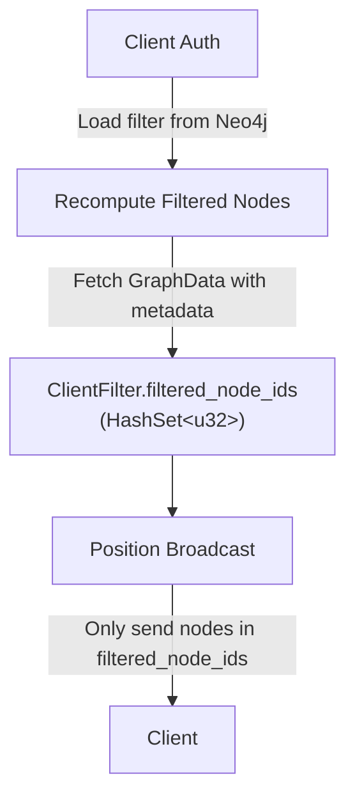

# Client-Side Filtering Implementation

## Overview

The client-side filtering feature allows authenticated clients to filter which graph nodes are visible based on quality and authority scores stored in node metadata.

## Architecture

### Components

1. **ClientFilter** (`src/actors/client_coordinator_actor.rs`)
   - Per-client filter configuration
   - Stores threshold settings and filtered node IDs
   - Persisted to Neo4j for authenticated users

2. **Filter Logic** (`src/actors/client_filter.rs`)
   - `recompute_filtered_nodes()` - Main filtering function
   - `node_passes_filter()` - Helper for individual node checks

3. **Integration Points**
   - Client authentication: Load saved filter
   - Filter updates: Recompute when client changes settings
   - Position broadcasts: Apply filter before sending to client

## Data Flow



## Filter Criteria

### Metadata Fields

Nodes store quality metrics in metadata:
```rust
pub struct Metadata {
    pub quality_score: Option<f64>,    // 0.0-1.0
    pub authority_score: Option<f64>,  // 0.0-1.0
    // ... other fields
}
```

### Filter Configuration

```rust
pub struct ClientFilter {
    pub enabled: bool,
    pub quality_threshold: f64,        // Default: 0.7
    pub authority_threshold: f64,      // Default: 0.5
    pub filter_by_quality: bool,       // Default: true
    pub filter_by_authority: bool,     // Default: false
    pub filter_mode: FilterMode,       // And/Or
    pub max_nodes: Option<usize>,      // Default: Some(10000)
    pub filtered_node_ids: HashSet<u32>, // Computed
}
```

### Filter Modes

- **And Mode**: Node must pass BOTH quality AND authority thresholds
- **Or Mode**: Node must pass EITHER quality OR authority threshold

## Implementation

### Filtering Algorithm

```rust
pub fn recompute_filtered_nodes(
    filter: &mut ClientFilter,
    graph_data: &GraphData
) {
    filter.filtered_node_ids.clear();

    if !filter.enabled {
        // All nodes visible
        for node in &graph_data.nodes {
            filter.filtered_node_ids.insert(node.id);
        }
        return;
    }

    let mut candidates = Vec::new();

    for node in &graph_data.nodes {
        let metadata = graph_data.metadata.get(&node.metadata_id);

        let quality = metadata
            .and_then(|m| m.quality_score)
            .unwrap_or(0.5);

        let authority = metadata
            .and_then(|m| m.authority_score)
            .unwrap_or(0.5);

        let passes_quality = !filter.filter_by_quality
            || quality >= filter.quality_threshold;
        let passes_authority = !filter.filter_by_authority
            || authority >= filter.authority_threshold;

        let passes = match filter.filter_mode {
            FilterMode::And => passes_quality && passes_authority,
            FilterMode::Or => passes_quality || passes_authority,
        };

        if passes {
            candidates.push((node.id, quality, authority));
        }
    }

    // Apply max_nodes limit
    if let Some(max) = filter.max_nodes {
        if candidates.len() > max {
            // Sort by combined score (quality * authority) DESC
            candidates.sort_by(|a, b| {
                let score_a = a.1 * a.2;
                let score_b = b.1 * b.2;
                score_b.partial_cmp(&score_a)
                    .unwrap_or(std::cmp::Ordering::Equal)
            });
            candidates.truncate(max);
        }
    }

    for (node_id, _, _) in candidates {
        filter.filtered_node_ids.insert(node_id);
    }
}
```

## WebSocket Protocol

### Client Authentication

```json
{
  "type": "authenticate",
  "token": "session_token",
  "pubkey": "nostr_pubkey"
}
```

Response:
```json
{
  "type": "authenticate_success",
  "pubkey": "nostr_pubkey",
  "is_power_user": false
}
```

### Filter Update

```json
{
  "type": "filter_update",
  "filter": {
    "enabled": true,
    "quality_threshold": 0.8,
    "authority_threshold": 0.7,
    "filter_by_quality": true,
    "filter_by_authority": true,
    "filter_mode": "and",
    "max_nodes": 5000
  }
}
```

Response:
```json
{
  "type": "filter_update_success",
  "enabled": true,
  "timestamp": 1234567890
}
```

## Call Points

### 1. Client Authentication Handler

When a client authenticates:
```rust
impl Handler<AuthenticateClient> for ClientCoordinatorActor {
    fn handle(&mut self, msg: AuthenticateClient, ctx: &mut Self::Context) {
        // ... set client.pubkey, client.is_power_user

        // TODO: Load saved filter from Neo4j

        // Recompute if filter enabled
        if client.filter.enabled {
            // Fetch graph data and recompute
        }
    }
}
```

### 2. Filter Update Handler

When a client updates their filter:
```rust
impl Handler<UpdateClientFilter> for ClientCoordinatorActor {
    fn handle(&mut self, msg: UpdateClientFilter, ctx: &mut Self::Context) {
        // Update filter settings
        client.filter.enabled = msg.enabled;
        client.filter.quality_threshold = msg.quality_threshold;
        // ... etc

        // Recompute filtered nodes with new settings
        recompute_filtered_nodes(&mut client.filter, &graph_data);

        // TODO: Save to Neo4j
    }
}
```

### 3. Position Broadcasting

When broadcasting positions:
```rust
pub fn broadcast_with_filter(&self, positions: &[BinaryNodeDataClient]) {
    for (_, client_state) in &self.clients {
        let filtered_positions = if client_state.filter.enabled {
            positions.iter()
                .filter(|pos| client_state.filter
                    .filtered_node_ids.contains(&pos.node_id))
                .copied()
                .collect::<Vec<_>>()
        } else {
            positions.to_vec()
        };

        if !filtered_positions.is_empty() {
            let binary_data = self.serialize_positions(&filtered_positions);
            client_state.addr.do_send(SendToClientBinary(binary_data));
        }
    }
}
```

## Default Values

Nodes without metadata receive default scores:
- **quality_score**: `0.5`
- **authority_score**: `0.5`

This ensures nodes without explicit scores are treated neutrally.

## Testing

Tests are located in `src/actors/client_filter.rs`:

- `test_filter_disabled_shows_all` - Filter off shows all nodes
- `test_filter_by_quality_only` - Quality-only filtering
- `test_filter_by_authority_only` - Authority-only filtering
- `test_filter_and_mode` - AND mode requires both thresholds
- `test_filter_or_mode` - OR mode requires either threshold
- `test_max_nodes_limit` - Truncation by max_nodes
- `test_default_values_for_missing_metadata` - Default score handling

Run tests:
```bash
cargo test --lib client_filter
```

## Example Usage

### Power User Filtering High-Quality Content

```json
{
  "enabled": true,
  "quality_threshold": 0.9,
  "authority_threshold": 0.8,
  "filter_by_quality": true,
  "filter_by_authority": true,
  "filter_mode": "and",
  "max_nodes": 1000
}
```

Result: Shows top 1000 nodes with quality ≥ 0.9 AND authority ≥ 0.8

### Basic User Filtering by Quality

```json
{
  "enabled": true,
  "quality_threshold": 0.7,
  "filter_by_quality": true,
  "filter_by_authority": false,
  "filter_mode": "or",
  "max_nodes": 10000
}
```

Result: Shows up to 10,000 nodes with quality ≥ 0.7

## Performance Considerations

- Recomputation is O(n) where n = total nodes
- Triggered only on filter changes and authentication
- Uses HashSet for O(1) lookup during broadcasts
- Max_nodes sorting is O(n log n) but only on filtered candidates

---

## Related Documentation

- [Per-User Settings Implementation](auth-user-settings.md)

- [Nostr Authentication Implementation](nostr-auth.md)
- [XR Architecture](../../explanation/xr-architecture.md)
- [Multi-Agent Docker Environment - Complete Documentation](../infrastructure/../deployment-guide.md)

## Future Enhancements

1. **Incremental Updates**: Only recompute when graph data changes
2. **Filter Presets**: Power users can create named filter presets
3. **Additional Metrics**: Filter by recency, connectivity, domain
4. **Client-Side Caching**: Send filter rules to client for local filtering
5. **Analytics**: Track which filters are most commonly used
