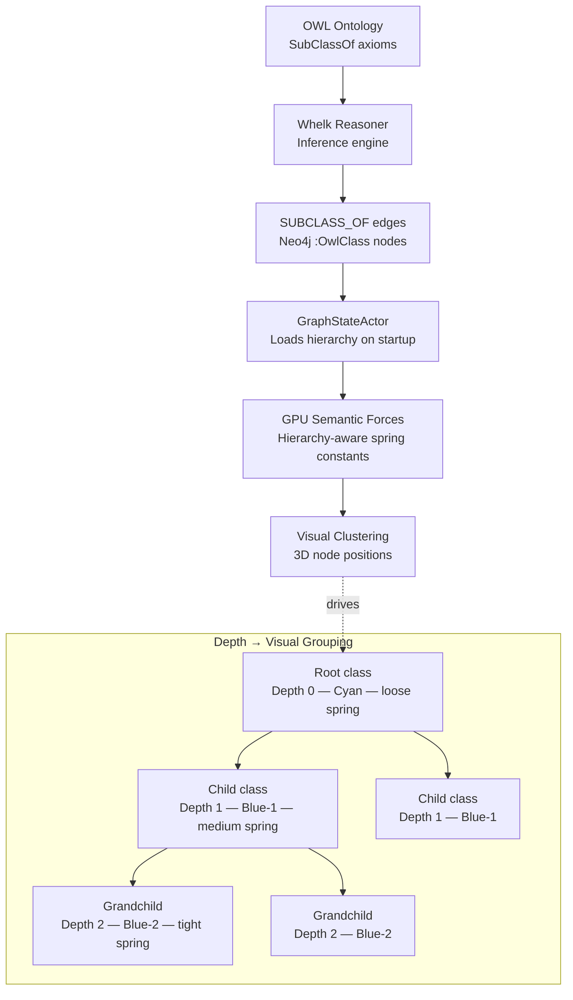
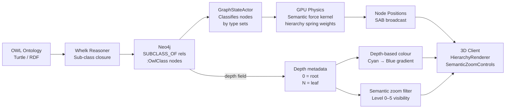

# Quick Integration Guide: Hierarchical Visualization

## Quick Start (5 Minutes)

### Step 1: Import Components

```typescript
// In your main graph canvas component
import { HierarchyRenderer } from '@/features/visualisation/components/HierarchyRenderer';
import { SemanticZoomControls } from '@/features/visualisation/components/ControlPanel/SemanticZoomControls';
import { useHierarchyData } from '@/features/ontology/hooks/useHierarchyData';
```

### Step 2: Add State Management

```typescript
function GraphCanvas() {
  const [semanticZoomLevel, setSemanticZoomLevel] = useState(2);
  const sceneRef = useRef<THREE.Scene>(null);
  const cameraRef = useRef<THREE.Camera>(null);

  // Optional: Use hierarchy data directly
  const { hierarchy, loading } = useHierarchyData({
    ontologyId: 'default',
    autoRefresh: false
  });
```

### Step 3: Add Renderer to Scene

```typescript
  return (
    <div className="graph-container">
      {/* Your existing Canvas */}
      <Canvas>
        <scene ref={sceneRef} />
        <perspectiveCamera ref={cameraRef} />

        {/* ADD THIS: Hierarchy Renderer */}
        {sceneRef.current && cameraRef.current && (
          <HierarchyRenderer
            scene={sceneRef.current}
            camera={cameraRef.current}
            semanticZoomLevel={semanticZoomLevel}
            ontologyId="default"
            onNodeClick={(iri) => {
              console.log('Class clicked:', iri);
              // Add your custom logic here
            }}
            onNodeHover={(iri) => {
              console.log('Class hovered:', iri);
              // Add tooltip logic here
            }}
          />
        )}
      </Canvas>

      {/* ADD THIS: Zoom Controls */}
      <div className="controls-panel">
        <SemanticZoomControls />
      </div>
    </div>
  );
}
```

## OWL Class Hierarchy → Visual Clustering



*OWL class hierarchy maps to depth-coded node colours and spring constants: deeper nodes cluster tightly around their parent in 3D space.*

## Data Flow Diagram

```
┌─────────────────────────────────────────────────────────────────┐
│                        USER INTERACTION                          │
└───────────────┬────────────────────────────┬────────────────────┘
                │                            │
                │ Mouse Click                │ Zoom Slider
                ▼                            ▼
    ┌──────────────────────┐    ┌─────────────────────────┐
    │  HierarchyRenderer   │    │ SemanticZoomControls    │
    │  (THREE.js Scene)    │    │  (UI Component)         │
    └──────────┬───────────┘    └──────────┬──────────────┘
               │                           │
               │ Toggle Expansion          │ Set Zoom Level
               ▼                           ▼
    ┌──────────────────────┐    ┌─────────────────────────┐
    │  useExpansionState   │    │   semanticZoomLevel     │
    │  (Collapse/Expand)   │    │   (0-5 visibility)      │
    └──────────────────────┘    └─────────────────────────┘
                          │     │
                          ▼     ▼
                ┌──────────────────────────┐
                │   Scene Rebuild          │
                │   (Filter by depth)      │
                └────────────┬─────────────┘
                             │
                             ▼
                ┌──────────────────────────┐
                │  useHierarchyData        │
                │  (Fetch from Backend)    │
                └────────────┬─────────────┘
                             │
                             │ GET /api/ontology/hierarchy
                             ▼
                ┌──────────────────────────┐
                │   Backend Reasoning      │
                │   Service (Rust)         │
                └──────────────────────────┘
```

## Visual Design

### Semantic Zoom Levels

```
Level 0: ALL NODES          Level 3: GROUPED
    ●                           ●
   ╱│╲                         ╱│╲
  ● ● ●                       ● ● ●
 ╱│ │╲│╲
● ●●●●●●

Level 1: DETAILED           Level 4: HIGH-LEVEL
    ●                           ●
   ╱│╲                         ╱│╲
  ● ● ●                       ● ● ●
 ╱│ │╲│
● ●●●●●

Level 2: STANDARD           Level 5: TOP CLASSES
    ●                           ●
   ╱│╲                         ╱│╲
  ● ● ●                       ● ● ●
 ╱│ │╲
● ●●●●
```

### Color Scheme (Depth-Based)

```
Depth 0 (Roots):   ████ Cyan    (0x00ffff)
Depth 1:           ████ Blue-1  (0x00ccff)
Depth 2:           ████ Blue-2  (0x0099ff)
Depth 3:           ████ Blue-3  (0x0066ff)
Depth 4:           ████ Blue-4  (0x0033ff)
Depth 5+ (Leaves): ████ Blue    (0x0000ff)

Borders:           ████ White   (0xffffff)
Selected:          ████ Yellow  (0xffff00)
Collapsed:         ████ Gray    (0x888888)
```

## API Reference

### useHierarchyData Hook

```typescript
const {
  hierarchy,      // ClassHierarchy | null
  loading,        // boolean
  error,          // Error | null
  maxDepth,       // number (computed)
  rootCount,      // number (computed)
  totalClasses,   // number (computed)

  // Actions
  refetch,        // () => Promise<void>
  getClassNode,   // (iri: string) => ClassNode | undefined
  getChildren,    // (iri: string) => ClassNode[]
  getAncestors,   // (iri: string) => ClassNode[]
  getDescendants, // (iri: string) => ClassNode[]
  getRootClasses, // () => ClassNode[]
} = useHierarchyData({
  ontologyId: 'default',      // string (optional)
  maxDepth: 10,               // number (optional)
  autoRefresh: false,         // boolean (optional)
  refreshIntervalMs: 30000,   // number (optional)
});
```

### HierarchyRenderer Props

```typescript
<HierarchyRenderer
  scene={sceneRef.current}           // THREE.Scene (required)
  camera={cameraRef.current}         // THREE.Camera (required)
  semanticZoomLevel={2}              // number 0-5 (required)
  ontologyId="default"               // string (optional)
  onNodeClick={(iri) => {}}          // (iri: string) => void (optional)
  onNodeHover={(iri) => {}}          // (iri: string | null) => void (optional)
/>
```

### Backend API

```bash
# Fetch hierarchy
GET /api/ontology/hierarchy?ontology-id=default&max-depth=10

# Response
{
  "rootClasses": ["http://example.org/Thing"],
  "hierarchy": {
    "http://example.org/Thing": {
      "iri": "http://example.org/Thing",
      "label": "Thing",
      "parentIri": null,
      "childrenIris": ["http://example.org/Person"],
      "nodeCount": 100,
      "depth": 0
    }
  }
}
```

## Common Use Cases

### 1. Navigate to Class Details on Click

```typescript
<HierarchyRenderer
  onNodeClick={(iri) => {
    router.push(`/ontology/class/${encodeURIComponent(iri)}`);
  }}
/>
```

### 2. Show Tooltip on Hover

```typescript
const [tooltip, setTooltip] = useState<ClassNode | null>(null);

<HierarchyRenderer
  onNodeHover={(iri) => {
    if (iri && hierarchy) {
      setTooltip(hierarchy.hierarchy[iri]);
    } else {
      setTooltip(null);
    }
  }}
/>

{tooltip && (
  <Tooltip>
    <h3>{tooltip.label}</h3>
    <p>IRI: {tooltip.iri}</p>
    <p>Children: {tooltip.childrenIris.length}</p>
    <p>Depth: {tooltip.depth}</p>
  </Tooltip>
)}
```

### 3. Auto-Zoom Based on Camera Distance

```typescript
useEffect(() => {
  const distance = camera.position.distanceTo(target);

  if (distance < 10) setSemanticZoomLevel(0);      // Close - show all
  else if (distance < 20) setSemanticZoomLevel(1);
  else if (distance < 40) setSemanticZoomLevel(2);
  else if (distance < 80) setSemanticZoomLevel(3);
  else if (distance < 160) setSemanticZoomLevel(4);
  else setSemanticZoomLevel(5);                     // Far - show roots only
}, [camera.position]);
```

### 4. Filter by Search Query

```typescript
const [searchQuery, setSearchQuery] = useState('');

const filteredHierarchy = useMemo(() => {
  if (!hierarchy || !searchQuery) return hierarchy;

  const filtered: ClassHierarchy = {
    rootClasses: [],
    hierarchy: {}
  };

  Object.entries(hierarchy.hierarchy).forEach(([iri, node]) => {
    if (node.label.toLowerCase().includes(searchQuery.toLowerCase())) {
      filtered.hierarchy[iri] = node;
      if (node.parentIri === null) {
        filtered.rootClasses.push(iri);
      }
    }
  });

  return filtered;
}, [hierarchy, searchQuery]);
```

## Performance Tips

### 1. Limit Initial Depth
```typescript
const { hierarchy } = useHierarchyData({
  maxDepth: 3  // Only fetch 3 levels initially
});
```

### 2. Use Semantic Zoom
```typescript
// Start at level 2 (standard view) instead of 0 (all nodes)
const [zoomLevel, setZoomLevel] = useState(2);
```

### 3. Disable Auto-Refresh
```typescript
const { hierarchy } = useHierarchyData({
  autoRefresh: false  // Only refresh manually
});
```

### 4. Throttle Hover Events
```typescript
import { throttle } from 'lodash';

const throttledHover = useMemo(
  () => throttle((iri: string | null) => {
    // Handle hover
  }, 100),
  []
);

<HierarchyRenderer onNodeHover={throttledHover} />
```

## Troubleshooting

### Issue: Hierarchy not rendering

**Check:**
1. `scene` and `camera` refs are not null
2. Backend API is reachable: `GET /api/ontology/hierarchy`
3. Ontology has been loaded in backend
4. Check browser console for errors

**Solution:**
```typescript
{sceneRef.current && cameraRef.current && (
  <HierarchyRenderer ... />
)}
```

### Issue: Nodes not clickable

**Check:**
1. Canvas has `userData.canvas` set
2. Raycaster is working (check console logs)
3. onClick handler is defined

**Solution:**
```typescript
// In your Canvas setup
useEffect(() => {
  if (sceneRef.current) {
    sceneRef.current.userData.canvas = canvasElement;
  }
}, []);
```

### Issue: Poor performance with large graphs

**Solutions:**
1. Increase semantic zoom level (fewer visible nodes)
2. Reduce `maxDepth` in useHierarchyData
3. Disable bounding boxes for collapsed nodes
4. Use LOD (Level of Detail) meshes

### Issue: Labels not visible

**Check:**
1. Labels are created as sprites
2. Font size is appropriate for camera distance
3. Depth testing is enabled

**Solution:**
```typescript
// Adjust label scale based on camera distance
const scale = Math.max(1, camera.position.distanceTo(node.position) / 10);
label.scale.set(4 * scale, 1 * scale, 1);
```

## Hierarchy Integration Flow



*Integration path: OWL axioms travel through Whelk inference, are stored as SUBCLASS_OF edges in Neo4j, drive GPU semantic forces that cluster nodes spatially, and are rendered with depth-coded colours and semantic zoom levels on the client.*

## Additional Resources

- **Full Documentation:** `/home/devuser/workspace/project/client/hierarchical-visualization.md`
- **Backend API:** `/home/devuser/workspace/project/src/handlers/api-handler/ontology/mod.rs` (lines 1001-1154)
- **Hook Source:** `/home/devuser/workspace/project/client/src/features/ontology/hooks/useHierarchyData.ts`
- **Renderer Source:** `/home/devuser/workspace/project/client/src/features/visualisation/components/HierarchyRenderer.tsx`

## Best Practices

1. **Always check refs before rendering:** Ensure `scene` and `camera` are not null
2. **Use semantic zoom:** Start at level 2-3 for better UX
3. **Throttle hover events:** Prevent excessive re-renders
4. **Handle loading states:** Show spinner while hierarchy loads
5. **Error boundaries:** Wrap in ErrorBoundary component
6. **Accessibility:** Add keyboard navigation (future enhancement)
7. **Mobile support:** Consider touch events (future enhancement)

---

**Ready to integrate?** Follow the 3-step Quick Start guide above!

**Questions?** See full documentation in `hierarchical-visualization.md`
