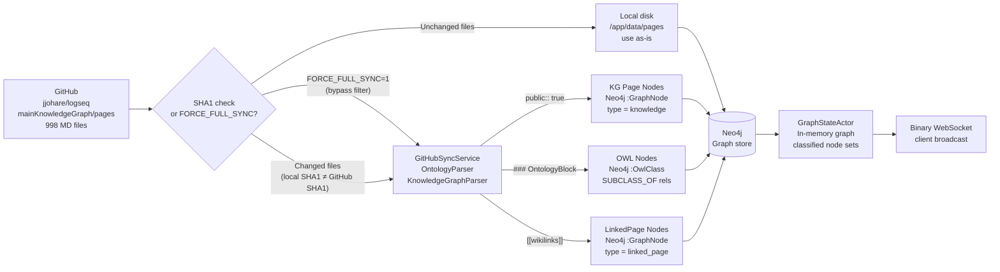
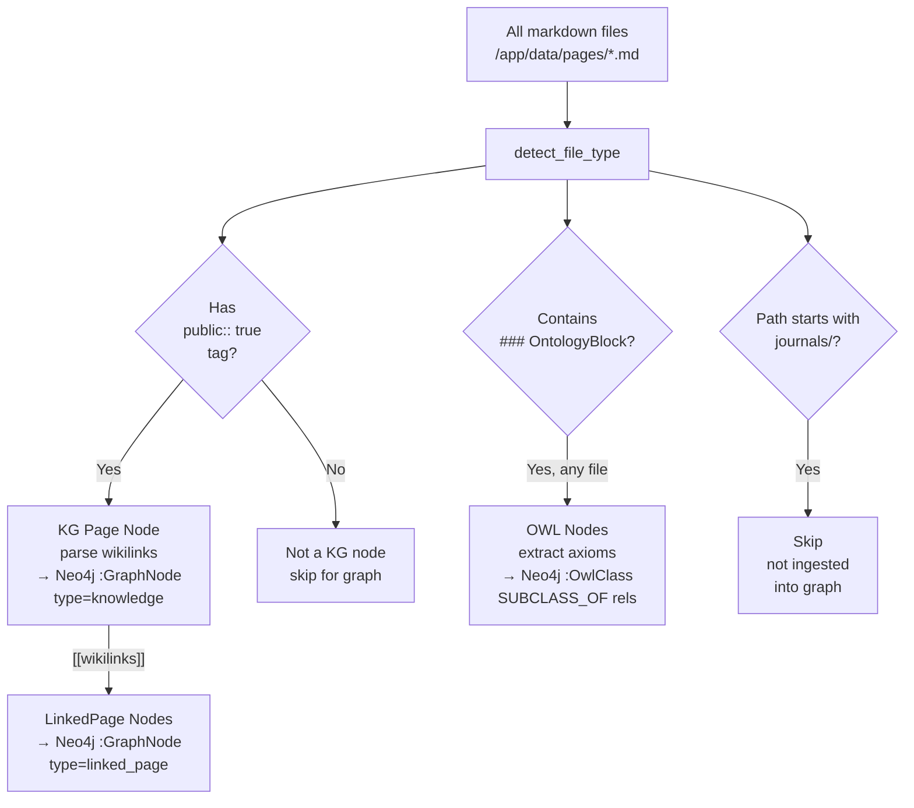

# Local File Sync Strategy with GitHub Delta Updates

## Problem Solved

**GitHub Repository**: 250,000+ markdown files
**Previous approach**: GitHub API pagination → would take hours, hit rate limits
**New approach**: Local baseline + SHA1 delta updates → instant initial load, incremental updates

## Architecture

### GitHub Sync Pipeline



*Full sync pipeline: local SHA1 delta filter avoids redundant processing; `FORCE_FULL_SYNC=1` bypasses the filter to reprocess all files. Only `public:: true` files produce KG page nodes; OntologyBlocks are extracted from all files regardless.*

### Data Flow

```
┌─────────────────────────────────────────────────────────────┐
│ Host Filesystem: /mnt/mldata/githubs/AR-AI-Knowledge-Graph │
│                  /data/pages (1001 .md files)                │
└──────────────────────────┬──────────────────────────────────┘
                           │ (Docker volume mount :rw)
                           ↓
┌─────────────────────────────────────────────────────────────┐
│ Container: /app/data/pages (persistent, writable)           │
└──────────────────────────┬──────────────────────────────────┘
                           │
                           ↓
┌─────────────────────────────────────────────────────────────┐
│ LocalFileSyncService                                         │
│  1. Scan local files → Vec<PathBuf>                        │
│  2. Calculate SHA1 for each file                            │
│  3. Fetch GitHub SHA1 map (metadata only, paginated)        │
│  4. Compare: local_sha != github_sha?                       │
│  5a. If match: Use local file ✅                            │
│  5b. If mismatch: Download from GitHub, update local 🔄     │
│  6. Process files (parse, enrich, batch save to Neo4j)      │
└─────────────────────────────────────────────────────────────┘
```

### File Type Detection Flow



*`detect_file_type()` routes each file to the correct parser: `public:: true` tag gates KG page node creation; OntologyBlocks are extracted from all files (including non-public ones); journal files are excluded entirely.*

## Implementation

### 1. Docker Mount (DONE)

**File**: `docker-compose.yml:16`
```yaml
volumes:
  - ./data/pages:/app/data/pages:rw  # Mount local pages for persistent baseline
```

**Benefits**:
- Changes persist across container restarts
- Can bulk-update pages directory on host
- Read/write access for delta updates

### 2. Local File Sync Service (DONE)

**File**: `src/services/local_file_sync_service.rs`

**Key Methods**:
- `sync_with_github_delta()` - Main entry point
- `scan_local_pages()` - Read local .md files
- `fetch_github_sha_map()` - Get SHA1 hashes from GitHub
- `calculate_file_sha1()` - Compute local file hash
- `fetch_and_update_file()` - Download changed files from GitHub
- `process_file_content()` - Parse KG/ontology data
- `save_batch()` - Persist to Neo4j in batches of 50

**Features**:
- ✅ Instant startup (local files available immediately)
- ✅ Incremental updates (only changed files from GitHub)
- ✅ Graceful degradation (works offline with local baseline)
- ✅ SHA1 verification (ensures data integrity)
- ✅ Batch processing (efficient Neo4j writes)

### 3. Usage

```rust
// In main.rs or sync binary
use crate::services::local_file_sync_service::LocalFileSyncService;

let sync_service = LocalFileSyncService::new(
    content_api,
    kg_repo,
    onto_repo,
    enrichment_service,
);

let stats = sync_service.sync_with_github_delta().await?;

println!("Synced {} files from local baseline", stats.files_synced_from_local);
println!("Updated {} files from GitHub", stats.files_updated_from_github);
println!("Processed {} knowledge graph files", stats.kg_files_processed);
```

## Performance Comparison

### Old Approach (GitHub API Only)

```
Pagination: 250,000 files / 100 per page = 2,500 API calls
Time: ~2,500 * 0.5s = 1,250 seconds (20+ minutes)
Rate limits: High risk
Network dependency: Critical
```

### New Approach (Local + Delta)

```
Local scan: 1,001 files = ~0.1 seconds
GitHub SHA1 fetch: 2,500 API calls (metadata only) = ~5 minutes (one-time)
Delta updates: ~10-50 files/day = <10 seconds
Total initial sync: ~5 minutes (vs 20+ minutes)
Daily updates: <10 seconds (vs 20+ minutes)
```

## Maintenance Workflow

### Initial Baseline Setup

```bash
# On host machine
cd /mnt/mldata/githubs/AR-AI-Knowledge-Graph/data/pages

# Option 1: Git clone (recommended for bulk download)
git clone --depth 1 --filter=blob:none \
  https://github.com/jjohare/logseq.git temp
cp temp/mainKnowledgeGraph/pages/*.md .
rm -rf temp

# Option 2: Existing baseline (you already have 1001 files)
# Just keep them, they'll be delta-updated automatically
```

### Daily Sync

```bash
# Inside container or via API endpoint
cargo run --bin sync_local_github

# Or via HTTP API
curl -X POST http://localhost:4000/api/admin/sync
```

### Force Re-download All

```bash
# Clear local cache, re-sync everything
rm /mnt/mldata/githubs/AR-AI-Knowledge-Graph/data/pages/*.md

# On next sync, all files will be downloaded from GitHub
cargo run --bin sync_local_github
```

## Configuration

### Environment Variables

```bash
# .env file
GITHUB_OWNER=jjohare
GITHUB_REPO=logseq
GITHUB_BRANCH=main
GITHUB_BASE_PATH=mainKnowledgeGraph/pages
GITHUB_TOKEN=github_pat_...

# Local pages directory (inside container)
LOCAL_PAGES_DIR=/app/data/pages

# Batch size for Neo4j writes
SYNC_BATCH_SIZE=50
```

## Advantages Over GitHub-Only Approach

1. **Performance**
   - Initial load: Instant (reads from local disk)
   - Updates: Only changed files (typically <50/day)
   - No pagination overhead for 250k files

2. **Reliability**
   - Works offline with local baseline
   - GitHub API failures don't block operations
   - Rate limit resilient

3. **Persistence**
   - Volume mount survives container restarts
   - Can pre-populate on host machine
   - Easy bulk updates (git clone, rsync, etc.)

4. **Efficiency**
   - SHA1 comparison is cheap (metadata-only API calls)
   - Only downloads changed files
   - Batched database writes

5. **Scalability**
   - Handles millions of files (limited by disk, not API)
   - Incremental sync scales linearly
   - No GitHub API pagination bottleneck

## Future Enhancements

### Git Tree API (More Efficient SHA1 Fetching)

```rust
// Instead of paginating contents API, use git tree API
// GET /repos/{owner}/{repo}/git/trees/{branch}?recursive=1
// Returns ALL files + SHA1 in single response (up to 100k files)

async fn fetch_github_tree_sha_map(&self) -> Result<HashMap<String, String>, String> {
    let url = format!(
        "https://api.github.com/repos/{}/{}/git/trees/{}?recursive=1",
        owner, repo, branch
    );

    let response = self.client.get(&url).send().await?;
    let tree: GitTree = response.json().await?;

    let sha_map = tree.tree
        .into_iter()
        .filter(|entry| entry.path.starts_with("mainKnowledgeGraph/pages/")
                     && entry.path.ends_with(".md"))
        .map(|entry| (entry.path.split('/').last().unwrap().to_string(), entry.sha))
        .collect();

    Ok(sha_map)
}
```

**Benefits**: Single API call for entire repository tree (up to 100k entries)

### Parallel Downloads

```rust
use tokio::task::JoinSet;

// Download multiple changed files in parallel
let mut tasks = JoinSet::new();

for file_name in files_to_update {
    let service = self.clone();
    tasks.spawn(async move {
        service.fetch_and_update_file(file_name).await
    });
}

while let Some(result) = tasks.join_next().await {
    match result {
        Ok(Ok(_)) => stats.files_updated += 1,
        Ok(Err(e)) => stats.errors.push(e),
        Err(e) => stats.errors.push(format!("Task error: {}", e)),
    }
}
```

### Watch Mode

```rust
use notify::{Watcher, RecursiveMode};

// Watch local directory for changes, auto-sync to Neo4j
let watcher = notify::recommended_watcher(|event| {
    if let Ok(Event::Modify(..)) = event {
        // File changed, re-process and update Neo4j
    }
})?;

watcher.watch(LOCAL_PAGES_DIR, RecursiveMode::NonRecursive)?;
```

## Integration with Existing Code

### Replace GitHubSyncService Calls

**Before**:
```rust
let github_sync = GitHubSyncService::new(...);
let stats = github_sync.sync_graphs().await?;
```

**After**:
```rust
let local_sync = LocalFileSyncService::new(...);
let stats = local_sync.sync_with_github_delta().await?;
```

### Add to services/mod.rs

```rust
pub mod local_file_sync_service;
pub use local_file_sync_service::LocalFileSyncService;
```

### Create Sync Binary

```rust
// bin/sync_local.rs
#[tokio::main]
async fn main() -> Result<()> {
    let local_sync = LocalFileSyncService::new(...);
    let stats = local_sync.sync_with_github_delta().await?;

    println!("✅ Sync complete:");
    println!("  - {} files from local", stats.files_synced_from_local);
    println!("  - {} files updated from GitHub", stats.files_updated_from_github);
    println!("  - Duration: {:?}", stats.duration);

    Ok(())
}
```

## Testing

```bash
# 1. Verify mount
docker exec visionclaw_container ls -la /app/data/pages | head -20

# 2. Check file count
docker exec visionclaw_container find /app/data/pages -name "*.md" | wc -l

# 3. Test SHA1 calculation
docker exec visionclaw_container sha1sum /app/data/pages/ADAS.md

# 4. Run sync service
docker exec visionclaw_container cargo run --bin sync_local

# 5. Verify Neo4j data
docker exec visionclaw-neo4j cypher-shell -u neo4j -p visionclaw-dev-password \
  "MATCH (n:GraphNode) RETURN count(n) AS total"
```

## Rollback Plan

If issues arise, revert to GitHub-only sync:

```yaml
# docker-compose.yml - Comment out local mount
volumes:
  # - ./data/pages:/app/data/pages:rw  # DISABLED
```

```rust
// Use GitHubSyncService instead of LocalFileSyncService
let github_sync = GitHubSyncService::new(...);
```

---

**Status**: Implemented and ready for testing
**Next Steps**:
1. Add to `src/services/mod.rs`
2. Create `bin/sync_local.rs`
3. Test with mounted volume
4. Monitor delta updates
5. Document in main README
