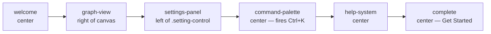

# Welcome Tour and Onboarding Flows

This guide covers starting and restarting onboarding tours, understanding how step positioning and element highlighting work, and clearing persisted tour state.

---

## Available Tours

Three flows ship in `defaultFlows.ts`:

| Flow ID | Name | Steps |
|---------|------|-------|
| `welcome` | Welcome Tour | 6 |
| `settings-tour` | Settings Tour | 5 |
| `advanced-features` | Advanced Features Tour | 3 |

---

## Welcome Tour: Step Sequence

The Welcome Tour (`id: 'welcome'`) walks through 6 steps:



| Step ID | Title | Position | Notes |
|---------|-------|----------|-------|
| `welcome` | Welcome to LogSeq Spring Thing! | center | Intro, no target element |
| `graph-view` | Graph Visualization | right | Targets `canvas` |
| `settings-panel` | Settings Panel | left | Targets `.setting-control` |
| `command-palette` | Command Palette | center | Fires Ctrl+K, auto-dismisses after 2 s |
| `help-system` | Getting Help | center | Mentions Shift+? shortcut |
| `complete` | You're all set! | center | Next button label: "Get Started" |

The `command-palette` step fires a synthetic keyboard event on the `window`:

```typescript
window.dispatchEvent(new KeyboardEvent('keydown', { key: 'k', ctrlKey: true, bubbles: true }));
// 2 000 ms later:
window.dispatchEvent(new KeyboardEvent('keydown', { key: 'Escape', bubbles: true }));
```

---

## Start a Tour

### Via Command Palette

Open the command palette (Ctrl+K / Cmd+K), search for the tour name:

- `Start Welcome Tour` — runs `welcome` flow
- `Start Settings Tour` — runs `settings-tour` flow
- `Advanced Features Tour` — runs `advanced-features` flow

Each command dispatches `CustomEvent('start-onboarding', { detail: { flowId } })`.

### Programmatically

```typescript
import { useOnboardingContext } from '@/features/onboarding/components/OnboardingProvider';
import { welcomeFlow } from '@/features/onboarding/flows/defaultFlows';

const { startFlow } = useOnboardingContext();

// Starts only if not already completed
startFlow(welcomeFlow);

// Force restart even if completed
startFlow(welcomeFlow, true);
```

`startFlow` returns `false` if the flow was previously completed and `forceRestart` is not set.

---

## Skip a Tour

Every step shows a **Skip tour** button (bottom-centre of the tooltip) unless the step has `skipable: false`. Clicking it calls `skipFlow()`, which marks the flow as completed and dismisses the overlay. The X icon in the tooltip header performs the same action.

---

## Persistence

Completed flow IDs are stored under the `onboarding.completedFlows` key in `localStorage` as a JSON string array.

```
localStorage['onboarding.completedFlows'] = '["welcome","settings-tour"]'
```

A flow is skipped on re-launch if its ID is already in this array. To reset all tours from the command palette: search "Reset All Tours" → executes `resetOnboarding()` which calls `localStorage.removeItem('onboarding.completedFlows')`.

---

## OnboardingState shape

```typescript
interface OnboardingState {
  isActive: boolean;                 // whether a tour is currently running
  currentFlow: OnboardingFlow | null;
  currentStepIndex: number;          // 0-based index into currentFlow.steps
  completedFlows: string[];          // flow IDs loaded from / persisted to localStorage
}
```

---

## Step Positioning

Steps with a `target` CSS selector trigger element highlighting: the overlay dims the page and a ring cutout is placed around the matched element. The tooltip is positioned relative to the element bounding rect.

| `position` value | Tooltip placement |
|-----------------|-------------------|
| `top` | Above the element |
| `bottom` | Below the element |
| `left` | Left of the element |
| `right` | Right of the element |
| `center` | Fixed 50%/50% viewport centre |

When `target` is absent or the selector matches nothing, the tooltip centres on the viewport.

---

## Keyboard Shortcuts

| Key | Action |
|-----|--------|
| Shift+? | Open keyboard shortcuts reference (from `help-system` step and `help.keyboard` command) |
| Ctrl+K / Cmd+K | Open command palette (demonstrated in `command-palette` step) |

---

## Note on Current Status

The `OnboardingProvider` currently ships with the overlay commented out:

```tsx
{/* Onboarding disabled - uncomment to re-enable */}
{/* <OnboardingEventHandler /> */}
```

Tours can still be started programmatically via `startFlow` and the underlying state machine is fully functional. To re-enable the visual overlay, uncomment the two lines inside `OnboardingProvider.tsx`.

---

## See Also

- [Command Palette](command-palette.md) — Ctrl+K usage
- [Navigation Guide](../navigation-guide.md) — graph interaction basics
