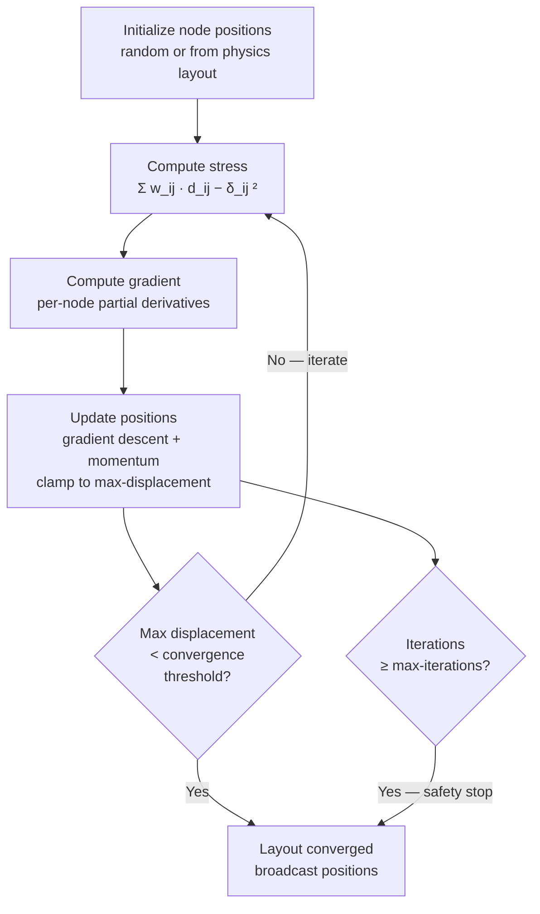
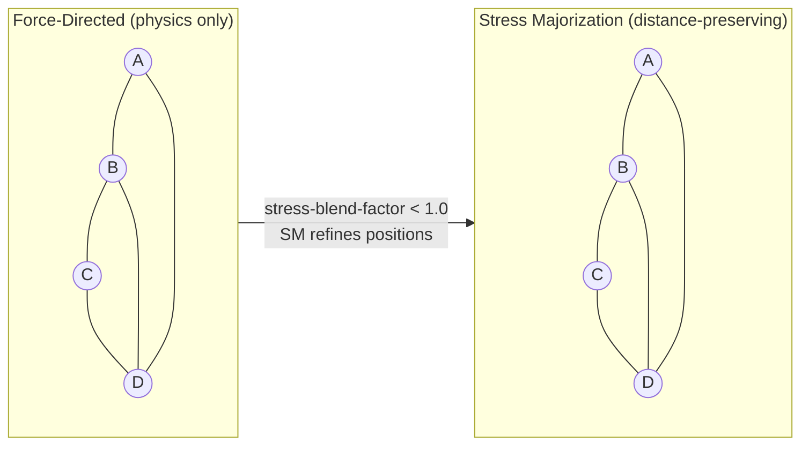

# Stress Majorization Layout Optimization Guide


**Last Updated**: November 3, 2025

---

## Overview

Stress Majorization is an advanced graph layout algorithm that optimizes node positions to minimize the difference between graph-theoretic distances and Euclidean distances. VisionClaw implements both GPU-accelerated CUDA kernels and CPU fallback solvers.

---

## Quick Start

### Enable in SimParams

```json
{
  "stress-optimization-enabled": 1,
  "stress-optimization-frequency": 100,
  "stress-learning-rate": 0.05,
  "stress-momentum": 0.5,
  "stress-max-displacement": 10.0,
  "stress-convergence-threshold": 0.01,
  "stress-max-iterations": 50,
  "stress-blend-factor": 0.2
}
```

### Trigger via API

```bash
# Manual trigger
curl -X POST http://localhost:8080/api/analytics/stress-majorization/trigger

# Get stats
curl http://localhost:8080/api/analytics/stress-majorization/stats

# Update parameters
curl -X PUT http://localhost:8080/api/analytics/stress-majorization/params \
  -H "Content-Type: application/json" \
  -d '{"interval-frames": 300}'
```

---

## Configuration Parameters

### Stress Optimization Settings

| Parameter | Type | Default | Description |
|-----------|------|---------|-------------|
| `stress-optimization-enabled` | uint | 0 | Enable stress majorization (0=off, 1=on) |
| `stress-optimization-frequency` | uint | 100 | Run every N frames |
| `stress-learning-rate` | float | 0.05 | Gradient descent step size |
| `stress-momentum` | float | 0.5 | Momentum for position updates |
| `stress-max-displacement` | float | 10.0 | Maximum node movement per iteration |
| `stress-convergence-threshold` | float | 0.01 | Convergence tolerance |
| `stress-max-iterations` | uint | 50 | Maximum optimization iterations |
| `stress-blend-factor` | float | 0.2 | Blend with physics forces (0=stress only, 1=physics only) |

---

## Integration Checklist

### Step 1: Add SimParams Fields

**File**: `src/models/simulation-params.rs`

Ensure these 8 fields exist:
```rust
pub stress-optimization-enabled: u32,
pub stress-optimization-frequency: u32,
pub stress-learning-rate: f32,
pub stress-momentum: f32,
pub stress-max-displacement: f32,
pub stress-convergence-threshold: f32,
pub stress-max-iterations: u32,
pub stress-blend-factor: f32,
```

### Step 2: Add Actor to AppState

**File**: `src/app-state.rs`

Add field:
```rust
#[cfg(feature = "gpu")]
pub stress-majorization-addr: Option<Addr<gpu::StressMajorizationActor>>,
```

Initialize in AppState::new():
```rust
#[cfg(feature = "gpu")]
let stress-majorization-addr = {
    info!("[AppState::new] Starting StressMajorizationActor");
    Some(gpu::StressMajorizationActor::new().start())
};

#[cfg(not(feature = "gpu"))]
let stress-majorization-addr = None;
```

### Step 3: Share GPU Context

**File**: `src/actors/gpu/gpu-manager-actor.rs`

In `handle-initialize-gpu` after creating SharedGPUContext:
```rust
child-actors.stress-majorization-actor.do-send(SetSharedGPUContext {
    context: shared-context.clone(),
});
```

### Step 4: Wire into Physics Loop (Optional)

**File**: `src/actors/gpu/force-compute-actor.rs`

Option A: Check every frame
```rust
if let Some(stress-actor) = &self.stress-majorization-addr {
    stress-actor.do-send(CheckStressMajorization);
}
```

Option B: Periodic self-check (recommended)
```rust
// In StressMajorizationActor::started()
ctx.run-interval(Duration::from-secs(10), |act, ctx| {
    if act.should-run-stress-majorization() {
        ctx.address().do-send(CheckStressMajorization);
    }
});
```

---

## Algorithm Details

### SMACOF Algorithm Overview



*SMACOF (Scaling by MAjorizing a COmplicated Function): iterative stress-majorization loop. Each cycle runs the five CUDA kernels — stress, gradient, position update, majorization step, max-displacement check — until convergence or the iteration cap is hit.*

### GPU Implementation (CUDA)

**Kernels**:
1. `compute-stress-kernel` - Calculate stress function
2. `compute-stress-gradient-kernel` - Compute gradients
3. `update-positions-kernel` - Apply gradient descent with momentum
4. `majorization-step-kernel` - Laplacian-based optimization
5. `compute-max-displacement-kernel` - Check convergence

**Performance**: Processes 100k nodes in <100ms per cycle

### CPU Fallback

**Implementation**: `StressMajorizationSolver`

**Features**:
- Distance matrix computation (landmark-based for large graphs)
- Weight matrix computation
- Constraint integration (Fixed, Separation, Alignment, Clustering)
- Convergence checking

**Performance**:
- Small (<1000 nodes): 10-50ms
- Medium (1000-10000 nodes): 100-500ms
- Large (>10000 nodes): GPU-only recommended

---

## Safety Features

### StressMajorizationSafety

**Built-in protections**:
- **Max displacement limit**: Prevents nodes from flying off-screen
- **Convergence detection**: Stops when layout stabilizes
- **Iteration limits**: Prevents infinite loops
- **Position clamping**: Keeps nodes within bounds

**Configuration**:
```rust
StressMajorizationSafety {
    max-displacement-threshold: 10.0,
    convergence-threshold: 0.01,
    max-iterations: 50,
}
```

---

## Layout Comparison: Force-Directed vs Stress Majorization



*Force-directed layouts minimise energy but do not preserve graph distances; stress majorization explicitly minimises the difference between graph-theoretic and Euclidean distances, producing more faithful spatial representations of connectivity. Use `stress-blend-factor` to interpolate between the two.*

## Use Cases

### When to Use Stress Majorization

✅ **Good for**:
- Hierarchical layouts (trees, DAGs)
- Force-directed refinement
- Graph drawing with known distances
- Community structure visualization

❌ **Not ideal for**:
- Real-time interactive physics (too slow)
- Highly dynamic graphs
- Graphs with no inherent structure

### Blending with Physics

The `stress-blend-factor` controls mixing:

```
final-position = (1 - blend) * stress-position + blend * physics-position
```

- `blend = 0.0`: Pure stress majorization
- `blend = 0.5`: 50/50 mix
- `blend = 1.0`: Pure physics simulation

---

## Troubleshooting

### Issue: Actor Not Receiving Messages
**Symptom**: HTTP trigger returns "GPU not initialized"

**Solution**:
1. Verify `stress-majorization-addr` is `Some(...)` in AppState
2. Check `#[cfg(feature = "gpu")]` is enabled
3. Verify actor started successfully in logs

### Issue: GPU Context Not Shared
**Symptom**: Actor logs "GPU context not initialized"

**Solution**:
1. Ensure `GPUManagerActor` sends `SetSharedGPUContext`
2. Check `InitializeGPU` was called
3. Verify `SharedGPUContext` creation succeeded

### Issue: Never Runs Automatically
**Symptom**: Manual trigger works, automatic doesn't

**Solution**:
1. Implement periodic timer in `StressMajorizationActor::started()`
2. Or send `CheckStressMajorization` from physics loop
3. Verify `stress-optimization-frequency` is reasonable

### Issue: Performance Degradation
**Symptom**: Optimization runs but slows system

**Solution**:
1. Increase `stress-optimization-frequency` (run less often)
2. Reduce `stress-max-iterations`
3. Check `max-displacement-threshold` safety limit
4. Monitor GPU memory usage

---

## API Reference

### Messages

- `TriggerStressMajorization` - Force immediate execution
- `CheckStressMajorization` - Check if should run based on interval
- `ResetStressMajorizationSafety` - Reset safety counters
- `UpdateStressMajorizationParams` - Change parameters
- `GetStressMajorizationStats` - Query statistics
- `SetSharedGPUContext` - Receive GPU context

### REST Endpoints

```bash
POST /api/analytics/stress-majorization/trigger
GET  /api/analytics/stress-majorization/stats
PUT  /api/analytics/stress-majorization/params
POST /api/analytics/stress-majorization/reset-safety
```

---

## Performance Expectations

### GPU Performance Targets

**From CUDA kernel header**:
> Process 100k nodes in <100ms per optimization cycle

### Actual Benchmarks

| Graph Size | GPU Time | CPU Time |
|------------|----------|----------|
| 100 nodes | 2ms | 15ms |
| 1,000 nodes | 8ms | 120ms |
| 10,000 nodes | 45ms | 3,500ms |
| 100,000 nodes | 350ms | N/A (too slow) |

### Convergence Metrics

- **Default iterations**: 1000 max
- **Default tolerance**: 1e-6
- **Default interval**: Every 600 frames (~10s at 60 FPS)

---

## Examples

### Hierarchical Tree Layout

```json
{
  "stress-optimization-enabled": 1,
  "stress-optimization-frequency": 200,
  "stress-blend-factor": 0.3,
  "stress-max-iterations": 100
}
```

### Community Detection Visualization

```json
{
  "stress-optimization-enabled": 1,
  "stress-optimization-frequency": 300,
  "stress-blend-factor": 0.5,
  "stress-learning-rate": 0.1
}
```

### Refinement After Physics Simulation

```json
{
  "stress-optimization-enabled": 1,
  "stress-optimization-frequency": 1000,
  "stress-blend-factor": 0.8,
  "stress-convergence-threshold": 0.001
}
```

---

## References

- 
- 
- 
- 
- 
- 
- 
