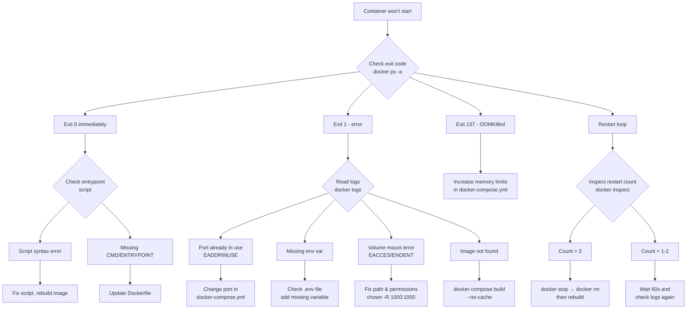
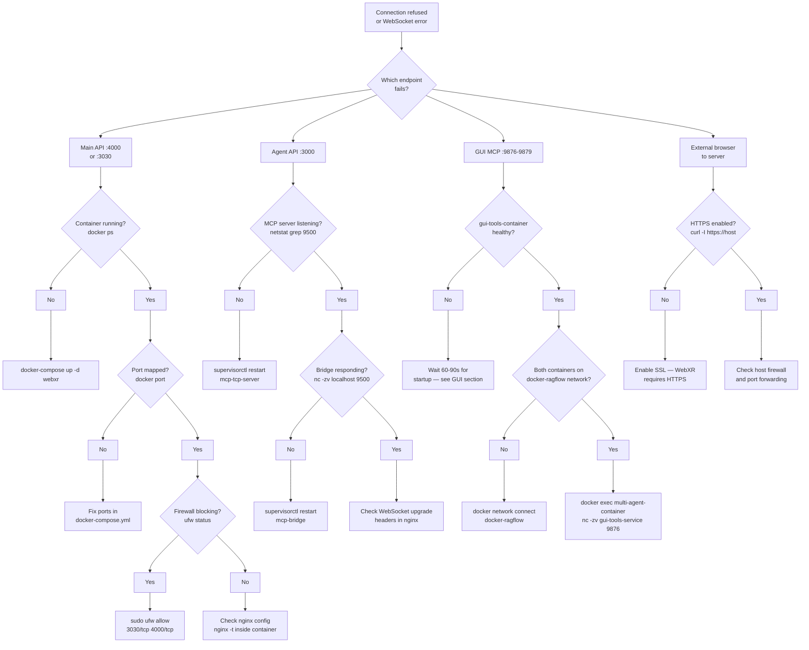
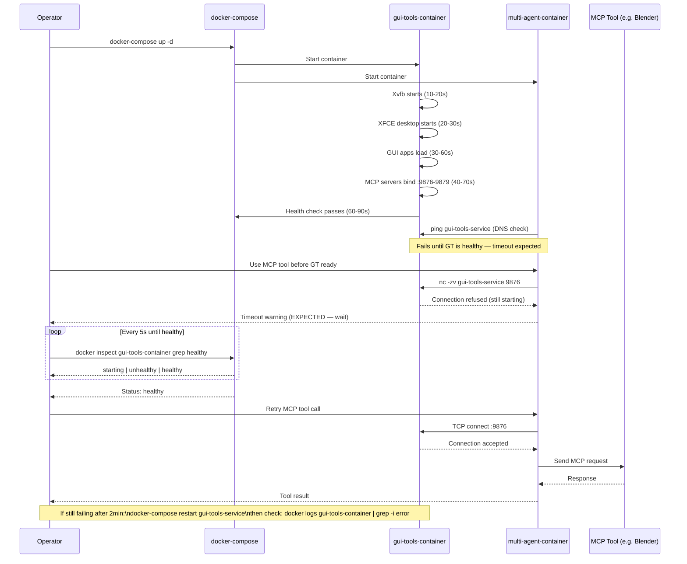
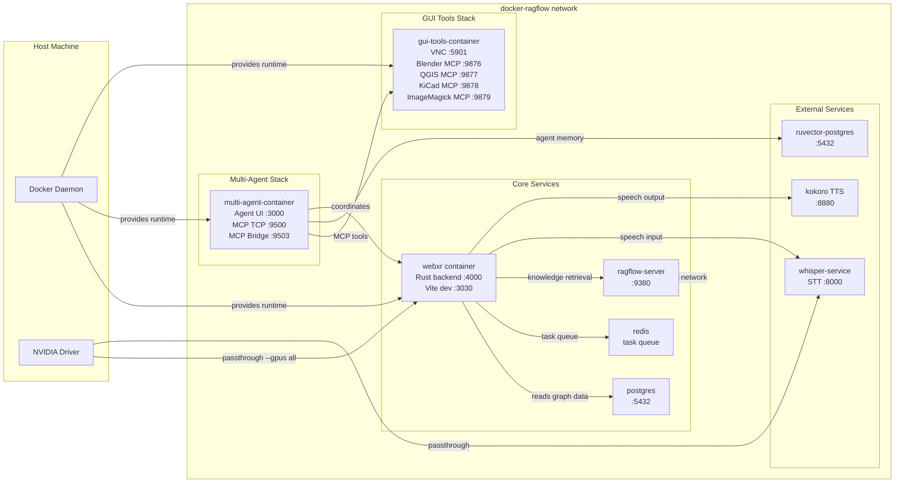

# Troubleshooting Guide

 > [Guides](./index.md) > Troubleshooting

Comprehensive troubleshooting guide for VisionClaw, covering installation, deployment, runtime issues, and system recovery. This guide consolidates solutions for both the main VisionClaw system and the multi-agent Docker environment.

## Quick Reference - Common Issues

| Symptom | Likely Cause | Quick Fix |
|---------|-------------|-----------|
| Container exits immediately | Port conflict or misconfiguration | Check logs: `docker logs <container>` |
| GPU not detected | NVIDIA toolkit missing | Install nvidia-container-toolkit |
| Connection refused | Service not started | `docker-compose restart <service>` |
| Out of memory | Resource limits too low | Increase Docker memory limits |
| VNC won't connect | Port 5901 blocked | Check firewall: `sudo ufw allow 5901` |
| MCP tool timeout | GUI container not ready | Wait 60s, check: `docker ps` |
| Agent spawn failure | Resource exhaustion | Check: `docker stats` |
| WebXR not working | HTTPS required | Enable SSL in configuration |
| Kokoro/Whisper unavailable | Network configuration | Run: `./scripts/fix-kokoro-network.sh` |

## Table of Contents

1. [Installation Issues](#installation-issues)
2. 
3. [Agent System Issues](#agent-system-issues)
4. [Performance Problems](#performance-problems)
5. 
6. 
7. [XR/VR Issues](#xrvr-issues)
8. [External Services](#external-services)
9. [Diagnostic Tools](#diagnostic-tools)
10. [Recovery Procedures](#recovery-procedures)

---

## Installation Issues

### Docker Installation Problems

**Problem**: Docker not found or not running

**Solution**:
```bash
# Ubuntu/Debian - Install Docker
sudo apt-get update
sudo apt-get install -y docker.io docker-compose
sudo systemctl start docker
sudo systemctl enable docker

# Add user to docker group
sudo usermod -aG docker $USER
newgrp docker

# Verify installation
docker --version
docker-compose --version
```

**Prevention**:
- Always verify Docker is running before starting VisionClaw
- Add Docker to system startup services
- Use Docker Desktop on macOS/Windows for easier management

---

**Problem**: Docker Compose version mismatch

**Solution**:
```bash
# Check current version
docker-compose --version

# Update Docker Compose to latest
sudo curl -L "https://github.com/docker/compose/releases/latest/download/docker-compose-$(uname -s)-$(uname -m)" -o /usr/local/bin/docker-compose
sudo chmod +x /usr/local/bin/docker-compose

# Or use Docker Compose V2 (no hyphen)
docker compose version
```

**Diagnostic**:
```bash
# Check which docker-compose is being used
which docker-compose
type docker-compose
```

**Prevention**: Pin Docker Compose version in CI/CD pipelines

---

### Permission Issues

**Problem**: Permission denied when accessing Docker socket

**Solution**:
```bash
# Temporary fix (session only)
sudo chmod 666 /var/run/docker.sock

# Permanent fix - add user to docker group
sudo usermod -aG docker $USER
newgrp docker

# Verify group membership
groups $USER
```

**Diagnostic**:
```bash
# Check socket permissions
ls -la /var/run/docker.sock

# Test Docker access without sudo
docker ps
```

**Prevention**: Always add users to docker group during initial setup

---

**Problem**: Volume mount permission errors

**Solution**:
```bash
# Fix ownership of mounted directories
sudo chown -R $USER:$USER ./workspace ./data ./logs

# For multi-agent container (uses dev user)
sudo chown -R 1000:1000 ./multi-agent-docker/workspace

# Fix inside running container
docker exec -u root multi-agent-container chown -R dev:dev /workspace
```

**Diagnostic**:
```bash
# Check directory permissions
ls -la ./workspace
stat ./workspace

# Check container user
docker exec multi-agent-container id
```

**Prevention**: Use consistent UID/GID mapping in docker-compose.yml

---

### Dependency Problems

**Problem**: Missing system dependencies

**Solution**:
```bash
# Ubuntu/Debian
sudo apt-get install -y \
    build-essential \
    curl \
    git \
    python3-pip \
    python3-venv \
    nodejs \
    npm \
    pkg-config \
    libssl-dev

# Install Rust (required for GPU kernels)
curl --proto '=https' --tlsv1.2 -sSf https://sh.rustup.rs | sh
source $HOME/.cargo/env

# Verify installations
node --version
npm --version
cargo --version
python3 --version
```

**Diagnostic**:
```bash
# Check for missing libraries
ldd /path/to/binary

# Check Python packages
pip3 list
```

**Prevention**: Use Docker containers to ensure consistent dependencies

---

## Docker & Container Issues

### Container Won't Start

**Problem**: Container exits immediately after starting

**Solution**:
```bash
# Check container logs
docker logs visionclaw-container
docker logs multi-agent-container

# Check exit code
docker ps -a --format "table {{.Names}}\t{{.Status}}\t{{.Ports}}"

# Debug with interactive shell
docker run -it --entrypoint /bin/bash visionclaw-container

# Check container configuration
docker inspect visionclaw-container
```

**Diagnostic Commands**:
```bash
# View last 100 log lines
docker logs --tail 100 visionclaw-container

# Follow logs in real-time
docker logs -f visionclaw-container

# Check container events
docker events --filter container=visionclaw-container
```

**Common Causes**:
- Port already in use → Change port in docker-compose.yml
- Missing environment variables → Check .env file
- Volume mount errors → Verify paths exist and permissions are correct
- Entrypoint script errors → Check script syntax and permissions

**Prevention**:
- Use health checks in docker-compose.yml
- Validate configuration before deployment
- Test with `docker-compose config`

### Startup Failure Decision Tree



---

**Problem**: Container stuck in restart loop

**Solution**:
```bash
# Stop the container
docker stop visionclaw-container

# Remove container (keeps volumes)
docker rm visionclaw-container

# Check restart policy
docker inspect visionclaw-container | grep -A 5 RestartPolicy

# Rebuild and start fresh
docker-compose down
docker-compose build --no-cache
docker-compose up -d
```

**Diagnostic**:
```bash
# Watch restart events
docker events --filter event=restart

# Check restart count
docker inspect --format='{{.RestartCount}}' visionclaw-container
```

**Prevention**: Set appropriate restart policies and fix underlying issues

---

### Build Failures

**Problem**: Docker build fails

**Solution**:
```bash
# Build with no cache
docker-compose build --no-cache

# Build specific service
docker-compose build webxr
docker-compose build multi-agent

# Build with verbose output
docker build -t debug . --progress=plain --no-cache

# Build with host network (for network issues)
docker build --network=host -t visionclaw .
```

**Common Issues & Fixes**:

```bash
# Network timeout during build
# Solution: Use --network=host or configure proxy
docker build --network=host -t visionclaw .

# Out of disk space
# Solution: Clean up Docker resources
docker system df
docker system prune -a --volumes

# BuildKit cache issues
# Solution: Clear BuildKit cache
docker builder prune -a

# Multi-platform build issues
# Solution: Ensure QEMU is installed
docker run --privileged --rm tonistiigi/binfmt --install all
```

**Diagnostic**:
```bash
# Check disk space
df -h /var/lib/docker
docker system df

# Check Docker storage driver
docker info | grep "Storage Driver"

# Monitor build process
docker build . 2>&1 | tee build.log
```

**Prevention**:
- Regularly clean Docker resources
- Use .dockerignore to exclude unnecessary files
- Optimize Dockerfile layer caching

---

### Memory & Resource Issues

**Problem**: Container killed with OOMKilled status

**Solution**:
```bash
# Check current memory usage
docker stats --no-stream

# Increase memory limits in docker-compose.yml
services:
  webxr:
    deploy:
      resources:
        limits:
          memory: 8G
        reservations:
          memory: 4G

# For Docker Desktop - increase in Settings > Resources
# Recommended: 8GB minimum, 16GB for GPU workloads

# Restart with new limits
docker-compose down
docker-compose up -d
```

**Diagnostic**:
```bash
# Monitor memory usage over time
docker stats

# Check memory events
dmesg | grep -i "out of memory"

# Check container memory limit
docker inspect visionclaw-container | grep -i memory
```

**Prevention**:
- Set appropriate memory reservations and limits
- Monitor memory usage with `docker stats`
- Use memory profiling for Node.js/Rust processes

---

**Problem**: High CPU usage

**Solution**:
```bash
# Check CPU usage per container
docker stats --format "table {{.Name}}\t{{.CPUPerc}}\t{{.MemUsage}}"

# Limit CPU usage in docker-compose.yml
services:
  webxr:
    cpus: "4.0"
    cpu-shares: 1024

# Find process consuming CPU inside container
docker exec visionclaw-container top
docker exec visionclaw-container ps aux --sort=-%cpu
```

**Diagnostic**:
```bash
# Profile Rust backend
docker exec visionclaw-container perf record -F 99 -p <PID>
docker exec visionclaw-container perf report

# Check Node.js event loop
docker exec multi-agent-container node --prof app.js
```

**Prevention**: Implement proper async patterns and avoid blocking operations

---

## Agent System Issues

### Agents Not Spawning

**Problem**: Failed to spawn agent or create new agent instance

**Solution**:
```bash
# Check agent container status
docker ps | grep multi-agent

# Check agent orchestrator logs
docker logs multi-agent-container | grep -i "agent\|spawn\|error"

# Verify MCP server is running
docker exec multi-agent-container netstat -tlnp | grep 9500

# Check resource limits
docker exec multi-agent-container free -h
docker stats multi-agent-container

# Restart agent services
docker exec multi-agent-container supervisorctl restart all
```

**Diagnostic Commands**:
```bash
# Check agent status via API
curl http://localhost:3000/api/agents/status

# List active agents
docker exec multi-agent-container ps aux | grep claude

# Check MCP connection
./scripts/verify-mcp-connection.sh
```

**Common Causes**:
- Resource limits reached (CPU/memory)
- MCP server not responding
- Invalid agent configuration
- Port conflicts

**Prevention**:
- Set appropriate resource limits
- Implement agent lifecycle monitoring
- Use health checks for agent services

---

**Problem**: Agent communication failures

**Solution**:
```bash
# Check WebSocket bridge status
docker logs multi-agent-container | grep -i "websocket\|bridge"

# Test MCP TCP connection
docker exec multi-agent-container nc -zv localhost 9500

# Check MCP health endpoint
curl http://localhost:9503/health

# Restart MCP services
docker exec multi-agent-container supervisorctl restart mcp-tcp-server
docker exec multi-agent-container supervisorctl restart mcp-bridge
```

**Diagnostic**:
```bash
# Monitor MCP messages
docker exec multi-agent-container tail -f /workspace/logs/mcp-server.log

# Test agent-to-agent communication
# From inside container:
docker exec multi-agent-container /workspace/mcp-helper.sh test-connection
```

**Prevention**: Use TCP transport for reliability over Unix sockets

---

### Task Processing Issues

**Problem**: Tasks stuck in queue or not processing

**Solution**:
```bash
# Check task queue status
docker exec multi-agent-container redis-cli LLEN task:queue

# View pending tasks
docker exec multi-agent-container redis-cli LRANGE task:queue 0 -1

# Clear stuck tasks (use with caution)
docker exec multi-agent-container redis-cli DEL task:queue

# Restart task processors
docker exec multi-agent-container supervisorctl restart task-processor
```

**Diagnostic**:
```bash
# Monitor task queue
watch -n 1 'docker exec multi-agent-container redis-cli LLEN task:queue'

# Check for task failures
docker logs multi-agent-container | grep -i "task.*fail\|task.*error"
```

**Prevention**: Implement task timeout and retry mechanisms

---

## Performance Problems

### System Running Slowly

**Problem**: Overall system performance degradation

**Solution**:
```bash
# Check resource usage
docker stats --format "table {{.Name}}\t{{.CPUPerc}}\t{{.MemUsage}}\t{{.NetIO}}\t{{.BlockIO}}"

# Check disk I/O
docker exec visionclaw-container iostat -x 1

# Optimise database
docker exec postgres psql -U visionclaw -c "VACUUM ANALYZE;"
docker exec postgres psql -U visionclaw -c "REINDEX DATABASE visionclaw;"

# Clear Redis cache
docker exec redis redis-cli FLUSHDB

# Check network latency
docker exec visionclaw-container ping -c 10 multi-agent-container
```

**Diagnostic Commands**:
```bash
# System bottleneck analysis
htop  # On host
docker exec visionclaw-container htop  # Inside container

# I/O monitoring
iotop -o  # On host

# Network monitoring
iftop  # On host
docker exec visionclaw-container nethogs
```

**Prevention**:
- Regular database maintenance
- Implement caching strategies
- Use connection pooling
- Monitor and set resource limits

---

### Memory Leaks

**Problem**: Increasing memory usage over time

**Solution**:
```bash
# Monitor memory trend
while true; do
  docker stats --no-stream --format "{{.Container}}\t{{.MemUsage}}" | grep visionclaw
  sleep 60
done

# Take heap snapshot (Node.js)
docker exec multi-agent-container node --inspect=0.0.0.0:9229 /app/index.js

# Profile Rust memory (in development)
RUSTFLAGS='-C instrument-memory=yes' cargo build

# Restart affected service
docker-compose restart webxr
```

**Diagnostic Tools**:
```bash
# Node.js memory profiling
docker exec multi-agent-container npm install -g node-clinic
docker exec multi-agent-container clinic doctor -- node app.js

# Check for memory leaks in Rust
cargo install valgrind
valgrind --leak-check=full ./target/debug/visionclaw
```

**Prevention**:
- Implement proper cleanup in destructors
- Use weak references where appropriate
- Regular memory profiling in development
- Set maximum heap size limits

---

## Network & Connectivity

### Port Conflicts

**Problem**: Port already in use

**Solution**:
```bash
# Find process using port
sudo lsof -i :3030
sudo netstat -tulpn | grep 3001
sudo ss -tulpn | grep 3001

# Kill process (if safe)
sudo kill -9 $(sudo lsof -t -i:3030)

# Or change port in .env
echo "VITE-API-PORT=3002" >> .env
echo "HOST-PORT=3002" >> .env

# Restart services
docker-compose down
docker-compose up -d
```

**Diagnostic**:
```bash
# List all listening ports
docker exec visionclaw-container netstat -tlnp

# Check port mapping
docker ps --format "table {{.Names}}\t{{.Ports}}"
```

**Prevention**: Document port assignments and check before deployment

---

### Container Communication Failures

**Problem**: Containers can't communicate with each other

**Solution**:
```bash
# Check Docker network
docker network ls
docker network inspect docker-ragflow

# Test connectivity between containers
docker exec multi-agent-container ping -c 3 visionclaw-container
docker exec visionclaw-container curl http://multi-agent-container:3000

# Recreate network
docker-compose down
docker network rm docker-ragflow
docker network create docker-ragflow
docker-compose up -d

# Check service names resolve
docker exec multi-agent-container getent hosts gui-tools-service
```

**Diagnostic**:
```bash
# View network configuration
docker inspect multi-agent-container | grep -A 20 Networks

# Test DNS resolution
docker exec multi-agent-container nslookup gui-tools-service

# Check network interfaces
docker exec multi-agent-container ip addr show
```

**Prevention**:
- Use service names instead of IP addresses
- Ensure all services are on the same network
- Use network aliases in docker-compose.yml

---

### Multi-Agent Docker Networking

**Problem**: MCP bridge tools return "Connection refused"

**Solution**:
```bash
# Verify both containers are running
./multi-agent-docker/multi-agent.sh status

# Check network connectivity from inside container
docker exec -it multi-agent-container bash
ping gui-tools-service

# Inspect docker-ragflow network
docker network inspect docker-ragflow

# Check if both containers are attached
docker inspect multi-agent-container | grep -A 5 "docker-ragflow"
docker inspect gui-tools-container | grep -A 5 "docker-ragflow"

# Verify MCP ports are listening
docker exec gui-tools-container netstat -tlnp | grep -E "9876|9877|9878|9879"
```

**Diagnostic**:
```bash
# Test MCP connection directly
docker exec multi-agent-container nc -zv gui-tools-service 9876

# Check GUI container logs
docker logs gui-tools-container | grep -E "blender|qgis|pbr|mcp"

# Monitor network traffic
docker exec gui-tools-container tcpdump -i any port 9876
```

**Prevention**:
- Wait for GUI container health check to pass before using MCP tools
- Use health checks in docker-compose.yml
- Implement retry logic in MCP clients

### WebSocket / Connection Failure Decision Tree



---

### External Access Issues

**Problem**: Can't access services from browser

**Solution**:
```bash
# Check firewall
sudo ufw status
sudo ufw allow 3001/tcp
sudo ufw allow 5901/tcp  # VNC

# Check Docker port mapping
docker ps --format "table {{.Names}}\t{{.Ports}}"

# Test locally first
curl http://localhost:3030/
curl http://localhost:5901

# Check if service is listening on correct interface
docker exec visionclaw-container netstat -tlnp | grep 3001

# For remote access, check host firewall
sudo iptables -L -n | grep 3001
```

**Diagnostic**:
```bash
# Test from different locations
# Local machine
curl http://localhost:3030

# From container
docker exec visionclaw-container curl http://localhost:3030

# From another machine on network
curl http://<host-ip>:3030

# Check nginx configuration
docker exec visionclaw-container cat /etc/nginx/nginx.conf
docker exec visionclaw-container nginx -t
```

**Prevention**:
- Use reverse proxy for production
- Configure firewall rules during deployment
- Document all exposed ports

---

## GPU & CUDA Issues

### GPU Not Detected

**Problem**: NVIDIA GPU not available in container

**Solution**:
```bash
# Check GPU on host
nvidia-smi

# Test GPU access in Docker
docker run --rm --gpus all nvidia/cuda:11.8.0-base-ubuntu20.04 nvidia-smi

# Install NVIDIA Container Toolkit (Ubuntu/Debian)
distribution=$(. /etc/os-release;echo $ID$VERSION-ID)
curl -s -L https://nvidia.github.io/nvidia-docker/gpgkey | sudo apt-key add -
curl -s -L https://nvidia.github.io/nvidia-docker/$distribution/nvidia-docker.list | \
  sudo tee /etc/apt/sources.list.d/nvidia-docker.list

sudo apt-get update
sudo apt-get install -y nvidia-container-toolkit
sudo systemctl restart docker

# Verify toolkit installation
sudo nvidia-ctk --version

# Update docker-compose.yml
services:
  webxr:
    deploy:
      resources:
        reservations:
          devices:
            - driver: nvidia
              count: 1
              capabilities: [gpu, compute, utility]
    runtime: nvidia
    environment:
      - NVIDIA-VISIBLE-DEVICES=0
      - NVIDIA-DRIVER-CAPABILITIES=compute,utility
```

**Diagnostic**:
```bash
# Check NVIDIA driver version
nvidia-smi --query-gpu=driver-version --format=csv,noheader

# Check CUDA version
nvcc --version

# Test in container
docker exec visionclaw-container nvidia-smi

# Check GPU allocation
docker exec visionclaw-container echo $NVIDIA-VISIBLE-DEVICES
```

**Prevention**:
- Verify NVIDIA drivers before installation
- Use official CUDA base images
- Test GPU access before deploying workloads

---

**Problem**: CUDA out of memory errors

**Solution**:
```bash
# Check GPU memory usage
nvidia-smi --query-gpu=memory.used,memory.total --format=csv

# Inside container
docker exec visionclaw-container nvidia-smi

# Reduce batch size or grid dimensions in GPU kernels
# Edit .env file
echo "HASH-GRID-SIZE=64" >> .env  # Reduce from default 128
echo "GPU-MEMORY-LIMIT=2048" >> .env  # Limit to 2GB

# Clear GPU memory
docker restart visionclaw-container

# Use CPU fallback
echo "ENABLE-GPU=false" >> .env
```

**Diagnostic**:
```bash
# Monitor GPU memory over time
watch -n 1 nvidia-smi

# Profile GPU kernels
docker exec visionclaw-container nvprof ./target/release/visionclaw

# Check kernel launch configuration
docker logs visionclaw-container | grep -i "gpu\|cuda\|kernel"
```

**Prevention**:
- Set appropriate GPU memory limits
- Implement memory pooling for GPU allocations
- Use streaming/batching for large datasets

---

**Problem**: PTX compilation failures

**Solution**:
```bash
# Verify PTX kernels
./scripts/verify-ptx-compilation.sh

# Rebuild PTX kernels
./scripts/build-ptx.sh

# Check CUDA architecture compatibility
# For RTX 4080 (compute capability 8.9)
export CUDA-ARCH=89

# For RTX 3080 (compute capability 8.6)
export CUDA-ARCH=86

# Rebuild with correct architecture
CUDA-ARCH=86 docker-compose build --no-cache webxr

# Test compilation
./scripts/test-compile.sh
```

**Diagnostic**:
```bash
# Check compiled PTX files
find . -name "*.ptx" -exec ls -lh {} \;

# Verify GPU compute capability
nvidia-smi --query-gpu=compute-cap --format=csv,noheader

# Check build logs
docker-compose build webxr 2>&1 | grep -i "ptx\|cuda\|nvcc"
```

**Prevention**:
- Set CUDA-ARCH in .env file
- Use multi-architecture PTX builds for compatibility
- Test on target hardware before deployment

---

## XR/VR Issues

### WebXR Not Working

**Problem**: Can't enter immersive mode in VR headset

**Solution**:
```bash
# Verify HTTPS is enabled (required for WebXR)
# Check vite.config.ts or nginx configuration

# For development with self-signed certificate
openssl req -x509 -newkey rsa:4096 -keyout key.pem -out cert.pem -days 365 -nodes

# Update .env
echo "VITE-HTTPS=true" >> .env
echo "VITE-SSL-KEY=./key.pem" >> .env
echo "VITE-SSL-CERT=./cert.pem" >> .env

# Restart services
docker-compose restart webxr

# Test WebXR API availability in browser console
navigator.xr.isSessionSupported('immersive-vr').then(supported => {
  console.log('WebXR VR supported:', supported);
});
```

**Diagnostic**:
```bash
# Check if HTTPS is enabled
curl -I https://localhost:3030

# Verify certificate
openssl s-client -connect localhost:3030 -showcerts

# Check browser console for WebXR errors
# Press F12, look for WebXR or immersive-related messages
```

**Prevention**:
- Always use HTTPS in production
- Test WebXR compatibility before deployment
- Provide fallback UI for non-XR devices

---

**Problem**: Quest 3 headset not connecting

**Solution**:
```bash
# Enable developer mode on Quest 3
# Settings → System → Developer → Developer Mode

# Ensure Quest is on same network as development machine

# Test network connectivity
ping <quest-ip-address>

# Use correct URL with immersive parameter
https://<your-ip>:3030?immersive=true
https://<your-ip>:3030?force=quest3

# Accept security warning for self-signed certificate
# Quest Browser → Advanced → Proceed anyway
```

**Diagnostic Checklist**:
- [ ] Developer mode enabled on Quest
- [ ] Quest and PC on same network
- [ ] HTTPS enabled on server
- [ ] Certificate accepted in Quest browser
- [ ] WebXR API available (check browser console)
- [ ] Controllers paired and tracking

**Prevention**: Document setup process and test regularly

---

**Problem**: VNC not accessible on port 5901

**Solution**:
```bash
# Verify GUI container is running
docker ps | grep gui-tools-container

# Check port mapping
docker port gui-tools-container 5901

# Verify VNC server is running
docker logs gui-tools-container | grep -i vnc

# Check firewall
sudo ufw allow 5901/tcp

# Test VNC connection
vncviewer localhost:5901

# Restart GUI container if needed
docker-compose restart gui-tools-service
```

**Diagnostic**:
```bash
# Check VNC process inside container
docker exec gui-tools-container ps aux | grep x11vnc

# View VNC logs
docker logs gui-tools-container | grep -i "x11vnc\|vnc"

# Test port locally
nc -zv localhost 5901
```

**Prevention**:
- Use health checks for VNC service
- Document VNC password in secure location
- Test VNC connection during deployment

---

## External Services

### RAGFlow Integration

**Problem**: Cannot connect to RAGFlow service

**Solution**:
```bash
# Check if RAGFlow container is running
docker ps | grep ragflow

# Verify RAGFlow is on docker-ragflow network
docker network inspect docker-ragflow | grep ragflow

# Test connectivity
docker exec visionclaw-container curl http://ragflow:9380/health

# Check RAGFlow configuration in .env
grep RAGFLOW .env

# Update RAGFlow URL if needed
echo "RAGFLOW-URL=http://ragflow:9380" >> .env
docker-compose restart webxr
```

**Diagnostic**:
```bash
# Check RAGFlow logs
docker logs ragflow-server

# Test RAGFlow API
curl http://localhost:9380/api/v1/status

# Verify API key
docker exec visionclaw-container env | grep RAGFLOW
```

**Prevention**: Document RAGFlow setup and maintain version compatibility

---

### Whisper STT Service

**Problem**: Speech-to-text not working

**Solution**:
```bash
# Check Whisper service status
docker ps | grep whisper

# Test Whisper endpoint
./scripts/test-whisper-stt.sh

# Verify Whisper is accessible
docker exec visionclaw-container curl http://whisper-service:8000/health

# Check audio input format
# Whisper expects: 16kHz, mono, WAV or MP3

# Restart Whisper service
docker-compose restart whisper-service
```

**Diagnostic**:
```bash
# Check Whisper model loading
docker logs whisper-service | grep -i "model\|loading"

# Test with sample audio
curl -X POST -F "audio=@test.wav" http://localhost:8000/transcribe

# Check GPU usage for Whisper
nvidia-smi | grep whisper
```

**Prevention**: Ensure sufficient GPU memory for Whisper models

---

### Kokoro TTS Service

**Problem**: Text-to-speech not generating audio

**Solution**:
```bash
# Check Kokoro container status
docker ps | grep kokoro

# Fix network configuration (if Kokoro is external)
./scripts/fix-kokoro-network.sh

# Add Kokoro to docker-ragflow network manually
docker network connect docker-ragflow <kokoro-container-name>

# Test Kokoro endpoint
./scripts/test-kokoro-tts.sh

# Verify Kokoro configuration
grep KOKORO data/settings.yaml

# Update Kokoro URL in settings
# Edit data/settings.yaml
apiUrl: http://<kokoro-ip>:8880
```

**Diagnostic**:
```bash
# Check Kokoro logs
docker logs <kokoro-container-name>

# Test Kokoro API directly
curl http://localhost:8880/health

# Check network connectivity
docker exec visionclaw-container ping <kokoro-container-name>

# Verify audio output format
curl -X POST -d '{"text":"test"}' http://localhost:8880/synthesize \
  -o test.wav && file test.wav
```

**Prevention**:
- Document external service dependencies
- Use service discovery for dynamic endpoints
- Implement health checks for TTS/STT services

---

### MCP GUI Tools Timeout

**Problem**: GUI-dependent MCP tools show timeout warnings

**Context**: This is **expected behaviour** during container initialization.

**Explanation**:
MCP servers for Blender, QGIS, KiCad, and ImageMagick require the `gui-tools-container` to be fully running. During startup (first 30-60 seconds), timeout warnings are normal.

**Solution**:
```bash
# Wait for GUI container initialization (30-60 seconds)
docker logs -f gui-tools-container

# Verify GUI container status
docker ps | grep gui-tools-container

# Check health status
docker inspect gui-tools-container | grep -A 10 Health

# Verify all MCP ports are listening
docker exec gui-tools-container netstat -tlnp | grep -E "9876|9877|9878|9879"

# Wait for health check to pass
while ! docker inspect gui-tools-container | grep -q '"Status": "healthy"'; do
  echo "Waiting for GUI services to start..."
  sleep 5
done
echo "GUI services ready!"
```

**Expected startup sequence**:
1. Container starts (0-10s)
2. Xvfb starts (10-20s)
3. XFCE desktop starts (20-30s)
4. GUI applications load (30-60s)
5. MCP servers bind to ports (40-70s)
6. Health check passes (60-90s)

### MCP GUI Startup Sequence



**When to worry**:
If timeout warnings persist for more than 2 minutes after both containers show "Up" status:

```bash
# Check for errors in GUI container
docker logs gui-tools-container | grep -i error

# Restart GUI container
docker-compose restart gui-tools-service

# Check VNC to see desktop
vncviewer localhost:5901
```

**Prevention**:
- Use health checks with appropriate `start-period`
- Implement retry logic in MCP clients
- Document expected startup time

---

## Diagnostic Tools

### Service Dependency Chain



### System Health Check

**Quick Health Check**:
```bash
#!/bin/bash
# Save as health-check.sh

echo "=== VisionClaw Health Check ==="
echo "Date: $(date)"
echo

# Docker status
echo "1. Docker Status:"
docker --version
docker-compose --version
systemctl is-active docker
echo

# Container status
echo "2. Container Status:"
docker ps --format "table {{.Names}}\t{{.Status}}\t{{.Ports}}" | \
  grep -E "visionclaw|multi-agent|gui-tools"
echo

# Resource usage
echo "3. Resource Usage:"
docker stats --no-stream --format "table {{.Container}}\t{{.CPUPerc}}\t{{.MemUsage}}" | \
  grep -E "visionclaw|multi-agent|gui-tools"
echo

# Network connectivity
echo "4. Network Test:"
docker exec visionclaw-container curl -sf http://localhost:4000/ > /dev/null && \
  echo "✓ Main API: OK" || echo "✗ Main API: FAIL"

docker exec multi-agent-container curl -sf http://localhost:3000/ > /dev/null && \
  echo "✓ Agent UI: OK" || echo "✗ Agent UI: FAIL"

docker exec multi-agent-container nc -zv gui-tools-service 9876 2>&1 | \
  grep -q succeeded && echo "✓ Blender MCP: OK" || echo "✗ Blender MCP: FAIL"
echo

# GPU status (if available)
echo "5. GPU Status:"
if command -v nvidia-smi &> /dev/null; then
  nvidia-smi --query-gpu=name,memory.used,memory.total --format=csv,noheader
else
  echo "No GPU detected"
fi
echo

# Disk space
echo "6. Disk Space:"
df -h | grep -E "Filesystem|docker|/$"
echo

# Recent errors
echo "7. Recent Errors (last 10):"
docker-compose logs --tail=50 2>&1 | \
  grep -i "error\|fail\|exception" | tail -10
echo

echo "=== Health Check Complete ==="
```

**Usage**:
```bash
chmod +x health-check.sh
./health-check.sh
```

---

### Multi-Agent Environment Check

**Using built-in helper**:
```bash
# Navigate to multi-agent directory
cd multi-agent-docker

# Check status
./multi-agent.sh status

# View logs
./multi-agent.sh logs -f

# Access shell for debugging
./multi-agent.sh shell

# Inside shell, check MCP tools
mcp-helper.sh list-tools
mcp-helper.sh test-connection
```

---

### Log Analysis

**Centralised logging**:
```bash
# View all logs
docker-compose logs

# Follow specific service
docker-compose logs -f webxr
docker-compose logs -f multi-agent

# Filter by time
docker-compose logs --since 1h
docker-compose logs --since "2025-10-03T10:00:00"

# Search for patterns
docker-compose logs | grep -i "error\|warn\|fail" | less

# Export logs with timestamps
docker-compose logs -t > visionclaw-logs-$(date +%Y%m%d-%H%M%S).log
```

**Structured log search**:
```bash
# Memory issues
docker-compose logs | grep -E "OOM|OutOfMemory|heap|memory leak"

# Network issues
docker-compose logs | grep -E "timeout|refused|unreachable|disconnect|ECONNREFUSED"

# Database issues
docker-compose logs | grep -E "deadlock|constraint|connection pool|postgres"

# GPU issues
docker-compose logs | grep -E "cuda|gpu|nvidia|ptx"

# Agent issues
docker-compose logs | grep -E "agent.*fail|spawn.*error|mcp.*timeout"
```

---

### Performance Profiling

**GPU profiling**:
```bash
# Run GPU test suite
./scripts/run-gpu-test-suite.sh

# Profile GPU kernels
docker exec visionclaw-container nvprof ./target/release/visionclaw

# Monitor GPU utilisation
watch -n 1 nvidia-smi
```

**CPU profiling**:
```bash
# Rust profiling (development)
cargo install flamegraph
cargo flamegraph --bin visionclaw

# Node.js profiling
docker exec multi-agent-container node --prof /app/index.js
docker exec multi-agent-container node --prof-process isolate-*.log
```

**Network profiling**:
```bash
# Monitor network I/O
docker stats --format "table {{.Name}}\t{{.NetIO}}"

# Capture traffic
docker exec visionclaw-container tcpdump -i any -w /tmp/capture.pcap
docker cp visionclaw-container:/tmp/capture.pcap ./
wireshark capture.pcap
```

---

## Recovery Procedures

### Emergency Restart

**Quick restart**:
```bash
# Restart all services
docker-compose restart

# Restart specific service
docker-compose restart webxr

# Full restart (preserves data)
docker-compose down
docker-compose up -d
```

---

### Clean Restart

**Remove containers but keep data**:
```bash
# Stop and remove containers (keeps volumes)
docker-compose down

# Remove stopped containers
docker container prune -f

# Rebuild and restart
docker-compose build
docker-compose up -d
```

---

### Nuclear Option - Complete Reset

**WARNING**: This deletes all data. Back up first!

```bash
#!/bin/bash
# Save as reset.sh

echo "⚠️  WARNING: This will delete ALL containers, volumes, and data!"
read -p "Are you sure? (type 'yes' to confirm): " confirm

if [ "$confirm" != "yes" ]; then
  echo "Aborted."
  exit 0
fi

echo "Creating backup..."
mkdir -p backups/reset-$(date +%Y%m%d-%H%M%S)

# Backup volumes
docker run --rm -v visionclaw-data:/data -v $(pwd)/backups:/backup \
  alpine tar czf /backup/reset-$(date +%Y%m%d-%H%M%S)/data.tar.gz -C /data .

# Stop all containers
docker-compose down -v

# Remove all VisionClaw-related containers
docker ps -a | grep visionclaw | awk '{print $1}' | xargs -r docker rm -f

# Remove all VisionClaw images
docker images | grep visionclaw | awk '{print $3}' | xargs -r docker rmi -f

# Prune system
docker system prune -a --volumes -f

# Rebuild from scratch
docker-compose build --no-cache
docker-compose up -d

echo "✓ Reset complete. System rebuilding..."
```

---

### Data Recovery

**Restore from backup**:
```bash
# List backups
ls -lh backups/

# Restore volume from backup
docker run --rm -v visionclaw-data:/data -v $(pwd)/backups:/backup \
  alpine tar xzf /backup/reset-20251003-120000/data.tar.gz -C /data

# Restart services
docker-compose up -d
```

---

### Database Recovery

**PostgreSQL recovery**:
```bash
# Backup current database
docker exec postgres pg-dump -U visionclaw visionclaw > backup-$(date +%Y%m%d).sql

# Check database integrity
docker exec postgres psql -U visionclaw -d visionclaw -c "
  SELECT schemaname, tablename,
         pg-size-pretty(pg-total-relation-size(schemaname||'.'||tablename)) AS size
  FROM pg-tables
  WHERE schemaname NOT IN ('pg-catalog', 'information-schema')
  ORDER BY pg-total-relation-size(schemaname||'.'||tablename) DESC
  LIMIT 10;"

# Repair corrupted tables
docker exec postgres psql -U visionclaw -d visionclaw -c "REINDEX DATABASE visionclaw;"
docker exec postgres psql -U visionclaw -d visionclaw -c "VACUUM FULL;"

# Restore from backup
docker exec -i postgres psql -U visionclaw visionclaw < backup-20251003.sql
```

---

### Configuration Recovery

**Reset to defaults**:
```bash
# Backup current configuration
cp .env .env.backup-$(date +%Y%m%d)
cp data/settings.yaml data/settings.yaml.backup-$(date +%Y%m%d)

# Regenerate default .env
rm .env
./multi-agent-docker/multi-agent.sh build  # Creates default .env

# Restore specific settings
# Edit .env and settings.yaml manually
```

---

## Preventive Maintenance

### Regular Maintenance Script

```bash
#!/bin/bash
# Save as maintenance.sh - run weekly

echo "=== Weekly Maintenance ==="

# 1. Backup data
echo "Creating backup..."
./backup.sh

# 2. Clean logs older than 30 days
find ./logs -name "*.log" -mtime +30 -delete
echo "✓ Old logs cleaned"

# 3. Optimise database
docker exec postgres vacuumdb -U visionclaw -d visionclaw -z -v
echo "✓ Database optimised"

# 4. Clean Docker resources
docker system prune -f
docker volume prune -f
echo "✓ Docker cleaned"

# 5. Check for updates
echo "Checking for updates..."
git fetch origin
UPDATES=$(git rev-list HEAD...origin/main --count)
if [ "$UPDATES" -gt 0 ]; then
  echo "⚠️  $UPDATES updates available. Run 'git pull' to update."
fi

# 6. Security audit (Rust)
docker exec visionclaw-container cargo audit
echo "✓ Security audit complete"

# 7. Generate health report
./health-check.sh > maintenance-report-$(date +%Y%m%d).txt
echo "✓ Health report saved"

echo "=== Maintenance Complete ==="
```

**Schedule with cron**:
```bash
# Edit crontab
crontab -e

# Add weekly maintenance (Sundays at 2 AM)
0 2 * * 0 /path/to/visionclaw/maintenance.sh >> /var/log/visionclaw-maintenance.log 2>&1
```

---

### Monitoring Setup

**Prometheus + Grafana (optional)**:
```yaml
# Add to docker-compose.yml
services:
  prometheus:
    image: prom/prometheus:latest
    ports:
      - "9090:9090"
    volumes:
      - ./prometheus.yml:/etc/prometheus/prometheus.yml
      - prometheus-data:/prometheus
    networks:
      - docker-ragflow

  grafana:
    image: grafana/grafana:latest
    ports:
      - "3100:3000"
    environment:
      - GF-SECURITY-ADMIN-PASSWORD=${GRAFANA-PASSWORD:-admin}
    volumes:
      - grafana-data:/var/lib/grafana
    networks:
      - docker-ragflow

volumes:
  prometheus-data:
  grafana-data:
```

**prometheus.yml**:
```yaml
global:
  scrape-interval: 15s

scrape-configs:
  - job-name: 'visionclaw'
    static-configs:
      - targets: ['webxr:9090']

  - job-name: 'node-exporter'
    static-configs:
      - targets: ['node-exporter:9100']

  - job-name: 'gpu-exporter'
    static-configs:
      - targets: ['gpu-exporter:9400']
```

---

## Getting Further Help

### Documentation Resources

- [Installation Guide](../../getting-started/installation.md)
- 
- 
- 
- [API Reference](../reference/)

### Community & Support

**Community Channels**:
- GitHub Issues: [github.com/your-org/visionclaw/issues](https://github.com)
- Discord Server: Join for real-time help
- Community Forum: Discussion and Q&A

**Commercial Support**:
- Email: support@visionclaw.dev
- Enterprise: enterprise@visionclaw.dev
- Security Issues: security@visionclaw.dev

### Reporting Issues

**Before reporting**:
1. Check this troubleshooting guide
2. Search existing GitHub issues
3. Review recent changes in changelog

**When reporting, include**:
```bash
# Generate comprehensive debug report
./health-check.sh > debug-info.txt

# Add system information
uname -a >> debug-info.txt
docker version >> debug-info.txt
docker-compose version >> debug-info.txt

# Add recent logs
docker-compose logs --tail=200 >> debug-logs.txt

# Add configuration (remove sensitive data!)
cat .env | grep -v "SECRET\|PASSWORD\|TOKEN\|KEY" >> debug-config.txt

# Package everything
tar czf debug-report-$(date +%Y%m%d-%H%M%S).tar.gz \
  debug-info.txt debug-logs.txt debug-config.txt

# Upload debug-report.tar.gz with your issue
```

**Issue template**:
```markdown
## Description
Brief description of the problem

## Environment
- OS: Linux/macOS/Windows
- Docker Version:
- VisionClaw Version/Commit:
- GPU: Yes/No (model if yes)

## Steps to Reproduce
1. Step one
2. Step two
3. Step three

## Expected Behaviour
What should happen

## Actual Behaviour
What actually happens

## Logs
```
Paste relevant logs here
```

## Additional Context
Any other relevant information

## Attempted Solutions
What you've already tried
```

---

## Common Error Reference

| Error Code | Message Pattern | Common Fix |
|------------|----------------|-----------|
| ECONNREFUSED | Connection refused | Start service: `docker-compose up -d <service>` |
| EADDRINUSE | Address already in use | Kill process or change port |
| ENOENT | No such file or directory | Check file paths and permissions |
| EACCES | Permission denied | Fix permissions: `chmod`/`chown` |
| EMFILE | Too many open files | Increase ulimit: `ulimit -n 65536` |
| ENOMEM | Out of memory | Increase Docker memory limits |
| ENOTFOUND | DNS lookup failed | Check network and DNS configuration |
| ETIMEDOUT | Connection timeout | Check firewall and network connectivity |
| EPIPE | Broken pipe | Check if remote service is running |
| OOMKilled | Out of memory | Container killed, increase memory |
| 137 | SIGKILL received | Often due to OOM, check resources |
| 139 | Segmentation fault | Code bug, check logs for details |
| 143 | SIGTERM received | Normal shutdown signal |

---

*Last updated: 2025-10-03*

---

 | [Back to Guides](README.md)
