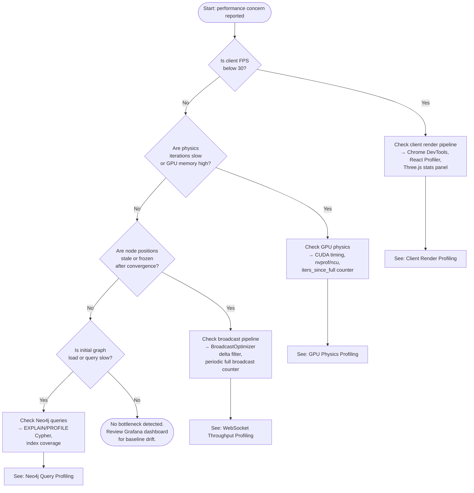

# Performance Profiling Guide

This guide walks through locating and diagnosing performance bottlenecks in VisionClaw across four domains: GPU physics, WebSocket/broadcast throughput, client rendering, and Neo4j queries. Each section gives concrete commands, observable symptoms, and the expected baseline numbers derived from the benchmark suite.

---

## Overview

VisionClaw's performance envelope spans the full stack. A slowdown in one layer often manifests as symptoms in another — stale positions in the client may trace back to a silently-failing broadcast pipeline, not a rendering bug. Before instrumenting any single component, use the decision tree below to route your investigation.

The four bottleneck domains are:

| Domain | Primary actor | What degrades |
|--------|--------------|---------------|
| **GPU physics** | `ForceComputeActor` | Frame computation time, convergence rate, energy propagation |
| **WebSocket/broadcast** | `BroadcastOptimizer` → `ClientCoordinatorActor` | Position update latency, delta filter hit rate, stale-position window |
| **Client render** | `GraphManager`, `InstancedLabels`, WASM FX | FPS, draw calls, SAB data races, label layout time |
| **Neo4j queries** | Cypher query executor | Graph load time, ontology traversal, SUBCLASS_OF chain performance |

---

## Decision Tree



---

## GPU Physics Profiling

### Enable CUDA Timing in ForceComputeActor

`ForceComputeActor` records per-iteration timing using CUDA events. Enable verbose timing output by setting the environment variable before starting VisionClaw:

```bash
VISIONCLAW_CUDA_TIMING=1 cargo run --release
```

With timing enabled, `ForceComputeActor` logs per-frame breakdown to `stdout` at INFO level:

```
[ForceComputeActor] iter=312 grid=0.31ms force=2.48ms integrate=0.49ms semantic=2.51ms stability=0.72ms total=10.82ms
```

To capture a rolling window without drowning other logs:

```bash
VISIONCLAW_CUDA_TIMING=1 ./visionclaw 2>&1 | grep '\[ForceComputeActor\]' | tee cuda_timing.log
```

### Key Metrics to Inspect

| Metric | How to read it | Expected baseline (RTX 4080, 100K nodes) |
|--------|---------------|------------------------------------------|
| `total` frame time | Sum of all kernel phases | < 10 ms (benchmark: 4.5 ms) |
| `force` kernel time | Barnes-Hut repulsion + Hooke's springs | < 3 ms (benchmark: 2.3 ms) |
| `grid` construction | 3D spatial hash rebuild | < 0.5 ms (benchmark: 0.3 ms) |
| `stability` check | Kinetic energy threshold | < 1 ms (benchmark: 0.7 ms) |
| `semantic` forces | OWL-constrained kernel batch | < 3 ms for 10K nodes (~2.3 ms total ontology overhead) |
| `iters_since_full` | Frames since last full position broadcast | Must reach 300 and reset; if it never resets, broadcast is stuck |
| Convergence frame | Frame count at which KE drops below threshold | ~600 frames during warm-up |

The 55× speedup over CPU serial (`246 ms → 4.5 ms` at 100K nodes) is the production baseline. If total frame time exceeds 10 ms at 100K nodes on an RTX 4080, the simulation is degraded.

### Monitoring the Periodic Broadcast Counter

The most common silent failure in the GPU pipeline is the periodic full broadcast not firing. This happens when `iters_since_full` increments indefinitely without triggering a reset. To check:

```bash
# Via REST endpoint
curl -s http://localhost:8080/api/physics/stats | jq '.iters_since_full, .last_full_broadcast_at'
```

If `iters_since_full` is above 300 and `last_full_broadcast_at` is stale (more than 6 seconds ago at 60 FPS), the broadcast pipeline is broken. Check whether `filtered_indices.is_empty()` is `false` AND `iters_since_full >= 300` — both branches in `force_compute_actor.rs` must check the interval.

### Deep Profiling with nvprof / Nsight Compute

For kernel-level profiling, use Nsight Compute (`ncu`). Run against the VisionClaw process PID:

```bash
# Profile a single kernel invocation
ncu --target-processes all \
    --kernel-name "compute_forces_kernel" \
    --metrics "sm__throughput.avg.pct_of_peak_sustained_elapsed,l1tex__t_bytes.sum" \
    --output force_kernel_profile \
    -- ./visionclaw

# Legacy nvprof (CUDA < 12)
nvprof --log-file nvprof_output.log \
       --metrics achieved_occupancy,warp_efficiency \
       ./visionclaw
```

Key metrics to inspect in `ncu` output:

- **`sm__throughput`**: Should be > 70% for the force kernel. Values below 50% indicate warp divergence or memory stalls.
- **`l1tex__t_bytes`**: Unusually high values indicate the SoA memory layout is being accessed non-coalesced — check that `positions`, `velocities`, and `forces` arrays are accessed with stride-1 patterns.
- **Occupancy**: The force kernel targets 64–75% occupancy. Lower values suggest the register file is limiting active warps.

If the CUDA kernel build was compiled for the wrong architecture (e.g., sm_52 fallback due to `CUDA_ARCH` not propagating through multi-stage Docker builds), performance will be 3–5× below baseline. Verify with:

```bash
cuobjdump -ptx ./libphysics.so | grep ".target"
# Expected: .target sm_86  (or your target arch)
```

---

## WebSocket Throughput Profiling

### Binary Frame Size Monitoring

VisionClaw uses a 34-byte per-node wire format for client position updates. Each binary WebSocket frame carries `N` node updates, where `N` depends on the delta filter output:

| Wire format | Bytes per node | When used |
|-------------|---------------|-----------|
| Client position update (V2) | 34 bytes | Normal delta broadcast |
| GPU internal `BinaryNodeDataGPU` (V3) | 48 bytes | Internal GPU actor messages only; not sent to clients |

To observe actual frame sizes from the server side, enable WebSocket frame logging:

```bash
VISIONCLAW_WS_TRACE=1 ./visionclaw 2>&1 | grep '\[WS\]' | awk '{print $4, $5}'
```

In the browser, open Chrome DevTools → Network → filter by `WS` → select the VisionClaw connection → Messages tab. Each binary frame should be `34 × N` bytes for a batch of `N` nodes. If frames are consistently zero bytes or absent, see the next section.

### Detecting the Delta Compressor Filter Bug

The `BroadcastOptimizer` filters out nodes whose positions have not moved beyond a delta threshold. When physics converges, ALL nodes fall below threshold simultaneously — the optimizer emits zero nodes — and `GraphStateActor` never receives a position update.

Symptoms:
- All node positions in the client freeze at a fixed layout
- Late-connecting clients see no nodes at all (positions at 0,0,0)
- Chrome DevTools WS messages show binary frames arriving but with zero payload bytes

Diagnosis steps:

```bash
# Check optimizer stats via REST
curl -s http://localhost:8080/api/broadcast/stats | jq '{
  delta_filter_hit_rate: .delta_filtered_nodes,
  total_nodes: .total_nodes,
  last_full_broadcast: .last_full_broadcast_timestamp,
  iters_since_full: .iters_since_full
}'
```

A `delta_filter_hit_rate` of 100% (all nodes filtered) combined with `iters_since_full > 300` confirms the bug. The fix is verified when `last_full_broadcast_timestamp` advances every ~5 seconds regardless of physics state.

### Checking BroadcastOptimizer Hit Rate

The target delta filter hit rate is 60–80% during active settling (meaning 20–40% of nodes broadcast per frame). During convergence the rate rises to 100% briefly, but the periodic full broadcast should keep clients current.

```bash
# Watch broadcast stats every 2 seconds
watch -n 2 "curl -s http://localhost:8080/api/broadcast/stats | jq '.delta_filtered_pct'"
```

If the hit rate is consistently below 60% during settling, the delta threshold is too tight — more nodes are being broadcast than necessary, increasing bandwidth. If it never drops below 100% after convergence (and `iters_since_full` never resets), the periodic broadcast fix is not in effect.

---

## Client Render Profiling

### Chrome DevTools Performance Tab

1. Open Chrome DevTools → Performance tab.
2. Enable "Screenshots" and set CPU throttle to 4× to surface bottlenecks on lower-end hardware.
3. Record 5–10 seconds while the graph is actively settling.
4. Look for:
   - **Long `useFrame` tasks** (> 8 ms) in the Flame chart. These block the animation loop.
   - **Layout thrash**: `GraphManager.useFrame` at priority -2 should complete before labels at priority -1. If priorities are inverted, label layout runs before positions are updated.
   - **GC pauses** > 16 ms indicate per-frame heap allocations. The two-phase `InstancedLabels` architecture eliminates per-node `GlyphInstance[]` allocations — if GC pauses are present, check for regressions in `layoutTextInline()`.

### React Profiler

```tsx
// Wrap GraphManager temporarily
import { Profiler } from 'react';

<Profiler id="GraphManager" onRender={(id, phase, actualDuration) => {
  if (actualDuration > 8) console.warn(`[Profiler] ${id} ${phase} ${actualDuration.toFixed(1)}ms`);
}}>
  <GraphManager />
</Profiler>
```

Any `actualDuration > 8 ms` during the `update` phase indicates that a React re-render is on the critical path. Most of VisionClaw's hot-path work happens inside `useFrame` callbacks (which are not React renders), so React Profiler overhead is not a concern for steady-state rendering — it only fires when Zustand state changes trigger re-renders.

### Three.js Stats Panel

Enable the built-in stats overlay by setting the `showStats` setting to `true` in the VisionClaw settings panel, or via:

```bash
curl -X PATCH http://localhost:8080/api/settings \
  -H 'Content-Type: application/json' \
  -d '{"debugShowStats": true}'
```

The stats panel shows:

| Stat | Target | Alert |
|------|--------|-------|
| FPS | 60 | < 30 |
| Frame time (ms) | < 16.7 | > 33 |
| Draw calls | 1 (instanced) | > 10 |
| Geometry count | Stable after load | Growing indicates leaks |

With GPU instancing active, the entire node set renders in a single draw call per node type (GemNode, CrystalOrb, AgentCapsule) — 3 draw calls total for nodes, plus 1 for GlassEdges. If draw calls exceed 10, instancing has been disabled or a fallback renderer is active.

### InstancedLabels Two-Phase useFrame Timing

`InstancedLabels` runs a two-phase `useFrame` at priority -1:

- **Phase 1 (every frame)**: Patches `aLabelPos` attribute from the SAB for all existing glyphs. Target: < 1 ms.
- **Phase 2 (every 3 frames)**: Full layout rebuild with frustum cull + `layoutTextInline()`. Target: < 3 ms.

To time these phases in the browser console:

```javascript
// Paste into DevTools console while graph is running
window.__LABEL_TIMING = true;
// VisionClaw reads this flag in InstancedLabelsWebGL and logs phase timings
```

If Phase 1 takes > 2 ms, the SAB read pattern is inefficient — check that `nodePositionsRef?.current` is captured once at the top of `useFrame` and reused across both phases, not re-fetched per glyph.

### SAB Data Race Symptom

If node labels or positions jump to (0, 0, 0) on every third frame, a SAB data race is occurring. The symptom pattern:

- Positions appear correct for 2 frames
- On the third frame, all nodes collapse to the origin
- Positions recover on the next frame

Root cause: `InstancedLabels` Phase 2 reads `nodePositionsRef.current` after the Physics Worker has zeroed and re-written the buffer. Fix: capture `nodePositionsRef.current` at the start of `useFrame` before either phase executes.

---

## Neo4j Query Profiling

### Using EXPLAIN and PROFILE

Connect to the Neo4j Browser at `http://localhost:7474` (or via `cypher-shell`) and prefix any slow query with `EXPLAIN` (dry run) or `PROFILE` (execute and measure):

```cypher
-- Dry run: shows query plan without executing
EXPLAIN MATCH (n:KGNode)-[r:LINKED_TO]->(m:KGNode)
WHERE n.graph_type = 'knowledge'
RETURN n.id, m.id, r.weight
LIMIT 1000;

-- Execute and measure: shows actual row counts and db hits
PROFILE MATCH (n:KGNode)-[r:LINKED_TO]->(m:KGNode)
WHERE n.graph_type = 'knowledge'
RETURN n.id, m.id, r.weight
LIMIT 1000;
```

In the `PROFILE` output, look for:

- **`db hits`** higher than the number of returned rows by > 10×: missing index on the filter property.
- **`NodeByLabelScan`** instead of `NodeIndexSeek`: the label lacks an index.
- **`Filter`** operator at the top of the plan with high `db hits`: predicate is evaluated post-scan rather than at index time.

### Key Slow Queries

**Full graph fetch** (called at client connect via `GET /api/graph/data`):

```cypher
-- Slow without index on id
MATCH (n:KGNode) RETURN n.id, n.label, n.node_type, n.x, n.y, n.z;

-- With index, this should return in < 100 ms for 100K nodes
-- Target: < 3.2 s for initial 100K-node load (benchmark baseline)
```

**Ontology traversal** (triggered on ontology import):

```cypher
PROFILE MATCH path = (child:OwlClass)-[:SUBCLASS_OF*1..5]->(parent:OwlClass)
RETURN child.label, parent.label, length(path) as depth
ORDER BY depth DESC
LIMIT 500;
```

A `SUBCLASS_OF` chain query without a relationship index performs a full relationship scan. With 623 `SUBCLASS_OF` relationships (from the VisionClaw knowledge graph), this should run in < 20 ms. If it exceeds 100 ms, the relationship index is missing.

**PageRank query** (background analytics, target < 95 ms avg):

```cypher
PROFILE CALL gds.pageRank.stream('graphProjection')
YIELD nodeId, score
RETURN gds.util.asNode(nodeId).id AS id, score
ORDER BY score DESC LIMIT 100;
```

### Index Recommendations

Apply these indexes after any fresh Neo4j install or graph schema migration:

```cypher
-- Node lookups by ID (used by every graph fetch)
CREATE INDEX node_id_index FOR (n:KGNode) ON (n.id);

-- Node type filtering (used by /api/graph/data?graph_type=...)
CREATE INDEX node_type_index FOR (n:KGNode) ON (n.node_type);

-- OWL class label lookups (used by ontology edge mapping)
CREATE INDEX owl_class_label FOR (o:OwlClass) ON (o.label);

-- Relationship type index for SUBCLASS_OF traversal
CREATE INDEX subclass_rel_index FOR ()-[r:SUBCLASS_OF]-() ON (r.weight);

-- Verify indexes are online
SHOW INDEXES WHERE state = 'ONLINE';
```

After creating indexes, run `CALL db.awaitIndexes(300)` to wait for population to complete before benchmarking.

### Expected Query Performance

| Query | Avg target | P95 target | Alert threshold |
|-------|-----------|-----------|-----------------|
| Get node by ID | < 1 ms | < 2 ms | > 5 ms |
| Get neighbours (depth=1) | < 3 ms | < 5 ms | > 20 ms |
| Full graph fetch (100K nodes) | < 3.2 s | < 5 s | > 10 s |
| SUBCLASS_OF traversal (depth 5) | < 20 ms | < 45 ms | > 100 ms |
| PageRank (100K nodes) | < 95 ms | < 140 ms | > 500 ms |
| Community detection | < 450 ms | < 680 ms | > 2 s |

---

## Position Update Pipeline — Sequence Diagram

The diagram below shows the full position update pipeline from physics kernel to client SAB, with annotations for where to insert timing probes.

```mermaid
sequenceDiagram
    participant GPU as ForceComputeActor<br/>(CUDA kernels)
    participant Opt as BroadcastOptimizer
    participant GSS as GraphServiceSupervisor<br/>→ GraphStateActor
    participant POA as PhysicsOrchestratorActor
    participant CCA as ClientCoordinatorActor
    participant WS as WebSocket frames
    participant SAB as Client SharedArrayBuffer

    Note over GPU: TIMING PROBE A<br/>CUDA event: end of integrate_kernel

    GPU->>GPU: check_system_stability_kernel (KE threshold)

    alt iters_since_full >= 300 OR nodes still moving
        GPU->>Opt: UpdateNodePositions(delta_mask, positions[])
        Note over GPU,Opt: TIMING PROBE B<br/>CPU timestamp: message send
    end

    Opt->>Opt: Delta compress (filter nodes below threshold)
    Note over Opt: TIMING PROBE C<br/>Log: filtered_count / total_count

    Opt->>GSS: UpdatePositions(active_nodes[])
    Note over Opt,GSS: TIMING PROBE D<br/>Actor message latency

    GSS->>GSS: GraphStateActor: update in-memory position cache
    GSS->>POA: BroadcastPositions(positions[])

    POA->>CCA: Forward to ClientCoordinatorActor

    Note over CCA: TIMING PROBE E<br/>Viewport filter: cull off-screen nodes

    CCA->>WS: Binary WebSocket frame<br/>(34 bytes × N active nodes)

    Note over WS,SAB: TIMING PROBE F<br/>Client: performance.now() on message event

    WS->>SAB: Physics Worker writes positions to SAB
    SAB->>SAB: GraphManager.useFrame reads SAB<br/>(priority -2, every frame)

    Note over SAB: TIMING PROBE G<br/>InstancedLabels Phase 1 patch timing
```

**Where to add probes in practice:**

- **Probe A**: `cudaEventRecord` around `integrate_kernel` in `force_compute_actor.rs`. Already logged when `VISIONCLAW_CUDA_TIMING=1`.
- **Probe B**: `tracing::info!` span around the `UpdateNodePositions` message dispatch.
- **Probe C**: `BroadcastOptimizer` already logs filter rate. Increase log level to DEBUG for per-frame output.
- **Probe D**: Actix actor message latency is observable via Jaeger distributed tracing — instrument the message handler with a `tracing::instrument` span.
- **Probe E**: Add `performance_counter` in `ClientCoordinatorActor::handle_broadcast_positions`.
- **Probe F**: `performance.now()` in the WebSocket `onmessage` handler (`websocket-service.ts`).
- **Probe G**: Already available via `window.__LABEL_TIMING = true` in the browser console.

---

## Benchmark Baselines

Use these numbers to determine whether observed performance is within production tolerance. Numbers are from `reference/performance-benchmarks.md` (RTX 4080, 100K nodes, 200K edges, Chrome 120, 1 Gbps LAN).

| Metric | Target | Warning threshold | Alert threshold |
|--------|--------|------------------|----------------|
| Physics frame time (GPU) | 4.5 ms | 10 ms | > 16.7 ms (< 60 FPS equiv.) |
| GPU speedup vs CPU serial | 55× | < 30× | < 10× |
| Force kernel time (100K nodes) | 2.3 ms | 5 ms | > 8 ms |
| WebSocket end-to-end latency | 10 ms | 20 ms | 50 ms |
| WebSocket message size (100K nodes) | 3.6 MB/frame | 7 MB | 18 MB (JSON parity — protocol broken) |
| Binary parse time (client) | 0.8 ms | 5 ms | > 12 ms (JSON parity) |
| Client FPS (100K nodes, balanced) | 60 FPS | 30 FPS | 15 FPS |
| Draw calls (instanced) | 1 per node type | 10 | > 50 |
| Client RAM (100K nodes) | 2.8 GB | 5 GB | > 8 GB |
| Client VRAM (100K nodes) | 4.5 GB | 7 GB | > 12 GB |
| Neo4j node fetch (100K) | < 3.2 s | 5 s | > 10 s |
| Neo4j get-by-ID | < 1 ms | 2 ms | 5 ms |
| Neo4j PageRank (100K) | < 95 ms | 140 ms | 500 ms |
| Server CPU | < 30% | 60% | 85% |
| GPU VRAM utilisation | < 60% | 80% | 95% |
| `iters_since_full` reset interval | ~300 iters (~5 s) | 600 iters | Never resets |
| API P95 latency | < 50 ms | 100 ms | 500 ms |
| Stale-position window (post-convergence) | < 5 s | 10 s | Indefinite |

---

## Tooling Reference

| Tool | What it profiles | How to enable |
|------|-----------------|---------------|
| `VISIONCLAW_CUDA_TIMING=1` | Per-phase GPU kernel timing (grid, force, integrate, semantic, stability) | Environment variable before process start |
| `ncu` (Nsight Compute) | Kernel occupancy, memory throughput, warp efficiency | `ncu --target-processes all -- ./visionclaw` |
| `nvprof` (CUDA < 12) | Kernel timelines, memory bandwidth (legacy) | `nvprof --log-file out.log ./visionclaw` |
| `VISIONCLAW_WS_TRACE=1` | Binary WebSocket frame sizes, per-client throughput | Environment variable before process start |
| `GET /api/physics/stats` | `iters_since_full`, KE, convergence state, broadcast timestamps | Always available; no flag needed |
| `GET /api/broadcast/stats` | Delta filter hit rate, nodes per frame, last full broadcast | Always available |
| `GET /api/ontology-physics/constraints` | `gpu_failure_count`, `cpu_fallback_count` per constraint type | Always available |
| Prometheus + Grafana | Long-term metric trends, frame rate drift, memory growth | Deploy `docker-compose.monitoring.yml` |
| Jaeger distributed tracing | Actor message latency end-to-end across supervision tree | `VISIONCLAW_JAEGER_ENDPOINT=http://jaeger:4317` |
| Chrome DevTools — Performance | Client-side frame budget, GC pauses, React re-render cost | F12 → Performance tab → Record |
| Chrome DevTools — Network (WS) | Binary frame sizes, message frequency, connection drops | F12 → Network → filter WS |
| React Profiler | React render duration per component | Wrap with `<Profiler>` in development builds |
| Three.js Stats overlay | FPS, frame ms, draw calls, geometry count | `debugShowStats: true` in VisionClaw settings |
| `window.__LABEL_TIMING = true` | InstancedLabels Phase 1 and Phase 2 timing per frame | Browser console, development build only |
| Neo4j Browser `PROFILE` | Cypher query db hits, operator plan, index usage | Prefix any Cypher query with `PROFILE` |
| `cypher-shell` | Scripted query benchmarking, batch index creation | `cypher-shell -u neo4j -p <pass>` |
| `cuobjdump -ptx` | Verify compiled PTX target architecture | `cuobjdump -ptx ./libphysics.so \| grep ".target"` |

---

## Related Documentation

- [GPU Physics Engine](../explanation/physics-gpu-engine.md) — architecture of `ForceComputeActor`, `BroadcastOptimizer`, SimParams fields, the periodic full broadcast fix, and CUDA build system details
- [Performance Benchmarks](../reference/performance-benchmarks.md) — full benchmark tables for all subsystems, test environment specification, and scalability data up to 1M nodes
- [Actor Hierarchy](../explanation/actor-hierarchy.md) — supervision strategies for `PhysicsSupervisor` (AllForOne) and how actor failure isolation affects the profiling surface
- [Client Architecture](../explanation/client-architecture.md) — React Three Fiber component hierarchy, SAB position delivery, and the InstancedLabels two-phase rendering architecture
