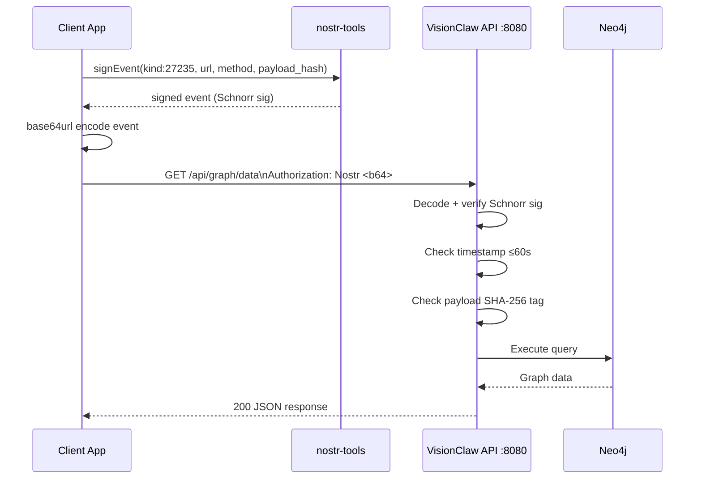
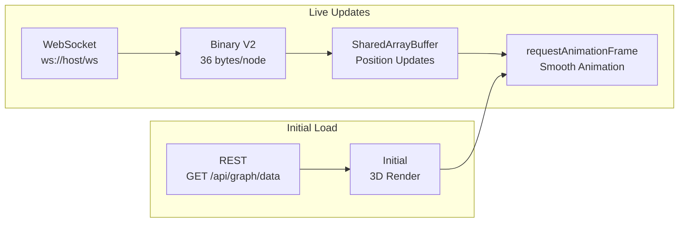

# VisionClaw REST API Integration Guide

This guide shows how to accomplish real tasks with the VisionClaw REST API. For raw endpoint listings, see [REST API Reference](../reference/rest-api.md). For WebSocket binary frame format, see [WebSocket Binary Protocol](../reference/websocket-binary.md).

---

## 1. Prerequisites

- VisionClaw running locally or deployed. See [deployment-guide.md](deployment-guide.md).
- A Nostr keypair. Generate one with `nostr-tools` (see Section 2) or a browser extension such as Alby or nos2x.
- Any HTTP client: `curl`, `fetch`, `axios`, or similar.

**Base URLs**:

| Environment | REST API | WebSocket |
|-------------|----------|-----------|
| Development | `http://localhost:8080` | `ws://localhost:8080/wss` |
| Production | `https://<your-host>` | `wss://<your-host>/wss` |

All REST paths are prefixed with `/api/`. The OpenAPI UI is available at `http://localhost:8080/swagger-ui/`.

```mermaid
graph TD
    API[VisionClaw API\nlocalhost:8080] --> Graph[/api/graph/*\nNodes · Edges · Data]
    API --> Settings[/api/settings/*\nUser Preferences]
    API --> Ontology[/api/ontology/*\nOWL Query · Update]
    API --> Admin[/api/admin/*\nSync · Force-sync]
    API --> Agents[/api/agents/*\nStatus · Run Skills]
    API --> Analytics[/api/analytics/*\nGPU Metrics]
    API --> Solid[/solid/*\nPod Resources]
    API --> Health[/health\nService Status]
```

*Figure: VisionClaw API endpoint groups — all paths are served from port 8080*

---

## 2. Authentication — Step by Step

VisionClaw uses [NIP-98](https://github.com/nostr-protocol/nips/blob/master/98.md) HTTP authentication. Each mutating request requires a signed Nostr event embedded in the `Authorization` header. After the first authenticated request the server issues a session token, allowing subsequent requests to use the lighter `Bearer` scheme.



*Figure: NIP-98 authentication sequence — every mutating request carries a freshly signed Nostr event*

### 2.1 Generate a keypair (one-time)

```typescript
import { generatePrivateKey, getPublicKey } from 'nostr-tools'

const privateKey = generatePrivateKey()   // 32-byte hex
const publicKey  = getPublicKey(privateKey)

// Store these securely. Never commit them to version control.
```

### 2.2 Build a NIP-98 auth event

```typescript
import { finishEvent } from 'nostr-tools'
import { createHash } from 'crypto'

function sha256Hex(body: string): string {
  return createHash('sha256').update(body).digest('hex')
}

function createAuthEvent(
  url: string,
  method: string,
  privateKey: string,
  body?: string
) {
  const tags: string[][] = [
    ['u', url],
    ['method', method.toUpperCase()],
  ]

  if (body) {
    tags.push(['payload', sha256Hex(body)])
  }

  return finishEvent(
    {
      kind: 27235,
      created_at: Math.floor(Date.now() / 1000),
      tags,
      content: '',
    },
    privateKey
  )
}
```

**Required constraints** (server enforces these):
- `created_at` must be within **60 seconds** of server time.
- Each event is single-use — replay protection is enforced server-side.
- POST/PUT requests must include a `payload` tag containing the SHA-256 hex hash of the request body.

### 2.3 Reusable authenticated fetch wrapper

```typescript
const BASE_URL = 'http://localhost:8080/api'

// After first NIP-98 auth the server returns a session token.
// Store it and reuse via Bearer to avoid signing every request.
let sessionToken: string | null =
  localStorage.getItem('nostr_session_token')

async function apiCall(
  endpoint: string,
  method = 'GET',
  body?: object
): Promise<unknown> {
  const url = `${BASE_URL}${endpoint}`
  const bodyStr = body ? JSON.stringify(body) : undefined

  const headers: Record<string, string> = {
    'Content-Type': 'application/json',
    'X-Nostr-Pubkey': publicKey,
  }

  if (sessionToken) {
    headers['Authorization'] = `Bearer ${sessionToken}`
  } else {
    const authEvent = createAuthEvent(url, method, privateKey, bodyStr)
    headers['Authorization'] = `Nostr ${btoa(JSON.stringify(authEvent))}`
  }

  const response = await fetch(url, {
    method,
    headers,
    body: bodyStr,
  })

  // Capture session token from first successful auth
  const newToken = response.headers.get('X-Session-Token')
  if (newToken) {
    sessionToken = newToken
    localStorage.setItem('nostr_session_token', newToken)
  }

  if (!response.ok) {
    const err = await response.json().catch(() => ({ error: response.statusText }))
    const error = Object.assign(new Error(`API ${response.status}`), {
      status: response.status,
      body: err,
    })
    throw error
  }

  return response.json()
}
```

**Session token details**: Tokens are stored in `localStorage` as `nostr_session_token`. Expiry is controlled by the `AUTH_TOKEN_EXPIRY` environment variable (default: 3600 seconds). On expiry, re-authenticate with a fresh NIP-98 event.

**Dev bypass**: Set `SETTINGS_AUTH_BYPASS=true` on the server to treat all requests as `dev-user`. For local development only.

---

## 3. Common Workflows

### 3a. Fetch the knowledge graph

```typescript
const graph = await apiCall('/graph/data') as {
  nodes: { id: string; label: string; node_type: string; metadata: object }[]
  edges: { id: string; source: string; target: string; relationship: string; weight: number }[]
  node_count: number
  edge_count: number
}

// Filter to a single type
const knowledgeOnly = await apiCall('/graph/data?graph_type=knowledge')

// Lightweight stats check before committing to a full download
const stats = await apiCall('/graph/stats')
console.log(`Graph has ${stats.node_count} nodes and ${stats.edge_count} edges`)
```

Node IDs are sequential `u32` values starting at 1. Always use `String()` coercion when comparing IDs — never `===` on raw numbers.

### 3b. Get and update settings

```typescript
// Read all settings (works anonymously; returns user-specific settings when authenticated)
const settings = await apiCall('/settings')

// Update a single key
await apiCall('/settings/physics.damping', 'PUT', { value: 0.85 })

// Bulk update multiple keys in one round-trip
await apiCall('/settings/bulk', 'POST', {
  changes: [
    { key: 'physics.damping',         value: 0.85 },
    { key: 'physics.spring',          value: 0.3  },
    { key: 'rendering.maxNodes',      value: 500000 },
  ],
})

// User-specific filter settings
await apiCall('/settings/user/filter', 'PUT', {
  enabled:             true,
  quality_threshold:   0.8,
  authority_threshold: 0.6,
  filter_by_quality:   true,
  filter_by_authority: false,
  filter_mode:         'or',
  max_nodes:           5000,
})
```

### 3c. Query ontology

```typescript
// List all OWL classes
const { classes, total } = await apiCall('/ontology/classes') as {
  classes: { iri: string; label: string; subclassOf: string | null }[]
  total: number
}

// Retrieve the full hierarchy up to depth 3
const hierarchy = await apiCall('/ontology/hierarchy?max-depth=3')

// Run the Whelk EL++ reasoner to infer new axioms
const inferred = await apiCall('/ontology/classify', 'POST') as {
  'inferred-axioms': { axiomType: string; subjectIri: string; objectIri: string; confidence: number }[]
  'reasoning-time-ms': number
}
```

### 3d. Trigger a GitHub sync

```typescript
// Incremental sync (respects SHA1 cache — only re-processes changed files)
await apiCall('/admin/sync/trigger', 'POST')

// Force full re-sync regardless of SHA1 cache
await apiCall('/admin/sync/force', 'POST')

// Check sync status
const syncStatus = await apiCall('/admin/sync/status')
console.log(`Last sync: ${syncStatus.last_sync_at}, status: ${syncStatus.status}`)
```

Only files tagged `public:: true` become knowledge graph page nodes. Ontology blocks (`### OntologyBlock`) are extracted from all files.

### 3e. Work with bots (agents)

```typescript
// List registered bots
const { bots } = await apiCall('/bots') as {
  bots: { id: string; name: string; pubkey: string }[]
}

// Register a new bot
const bot = await apiCall('/bots/register', 'POST', {
  name:        'knowledge-curator',
  description: 'Automated knowledge graph curation agent',
  pubkey:      publicKey,
})

// Submit a brief and spawn role agents
const brief = await apiCall('/briefs', 'POST', {
  briefing: {
    content: 'Analyse the design patterns subgraph for clustering opportunities',
    roles:   ['analyst', 'curator', 'reviewer'],
  },
  user_context: { display_name: 'John', pubkey: publicKey },
}) as { brief_id: string; bead_id: string; role_tasks: object[] }

// Retrieve the consolidated debrief
await apiCall(`/briefs/${brief.brief_id}/debrief`, 'POST', {
  role_tasks:   brief.role_tasks,
  user_context: { display_name: 'John', pubkey: publicKey },
})
```

### 3f. GPU analytics

```typescript
// Shortest path between two nodes
const path = await apiCall('/analytics/pathfinding/42/99')
// { path: [42, 17, 99], distance: 2.0, computation_time_ms: 8 }

// Single-source shortest paths from node 0 (GPU-accelerated)
const sssp = await apiCall('/analytics/pathfinding/sssp', 'POST', {
  sourceIdx:   0,
  maxDistance: 5.0,   // omit for full-graph
})
// sssp.result.distances[i] = distance from node 0 to node i; Infinity means unreachable

// Connected components detection
const cc = await apiCall('/analytics/pathfinding/connected-components', 'POST', {
  maxIterations: 100,
})
console.log(`Graph has ${cc.result.numComponents} components`)

// Check whether GPU features are compiled in before issuing GPU calls
const flags = await apiCall('/analytics/feature-flags')
if (!flags.gpu_enabled) console.warn('GPU analytics unavailable — falling back')
```

---

## 4. Combining REST + WebSocket

The recommended pattern for real-time graph visualisation: load the static graph topology via REST, then stream live physics positions over the binary WebSocket.



*Figure: REST + WebSocket combination — REST delivers topology once, WebSocket streams position updates continuously*

```typescript
// Step 1 — load topology via REST
const { nodes, edges } = await apiCall('/graph/data') as {
  nodes: { id: string; label: string; node_type: string }[]
  edges: { source: string; target: string }[]
}
renderGraph(nodes, edges)

// Step 2 — stream live positions via WebSocket
const token = localStorage.getItem('nostr_session_token')
const ws = new WebSocket(
  `ws://localhost:8080/wss${token ? `?token=${token}` : ''}`
)

ws.onopen = () => {
  // Authenticate over the socket (required if not passing token in URL)
  ws.send(JSON.stringify({ type: 'authenticate', token, pubkey: publicKey }))

  // Subscribe to position updates
  ws.send(JSON.stringify({ type: 'subscribe_position_updates' }))
}

ws.onmessage = (event: MessageEvent) => {
  if (typeof event.data === 'string') {
    // JSON control frame (state_sync, subscription_confirmed, heartbeat…)
    const msg = JSON.parse(event.data)
    if (msg.type === 'heartbeat') ws.send(JSON.stringify({ type: 'heartbeat' }))
    return
  }

  // Binary frame — V2 protocol: 1 version byte + 36 bytes/node
  const buffer = event.data as ArrayBuffer
  const view   = new DataView(buffer)
  const version = view.getUint8(0)

  if (version !== 2) {
    console.warn(`Unexpected WS protocol version: ${version}`)
    return
  }

  const nodeCount = (buffer.byteLength - 1) / 36
  for (let i = 0; i < nodeCount; i++) {
    const offset = 1 + i * 36
    const nodeId = view.getUint32(offset,      true)
    const x      = view.getFloat32(offset + 4,  true)
    const y      = view.getFloat32(offset + 8,  true)
    const z      = view.getFloat32(offset + 12, true)
    updateNodePosition(String(nodeId), x, y, z)
  }
}

// Send a heartbeat every 25 seconds to keep the connection alive
setInterval(() => ws.send(JSON.stringify({ type: 'heartbeat' })), 25_000)
```

The server sends V2 binary frames by default. V3 (48 bytes/node, includes analytics fields) and experimental V4 delta frames are also available — the first byte of every binary frame identifies the version.

---

## 5. Error Handling

VisionClaw returns structured error bodies for all 4xx/5xx responses.

```typescript
interface ApiError {
  error:    string          // human-readable message
  code?:    string          // VisionClaw error code, e.g. "AP-E-305"
  details?: Record<string, unknown>
}
```

Error code format: `[SYSTEM]-[SEVERITY]-[NUMBER]`. Key codes for integrators:

| Code | Meaning | Action |
|------|---------|--------|
| `AP-E-101` | Missing auth token | Add `Authorization` header |
| `AP-E-102` | Invalid or expired token | Re-authenticate with a new NIP-98 event |
| `AP-E-103` | Session token expired | Re-authenticate; issue new NIP-98 event |
| `AP-E-305` | Rate limit exceeded | Exponential back-off; check `Retry-After` header |
| `AP-E-307` | Operation timeout | Retry; consider reducing request scope |
| `AP-E-201` | Resource not found | Verify the ID exists via a GET first |

```typescript
async function apiCallWithRetry(
  endpoint: string,
  method = 'GET',
  body?: object,
  maxRetries = 3
): Promise<unknown> {
  for (let attempt = 0; attempt < maxRetries; attempt++) {
    try {
      return await apiCall(endpoint, method, body)
    } catch (err: unknown) {
      const e = err as { status?: number; body?: ApiError }

      if (e.status === 429) {
        // Rate limited — exponential back-off
        const delay = Math.pow(2, attempt) * 1000
        await new Promise(resolve => setTimeout(resolve, delay))
        continue
      }

      if (e.status === 401) {
        // Token expired — clear and force NIP-98 re-auth on next call
        sessionToken = null
        localStorage.removeItem('nostr_session_token')
        continue
      }

      throw err
    }
  }
  throw new Error(`Failed after ${maxRetries} attempts: ${endpoint}`)
}
```

---

## 6. Pagination

`/graph/data` returns the full graph in one payload. For large datasets use the node-level endpoint with cursor pagination:

```typescript
interface NodePage {
  nodes:       { id: string; label: string; node_type: string }[]
  next_cursor: string | null
}

async function fetchAllNodes(pageSize = 100): Promise<NodePage['nodes']> {
  const nodes: NodePage['nodes'] = []
  let cursor: string | null = null

  do {
    const params = new URLSearchParams({ limit: String(pageSize) })
    if (cursor) params.set('cursor', cursor)

    const page = await apiCall(`/graph/nodes?${params}`) as NodePage
    nodes.push(...page.nodes)
    cursor = page.next_cursor
  } while (cursor)

  return nodes
}
```

For ontology data, use `?max-depth=N` on `/api/ontology/hierarchy` to cap response size rather than paginating.

---

## 7. Client Libraries

There is no official SDK. The `apiCall` helper in Section 2 is sufficient for most integrations. For a more structured client, the minimal pattern below wraps all endpoint groups:

```typescript
class VisionClawClient {
  constructor(
    private base: string,
    private privateKey: string,
    private publicKey: string
  ) {}

  private async call(path: string, method = 'GET', body?: object) {
    // ... same logic as apiCall above, using this.base / this.privateKey
  }

  graph   = { data: (type?: string) => this.call(`/graph/data${type ? `?graph_type=${type}` : ''}`),
               stats: () => this.call('/graph/stats'),
               node:  (id: string) => this.call(`/graph/node/${id}`) }

  settings = { getAll:     ()                     => this.call('/settings'),
                update:    (key: string, val: unknown) => this.call(`/settings/${key}`, 'PUT', { value: val }),
                bulkUpdate: (changes: object[])   => this.call('/settings/bulk', 'POST', { changes }),
                userFilter: (f: object)           => this.call('/settings/user/filter', 'PUT', f) }

  ontology = { classes:   () => this.call('/ontology/classes'),
                hierarchy: (depth?: number) => this.call(`/ontology/hierarchy${depth ? `?max-depth=${depth}` : ''}`),
                classify:  () => this.call('/ontology/classify', 'POST') }

  sync     = { trigger:  () => this.call('/admin/sync/trigger', 'POST'),
                force:    () => this.call('/admin/sync/force',   'POST'),
                status:   () => this.call('/admin/sync/status') }

  bots     = { list:     () => this.call('/bots'),
                register: (b: object) => this.call('/bots/register', 'POST', b) }
}
```

---

## 8. Rate Limits Reference

| Endpoint group | Limit | Window | Error code |
|----------------|-------|--------|------------|
| All endpoints (default) | 100 req | 60 s | `AP-E-305` |
| POST `/ontology/classify` | 10 req | 60 s | `AP-E-305` |
| POST `/analytics/pathfinding/sssp` | 20 req | 60 s | `AP-E-305` |
| POST `/analytics/pathfinding/apsp` | 5 req | 60 s | `AP-E-305` |
| POST `/admin/sync/*` | 2 req | 300 s | `AP-E-305` |
| GET `/graph/data` | 60 req | 60 s | `AP-E-305` |

When rate-limited the server responds with HTTP 429 and a `Retry-After` header indicating seconds to wait. Use exponential back-off as shown in Section 5.

---

## 9. Testing API Calls with curl

For ad-hoc testing, generate a signed NIP-98 event from the command line using Node.js and `nostr-tools`:

```bash
# Install nostr-tools globally if not present
npm install -g nostr-tools

# Set your private key (hex)
SK="your_private_key_hex_here"
TARGET_URL="http://localhost:8080/api/graph/data"
METHOD="GET"

AUTH=$(node -e "
  const { finishEvent, getPublicKey } = require('nostr-tools')
  const sk = process.env.SK
  const pk = getPublicKey(sk)
  const event = finishEvent({
    kind:       27235,
    created_at: Math.floor(Date.now() / 1000),
    tags:       [['u', process.env.TARGET_URL], ['method', process.env.METHOD]],
    content:    '',
    pubkey:     pk,
  }, sk)
  console.log(Buffer.from(JSON.stringify(event)).toString('base64'))
" SK="$SK" TARGET_URL="$TARGET_URL" METHOD="$METHOD")

curl -s \
  -H "Authorization: Nostr $AUTH" \
  -H "X-Nostr-Pubkey: $(node -e "const {getPublicKey}=require('nostr-tools');console.log(getPublicKey('$SK'))")" \
  "$TARGET_URL" | jq .
```

For POST requests add a body hash to the `payload` tag and pass `-d` to curl:

```bash
BODY='{"changes":[{"key":"physics.damping","value":0.9}]}'
TARGET_URL="http://localhost:8080/api/settings/bulk"
METHOD="POST"

AUTH=$(node -e "
  const { finishEvent, getPublicKey } = require('nostr-tools')
  const { createHash } = require('crypto')
  const sk   = process.env.SK
  const pk   = getPublicKey(sk)
  const body = process.env.BODY
  const hash = createHash('sha256').update(body).digest('hex')
  const event = finishEvent({
    kind:       27235,
    created_at: Math.floor(Date.now() / 1000),
    tags:       [['u', process.env.TARGET_URL], ['method', 'POST'], ['payload', hash]],
    content:    '',
    pubkey:     pk,
  }, sk)
  console.log(Buffer.from(JSON.stringify(event)).toString('base64'))
" SK="$SK" TARGET_URL="$TARGET_URL" BODY="$BODY")

curl -s -X POST \
  -H "Authorization: Nostr $AUTH" \
  -H "Content-Type: application/json" \
  -d "$BODY" \
  "$TARGET_URL" | jq .
```

**Dev bypass** (local only): skip all auth by setting `SETTINGS_AUTH_BYPASS=true` on the server, then omit the `Authorization` header entirely.

---

## 10. Troubleshooting

**401 — Missing authorization token**
The `Authorization` header is absent or malformed. Ensure the header value is `Nostr <base64>` for NIP-98 or `Bearer <token>` for session auth.

**401 — Token is invalid or expired (AP-E-102/103)**
The NIP-98 event's `created_at` is outside the 60-second window, or the session token has expired (default 1 hour). Regenerate the event with the current timestamp. Re-authenticate to get a fresh session token.

**401 on a replay attempt**
VisionClaw enforces single-use events. Each request must use a freshly signed event with a new `created_at`.

**403 — Access forbidden**
The authenticated pubkey lacks the required permission. Power-user actions (sync, classify, bulk settings) require the pubkey to be listed in `POWER_USER_PUBKEYS` on the server.

**POST/PUT returns 400 with "missing payload tag"**
Mutation requests must include a `payload` tag in the NIP-98 event containing the SHA-256 hex hash of the request body. See Section 2.2.

**WebSocket disconnects immediately after upgrade**
Ensure the token is either passed as `?token=` in the WebSocket URL or sent as an `authenticate` JSON message within the first few seconds of connection. See Section 4.

**GPU analytics return `"GPU features not enabled"`**
The binary was compiled without the `gpu` feature flag, or no CUDA-capable GPU is present. Check `/api/analytics/feature-flags` before issuing GPU endpoint calls.

**Sync returns stale data**
Use `POST /api/admin/sync/force` to bypass the SHA1 incremental cache, or set `FORCE_FULL_SYNC=1` in the server environment and restart.

**Clock skew causes consistent 401s**
NIP-98 requires `created_at` within 60 seconds of server time. If the client clock is skewed, synchronise it via NTP or fetch server time from a `/api/health` endpoint before signing events.
