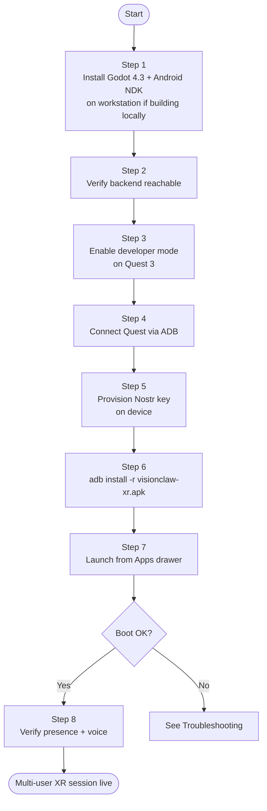

# Quest 3 Setup — VisionClaw Native APK

This guide walks you through side-loading **`visionclaw-xr.apk`** — the
native Godot 4 + godot-rust + OpenXR client — onto a Meta Quest 3 headset,
verifying that it connects to your VisionClaw deployment, and confirming
multi-user voice and presence work end-to-end.

The browser-hosted WebXR path no longer exists. The APK is the entry point.

---

## Prerequisites

| Requirement | Notes |
|---|---|
| Meta Quest 3 (Horizon OS ≥ 71) | Quest 2 works at 72 Hz; Quest Pro untested for v1 |
| Quest charged ≥ 50 % | Side-load + first launch can take 5 min |
| Meta Quest mobile app on a paired phone | Required to enable developer mode |
| Meta developer account at [developer.oculus.com](https://developer.oculus.com) | Free; required to toggle developer mode |
| USB-C cable (Quest ↔ workstation) | Or wireless ADB if already configured |
| `adb` (Android Debug Bridge) on workstation | `apt install android-tools-adb` / `brew install android-platform-tools` |
| VisionClaw deployment reachable from the headset | LAN or public TLS endpoint serving `/wss` and `/ws/presence` |
| A `did:nostr:<hex-pubkey>` you control | The APK signs NIP-98 challenges with its private half; see Step 5 |

> **No browser flags.** The APK ships its own OpenXR runtime via Godot 4.3.
> The legacy `?force=quest3` URL parameter that existed in the prior browser
> client is gone — the APK is the entry point and contains the runtime.

---

## Setup flowchart



---

## Step 1: Workstation toolchain (skip if downloading a pre-built APK)

If you are pulling a release APK from CI artefacts or an internal
distribution channel, skip to Step 3. Otherwise:

### 1.1 Install Godot 4.3 stable

```bash
# Linux
mkdir -p ~/godot && cd ~/godot
wget https://github.com/godotengine/godot/releases/download/4.3-stable/Godot_v4.3-stable_linux.x86_64.zip
unzip Godot_v4.3-stable_linux.x86_64.zip
sudo mv Godot_v4.3-stable_linux.x86_64 /usr/local/bin/godot
godot --version    # → 4.3.stable

# macOS
brew install --cask godot   # version 4.3+

# Windows: download installer from https://godotengine.org/download
```

Install the matching **Android export templates** (Godot will prompt on
first export, or run once to fetch them):

```bash
godot --headless --download-export-templates
```

### 1.2 Install Android NDK r26d and SDK

```bash
# Easiest path: Android Studio → SDK Manager → install:
#   - Android SDK Platform 34
#   - Android SDK Command-line Tools (latest)
#   - NDK (Side by Side) → 26.3.11579264 (r26d)
#   - CMake 3.22+

export ANDROID_HOME="$HOME/Android/Sdk"
export ANDROID_NDK_ROOT="$ANDROID_HOME/ndk/26.3.11579264"
export PATH="$ANDROID_HOME/platform-tools:$ANDROID_HOME/cmdline-tools/latest/bin:$PATH"

adb --version
$ANDROID_NDK_ROOT/ndk-build --version
```

Add the same paths in Godot: **Editor → Editor Settings → Export → Android**
— set `Android SDK Path` and `Android NDK Path`.

### 1.3 Install Rust + cargo-ndk for the gdext crate

```bash
curl --proto '=https' --tlsv1.2 -sSf https://sh.rustup.rs | sh
rustup target add aarch64-linux-android
cargo install cargo-ndk
```

### 1.4 Build the APK locally

```bash
cd /path/to/visionclaw

# Build the gdext shared library for Quest 3 (arm64)
cargo ndk -t aarch64-linux-android build --release \
  -p visionclaw-xr-gdext

# Stage the .so into the Godot addon directory
mkdir -p xr-client/addons/visionclaw_xr_gdext/aarch64
cp target/aarch64-linux-android/release/libvisionclaw_xr_gdext.so \
   xr-client/addons/visionclaw_xr_gdext/aarch64/

# Strip debug symbols to fit the 80 MB APK budget
$ANDROID_NDK_ROOT/toolchains/llvm/prebuilt/linux-x86_64/bin/llvm-strip \
  xr-client/addons/visionclaw_xr_gdext/aarch64/libvisionclaw_xr_gdext.so

# Headless export the APK
mkdir -p xr-client/export
godot --headless --path xr-client \
  --export-release "Quest 3 arm64" export/visionclaw-xr.apk

# Verify size
ls -lh xr-client/export/visionclaw-xr.apk    # ≤ 80 MB (PRD-008 G4)
```

CI builds the same artefact via `.github/workflows/xr-godot-apk.yml` — you
can also download it from the most recent green run on `main`.

---

## Step 2: Verify your VisionClaw backend

The APK requires both the existing graph WebSocket and the new presence
WebSocket to be reachable.

```bash
# Graph stream
curl -k -i -H "Connection: Upgrade" -H "Upgrade: websocket" \
  -H "Sec-WebSocket-Version: 13" \
  -H "Sec-WebSocket-Key: $(openssl rand -base64 16)" \
  https://your-host:3001/wss
# Expected: HTTP/1.1 101 Switching Protocols (or 401 if auth required)

# Presence stream (added by PRD-008)
curl -k -i -H "Connection: Upgrade" -H "Upgrade: websocket" \
  -H "Sec-WebSocket-Version: 13" \
  -H "Sec-WebSocket-Key: $(openssl rand -base64 16)" \
  https://your-host:3001/ws/presence
# Expected: HTTP/1.1 101 (or 401)

# Voice (LiveKit, existing service)
curl -i https://your-host:7880/
# Expected: HTTP/1.1 200 OK with LiveKit version banner
```

If `/ws/presence` returns 404, the server is missing
`src/handlers/presence_handler.rs` from PRD-008 — rebuild the `webxr`
container:

```bash
docker compose --profile dev up -d --build webxr
docker compose logs --tail=200 webxr | grep -i presence
```

---

## Step 3: Enable developer mode on Quest 3

1. Open the **Meta Quest** mobile app (the headset must be paired).
2. Tap the headset icon → **Developer Mode**.
3. Toggle **Developer Mode** to **On**. Register as a developer at
   [developer.oculus.com](https://developer.oculus.com) if prompted.
4. Put the headset on. A small developer-mode notification confirms it is
   active.
5. In the headset: **Settings → System → Developer** — confirm USB
   Connection Dialog and Wireless ADB are toggled to your preference.

---

## Step 4: Connect via ADB

### Wired USB

1. Plug a USB-C cable from your workstation to the Quest 3.
2. Approve the **Allow USB debugging?** prompt in the headset (tick
   **Always allow from this computer**).
3. From the workstation:

```bash
adb devices
# List of devices attached
# 1WMHHxxxxxxxxx    device

adb shell getprop ro.build.version.release
# A Horizon OS version string (Android 12 base)
```

### Wireless ADB (optional)

After pairing once via USB:

```bash
adb tcpip 5555
# Note the headset's LAN IP from Settings → Wi-Fi → (your network) → details
adb connect 192.168.x.y:5555
adb devices    # → 192.168.x.y:5555  device
```

---

## Step 5: Provision a Nostr key on the device

The APK authenticates to `/wss` and `/ws/presence` via **NIP-98** —
each connection signs a server-issued nonce with your `did:nostr:<hex-pubkey>`
private key. The key never leaves the device once provisioned.

### Option A: Generate a fresh key on first launch (default)

If no key exists at the APK's user data path, the APK generates a keypair
on first launch and stores the private half in the **Android Keystore**
(hardware-backed where available). You will see a one-time consent
dialog. Recommended for first-time users.

### Option B: Import an existing key

If you already have a `did:nostr:<hex-pubkey>` (e.g. from your desktop
client), push it before first launch:

```bash
# Save your existing private key (nsec/hex form) to a temporary file
echo "nsec1...." > /tmp/nostr.key

# Push to the APK's per-user data dir
adb push /tmp/nostr.key \
  /storage/emulated/0/Android/data/uk.xrsystems.visionclaw.xr/files/nostr.key

# Securely delete the local copy
shred -u /tmp/nostr.key
```

The APK reads `nostr.key` on first launch, wraps it in the Android
Keystore, and **deletes the file**. Subsequent launches use the
hardware-wrapped copy.

### Option C: External signer (NIP-07-style)

A future release will support a remote signer paired over BT/QR; for v1.0,
the in-APK Keystore-wrapped key is the only option. See PRD-008 risk R7
and the threat-model open question 10.5.

---

## Step 6: Install the APK

```bash
adb install -r xr-client/export/visionclaw-xr.apk
# Performing Streamed Install
# Success
```

Flags:
- `-r` reinstalls over an existing install, preserving user data
  (your provisioned Nostr key survives upgrades).
- Add `-t` if installing a debug-tagged build that lacks a release signature.

If `Failure [INSTALL_FAILED_UPDATE_INCOMPATIBLE]`, the new APK has a
different signing key than the one already installed. Uninstall the old
copy first (this **deletes** your provisioned key — re-provision per
Step 5 after reinstall):

```bash
adb uninstall uk.xrsystems.visionclaw.xr
adb install xr-client/export/visionclaw-xr.apk
```

---

## Step 7: Launch and verify

1. Put the headset on.
2. Open the **Apps** drawer.
3. Filter by **Unknown Sources** (top-right dropdown).
4. Tap **VisionClaw XR** to launch.

The boot sequence is intentionally chatty for the first ~200 ms — see
[xr-architecture.md §5](../explanation/xr-architecture.md). You will see,
in order:

1. Splash + OpenXR capability probe (~50 ms).
2. NIP-98 auth handshake against `/wss` (~80 ms).
3. Presence room join against `/ws/presence` (~150 ms).
4. First graph frame received and rendered (~100 ms).
5. `xrBeginSession` → first compositor frame visible.

Total cold-launch to first immersive frame: **≤ 3 s** on a warm cache
(PRD-008 M2 exit predicate).

### Configure server endpoints (first launch)

The first launch displays the in-headset **Settings → Connection** panel.
Defaults are read from `xr-client/scripts/main.gd`:

| Field | Default | Notes |
|---|---|---|
| Server URL (graph) | `wss://visionclaw.local:3001/wss` | Same endpoint the desktop client uses |
| Server URL (presence) | derived: `…:3001/ws/presence` | Override only for split deployments |
| LiveKit URL | `wss://livekit.visionclaw.local:7880` | Existing voice service |
| Default room | `default` | Server-side opaque UUID, surfaced as friendly name in `RoomMenu.tscn` |
| Pose tx Hz | `90` | Match Quest 3 refresh; lower for Quest 2 |

These values are saved to `user://config.toml` (Godot user data dir,
backed by `/storage/emulated/0/Android/data/uk.xrsystems.visionclaw.xr/files/`).

---

## Step 8: Verify multi-user presence and voice

### Single user

1. With the APK running, verify the HUD shows a green dot for the presence
   WS (long-press menu button to toggle the HUD).
2. Pinch your thumb and index finger together — the targeted node should
   highlight; pinch + drag should reposition it.

### Two users

1. Install the same APK on a second Quest 3 (Steps 5–6).
2. Both users launch VisionClaw XR and join the **same room id** (defaults
   to `default`).
3. Within ~500 ms each user should see the other's avatar with head and
   hand transforms updating smoothly. (PRD-008 G3.)
4. Voice should be spatially located at the remote avatar's head — walk
   around them to confirm HRTF directionality.

### Voice configuration

LiveKit room id is **the same as the presence room id (1:1)**. The token
is minted server-side by `src/handlers/livekit_token_handler.rs` and
requested by gdext over HTTPS at session start — there is no client-side
LiveKit credential to configure.

Mute via the HUD's mic icon (or controller B button). Local mute
propagates through LiveKit's `participant_muted` event to remote clients
within ~100 ms, displayed as a strikethrough on the avatar's voice icon.

---

## Hand and controller bindings

VisionClaw XR is **hand-tracking-first**. Controllers work but are not
required.

### Hand gestures

| Gesture | Action |
|---|---|
| Pinch (thumb + index) | Select / grab targeted node |
| Pinch + drag | Reposition node (release to drop) |
| Open palm + push forward | Dismiss menu |
| Two-hand pinch + spread | Scale graph |
| Two-hand pinch + rotate | Rotate subgraph |

Detection is via `XR_EXT_hand_interaction`'s pinch-strength signal layered
on top of `XR_EXT_hand_tracking`'s 26-joint pose. The gdext crate's
`interaction.rs` mirrors a haptic pulse to whichever hand initiated the
action.

### Controller bindings (xr-standard mapping)

| Button | Action |
|---|---|
| Trigger (either) | Equivalent to pinch — select / grab |
| Grip (either) | Equivalent to two-hand pinch when held bimanually |
| Thumbstick (push) | Smooth locomotion (off by default; toggle in HUD) |
| Menu (left) | Toggle HUD |
| Quest button (right) | System exit (returns to Apps drawer) |

---

## Troubleshooting

| Symptom | Cause | Fix |
|---|---|---|
| `adb install` fails with `INSTALL_FAILED_VERIFICATION_FAILURE` | Verify-apps-over-USB blocking dev-signed APK | `adb shell settings put global verifier_verify_adb_installs 0` then retry |
| `INSTALL_FAILED_UPDATE_INCOMPATIBLE` | Existing install signed by a different key | `adb uninstall uk.xrsystems.visionclaw.xr` then reinstall (deletes Nostr key) |
| Splash then immediate exit | Required OpenXR extension missing | `adb logcat -d -s visionclaw-xr` — look for `xrEnumerateInstanceExtensionProperties missing: <ext-id>`. Update Horizon OS to ≥ 71. |
| Stays on splash > 5 s | NIP-98 auth failing or graph WS unreachable | `adb logcat -d -s visionclaw-xr | grep -E 'auth|ws'`. Verify Step 2 reachability; check clock skew (NIP-98 nonce window is 60 s). |
| HUD shows red presence dot | `/ws/presence` returning 401 or 404 | Verify `presence_handler.rs` is mounted (Step 2); regenerate Nostr key if signature is stale |
| Frame rate dips below 90 fps | Too many visible nodes for the LOD policy | Reduce node count via desktop settings before launch; or enable `aggressive_culling` in HUD → Performance |
| Remote avatars freeze / teleport | Pose validation rejecting frames | Check server `presence.invalid_pose.*` counters; widen room policy thresholds for unusually tall users |
| Voice plays but is not spatial | `AudioStreamPlayer3D` not parented to remote `AvatarRig.HeadPivot` | Restart APK; inspect `avatar_rig.gd::on_voice_track_attached` in logcat |
| Voice fails entirely (silent) | LiveKit AAR not loading or token rejected | Verify Step 2 LiveKit reachability; check `adb logcat -s visionclaw-xr -s LiveKit`; confirm `livekit_token_handler` is reachable |
| Hand tracking inactive | Quest in controller-only mode | Settings → Movement Tracking → Hand and Controller Tracking → **Hand Tracking** |
| Spatial anchors don't persist | `XR_FB_spatial_entity_storage` permission not granted | Re-launch APK; grant the spatial-data permission on first prompt |

### Useful logcat filters

```bash
# All VisionClaw events
adb logcat -s visionclaw-xr

# Network + auth only
adb logcat -s visionclaw-xr | grep -E 'ws|auth|nip98'

# Frame timing (for perf debugging)
adb logcat -s visionclaw-xr | grep -E 'frame_time|mtp|presence_join_latency'

# Strip everything to a file for the lab CI archive
adb logcat -d -s visionclaw-xr > "logs/run-$(date +%s).log"
```

---

## Updating the APK

```bash
# Pull the latest CI APK artefact (or rebuild locally per Step 1)
adb install -r xr-client/export/visionclaw-xr.apk
```

The `-r` flag reinstalls over the existing copy, preserving user data —
your provisioned Nostr key survives. APK upgrades require the same signing
key (Android default); CI signs all release APKs with the project release
key (debug builds use a per-developer keystore documented in
`xr-client/android/local.properties.template`).

---

## Removing the APK

```bash
adb uninstall uk.xrsystems.visionclaw.xr
```

This deletes the APK, the provisioned Nostr key, and all `user://` data.
If you want to keep the key, back it up first via the in-APK
**Settings → Identity → Export Key** flow (returns a one-time-displayed
nsec string for paper backup).

---

## See also

- [XR Architecture](../explanation/xr-architecture.md) — Godot + gdext + OpenXR
  design, boot sequence, frame loop, security baseline
- [PRD-008 — XR Client Replacement](../PRD-008-xr-godot-replacement.md) — full
  requirements and 8-week timeline
- [ADR-071 — Godot 4 + godot-rust + OpenXR](../adr/ADR-071-godot-rust-xr-replacement.md) —
  decision rationale (six options considered)
- [XR Godot System Architecture](../xr-godot-system-architecture.md) —
  authoritative deep-dive
- [XR Godot Threat Model](../xr-godot-threat-model.md) — security analysis
- [Deployment Guide](deployment-guide.md) — full port table and Compose profiles
