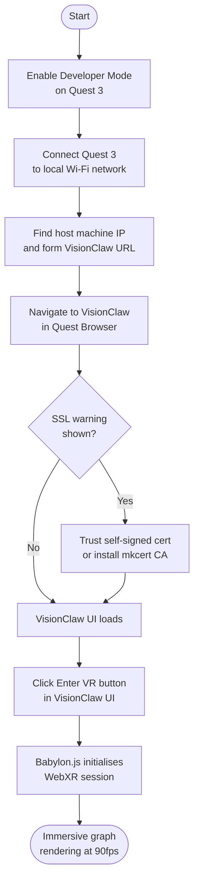
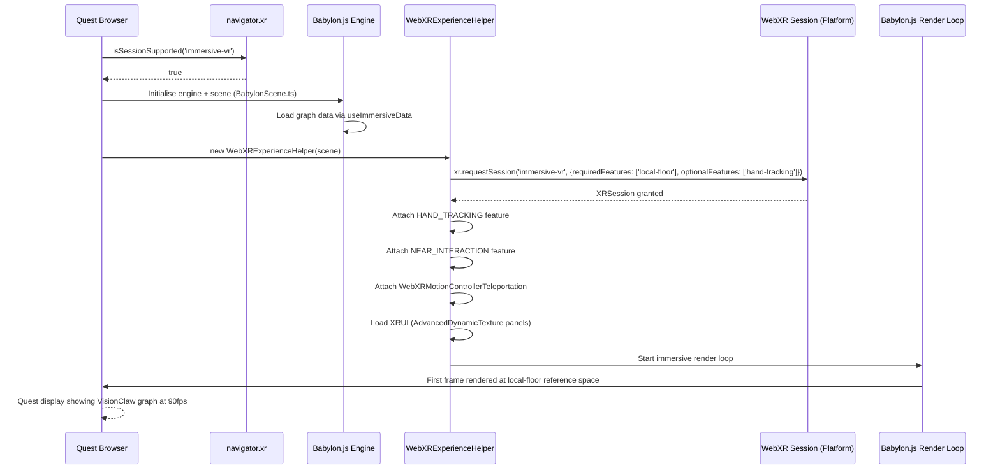

# Quest 3 VR Setup

This guide walks you through connecting a Meta Quest 3 headset to VisionClaw's immersive XR mode. At the end you will have VisionClaw's Babylon.js-powered knowledge graph rendered at 90fps inside your headset, with full controller interaction.

---

## Prerequisites

Before starting, confirm the following:

- **Meta Quest 3** headset, charged and updated to the latest system software
- **Developer mode enabled** on the Quest 3 (covered in Step 1)
- **VisionClaw running** with the XR profile active — started with:
  ```bash
  docker compose -f docker-compose.yml \
    -f docker-compose.vircadia.yml --profile xr up -d
  ```
- **Same local network** — the Quest 3 and the VisionClaw host machine must be on the same Wi-Fi network
- **Host IP address** — the LAN IP of the machine running VisionClaw (e.g. `192.168.1.42`)
- **Meta Quest mobile app** installed on your phone (iOS or Android), paired to the headset — required for enabling developer mode

> VisionClaw's XR mode uses the Babylon.js renderer and WebXR Device API. It does not require any native Meta SDK or side-loading.

---

## Setup Flowchart



---

## Step 1: Enable Developer Mode

Developer mode is not required to use VisionClaw in XR mode, but it unlocks useful diagnostics and removes some browser security restrictions that can interfere with WebXR on a local network.

1. Open the **Meta Quest** mobile app on your phone.
2. Tap the headset icon at the bottom of the screen to open your **Devices** list.
3. Select your Quest 3 from the device list.
4. Scroll down and tap **Developer Mode**.
5. Toggle **Developer Mode** to **on**.
6. The app may prompt you to agree to the Meta Developer Terms of Service if this is your first time.
7. Put on the headset. A notification banner confirms developer mode is now active.

> Developer mode must be enabled via a phone that is logged in to the same Meta account that owns the headset. If you do not see the Developer Mode option, you may need to register as a Meta developer at [developer.oculus.com](https://developer.oculus.com) first — registration is free.

---

## Step 2: Network Configuration

VisionClaw's XR interface is served over HTTPS on port **3001**. The Quest 3 browser must reach that port over your LAN.

### Find the host machine's IP address

On the machine running VisionClaw:

```bash
# Linux / macOS
ip route get 1 | awk '{print $7; exit}'
# or
hostname -I | awk '{print $1}'
```

On Windows (PowerShell):

```powershell
(Get-NetIPAddress -AddressFamily IPv4 -InterfaceAlias Wi-Fi).IPAddress
```

### Confirm VisionClaw is listening

```bash
# Verify port 3001 is bound
ss -tlnp | grep 3001
# or
curl -k https://localhost:3001/health
```

### Form the URL

```
https://<host-ip>:3001
```

For example: `https://192.168.1.42:3001`

Port 3001 is the Nginx reverse proxy that serves both the frontend and the Rust API. Do not use port 4000 (direct Actix-web) or 5173 (Vite HMR) from the Quest browser — only port 3001 provides the full VisionClaw application with XR support.

> Ensure the host machine's firewall allows inbound TCP on port 3001 from the LAN subnet. On Ubuntu/Debian: `sudo ufw allow 3001/tcp`.

---

## Step 3: SSL Certificate Trust

WebXR requires a secure context (HTTPS). VisionClaw uses a self-signed TLS certificate by default, which triggers a browser warning on the Quest. You have two options.

### Option A: Accept the browser exception (quickest)

1. Put on the Quest 3 and open the **Meta Browser** (the built-in Chromium-based browser).
2. Navigate to `https://<host-ip>:3001`.
3. A warning page appears: **"Your connection is not private"** (NET::ERR_CERT_AUTHORITY_INVALID).
4. Tap **Advanced**, then tap **Proceed to \<host-ip\> (unsafe)**.
5. The VisionClaw UI loads. This exception persists for the session but resets when you clear browser data.

### Option B: Install a locally trusted CA with mkcert (recommended for regular use)

`mkcert` generates certificates that browsers trust without warnings, using a local CA you install once.

On the VisionClaw host machine:

```bash
# Install mkcert
brew install mkcert           # macOS
# or
sudo apt install libnss3-tools && curl -L https://github.com/FiloSottile/mkcert/releases/latest/download/mkcert-linux-amd64 -o /usr/local/bin/mkcert && sudo chmod +x /usr/local/bin/mkcert

# Install local CA
mkcert -install

# Generate cert for your LAN IP (replace with your actual IP)
mkcert 192.168.1.42 localhost 127.0.0.1

# This produces two files:
#   192.168.1.42+2.pem       (certificate)
#   192.168.1.42+2-key.pem   (private key)
```

Configure VisionClaw's Nginx (or your TLS termination layer) to use these certificate files, then restart the service.

To trust the mkcert CA on the Quest 3:

1. Copy `$(mkcert -CAROOT)/rootCA.pem` to a USB drive or serve it over HTTP on a known URL.
2. On the Quest 3, open **Settings > Password & Security > Certificates**.
3. Install the `rootCA.pem` file as a trusted CA.
4. Restart the Quest Browser.

After installing the CA, `https://<host-ip>:3001` loads without warnings.

---

## Step 4: Launch VisionClaw

1. Open the **Meta Browser** on the Quest 3.
2. Navigate to `https://<host-ip>:3001`.
3. VisionClaw loads the desktop graph view. At the bottom of the screen (or in the navigation bar area) an **Enter VR** button appears when the browser detects WebXR support.

If you need to append the Quest 3 optimisation flag during testing:

```
https://<host-ip>:3001?force=quest3
```

This bypasses user-agent detection and explicitly enables the DPR cap at 1.0 and the Quest layout optimisations, which is useful when connecting from a browser that does not identify as Quest.

> The Meta Browser on Quest 3 reports a Quest user-agent string by default, so `?force=quest3` is typically not needed in normal use.

---

## Step 5: Enter XR Mode

1. With VisionClaw loaded in the Quest Browser, click the **Enter VR** button.
2. The browser displays a permission prompt: **"Allow VisionClaw to use your VR headset?"** — tap **Allow**.
3. VisionClaw transitions to XR mode:
   - React Three Fiber desktop rendering is suspended.
   - The Babylon.js engine initialises and loads graph data via the `useImmersiveData` subscription.
   - A WebXR `immersive-vr` session is requested with `local-floor` as the reference space.
4. The VisionClaw knowledge graph appears in 3D space around you, with nodes floating at floor-relative positions.
5. Controllers are detected automatically. The `WebXRExperienceHelper` registers the `HAND_TRACKING` and `NEAR_INTERACTION` features; if you are using hand tracking without controllers, hand meshes appear in the scene.

**Target performance:** 90fps stable on Quest 3. The renderer caps `devicePixelRatio` at 1.0 automatically to maintain this target and keep the physics tick budget under 11ms per frame.

To exit XR, press the **Quest button** on the right controller, or click **Exit VR** in the VisionClaw in-headset UI panel.

---

## Controller Bindings

VisionClaw uses the `xr-standard` gamepad mapping. Both controllers are active simultaneously.

| Controller | Button | Action |
|------------|--------|--------|
| Right | Trigger | Select the targeted graph node / confirm action |
| Right | Grip | Grab and reposition a node in world space |
| Right | Thumbstick (push) | Teleport to aim point |
| Right | Thumbstick (rotate) | Snap-rotate camera view 45 degrees |
| Right | A button | Context action 1 (expand node detail panel) |
| Right | B button | Dismiss in-headset menu / cancel |
| Left | Trigger | Ray-cast for targeting (secondary pointer) |
| Left | Grip | Grab and reposition a node (left-hand) |
| Left | Thumbstick (push) | Teleport (left-hand) |
| Left | Thumbstick (rotate) | Smooth turn (if enabled) |
| Left | X button | Context action 1 |
| Left | Y button | Open in-headset settings panel (XRUI) |

Haptic feedback fires on node selection events. Haptics can be disabled in the VisionClaw settings panel under **XR > Haptic Feedback**.

---

## Navigation in XR

### Teleportation

The default locomotion mode is teleportation, provided by `WebXRMotionControllerTeleportation`. Point either thumbstick forward to display the parabolic arc indicator. Release to teleport to the arc's landing point. The arc snaps to the floor mesh and avoids teleporting inside nodes.

Continuous smooth locomotion is available but disabled by default to reduce motion sickness risk. To enable it, open the XRUI settings panel (Left Y button) and toggle **Smooth Locomotion**.

### Node Selection

Point either controller at a graph node. A ray extends from the controller tip. When the ray intersects a node, the node highlights and haptic feedback pulses. Press trigger to select. A selected node displays its label, metadata panel, and connected edges in highlighted colour.

### Graph Rotation

To rotate the entire graph:

1. Hold both grip buttons simultaneously.
2. Move your hands apart, together, or in a circular arc.
3. The graph scales, translates, or rotates correspondingly.

Two-hand gestures are detected by the `WebXRHandTracking` feature when using hand tracking without controllers. The same operations apply:

| Gesture | Action |
|---------|--------|
| Pinch (thumb + index) | Select / grab node |
| Index extended | Ray cast for targeting |
| Palm open | Open context menu |
| Both hands moving apart | Scale graph up |
| Both hands moving together | Scale graph down |
| Both hands rotating arc | Rotate subgraph |

### LOD and Performance

VisionClaw automatically reduces geometry complexity based on camera distance using `useVRConnectionsLOD`. If the graph contains more than 20 active connections or frame rate drops below target, edge opacity reduces and curve segment counts drop. No manual action is needed.

---

## Troubleshooting

| Symptom | Cause | Fix |
|---------|-------|-----|
| "Enter VR" button is missing | Browser does not support WebXR | Confirm you are using the built-in **Meta Browser**, not a third-party browser on the headset |
| "Enter VR" button is greyed out | `navigator.xr.isSessionSupported` returned `false` | Open browser console (`adb logcat` or Meta developer tools), check for WebXR errors; ensure the page is served over HTTPS |
| SSL certificate error / page won't load | Self-signed cert not trusted | Follow Option A or Option B in Step 3 above |
| Black screen after entering VR | DPR cap not applied | Append `?force=quest3` to the URL; check the browser console for `effectiveDpr` log to confirm the cap is at 1.0 |
| VisionClaw loads but graph shows no nodes | WebSocket connection to backend failed | Verify VisionClaw services are running: `docker compose --profile xr ps`; check port 3001 from the Quest browser directly |
| Frame rate drops below 72fps | Too many draw calls or LOD not active | Reduce the number of visible nodes in the desktop settings panel before entering VR; or enable `aggressiveCulling` via the in-headset settings |
| Hand tracking not detected | Feature not registered | Hand tracking requires the headset to be in hand tracking mode (Settings > Movement Tracking > Hand and Controller Tracking > Hand Tracking); confirm `WebXRFeatureName.HAND_TRACKING` is enabled in `XRManager.ts` |
| Controller input not registering | Controller not paired or motion controller not initialised | Remove and reinsert batteries in the controller; re-pair via Quest Settings > Controllers |
| Spatial audio not working | Microphone permission denied or AudioContext blocked | Tap anywhere on the page before entering VR to unblock the AudioContext autoplay policy; grant microphone permission when prompted |
| Vircadia multi-user avatars not visible | Vircadia world server unreachable | Run `docker logs vircadia-world-server`; confirm port 3020 is accessible within the Docker network |

---

## WebXR Session Establishment Sequence

The following diagram shows the full session establishment flow from the moment you tap "Enter VR" to the first rendered frame in the headset.



---

## See Also

- [XR/VR Immersive Architecture](../explanation/xr-architecture.md) — explains the Babylon.js / React Three Fiber two-renderer design, WebXR session lifecycle, controller bindings implementation, and LOD system in depth
- [Deployment Guide](deployment-guide.md) — full port table, Docker Compose profiles, and environment variable reference
- [VR Development Guide](features/vr-development.md) — R3F/WebXR component reference for developers extending XR features
