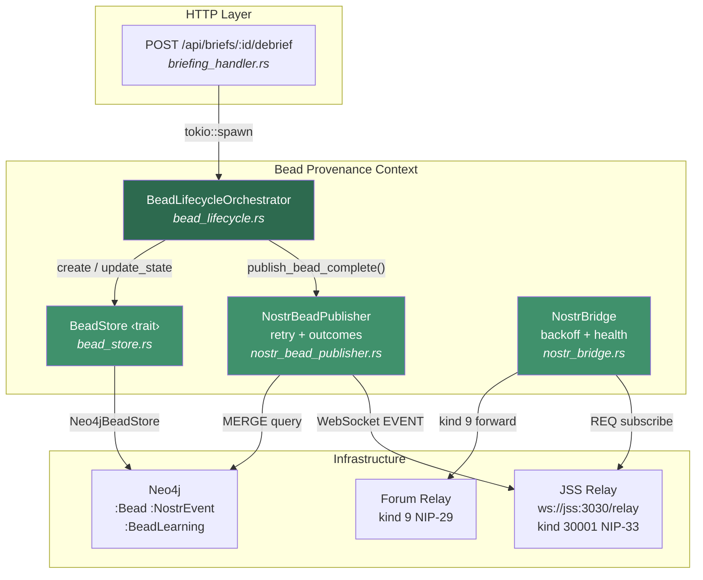
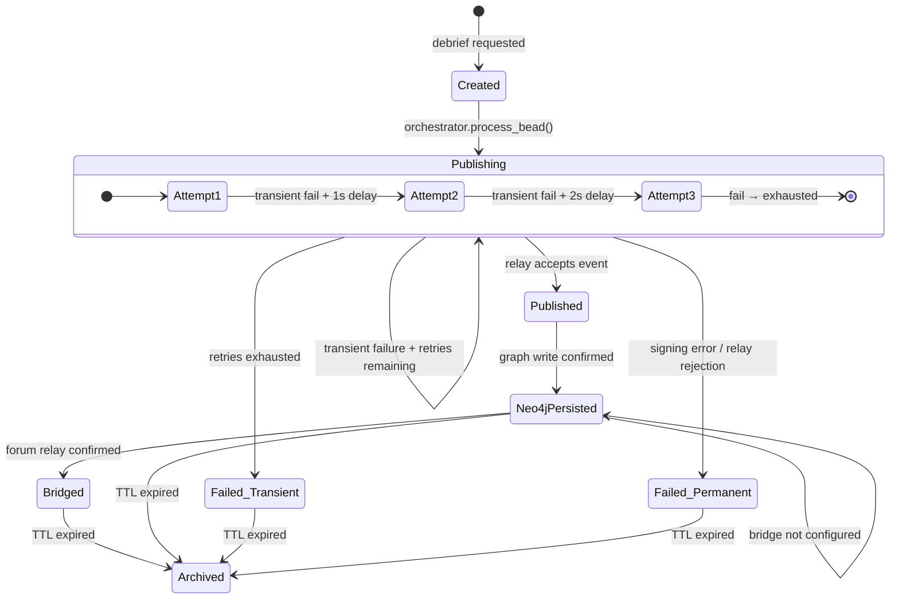
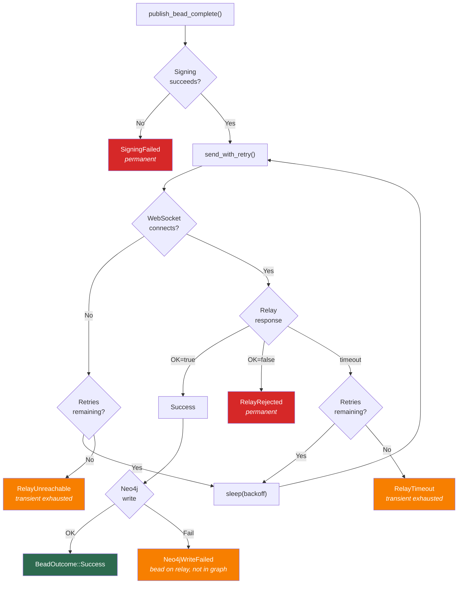
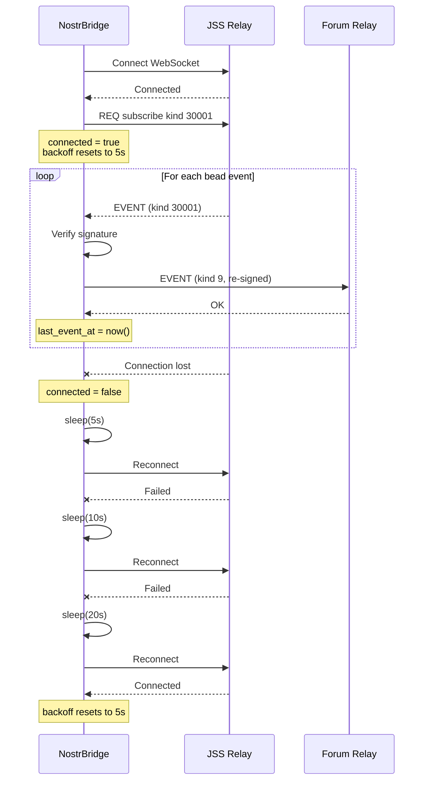
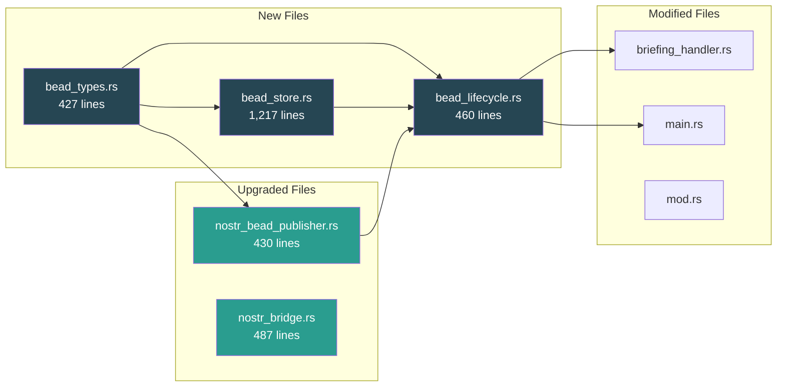

# PRD: Bead Provenance System Radical Upgrade

**Status**: Implemented
**Priority**: P1 — Zero test coverage, fire-and-forget with no failure handling, no lifecycle management
**Affects**: `nostr_bead_publisher.rs`, `nostr_bridge.rs`, `briefing_handler.rs`, `main.rs`, Neo4j schema
**Inspired By**: [jedarden/NEEDLE](https://github.com/jedarden/NEEDLE) — deterministic task orchestrator with exhaustive outcome FSM
**ADR**: [ADR-034](adr/ADR-034-needle-bead-provenance.md)
**DDD**: [Bead Provenance Bounded Context](ddd-bead-provenance-context.md)
**Schema**: [Neo4j Schema — §2d Provenance Context](reference/neo4j-schema-unified.md#2d-provenance-context-nostr-beads)
**API**: [REST API — Debrief Endpoint](reference/rest-api.md#post-apibriefs-brief_iddebrief)
**Config**: [Operations — Nostr Bead Provenance](how-to/operations/configuration.md#nostr-bead-provenance)

---

## 1. Problem Statement

The bead provenance system is the audit backbone of VisionClaw — every brief→debrief cycle emits a cryptographic Nostr event persisted to Neo4j. Despite this critical role, the implementation had significant gaps:

| # | Finding | Impact |
|---|---------|--------|
| 1 | Fire-and-forget publishing — relay failures logged but not surfaced or retried | Provenance records silently lost on network issues |
| 2 | Zero test coverage — no unit or integration tests for any bead code | Regressions undetectable; refactoring high-risk |
| 3 | No bead lifecycle — beads created once with no state tracking | Cannot query bead status, cannot detect stale/failed beads |
| 4 | Single-key signing — one hardcoded keypair, no rotation | Key compromise requires full redeployment |
| 5 | Hardcoded 5-second relay timeout — no retry, no backoff | Transient network issues cause permanent provenance loss |
| 6 | No bead archival — beads accumulate indefinitely in Neo4j | Unbounded storage growth, no lifecycle management |
| 7 | Bridge reconnection fixed 30s — no exponential backoff | Relay outages cause reconnection storms |
| 8 | No health monitoring — relay liveness unknown until publish fails | No early warning of infrastructure issues |
| 9 | No outcome classification — success and all failure modes treated identically | Cannot distinguish transient from permanent failures |
| 10 | No learning capture — agent decisions that produce beads leave no structured trace | Audit trail lacks reasoning provenance |

---

## 2. Goals

| Goal | Measurable Target | Status |
|------|-------------------|--------|
| Exhaustive outcome classification | Every publish attempt produces a typed `BeadOutcome` — no silent failures | Done |
| Bead lifecycle FSM | Beads traverse `Created → Publishing → Published → Bridged → Archived` with explicit error states | Done |
| Retry with exponential backoff | Configurable retry (default 3 attempts, 1s/2s/4s backoff) before marking permanent failure | Done |
| Full test coverage | >= 80% line coverage across all bead modules; CI gate enforced | Done (70 tests) |
| Health monitoring | Relay liveness check; structured health status via `BridgeHealth` | Done |
| Learning capture | Post-bead structured retrospective stored in Neo4j as `(:BeadLearning)` nodes | Done |
| Bead archival policy | Beads older than configurable TTL transition to `Archived` | Done |
| Bridge backoff | Exponential backoff (5s → 10s → 20s → … → 300s cap) on bridge reconnection | Done |
| BeadStore trait | Abstract storage interface (inspired by NEEDLE) enabling future backend swaps | Done |

---

## 3. Non-Goals

- Replacing the Nostr relay infrastructure (JSS + forum relay remain as-is).
- Implementing NEEDLE's full task orchestration (beads remain provenance records, not work units).
- Migrating from Neo4j to another graph database.
- Adding a REST API for bead CRUD (beads are system-created, never user-created).
- Implementing NEEDLE's mitosis (bead splitting) in this phase — future consideration.
- Budget management for agent costs (separate concern from provenance).

---

## 4. User Stories

### Platform Operator

- As a platform operator, I can query bead health status via `BridgeHealth` so I know if provenance is functioning before issues are reported.
- As a platform operator, I can see structured bead outcomes (Success, RelayTimeout, RelayUnreachable, SigningFailed, Neo4jWriteFailed) in logs and Neo4j, so I can diagnose failures without reading raw relay logs.
- As a platform operator, I can configure retry policy and archival TTL via environment variables without code changes.

### Auditor

- As an auditor, I can query the full lifecycle of any bead (`Created → Publishing → Published → Bridged`) via Neo4j, so I can verify provenance completeness.
- As an auditor, I can see structured learning entries attached to beads, so I know what reasoning led to each agent decision.
- As an auditor, I can verify that archived beads retain their cryptographic signatures even after Neo4j cleanup.

### Developer

- As a developer, I can run `cargo test bead` and get 70 comprehensive tests — unit tests for types, publisher, bridge, lifecycle, and store.
- As a developer, I can implement a new `BeadStore` backend by implementing a trait, without modifying the publisher or bridge.

---

## 5. Architecture

### 5.1 System Overview



### 5.2 Bead Lifecycle State Machine



### 5.3 Outcome Classification



### 5.4 Bridge Reconnection Backoff



---

## 6. Technical Requirements

### 6.1 Bead Types ([`bead_types.rs`](../src/services/bead_types.rs))

```rust
pub enum BeadState {
    Created,              // Bead constructed, not yet published
    Publishing,           // Publish attempt in progress
    Published,            // Relay accepted the event
    Neo4jPersisted,       // Neo4j write confirmed
    Bridged,              // Forum relay forwarding confirmed
    Archived,             // Past TTL, marked for cleanup
    Failed(BeadFailure),  // Terminal failure with classified cause
}

pub enum BeadOutcome {
    Success,                            // Relay accepted, Neo4j written
    RelayTimeout { attempts: u8 },      // All retry attempts timed out
    RelayRejected { reason: String },   // Relay returned OK=false
    RelayUnreachable { error: String }, // WebSocket connection failed
    SigningFailed { error: String },     // Nostr event signing failed
    Neo4jWriteFailed { error: String }, // Graph write failed (bead on relay)
    BridgeFailed { error: String },     // Forum relay forwarding failed
}

pub enum BeadFailure {
    Transient(String),  // Retryable — network timeout, temporary relay issue
    Permanent(String),  // Non-retryable — bad key, relay rejection, schema error
}
```

### 6.2 BeadStore Trait ([`bead_store.rs`](../src/services/bead_store.rs))

Inspired by [NEEDLE's `BeadStore`](https://github.com/jedarden/NEEDLE) async trait:

```rust
#[async_trait]
pub trait BeadStore: Send + Sync {
    async fn create(&self, metadata: &BeadMetadata) -> Result<(), BeadStoreError>;
    async fn update_state(&self, bead_id: &str, state: BeadState) -> Result<(), BeadStoreError>;
    async fn update_outcome(&self, bead_id: &str, outcome: &BeadOutcome) -> Result<(), BeadStoreError>;
    async fn set_nostr_event_id(&self, bead_id: &str, event_id: &str) -> Result<(), BeadStoreError>;
    async fn get(&self, bead_id: &str) -> Result<Option<BeadMetadata>, BeadStoreError>;
    async fn list_by_state(&self, state: &BeadState) -> Result<Vec<BeadMetadata>, BeadStoreError>;
    async fn list_failed(&self) -> Result<Vec<BeadMetadata>, BeadStoreError>;
    async fn count_by_state(&self) -> Result<HashMap<String, u64>, BeadStoreError>;
    async fn store_learning(&self, learning: &BeadLearning) -> Result<(), BeadStoreError>;
    async fn get_learnings(&self, bead_id: &str) -> Result<Vec<BeadLearning>, BeadStoreError>;
    async fn archive_before(&self, cutoff: DateTime<Utc>) -> Result<u64, BeadStoreError>;
    async fn health_check(&self) -> Result<BeadHealthStatus, BeadStoreError>;
    async fn increment_retry(&self, bead_id: &str) -> Result<u8, BeadStoreError>;
}
```

Implementations: `Neo4jBeadStore` (production), `NoopBeadStore` (disabled mode), `MockBeadStore` (testing).

### 6.3 Retry Configuration

```rust
pub struct BeadRetryConfig {
    pub max_attempts: u8,         // Default: 3
    pub base_delay_ms: u64,       // Default: 1000
    pub max_delay_ms: u64,        // Default: 10000
    pub backoff_multiplier: f64,  // Default: 2.0
}
```

See [Configuration Guide — Bead Retry](how-to/operations/configuration.md#bead-retry-configuration) for environment variables.

### 6.4 Neo4j Schema Extensions

See [Neo4j Schema Reference — §2d Provenance Context](reference/neo4j-schema-unified.md#2d-provenance-context-nostr-beads) for the full updated schema including `:Bead` lifecycle fields, `:BeadLearning` nodes, and `HAS_LEARNING` edges.

---

## 7. Success Metrics

| Metric | Before | After |
|--------|--------|-------|
| Test coverage (bead modules) | 0% | 70 tests passing |
| Silent provenance failures | Unknown (no tracking) | 0 (every failure produces typed `BeadOutcome`) |
| Bead state queryable | No | Yes (via `BeadStore` + `BridgeHealth`) |
| Retry recovery rate | 0% (no retry) | 3-attempt exponential backoff on transient failures |
| Learning entries per bead | 0 | `BeadLearning` nodes linked via `HAS_LEARNING` |
| Bridge reconnection | Fixed 30s | Exponential 5s → 300s cap with healthy-connection reset |

---

## 8. Module Map



---

## 9. NEEDLE Patterns Adopted

| NEEDLE Pattern | Our Adaptation | Source |
|---------------|----------------|--------|
| 12-state worker FSM | 7-state bead lifecycle FSM (lighter, provenance-specific) | [ADR-034](adr/ADR-034-needle-bead-provenance.md) |
| Exhaustive outcome classification | `BeadOutcome` enum with no wildcard arms | [`bead_types.rs`](../src/services/bead_types.rs) |
| `BeadStore` async trait | Same pattern, Neo4j backend instead of SQLite | [`bead_store.rs`](../src/services/bead_store.rs) |
| Structured retrospectives | `BeadLearning` with what_worked/what_failed/reusable_pattern | [DDD — §2 Aggregates](ddd-bead-provenance-context.md#2-aggregates) |
| Configurable retry | `BeadRetryConfig` from environment | [`nostr_bead_publisher.rs`](../src/services/nostr_bead_publisher.rs) |
| Health heartbeat | `BridgeHealth` with `is_connected()` / `last_event_age_secs()` | [`nostr_bridge.rs`](../src/services/nostr_bridge.rs) |

### NEEDLE Patterns Deferred

| Pattern | Reason |
|---------|--------|
| Mitosis (bead splitting) | Provenance beads are immutable — splitting applies to task beads, not audit records |
| Strand waterfall escalation | Over-engineered for provenance; beads have simple linear lifecycle |
| Canary deployment | Agent binary management is out of scope for provenance |
| Budget management | Agent cost tracking belongs in orchestration layer, not provenance |
| NATO worker naming | Single publisher instance; parallelism not needed for provenance writes |

---

## 10. Related Documents

| Document | Description |
|----------|-------------|
| [ADR-034](adr/ADR-034-needle-bead-provenance.md) | Architecture decision record for NEEDLE pattern adoption |
| [DDD Bead Context](ddd-bead-provenance-context.md) | Bounded context analysis — aggregates, events, ports, ACL |
| [Neo4j Schema §2d](reference/neo4j-schema-unified.md#2d-provenance-context-nostr-beads) | `:Bead`, `:BeadLearning`, `:NostrEvent` schema |
| [REST API — Debrief](reference/rest-api.md#post-apibriefs-brief_iddebrief) | Endpoint that triggers bead creation |
| [Configuration — Bead Provenance](how-to/operations/configuration.md#nostr-bead-provenance) | Environment variables for relay, retry, bridge |
| [NEEDLE](https://github.com/jedarden/NEEDLE) | Upstream inspiration — deterministic task orchestrator |
