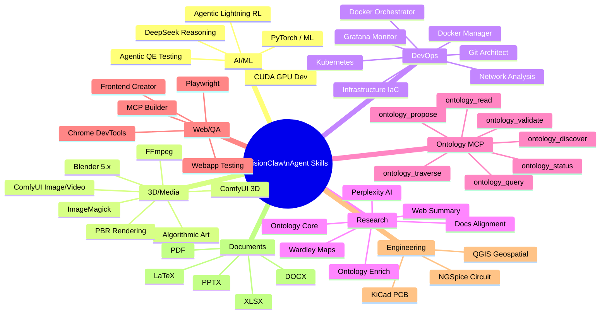
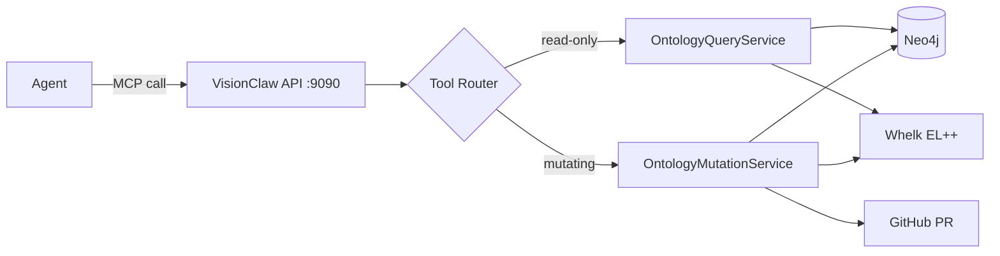

# VisionClaw Agent Skills Catalog

## Overview

VisionClaw ships with **54 specialist skills** across 12 domains (83+ including the full environment), plus **7 built-in MCP Ontology Tools** wired directly into the Rust backend. Skills are installed at `/home/devuser/.claude/skills/` and auto-discovered by Claude Flow and Claude Code.

15+ skills provide MCP servers for autonomous tool invocation. All skills respond to natural language through the VisionClaw Agent Control Interface.



---

## Skills by Domain

### AI & Machine Learning (5 Skills)

| Skill | Description | MCP |
|-------|-------------|:---:|
| **cuda** | AI-powered CUDA development assistant with 4 specialist agents (General, Optimizer, Debugger, Analyzer), kernel compilation, and GPU profiling | Yes |
| **pytorch-ml** | Deep learning with PyTorch, CUDA GPU acceleration, model training, and data science workflows | No |
| **agentic-lightning** | Reinforcement learning with AgentDB + RuVector supporting 9 algorithms (Q-Learning, SARSA, PPO, DQN, A3C, and more) | Yes |
| **agentic-qe** | Quality engineering fleet with 20 agents and 46 QE skills for comprehensive testing | Yes |
| **deepseek-reasoning** | DeepSeek R1 reasoning integration for complex multi-step problem-solving | Yes |

**Invocation examples**:
```bash
# CUDA
claude "Use cuda to create a matrix transpose kernel with shared memory tiling"
cuda_compile --file kernel.cu --auto_arch true --optimization_level O3

# PyTorch
claude "Use pytorch-ml to train a ResNet50 model on my dataset"

# Agentic QE
cf-swarm "generate comprehensive test suite for the authentication module"

# DeepSeek
deepseek_reason --query "Explain the time complexity of radix sort" --format steps
```

#### Featured: CUDA Skill

The `cuda` skill provides a complete AI-powered CUDA development environment with four specialist agents:

1. **General Assistant** — CUDA questions, kernel creation, learning
2. **Optimizer Agent** — Memory coalescing, shared memory, warp efficiency
3. **Debugger Agent** — Compilation errors, race conditions, memory issues
4. **Analyzer Agent** — Code review, best practices, complexity analysis

**MCP Tools**:

| Tool | Purpose |
|------|---------|
| `cuda_create_kernel` | Generate optimised kernels from specifications |
| `cuda_compile` | Compile with nvcc and auto-architecture detection |
| `cuda_analyze` | Deep analysis for optimisation opportunities |
| `cuda_read_kernel` / `cuda_write_kernel` | File operations |
| `cuda_gpu_status` | GPU info via nvidia-smi |
| `cuda_detect_arch` | Auto-detect compute capability |
| `cuda_profile` | Profile kernel execution |
| `cuda_benchmark` | Performance benchmarking |
| `cuda_route_query` | Route to appropriate specialist agent |
| `cuda_optimize_code` | Optimization specialist |
| `cuda_debug_code` | Debugging specialist |
| `cuda_analyze_quality` | Code analysis specialist |

---

### 3D Graphics & Visualisation (5 Skills)

| Skill | Description | MCP |
|-------|-------------|:---:|
| **blender** | Blender 5.x integration with 52 tools for 3D modelling, materials, physics, and animation via WebSocket | Yes |
| **comfyui** | AI image/video generation with Stable Diffusion, FLUX, AnimateDiff, and Salad Cloud deployment | Yes |
| **comfyui-3d** | 3D asset generation from text/images using SAM3D and FLUX2 pipelines | Yes |
| **imagemagick** | Image processing and manipulation via command-line tools | Yes |
| **algorithmic-art** | Generative art creation with procedural graphics and patterns | No |

**Invocation examples**:
```bash
# Blender
claude "Create a 3D cube in Blender with physics simulation"
blender_client.call("create_mesh", {"type": "CUBE", "location": [0,0,0]})

# ComfyUI
comfyui_generate --prompt "futuristic cityscape at sunset" --width 1024 --height 1024

# ImageMagick
claude "Resize all PNGs in ./assets to 1024x1024"
imagemagick_batch --operation resize --size 1024x1024 --input ./assets --pattern "*.png"
```

**Note**: `blender`, `comfyui-3d`, and `qgis` require the GUI container to be running with VNC accessible at `localhost:5901`.

---

### DevOps & Infrastructure (7 Skills)

| Skill | Description | MCP |
|-------|-------------|:---:|
| **docker-manager** | Docker container lifecycle management — build, start, stop, restart, logs, exec | No |
| **docker-orchestrator** | Docker Swarm and Compose orchestration — multi-container apps, service scaling | No |
| **kubernetes-ops** | Kubernetes cluster management with kubectl and helm | No |
| **infrastructure-manager** | Terraform and Ansible infrastructure-as-code provisioning | No |
| **grafana-monitor** | Grafana and Prometheus monitoring, dashboard creation, alerting | No |
| **network-analysis** | Network diagnostics with tcpdump, wireshark, traffic analysis | No |
| **git-architect** | Advanced Git workflows — branching strategies, rebasing, conflict resolution | No |

**Invocation examples**:
```bash
# Docker Manager (core skill — always available)
"Build VisionClaw with no cache"
"Show me the last 50 lines of VisionClaw logs"
"Execute 'cargo test' in VisionClaw container"

# Kubernetes
claude "Use kubernetes-ops to deploy the ontology service"

# Grafana
claude "Create a Grafana dashboard for agent telemetry metrics"
```

---

### System Administration (3 Skills)

| Skill | Description | MCP |
|-------|-------------|:---:|
| **linux-admin** | CachyOS/Arch Linux system administration — pacman/yay, systemd, user management | No |
| **tmux-ops** | tmux session and workspace management | No |
| **text-processing** | Text manipulation with awk, sed, jq, and grep | No |

---

### Document Processing (5 Skills)

| Skill | Description | MCP |
|-------|-------------|:---:|
| **pdf** | PDF creation, manipulation, and report generation | No |
| **docx** | Microsoft Word document generation | No |
| **xlsx** | Excel spreadsheet operations and data export | No |
| **pptx** | PowerPoint presentation generation | No |
| **latex-documents** | LaTeX document compilation for academic papers and technical documentation | No |

---

### Web Development & Testing (5 Skills)

| Skill | Description | MCP |
|-------|-------------|:---:|
| **playwright** | Browser automation and E2E testing with Playwright (Chromium, Firefox, WebKit) | Yes |
| **chrome-devtools** | Chrome DevTools Protocol — performance profiling, network inspection, DOM debugging | No |
| **frontend-creator** | React, Vue, Svelte project scaffolding and component libraries | No |
| **webapp-testing** | Web application functional and accessibility testing | No |
| **mcp-builder** | Build custom MCP servers and integrations | No |

**Invocation examples**:
```bash
# Playwright
"Navigate to localhost:3001 and click the 'Import Ontology' button"
"Capture a video of the 3D visualization loading"

# Chrome DevTools
"Use Chrome DevTools to debug http://localhost:3001"
"Capture a performance trace of the graph rendering"
"Inspect network requests to the Neo4j API"
```

---

### Research & Knowledge (8 Skills)

| Skill | Description | MCP |
|-------|-------------|:---:|
| **perplexity** | Perplexity AI real-time web research with source citations (Sonar API) | Yes |
| **web-summary** | YouTube transcript extraction and web content summarisation | No |
| **ontology-core** | Knowledge graph operations and semantic relationship management | No |
| **ontology-enrich** | Ontology enrichment and expansion | No |
| **import-to-ontology** | Convert CSV/JSON/TypeScript interfaces to OWL ontology nodes | No |
| **logseq-formatted** | Logseq knowledge base formatting and export | No |
| **wardley-maps** | Wardley mapping for strategic analysis and architecture planning | No |
| **docs-alignment** | Documentation verification against codebase — link checking, diagram verification | No |

**Invocation examples**:
```bash
# Perplexity
perplexity_search({query: "current UK mortgage rates", max_sources: 10})
perplexity_research({topic: "AI enterprise trends 2025", format: "executive summary", depth: "deep"})

# Wardley Maps
"Create a Wardley map for VisionClaw's ontology architecture"
"Map our GPU acceleration capabilities against competitors"

# Import to Ontology
"Import JSON schema from ./api-spec.json to OWL ontology"
"Generate ontology from TypeScript interfaces"
```

---

### Engineering & Electronics (3 Skills)

| Skill | Description | MCP |
|-------|-------------|:---:|
| **qgis** | QGIS geospatial analysis and mapping — vector/raster processing, spatial algorithms | Yes |
| **kicad** | KiCad PCB design and electronic schematics — schematic capture, DRC, Gerber export | No |
| **ngspice** | SPICE circuit simulation — DC/AC/transient analysis, Monte Carlo, noise analysis | No |

---

### Media Processing (1 Skill)

| Skill | Description | MCP |
|-------|-------------|:---:|
| **ffmpeg-processing** | Video and audio processing, transcoding, and streaming setup | No |

---

### Development Tools (3 Skills)

| Skill | Description | MCP |
|-------|-------------|:---:|
| **rust-development** | Rust toolchain with cargo, clippy, rustfmt, and WASM compilation | No |
| **jupyter-notebooks** | Jupyter notebook creation and execution for data science and research | No |
| **skill-creator** | Create new Claude Code skills from templates | No |

---

### Design & Communication (5 Skills)

| Skill | Description | MCP |
|-------|-------------|:---:|
| **brand-guidelines** | Brand identity management and style guide generation | No |
| **canvas-design** | Visual design and layout generation | No |
| **theme-factory** | UI theme generation with design tokens, color palettes, CSS themes | No |
| **slack-gif-creator** | Animated GIF creation for team communications | No |
| **internal-comms** | Internal communication drafting — announcements, newsletters | No |

---

### Templates (1 Skill)

| Skill | Description | MCP |
|-------|-------------|:---:|
| **anthropic-examples-and-templates** | Official Anthropic examples and templates for Claude best practices | No |

---

## Core Skills Always Available (Agentic Workstation)

These 13 skills are always available when the Agentic Workstation container is running:

| # | Skill | Category |
|---|-------|----------|
| 1 | docker-manager | DevOps |
| 2 | wardley-mapper | Research |
| 3 | chrome-devtools | Web/QA |
| 4 | blender | 3D Graphics |
| 5 | imagemagick | Media |
| 6 | pbr-rendering | 3D Graphics |
| 7 | playwright | Web/QA |
| 8 | web-summary | Research |
| 9 | import-to-ontology | Knowledge |
| 10 | qgis | Engineering |
| 11 | kicad | Engineering |
| 12 | ngspice | Engineering |
| 13 | logseq-formatted | Knowledge |

---

## MCP Tool Reference — The 7 Ontology Tools

These tools are wired into the VisionClaw Rust backend and available to all agents without a separate skill installation.



| # | Tool | REST Endpoint | Mutates | Purpose |
|---|------|--------------|:-------:|---------|
| 1 | `ontology_discover` | `POST /api/ontology-agent/discover` | No | Keyword search with Whelk inference expansion |
| 2 | `ontology_read` | `POST /api/ontology-agent/read` | No | Fetch enriched note by IRI |
| 3 | `ontology_query` | `POST /api/ontology-agent/query` | No | Execute validated Cypher against Neo4j |
| 4 | `ontology_traverse` | `POST /api/ontology-agent/traverse` | No | BFS walk from a starting class |
| 5 | `ontology_propose` | `POST /api/ontology-agent/propose` | Yes | Create or amend an ontology note |
| 6 | `ontology_validate` | `POST /api/ontology-agent/validate` | No | Check axiom consistency via Whelk |
| 7 | `ontology_status` | `GET /api/ontology-agent/status` | No | Health check and statistics |

### Input/Output Schemas

**`ontology_discover`**
- Input: `{ query: string, limit?: int, domain?: string }`
- Output: `DiscoveryResult[]` — `{ iri, preferred_term, definition_summary, relevance_score, quality_score, domain, relationships[], whelk_inferred }`

**`ontology_read`**
- Input: `{ iri: string }`
- Output: `EnrichedNote` — full Logseq markdown, OWL metadata, Whelk axioms, related notes, schema context

**`ontology_query`**
- Input: `{ cypher: string }`
- Output: query results; validation errors with Levenshtein hints returned before execution

**`ontology_traverse`**
- Input: `{ start_iri: string, depth?: int, relationship_types?: string[] }`
- Output: `TraversalResult` — `{ nodes[], edges[] }`

**`ontology_propose`**
- Input (create): `{ action: "create", preferred_term, definition, owl_class, physicality, role, domain, is_subclass_of[], relationships{}, alt_terms[], owner_user_id, agent_context{} }`
- Input (amend): `{ action: "amend", target_iri, amendment{ add_relationships{}, update_definition }, agent_context{} }`
- Output: `ProposalResult` — `{ proposal_id, consistency, quality_score, markdown_preview, pr_url, status }`

**`ontology_validate`**
- Input: `{ axioms: [{ axiom_type, subject, object }] }`
- Output: `ConsistencyReport` — `{ consistent: bool, explanation: string }`

**`ontology_status`**
- Input: none
- Output: `{ class_count: int, axiom_count: int, health: string }`

---

## Skill Configuration

### Environment Variables

```bash
# AI Service API Keys
PERPLEXITY_API_KEY=pplx-xxxxx
DEEPSEEK_API_KEY=sk-xxxxx
DEEPSEEK_BASE_URL=https://api.deepseek.com
DEEPSEEK_MODEL=deepseek-reasoner

# Claude via Z.AI (cost-effective batch)
ANTHROPIC_BASE_URL=https://api.z.ai/api/anthropic
ANTHROPIC_API_KEY=sk-ant-xxxxx
CLAUDE_WORKER_POOL_SIZE=4
CLAUDE_MAX_QUEUE_SIZE=50

# Gemini (experimental)
GOOGLE_GEMINI_API_KEY=xxxxx

# Ontology GitHub integration (optional)
GITHUB_TOKEN=ghp_xxxxx
GITHUB_OWNER=DreamLab-AI
GITHUB_REPO=VisionClaw
```

### MCP Server Configuration

For skills with MCP servers, configure at `~/.config/claude/mcp.json`:

```json
{
  "mcpServers": {
    "cuda": {
      "command": "python",
      "args": ["/home/devuser/.claude/skills/cuda/mcp-server/server.py"]
    },
    "blender": {
      "command": "node",
      "args": ["/home/devuser/.claude/skills/blender/mcp-server/server.js"]
    },
    "perplexity": {
      "command": "python",
      "args": ["/home/devuser/.claude/skills/perplexity/mcp-server/server.py"]
    },
    "playwright": {
      "command": "node",
      "args": ["/home/devuser/.claude/skills/playwright/mcp-server/server.js"]
    }
  }
}
```

### Skill Auto-Selection

Claude Flow selects skills automatically based on:

1. **File extensions** — `.cu` → `cuda`, `.blend` → `blender`, `.qgs` → `qgis`
2. **Keywords** — `"test coverage"` → `agentic-qe`, `"train model"` → `pytorch-ml`
3. **Task type** — `"kubernetes deploy"` → `kubernetes-ops`
4. **AgentDB patterns** — learns successful skill combinations over time

```bash
# Skills auto-selected
npx claude-flow sparc run dev "optimize CUDA kernel performance"
# → uses cuda skill

cf-swarm "generate comprehensive test suite"
# → uses agentic-qe skill

cf-hive "create 3D product visualization"
# → uses blender + comfyui skills
```

### Disabling a Skill

```bash
mv ~/.claude/skills/unwanted-skill /tmp/
```

---

## Creating Custom Skills

Use the `skill-creator` skill to scaffold a new skill:

```bash
claude "Use skill-creator to generate a new skill for PostgreSQL database management"
```

New skills are placed at `~/.claude/skills/<skill-name>/` and auto-discovered on next Claude Code start.

### Skill Directory Structure

```
skills/
  my-skill/
    SKILL.md          # Required — documentation and YAML frontmatter
    mcp-server/       # Optional — MCP server for autonomous tool usage
      server.js
    tools/            # Command-line tools
    examples/         # Usage examples
    config/           # Configuration files
    tests/            # Test suite
    test-skill.sh     # Validation script
```

### SKILL.md Format

```markdown
---
skill: my-skill
name: My Skill
version: 1.0.0
description: Brief description
tags: [tag1, tag2, tag3]
mcp_server: true
entry_point: mcp-server/server.js
---

# My Skill

## Capabilities
...

## Natural Language Examples
...
```

### Skill Registration

Skills at `~/.claude/skills/` are auto-discovered. The MCP server indexes them at startup. No restart required for read-only skill additions, but MCP skills need the MCP server restarted:

```bash
docker exec agentic-workstation mcp-tcp-restart
```

### Testing

```bash
# Inside the agentic-workstation container
cd /home/devuser/.claude/skills/my-skill
./test-skill.sh

# Check from host
docker exec agentic-workstation \
  /home/devuser/.claude/skills/my-skill/test-skill.sh
```

---

## Skill Chaining Patterns

### Pattern 1: Research → Propose

```text
1. perplexity_research({topic: "quantum entanglement 2025"})
2. ontology_discover({query: "quantum entanglement"})   # check existing
3. ontology_validate({axioms: [new axioms]})             # pre-flight
4. ontology_propose({action: "create", ...})             # commit
```

### Pattern 2: Build & Test

```text
1. docker-manager: "Build VisionClaw with no cache"
2. playwright: "Navigate to localhost:3001 and verify graph loads"
3. chrome-devtools: "Capture performance trace"
4. imagemagick: "Resize screenshot for report"
```

### Pattern 3: 3D Asset Pipeline

```text
1. comfyui: generate concept image
2. comfyui-3d: generate 3D mesh from image
3. blender: apply PBR materials and render
4. ffmpeg-processing: encode render sequence to video
```

### Pattern 4: Strategic Analysis

```text
1. wardley-maps: "Map VisionClaw's value chain"
2. perplexity_research: "Competitive landscape graph databases 2025"
3. docs-alignment: "Verify architecture docs match codebase"
```

---

## Performance Metrics

| Metric | Value |
|--------|-------|
| SWE-Bench solve rate | 84.8% |
| Token reduction (skill-based routing) | 32.3% |
| Speed improvement (parallelisation) | 2.8–4.4x |
| MCP integration success rate | >95% |

---

## Troubleshooting

### Skill Not Found

```bash
# Check installation
ls ~/.claude/skills/

# Verify skill structure
cat ~/.claude/skills/cuda/SKILL.md
```

### MCP Server Not Starting

```bash
# Check MCP configuration
cat ~/.config/claude/mcp.json

# Test server directly
python ~/.claude/skills/cuda/mcp-server/server.py
node ~/.claude/skills/blender/mcp-server/server.js
```

### Skill Auto-Selection Wrong

```bash
# View AgentDB patterns for skill selection
npx claude-flow memory search "skill-selection"

# Force a specific skill
claude "Use cuda skill (not pytorch-ml) to compile this kernel"
```

### GUI Skills Failing (Blender, QGIS, KiCad)

```bash
# Verify GUI container
docker ps | grep gui-tools-container

# Reconnect via VNC
# vnc://localhost:5901  password: turboflow

# Check TCP bridge
docker exec agentic-workstation nc -zv gui-tools-container 9876
```

---

## Related Documentation

- [Agent Orchestration Guide](../how-to/agent-orchestration.md) — deploying and configuring agents
- [Actor Hierarchy](../explanation/actor-hierarchy.md) — 21-actor Actix supervision tree
- [System Overview](../explanation/system-overview.md) — architecture overview
