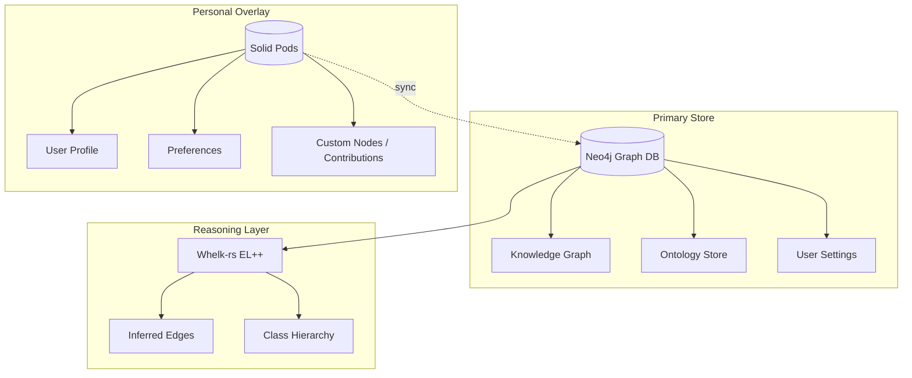
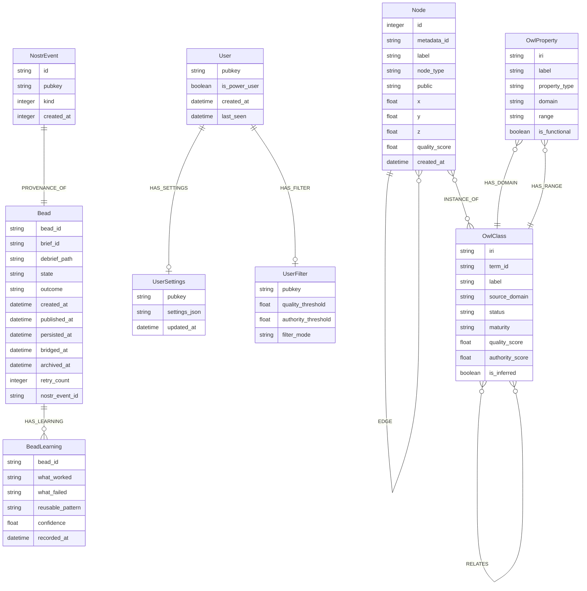

# VisionClaw Database Schema Reference

Neo4j is the **sole primary database** for VisionClaw. The migration from SQLite was completed in November 2025. Any legacy references to SQLite are historical artefacts and are **not** part of the current schema. RuVector PostgreSQL (`ruvector-postgres:5432`) is infrastructure memory for AI agents — it is not a VisionClaw application database.

---

## 1. Architecture Overview

VisionClaw's data layer is organised into three tiers: a Neo4j primary store, a Solid Pod personal overlay, and a Whelk-rs reasoning layer that runs on top of Neo4j's ontology data.



**Key boundaries:**

| Layer | Role | Source of Truth |
|-------|------|----------------|
| Neo4j | Primary graph store, settings, ontology | Yes — canonical |
| Solid Pods | Per-user overlays, contributions, preferences | No — syncs to Neo4j |
| Whelk-rs | EL++ reasoner producing inferred axioms | Derived from Neo4j |

**Whelk-rs** implements OWL 2 EL reasoning (covers 90 %+ of real-world ontologies). It loads the ontology from Neo4j, computes class hierarchies and inferred axioms, and writes `is_inferred = true` edges back into Neo4j. Reasoning time is 100–500 ms for the ~900-class ontology; the LRU inference cache provides 90 % hit rates and a 90–150× speedup over fresh reasoning.

---

## 2. Neo4j Bounded Contexts

Three bounded contexts live within a single Neo4j instance. Each has distinct node labels, edge types, and indexes.

### 2a. Knowledge Graph Context

Populated by `GitHubSyncService` → `KnowledgeGraphParser`. Only files tagged `public:: true` in Logseq produce `:Node` records; `[[wikilink]]` targets produce `:Node` records for the target even when the target file lacks the tag.

#### Node label: `:Node`

```cypher
(:Node {
  id:          INTEGER,      // Internal VisionClaw u32 ID from NEXT_NODE_ID atomic
  metadata_id: STRING,       // UUID stable cross-system reference
  label:       STRING,       // Display name / page title
  public:      STRING,       // "true" | "false" (string, not boolean)
  content:     STRING,       // Raw markdown body
  node_type:   STRING,       // "page" | "linked_page" | "agent" | "bot"
  x:           FLOAT,        // 3D position (runtime)
  y:           FLOAT,
  z:           FLOAT,
  vx:          FLOAT,        // Velocity (runtime physics state)
  vy:          FLOAT,
  vz:          FLOAT,
  quality_score: FLOAT,      // 0.0–1.0
  cluster_id:  INTEGER,      // Community detection result
  community_id: INTEGER,
  anomaly_score: FLOAT,
  hierarchy_level: INTEGER,
  created_at:  DATETIME,
  updated_at:  DATETIME
})
```

**Node types:**

| `node_type` | Origin |
|-------------|--------|
| `page` | Logseq file with `public:: true` |
| `linked_page` | Target of a `[[wikilink]]` from a public page |
| `agent` | Agent/bot definition node |
| `bot` | Bot definition node |

**Edge types in this context:**

```cypher
// Primary link type — wiki links between pages
(:Node)-[:EDGE {
  relationship: STRING,  // "hyperlink" | "depends_on" | custom label
  weight:       FLOAT,
  created_at:   DATETIME
}]->(:Node)
```

**Constraints and indexes:**

```cypher
CREATE INDEX node_id_index IF NOT EXISTS
  FOR (n:Node) ON (n.id);

CREATE INDEX node_metadata_id IF NOT EXISTS
  FOR (n:Node) ON (n.metadata_id);

CREATE INDEX node_public IF NOT EXISTS
  FOR (n:Node) ON (n.public);

CREATE INDEX node_label IF NOT EXISTS
  FOR (n:Node) ON (n.label);
```

---

### 2b. Ontology Context

Populated from `### OntologyBlock` sections in Logseq markdown files (all files, not just `public:: true` ones), as well as from GitHub-sourced OWL/RDF files parsed by Horned-OWL and validated to OWL 2 EL profile.

#### Node label: `:OwlClass`

```cypher
(:OwlClass {
  iri:              STRING,   // Full IRI — unique key
  term_id:          STRING,   // e.g. "BC-0478"
  preferred_term:   STRING,   // Canonical term name
  label:            STRING,   // rdfs:label
  description:      STRING,   // rdfs:comment

  // Classification
  source_domain:    STRING,   // "blockchain" | "ai" | "metaverse" | "rb" | "dt"
  version:          STRING,
  class_type:       STRING,   // "concept" | "entity" | "class" | "individual"

  // Lifecycle / quality
  status:           STRING,   // "draft" | "review" | "approved" | "deprecated"
  maturity:         STRING,   // "experimental" | "beta" | "stable"
  quality_score:    FLOAT,    // 0.0–1.0
  authority_score:  FLOAT,    // 0.0–1.0
  public_access:    BOOLEAN,
  content_status:   STRING,   // workflow state

  // OWL2 dimensions
  owl_physicality:  STRING,   // "physical" | "virtual" | "abstract"
  owl_role:         STRING,   // "agent" | "patient" | "instrument"

  // Cross-domain links
  belongs_to_domain: STRING,
  bridges_to_domain: STRING,

  // Source provenance
  source_file:      STRING,
  file_sha1:        STRING,
  markdown_content: STRING,
  last_synced:      DATETIME,

  // Reasoning
  is_inferred:      BOOLEAN   // false = asserted; true = Whelk-rs output
})
```

#### Node label: `:OwlProperty`

```cypher
(:OwlProperty {
  iri:            STRING,    // Full IRI — unique key
  label:          STRING,
  property_type:  STRING,    // "ObjectProperty" | "DataProperty" | "AnnotationProperty"
  domain:         STRING,    // Domain class IRI
  range:          STRING,    // Range class IRI or xsd type
  is_functional:  BOOLEAN,
  is_transitive:  BOOLEAN,
  is_symmetric:   BOOLEAN,
  quality_score:  FLOAT,
  authority_score: FLOAT,
  source_file:    STRING
})
```

#### Node label: `:Axiom`

```cypher
(:Axiom {
  subject:        STRING,    // Subject class IRI
  predicate:      STRING,    // "rdfs:subClassOf" | "owl:equivalentClass" | etc.
  object:         STRING,    // Object class IRI or literal
  is_inferred:    BOOLEAN,
  confidence:     FLOAT,     // 1.0 for asserted; 0.3–0.9 for inferred
  reasoning_rule: STRING     // Which Whelk rule produced inference
})
```

#### Edge types in this context

There are **623 `SUBCLASS_OF` relationships** among `OwlClass` nodes. These were historically excluded from the client graph, leaving 62 % of ontology nodes isolated. The fix maps `OwlClass` → `GraphNode` via label matching.

```cypher
(:OwlClass)-[:SUBCLASS_OF]->(:OwlClass)

(:OwlClass)-[:RELATES {
  relationship_type: STRING,   // "has-part" | "uses" | "enables" | "requires"
  confidence:        FLOAT,
  is_inferred:       BOOLEAN
}]->(:OwlClass)

(:OwlClass)-[:EQUIVALENT_CLASS]->(:OwlClass)

(:OwlProperty)-[:HAS_DOMAIN]->(:OwlClass)
(:OwlProperty)-[:HAS_RANGE]->(:OwlClass)

// Node-to-class membership
(:Node)-[:INSTANCE_OF]->(:OwlClass)
```

**Constraints and indexes (30+ total):**

```cypher
CREATE CONSTRAINT owl_class_iri_unique IF NOT EXISTS
  FOR (c:OwlClass) REQUIRE c.iri IS UNIQUE;

CREATE CONSTRAINT owl_property_iri_unique IF NOT EXISTS
  FOR (p:OwlProperty) REQUIRE p.iri IS UNIQUE;

CREATE INDEX owl_class_label IF NOT EXISTS
  FOR (c:OwlClass) ON (c.label);

CREATE INDEX owl_class_term_id IF NOT EXISTS
  FOR (c:OwlClass) ON (c.term_id);

CREATE INDEX owl_class_source_domain IF NOT EXISTS
  FOR (c:OwlClass) ON (c.source_domain);

CREATE INDEX owl_class_status IF NOT EXISTS
  FOR (c:OwlClass) ON (c.status);

CREATE INDEX owl_class_maturity IF NOT EXISTS
  FOR (c:OwlClass) ON (c.maturity);

CREATE INDEX owl_class_quality IF NOT EXISTS
  FOR (c:OwlClass) ON (c.quality_score);

CREATE INDEX owl_class_authority IF NOT EXISTS
  FOR (c:OwlClass) ON (c.authority_score);

CREATE INDEX owl_class_physicality IF NOT EXISTS
  FOR (c:OwlClass) ON (c.owl_physicality);

CREATE INDEX owl_class_role IF NOT EXISTS
  FOR (c:OwlClass) ON (c.owl_role);

CREATE INDEX owl_class_file_sha1 IF NOT EXISTS
  FOR (c:OwlClass) ON (c.file_sha1);

CREATE FULLTEXT INDEX owl_class_search IF NOT EXISTS
  FOR (c:OwlClass) ON EACH [c.label, c.description];
```

---

### 2c. Settings Context

User identity is based on Nostr public keys (`npub`). No passwords are stored — Nostr Schnorr signature verification happens in the application layer. Power users can write global settings; regular users access only their own settings.

#### Node label: `:User`

```cypher
(:User {
  pubkey:       STRING,    // Nostr public key — unique identifier
  npub:         STRING,    // NIP-19 bech32 form (also indexed)
  is_power_user: BOOLEAN,  // Can access debug settings, write global settings
  created_at:   DATETIME,
  last_seen:    DATETIME,
  display_name: STRING     // Optional NIP-05 or custom name
})
```

#### Node label: `:UserSettings`

```cypher
(:UserSettings {
  pubkey:       STRING,    // Links to User (indexed)
  settings_json: STRING,   // Full AppFullSettings object as JSON blob
  updated_at:   DATETIME
})
```

The `settings_json` blob encodes the complete `AppFullSettings` struct, which contains physics parameters, render parameters, and UI preferences.

#### Node label: `:UserFilter`

```cypher
(:UserFilter {
  pubkey:              STRING,
  enabled:             BOOLEAN,
  quality_threshold:   FLOAT,    // Default 0.7
  authority_threshold: FLOAT,    // Default 0.5
  filter_by_quality:   BOOLEAN,
  filter_by_authority: BOOLEAN,
  filter_mode:         STRING,   // "or" | "and"
  max_nodes:           INTEGER,  // Default 10000
  updated_at:          DATETIME
})
```

#### Node label: `:FilterState`

```cypher
(:FilterState {
  client_id:   STRING,    // WebSocket connection ID
  user_id:     STRING,    // Links to User
  filter_json: STRING,    // JSON filter config
  created_at:  DATETIME,
  expires_at:  DATETIME
})
```

#### Node label: `:Setting` (global)

```cypher
(:Setting {
  key:      STRING,    // Setting name
  value:    STRING,    // Setting value (string-encoded)
  category: STRING     // "appearance" | "physics" | "rendering" | etc.
})
```

**Edge types in this context:**

```cypher
(:User)-[:HAS_SETTINGS]->(:UserSettings)
(:User)-[:HAS_FILTER]->(:UserFilter)
(:User)-[:HAS_FILTER_STATE]->(:FilterState)
```

**Constraints and indexes:**

```cypher
CREATE CONSTRAINT user_pubkey_unique IF NOT EXISTS
  FOR (u:User) REQUIRE u.pubkey IS UNIQUE;

CREATE INDEX user_npub_index IF NOT EXISTS
  FOR (u:User) ON (u.npub);

CREATE INDEX user_settings_pubkey_idx IF NOT EXISTS
  FOR (us:UserSettings) ON (us.pubkey);

CREATE INDEX user_filter_pubkey_idx IF NOT EXISTS
  FOR (uf:UserFilter) ON (uf.pubkey);

CREATE INDEX filter_client_index IF NOT EXISTS
  FOR (f:FilterState) ON (f.client_id);

CREATE INDEX settings_user_key_index IF NOT EXISTS
  FOR (s:Setting) ON (s.key);
```

---

### 2d. Provenance Context (Nostr Beads)

Written by `BeadLifecycleOrchestrator` (via `NostrBeadPublisher`) after a successful
`POST /api/briefs/{id}/debrief`. All writes are idempotent via `MERGE`.
See ADR-034 for the NEEDLE-inspired architectural upgrade.

#### Node label: `:NostrEvent`

```cypher
(:NostrEvent {
  id:         STRING,    // Hex-encoded SHA-256 of canonical JSON — unique
  pubkey:     STRING,    // Hex-encoded bridge bot public key
  kind:       INTEGER,   // 30001 (NIP-33 parameterised replaceable)
  created_at: INTEGER    // Unix timestamp (seconds)
})
```

#### Node label: `:Bead`

```cypher
(:Bead {
  bead_id:       STRING,    // Unique bead ID (also the Nostr `d` tag) — unique
  brief_id:      STRING,    // Parent brief ID
  debrief_path:  STRING,    // Filesystem path of consolidated debrief file
  state:         STRING,    // Lifecycle state: Created|Publishing|Published|Neo4jPersisted|Bridged|Archived|Failed(*)
  outcome:       STRING,    // Publish outcome: Success|RelayTimeout|RelayRejected|RelayUnreachable|SigningFailed|Neo4jWriteFailed|BridgeFailed
  created_at:    DATETIME,  // When the bead was created
  published_at:  DATETIME,  // When the relay accepted the event (null if unpublished)
  persisted_at:  DATETIME,  // When Neo4j write was confirmed
  bridged_at:    DATETIME,  // When forum relay forwarding was confirmed (null if bridge disabled)
  archived_at:   DATETIME,  // When the bead was archived (null if active)
  retry_count:   INTEGER,   // Number of publish retry attempts (0 on first success)
  nostr_event_id: STRING    // Hex Nostr event ID (null until published)
})
```

#### Node label: `:BeadLearning`

```cypher
(:BeadLearning {
  bead_id:          STRING,   // Parent bead ID
  what_worked:      STRING,   // Structured retrospective: what succeeded
  what_failed:      STRING,   // Structured retrospective: what failed
  reusable_pattern: STRING,   // Extractable pattern for future use
  confidence:       FLOAT,    // Confidence score 0.0–1.0
  recorded_at:      DATETIME  // When the learning was recorded
})
```

#### Edge types

```cypher
(:NostrEvent)-[:PROVENANCE_OF]->(:Bead)
(:Bead)-[:HAS_LEARNING]->(:BeadLearning)
```

#### Idempotent write pattern (lifecycle-aware)

```cypher
// Bead creation (state: Created)
MERGE (b:Bead {bead_id: $bead_id})
ON CREATE SET b.brief_id = $brief_id, b.debrief_path = $debrief_path,
              b.state = 'Created', b.created_at = datetime(), b.retry_count = 0

// State transition (e.g. Publishing → Published)
MATCH (b:Bead {bead_id: $bead_id})
SET b.state = $state, b.published_at = CASE WHEN $state = 'Published' THEN datetime() ELSE b.published_at END

// Provenance link (after successful relay publish)
MERGE (e:NostrEvent {id: $event_id})
SET e.pubkey = $pubkey, e.kind = $kind, e.created_at = $created_at
WITH e
MATCH (b:Bead {bead_id: $bead_id})
SET b.nostr_event_id = $event_id
MERGE (e)-[:PROVENANCE_OF]->(b)

// Learning capture
CREATE (l:BeadLearning {
    bead_id: $bead_id, what_worked: $what_worked, what_failed: $what_failed,
    reusable_pattern: $reusable_pattern, confidence: $confidence, recorded_at: datetime()
})
WITH l
MATCH (b:Bead {bead_id: $bead_id})
MERGE (b)-[:HAS_LEARNING]->(l)
```

#### Bead lifecycle state machine

```
Created → Publishing → Published → Neo4jPersisted → Bridged → Archived
                  ↘ Failed(Transient) → [retry] → Publishing
                  ↘ Failed(Permanent)
```

Retry uses exponential backoff (default: 3 attempts, 1s/2s/4s). Only transient
failures (timeout, connection error) are retried. Permanent failures (signing
error, relay rejection) fail immediately. See `BeadRetryConfig` in `bead_types.rs`.

---

## 3. Entity-Relationship Diagram



---

## 4. Node ID System

Node IDs are 32-bit unsigned integers (`u32`) allocated by a global `NEXT_NODE_ID` atomic counter starting at 1. The lower 26 bits hold the sequential ID; the upper 6 bits encode the node type as flag bits.

```mermaid
block-beta
  columns 32
  block:b31["31\nAgent\n0x80000000"]:1
  block:b30["30\nKnowledge\n0x40000000"]:1
  block:b28["28-26\nOntology\nsubtype\n0x1C000000"]:3
  block:b25["25\n(reserved)"]:1
  block:b0["0–25 Sequential node ID (max ~67 million)"]:26
```

**Flag masks:**

| Mask | Value | Meaning |
|------|-------|---------|
| `0x80000000` | bit 31 set | Agent node |
| `0x40000000` | bit 30 set | Knowledge / page node |
| `0x1C000000` | bits 26–28 | Ontology subtype encoding |
| `0x03FFFFFF` | bits 0–25 | Sequential ID portion |

The 26-bit sequential space supports up to ~67 million nodes before the flag region is encroached. Current production graphs are well within this range.

Node IDs are used as GPU buffer indices in the CUDA physics kernel. The flag bits are read by the kernel via `class_id` and `class_charge` per-node buffers for ontology constraint forces; they are **not** used for general rendering logic.

---

## 5. Solid Pod Schema

Solid Pods are **personal overlays**, not a replacement for Neo4j. They enable users to own their data, submit ontology contributions, and store agent memory in a decentralised way. The JSS (JSON Solid Server) sidecar runs alongside the Rust backend on Docker profile `solid`.

### 5a. Pod Directory Structure

```
/pods/{npub}/
  ├── profile/
  │   └── card                     # WebID document (public read)
  ├── ontology/
  │   ├── contributions/           # User-submitted ontology terms (owner + reviewers)
  │   ├── proposals/               # Pending proposals (owner + reviewers + backend)
  │   └── annotations/             # Comments on terms (public read)
  ├── preferences/                 # App settings JSON-LD (owner only)
  ├── agent-memory/
  │   ├── sessions/                # Short-term session memory (owner only)
  │   └── long-term/               # Persistent agent memory (owner only)
  └── inbox/                       # Notifications (owner + authorised senders)
```

### 5b. What Lives Only in Solid vs What Syncs to Neo4j

| Data | Lives in Solid | Syncs to Neo4j |
|------|---------------|----------------|
| WebID / profile | Yes | No |
| User preferences | Yes (canonical) | Mirrored via sync |
| Agent memory | Yes (canonical) | No |
| Ontology contributions (draft) | Yes | No |
| Ontology contributions (approved) | Archived | Yes — becomes `:OwlClass` |
| Graph node RDF representations | Yes (overlay) | Neo4j is canonical |
| Inbox / notifications | Yes | No |

### 5c. Access Control (WAC)

VisionClaw uses Web Access Control (WAC) for pod authorisation. Three representative ACL patterns follow.

**Pod root (owner full control, app read):**
```turtle
@prefix acl: <http://www.w3.org/ns/auth/acl#>.
@prefix foaf: <http://xmlns.com/foaf/0.1/>.

<#owner>
    a acl:Authorization;
    acl:agent <https://visionclaw.io/pods/{npub}/profile/card#me>;
    acl:accessTo <./>;
    acl:default <./>;
    acl:mode acl:Read, acl:Write, acl:Control.

<#app-read>
    a acl:Authorization;
    acl:origin <https://visionclaw.io>;
    acl:accessTo <./>;
    acl:mode acl:Read.
```

**Proposals container (reviewers can read):**
```turtle
<#reviewers>
    a acl:Authorization;
    acl:agentGroup <https://visionclaw.io/groups/reviewers>;
    acl:accessTo <./>;
    acl:default <./>;
    acl:mode acl:Read.
```

**Agent memory (owner only; app agents can read/write with consent):**
```turtle
<#visionclaw-agents>
    a acl:Authorization;
    acl:origin <https://visionclaw.io>;
    acl:accessTo <./>;
    acl:default <./>;
    acl:mode acl:Read, acl:Write.
```

### 5d. Sync Protocol (Neo4j ↔ Solid)

Three sync modes are defined:

| Mode | Direction | Use Case |
|------|-----------|----------|
| `neo4j-to-solid` | Neo4j → Solid | Export graph for sharing |
| `solid-to-neo4j` | Solid → Neo4j | Import external / approved contributions |
| `bidirectional` | Both | Collaborative editing |

Conflict resolution is timestamp-first: newer timestamp wins. Same-timestamp conflicts with different checksums create a merge node requiring manual resolution.

Graph nodes serialised to the pod use Turtle RDF with the `vf:` namespace (`https://visionclaw.example.com/ontology#`), including `vf:nodeId`, `vf:label`, `vf:type`, `vf:position`, `vf:velocity`, and `dcterms:created` / `dcterms:modified`.

---

## 6. Graph State and Node Positions

Node positions (`x`, `y`, `z`) and velocities (`vx`, `vy`, `vz`) are **runtime physics state** computed on the GPU by the CUDA ForceComputeActor. The canonical in-memory store is `GraphStateActor`.

**Runtime flow:**

```
ForceComputeActor (GPU)
  → broadcast_optimizer.process_frame()
  → UpdateNodePositions message
  → GraphStateActor (in-memory canonical)
  → ClientCoordinatorActor
  → Binary WebSocket (8 bytes per node: node_id u32 + x f32 + y f32 + z f32)
```

**Persistence:**

- Positions are persisted to Neo4j on shutdown and checkpoint via batch `UNWIND` Cypher (see query in Section 7).
- The `update_positions()` method in `neo4j_graph_repository.rs` writes `x`, `y`, `z`; velocity fields (`vx`, `vy`, `vz`) exist in the schema but are **not** currently written by this path (known issue — `BinaryNodeData` type alias carries only 3 floats).
- On startup, `GraphStateActor` loads positions from Neo4j via `get_graph()`, restoring the last persisted layout.

**Periodic full broadcast** (every 300 physics iterations) ensures clients that connect after convergence still receive the current layout, bypassing the delta-filter optimisation that would otherwise suppress all-stopped nodes.

---

## 7. Indexes and Constraints — Full Catalogue

### Unique Constraints

```cypher
CREATE CONSTRAINT graph_node_id IF NOT EXISTS
  FOR (n:Node) REQUIRE n.id IS UNIQUE;

CREATE CONSTRAINT user_pubkey_unique IF NOT EXISTS
  FOR (u:User) REQUIRE u.pubkey IS UNIQUE;

CREATE CONSTRAINT owl_class_iri_unique IF NOT EXISTS
  FOR (c:OwlClass) REQUIRE c.iri IS UNIQUE;

CREATE CONSTRAINT owl_property_iri_unique IF NOT EXISTS
  FOR (p:OwlProperty) REQUIRE p.iri IS UNIQUE;

CREATE CONSTRAINT nostr_event_id IF NOT EXISTS
  FOR (e:NostrEvent) REQUIRE e.id IS UNIQUE;

CREATE CONSTRAINT bead_id IF NOT EXISTS
  FOR (b:Bead) REQUIRE b.bead_id IS UNIQUE;

// Index for lifecycle queries (ADR-034)
CREATE INDEX bead_state IF NOT EXISTS
  FOR (b:Bead) ON (b.state);

CREATE INDEX bead_created_at IF NOT EXISTS
  FOR (b:Bead) ON (b.created_at);
```

### Standard Indexes

```cypher
CREATE INDEX node_metadata_id  IF NOT EXISTS FOR (n:Node)          ON (n.metadata_id);
CREATE INDEX node_label        IF NOT EXISTS FOR (n:Node)          ON (n.label);
CREATE INDEX node_public       IF NOT EXISTS FOR (n:Node)          ON (n.public);
CREATE INDEX owl_class_label   IF NOT EXISTS FOR (c:OwlClass)      ON (c.label);
CREATE INDEX owl_class_domain  IF NOT EXISTS FOR (c:OwlClass)      ON (c.source_domain);
CREATE INDEX owl_class_status  IF NOT EXISTS FOR (c:OwlClass)      ON (c.status);
CREATE INDEX owl_class_quality IF NOT EXISTS FOR (c:OwlClass)      ON (c.quality_score);
CREATE INDEX owl_property_lbl  IF NOT EXISTS FOR (p:OwlProperty)   ON (p.label);
CREATE INDEX user_npub         IF NOT EXISTS FOR (u:User)          ON (u.npub);
CREATE INDEX settings_pubkey   IF NOT EXISTS FOR (s:UserSettings)  ON (s.pubkey);
CREATE INDEX filter_pubkey     IF NOT EXISTS FOR (f:UserFilter)    ON (f.pubkey);
CREATE INDEX filter_client     IF NOT EXISTS FOR (f:FilterState)   ON (f.client_id);
```

### Full-Text Indexes

```cypher
CREATE FULLTEXT INDEX owl_class_search IF NOT EXISTS
  FOR (c:OwlClass) ON EACH [c.label, c.description];

CREATE FULLTEXT INDEX node_label_search IF NOT EXISTS
  FOR (n:Node) ON EACH [n.label, n.content];
```

### Composite Indexes

```cypher
// Settings lookup: user + key
CREATE INDEX settings_user_key_index IF NOT EXISTS
  FOR (s:Setting) ON (s.user_id, s.key);

// Relationship type + weight (analytics)
CREATE INDEX edge_type_weight IF NOT EXISTS
  FOR ()-[r:EDGE]-() ON (r.relationship, r.weight);
```

### GDS Projection

Used for community detection and PageRank:

```cypher
CALL gds.graph.project(
    'graph-projection',
    'Node',
    {
        EDGE: {
            orientation: 'UNDIRECTED',
            properties: ['weight']
        }
    }
);
```

---

## 8. Common Query Patterns

### 8a. Fetch Public Pages with Link Counts

```cypher
MATCH (n:Node)
WHERE n.public = "true"
OPTIONAL MATCH (n)-[:EDGE]->(linked:Node)
RETURN n.metadata_id    AS id,
       n.label          AS title,
       n.quality_score  AS quality,
       count(linked)    AS outbound_links
ORDER BY outbound_links DESC
LIMIT 100;
```

### 8b. Traverse Ontology Hierarchy

```cypher
// All ancestors of a given class (up to 10 hops)
MATCH path = (c:OwlClass {iri: $classIri})-[:SUBCLASS_OF*1..10]->(ancestor:OwlClass)
RETURN [node IN nodes(path) | node.label] AS hierarchy,
       length(path) AS depth
ORDER BY depth;
```

```cypher
// Direct subclasses of a root class
MATCH (parent:OwlClass {label: $label})<-[:SUBCLASS_OF*1..]-(sub:OwlClass)
RETURN sub.label, sub.iri, sub.source_domain
ORDER BY sub.label;
```

### 8c. Batch Update Node Positions (Physics Checkpoint)

```cypher
UNWIND $positions AS pos
MATCH (n:Node {id: pos.id})
SET n.x = pos.x,
    n.y = pos.y,
    n.z = pos.z,
    n.updated_at = datetime()
RETURN count(n) AS updated_count;
```

Performance: ~4 ms for 100 nodes, ~16 ms for 1,000 nodes.

### 8d. Fetch User Settings

```cypher
MATCH (u:User {pubkey: $pubkey})-[:HAS_SETTINGS]->(us:UserSettings)
RETURN us.settings_json;
```

```cypher
// Upsert user and settings atomically
MERGE (u:User {pubkey: $pubkey})
ON CREATE SET u.created_at = datetime(), u.is_power_user = false
SET u.last_seen = datetime()
MERGE (u)-[:HAS_SETTINGS]->(us:UserSettings {pubkey: $pubkey})
SET us.settings_json = $settings_json, us.updated_at = datetime();
```

### 8e. High-Quality Cross-Domain Ontology Concepts

```cypher
MATCH (c:OwlClass)
WHERE c.bridges_to_domain IS NOT NULL
  AND c.quality_score >= 0.8
  AND c.authority_score >= 0.8
RETURN c.label,
       c.belongs_to_domain AS from_domain,
       c.bridges_to_domain AS to_domain,
       c.quality_score,
       c.authority_score
ORDER BY (c.quality_score * c.authority_score) DESC
LIMIT 20;
```

### 8f. Analytics — Community Detection

```cypher
CALL gds.louvain.stream('graph-projection')
YIELD nodeId, communityId
RETURN gds.util.asNode(nodeId).id  AS node_id,
       gds.util.asNode(nodeId).label AS label,
       communityId
ORDER BY communityId;
```

### 8g. Ontology Statistics

```cypher
MATCH (c:OwlClass)
WITH count(c) AS class_count
MATCH (p:OwlProperty)
WITH class_count, count(p) AS property_count
MATCH ()-[r:SUBCLASS_OF]->()
RETURN class_count, property_count, count(r) AS subclass_rels;
```

### 8h. Find Inferred Axioms (Whelk Output)

```cypher
MATCH (a:Axiom {is_inferred: true})
RETURN a.subject    AS subject,
       a.predicate  AS predicate,
       a.object     AS object,
       a.confidence AS confidence,
       a.reasoning_rule AS rule
ORDER BY a.subject;
```

---

## 9. Performance Benchmarks

Measured on development hardware (Neo4j 5.13, 16 GB RAM):

| Query Type | Dataset | p50 | p95 |
|------------|---------|-----|-----|
| Single node by ID | Any | 2 ms | 5 ms |
| All nodes | 1,000 nodes | 8 ms | 15 ms |
| All edges | 5,000 edges | 12 ms | 28 ms |
| Nodes + edges combined | 1K + 5K | 18 ms | 35 ms |
| Batch position update | 100 nodes | 4 ms | 10 ms |
| Batch position update | 1,000 nodes | 16 ms | 38 ms |
| User settings fetch | 20 settings | 2 ms | 5 ms |
| Upsert setting | 1 setting | 3 ms | 9 ms |
| Ontology traversal | 10 levels | 25 ms | 60 ms |
| Full-text search | — | 3 ms | 8 ms |
| Community detection | 1,000 nodes | 450 ms | — |

---

## 10. Migration Notes

**SQLite → Neo4j migration completed November 2025.** The migration timeline:

| Date | Milestone |
|------|-----------|
| 2025-11-02 | Unified database architecture designed |
| 2025-11-03 | Neo4j adapter implemented |
| 2025-11-04 | User settings migration completed |
| 2025-11-05 | GraphServiceActor removed; Neo4j sole source of truth |

If old SQLite data must be ingested, the recommended approach is a **full GitHub re-sync** rather than direct table migration:

```bash
curl -X POST http://localhost:4000/api/admin/sync/streaming
```

This re-parses all Logseq markdown, extracts ontology and knowledge graph data, and populates Neo4j cleanly. Set `FORCE_FULL_SYNC=1` to bypass SHA1 incremental filtering; reset to `0` after.

**There is no SQLite schema in VisionClaw.** Any schema files referencing SQLite tables (`graph_nodes`, `graph_edges`, `owl_classes`, `owl_axioms`, etc.) are legacy artefacts from before the November 2025 migration and do not describe the running system.

---

## 11. Connection and Configuration

### Environment Variables

```bash
NEO4J_URI=bolt://neo4j:7687    # Use service name in Docker networks
NEO4J_USER=neo4j
NEO4J_PASSWORD=<secure-password>
NEO4J_DATABASE=neo4j
NEO4J_MAX_CONNECTIONS=10       # Fixed pool size; default 10
```

### Memory Tuning

```bash
# 8 GB RAM host
NEO4J_PAGECACHE_SIZE=512M
NEO4J_HEAP_INIT=512M
NEO4J_HEAP_MAX=1G

# 16+ GB RAM host
NEO4J_PAGECACHE_SIZE=2G
NEO4J_HEAP_INIT=1G
NEO4J_HEAP_MAX=4G
```

### Known Limitations

- Connection pool is fixed at 10 connections with no dynamic sizing.
- No automatic retry logic; callers must retry on transient failures.
- Velocity fields (`vx`, `vy`, `vz`) exist in the schema but `update_positions()` does not currently write them (see `src/adapters/neo4j_graph_repository.rs` lines 418–423 and the `BinaryNodeData` type alias in `src/ports/graph_repository.rs`).
- Backup strategy is manual (stop Neo4j, copy data directory); no point-in-time recovery.

---

## Related Documentation

- `docs/explanation/system-overview.md` — Database architecture explanation with migration history
- `docs/explanation/ontology-pipeline.md` — Whelk-rs reasoning pipeline
- `docs/how-to/integration/neo4j-integration.md` — Setup, Docker, troubleshooting
- `docs/explanation/solid-sidecar-architecture.md` — JSS sidecar configuration and data flows
- `docs/reference/neo4j-schema-unified.md` — User settings Rust structs and API methods
- `docs/reference/neo4j-schema-unified.md` — Extended OwlClass metadata (24+ fields)
