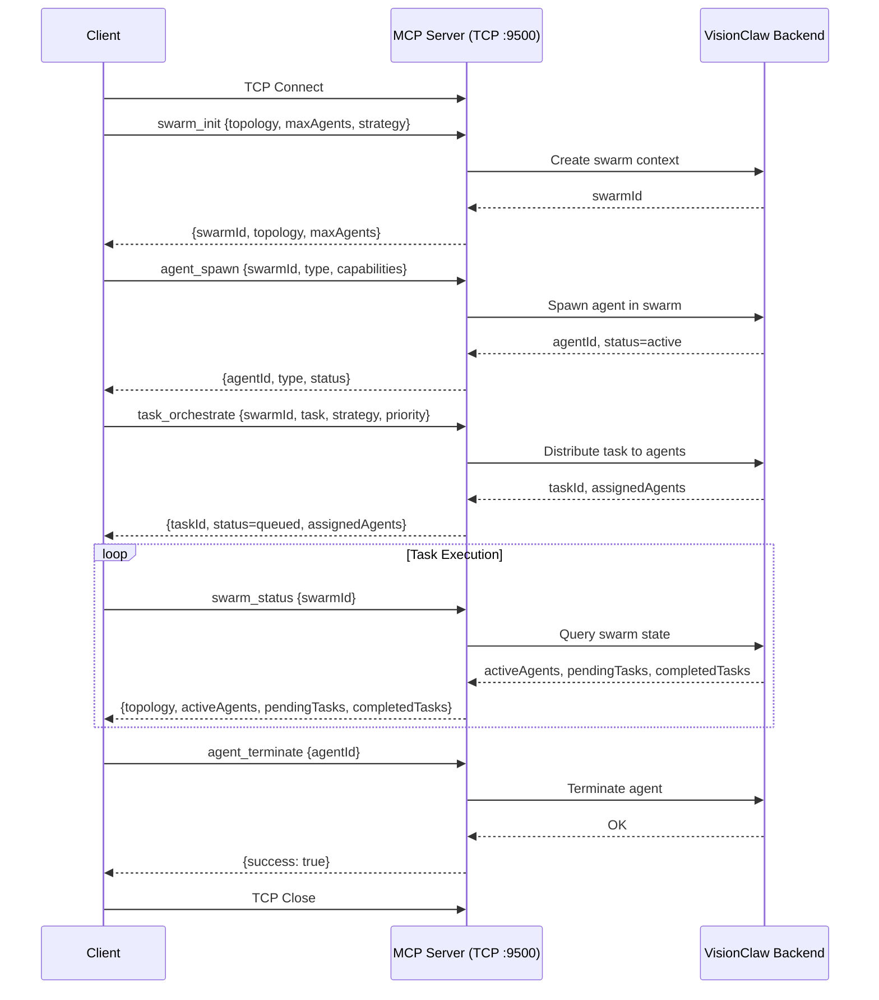
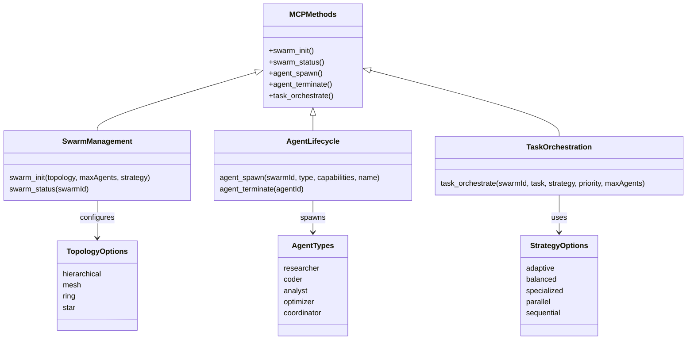

# MCP Protocol Reference

Model Context Protocol (MCP) specification for VisionClaw agent orchestration.

---

### MCP Handshake and Tool Invocation Flow



---

## Connection

### Transport

**Protocol**: TCP
**Port**: 9500 (configurable via `MCP_TCP_PORT`)

```bash
# Connect via telnet
telnet localhost 9500

# Connect via netcat
nc localhost 9500
```

---

## Message Format

### JSON-RPC 2.0 Structure

**Request**:
```json
{
  "jsonrpc": "2.0",
  "id": "550e8400-e29b-41d4-a716-446655440000",
  "method": "method_name",
  "params": {
    "key": "value"
  }
}
```

**Response**:
```json
{
  "jsonrpc": "2.0",
  "id": "550e8400-e29b-41d4-a716-446655440000",
  "result": {
    "key": "value"
  }
}
```

**Error Response**:
```json
{
  "jsonrpc": "2.0",
  "id": "1",
  "error": {
    "code": -32602,
    "message": "Invalid params",
    "data": {
      "field": "topology",
      "message": "Must be one of: hierarchical, mesh, ring, star"
    }
  }
}
```

---

## Methods

### swarm_init

Initialize multi-agent swarm.

**Request**:
```json
{
  "jsonrpc": "2.0",
  "id": "1",
  "method": "swarm_init",
  "params": {
    "topology": "hierarchical",
    "maxAgents": 10,
    "strategy": "adaptive"
  }
}
```

**Parameters**:

| Parameter | Type | Required | Description |
|-----------|------|----------|-------------|
| `topology` | string | Yes | `hierarchical`, `mesh`, `ring`, `star` |
| `maxAgents` | integer | No | Maximum agents (default: 10) |
| `strategy` | string | No | `adaptive`, `balanced`, `specialized` |

**Response**:
```json
{
  "jsonrpc": "2.0",
  "id": "1",
  "result": {
    "swarmId": "swarm-550e8400-e29b-41d4-a716-446655440000",
    "topology": "hierarchical",
    "maxAgents": 10
  }
}
```

---

### agent_spawn

Spawn agent in swarm.

**Request**:
```json
{
  "jsonrpc": "2.0",
  "id": "2",
  "method": "agent_spawn",
  "params": {
    "swarmId": "swarm-550e8400-e29b-41d4-a716-446655440000",
    "type": "researcher",
    "capabilities": ["analysis", "synthesis"]
  }
}
```

**Parameters**:

| Parameter | Type | Required | Description |
|-----------|------|----------|-------------|
| `swarmId` | string | Yes | Swarm identifier |
| `type` | string | Yes | Agent type (see Agent Types) |
| `capabilities` | array | No | Agent capabilities |
| `name` | string | No | Custom agent name |

**Agent Types**:
- `researcher` - Research and analysis
- `coder` - Code implementation
- `analyst` - Data analysis
- `optimizer` - Performance optimization
- `coordinator` - Task coordination

**Response**:
```json
{
  "jsonrpc": "2.0",
  "id": "2",
  "result": {
    "agentId": "agent-550e8400-e29b-41d4-a716-446655440001",
    "type": "researcher",
    "status": "active"
  }
}
```

---

### task_orchestrate

Orchestrate task across swarm.

**Request**:
```json
{
  "jsonrpc": "2.0",
  "id": "3",
  "method": "task_orchestrate",
  "params": {
    "swarmId": "swarm-550e8400-e29b-41d4-a716-446655440000",
    "task": "Analyze knowledge graph for communities",
    "strategy": "parallel",
    "priority": "high"
  }
}
```

**Parameters**:

| Parameter | Type | Required | Description |
|-----------|------|----------|-------------|
| `swarmId` | string | Yes | Swarm identifier |
| `task` | string | Yes | Task description |
| `strategy` | string | No | `parallel`, `sequential`, `adaptive` |
| `priority` | string | No | `low`, `medium`, `high`, `critical` |
| `maxAgents` | integer | No | Maximum agents for task |

**Response**:
```json
{
  "jsonrpc": "2.0",
  "id": "3",
  "result": {
    "taskId": "task-550e8400-e29b-41d4-a716-446655440002",
    "status": "queued",
    "assignedAgents": 3
  }
}
```

---

### swarm_status

Get swarm status.

**Request**:
```json
{
  "jsonrpc": "2.0",
  "id": "4",
  "method": "swarm_status",
  "params": {
    "swarmId": "swarm-550e8400-e29b-41d4-a716-446655440000"
  }
}
```

**Response**:
```json
{
  "jsonrpc": "2.0",
  "id": "4",
  "result": {
    "swarmId": "swarm-550e8400-e29b-41d4-a716-446655440000",
    "topology": "hierarchical",
    "activeAgents": 5,
    "maxAgents": 10,
    "pendingTasks": 2,
    "completedTasks": 15
  }
}
```

---

### agent_terminate

Terminate an agent.

**Request**:
```json
{
  "jsonrpc": "2.0",
  "id": "5",
  "method": "agent_terminate",
  "params": {
    "agentId": "agent-550e8400-e29b-41d4-a716-446655440001"
  }
}
```

---

### MCP Tool Categories and Taxonomy



---

## Error Codes

### Standard JSON-RPC Errors

| Code | Meaning |
|------|---------|
| -32700 | Parse error |
| -32600 | Invalid Request |
| -32601 | Method not found |
| -32602 | Invalid params |
| -32603 | Internal error |

### VisionClaw-Specific Errors

| Code | Meaning |
|------|---------|
| -32001 | Swarm not found |
| -32002 | Agent not found |
| -32003 | Task not found |
| -32004 | Swarm capacity exceeded |
| -32005 | Agent spawn failed |

---

## Connection Lifecycle

```
Client                          Server
  |                               |
  |------ TCP Connect ----------->|
  |                               |
  |------ swarm_init ------------>|
  |<----- swarm_id ---------------|
  |                               |
  |------ agent_spawn ----------->|
  |<----- agent_id ---------------|
  |                               |
  |------ task_orchestrate ------>|
  |<----- task_id ----------------|
  |                               |
  |------ swarm_status ---------->|
  |<----- status -----------------|
  |                               |
  |------ TCP Close ------------->|
  |                               |
```

---

## Related Documentation

- [Protocol Reference](./README.md)
- [WebSocket Binary Protocol](../websocket-binary.md)
- [Agent Configuration](../configuration/README.md)
