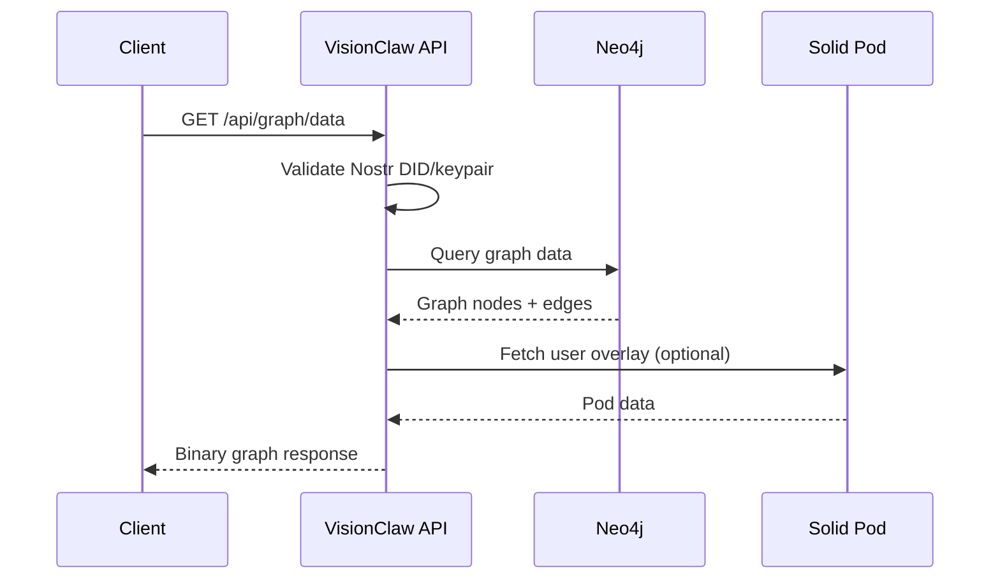

# VisionClaw REST API Reference

---

## Overview

**Base URL**: `http://localhost:8080` (development) / your deployment host (production)

All REST API paths are prefixed with `/api/` unless otherwise noted. Solid Pod endpoints use `/solid/`.

**API version**: 1.1.0
**Content-Type**: `application/json` for all requests and responses, unless otherwise noted.
**OpenAPI UI**: Available at `http://localhost:8080/swagger-ui/`

### Endpoint Taxonomy

```mermaid
graph LR
    A[VisionClaw API] --> B[/api/graph/*]
    A --> C[/api/settings/*]
    A --> D[/api/ontology/*]
    A --> E[/api/analytics/*]
    A --> F[/api/bots/*]
    A --> G[/api/ragflow/*]
    A --> H[/api/health/*]
    A --> I[/solid/*]
    A --> J[/wss]
    A --> K[Enterprise]

    B --> B1[data]
    B --> B2[node/:id]
    B --> B3[stats]
    C --> C1[:key]
    C --> C2[user/filter]
    D --> D1[hierarchy]
    D --> D2[classes]
    E --> E1[pathfinding/*]
    E --> E2[pagerank, clustering, community]
    I --> I1[pods/*]
    I --> I2[LDP resources]
    K --> K1[/api/broker/*]
    K --> K2[/api/workflows/*]
    K --> K3[/api/connectors/*]
    K --> K4[/api/policy/evaluate]
    K --> K5[/api/mesh-metrics]
```

---

## Enterprise API Endpoints

The enterprise control plane surfaces five API groups, all requiring the `Broker`, `Admin`, or `Auditor` role.

### Judgment Broker — `/api/broker/*`

| Method | Path | Auth | Description |
|--------|------|------|-------------|
| GET | `/api/broker/inbox` | Broker/Admin | List open escalation cases for the authenticated broker |
| GET | `/api/broker/cases` | Broker/Admin/Auditor | List all cases (filterable by status, priority, date) |
| POST | `/api/broker/cases` | Broker/Admin | Submit a new escalation case |
| GET | `/api/broker/cases/:id` | Broker/Admin/Auditor | Get a single case with full provenance chain |
| POST | `/api/broker/cases/:id/decide` | Broker/Admin | Record a decision (Approve/Reject/Escalate/Defer) on a case |

**Case submit body:**
```json
{
  "title": "string",
  "description": "string",
  "priority": "P1 | P2 | P3",
  "context": { "agentId": "string", "workflowId": "string", "ruleId": "string" }
}
```

**Decide body:**
```json
{
  "outcome": "Approved | Rejected | Escalated | Deferred",
  "justification": "string",
  "overrideRuleId": "string | null"
}
```

---

### Workflow Proposals — `/api/workflows/*`

| Method | Path | Auth | Description |
|--------|------|------|-------------|
| GET | `/api/workflows/proposals` | All authenticated | List workflow proposals (status filter: Draft/Submitted/UnderReview/Approved/...) |
| POST | `/api/workflows/proposals` | Contributor+ | Submit a new workflow proposal |
| GET | `/api/workflows/proposals/:id` | All authenticated | Get proposal detail with step graph |
| POST | `/api/workflows/proposals/:id/promote` | Admin | Promote an Approved proposal to active workflow pattern |
| GET | `/api/workflows/patterns` | All authenticated | List approved, reusable workflow patterns |

---

### Connectors — `/api/connectors/*`

| Method | Path | Auth | Description |
|--------|------|------|-------------|
| GET | `/api/connectors` | Admin/Auditor | List configured connectors |
| POST | `/api/connectors` | Admin | Register a new connector (GitHub, Slack, Jira, Confluence, Notion) |
| GET | `/api/connectors/:id` | Admin/Auditor | Get connector config and last-sync status |
| DELETE | `/api/connectors/:id` | Admin | Remove connector and revoke credentials |

**Connector create body:**
```json
{
  "name": "string",
  "type": "GitHub | Slack | Jira | Confluence | Notion",
  "credentials": { "token": "string" },
  "redactionRules": [{ "field": "string", "pattern": "string", "action": "Redact | Hash | Drop" }],
  "syncIntervalMinutes": 60
}
```

---

### Policy Engine — `/api/policy/*`

| Method | Path | Auth | Description |
|--------|------|------|-------------|
| POST | `/api/policy/evaluate` | All authenticated | Evaluate an action against the current rule set |
| GET | `/api/policy/rules` | Admin/Auditor | List configured policy rules |
| PUT | `/api/policy/rules/:id` | Admin | Update a policy rule (Allow/Deny/Escalate, conditions, priority) |

**Evaluate body:**
```json
{
  "action": "string",
  "subjectRole": "Broker | Admin | Auditor | Contributor",
  "resourceType": "string",
  "context": {}
}
```

**Evaluate response:**
```json
{
  "result": "Allow | Deny | Escalate",
  "matchedRuleId": "string | null",
  "justification": "string"
}
```

---

### Mesh KPIs — `/api/mesh-metrics`

| Method | Path | Auth | Description |
|--------|------|------|-------------|
| GET | `/api/mesh-metrics` | Admin/Auditor | Current four KPI values with 30-day trend |
| GET | `/api/mesh-metrics?window=7d` | Admin/Auditor | KPI values for specified time window |

**Response:**
```json
{
  "meshVelocity": { "value": 36.5, "unit": "hours", "trend": [...] },
  "augmentationRatio": { "value": 0.71, "trend": [...] },
  "trustVariance": { "value": 0.09, "trend": [...] },
  "hitlPrecision": { "value": 0.94, "trend": [...] },
  "window": "30d",
  "computedAt": "2026-04-18T12:00:00Z"
}
```

See [DDD Enterprise Contexts](../explanation/ddd-enterprise-contexts.md) for the KPI definitions and lineage model.

### Authentication Summary

All mutation endpoints (POST, PUT, DELETE) require authentication. GET endpoints are public unless noted.

**Active authentication method**: Nostr keypair + session token (NIP-98 and session bearer).
**Deprecated**: JWT email/password login. Do not use in new integrations.
**Dev bypass**: Set `SETTINGS_AUTH_BYPASS=true` to treat all requests as `dev-user`.

---

## Authentication

VisionClaw uses Nostr-based identity (NIP-98). Clients authenticate using a Nostr keypair; the server issues a session token bound to the Nostr pubkey.

### Authentication Flow



### Nostr NIP-98 Authentication

Construct a kind-27235 Nostr event and base64-encode it in the `Authorization` header.

**Required event tags**:

| Tag | Description | Required |
|-----|-------------|----------|
| `u` | Full request URL | Yes |
| `method` | HTTP method | Yes |
| `payload` | SHA-256 hex hash of request body | For POST/PUT |

**Event must satisfy**:
- `created_at` within 60 seconds of server time
- Valid Schnorr signature over the event id
- Events are single-use (replay protection enforced)

```typescript
import { generatePrivateKey, getPublicKey, finishEvent } from 'nostr-tools';

const sk = generatePrivateKey();
const pk = getPublicKey(sk);

const authEvent = finishEvent({
  kind: 27235,
  created_at: Math.floor(Date.now() / 1000),
  tags: [
    ['u', 'http://localhost:8080/api/settings/bulk'],
    ['method', 'POST'],
    ['payload', sha256HexOfBody]
  ],
  content: ''
}, sk);

const authHeader = `Nostr ${btoa(JSON.stringify(authEvent))}`;
```

### Session Token (Bearer)

After initial NIP-98 authentication, the server issues a session token (stored in `localStorage` as `nostr_session_token`). Subsequent requests may use:

```http
Authorization: Bearer <nostr_session_token>
X-Nostr-Pubkey: <hex_pubkey>
```

Session validated via `nostr_service.validate_session(&pubkey, &token)`. Expiry controlled by `AUTH_TOKEN_EXPIRY` env var (default: 3600 seconds).

### 401 Error Response

```json
{
  "error": "Missing authorization token"
}
```

### Dev Bypass

```bash
SETTINGS_AUTH_BYPASS=true  # treats all requests as power user dev-user
POWER_USER_PUBKEYS=pubkey1,pubkey2  # comma-separated power user pubkeys
```

---

## Graph Endpoints

Configured in `api_handler/graph/mod.rs`.

### GET /api/graph/data

Retrieve the full graph (all nodes and edges). Optionally filter by graph type.

**Query parameters**:

| Parameter | Type | Default | Description |
|-----------|------|---------|-------------|
| `graph_type` | string | all | Filter: `knowledge`, `ontology`, `agent` |

**Response** (200 OK):

```json
{
  "nodes": [
    {
      "id": "42",
      "label": "Design Patterns",
      "node_type": "page",
      "metadata": {
        "classIri": "http://example.org/KnowledgePage",
        "file_path": "mainKnowledgeGraph/pages/design-patterns.md"
      }
    }
  ],
  "edges": [
    {
      "id": "edge-1",
      "source": "42",
      "target": "99",
      "relationship": "LINKS_TO",
      "weight": 1.0
    }
  ],
  "node_count": 1523,
  "edge_count": 4200
}
```

**Note**: Node IDs are sequential u32 starting at 1. High bits encode type flags (see WebSocket binary protocol for flag definitions). Client must use `String()` coercion when comparing IDs.

### GET /api/graph/stats

Return graph statistics without full data payload.

**Response** (200 OK):

```json
{
  "node_count": 1523,
  "edge_count": 4200,
  "knowledge_nodes": 199,
  "ontology_nodes": 623,
  "agent_nodes": 12,
  "graph_types": ["knowledge", "ontology", "agent"]
}
```

### GET /api/graph/node/:id

Get a single node by its numeric ID.

**Response** (200 OK):

```json
{
  "id": "42",
  "label": "Design Patterns",
  "node_type": "page",
  "metadata": {
    "classIri": "http://example.org/KnowledgePage",
    "properties": { "public": true }
  }
}
```

**Error**: 404 if node not found.

### POST /api/graph/node

Add a node to the graph. No authentication required (checked against settings).

**Request body**:

```json
{
  "label": "New Concept",
  "node_type": "page",
  "metadata": {
    "classIri": "http://example.org/Concept"
  }
}
```

**Response** (201 Created):

```json
{ "id": "1524", "label": "New Concept" }
```

### DELETE /api/graph/node/:id

Remove a node by ID.

**Response** (204 No Content): Empty body on success.

---

## Settings Endpoints

Configured in `settings/api/settings_routes.rs`.

All mutation endpoints require authentication. Anonymous users may read global settings.

### GET /api/settings

Get all global settings (or user-specific settings if authenticated).

```http
GET /api/settings
Authorization: Bearer <token>
X-Nostr-Pubkey: <pubkey>
```

**Response** (200 OK): Full `AppFullSettings` object (JSON-serialized).

### GET /api/settings/all

Alias for `GET /api/settings`. Returns user settings if authenticated, falls back to global settings for anonymous access.

### GET /api/settings/:key

Get a single setting by key.

**Response** (200 OK):

```json
{ "key": "physics.damping", "value": 0.8 }
```

### PUT /api/settings/:key

Update a single setting. Authentication required.

```http
PUT /api/settings/physics.damping
Authorization: Bearer <token>
Content-Type: application/json

{ "value": 0.9 }
```

**Response** (200 OK): Updated value.

### POST /api/settings/bulk

Bulk update multiple settings. Authentication required. Accepts partial JSON patches.

```http
POST /api/settings/bulk
Authorization: Bearer <token>
Content-Type: application/json

{
  "changes": [
    { "key": "physics.damping", "value": 0.8 },
    { "key": "physics.spring", "value": 1.0 },
    { "key": "rendering.maxNodes", "value": 500000 }
  ]
}
```

**Response** (200 OK): Array of updated keys.

### DELETE /api/settings/:key

Reset a setting to its default value. Authentication required.

**Response** (200 OK): Default value for the key.

### GET /api/settings/user/filter

Get the authenticated user's personal graph filter settings.

**Response** (200 OK):

```json
{
  "pubkey": "3bf0c63f...",
  "enabled": true,
  "quality_threshold": 0.8,
  "authority_threshold": 0.6,
  "filter_by_quality": true,
  "filter_by_authority": false,
  "filter_mode": "or",
  "max_nodes": 5000,
  "updated_at": "2026-04-09T10:00:00Z"
}
```

### PUT /api/settings/user/filter

Update the authenticated user's personal filter settings.

```http
PUT /api/settings/user/filter
Authorization: Bearer <token>
X-Nostr-Pubkey: <pubkey>
Content-Type: application/json

{
  "enabled": true,
  "quality_threshold": 0.8,
  "authority_threshold": 0.6,
  "filter_by_quality": true,
  "filter_by_authority": false,
  "filter_mode": "or",
  "max_nodes": 5000
}
```

**Response** (200 OK): Updated filter object.

### Specific Settings Sub-routes (Auth Required)

| Method | Path | Description |
|--------|------|-------------|
| PUT | `/api/settings/physics` | Update physics simulation parameters |
| PUT | `/api/settings/constraints` | Update ontology constraint weights |
| PUT | `/api/settings/rendering` | Update rendering quality settings |
| PUT | `/api/settings/node-filter` | Update global node filter |
| PUT | `/api/settings/quality-gates` | Update quality gate thresholds |

---

## Ontology Endpoints

Configured in `ontology_handler.rs`.

### GET /api/ontology/classes

List all OWL classes from the loaded ontology.

**Response** (200 OK):

```json
{
  "classes": [
    {
      "iri": "http://example.org/Person",
      "label": "Person",
      "subclassOf": null
    }
  ],
  "total": 623
}
```

### GET /api/ontology/hierarchy

Get the full OWL class hierarchy.

**Query parameters**:

| Parameter | Type | Default | Description |
|-----------|------|---------|-------------|
| `ontology-id` | string | `default` | Ontology identifier |
| `max-depth` | integer | unlimited | Maximum hierarchy depth |

**Response** (200 OK):

```json
{
  "rootClasses": ["http://example.org/Person"],
  "hierarchy": {
    "http://example.org/Person": {
      "iri": "http://example.org/Person",
      "label": "Person",
      "parentIri": null,
      "childrenIris": ["http://example.org/Student", "http://example.org/Teacher"],
      "nodeCount": 5,
      "depth": 0
    }
  }
}
```

**Caching**: Results cached for 1 hour with ontology hash validation.

### GET /api/ontology/properties

List all OWL object and datatype properties.

### GET /api/ontology/axioms

List all ontology axioms (SubClassOf, DisjointWith, etc.).

### GET /api/ontology/individuals

List all ontology individuals.

### GET /api/ontology/disjoint-classes

Get all disjoint class pairs.

**Response** (200 OK):

```json
{
  "disjoint-pairs": [
    { "classA": "http://example.org/Animal", "classB": "http://example.org/Plant" }
  ]
}
```

### POST /api/ontology/load

Load an ontology file (OWL/RDF format). No authentication required (controlled by backend config).

```http
POST /api/ontology/load
Content-Type: application/json

{ "ontology-id": "default", "source": "path/to/ontology.owl" }
```

### POST /api/ontology/classify

Run OWL classification (Whelk EL++ reasoner).

**Response** (200 OK):

```json
{
  "inferred-axioms": [
    {
      "axiomType": "SubClassOf",
      "subjectIri": "http://example.org/GraduateStudent",
      "objectIri": "http://example.org/Person",
      "confidence": 0.95,
      "reasoningMethod": "whelk-el++"
    }
  ],
  "cache-hit": false,
  "reasoning-time-ms": 245
}
```

---

## Ontology Physics Endpoints

Configured in `api_handler/ontology_physics/mod.rs`.

| Method | Path | Auth | Description |
|--------|------|------|-------------|
| GET | `/api/ontology-physics/constraints` | No | Get active physics constraints |
| POST | `/api/ontology-physics/constraints` | Yes | Add constraint |
| PUT | `/api/ontology-physics/weights` | Yes | Adjust constraint weights (returns 501) |
| POST | `/api/ontology-physics/reset` | Yes | Reset physics config |

### POST /api/constraints/generate

Generate physics constraints from ontology axioms.

```http
POST /api/constraints/generate
Content-Type: application/json

{
  "ontology-id": "default",
  "constraint-types": ["Separation", "HierarchicalAttraction"],
  "config": {
    "disjoint-repel-multiplier": 2.0,
    "subclass-spring-multiplier": 0.5
  }
}
```

**Response** (200 OK):

```json
{
  "constraints": [
    {
      "constraintType": "Separation",
      "nodeA": "http://example.org/Animal",
      "nodeB": "http://example.org/Plant",
      "minDistance": 70.0,
      "strength": 0.8,
      "priority": 5
    },
    {
      "constraintType": "HierarchicalAttraction",
      "child": "http://example.org/Student",
      "parent": "http://example.org/Person",
      "idealDistance": 20.0,
      "strength": 0.3,
      "priority": 5
    }
  ],
  "total-count": 245,
  "generation-time-ms": 123
}
```

---

## Analytics and Pathfinding Endpoints

Configured in `api_handler/analytics/mod.rs`. All pathfinding and GPU analytics endpoints require the `gpu` feature flag at compile time and a CUDA-capable GPU.

### Standard Analytics

| Method | Path | Auth | Description |
|--------|------|------|-------------|
| GET | `/api/analytics/metrics` | No | Graph metrics (BFS path length, clustering, centralization, modularity, efficiency) |
| POST | `/api/analytics/pagerank` | Yes | Run PageRank computation |
| POST | `/api/analytics/clustering` | Yes | Run K-means clustering |
| POST | `/api/analytics/community` | Yes | Run Louvain community detection |
| POST | `/api/analytics/anomaly` | Yes | Run LOF anomaly detection |
| POST | `/api/analytics/centrality` | Yes | Compute centrality measures |
| GET | `/api/analytics/clusters` | No | Get current cluster assignments |
| GET | `/api/analytics/communities` | No | Get community assignments |
| POST | `/api/analytics/embedding` | Yes | Compute graph embeddings |
| POST | `/api/analytics/similarity` | Yes | Compute node similarity |
| POST | `/api/analytics/filter` | Yes | Apply analytics filter |
| GET | `/api/analytics/summary` | No | Analytics computation summary |
| POST | `/api/analytics/layout/force` | Yes | Trigger force-directed layout |
| POST | `/api/analytics/layout/stress` | Yes | Trigger stress majorization layout |
| GET | `/api/analytics/feature-flags` | No | Check GPU feature availability |

### GET /api/analytics/pathfinding/:source/:target

Find the shortest path between two nodes.

**Response** (200 OK):

```json
{
  "path": [0, 5, 12, 42],
  "distance": 3.0,
  "computation_time_ms": 8
}
```

### POST /api/analytics/pathfinding/sssp

GPU-accelerated single-source shortest path from a source node to all reachable nodes.

**Request**:

```json
{ "sourceIdx": 0, "maxDistance": 5.0 }
```

**Parameters**:

| Field | Type | Required | Description |
|-------|------|----------|-------------|
| `sourceIdx` | integer | Yes | Source node index |
| `maxDistance` | float | No | Distance cutoff (omit for full graph) |

**Response** (200 OK):

```json
{
  "success": true,
  "result": {
    "distances": [0.0, 1.5, 2.3, 3.1],
    "sourceIdx": 0,
    "nodesReached": 1234,
    "maxDistance": 4.8,
    "computationTimeMs": 15
  },
  "error": null
}
```

`distances` is indexed by node index; `f32::MAX` means unreachable.

### POST /api/analytics/pathfinding/apsp

Approximate all-pairs shortest path using landmark-based method.

**Request**:

```json
{ "numLandmarks": 10, "seed": 42 }
```

**Response** (200 OK):

```json
{
  "success": true,
  "result": {
    "distances": [0.0, 1.5, 2.3],
    "numNodes": 1000,
    "numLandmarks": 10,
    "landmarks": [5, 123, 456, 789],
    "avgErrorEstimate": 0.15,
    "computationTimeMs": 245
  }
}
```

`distances` is a flattened `numNodes x numNodes` row-major matrix. Access: `distances[i * numNodes + j]`.

### POST /api/analytics/pathfinding/connected-components

Detect disconnected graph regions using GPU label propagation.

**Request**:

```json
{ "maxIterations": 100 }
```

**Response** (200 OK):

```json
{
  "success": true,
  "result": {
    "labels": [0, 0, 0, 1, 1, 2],
    "numComponents": 3,
    "componentSizes": [1024, 512, 256],
    "largestComponentSize": 1024,
    "isConnected": false,
    "iterations": 8,
    "computationTimeMs": 42
  }
}
```

### GET /api/analytics/pathfinding/stats/sssp

Pathfinding computation performance statistics.

**Response** (200 OK):

```json
{
  "totalSsspComputations": 142,
  "totalApspComputations": 8,
  "avgSsspTimeMs": 12.3,
  "avgApspTimeMs": 234.5,
  "lastComputationTimeMs": 15
}
```

### GET /api/analytics/pathfinding/stats/components

Connected components computation statistics.

**Response** (200 OK):

```json
{
  "totalComputations": 25,
  "avgComputationTimeMs": 38.2,
  "avgNumComponents": 3.4,
  "lastNumComponents": 4
}
```

### Pathfinding Error Responses

| Error | Cause |
|-------|-------|
| `"GPU features not enabled"` | Compiled without `gpu` feature |
| `"Shortest path actor not available"` | GPU compute actor not initialized |
| `"Number of landmarks (N) must be less than number of nodes (M)"` | Invalid APSP parameters |
| `"Actor communication error: mailbox closed"` | Actor system failure |

**Performance characteristics**:

| Algorithm | Typical Time | GPU Speedup |
|-----------|-------------|-------------|
| SSSP | 10-50ms (1K-10K nodes) | ~100x vs CPU |
| APSP (10 landmarks) | 100-500ms (1K nodes) | N/A (approximate) |
| Connected Components | 20-100ms (1K-10K nodes) | ~50x vs CPU |

---

## Semantic Forces and Schema Endpoints

### Semantic Forces — `/api/semantic-forces/*`

| Method | Path | Auth | Status | Description |
|--------|------|------|--------|-------------|
| GET | `/api/semantic-forces/config` | No | 501 | Get semantic force config (not yet implemented) |
| POST | `/api/semantic-forces/config` | Yes | Active | Update semantic force config |
| POST | `/api/semantic-forces/compute` | Yes | Active | Trigger semantic force computation |
| GET | `/api/semantic-forces/hierarchy` | No | 501 | Get hierarchy levels (not yet implemented) |
| POST | `/api/semantic-forces/hierarchy/recalculate` | Yes | 501 | Recalculate hierarchy (not yet implemented) |
| POST | `/api/semantic-forces/weights` | Yes | Active | Update force weights |
| POST | `/api/semantic-forces/reset` | Yes | Active | Reset to defaults |

### Schema Endpoints

| Method | Path | Description |
|--------|------|-------------|
| GET | `/api/schema` | Get complete graph schema |
| GET | `/api/schema/node-types` | List node types with counts |
| GET | `/api/schema/edge-types` | List edge types with counts |

### Natural Language Query

| Method | Path | Description |
|--------|------|-------------|
| POST | `/api/nl-query/translate` | Translate natural language to Cypher |
| GET | `/api/nl-query/examples` | Get example queries |
| POST | `/api/nl-query/explain` | Explain Cypher query |
| POST | `/api/nl-query/validate` | Validate Cypher syntax |

### Semantic Pathfinding

| Method | Path | Description |
|--------|------|-------------|
| POST | `/api/pathfinding/semantic-path` | Find shortest semantic path |
| POST | `/api/pathfinding/query-traversal` | Explore graph by query |
| POST | `/api/pathfinding/chunk-traversal` | Explore local neighborhood |

---

## Sync Endpoints

### Admin Sync — `/api/admin/sync/*`

Trigger GitHub → Neo4j synchronization.

| Method | Path | Description |
|--------|------|-------------|
| POST | `/api/admin/sync/trigger` | Trigger full sync (respects SHA1 incremental filter) |
| POST | `/api/admin/sync/force` | Force full re-sync regardless of SHA1 cache |
| GET | `/api/admin/sync/status` | Get last sync status and timestamp |

Set `FORCE_FULL_SYNC=1` environment variable to bypass SHA1 incremental filtering for a single run, then reset to 0.

**Sync flow**: `GitHubSyncService::sync_graphs()` → `EnhancedContentAPI::list_markdown_files("")` → `KnowledgeGraphParser::parse()` → Neo4j.

Only files tagged `public:: true` become knowledge graph page nodes. Ontology data is extracted from all files with `### OntologyBlock`, regardless of `public:: true` status.

---

## AI / Agent Endpoints

### Bots — `/api/bots/*`

Configured in `bots_handler.rs`.

| Method | Path | Auth | Description |
|--------|------|------|-------------|
| GET | `/api/bots` | No | List registered bots |
| GET | `/api/bots/:id` | No | Get bot details |
| POST | `/api/bots/register` | Yes | Register new bot |
| PUT | `/api/bots/:id` | Yes | Update bot config |
| DELETE | `/api/bots/:id` | Yes | Unregister bot |
| POST | `/api/bots/update` | Yes | Push bot telemetry (triggers agent pipeline) |

**Example: Register a bot**:

```http
POST /api/bots/register
Authorization: Bearer <token>
Content-Type: application/json

{
  "name": "knowledge-curator",
  "description": "Automated knowledge graph curation agent",
  "pubkey": "3bf0c63f..."
}
```

**Response** (201 Created):

```json
{
  "id": "bot-001",
  "name": "knowledge-curator",
  "pubkey": "3bf0c63f...",
  "registered_at": "2026-04-09T10:00:00Z"
}
```

### RAGFlow — `/api/ragflow/*`

Configured in `ragflow_handler.rs`.

| Method | Path | Auth | Description |
|--------|------|------|-------------|
| GET | `/api/ragflow/status` | No | RAGFlow integration status |
| POST | `/api/ragflow/query` | Yes | Submit RAG query |
| POST | `/api/ragflow/index` | Yes | Trigger document indexing |
| POST | `/api/ragflow/config` | Yes | Update RAGFlow config |

### Briefing API — `/api/briefs/*`

Bridges the VisionClaw frontend to the Management API agent container for the VisionClaw briefing workflow.

#### POST /api/briefs

Submit a new brief and spawn role agents.

```http
POST /api/briefs
Content-Type: application/json

{
  "briefing": {
    "content": "Analyze the design patterns knowledge graph for clustering opportunities",
    "roles": ["analyst", "curator", "reviewer"]
  },
  "user_context": {
    "display_name": "John",
    "pubkey": "3bf0c63f..."
  }
}
```

**Response** (201 Created):

```json
{
  "brief_id": "brief-abc123",
  "bead_id": "bead-xyz789",
  "path": "/briefs/brief-abc123",
  "role_tasks": [
    { "task_id": "task-001", "role": "analyst", "bead_id": "bead-001" },
    { "task_id": "task-002", "role": "curator", "bead_id": "bead-002" }
  ]
}
```

#### POST /api/briefs/:brief_id/debrief

Request a consolidated debrief. On success, the `BeadLifecycleOrchestrator` (ADR-034)
creates a bead in `Created` state, publishes a Nostr kind 30001 provenance event with
retry (configurable via `BEAD_RETRY_*` env vars), persists the `(:NostrEvent)-[:PROVENANCE_OF]->(:Bead)`
record to Neo4j, and tracks the full lifecycle. Every publish attempt produces a typed
`BeadOutcome` (Success, RelayTimeout, RelayRejected, RelayUnreachable, SigningFailed,
Neo4jWriteFailed, BridgeFailed) — no silent failures. Requires `VISIONCLAW_NOSTR_PRIVKEY`.

```http
POST /api/briefs/brief-abc123/debrief
Content-Type: application/json

{
  "role_tasks": [
    { "task_id": "task-001", "role": "analyst", "bead_id": "bead-001" }
  ],
  "user_context": {
    "display_name": "John",
    "pubkey": "3bf0c63f..."
  }
}
```

**Response** (201 Created):

```json
{
  "brief_id": "brief-abc123",
  "debrief_path": "/briefs/brief-abc123/debrief"
}
```

---

## Constraints and Workspace Endpoints

### Constraints — `/api/constraints/*`

Configured in `constraints_handler.rs`.

| Method | Path | Auth | Description |
|--------|------|------|-------------|
| GET | `/api/constraints` | No | List all constraints |
| GET | `/api/constraints/stats` | No | Constraint statistics |
| POST | `/api/constraints` | Yes | Create constraint |
| PUT | `/api/constraints/:id` | Yes | Update constraint |
| DELETE | `/api/constraints/:id` | Yes | Delete constraint |
| POST | `/api/constraints/validate` | Yes | Validate constraint set |
| POST | `/api/constraints/generate` | No | Generate from ontology (see Ontology Physics section) |

### Workspace API — `/api/workspace/*`

Configured in `workspace_handler.rs`. All endpoints require authentication (Nostr session or Bearer token via `RequireAuth` middleware). Rate limit: 60 requests/minute per authenticated user.

| Method | Path | Description |
|--------|------|-------------|
| GET | `/api/workspace/list` | List workspaces with pagination and filtering |
| POST | `/api/workspace/create` | Create a new workspace |
| GET | `/api/workspace/count` | Count workspaces matching current filter |
| GET | `/api/workspace/{id}` | Get a single workspace by ID |
| PUT | `/api/workspace/{id}` | Update workspace metadata |
| DELETE | `/api/workspace/{id}` | Soft-delete workspace (sets `status = deleted`, data retained) |
| POST | `/api/workspace/{id}/favorite` | Toggle favourite status |
| POST | `/api/workspace/{id}/archive` | Archive or unarchive workspace |

**List query parameters** (`GET /api/workspace/list`):

| Parameter | Type | Description |
|-----------|------|-------------|
| `page` | integer | Page number (default: 0) |
| `page_size` | integer | Results per page (default: 20) |
| `sort_by` | string | `name \| lastAccessed \| createdAt \| updatedAt` |
| `sort_direction` | string | `asc \| desc` |
| `status` | string | Filter by status: `active \| archived` |
| `type` | string | Filter by type: `personal \| team \| public` |
| `search` | string | Text search across name and description |

**Create body** (`POST /api/workspace/create`):

```json
{
  "name": "string",
  "description": "string",
  "type": "personal | team | public",
  "settings": {
    "autoSave": true,
    "syncEnabled": false,
    "collaborationEnabled": false,
    "backupEnabled": true,
    "maxMembers": 10
  }
}
```

**Update body** (`PUT /api/workspace/{id}`) — all fields optional:

```json
{
  "name": "string",
  "description": "string",
  "type": "personal | team | public",
  "settings": { }
}
```

**Workspace model**:

```typescript
interface Workspace {
  id: string;
  name: string;
  description: string;
  type: 'personal' | 'team' | 'public';
  status: 'active' | 'archived';
  memberCount: number;
  lastAccessed: Date;
  createdAt: Date;
  updatedAt: Date;
  favorite: boolean;
  settings?: {
    autoSave: boolean;
    syncEnabled: boolean;
    collaborationEnabled: boolean;
    backupEnabled: boolean;
    maxMembers: number;
  };
}
```

**Soft delete**: `DELETE /api/workspace/{id}` sets `status = deleted` and retains all data. Deleted workspaces do not appear in list results by default but can be recovered by an admin. This differs from the constraints `DELETE` which performs a hard delete.

---

## Solid Pod Endpoints

**Base URL**: `http://localhost:9090/solid`

All Solid Pod operations require Nostr NIP-98 authentication. LDP operations follow the [W3C Linked Data Platform](https://www.w3.org/TR/ldp/) specification.

### Pod Management

#### POST /solid/pods

Create a new Solid Pod for the authenticated user.

```http
POST /solid/pods
Authorization: Nostr <base64_signed_event>
Content-Type: application/json

{
  "name": "my-knowledge-base",
  "template": "visionclaw-default"
}
```

**Available templates**:

| Template | Description |
|----------|-------------|
| `visionclaw-default` | Full VisionClaw structure with memories, ontologies, graphs |
| `minimal` | Basic profile and preferences only |
| `agent-focused` | Optimised for agent memory storage |
| `ontology-contributor` | Focus on ontology proposals |

**Response** (201 Created):

```json
{
  "url": "/pods/npub1abc.../my-knowledge-base/",
  "webId": "https://visionclaw.example/id/npub1abc.../profile/card#me",
  "created": "2026-04-09T10:00:00Z",
  "template": "visionclaw-default",
  "containers": [
    "/pods/npub1abc.../my-knowledge-base/profile/",
    "/pods/npub1abc.../my-knowledge-base/agent-memories/",
    "/pods/npub1abc.../my-knowledge-base/ontologies/",
    "/pods/npub1abc.../my-knowledge-base/graphs/"
  ]
}
```

#### GET /solid/pods

List all Pods for the authenticated user.

**Response** (200 OK):

```json
{
  "pods": [
    {
      "name": "my-knowledge-base",
      "url": "/pods/npub1abc.../my-knowledge-base/",
      "created": "2026-04-09T10:00:00Z",
      "template": "visionclaw-default"
    }
  ],
  "totalCount": 1,
  "storageUsed": 512000,
  "storageQuota": 104857600
}
```

#### GET /solid/pods/check

Check if a specific Pod exists.

**Query**: `?name=my-knowledge-base`

**Response** (200 OK): `{ "exists": true, "url": "...", "size": 102400, "resourceCount": 42 }`

#### DELETE /solid/pods/:name

Delete a Pod and all its contents. Returns 204 No Content.

### LDP Resource Operations

All paths relative to `http://localhost:9090/solid`.

#### GET /solid/{path}

Read a resource or container. Supports content negotiation:

| Accept Header | Format |
|---------------|--------|
| `application/ld+json` | JSON-LD (default) |
| `text/turtle` | Turtle RDF |
| `application/n-triples` | N-Triples |

**Response** includes `ETag` and `Link` headers per LDP spec.

#### PUT /solid/{path}

Replace resource. Supports `If-Match` for optimistic concurrency.

#### POST /solid/{path}

Create resource in container. Optional `Slug` header for suggested name.

**Response**: 201 Created with `Location` header.

#### DELETE /solid/{path}

Remove resource. Returns 204 No Content.

#### PATCH /solid/{path}

Apply partial update using SPARQL UPDATE or N3 Patch.

```http
PATCH /solid/pods/npub1abc.../profile/card
Content-Type: application/sparql-update

PREFIX foaf: <http://xmlns.com/foaf/0.1/>
DELETE { <#me> foaf:name ?old }
INSERT { <#me> foaf:name "New Name" }
WHERE { <#me> foaf:name ?old }
```

**Response** (200 OK): `{ "success": true, "triples": { "added": 1, "removed": 1 } }`

### Solid Pod Error Codes

| Code | HTTP Status | Description |
|------|-------------|-------------|
| `UNAUTHORIZED` | 401 | Missing or invalid authentication |
| `FORBIDDEN` | 403 | Insufficient permissions |
| `NOT_FOUND` | 404 | Resource does not exist |
| `CONFLICT` | 409 | Resource exists or version conflict |
| `INVALID_RDF` | 400 | Malformed RDF content |
| `INVALID_CONTENT_TYPE` | 415 | Unsupported media type |
| `PRECONDITION_FAILED` | 412 | If-Match/If-None-Match failed |
| `QUOTA_EXCEEDED` | 507 | Storage quota exceeded |

---

## Additional Endpoints

### Health and Monitoring

Configured in `consolidated_health_handler.rs`.

| Method | Path | Description |
|--------|------|-------------|
| GET | `/api/health` | Basic health check |
| GET | `/api/health/detailed` | Detailed health (DB, GPU, actors) |
| GET | `/api/health/metrics` | Prometheus-compatible metrics |

**Response** (200 OK):

```json
{
  "status": "healthy",
  "neo4j": "connected",
  "gpu": "available",
  "actors": {
    "physics_orchestrator": "running",
    "broadcast_optimizer": "running"
  },
  "uptime_seconds": 3600
}
```

### Quest3 XR

Configured in `api_handler/quest3/mod.rs`.

| Method | Path | Auth | Description |
|--------|------|------|-------------|
| GET | `/api/quest3/config` | No | Get Meta Quest 3 XR config |
| POST | `/api/quest3/config` | Yes | Update XR config |
| GET | `/api/quest3/performance` | No | XR performance metrics |

### Export and Sharing

| Method | Path | Auth | Description |
|--------|------|------|-------------|
| `*` | `/api/export/*` | No | Graph export (JSON, CSV, GEXF) |
| `*` | `/api/share/*` | No | Graph sharing |
| `*` | `/api/bots-viz/*` | No | Bot visualization data |

### Nostr

| Method | Path | Description |
|--------|------|-------------|
| `*` | `/api/nostr/*` | Nostr authentication endpoints |

### Client Logging

```http
POST /api/client-logs
Content-Type: application/json

{ "level": "error", "message": "...", "stack": "...", "timestamp": 1712678400000 }
```

### OpenAPI Documentation

```
GET /swagger-ui/       — Swagger UI
GET /api/documentation — OpenAPI 3.0 JSON spec
```

---

## Endpoints Returning 501 (Not Implemented)

These endpoints are registered in the router but their backend actor messages are not yet defined. They return HTTP 501 with a JSON error body.

| Endpoint | Reason |
|----------|--------|
| `GET /api/semantic-forces/hierarchy` | Hierarchy retrieval not implemented |
| `GET /api/semantic-forces/config` (detailed) | Semantic config retrieval not implemented |
| `POST /api/semantic-forces/hierarchy/recalculate` | Recalculation not implemented |
| `PUT /api/ontology-physics/weights` | Weight adjustment actor message not defined |

---

## Error Format

All API errors use a consistent JSON envelope:

```json
{
  "error": "Human-readable error message",
  "code": "ERROR_CODE",
  "details": {
    "field": "Additional context"
  },
  "timestamp": "2026-04-09T10:00:00.000Z",
  "trace-id": "abc123def456"
}
```

### HTTP Status Codes

| Code | Meaning |
|------|---------|
| 200 | Success |
| 201 | Created |
| 204 | No Content (success, empty body) |
| 400 | Bad request / validation error |
| 401 | Unauthorized (missing or invalid auth) |
| 403 | Forbidden |
| 404 | Resource not found |
| 409 | Conflict |
| 412 | Precondition failed |
| 415 | Unsupported media type |
| 500 | Internal server error |
| 501 | Not implemented (stub endpoint) |
| 503 | Service unavailable |
| 507 | Storage quota exceeded |

---

## Rate Limiting

REST API endpoints are not rate-limited at the application level. Use a reverse proxy (nginx) for production rate limiting. Suggested production limits:

- 100 requests/minute per IP
- 1000 requests/hour per authenticated pubkey

WebSocket binary position updates are rate-limited to 60 frames/second per client IP, enforced by `WEBSOCKET_RATE_LIMITER` in `socket_flow_handler.rs`.

---

## CORS

**Development**: `Access-Control-Allow-Origin: *`

**Production**: Restricted to specific origins. Configure via reverse proxy.

---

## WebSocket Upgrade

The primary real-time communication channel is not a REST endpoint but a WebSocket connection at `/wss`. For position streaming, graph updates, voice, and bot telemetry, see the [WebSocket Binary Protocol reference](./websocket-binary.md).

| Path | Handler | Protocol |
|------|---------|----------|
| `/wss` | `socket_flow_handler` | JSON control + Binary V2/V3 position streaming |
| `/ws/speech` | `speech_socket_handler` | Binary audio (Opus 16kHz mono) |
| `/ws/mcp-relay` | `mcp_relay_handler` | JSON (MCP protocol relay) |
| `/ws/client-messages` | `client_messages_handler` | JSON (client-to-client messaging) |
| `/solid/ws` | Solid notification handler | JSON (LDP resource notifications) |
