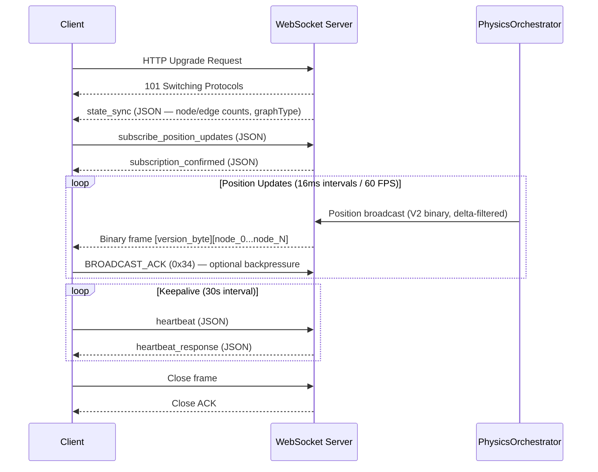
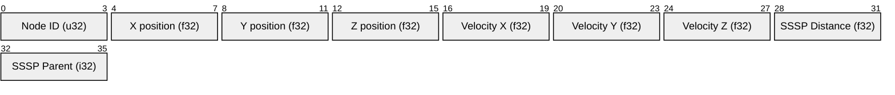

# VisionClaw WebSocket Binary Protocol

> **Superseded by [ADR-061](../adr/ADR-061-binary-protocol-unification.md) (2026-04-30).**
> The current single-source spec is **[docs/binary-protocol.md](../binary-protocol.md)**.
> One binary protocol, no versions, 24 bytes/node fixed.
>
> The historical V2/V3/V4/V5 content below is preserved for archaeological reference.
> Do not implement against it.

---

## Historical context

## CRITICAL: V1 JSON Protocol is Dead

**The JSON WebSocket protocol (V1) has been removed. It is not deprecated — it is gone.**

There is no `protocol=json` parameter. There is no JSON position stream. Any legacy code referencing JSON node updates must be migrated. The binary protocol is the only supported format for position streaming.

Control messages (authentication, subscription, heartbeat) continue to use JSON over the same connection. Only the position payload is binary.

---

## Overview

VisionClaw uses a **hybrid protocol** on the `/wss` WebSocket endpoint:
- **JSON text frames**: Connection lifecycle, authentication, subscription control, state sync
- **Binary frames**: High-frequency position streaming (V2 standard, V3 analytics, V4 experimental)

**Performance at 100K nodes @ 60 FPS**:

| Protocol | Frame Size | Parse Time | CPU (client) | vs JSON |
|----------|-----------|------------|--------------|---------|
| Binary V2 | 3.6 MB | 0.8 ms | 3% | 80% smaller |
| Binary V3 | 4.8 MB | 1.1 ms | 4% | 73% smaller |
| Binary V4 (delta) | 0.7–1.4 MB | 0.2 ms | <1% | 92–96% smaller |
| JSON (removed) | 18 MB | 12 ms | 18% | baseline |

**Connection endpoint**: `ws://host:port/wss`

The server also exposes:
- `/ws/speech` — binary Opus audio stream
- `/ws/mcp-relay` — JSON MCP protocol relay
- `/ws/client-messages` — JSON client-to-client messaging

---

## Protocol Versions

| Version | Bytes/Node | Status | Use Case |
|---------|-----------|--------|----------|
| **V5** | 36 + 9-byte header | **Production wire format** | All position streaming (current) |
| V3 | 48 | Stable | Analytics extension (clustering, anomaly, community) |
| V4 | 16 (changed nodes only) | Experimental | Delta encoding — see WS-001 in KNOWN_ISSUES |
| V2 | 36 | Legacy | Superseded by V5 framing |
| V1 | 34 | **Removed — do not use** | Legacy, ID limit 16383 |

**Version selection logic** (server-side):
1. Default → V5 (9-byte header + V3 per-node payload, sequence-numbered)
2. Analytics fields requested → V3 per-node fields included in V5 frame
3. Delta encoding enabled → V4 (experimental, not recommended — see WS-001)

Historically, the server encoded a one-byte version field as the first byte of every binary frame. *(post-ADR-061: replaced by a fixed 0x42 preamble; not a version dispatch — see [docs/binary-protocol.md](../binary-protocol.md).)*

---

## V5 Frame Format (Production)

V5 is the current production wire format. It wraps V3 per-node data in a 9-byte header that enables reliable sequence-based synchronisation.

### V5 Frame Header (9 bytes, prefix to all position broadcasts)

| Bytes | Field | Type | Description |
|-------|-------|------|-------------|
| 0 | Version | u8 | Value `5` |
| 1–8 | Broadcast sequence | u64 LE | Monotonically increasing counter; increments on every broadcast |

The 8-byte broadcast sequence replaces the per-node timestamp for frame ordering. Clients can detect missed frames by checking for sequence gaps. A missed frame warrants a full-state re-request rather than accumulating stale deltas.

### V5 Frame Body (36 or 48 bytes per node, following the header)

The per-node payload is identical to V2 (36 bytes) or V3 (48 bytes with analytics). All nodes in a single broadcast share one V5 header.

**Full frame body layout (36 bytes × N nodes)**:

| Bytes (per node) | Field | Type | Description |
|------------------|-------|------|-------------|
| 0–3 | Node ID | u32 | Flag bits 26-31 encode node type |
| 4–15 | Position (X/Y/Z) | f32×3 | World-space position |
| 16–27 | Velocity (X/Y/Z) | f32×3 | Physics velocity |
| 28–31 | SSSP distance | f32 | Shortest-path from source |
| 32–35 | Timestamp | u32 | ms since session start |

### V5 Client Parsing Example

```typescript
function parseV5Frame(buffer: ArrayBuffer): { sequence: bigint; nodes: NodePosition[] } {
  const view = new DataView(buffer);
  const version = view.getUint8(0);
  if (version !== 5) throw new Error(`Expected V5 frame, got version ${version}`);

  const sequence = view.getBigUint64(1, true); // 8 bytes little-endian
  const headerSize = 9;
  const nodeSize = 36;
  const nodeCount = (buffer.byteLength - headerSize) / nodeSize;
  const nodes: NodePosition[] = [];

  for (let i = 0; i < nodeCount; i++) {
    const offset = headerSize + i * nodeSize;
    nodes.push({
      id:       view.getUint32(offset,      true),
      x:        view.getFloat32(offset + 4, true),
      y:        view.getFloat32(offset + 8, true),
      z:        view.getFloat32(offset + 12, true),
      vx:       view.getFloat32(offset + 16, true),
      vy:       view.getFloat32(offset + 20, true),
      vz:       view.getFloat32(offset + 24, true),
      ssspDist: view.getFloat32(offset + 28, true),
      ts:       view.getUint32(offset + 32, true),
    });
  }
  return { sequence, nodes };
}
```

### V5 Notes

- **Full frames only**: V5 always sends all node positions. Delta encoding (V4) is not used in V5 framing because all nodes move every physics iteration — delta encoding provides no bandwidth benefit in practice.
- **Broadcast sequence**: The server maintains a monotonic `broadcast_sequence` counter. Clients should track the last received sequence and request a full re-sync if a gap exceeds 5 frames.
- **Periodic full broadcast**: The server forces a full broadcast every 300 physics iterations regardless of convergence state. This ensures late-connecting clients synchronise within ~5 seconds.

---

## Connection Lifecycle



### Initial Load Strategy

The server sends a sparse initial load to avoid overwhelming clients:

1. Server sends top 200 nodes (sorted by quality score) as `InitialGraphLoad` JSON
2. Client renders initial view immediately
3. Client requests expansion via `filter_update` JSON message
4. Server sends incremental binary batches matching filter criteria

Full graph fetch: `GET /api/graph/data` (REST, returns JSON).

### Backpressure

Server throttles send rate per client if ACKs fall behind. The client sends `BROADCAST_ACK`:

```
Bytes 0-3: Sequence ID (u32, little-endian)
Bytes 4-7: Nodes received count (u32, little-endian)
```

Rate limit: 60 frames/second per client IP, enforced by `WEBSOCKET_RATE_LIMITER`.

---

## JSON Control Messages

JSON text frames handle control flow on the same connection.

### Client → Server

#### subscribe_position_updates

```json
{
  "type": "subscribe_position_updates",
  "data": {
    "rate": 60,
    "nodeFilter": "all",
    "protocol": "binary-v2"
  }
}
```

#### filter_update

```json
{
  "type": "filter_update",
  "data": {
    "quality": 0.7,
    "maxNodes": 500000,
    "types": ["concept", "entity", "class"]
  }
}
```

#### heartbeat

```json
{
  "type": "heartbeat",
  "timestamp": 1712678400000
}
```

### Server → Client

#### state_sync

```json
{
  "type": "state_sync",
  "data": {
    "nodes": 1523,
    "edges": 4200,
    "graphType": "knowledge-graph",
    "timestamp": 1712678400000
  }
}
```

#### subscription_confirmed

```json
{
  "type": "subscription_confirmed",
  "data": {
    "rate": 60,
    "protocol": "binary-v2",
    "nodeCount": 1523
  }
}
```

#### Graph Type Flags (GRAPH_UPDATE 0x01)

The 5th header byte identifies the graph layer for a `GRAPH_UPDATE` message:

| Value | Graph Type |
|-------|-----------|
| 0x00 | Default / combined |
| 0x01 | Knowledge graph |
| 0x02 | Ontology graph |
| 0x03 | Agent graph |

---

## V2 Binary Format (36-byte node record)

V2 is the production standard. All binary frames begin with a single version byte, followed by zero or more 36-byte node records.

**Total message size**: `1 + (36 × node_count)` bytes



### Field Specifications

All fields are **little-endian**. Byte offsets are relative to the start of each 36-byte node record (after the version byte at frame offset 0).

| Offset | Field | Type | Description |
|--------|-------|------|-------------|
| 0–3 | Node ID | u32 | Bits 0–29: actual ID (0–1,073,741,823). Bits 30–31: type flags |
| 4–7 | Position X | f32 | 3D world coordinate X |
| 8–11 | Position Y | f32 | 3D world coordinate Y |
| 12–15 | Position Z | f32 | 3D world coordinate Z |
| 16–19 | Velocity X | f32 | Physics velocity X (units/sec) |
| 20–23 | Velocity Y | f32 | Physics velocity Y (units/sec) |
| 24–27 | Velocity Z | f32 | Physics velocity Z (units/sec) |
| 28–31 | SSSP Distance | f32 | Single-source shortest path distance. `f32::INFINITY` if not computed |
| 32–35 | SSSP Parent | i32 | Parent node index in SSSP tree. `-1` if none |

### Node Type Flags (High Bits of Node ID)

The server encodes node type into the high bits of the u32 node ID field:

```rust
// Rust server constants (src/utils/binary_protocol.rs)
const AGENT_NODE_FLAG: u32    = 0x80000000;  // Bit 31
const KNOWLEDGE_NODE_FLAG: u32 = 0x40000000;  // Bit 30
const NODE_ID_MASK: u32        = 0x3FFFFFFF;  // Bits 0-29

// Ontology subtypes (bits 26–28)
const ONTOLOGY_CLASS_FLAG:      u32 = 0x04000000;  // Bit 26
const ONTOLOGY_INDIVIDUAL_FLAG: u32 = 0x08000000;  // Bit 27
const ONTOLOGY_PROPERTY_FLAG:   u32 = 0x10000000;  // Bit 28
```

**TypeScript decoding**:

```typescript
const nodeIdRaw = view.getUint32(offset, true); // little-endian
const actualId    = nodeIdRaw & 0x3FFFFFFF;
const isAgent     = (nodeIdRaw & 0x80000000) !== 0;
const isKnowledge = (nodeIdRaw & 0x40000000) !== 0;
const isOntologyClass = (nodeIdRaw & 0x04000000) !== 0;
```

Node IDs are sequential u32 starting at 1 (from `NEXT_NODE_ID` atomic counter). All node IDs are well within the 26-bit `NODE_ID_MASK` range.

---

## V3 Analytics Format (48-byte node record)

V3 extends V2 with 12 additional bytes for machine learning analytics fields. The frame version byte is `3`.

**Total message size**: `1 + (48 × node_count)` bytes

| Offset | Field | Type | Description |
|--------|-------|------|-------------|
| 0–35 | V2 fields | — | Identical to V2 (Node ID, Pos, Vel, SSSP Distance, SSSP Parent) |
| 36–39 | Cluster ID | u32 | K-means cluster assignment. `0` = unassigned |
| 40–43 | Anomaly Score | f32 | LOF (Local Outlier Factor). `0.0` = normal, `1.0` = anomaly |
| 44–47 | Community ID | u32 | Louvain community detection. `0` = unassigned |

V3 analytics fields are populated by the backend ML pipeline. Requires `clustering` and `anomaly-detection` features enabled at runtime. V3 is 33% larger than V2 — use only when analytics data is needed.

---

## V4 Delta Format (16-byte per changed node)

V4 is **experimental** (not production-ready). It only sends nodes whose position or velocity changed since the last frame, achieving 60–80% additional bandwidth reduction at the cost of client-side state tracking complexity.

**Frame structure**: `1 + (16 × changed_node_count)` bytes. Frame version byte is `4`.

**Resync**: Frame 0 and every 60 frames send a full V2 state to prevent drift.

| Offset | Field | Type | Description |
|--------|-------|------|-------------|
| 0–3 | Node ID | u32 | Node ID with type flags (same as V2) |
| 4 | Change Flags | u8 | Bitmask: bit 0 = position changed, bit 1 = velocity changed |
| 5–7 | Padding | u8×3 | Reserved, zero |
| 8–9 | Delta Pos X | i16 | Position X delta × 100.0 (0.01 precision) |
| 10–11 | Delta Pos Y | i16 | Position Y delta × 100.0 |
| 12–13 | Delta Pos Z | i16 | Position Z delta × 100.0 |
| 14–15 | Delta Vel X | i16 | Velocity X delta × 100.0 |

**Note**: V4 adds latency spikes every 60 frames due to resync overhead. Do not use in production until stabilised.

---

## Node Position Update Pipeline

Understanding how positions flow from GPU to client is important for debugging stale position issues.

**Broadcast pipeline**:
```
ForceComputeActor
  → BroadcastOptimizer.process_frame()  [delta filter]
  → UpdateNodePositions message
  → GraphServiceSupervisor
  → PhysicsOrchestratorActor
  → BroadcastPositions message
  → ClientCoordinatorActor
  → WebSocket binary frame → Client
```

**Periodic full broadcast**: Every 300 physics iterations, a full position broadcast is forced regardless of delta state. This ensures clients that connect after physics convergence still receive positions.

**Warmup window**: 600 frames (~10 seconds). Periodic full broadcast also covers the case where a client connects after warmup and convergence.

> **Terminology note — two meanings of "delta"**
>
> **BroadcastOptimizer delta filter** (V2, production): A *server-side* culling step that skips nodes
> whose position change is below a threshold. This reduces broadcast payload size dynamically.
> It is part of the standard V2 pipeline and always active. The *periodic full broadcast* every
> 300 iterations exists specifically to counteract over-aggressive filtering after convergence.
>
> **V4 delta encoding** (experimental): A *wire-format protocol* where each packet carries only
> 16 bytes per *changed* node. This is a different, separate concept — an entirely different
> packet format, not just the filter. V4 is NOT production-ready (see V4 section below).

**Polling fallback**: `subscribe_position_updates` → `fetch_nodes()` → GraphStateActor (GetGraphData) → binary encode → WebSocket.

---

## XR Collaboration Protocol

For multi-user XR sessions (Meta Quest 3, WebXR), VisionClaw uses an extended message type system over the same WebSocket connection.

### XR Frame Header (8 bytes)

```
Byte 0:    Message Type (u8)
Bytes 1-4: User ID hash (u32)
Bytes 5-8: Timestamp delta (u32, ms since session start)
Bytes 9-10: Payload length (u16)
Payload:   Variable, up to 512 bytes
```

### XR Message Type Registry

#### 0x01–0x0F: Control

| Type | Name | Description |
|------|------|-------------|
| 0x01 | WELCOME | Server greeting + compressed state snapshot |
| 0x02 | PING | Connection check |
| 0x03 | PONG | Ping response |
| 0x04 | SYNC-REQUEST | Request full state sync |
| 0x05 | SYNC-RESPONSE | Full world state |

#### 0x10–0x1F: Presence

| Type | Name | Frequency | Size |
|------|------|-----------|------|
| 0x10 | POSE-UPDATE | 90 Hz | 36 bytes |
| 0x11 | AVATAR-STATE | On change | Variable |
| 0x12 | USER-JOIN | On event | — |
| 0x13 | USER-LEAVE | On event | — |
| 0x14 | VOICE-DATA | 50 Hz | ~160 bytes |

#### 0x20–0x2F: Interaction

| Type | Name | Description |
|------|------|-------------|
| 0x20 | GESTURE-EVENT | Hand gesture recognized |
| 0x21 | VOICE-COMMAND | Voice command |
| 0x22 | OBJECT-SELECT | Object interaction |
| 0x23 | OBJECT-GRAB | Object grabbed |
| 0x24 | OBJECT-RELEASE | Object released |

#### 0x30–0x3F: Graph Updates

| Type | Name | Description |
|------|------|-------------|
| 0x30 | NODE-CREATE | New ontology node |
| 0x31 | NODE-UPDATE | Update node properties |
| 0x32 | NODE-DELETE | Remove node |
| 0x33 | EDGE-CREATE | New relationship |
| 0x34 | EDGE-DELETE / BROADCAST_ACK | Remove relationship / backpressure ACK |
| 0x35 | CONSTRAINT-APPLY | Physics constraint |

#### 0x40–0x4F: Agent Actions

| Type | Name | Description |
|------|------|-------------|
| 0x40 | AGENT-ACTION | Agent-initiated action |
| 0x41 | AGENT-RESPONSE | Agent response data |
| 0x42 | AGENT-STATUS | Agent status update (1 Hz) |

#### 0x50–0x5F: Errors and Acknowledgments

| Type | Name | Description |
|------|------|-------------|
| 0x50 | ERROR | Error notification |
| 0x51 | ACK | Message acknowledgment |
| 0x52 | NACK | Negative acknowledgment |

### POSE-UPDATE Payload (36 bytes)

```
Bytes 0-1:   Position X (float16)
Bytes 2-3:   Position Y (float16)
Bytes 4-5:   Position Z (float16)
Bytes 6-7:   Rotation X (float16)
Bytes 8-9:   Rotation Y (float16)
Bytes 10-11: Rotation Z (float16)
Bytes 12-13: Rotation W (float16)
Bytes 14-15: Hand State (u16, packed)
             Bits 0-3:  Left hand (open/pinch/point/fist)
             Bits 4-7:  Right hand (open/pinch/point/fist)
             Bits 8-11: Head rotation confidence (0-15)
             Bits 12-15: Tracking state
Bytes 16-21: Velocity XYZ (3x float16)
Bytes 22-35: Reserved / padding
```

### VOICE-DATA Payload (~160 bytes per frame)

Opus-encoded audio at 16kHz mono, 20ms frames (50 Hz):

```
Bytes 0-1: Sequence number (u16)
Byte 2:    Frame type (0=speech, 1=noise, 2=silence, 3=end-frame)
Bytes 3+:  Opus payload (~157 bytes)
```

Bandwidth: ~160 bytes × 50 fps = 8 KB/s per user.

### XR Handshake

**Client → Server (HELLO, 26 bytes)**:
```
Byte 0:      Message type (0x00 HELLO)
Bytes 1-4:   Protocol version (u32, current: 1)
Bytes 5-20:  Client UUID (128 bits)
Bytes 21-24: Capabilities bitmask (u32)
             Bit 0: hand-tracking
             Bit 1: eye-tracking
             Bit 2: voice-enabled
             Bit 3: ar-supported
             Bit 4: vr-supported
Byte 25:     Platform (0=WebXR, 1=Meta Quest, 2=Apple Vision Pro, 3=SteamVR, 4=Desktop)
```

**Server → Client (WELCOME)**: session UUID, world UUID, XR handshake version, server capabilities, gzip-compressed state snapshot.

---

## Client Implementation Guide

### TypeScript / JavaScript

```typescript
interface NodeUpdate {
  id: number;
  isAgent: boolean;
  isKnowledge: boolean;
  x: number; y: number; z: number;
  vx: number; vy: number; vz: number;
  ssspDistance: number;
  ssspParent: number;
}

class BinaryProtocolParser {
  private view: DataView;

  constructor(private buffer: ArrayBuffer) {
    this.view = new DataView(buffer);
  }

  parseNodeUpdates(): NodeUpdate[] {
    const version = this.view.getUint8(0);

    if (version === 4) {
      // V4 delta — not production stable
      return this.parseDeltaUpdates();
    }

    const bytesPerNode = version === 3 ? 48 : 36;
    const nodeCount = Math.floor((this.view.byteLength - 1) / bytesPerNode);
    const updates: NodeUpdate[] = [];

    for (let i = 0; i < nodeCount; i++) {
      const base = 1 + i * bytesPerNode;
      const nodeIdRaw = this.view.getUint32(base, true);

      updates.push({
        id:          nodeIdRaw & 0x3FFFFFFF,
        isAgent:     (nodeIdRaw & 0x80000000) !== 0,
        isKnowledge: (nodeIdRaw & 0x40000000) !== 0,
        x:  this.view.getFloat32(base + 4,  true),
        y:  this.view.getFloat32(base + 8,  true),
        z:  this.view.getFloat32(base + 12, true),
        vx: this.view.getFloat32(base + 16, true),
        vy: this.view.getFloat32(base + 20, true),
        vz: this.view.getFloat32(base + 24, true),
        ssspDistance: this.view.getFloat32(base + 28, true),
        ssspParent:   this.view.getInt32(base + 32,  true),
      });
    }

    return updates;
  }

  private parseDeltaUpdates(): NodeUpdate[] {
    // V4 experimental — apply deltas to client-side state
    const updates: NodeUpdate[] = [];
    let offset = 1;
    while (offset + 16 <= this.view.byteLength) {
      const nodeIdRaw = this.view.getUint32(offset, true);
      const flags = this.view.getUint8(offset + 4);
      const dx = this.view.getInt16(offset + 8,  true) / 100.0;
      const dy = this.view.getInt16(offset + 10, true) / 100.0;
      const dz = this.view.getInt16(offset + 12, true) / 100.0;
      // Apply deltas to cached state (omitted for brevity)
      offset += 16;
    }
    return updates;
  }
}
```

### Connecting and Subscribing

```typescript
const ws = new WebSocket('ws://localhost:8080/wss');
ws.binaryType = 'arraybuffer';  // REQUIRED — must set before connection opens

ws.onopen = () => {
  ws.send(JSON.stringify({
    type: 'subscribe_position_updates',
    data: { rate: 60, nodeFilter: 'all', protocol: 'binary-v2' }
  }));
};

ws.onmessage = (event) => {
  if (event.data instanceof ArrayBuffer) {
    // Binary frame — position update
    const parser = new BinaryProtocolParser(event.data);
    const updates = parser.parseNodeUpdates();
    updates.forEach(node => updateNodePosition(node.id, node.x, node.y, node.z));
  } else {
    // JSON text frame — control message
    const msg = JSON.parse(event.data as string);
    handleControlMessage(msg);
  }
};
```

### Reconnection with Exponential Backoff

```typescript
class VisionClawWebSocket {
  private ws: WebSocket | null = null;
  private attempts = 0;
  private readonly maxAttempts = 10;

  connect(url: string): void {
    this.ws = new WebSocket(url);
    this.ws.binaryType = 'arraybuffer';

    this.ws.onopen = () => {
      this.attempts = 0;
      this.subscribe();
      this.startHeartbeat();
    };

    this.ws.onclose = (ev) => {
      this.stopHeartbeat();
      if (this.attempts < this.maxAttempts) {
        const delay = Math.min(1000 * Math.pow(2, this.attempts++), 30000);
        setTimeout(() => this.connect(url), delay);
      }
    };

    this.ws.onmessage = (ev) => this.handleMessage(ev);
  }

  private subscribe(): void {
    this.ws!.send(JSON.stringify({
      type: 'subscribe_position_updates',
      data: { rate: 60, nodeFilter: 'all', protocol: 'binary-v2' }
    }));
  }

  private startHeartbeat(): void {
    this.heartbeatTimer = setInterval(() => {
      this.ws?.send(JSON.stringify({ type: 'heartbeat', timestamp: Date.now() }));
    }, 30000);
  }
}
```

### React Three Fiber Integration

```typescript
import { useEffect, useRef } from 'react';
import * as THREE from 'three';

export function usePhysicsStream() {
  const wsRef = useRef<WebSocket | null>(null);
  const nodesRef = useRef<Map<number, THREE.Mesh>>(new Map());

  useEffect(() => {
    const ws = new WebSocket('ws://localhost:8080/wss');
    ws.binaryType = 'arraybuffer';

    ws.onopen = () => {
      ws.send(JSON.stringify({
        type: 'subscribe_position_updates',
        data: { rate: 60, nodeFilter: 'all', protocol: 'binary-v2' }
      }));
    };

    ws.onmessage = (event) => {
      if (!(event.data instanceof ArrayBuffer)) return;
      const parser = new BinaryProtocolParser(event.data);
      parser.parseNodeUpdates().forEach(update => {
        const mesh = nodesRef.current.get(update.id);
        if (mesh) {
          mesh.position.set(update.x, update.y, update.z);
          mesh.userData.velocity = [update.vx, update.vy, update.vz];
        }
      });
    };

    wsRef.current = ws;
    return () => ws.close();
  }, []);

  return { nodes: nodesRef.current };
}
```

### Rust Server Encoding

```rust
use crate::utils::binary_protocol;

// Encode nodes with type flags
let nodes: Vec<(u32, BinaryNodeData)> = get_active_nodes();
let agent_ids: Vec<u32> = get_agent_node_ids();
let knowledge_ids: Vec<u32> = get_knowledge_node_ids();

let binary_data = binary_protocol::encode_node_data_with_types(
    &nodes,
    &agent_ids,
    &knowledge_ids
);

// Send via WebSocket actor
ctx.binary(binary_data);
```

---

## Error Handling

### Message Validation

```typescript
function validateBinaryFrame(buffer: ArrayBuffer): boolean {
  if (buffer.byteLength < 1) {
    console.error('Empty binary frame');
    return false;
  }

  const view = new DataView(buffer);
  const version = view.getUint8(0);
  const bytesPerNode = version === 3 ? 48 : version === 4 ? 16 : 36;
  const payloadSize = buffer.byteLength - 1;

  if (payloadSize % bytesPerNode !== 0) {
    console.error(`V${version} frame: ${payloadSize} bytes is not a multiple of ${bytesPerNode}`);
    return false;
  }

  return true;
}
```

### Malformed Position Data

```typescript
function isValidPosition(x: number, y: number, z: number): boolean {
  return isFinite(x) && isFinite(y) && isFinite(z);
}

// In parse loop:
if (!isValidPosition(update.x, update.y, update.z)) {
  console.warn(`Node ${update.id} has invalid position (NaN/Infinity) — skipping`);
  continue;
}
```

### Common Error Patterns

| Symptom | Cause | Fix |
|---------|-------|-----|
| `byteLength` undefined | `binaryType` not set to `'arraybuffer'` | Set before connection opens |
| Garbled positions | Big-endian parse | Use `true` (little-endian) in all `DataView.getXxx()` calls |
| Frame size not multiple of 36 | Mixing protocols or partial frame | Validate `(byteLength - 1) % 36 === 0` |
| Positions all zero | SSSP spring bug (worker sent original data, not positioned data) | Ensure `handleGraphUpdate` returns `dataWithPositions` |
| Edges frozen | Hash dedup on edge endpoints — skipping GPU update | Removed hash check — always recompute matrices |
| Positions stale after convergence | `BroadcastOptimizer` filters all nodes when velocity=0 | Periodic full broadcast every 300 iterations |
| No positions on late connect | Client connects after warmup + convergence | Periodic full broadcast covers this case |

---

## Connection State Management

```typescript
enum ConnectionState {
  DISCONNECTED = 'disconnected',
  CONNECTING   = 'connecting',
  CONNECTED    = 'connected',
  RECONNECTING = 'reconnecting',
  FAILED       = 'failed'
}
```

Track state explicitly and surface it in UI. On `FAILED` (max reconnect attempts exceeded), show a manual retry button.

**Conflict resolution for settings**: When the server broadcasts a settings change via WebSocket that conflicts with a pending local PUT, use timestamp comparison — the higher `timestamp` value wins. Track local timestamps in a `Map<string, number>` per setting key.

---

## Security

- All production traffic should use WSS (WebSocket Secure / TLS)
- Authentication: pass Nostr session token as URL query param or send as initial JSON message (token in URL is simpler but slightly less secure)
- Payload sizes capped at 512 bytes for XR messages
- Rate limits (XR mode):

```typescript
const RATE_LIMITS = {
  POSE_UPDATE:    100,  // per second
  NODE_UPDATE:    10,
  GESTURE_EVENT:  20,
  VOICE_DATA:     60
};
```

- Concurrent connections: up to 1000 per server instance
- Heartbeat timeout: 10 seconds (close connection if no pong)

---

## Performance Characteristics

### Bandwidth (100K nodes @ 60 FPS)

| Protocol | Frame | Server Encode | Client Decode |
|----------|-------|---------------|---------------|
| Binary V2 | 3.6 MB | 1.2 ms | 0.8 ms |
| Binary V3 | 4.8 MB | 1.5 ms | 1.1 ms |
| Binary V4 (delta) | 0.7–1.4 MB | 3.5 ms (full) / 0.4 ms (delta) | 0.2 ms |

### XR Collaboration Bandwidth (per user)

| Content | Frequency | Bandwidth |
|---------|-----------|-----------|
| POSE-UPDATE (36B) | 90 Hz | 3.24 KB/s |
| VOICE-DATA (~160B) | 50 Hz | 8 KB/s |
| GESTURE-EVENT (~50B) | ~10/s | ~500 B/s |
| Graph NODE-UPDATE | Variable | 1–10 KB/s |
| Headers + keepalive | Constant | ~1 KB/s |
| **Total** | | **~13–15 KB/s/user** |

**Scaling**: 100 concurrent XR users = ~1.4 MB/s server bandwidth.

### Optimisation Tips

1. Set `ws.binaryType = 'arraybuffer'` before the connection opens
2. Use `DataView` directly — zero-copy access over `WebAssembly.Memory.buffer` for WASM renderers
3. Enable `permessage-deflate` WebSocket compression on the server for 2–3x savings on JSON frames
4. Batch settings changes into `SettingsBatchChanged` messages (3x fewer round trips)
5. Throttle client-to-server position sends to 60 FPS (`minInterval = 16ms`)
6. For graphs > 500K nodes, use the `filter_update` message to receive only visible nodes

---

## Migration from JSON Protocol

If you have any legacy code targeting the removed JSON position stream, migrate as follows.

### What Changed

- The `protocol=json` URL parameter does nothing — remove it
- `event.data` for position updates is now always an `ArrayBuffer`, never a string
- Node updates arrive as 36-byte binary records, not `{"type": "node-update", "data": {...}}` JSON

### Migration Checklist

- [ ] Remove `?protocol=json` from WebSocket URL
- [ ] Set `ws.binaryType = 'arraybuffer'` before `.onopen`
- [ ] Replace `JSON.parse(event.data)` in position handler with `BinaryProtocolParser`
- [ ] Update `NodeUpdate` interface to use tuple positions `[x, y, z]` instead of `{x, y, z}`
- [ ] Remove all `JSON.parse`/`JSON.stringify` calls for position data
- [ ] Verify in DevTools Network → WS: frames show "Binary Message", size ≈ multiples of 36 bytes
- [ ] Confirm ~80% bandwidth reduction in network profiler

### Side-by-Side Comparison

```typescript
// REMOVED — JSON protocol (V1, gone)
ws = new WebSocket('ws://localhost:8080/wss?protocol=json');
ws.onmessage = (ev) => {
  const msg = JSON.parse(ev.data);   // 18 MB/frame at 100K nodes
  if (msg.type === 'node-update') {
    msg.data.nodes.forEach(n => updatePosition(n.id, n.position.x, n.position.y, n.position.z));
  }
};

// CURRENT — Binary V2 (only supported format)
ws = new WebSocket('ws://localhost:8080/wss');
ws.binaryType = 'arraybuffer';
ws.onmessage = (ev) => {
  if (ev.data instanceof ArrayBuffer) {   // 3.6 MB/frame (80% smaller)
    const parser = new BinaryProtocolParser(ev.data);
    parser.parseNodeUpdates().forEach(n => updatePosition(n.id, n.x, n.y, n.z));
  } else {
    handleControlMessage(JSON.parse(ev.data as string));
  }
};
```

---

## Source File References

| Component | File |
|-----------|------|
| Binary protocol encoding | `src/utils/binary_protocol.rs` |
| WebSocket handler | `src/handlers/socket_flow_handler.rs` |
| Physics orchestrator | `src/actors/physics_orchestrator_actor.rs` |
| Broadcast optimizer | `src/services/broadcast_optimizer.rs` |
| Client binary parser | `client/src/services/BinaryWebSocketProtocol.ts` |
| Client WebSocket event bus | `client/src/services/WebSocketEventBus.ts` |
| Client WebSocket registry | `client/src/services/WebSocketRegistry.ts` |
| V3 analytics pipeline | `src/services/analytics_service.rs` |
