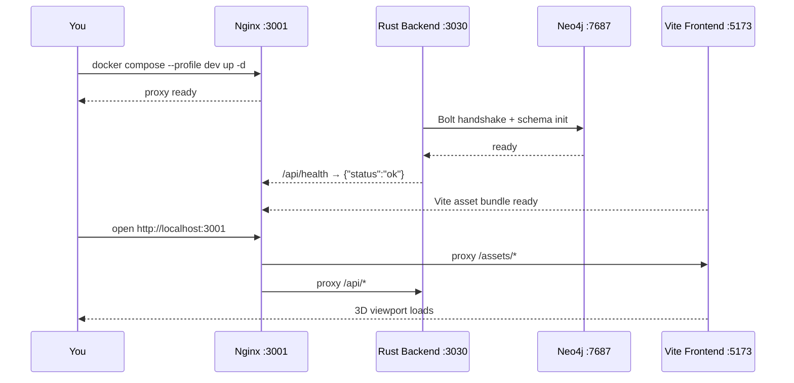

# Build Your First VisionClaw Graph

This tutorial takes you from a fresh installation to a live 3D knowledge graph with AI agents running.

## Choose Your Path

**Quick path (15 min)** — Commands first, explanations minimal. Jump to each section and follow the code blocks.

**Deep path (45 min)** — Read the explanations in each section to understand what is happening under the hood before you move on.

Both paths cover the same steps. The deep path annotations are marked with a **Deep path** callout.

---

## 1. Prerequisites

| Requirement | Minimum | Recommended |
|-------------|---------|-------------|
| Docker + Compose | v20.10+ | v24+ |
| RAM | 8 GB | 16 GB |
| Browser | Chrome 90+, Firefox 88+, Safari 14+ | Chrome latest with WebGL 2 |
| GPU (optional) | — | NVIDIA with CUDA 11.8+ |

Ports that must be free:

| Port | Service |
|------|---------|
| 3001 | Nginx proxy (main entry point) |
| 3030 | Rust backend API |
| 7474 | Neo4j Browser |
| 7687 | Neo4j Bolt |

Complete the [Installation Guide](installation.md) before continuing. Confirm readiness:

```bash
docker compose ps
# All services should show "Up"
```

---

## 2. Start the Stack

```bash
cd VisionClaw
docker compose --profile dev up -d
```

Wait ~30 seconds for Neo4j and the Rust backend to initialise, then verify:

```bash
curl http://localhost:3030/api/health
# Expected: {"status":"ok"}
```

**Troubleshooting:**

```bash
# View all service logs
docker compose logs -f

# Check a specific service
docker compose logs -f visionclaw-container
```



> **Deep path** — The Nginx proxy at port 3001 routes `/api/*` to the Rust Actix-Web backend and all other paths to the Vite dev server on port 5173. The Rust backend uses a hexagonal architecture: HTTP handlers call domain services, which speak to Neo4j over the Bolt driver. GPU physics runs as a CUDA actor that streams position updates back to all WebSocket clients at up to 60 FPS.

---

## 3. Access VisionClaw

Open **http://localhost:3001** in your browser.

You should see:

- A dark 3D viewport in the centre of the screen.
- A left sidebar with graph controls and the multi-agent panel.
- A right sidebar with visual and physics settings.
- A green **Connected** indicator in the bottom status bar.

**If the viewport is blank after 60 seconds:**

```bash
# Check browser console for WebGL errors first, then:
docker compose logs -f visionclaw-container | grep -i error
```

---

## 4. Connect a Data Source

Choose one option to populate your graph.

### Option A: Connect a GitHub repository (recommended)

VisionClaw can parse a Logseq or plain-markdown repository and build a graph from `[[wikilinks]]`.

1. Click **"Connect to GitHub"** in the left control panel.
2. Authorise VisionClaw to read your repository.
3. Select the repository and the folder containing your markdown files.
4. VisionClaw parses links, creates nodes for each page tagged `public:: true`, and builds edges from wikilinks.

> **Deep path** — Only files with the `public:: true` property become graph nodes. Files without that tag are still scanned for ontology blocks (`### OntologyBlock` sections), which become `owl_*` nodes. Wikilink targets that do not have a corresponding file become `linked_page` nodes. The sync flow is: `GitHubSyncService::sync_graphs()` → `KnowledgeGraphParser::parse()` → Neo4j. Set `FORCE_FULL_SYNC=1` in `.env` to reprocess all files, bypassing SHA1 incremental filtering.

### Option B: Import a JSON graph

If you have graph data in JSON format:

1. Click **"Import Graph"** in the left control panel.
2. Select your JSON file.

Expected format:

```json
{
  "nodes": [
    { "id": "1", "label": "Machine Learning", "type": "knowledge" },
    { "id": "2", "label": "Neural Networks",  "type": "knowledge" }
  ],
  "edges": [
    { "source": "1", "target": "2", "type": "USES" }
  ]
}
```

### Option C: Build manually

1. Click **"New Graph"**, then **"Add Node"** and enter a label (e.g. `Machine Learning`).
2. Add more nodes: `Neural Networks`, `Training Data`, `Backpropagation`, `Loss Function`.
3. Select two nodes (click one, Shift-click the other) and click **"Add Edge"**. Choose a relationship type such as `USES`.

Example relationships to add:

| Source | Relationship | Target |
|--------|-------------|--------|
| Neural Networks | REQUIRES | Training Data |
| Neural Networks | APPLIES | Backpropagation |
| Backpropagation | MINIMISES | Loss Function |
| Machine Learning | EVALUATES | Loss Function |

Verify the data reached Neo4j at **http://localhost:7474**:

```cypher
MATCH (n) RETURN n LIMIT 25
```

---

## 5. Explore the Graph

Once nodes appear in the viewport, use these controls:

**Mouse:**

| Action | Effect |
|--------|--------|
| Left-click + drag | Rotate camera |
| Right-click + drag | Pan camera |
| Scroll wheel | Zoom in / out |
| Double-click a node | Centre camera on that node |
| Hover over a node | Show metadata tooltip |
| Click a node | Select and highlight connections |

**Keyboard:**

| Key | Effect |
|-----|--------|
| `Space` | Pause / resume physics |
| `R` | Reset camera |
| `F` | Toggle fullscreen |
| `G` | Toggle grid |
| `H` | Show help overlay |
| `Ctrl+K` | Open command palette |

**Filtering:** Use the **Edge Filter** controls in the left sidebar to show or hide specific relationship types (e.g. show only `USES` edges).

> **Deep path** — Node types are encoded in flag bits of the 32-bit node ID. Bit 31 = agent node (green), bit 30 = knowledge node (blue gems), bits 26-28 = ontology subtype. The Gem geometry (knowledge) is an Icosahedron of radius 0.5, CrystalOrb (ontology) is a Sphere of radius 0.5, AgentCapsule is a Capsule of radius 0.3 height 0.6. The camera is a Three.js `PerspectiveCamera` orbiting via `OrbitControls`.

---

## 6. Enable Physics

The GPU physics engine uses CUDA spring-repulsion simulation to arrange nodes spatially.

1. Open the **Physics** panel in the right sidebar.
2. Click **"Start Simulation"** (or press `Space` if already paused).

Key parameters:

| Parameter | Effect | Range |
|-----------|--------|-------|
| Spring Strength | Attraction between connected nodes | 0.0 – 1.0 |
| Repulsion Force | Push between all unconnected nodes | 0 – 1000 |
| Damping | Reduces oscillation | 0.0 – 1.0 |
| Central Force | Pulls all nodes towards graph centre | 0.0 – 1.0 |
| Gravity | Downward bias | -1.0 – 1.0 |

**Typical starting values:** Spring 0.3, Repulsion 150, Damping 0.85, Central 0.1.

> **Deep path** — The CUDA force compute actor streams `UpdateNodePositions` messages to a broadcast optimizer. When the graph converges (all velocities below threshold), a periodic full-broadcast fires every 300 iterations so late-connecting clients still receive positions. If you change physics parameters after convergence, `reheat_factor` is applied for ~10 frames to propagate the new energy through dense subgraphs before damping settles again.

**No NVIDIA GPU?** The simulation falls back to CPU. Performance is lower but functional for graphs under ~500 nodes.

---

## 7. Enable Agents

VisionClaw's multi-agent system overlays agent nodes on top of your knowledge graph.

### Verify the MCP bridge

```bash
docker compose logs multi-agent-container | grep MCP
# Expected: "MCP Bridge listening on port 3002"
```

### Launch an agent task

1. In the left sidebar, find the **"VisionClaw (MCP)"** section. Confirm the green **Connected** status.
2. Click **"Initialize multi-agent"**.
3. Fill in a task description. Beginner-friendly example:

```
Analyse the loaded knowledge graph and identify the three most central concepts.
Produce a short summary of each with suggested related topics.
```

4. Choose topology **Mesh** and strategy **Consensus** for your first run.
5. Set agent count to 3–5 (1 Coordinator, 1 Researcher, 1 Coder is a good starting set).
6. Click **"Launch Multi-Agent System"**.

### Read the results

Agent nodes (green capsules) appear in the viewport alongside your knowledge nodes.

| Node colour | Status |
|-------------|--------|
| Green | Active / processing |
| Yellow | Waiting for input |
| Blue | Idle / ready |
| Red | Error or blocked |
| Grey | Completed |

When agents finish:

1. A success notification appears top-right.
2. The **Results** panel opens automatically with output files, a summary, and quality metrics.
3. Click **"Download Results"** to save all output.

**Monitor in real time:**

- Click any agent node to view its execution log and message history.
- Press `Ctrl+K` and type `agent status` for a global overview.

> **Deep path** — Agent nodes are written to Neo4j alongside knowledge nodes. The binary WebSocket protocol uses 34-byte frames: 4-byte node ID (with flag bits), 3 × 4-byte float position, 4-byte velocity magnitude, 4-byte metadata. Agent status colours map to flag bits in the upper nibble of the node ID. The MCP bridge at port 3002 translates between the Claude agent protocol and VisionClaw's internal message bus.

---

## 8. Next Steps

| Guide | What you will learn |
|-------|---------------------|
| [Deployment Guide](../how-to/deployment-guide.md) | Run VisionClaw in production with TLS and persistent volumes |
| [Development Guide](../how-to/development/development-workflow.md) | Contribute to the codebase; frontend, Rust backend, CUDA kernel |
| [Agent Orchestration](../how-to/agent-orchestration.md) | Advanced agent topologies, Byzantine fault tolerance, hive-mind consensus |
| [Neo4j Schema](../reference/neo4j-schema-unified.md) | Full node and relationship schema, Cypher query patterns |

---

**Document Version**: 2.0
**Last Updated**: 2026-04-09
**Supersedes**: `creating-first-graph.md` (v1, 2025-12-18), `first-graph.md` (v1, 2026-02-12)
