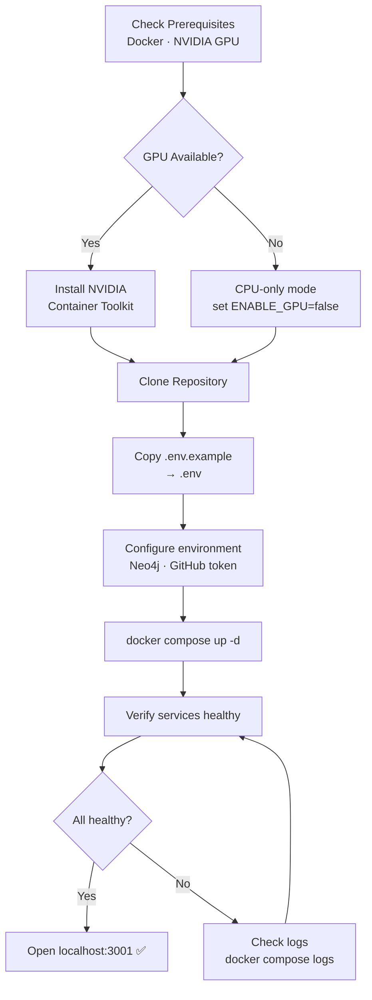
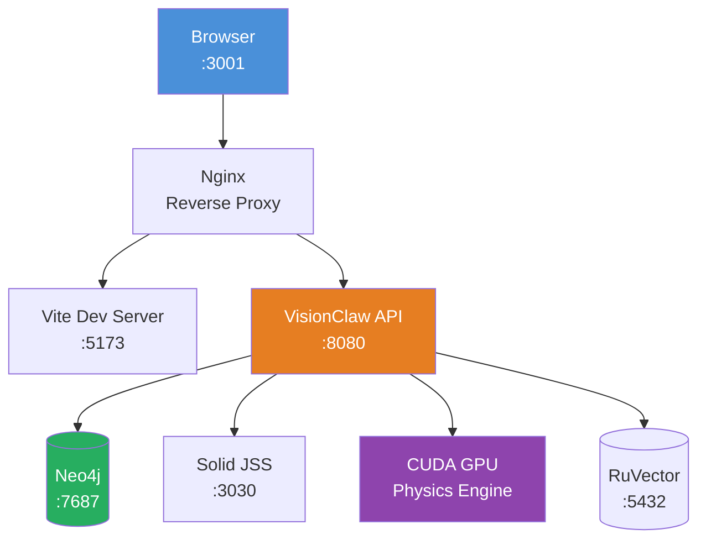

# Installation Guide

**

This comprehensive guide covers everything you need to install and configure VisionClaw, from basic setup to advanced GPU-accelerated deployments.

## Prerequisites

### System Requirements

#### Minimum Requirements
- **Operating System**: Linux (Ubuntu 20.04+), macOS (12.0+), or Windows 10/11
- **CPU**: 4-core processor, 2.5GHz
- **Memory**: 8GB RAM
- **Storage**: 10GB free disk space
- **Network**: Broadband internet connection
- **Browser**: Chrome 90+, Firefox 88+, Safari 14+, or Edge 90+

#### Recommended Requirements
- **CPU**: 8-core processor, 3.0GHz or higher
- **Memory**: 16GB RAM
- **Storage**: 50GB SSD storage
- **GPU**: NVIDIA GTX 1060 or AMD RX 580 (for GPU acceleration)
- **Network**: 100Mbps+ connection

#### Enterprise Requirements
- **CPU**: 16+ cores, 3.5GHz
- **Memory**: 32GB+ RAM
- **Storage**: 200GB+ NVMe SSD
- **GPU**: NVIDIA RTX 4080 or better with 16GB+ VRAM
- **Network**: Gigabit connection

### Required Software

#### Docker and Docker Compose
VisionClaw requires Docker for containerised deployment:

**Linux (Ubuntu/Debian):**
```bash
# Update package index
sudo apt update

# Install Docker
curl -fsSL https://get.docker.com -o get-docker.sh
sudo sh get-docker.sh

# Add your user to docker group
sudo usermod -aG docker $USER

# Install Docker Compose
sudo curl -L "https://github.com/docker/compose/releases/latest/download/docker-compose-$(uname -s)-$(uname -m)" -o /usr/local/bin/docker-compose
sudo chmod +x /usr/local/bin/docker-compose

# Verify installation
docker --version
docker-compose --version
```

**macOS:**
```bash
# Install Docker Desktop for Mac
# Download from: https://docs.docker.com/desktop/mac/install/
# Or use Homebrew:
brew install --cask docker

# Start Docker Desktop from Applications
```

**Windows:**
```powershell
# Install Docker Desktop for Windows
# Download from: https://docs.docker.com/desktop/windows/install/
# Ensure WSL2 is enabled and configured

# Verify installation in PowerShell
docker --version
docker-compose --version
```

#### NVIDIA GPU Support (Optional)

For GPU acceleration, install NVIDIA Container Toolkit:

**Linux:**
```bash
# Add NVIDIA package repositories
distribution=$(. /etc/os-release;echo $ID$VERSION-ID)
curl -s -L https://nvidia.github.io/nvidia-docker/gpgkey | sudo apt-key add -
curl -s -L https://nvidia.github.io/nvidia-docker/$distribution/nvidia-docker.list | sudo tee /etc/apt/sources.list.d/nvidia-docker.list

# Install NVIDIA Container Toolkit
sudo apt update
sudo apt install -y nvidia-container-toolkit

# Restart Docker
sudo systemctl restart docker

# Test GPU access
docker run --rm --gpus all nvidia/cuda:11.8-base-ubuntu20.04 nvidia-smi
```

**Windows (WSL2):**
```powershell
# Install NVIDIA Container Toolkit in WSL2
wsl --install -d Ubuntu-20.04

# Follow Linux instructions inside WSL2
```

#### Git (For Development)
```bash
# Linux
sudo apt install git

# macOS
brew install git

# Windows (use Git for Windows or WSL2)
# Download from: https://git-scm.com/download/win
```



*Figure: Installation flow — follow this sequence to get VisionClaw running from scratch*

## Installation Steps

### Method 1: Quick Installation (Recommended)

This is the fastest way to get VisionClaw running:

```bash
# 1. Clone the repository
git clone https://github.com/visionclaw/visionclaw.git
cd visionclaw

# 2. Start with default configuration
docker-compose up -d

# 3. Wait for services to start (2-3 minutes)
docker-compose logs -f

# 4. Open VisionClaw in your browser
open http://localhost:3030
```

### Method 2: Custom Configuration

For production or customised deployments:

#### Step 1: Clone and Configure
```bash
# Clone the repository
git clone https://github.com/visionclaw/visionclaw.git
cd visionclaw

# Copy environment template
cp .env.example .env
```

#### Step 2: Edit Configuration
Edit `.env` file with your preferred settings:

```bash
# Core Configuration
CLAUDE-FLOW-HOST=multi-agent-container
MCP-TCP-PORT=9500
MCP-TRANSPORT=tcp

# Performance Settings
ENABLE-GPU=true                    # Enable GPU acceleration
MAX-AGENTS=20                     # Maximum concurrent agents
MEMORY-LIMIT=16g                  # Container memory limit
CPU-LIMIT=8                       # CPU core limit

# API Keys (Optional)
OPENAI-API-KEY=your-openai-key
PERPLEXITY-API-KEY=your-perplexity-key
GITHUB-TOKEN=your-github-token

# Features
ENABLE-XR=false                   # Meta Quest integration
ENABLE-VOICE=false               # Voice interaction
DEBUG-MODE=false                 # Debug logging

# Security
JWT-SECRET=your-random-secret
CORS-ORIGINS=http://localhost:3030

# Database
POSTGRES-USER=visionclaw
POSTGRES-PASSWORD=secure-password
POSTGRES-DB=visionclaw

# Networking
HOST-PORT=3001                   # External access port
INTERNAL-API-PORT=4000          # Internal API port
WEBSOCKET-PORT=4001             # WebSocket port
```

#### Step 3: Choose Deployment Profile
```bash
# Standard deployment
docker-compose up -d

# GPU-accelerated deployment
docker-compose -f docker-compose.yml -f docker-compose.gpu.yml up -d

# Development mode (with hot reload)
docker-compose -f docker-compose.dev.yml up -d

# Production mode (optimised)
docker-compose -f docker-compose.production.yml up -d
```

#### Step 4: Verify Installation
```bash
# Check all services are running
docker-compose ps

# Expected output:
# NAME                    COMMAND                  SERVICE             STATUS
# visionclaw-container    "/app/scripts/start.sh"  webxr              Up
# multi-agent-container   "python3 -m claude..."   claude-flow        Up
# postgres-container      "docker-entrypoint.s..."  postgres           Up
# redis-container         "redis-server --appen..."  redis              Up

# Check logs for any errors
docker-compose logs --tail=50

# Test API endpoint
curl http://localhost:3030/api/health

# Expected response:
# {"status":"healthy","version":"0.1.0","timestamp":"2024-01-01T12:00:00Z"}
```



*Figure: Service topology — Docker services and their internal connections after a successful deployment*

## Advanced Installation

### GPU-Accelerated Setup

For maximum performance with NVIDIA GPUs:

#### Step 1: Verify GPU Support
```bash
# Check NVIDIA driver
nvidia-smi

# Test Docker GPU access
docker run --rm --gpus all nvidia/cuda:11.8-base-ubuntu20.04 nvidia-smi

# Check CUDA version compatibility
docker run --rm --gpus all nvidia/cuda:11.8-devel-ubuntu20.04 nvcc --version
```

#### Step 2: Configure GPU Settings
Edit `.env` for GPU optimisation:

```bash
# GPU Configuration
NVIDIA-VISIBLE-DEVICES=0          # Use first GPU
NVIDIA-DRIVER-CAPABILITIES=compute,utility
CUDA-ARCH=86                      # RTX 30xx series
ENABLE-GPU-PHYSICS=true           # GPU physics simulation
GPU-MEMORY-LIMIT=8g              # GPU memory limit

# Performance Tuning
PHYSICS-THREADS=8                # Physics computation threads
RENDER-THREADS=4                 # Rendering threads
BATCH-SIZE=1000                  # Physics batch size
```

#### Step 3: Start GPU-Enabled Services
```bash
# Use GPU-specific compose file
docker-compose -f docker-compose.yml -f docker-compose.gpu.yml up -d

# Verify GPU usage
docker exec visionclaw-container nvidia-smi
```

### Multi-Node Deployment

For large-scale deployments across multiple servers:

#### Step 1: Configure Network
```bash
# Create external network
docker network create visionclaw-cluster

# Configure each node in docker-compose.yml
networks:
  visionclaw-cluster:
    external: true
```

#### Step 2: Distributed Services
```yaml
# docker-compose.cluster.yml
version: '3.8'
services:
  visionclaw-node1:
    image: visionclaw:latest
    deploy:
      placement:
        constraints: [node.labels.role == primary]

  visionclaw-node2:
    image: visionclaw:latest
    deploy:
      placement:
        constraints: [node.labels.role == worker]
```

#### Step 3: Deploy Cluster
```bash
# Initialize Docker Swarm
docker swarm init

# Deploy stack
docker stack deploy -c docker-compose.cluster.yml visionclaw-cluster
```

### Development Installation

For contributors and developers:

#### Step 1: Install Development Dependencies
```bash
# Rust toolchain
curl --proto '=https' --tlsv1.2 -sSf https://sh.rustup.rs | sh
source ~/.cargo/env

# Node.js and npm
curl -fsSL https://deb.nodesource.com/setup-18.x | sudo -E bash -
sudo apt-get install -y nodejs

# Verify installations
rustc --version
node --version
npm --version
```

#### Step 2: Build from Source
```bash
# Clone repository
git clone https://github.com/visionclaw/visionclaw.git
cd visionclaw

# Install backend dependencies
cargo build --release

# Install frontend dependencies
cd client
npm install
npm run build
cd ..

# Start development services
docker-compose -f docker-compose.dev.yml up
```

#### Step 3: Development Workflow
```bash
# Backend development (Rust)
cargo watch -x run                # Auto-reload on changes

# Frontend development (React)
cd client
npm run dev                       # Development server with HMR

# Run tests
cargo test                        # Backend tests
cd client && npm test            # Frontend tests
```

## Performance Tuning

### Memory Optimisation
```bash
# Increase Docker memory limits
# Edit Docker Desktop settings or daemon.json:
{
  "memory": "16g",
  "cpus": "8"
}

# Configure container limits in .env
MEMORY-LIMIT=16g
SWAP-LIMIT=4g
```

### CPU Optimisation
```bash
# Set CPU affinity for containers
docker-compose exec visionclaw-container taskset -cp 0-7 1

# Configure CPU limits
CPU-LIMIT=8.0
CPU-RESERVATION=4.0
```

### Storage Optimisation
```bash
# Use SSD storage for Docker volumes
# Create volume on SSD mount
docker volume create --driver local \
  --opt type=none \
  --opt o=bind \
  --opt device=/mnt/ssd/visionclaw \
  visionclaw-data

# Configure in docker-compose.yml
volumes:
  - visionclaw-data:/app/data
```

### Network Optimisation
```bash
# Increase network buffer sizes
echo 'net.core.rmem-max = 134217728' >> /etc/sysctl.conf
echo 'net.core.wmem-max = 134217728' >> /etc/sysctl.conf
sysctl -p

# Configure Docker network
docker network create \
  --driver bridge \
  --opt com.docker.network.driver.mtu=9000 \
  visionclaw-network
```

## Troubleshooting

### Common Installation Issues

#### Docker Permission Denied
```bash
# Error: permission denied while trying to connect to Docker daemon
# Solution: Add user to docker group
sudo usermod -aG docker $USER
newgrp docker

# Or run with sudo (not recommended for production)
sudo docker-compose up
```

#### Port Already in Use
```bash
# Error: port is already allocated
# Check what's using the port
sudo lsof -i :3030

# Kill the process or change port in .env
HOST-PORT=3002
```

#### Out of Disk Space
```bash
# Clean up Docker resources
docker system prune -a

# Remove unused volumes
docker volume prune

# Check disk usage
docker system df
```

#### GPU Not Detected
```bash
# Check NVIDIA driver installation
nvidia-smi

# Reinstall NVIDIA Container Toolkit
sudo apt remove nvidia-docker2 nvidia-container-toolkit
sudo apt install nvidia-container-toolkit
sudo systemctl restart docker

# Test GPU access
docker run --rm --gpus all nvidia/cuda:11.8-base-ubuntu20.04 nvidia-smi
```

### Service-Specific Issues

#### VisionClaw Backend Won't Start
```bash
# Check logs for specific errors
docker-compose logs visionclaw-container

# Common fixes:
# 1. Port conflict - change HOST-PORT in .env
# 2. Memory insufficient - increase MEMORY-LIMIT
# 3. CUDA error - disable GPU with ENABLE-GPU=false
```

#### Database Connection Failed
```bash
# Check PostgreSQL status
docker-compose logs postgres-container

# Reset database
docker-compose down -v  # WARNING: This deletes all data
docker-compose up -d
```

#### WebSocket Connection Failed
```bash
# Check firewall settings
sudo ufw allow 3001
sudo ufw allow 4001

# Test WebSocket endpoint
wscat -c ws://localhost:3030/ws
```

### Performance Issues

#### High Memory Usage
```bash
# Monitor memory usage
docker stats

# Reduce memory usage:
# 1. Decrease MAX-AGENTS in .env
# 2. Increase MEMORY-LIMIT for containers
# 3. Enable swap if available
```

#### Slow 3D Rendering
```bash
# Enable GPU acceleration
ENABLE-GPU=true
ENABLE-GPU-PHYSICS=true

# Reduce visual quality
RENDER-QUALITY=medium
PHYSICS-QUALITY=medium

# Check GPU utilization
nvidia-smi -l 1
```

#### Network Latency
```bash
# Test network latency
ping localhost

# Optimise network settings
NET-CORE-RMEM-MAX=134217728
NET-CORE-WMEM-MAX=134217728

# Use local network instead of localhost
VISIONCLAW-HOST=127.0.0.1
```

## Verification Checklist

After installation, verify these components:

### Basic Functionality
- [ ] VisionClaw web interface loads at `http://localhost:3030`
- [ ] API health check returns successful response
- [ ] WebSocket connection establishes successfully
- [ ] Sample graph data loads and displays

### Advanced Features
- [ ] GPU acceleration works (if enabled)
- [ ] Multi-agent system can be initialized
- [ ] Real-time graph updates function correctly
- [ ] 3D navigation responds smoothly

### Performance Benchmarks
- [ ] Graph with 1000 nodes renders at >30fps
- [ ] WebSocket updates process <100ms latency
- [ ] Memory usage stays under configured limits
- [ ] CPU usage remains manageable under load

### Integration Tests
- [ ] REST API endpoints respond correctly
- [ ] Claude Flow MCP connection established
- [ ] File system access works for data persistence
- [ ] Browser compatibility verified

## Next Steps

Now that VisionClaw is installed, proceed to:

1. **[Quick Start Guide](creating-first-graph.md)** - Create your first graph in 5 minutes
2. **[Configuration Guide](../how-to/operations/configuration.md)** - Customise VisionClaw for your needs
3. **[API Documentation](../reference/)** - Integrate with your applications
4. **[Architecture Overview](../architecture/ARCHITECTURE.md)** - Understand the system design

## Getting Help

If you encounter issues during installation:

- **[Troubleshooting Guide](../how-to/operations/troubleshooting.md)** - Common problems and solutions
- **[GitHub Issues](https://github.com/visionclaw/visionclaw/issues)** - Report bugs or request help
- **[Discord Community](https://discord.gg/visionclaw)** - Get real-time support
- **** - Comprehensive documentation

---

**Installation complete!** VisionClaw is now ready to visualise your knowledge graphs and AI agent interactions.

## Related Topics

- [Configuration Guide](../how-to/operations/configuration.md)
- [Architecture Overview](../architecture/ARCHITECTURE.md)
- [Quick Start Guide](creating-first-graph.md)

---

**Navigation:** [Getting Started](./) | [Guides](../how-to/) | [Architecture](../explanation/)