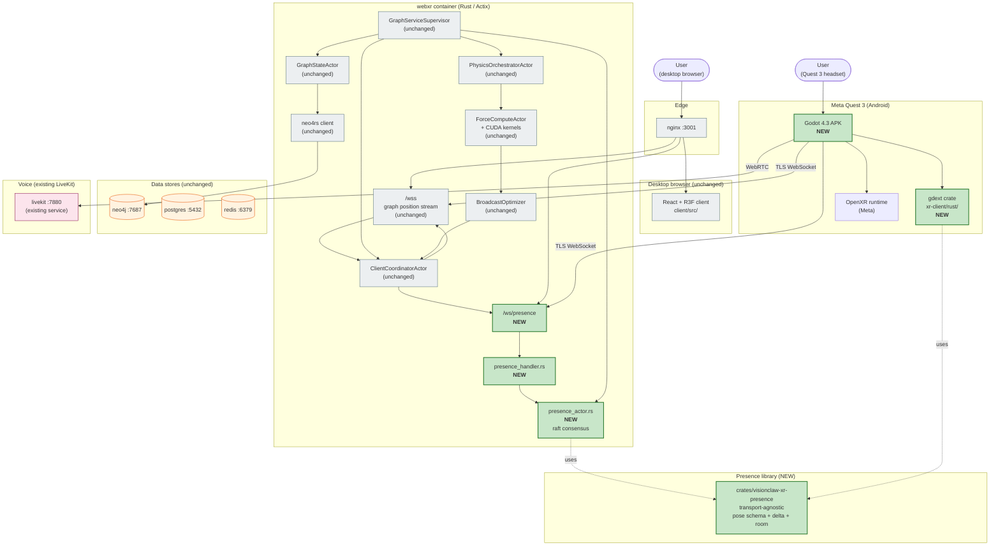
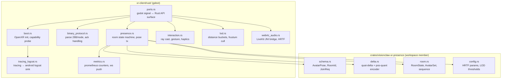
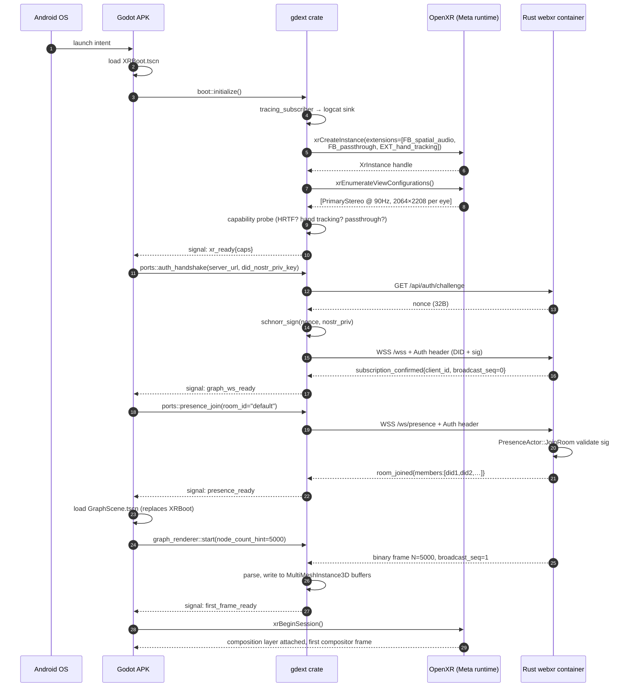
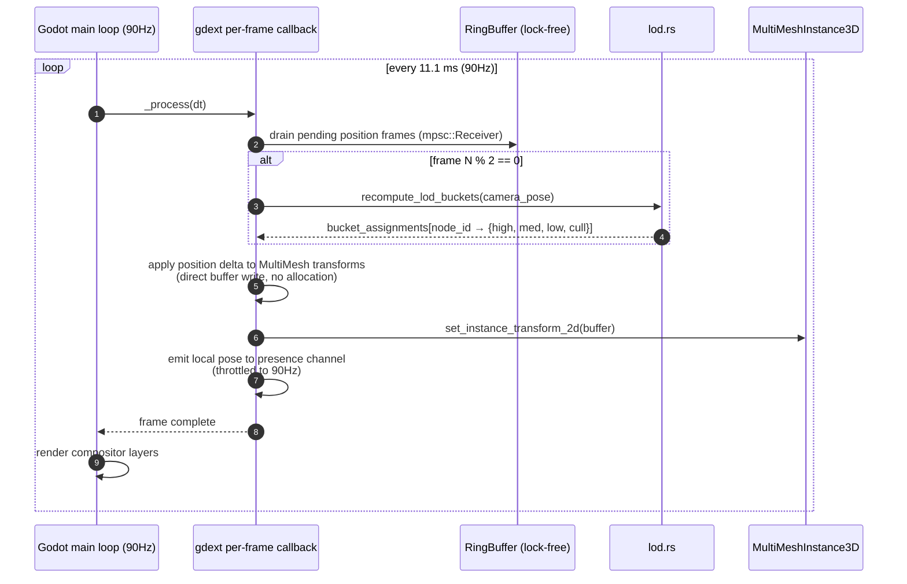
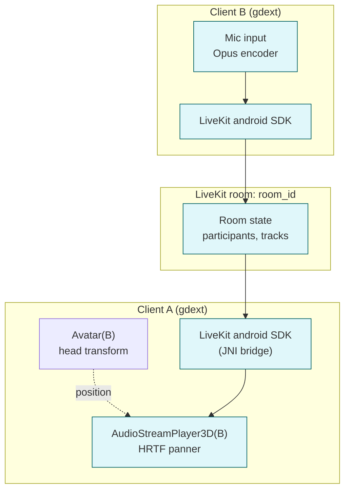
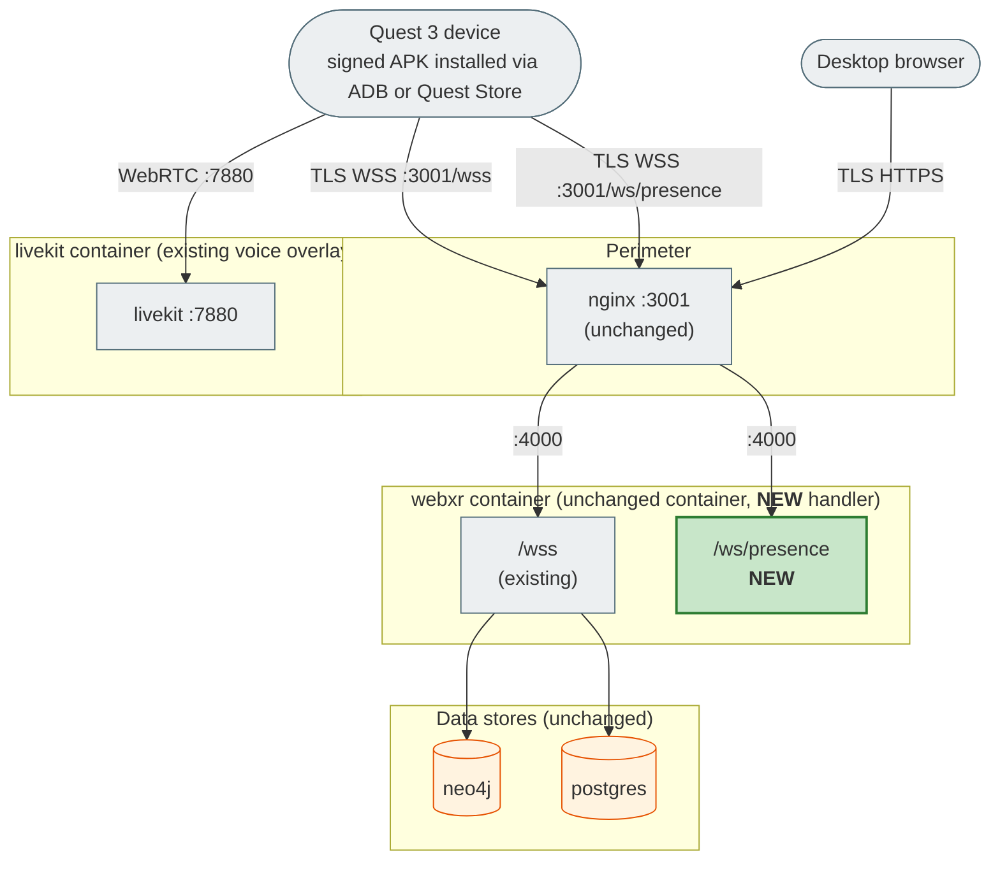
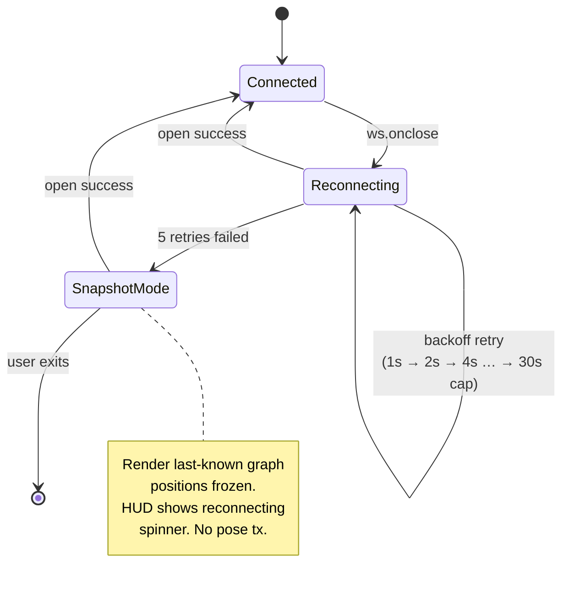
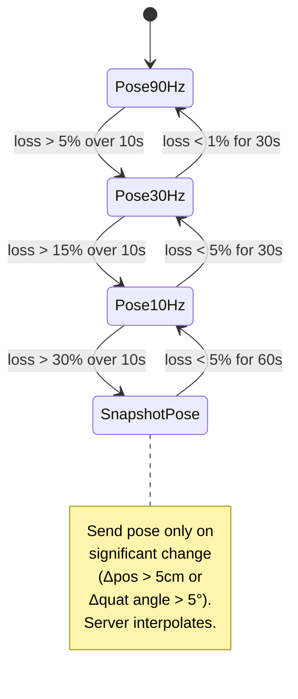

# XR Godot System Architecture

> **Scope.** This document is the authoritative system architecture for VisionClaw's
> next-generation XR client: a Godot 4.3 native APK for Meta Quest 3, integrated with
> the existing Rust substrate via the binary WebSocket protocol and a new presence
> service. It conceptually replaces [`docs/explanation/xr-architecture.md`](explanation/xr-architecture.md)
> (Babylon.js + WebXR + Vircadia). Phase 2 (separate workstream) rewrites that file.

The decision to migrate from a browser-based Babylon.js + Vircadia stack to a native
Godot APK is recorded in [ADR-071](adr/ADR-071-xr-godot-replacement.md). The rationale
is twofold: (1) WebXR on Quest is constrained by the Meta browser's compositor budget
and lacks reliable access to OpenXR extensions like `XR_FB_spatial_audio`,
`XR_FB_passthrough`, and reprojection hints; (2) the Vircadia world server's
PostgreSQL-backed entity model duplicates state already canonical in Neo4j and the
GPU physics actor mesh, producing two sources of truth for node position. A native
APK that consumes the existing 24-byte binary protocol unchanged collapses both
problems: rendering uses platform-native OpenXR with full extension access, and
presence is a thin overlay that does not replicate graph state.

The Rust substrate (Actix-web, GraphServiceSupervisor, BroadcastOptimizer, CUDA
physics, Neo4j) is **unchanged**. The only server-side additions are one new actor
(`presence_actor.rs`) and one new handler (`presence_handler.rs`), wired into the
existing supervisor tree and exposed on the existing `webxr` container's WebSocket
port. The new Quest 3 client is a separate APK build artefact; it does not affect
the existing Vite + R3F desktop client.

---

## 1. Top-level system view

The C4 system context shows the user's Quest 3 device, the new Godot APK + gdext
crate, the existing Rust substrate (highlighted as **unchanged**), and the **new**
components (highlighted in green). The desktop browser path is shown for contrast
but is unaffected by this work.



The five highlighted components are the entire surface area of this work on the
server side. Everything else — Neo4j, the GPU physics pipeline, the broadcast
optimiser, the desktop client — is consumed unchanged.

---

## 2. Component view

### 2.1 Godot scenes (APK side)

Godot organises the in-headset experience as a tree of scenes. Each scene root is
a Godot node with an attached gdext module that provides the heavy lifting. Scene
GDScript is intentionally thin — it dispatches signals, swaps subscenes, and binds
UI controls. All graph rendering, networking, and pose math run in Rust through
gdext bindings.

| Scene | Root node | Attached gdext module | Responsibility |
|---|---|---|---|
| `XRBoot` | `Node3D` | `boot.rs` | OpenXR instance creation, capability probe, error overlay |
| `GraphScene` | `Node3D` | `graph_renderer.rs` | Instanced node + edge rendering (MultiMeshInstance3D), LOD |
| `HUD` | `Control` | `hud.rs` | In-headset settings, room picker, debug overlay, mute toggle |
| `Avatar` | `Node3D` | `avatar.rs` | Head + hands mesh, name label, voice indicator (one per remote user) |
| `LocalRig` | `XROrigin3D` + `XRCamera3D` + `XRController3D` × 2 | `interaction.rs` | Local pose, ray cast, controller input, haptics |

### 2.2 gdext modules (`xr-client/rust/`)

The Rust crate is the only place that owns network sockets, the binary protocol
codec, the presence room state machine, and LOD math. Godot calls into it via
typed signals and getter methods.



The shared `crates/visionclaw-xr-presence` library is intentionally
**transport-agnostic**: it knows nothing about WebSocket framing, Actix actors,
godot-rust, or LiveKit. It is consumed by both the gdext crate (on the APK) and
`presence_actor.rs` (on the server). This guarantees that wire-level pose semantics
cannot drift between client and server, because both link the same encoder.

### 2.3 Rust server modules

| File | Type | Role |
|---|---|---|
| `src/handlers/presence_handler.rs` | Actix WebSocket handler | TLS WS upgrade at `/ws/presence`; DID auth handshake; framed dispatch into `PresenceActor` |
| `src/actors/presence_actor.rs` | Actix actor | Per-room broadcast actor; raft consensus across replicas; pose validation; voice room mapping |
| `src/actors/messages/presence_messages.rs` | Message types | `JoinRoom`, `LeaveRoom`, `BroadcastPose`, `AvatarJoinedRoom`, `AvatarLeftRoom`, `MutePropagation` |
| `crates/visionclaw-xr-presence/` | Workspace member | Shared with gdext: pose schema, delta codec, room model, config schema |
| `src/utils/binary_protocol.rs` | Codec | **Extended** with `encode_avatar_pose_frame()` + opcode dispatch on the existing WS endpoint |

`PresenceActor` joins the existing `GraphServiceSupervisor` tree as a sibling of
`GraphStateActor` and `PhysicsOrchestratorActor`. It uses raft consensus
(`f < n/2`) to align with the project-wide `hierarchical-mesh` topology declared
in [`CLAUDE.md`](../CLAUDE.md). Per-room state is partitioned across replicas
using consistent hashing on `RoomId`; cross-room broadcast is unnecessary
because no message ever spans rooms.

---

## 3. Boot sequence

The APK boot is intentionally chatty during the first 200 ms because we want
fail-fast behaviour: a missing OpenXR capability or a rejected DID handshake
should produce a visible error overlay before the user puts the headset on,
not silent black-screen on first frame.



The graph WebSocket is connected before the presence WebSocket because graph
state is the load-bearing context: an empty graph at first compositor frame is
a far worse user experience than a missing avatar list. Presence is allowed to
fail without aborting boot; the user simply enters a single-user session and
sees a yellow indicator in the HUD.

---

## 4. Frame loop

The Quest 3 target is 90 Hz steady state with reprojection allowed up to 45 Hz
under thermal throttling. The render loop is split between Godot's render thread
and the gdext crate's per-frame Rust callback.



LOD thresholds are ported verbatim from `useVRConnectionsLOD` in the deprecated
Babylon stack (high <5m / med 5-15m / low 15-30m / cull >30m), but the
recomputation cadence is **every 2 frames** rather than every frame to keep CPU
budget under 8 ms. The bucket assignments are diffed against the previous
frame's; only changed instances incur a transform write.

The presence transmit is throttled inside `presence.rs` to one frame per render
tick (90 Hz). If the local user is stationary (head pose delta < 1 cm and quat
dot product > 0.9999), the frame is dropped server-side by the delta encoder
and not rebroadcast — bandwidth stays near zero for AFK users.

---

## 5. Multi-user join sequence

When user B joins a room that user A already occupies, the presence protocol
guarantees three things: A is notified before any of B's pose frames arrive;
B's avatar mesh is positioned at the spawn anchor (not 0,0,0); and B's voice
track is announced via LiveKit before A receives it, so HRTF positioning is
ready on the first audio packet.

```mermaid
sequenceDiagram
    autonumber
    actor UserA as User A (already in room)
    participant ClientA as A's gdext crate
    participant Server as PresenceActor (raft leader)
    participant LK as LiveKit room
    participant ClientB as B's gdext crate
    actor UserB as User B (joining)

    UserB->>ClientB: equip headset, select room
    ClientB->>Server: WSS /ws/presence<br/>JoinRoom{room_id, did:nostr:<B>, sig}
    Server->>Server: schnorr_verify(sig) using DID pubkey
    alt invalid signature
        Server-->>ClientB: 4001 unauthorized; close
    else valid
        Server->>Server: room.add_member(B)
        Server->>LK: createParticipantToken(room_id, B's did)
        LK-->>Server: jwt_token
        Server-->>ClientB: room_joined{members:[A, B], spawn_anchor, livekit_token}
        Server-->>ClientA: AvatarJoinedRoom{did:B, spawn_anchor}

        ClientA->>ClientA: avatar.rs::spawn(B, spawn_anchor)
        ClientB->>LK: connect(jwt_token)
        LK-->>ClientA: trackPublished{participant:B, kind:audio}
        ClientA->>ClientA: webrtc_audio.rs::attach_panner(B)

        loop 90Hz
            ClientB->>Server: BroadcastPose{seq, pos, quat, hands}
            Server->>Server: validate_pose(B, frame)
            Server-->>ClientA: BroadcastPose{from:B, …}
            ClientA->>ClientA: avatar.rs::apply_pose(B, frame)
            ClientA->>ClientA: webrtc_audio.rs::update_panner_pos(B)
        end
    end
```

Validation in `validate_pose` rejects (a) sequence numbers that go backwards,
(b) position deltas that imply velocity > 20 m/s (teleport exploit), and
(c) hand joint angles outside human anatomical limits. Failures increment a
per-DID counter; three failures in 30 s closes the connection with code 4002.
This logic is shared with the desktop client's existing `XRSecurityValidator`
patterns (see [threat model](xr-godot-threat-model.md)).

---

## 6. Voice routing

Voice and pose are separate transports that converge at the avatar render. The
gdext crate is responsible for keeping them in sync — a remote user's PannerNode
position is updated in lockstep with their avatar transform, so audio appears
to originate from the visible head.



**HRTF strategy.** On Quest 3 the gdext crate first attempts `XR_FB_spatial_audio`
via OpenXR; this gives Meta's hardware-accelerated HRTF pipeline. If the extension
is unavailable (Quest 2, Vision Pro adapter, dev emulator), it falls back to
Godot's built-in `AudioStreamPlayer3D` with `attenuation_model = INVERSE_DISTANCE`
— functionally equivalent to the Web Audio `PannerNode` HRTF path used by the
deprecated Babylon stack.

**Mute propagation.** Local mute is a UI signal that flows: HUD `mute` toggle →
`webrtc_audio::set_mute(true)` → LiveKit SDK `localParticipant.setMicrophoneEnabled(false)`
→ LiveKit room broadcasts `participant_muted` → all remote clients update the
voice indicator on the avatar nameplate within ~100 ms.

**Bandwidth.** Opus at 32 kbps mono is the default; with LiveKit's redundancy
overhead the per-track wire cost is ~64 kbps. A 4-user room uses ~256 kbps voice
in addition to the pose channel, comfortably inside the 100 KB/s per-user
network budget.

---

## 7. Binary protocol extension

[ADR-061](adr/ADR-061-binary-protocol-unification.md) fixes the per-frame node
size at 28 bytes and forbids version negotiation. The avatar pose frame is added
**not as a version bump** but as an additional opcode dispatched on the same WS
endpoint. The graph position frame keeps its existing layout untouched; the
avatar pose frame is identified by a different preamble byte.

### 7.1 Wire opcode dispatch

```
First byte of every WS binary message:
  0x42 → graph position frame  (existing, unchanged — see docs/binary-protocol.md)
  0x43 → avatar pose frame     (NEW — this section)
  0x44 → presence control      (NEW — JoinRoom ACK, MutePropagation, AvatarLeft, …)
```

The dispatch table in `src/utils/binary_protocol.rs::decode_ws_message()` reads
the first byte and routes; the existing 0x42 path is bit-identical. There is
no version field on either frame type because, per ADR-061, version negotiation
is forbidden — protocol evolution requires a new endpoint.

### 7.2 Avatar pose frame layout

```
[u8  preamble = 0x43]
[u64 broadcast_sequence_LE]
[u32 avatar_count_LE]
[N × Avatar]

Avatar (52 bytes packed):
  [u32 avatar_id_LE]                  ← stable per-room id, server-assigned
  [f32 head_x_LE][f32 head_y_LE][f32 head_z_LE]      ← 12B head position
  [i16 head_qx_LE][i16 head_qy_LE][i16 head_qz_LE][i16 head_qw_LE]  ← 8B quantised quat (q × 32767)
  [i16 left_palm_x][i16 left_palm_y][i16 left_palm_z]   ← 6B fixed-point relative to head (cm × 100)
  [i16 left_palm_qx][i16 left_palm_qy][i16 left_palm_qz][i16 left_palm_qw]  ← 8B quat
  [i16 right_palm_x][i16 right_palm_y][i16 right_palm_z]
  [i16 right_palm_qx][i16 right_palm_qy][i16 right_palm_qz][i16 right_palm_qw]
```

Steady-state per-avatar wire cost: **52 bytes × 90 Hz ≈ 4.7 KB/s**. A 4-user
room broadcasts ≈ 56 KB/s of pose to each participant (3 remote avatars × 4.7
KB/s × 4 receivers, full-mesh fan-out from the server). Adding pose to the
existing per-client graph wire (~9-50 KB/s depending on visible node count)
keeps the total comfortably under the **100 KB/s per-user network budget**.

### 7.3 Server-side validation pipeline

`PresenceActor::handle::<BroadcastPose>` runs a four-stage validation before
fan-out:

1. **Sequence monotonicity.** Frame `seq` must equal `last_seq + 1` (modulo
   wrap). Reordered or replayed frames are dropped.
2. **Pose physical plausibility.** Δposition / Δt < 20 m/s; quat magnitude
   within `[0.99, 1.01]` after dequantisation; hand joints within anatomical
   limits (re-uses logic from the deprecated `XRSecurityValidator`).
3. **DID match.** The frame's implicit DID (taken from the WS connection's
   authenticated identity) must match the room membership; an authenticated
   user cannot impersonate another's avatar.
4. **Rate limit.** Max 100 Hz per DID per room (sliding window). Bursts above
   this drop to 30 Hz then 10 Hz then snapshot mode (see §11).

After validation, the frame is appended to the room's outgoing buffer and
flushed on the next 90 Hz tick of `PresenceActor`'s broadcast timer.

### 7.4 Cross-references

- `crates/visionclaw-xr-presence/src/schema.rs` — `AvatarPose` struct and
  `bytemuck::Pod` derivation matching the wire layout above.
- `crates/visionclaw-xr-presence/src/delta.rs` — quat-delta + position-quant
  encoder and decoder (linked into both client and server).
- `src/utils/binary_protocol.rs` — `encode_avatar_pose_frame()` and
  `decode_avatar_pose_frame()`; opcode dispatch table.
- [`docs/binary-protocol.md`](binary-protocol.md) — extended with §3 documenting
  the new opcode (separate PR in Phase 2).

---

## 8. Deployment topology

The new APK does not add server-side containers. Both the existing `/wss`
graph endpoint and the new `/ws/presence` endpoint are served by the same
`webxr` Actix process on the same port (9090) — they are multiplexed by URL
path inside the existing handler chain.



| Concern | Decision |
|---|---|
| New containers required? | **No.** `presence_handler` is an additional route in the existing `webxr` Actix process. |
| New ports exposed? | **No.** `/ws/presence` is multiplexed on port 9090 alongside `/wss`. |
| LiveKit | **Existing service.** The voice overlay (`docker-compose.voice.yml`) already provides livekit at :7880. No changes needed. |
| TLS | **Inherited from nginx.** APK connects via `wss://` through the same nginx :3001 chokepoint. |
| Quest 3 distribution (Phase 1) | **Developer mode side-load via ADB.** `adb install -r app.apk` on developer-enabled headsets. |
| Quest 3 distribution (Phase 2) | **Quest Store submission.** Requires Meta privacy review, content rating, and signed AAB upload. Tracked separately in PRD-008 §rollout. |
| APK build CI artefact | `xr-client/build/app-release.apk` produced by `gradlew :app:assembleRelease`; uploaded to GitHub Releases on tag push. |

---

## 9. Cross-cutting concerns

### 9.1 Observability

The gdext crate exposes a small set of Prometheus-compatible counters via
`metrics.rs`:

| Counter | Type | Notes |
|---|---|---|
| `xr_godot_frames_rendered_total` | Counter | Per-second rate gives effective FPS |
| `xr_godot_pose_frames_sent_total` | Counter | Outbound pose tx |
| `xr_godot_pose_frames_received_total` | Counter | Inbound pose rx (per remote DID label) |
| `xr_godot_ws_reconnect_total` | Counter | Each backoff retry |
| `xr_godot_lod_bucket_size` | Gauge | Per-bucket node count |
| `xr_godot_frame_time_ms` | Histogram | CPU time per `_process` call |
| `xr_godot_voice_packets_lost_total` | Counter | LiveKit-reported loss |

Counters are pushed over the existing `/wss` connection as a JSON message type
`xr_metrics_heartbeat` every 10 s. The server's existing
`metrics_handler.rs` receives and re-exposes them on the `/metrics` endpoint so
the existing Grafana scraper picks them up without configuration change.

### 9.2 Logging

The gdext crate uses the `tracing` crate. A custom subscriber
(`tracing_logcat.rs`) routes events to Android logcat with tag `visionclaw-xr`.
On debug builds, the in-headset HUD has a "Logs" pane that pages the last 256
events from a ring buffer. A long-press on the menu button toggles the pane.

CI artefact capture: `adb logcat -d -s visionclaw-xr` after each test run is
saved to `xr-client/build/logs/run-<timestamp>.log` and uploaded to the GitHub
Actions run.

### 9.3 Configuration

All XR-side config is defined in `crates/visionclaw-xr-presence/src/config.rs`
as a `serde`-derived struct. The gdext crate loads it from
`user://config.toml` (Godot user data dir) and surfaces editable fields in
the HUD's settings panel:

```rust
pub struct XrConfig {
    pub server_url: String,           // wss://host/wss
    pub presence_url: String,         // wss://host/ws/presence
    pub livekit_url: String,          // wss://livekit/
    pub default_room: String,
    pub lod_thresholds: LodConfig,    // {high_m: 5.0, med_m: 15.0, low_m: 30.0}
    pub hrtf: HrtfConfig,             // {prefer_fb_spatial: true, fallback_inverse_distance: true}
    pub pose_tx_hz: u8,               // default 90
    pub did_priv_key_path: String,    // user://nostr.key
}
```

The same struct is used server-side by `presence_actor.rs` to validate that
client requests respect the deployment-wide LOD and rate limits.

### 9.4 Versioning

The APK declares a semantic version in `xr-client/AndroidManifest.xml`. At WS
handshake time, the gdext crate sends `User-Agent: visionclaw-xr/<semver>`.
The server records this in the WS session metadata for telemetry.

The binary protocol itself is **not versioned** (per ADR-061). Backward
compatibility is achieved by additive opcode dispatch: future opcodes (e.g.
`0x45` for spatial annotations) do not break existing clients because the
dispatch table treats unknown opcodes as a logged drop, not a connection
close.

---

## 10. Performance budget

The 90 Hz target on Quest 3 imposes a hard 11.1 ms frame budget. The split
below is the contract; CI gates fail on any sustained breach.

| Resource | Budget | Notes |
|---|---|---|
| CPU per frame | **8 ms** | Includes gdext `_process` callback + Godot scene processing + WebSocket receive drain |
| GPU per frame | **8 ms** | Includes node mesh, edge mesh, avatars, HUD compositor layer |
| Draw calls | **≤ 50** | One per LOD bucket per node type; one per avatar; HUD adds ≤ 10 |
| Triangles | **≤ 100K** | After frustum cull and LOD reduction; matches the existing Quest 3 target |
| Allocations per frame | **0** in steady state | Buffer reuse mandatory in `gdext::_process`; verified by the QE allocation-counting test fixture |
| Network ingress | **< 80 KB/s** per user | Graph 50 KB/s + pose 30 KB/s for 4-user room |
| Network egress | **< 30 KB/s** per user | Local pose 5 KB/s + ack frames + voice 32 kbps Opus |
| Battery drain | **< 12% / hour** | Continuous use; measured with `adb shell dumpsys batterystats` |

Budgets are enforced by the QE strategy in
[`docs/xr-godot-qe-strategy.md`](xr-godot-qe-strategy.md). The CI perf gate runs
the APK in a Quest 3 emulator and asserts each metric over a 10-minute headless
loop; a sustained 5% breach on any metric fails the build.

---

## 11. Failure modes and resilience

The XR client is more sensitive to transient failure than the desktop client:
losing positional tracking for 200 ms in VR is nauseating, where the same loss
in a 2D web view is invisible. The state machines below are designed to
degrade gracefully rather than crash or freeze.

### 11.1 WebSocket disconnect



While disconnected, the gdext crate continues to render the last-received
graph snapshot at 90 Hz (compositor stays alive — never freeze the headset).
Reconnect uses exponential backoff matching the existing
`WebSocketService.reconnect` schedule from the desktop client (1 s → 30 s cap,
10 attempts).

### 11.2 OpenXR runtime crash

If `xrPollEvent` returns `XR_ERROR_INSTANCE_LOST`, the gdext crate immediately
flips the scene to a 2D error overlay and tears down OpenXR. The user is
prompted to remove the headset. Restart requires a fresh APK launch — there is
no in-process recovery path because Meta's OpenXR runtime owns process-wide
GPU compositor resources.

### 11.3 Voice failure

LiveKit failures are non-fatal. On `RoomDisconnected`, the gdext crate hides
the voice indicator on all avatars and shows a small mic-off icon in the HUD.
Pose continues unaffected. Reconnect to LiveKit is attempted every 30 s in
the background.

### 11.4 High packet loss (degradation ladder)



The degradation ladder applies independently per remote avatar — a slow remote
user does not degrade the local user's tx rate. The HUD shows a small bandwidth
icon when any avatar is below 90 Hz.

---

## 12. Mapping current code to replacement code

The table below is the migration map. Files in the left column are scheduled
for removal per [`docs/xr-godot-removal-plan.md`](xr-godot-removal-plan.md);
files in the right column are the replacement. Some items split (one current
file → multiple replacements) because the godot-rust split between the gdext
client crate and the shared transport-agnostic crate is finer-grained than the
deprecated TypeScript layout.

| Current file | Replacement file(s) |
|---|---|
| `client/src/immersive/babylon/BabylonScene.ts` | `xr-client/scenes/GraphScene.tscn` + `xr-client/rust/src/graph_renderer.rs` |
| `client/src/immersive/babylon/XRManager.ts` | `xr-client/scenes/XRBoot.tscn` + `xr-client/rust/src/boot.rs` |
| `client/src/immersive/babylon/GraphRenderer.ts` | `xr-client/rust/src/graph_renderer.rs` |
| `client/src/immersive/babylon/XRUI.ts` | `xr-client/scenes/HUD.tscn` + `xr-client/rust/src/hud.rs` |
| `client/src/immersive/babylon/VircadiaSceneBridge.ts` | **DELETED** — Vircadia entity model not used; graph wire is consumed directly |
| `client/src/immersive/hooks/useImmersiveData.ts` | `xr-client/rust/src/binary_protocol.rs` |
| `client/src/immersive/hooks/useVRConnectionsLOD.ts` | `xr-client/rust/src/lod.rs` (thresholds ported verbatim) |
| `client/src/immersive/hooks/useVRHandTracking.ts` | `xr-client/rust/src/interaction.rs` |
| `client/src/immersive/components/ImmersiveApp.tsx` | `xr-client/scenes/XRBoot.tscn` (entry point) |
| `client/src/services/vircadia/VircadiaClientCore.ts` | **DELETED** — replaced by direct WS connection in `xr-client/rust/src/binary_protocol.rs` + `presence.rs` |
| `client/src/services/vircadia/EntitySyncManager.ts` | **DELETED** — graph state is canonical in Neo4j; no client-side entity store |
| `client/src/services/vircadia/GraphEntityMapper.ts` | **DELETED** — no entity-to-graph mapping needed; graph nodes ride the binary wire directly |
| `client/src/services/vircadia/ThreeJSAvatarRenderer.ts` | `xr-client/scenes/Avatar.tscn` + `xr-client/rust/src/avatar.rs` + `crates/visionclaw-xr-presence/src/room.rs` |
| `client/src/services/LiveKitVoiceService.ts` (XR usage) | `xr-client/rust/src/webrtc_audio.rs` (LiveKit android SDK via JNI) |
| `client/src/immersive/threejs/VRGraphCanvas.tsx` | **DELETED** — legacy R3F XR path |
| `client/src/immersive/threejs/VRAgentActionScene.tsx` | **DELETED** |
| `client/src/immersive/threejs/VRActionConnectionsLayer.tsx` | **DELETED** |
| `client/src/immersive/threejs/VRInteractionManager.tsx` | `xr-client/rust/src/interaction.rs` (logic ported, not file replacement) |
| (no current file) | **NEW** `src/handlers/presence_handler.rs` |
| (no current file) | **NEW** `src/actors/presence_actor.rs` |
| (no current file) | **NEW** `src/actors/messages/presence_messages.rs` |
| (no current file) | **NEW** `crates/visionclaw-xr-presence/` (workspace member) |
| (no current file) | **NEW** `xr-client/` (Godot project root) |

The desktop browser path (`client/src/` non-`immersive/`) is **untouched** by
this migration.

---

## 13. References

- [PRD-008 — XR Godot Replacement](PRD-008-xr-godot-replacement.md) — product
  requirements, success criteria, rollout plan
- [ADR-071 — XR Godot Replacement](adr/ADR-071-xr-godot-replacement.md) — formal
  decision record superseding the Babylon.js + Vircadia path
- [DDD: XR Godot Bounded Context](ddd-xr-godot-context.md) — domain model for
  presence rooms, avatar entities, and the BC boundary with the graph context
- [XR Godot Threat Model](xr-godot-threat-model.md) — STRIDE analysis of the new
  attack surface (DID auth, pose injection, voice spoofing, hand-joint anomalies)
- [XR Godot QE Strategy](xr-godot-qe-strategy.md) — perf gates, allocation
  budget tests, multi-user soak tests, Quest 3 emulator CI
- [XR Godot Removal Plan](xr-godot-removal-plan.md) — phased deletion of the
  Babylon.js + Vircadia code with rollback gates
- [ADR-061 — Binary Protocol Unification](adr/ADR-061-binary-protocol-unification.md)
  — single-wire authoritative spec; this work is an additive extension, not a
  version bump
- [docs/binary-protocol.md](binary-protocol.md) — wire format documentation
  (Phase 2 will add §3 for the avatar pose opcode)
- [docs/explanation/xr-architecture.md](explanation/xr-architecture.md) — the
  prior Babylon.js + Vircadia architecture this document conceptually replaces;
  Phase 2 rewrites it
