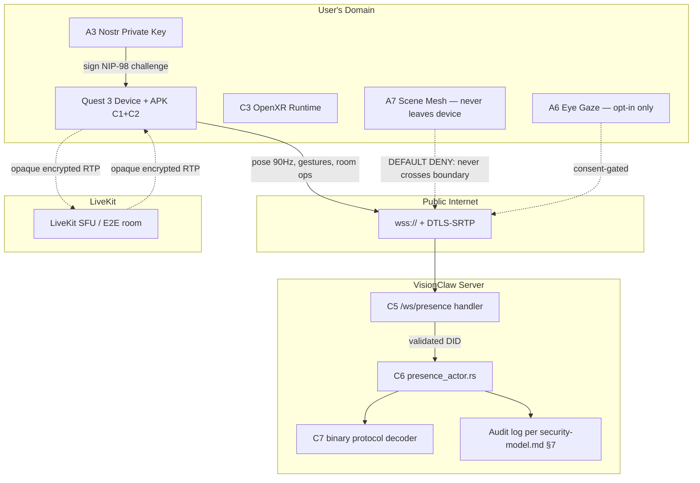

# XR Godot / OpenXR Threat Model

> **Scope.** This document is the security threat model for the new Godot 4
> native Quest 3 APK (built with `godot-rust`/gdext), the supporting Rust
> presence service (`/ws/presence` + `presence_actor.rs`), the avatar pose
> binary stream, LiveKit voice, and the OpenXR capability surface (hand
> tracking, passthrough, scene mesh, spatial anchors).
>
> **Supersedes.** The "Security Considerations" subsection of
> [`docs/explanation/xr-architecture.md`](explanation/xr-architecture.md). That
> section was a 12-line sketch covering only pose validation, voice spoofing,
> eye tracking and hand kinematics. This document replaces it in full and
> should be linked from the XR architecture page.
>
> **Authority.** This document is a threat model only. It is not the design
> spec — that is **PRD-008**. It is not the architectural decision — that is
> **ADR-071**. It is not the bounded context — that is the **DDD XR-Godot
> context**. It records *what* must be defended, *what* attacks are in scope,
> and *what* mitigations the implementation must carry. Anything implementable
> is delegated to those companion documents.
>
> **Baselines inherited (not restated).**
>
> - Identity / DID model — [`docs/explanation/security-model.md`](explanation/security-model.md) §2, [ADR-048](adr/ADR-048-dual-tier-identity-model.md)
> - Auth enforcement at WS upgrade — [ADR-011](adr/ADR-011-auth-enforcement.md)
> - Existing security baseline — [`docs/security.md`](security.md)
> - Single binary protocol envelope — [`docs/binary-protocol.md`](binary-protocol.md), [ADR-061](adr/ADR-061-binary-protocol-unification.md)
> - Audit log catalogue — `security-model.md` §7
> - GDPR posture (data sovereignty in user's Solid Pod) — `security-model.md` §4
>
> Where this document references those baselines, it does so by pointer; it
> does not re-derive them.

---

## 1. System Under Threat

### 1.1 Components in scope

| ID | Component | Trust zone | Owner |
|----|-----------|-----------|-------|
| C1 | Godot 4 native Quest 3 APK (sideloaded or store-shipped) | Untrusted device | User |
| C2 | `godot-rust` (gdext) hot path: binary protocol decode, presence sync, OpenXR capability probe, voice routing | C1 process address space | User |
| C3 | OpenXR runtime (Meta Horizon OS, `XR_EXT_hand_tracking`, `XR_FB_passthrough`, `XR_FB_scene`, `XR_FB_spatial_entity`) | OS | Meta |
| C4 | LiveKit Android SDK + per-avatar HRTF | C1 process address space + LiveKit cloud / SFU | User + LiveKit operator |
| C5 | Rust WS endpoint `/ws/presence` (Actix) | VisionClaw server (existing trust zone) | Project |
| C6 | `presence_actor.rs` per-room broadcast actor | VisionClaw server | Project |
| C7 | Existing Rust binary protocol channel (24 B/node frame, see [ADR-061](adr/ADR-061-binary-protocol-unification.md)) — extended in PRD-008 to carry avatar pose at 90 Hz | VisionClaw server + C1 | Project |
| C8 | Nostr identity (`did:nostr:<hex-pubkey>`), private key on device or external signer | User's Domain (per `security-model.md` §1) | User |

### 1.2 Out of scope

- Vircadia World Server (separate auth chain, see `security-model.md` §8 "Vircadia uses its own authentication"). Threats against Vircadia entities are documented in `docs/security.md`.
- Babylon.js WebXR client (legacy XR path, will be removed per the removal plan).
- Three.js desktop graph view.
- Shared Neo4j / RuVector data plane (covered by existing CQRS authorisation, `security-model.md` §3).
- BC20 anti-corruption layer to agentbox (separate threat model).

### 1.3 Architectural assumptions inherited from PRD-008 / ADR-071

These are decided design points, **not** open questions. They are stated here only so the threat model is self-contained.

1. The APK is a Godot 4 native build for Horizon OS (`aarch64-linux-android` target).
2. `godot-rust` (gdext) provides Rust hot-paths; the rest is GDScript.
3. A new WS endpoint `/ws/presence` carries multi-user presence (avatar pose, voice routing metadata, gesture flags). It is *separate* from the existing graph position stream.
4. Avatar pose extends the existing 24-byte node frame format (see [`docs/binary-protocol.md`](binary-protocol.md)) — meaning pose updates ride a frame layout already specified by ADR-061. PRD-008 specifies any per-frame field additions.
5. Voice goes via LiveKit Android SDK; HRTF is computed client-side per remote participant.
6. Identity is the existing `did:nostr:<hex-pubkey>` (`security-model.md` §2). No new identity scheme.

---

## 2. Asset Inventory

Assets are ranked by impact-if-compromised, not by likelihood.

| ID | Asset | Confidentiality | Integrity | Availability | PII / regulatory class |
|----|-------|----------------|-----------|--------------|------------------------|
| A1 | **APK release signing key** | Critical | Critical | Critical | — (operational secret) |
| A2 | **APK debug signing key** | High | High | Low | — (engineering secret) |
| A3 | **User Nostr private key** (in-app keystore or external signer) | Critical | Critical | High | Authentication secret; loss = identity loss |
| A4 | **Voice / audio stream** (LiveKit room) | High | Medium | High | Behavioural biometric (voice print); GDPR Art. 9 if used for ID |
| A5 | **Hand kinematics** (per-frame joint angles, 26 joints × 2 hands × 7 floats) | High | Medium | Medium | Behavioural biometric — joint motion is uniquely identifying ([Miller et al. 2020](https://doi.org/10.1109/VR46266.2020.00063)). GDPR Art. 9 if persisted. |
| A6 | **Eye tracking gaze vectors** (Quest 3 eye-tracked Pro path; not on base Quest 3) | Critical | Medium | Low | Biometric PII (GDPR Art. 9). Reveals attention, neuro-disorder markers, sexual orientation. |
| A7 | **Scene mesh / spatial anchors** (`XR_FB_scene`, `XR_FB_spatial_entity`) | Critical | Medium | Low | Reveals user's physical environment — strict PII per Meta Privacy Policy & GDPR Art. 9 (potentially identifies home address). |
| A8 | **Avatar pose stream** (head + controllers + body, 90 Hz) | Medium | High | High | Behavioural pattern (location/movement). GDPR — pseudonymous if linked to DID. |
| A9 | **Graph data** (knowledge / ontology nodes) | Public read by default | High | High | Already protected by CQRS auth (`security-model.md` §3). Confirm same enforcement at presence handler. |
| A10 | **Room / session metadata** (room id, member DIDs, join/leave times) | Medium | High | Medium | Pseudonymous PII. |
| A11 | **Presence session token** (DID-bound bearer) | High | High | Medium | Authentication secret derivative of A3. |

---

## 3. Trust Boundaries

**Boundary semantics**

- **B1: User domain → public internet.** Everything leaving the device is suspect; the device itself is untrusted from the server's perspective.
- **B2: Public internet → VisionClaw server.** TLS termination + NIP-98-derived session token. Auth-fails-closed per [ADR-011](adr/ADR-011-auth-enforcement.md).
- **B3: VisionClaw server → audit log / data plane.** Existing CQRS boundary; `security-model.md` §3.
- **B4: Device → LiveKit SFU.** Separate trust chain; voice is opaque to the VisionClaw server.

---

## 4. STRIDE — Component-by-Component

Each cell is **R** (relevant — has at least one specific threat in §5) or **n/a** (not exposed). The matrix is the index into §5.

| Component | S | T | R | I | D | E |
|-----------|---|---|---|---|---|---|
| C1 APK / device boot | R (T-APK-1, T-APK-3) | R (T-APK-1) | R (T-APK-2) | R (T-APK-2) | n/a | n/a |
| C2 gdext binary decoder | R (T-PROTO-2) | R (T-PROTO-1) | n/a | R (T-PROTO-3) | R (T-PROTO-1) | n/a |
| C3 OpenXR runtime / capability probe | n/a | R (T-OXR-1) | R (T-PII-2) | R (T-PII-1, T-PII-2, T-PII-3) | n/a | n/a |
| C4 LiveKit voice | R (T-VOICE-1) | R (T-VOICE-2) | n/a | R (T-VOICE-2) | R (T-VOICE-3) | n/a |
| C5 `/ws/presence` connect | R (T-WS-1) | n/a | R (T-WS-3) | R (T-ROOM-1) | R (T-DOS-1) | R (T-WS-1) |
| C6 `presence_actor.rs` broadcast | R (T-AVATAR-1) | R (T-POSE-1, T-HAND-1) | R (T-AVATAR-2) | R (T-PII-3) | R (T-DOS-1, T-SYBIL-1) | R (T-AVATAR-1) |
| C7 Binary protocol consumer (server side) | n/a | R (T-PROTO-1, T-FRAME-1) | n/a | R (T-FRAME-1) | R (T-PROTO-1) | n/a |

**S** = Spoofing · **T** = Tampering · **R** = Repudiation · **I** = Information disclosure · **D** = Denial of service · **E** = Elevation of privilege.

---

## 5. Specific Threats

Each threat is rated by **DREAD** on a 0–10 scale per dimension; total = mean. Priority bands: **critical ≥ 8.0**, **high 6.0–7.9**, **medium 4.0–5.9**, **low < 4.0**. Likelihood is bucketed (`Low / Med / High / V.High`) on a public-shipped product assumption.

### Conventions

- **Attacker profile** uses these buckets:
  - `Casual` — script-kiddie / Quest user with adb access
  - `Skilled` — reverse engineer with frida, APK tooling, network MITM lab
  - `Insider` — operator of LiveKit / project employee with infra access
  - `Nation-state` — out of scope for mitigation; documented for residual-risk only
- **Mitigation** points to file/path where the control belongs. Files marked `(NEW)` will be created by PRD-008; `(EXIST)` are existing surfaces to extend.

---

### 5.1 APK supply chain & signing

#### T-APK-1: Malicious gdext crate dependency

| Field | Value |
|-------|-------|
| Description | A transitive Rust dependency in the `gdext` build graph is published-then-yanked or typo-squatted (e.g. `serde-json` vs `serde_json`). Compiled into the APK, it ships as native code with full process privileges — including access to A3 (Nostr key) and A6/A7 (eye/scene). |
| Attacker | `Skilled` |
| Impact | Critical (key exfiltration, biometric exfiltration) |
| DREAD | D9 R5 E5 A8 D6 → **6.6 High** |
| Mitigation | (1) `cargo-deny` + `cargo-audit` in CI per PRD-008. (2) `Cargo.lock` checked in; reproducible builds. (3) Vendored deps for release builds (`cargo vendor`). (4) SBOM emitted with each release APK and signed alongside it. (5) Allow-list of crates with size/maintainer policy in CI. Implementation belongs in `client-godot/Cargo.toml` (NEW) + `.github/workflows/godot-apk-release.yml` (NEW). |
| Residual | Low for typo-squatting; medium for compromise of a legitimate maintainer (compensated by SBOM + reproducible-build verification). |

#### T-APK-2: APK reverse engineering — extract Nostr key or session token

| Field | Value |
|-------|-------|
| Description | Attacker pulls the APK off-device (`adb pull`), opens it in `jadx` / `Ghidra`, locates the Rust string table or Android Keystore wrapper, and extracts A3 (Nostr private key) or a long-lived A11 (session token). |
| Attacker | `Skilled` (single-target); `Casual` if key is plaintext in shared prefs. |
| Impact | Critical for the targeted user — full identity takeover. |
| DREAD | D10 R3 E4 A2 D7 → **5.2 Medium** (low affected-users because it's a per-device extraction). Single-user impact is critical; aggregate medium. |
| Mitigation | (1) Nostr private key MUST be stored in Android Keystore (hardware-backed where available, see Quest 3 ARMv8.2 Secure Element). (2) Prefer external signer (NIP-07-style remote-signer flow over local USB / Bluetooth) so the key never enters the APK process. (3) Session tokens (A11) capped at `AUTH_TOKEN_EXPIRY=300` for presence sessions per `security-model.md` §6. (4) Code obfuscation is **not** a primary defence — list explicitly as not relied upon. (5) APK signed with v3 signature scheme + lineage rotation. |
| Residual | Medium if user opts out of external signer; the in-APK Keystore-wrapped key still resists casual attackers but not a determined targeted attack. Documented as known limitation. |

#### T-APK-3: Unsigned / side-loaded APK install with malicious replacement

| Field | Value |
|-------|-------|
| Description | Quest's developer mode allows arbitrary APKs. Attacker distributes a look-alike APK (e.g. via Discord / SideQuest fork) signed with a different key but matching the package ID; user installs over legit version after uninstall. The replacement collects A3 / A6 / A7. |
| Attacker | `Skilled` |
| Impact | Critical (full takeover for any user who installs the replacement). |
| DREAD | D9 R8 E5 A6 D7 → **7.0 High** |
| Mitigation | (1) Recommend Quest Store distribution path — store enforces signature continuity. (2) For dev/sideload path: publish the signing certificate fingerprint in `docs/security.md` and on the project website; users instructed to verify with `apksigner verify --print-certs`. (3) APK upgrade requires same signing key (Android default). (4) In-app "About" screen displays signing fingerprint so a user can compare against the published value. (5) **Open question 7.1** — Quest Store vs sideload — is the operational choice that closes the residual risk. |
| Residual | Medium until Quest Store decision (see §10). |

---

### 5.2 Binary protocol & presence pipeline

#### T-PROTO-1: Malformed binary frame causes panic / OOM in `presence_actor.rs`

| Field | Value |
|-------|-------|
| Description | A client (legitimate or hostile) sends a frame whose `payload_length` declares 24 × N nodes but the actual byte stream is truncated or oversized; or claims `N = u32::MAX`, triggering a multi-GB allocation. |
| Attacker | `Casual` (curl one-liner against `/ws/presence`). |
| Impact | High availability (server crash / OOM kill of the actix worker); cross-room blast radius if actor supervision is misconfigured. |
| DREAD | D7 R10 E9 A8 D9 → **8.6 Critical** |
| Mitigation | (1) Hard upper bound on per-frame node count (recommend `MAX_AVATAR_NODES_PER_FRAME = 8` since one user has head+2 controllers+optional body = ≤8). (2) Validate `actual_len == 9 + 28 × declared_count` before allocating; return `Close(Policy)` on mismatch (extends the validation rules in `docs/binary-protocol.md` §"Forbidden patterns" / §"Frame layout"). (3) `presence_actor.rs` (NEW) decodes inside a `catch_unwind` boundary; per-room actor isolation prevents cross-room blast. (4) **libfuzzer harness** required (see §8) at `crates/binary-protocol/fuzz/fuzz_targets/presence_decode.rs` (NEW). |
| Residual | Low after fuzzer + bounds checks. |

#### T-PROTO-2: Spoofed preamble byte / malformed frame slipping through to a downstream handler

| Field | Value |
|-------|-------|
| Description | Per [ADR-061](adr/ADR-061-binary-protocol-unification.md), preamble byte `0x42` is **not** a version dispatch; it is a sanity check. A frame with wrong preamble must be rejected, not "tried as another version". A client that sends `0x00` could trick a relaxed implementation into mis-routing. |
| Attacker | `Casual` |
| Impact | Medium — depending on how the decoder fails, could enable spoofing in §5.3. |
| DREAD | D5 R8 E7 A4 D7 → **6.2 High** |
| Mitigation | (1) Reject — never reinterpret — non-`0x42` frames; close connection on first violation. (2) Test case: `tests/presence_decode_test.rs::rejects_wrong_preamble` (NEW). (3) Code-review rule: any conditional branching on the preamble byte is a regression — flagged by clippy lint or a custom xtask. |
| Residual | Low. |

#### T-PROTO-3: Cross-context PII leak via binary protocol field accretion

| Field | Value |
|-------|-------|
| Description | Future PRs add fields to the per-frame node layout (e.g. `controller_serial`, `device_id`, `eye_gaze_xy`) without an ADR. Per `docs/binary-protocol.md` §"Forbidden patterns": *"Adding columns to per-frame binary without an ADR superseding ADR-061"* is already forbidden, but the rule must be enforced against the *new* avatar-pose extension too. |
| Attacker | `Insider` (well-meaning developer) |
| Impact | High — any new field becomes silently persistent in audit / replay artefacts. |
| DREAD | D7 R5 E3 A10 D6 → **6.2 High** |
| Mitigation | (1) Frame format frozen in PRD-008 §"Wire format" + ADR-071 §"Decision". (2) Schema test: `tests/binary_protocol_field_set.rs` (NEW) snapshot-tests the field set; PR review required to update the snapshot. (3) Code-owners file marks `crates/binary-protocol/src/lib.rs` as security-review-required. |
| Residual | Low while review process is held. |

#### T-FRAME-1: Out-of-bounds node ID in pose frame triggers map lookup leak

| Field | Value |
|-------|-------|
| Description | Pose frame carries u32 node id. Attacker sends ids in `0x80000000` (agent flag bit) range, hoping `presence_actor.rs` calls into `GraphStateActor` and leaks node existence info via timing or error message. |
| Attacker | `Skilled` |
| Impact | Medium — graph enumeration (already partially mitigated by `security-model.md` §3). |
| DREAD | D4 R7 E6 A6 D5 → **5.6 Medium** |
| Mitigation | (1) Per `docs/binary-protocol.md` §"Privacy" — visibility filter at broadcast boundary; same rule applies to presence node ids. (2) Reject any pose frame whose ids fall outside the room's allocated avatar-id range (avatar ids minted server-side per join, see §5.3 mitigation). (3) Constant-time lookup error path. |
| Residual | Low. |

---

### 5.3 Presence spoofing & avatar identity

#### T-WS-1: Forged Nostr DID at handshake

| Field | Value |
|-------|-------|
| Description | Attacker connects to `/ws/presence` and asserts `did:nostr:<victim-pubkey>` without proving possession of the corresponding private key. |
| Attacker | `Casual` |
| Impact | Critical — full avatar/voice/identity impersonation. |
| DREAD | D9 R10 E10 A7 D9 → **9.0 Critical** |
| Mitigation | (1) **Mandatory**: signed challenge handshake before WS upgrade succeeds. Server emits a 32-byte random nonce; client signs `(nonce \|\| ts)` with their Nostr key; server verifies Schnorr signature against the claimed pubkey. (2) Nonce single-use, 60-second window (mirrors NIP-98 replay window per `security-model.md` §2). (3) Implementation: `src/handlers/presence_handler.rs::challenge_handshake` (NEW); reuses validation primitives from `nostr_service` (EXIST per `security-model.md`). (4) Per [ADR-011](adr/ADR-011-auth-enforcement.md): fail closed at upgrade time, no log-and-allow. |
| Residual | Low. |

#### T-WS-3: Replay of captured pose/handshake

| Field | Value |
|-------|-------|
| Description | Attacker captures a legitimate WS handshake frame (e.g. via MITM in development, or from a compromised TLS-terminating proxy) and replays it from a different IP / device. |
| Attacker | `Skilled` |
| Impact | High (impersonation of recent legitimate session). |
| DREAD | D8 R6 E6 A5 D7 → **6.4 High** |
| Mitigation | (1) Signed challenge nonce (T-WS-1 mitigation) is single-use → replay rejected. (2) Session token bound to TLS session id where available (Actix `SessionId`). (3) Audit log records `(pubkey, ip, ts)` per `security-model.md` §7; alert on same-pubkey-different-IP within token window. |
| Residual | Low. |

#### T-AVATAR-1: Avatar impersonation — joining a room as another user's DID

| Field | Value |
|-------|-------|
| Description | After successful T-WS-1 mitigation, an authenticated user A tries to publish pose frames *with someone else's avatar id* into the room broadcast. |
| Attacker | `Casual` |
| Impact | High (impersonation within room). |
| DREAD | D8 R10 E7 A6 D8 → **7.8 High** |
| Mitigation | (1) Avatar ids are minted server-side at room-join and bound to the validated pubkey. Client cannot select its own avatar id. (2) `presence_actor.rs` (NEW) tags every inbound pose frame with the session-bound avatar id; ignores any id field the client sends in the body. (3) Room state map: `BTreeMap<Pubkey, AvatarId>`. |
| Residual | Low. |

#### T-AVATAR-2: Repudiation — user denies actions taken in-room (e.g. harassing voice / gesture)

| Field | Value |
|-------|-------|
| Description | User claims "that wasn't me in the meeting" after a moderation report. |
| Attacker | `Casual` (defensive) |
| Impact | Medium (governance / moderation friction). |
| DREAD | D4 R8 E8 A2 D6 → **5.6 Medium** |
| Mitigation | (1) Audit log entries `room_join` and `room_leave` with `(pubkey, room_id, ts)` per `security-model.md` §7 catalogue. (2) Voice tracks tagged in LiveKit with `participant_identity = did:nostr:<hex>` (NOT the local avatar id). (3) Pose frames are NOT logged (per GDPR — see §7); only the membership ledger is. The mitigation is minimal-by-design. |
| Residual | Medium-acceptable. We deliberately do not record pose data; the membership ledger is sufficient for moderation. |

#### T-ROOM-1: Room enumeration

| Field | Value |
|-------|-------|
| Description | Unauthenticated or unrelated-authenticated client iterates room ids (`/ws/presence?room=000001`, `…000002`, …) and learns which rooms exist + active member count. |
| Attacker | `Casual` |
| Impact | Medium — meta-data leak (who is online with whom). |
| DREAD | D4 R10 E8 A6 D8 → **7.2 High** |
| Mitigation | (1) Room ids are 128-bit UUIDv4, not enumerable integers. (2) `/ws/presence` returns the *same* `Close(Policy)` error for "room does not exist" and "you are not a member" — no oracle. (3) Room membership is gated by an explicit invite (server stores `(room_id, invitee_pubkey)` ACL row); presence handler checks ACL before accepting WS upgrade. (4) Rate-limit presence handshakes per IP per `security-model.md` §5. |
| Residual | Low. |

---

### 5.4 Pose / hand kinematics injection

#### T-POSE-1: Pose injection — physically impossible velocity / out-of-bounds position

| Field | Value |
|-------|-------|
| Description | Authenticated client sends pose frames with `|v| > 20 m/s` (teleport exploit) or `|p| > world_radius` (out-of-world). Used to grief other users (collisions), to clip through scene, or to exhaust collision detection on the server. |
| Attacker | `Casual` (modified APK) |
| Impact | Medium — UX disruption + DoS surface. |
| DREAD | D5 R10 E7 A8 D8 → **7.6 High** |
| Mitigation | (1) **Server-side `validate_pose()` in `presence_actor.rs`** (NEW). Concrete gates: `velocity_magnitude < MAX_VELOCITY_M_PER_S` (default 20), `position ∈ world_aabb`, `dt > MIN_FRAME_DT_MS` (default 8 → 125 Hz cap). (2) Property-based tests with adversarial inputs in `crates/presence/tests/validate_pose_proptest.rs` (NEW). (3) On gate fail: clamp + log + increment metric `presence_pose_rejected_total{reason=…}`; do NOT broadcast. (4) The existing `XRSecurityValidator` sketch in `xr-architecture.md` §"Security Considerations" is the seed — this document supersedes it with a concrete gate set. |
| Residual | Low. |

#### T-HAND-1: Hand kinematics spoofing — joint angles outside human anatomy

| Field | Value |
|-------|-------|
| Description | Attacker sends joint angles outside human flexion limits (e.g. fingertip 180° hyperextension), aiming to trigger edge cases in client renderers or to construct gesture poses no human could form (signal-injection into gesture detector). |
| Attacker | `Skilled` |
| Impact | Medium — client-side renderer crashes; gesture-detector evasion (e.g. fake "trusted handshake" gesture for in-world auth flows). |
| DREAD | D5 R7 E6 A6 D5 → **5.8 Medium** |
| Mitigation | (1) Server-side anatomy gate in `validate_pose()`: per-joint flexion ranges from a static table sourced from MANO model anatomical limits (see [Romero et al. 2017](https://mano.is.tue.mpg.de/)). (2) Reject frame with first joint outside range; metric increment. (3) Property-based fuzz against the anatomy gate in the same proptest suite. (4) **Out of scope but flagged**: gesture-as-auth is not in PRD-008 scope; if added later, this threat re-promotes to High. |
| Residual | Low. |

---

### 5.5 PII — eye tracking, scene mesh

#### T-PII-1: Scene mesh exfiltration (A7 leak)

| Field | Value |
|-------|-------|
| Description | Quest 3's `XR_FB_scene` exposes meshes of the user's room (walls, furniture). If the APK forwards this to the server (even debugging telemetry), it transmits a 3D model of the user's home — strict PII identifying address by floor plan. |
| Attacker | `Insider` (developer enabling a debug flag) > `Skilled` (modified APK forwarding to attacker server) |
| Impact | Critical — physical location PII; arguably GDPR Art. 9 special-category if combined with other identifiers. |
| DREAD | D10 R6 E5 A9 D7 → **7.4 High** |
| Mitigation | (1) **Default deny**: scene mesh stays client-side. The Rust binding for `XR_FB_scene` has a single, audited consumer in `client-godot/rust/src/scene.rs` (NEW) that does not expose a serialiser. (2) No code path from `scene.rs` to the WS layer; enforced by module visibility (`pub(crate)` only) + a clippy-deny rule on `serde::Serialize` derives in this module. (3) Adding scene mesh to any wire format requires explicit ADR per "Forbidden patterns" in `docs/binary-protocol.md`. (4) Spatial anchor sharing (multi-user spatial alignment) is the legitimate use case if needed — requires anchor-only sharing (UUID + small drift offset), NOT mesh data. (5) **Open question 7.3** — should server ever receive scene anchors (not mesh) for shared-room alignment? Default no; revisit only with PRD. |
| Residual | Low while the policy holds; depends on developer discipline. |

#### T-PII-2: Eye tracking PII leak (A6)

| Field | Value |
|-------|-------|
| Description | Per-frame gaze vectors logged, persisted, or transmitted without explicit consent. Quest 3 base does NOT have eye tracking; Quest Pro / Quest 3S Pro variant does. The threat is real for any "Pro path" build. |
| Attacker | `Insider` (analytics PR) > `Skilled` (extraction from telemetry endpoint) |
| Impact | Critical — biometric PII (GDPR Art. 9). |
| DREAD | D10 R7 E5 A6 D6 → **6.8 High** |
| Mitigation | (1) Eye tracking capability is **opt-in via explicit consent flow in `XRBoot.tscn`** (NEW Godot scene). The consent dialog explains what is collected, where it goes, and how to revoke. (2) Default config: eye tracking disabled. (3) Even when enabled, gaze vectors stay local to the device; not transmitted. (4) If gaze is ever needed server-side (e.g. shared-attention features), it MUST go through a separate consented endpoint with its own retention policy and DPIA — out of scope for current PRD-008. (5) Audit-log entry on consent grant/revoke. |
| Residual | Low for current scope. |

#### T-PII-3: OpenXR capability probe metadata leak

| Field | Value |
|-------|-------|
| Description | The capability probe (which OpenXR extensions are available) is itself a fingerprinting vector. Sent to server in handshake → unique-ish device fingerprint. |
| Attacker | `Insider` (analytics) |
| Impact | Low (existing browser-fingerprinting baseline). |
| DREAD | D2 R10 E9 A7 D6 → **6.8 High** by formula but low real impact — boundary case. Treated as **Medium** after qualitative review (Quest 3 fleet is homogeneous; entropy is low). |
| Mitigation | (1) Capability probe stays client-side; server is only told "device class = quest3-base / quest3-pro / unknown". (2) No per-extension list transmitted. (3) Implementation: `client-godot/rust/src/capability_probe.rs` (NEW) — public function returns enum, not list. |
| Residual | Low. |

---

### 5.6 Voice (LiveKit)

#### T-VOICE-1: Voice spoofing — sending a stream as another participant

| Field | Value |
|-------|-------|
| Description | Attacker publishes a LiveKit audio track tagged with another user's `participant_identity`. |
| Attacker | `Skilled` |
| Impact | High (impersonation in conversation). |
| DREAD | D8 R7 E5 A6 D7 → **6.6 High** |
| Mitigation | (1) `participant_identity` is set by the server-issued LiveKit access token, not by client claim; token signed by `LIVEKIT_API_SECRET`. (2) Token issuance gated by validated Nostr DID (server-side issuance handler `src/handlers/livekit_token.rs` (NEW)). (3) Token short-TTL (≤ room-join window). |
| Residual | Low. |

#### T-VOICE-2: Cross-room audio leak — LiveKit room misconfiguration

| Field | Value |
|-------|-------|
| Description | LiveKit room ACLs misconfigured → user A in room R1 receives audio from room R2. Either via shared room name, public room flag, or recorded-room playback URL leakage. |
| Attacker | `Insider` (operator misconfig) |
| Impact | High (confidentiality breach). |
| DREAD | D8 R5 E3 A8 D5 → **5.8 Medium** |
| Mitigation | (1) Room names are server-derived from VisionClaw room UUID (T-ROOM-1), never client-provided. (2) LiveKit access token scope = single room (`grants.room = <uuid>`). (3) Room recordings disabled by default; recording requires explicit room-owner consent + per-participant notice. (4) **Open question 7.2** — E2E vs SFU-trusted — affects whether even LiveKit operators can hear the stream. Default recommendation: SFU-trusted (LiveKit cloud) for v1; promote to E2E (LiveKit Cloud E2EE) as a follow-up if user demand surfaces. |
| Residual | Medium (depends on LiveKit operational correctness; mitigated by configuration tests). |

#### T-VOICE-3: Voice channel DoS (audio flood)

| Field | Value |
|-------|-------|
| Description | Single attacker publishes high-bitrate audio repeatedly to exhaust SFU bandwidth or downstream client decoders. |
| Attacker | `Casual` |
| Impact | Medium — room-scope DoS. |
| DREAD | D5 R10 E8 A5 D7 → **7.0 High** |
| Mitigation | (1) LiveKit per-participant bitrate cap (`max_publish_bitrate = 64 kbps`). (2) Room participant cap (LiveKit default + project policy: 32). (3) Per-DID rate limit on rejoin attempts. |
| Residual | Low. |

---

### 5.7 Denial of service & Sybil

#### T-DOS-1: Pose-frame flood

| Field | Value |
|-------|-------|
| Description | Authenticated client sends pose frames at >> 90 Hz (e.g. 10 kHz) to overload `presence_actor.rs` and starve other rooms. |
| Attacker | `Casual` |
| Impact | High (cross-room availability). |
| DREAD | D7 R10 E9 A8 D8 → **8.4 Critical** |
| Mitigation | (1) **Rate limit at handler**: `MAX_PRESENCE_HZ_PER_SESSION = 120` (allows 90 Hz target + jitter). Frames above are *dropped* not buffered. Implementation: token bucket per session in `presence_handler.rs` (NEW). (2) Per-room actor isolation: a flooded room cannot starve another. (3) Backpressure via existing pattern in [ADR-031](adr/ADR-031-broadcast-backpressure.md) where applicable. (4) Metric: `presence_frames_dropped_total{session, reason}` for ops alerting. |
| Residual | Low. |

#### T-SYBIL-1: Sybil — single attacker creates many DIDs to pollute rooms

| Field | Value |
|-------|-------|
| Description | Nostr DIDs are free to create. Attacker generates 10 000 keypairs and joins a public room en-masse. |
| Attacker | `Casual` |
| Impact | Medium — room-scope DoS / harassment. |
| DREAD | D5 R10 E10 A6 D8 → **7.8 High** |
| Mitigation | (1) **Acknowledge** that Nostr DIDs are intrinsically Sybil-prone (per `security-model.md` philosophy — decentralised identity). The mitigation is at the room-membership layer, not the identity layer. (2) Room ACL is invite-list (T-ROOM-1 mitigation) — public open-join rooms are explicitly opt-in by the room owner with per-room participant cap. (3) For public rooms: rate-limit room-join per IP, not per DID. (4) Long-term: optional "vouching" trust signal (out of scope for PRD-008). |
| Residual | Medium-acceptable for invite-only rooms; medium-acknowledged for public rooms. |

---

### 5.8 OpenXR-specific

#### T-OXR-1: OpenXR runtime extension misuse — passthrough bypassing screen-recording protections

| Field | Value |
|-------|-------|
| Description | `XR_FB_passthrough` lets the app composite real-world camera feed. If the app inadvertently captures and serialises passthrough texture, it leaks visual PII (room contents, other people in view). |
| Attacker | `Insider` (developer enabling a screenshot/record feature without thinking through passthrough) |
| Impact | Critical (visual PII). |
| DREAD | D10 R6 E4 A8 D6 → **6.8 High** |
| Mitigation | (1) Passthrough texture is NOT readable in user-space on Horizon OS — Meta blocks `glReadPixels` from passthrough layers. Confirm at runtime via capability probe; refuse to start if passthrough-readback is somehow enabled (defensive). (2) Any in-app screenshot feature must explicitly exclude passthrough layers (Godot: render to a separate framebuffer that omits the passthrough composition layer). (3) Code-owner review required for any commit touching screenshot / record paths. |
| Residual | Low. |

---

## 6. Threat Summary Table (sorted by DREAD)

| ID | Threat | Priority | DREAD | Residual |
|----|--------|----------|-------|----------|
| T-WS-1 | Forged Nostr DID at handshake | Critical | 9.0 | Low |
| T-PROTO-1 | Malformed frame → server panic / OOM | Critical | 8.6 | Low |
| T-DOS-1 | Pose-frame flood | Critical | 8.4 | Low |
| T-AVATAR-1 | Avatar impersonation in room | High | 7.8 | Low |
| T-SYBIL-1 | Sybil DIDs flood public room | High | 7.8 | Med-acknowledged |
| T-POSE-1 | Pose injection (velocity / OOB) | High | 7.6 | Low |
| T-PII-1 | Scene mesh exfiltration | High | 7.4 | Low (policy-dependent) |
| T-ROOM-1 | Room enumeration | High | 7.2 | Low |
| T-APK-3 | Sideloaded look-alike APK | High | 7.0 | Med (open question 7.1) |
| T-VOICE-3 | Voice flood | High | 7.0 | Low |
| T-OXR-1 | Passthrough screenshot leak | High | 6.8 | Low |
| T-PII-2 | Eye tracking leak | High | 6.8 | Low |
| T-VOICE-1 | Voice impersonation | High | 6.6 | Low |
| T-APK-1 | Malicious gdext crate | High | 6.6 | Low / Med |
| T-WS-3 | Replay of handshake | High | 6.4 | Low |
| T-PROTO-2 | Wrong-preamble accepted | High | 6.2 | Low |
| T-PROTO-3 | Field accretion in pose frame | High | 6.2 | Low (process control) |
| T-VOICE-2 | LiveKit cross-room leak | Med | 5.8 | Med |
| T-HAND-1 | Hand anatomy spoof | Med | 5.8 | Low |
| T-FRAME-1 | OOB node id leak | Med | 5.6 | Low |
| T-AVATAR-2 | Repudiation of room actions | Med | 5.6 | Med-acceptable |
| T-APK-2 | Reverse-engineering APK for keys | Med | 5.2 | Med |
| T-PII-3 | Capability probe fingerprinting | Med | (qual.) | Low |

---

## 7. Compliance Considerations

### 7.1 GDPR

| Aspect | Position |
|--------|----------|
| Lawful basis for pose / voice processing | Art. 6(1)(b) — performance of a contract (the user joined the room voluntarily). |
| Special-category data (Art. 9) | Eye gaze (T-PII-2), hand kinematics (A5 if persisted), voice biometrics (A4 if used for identification), scene mesh (T-PII-1). All require explicit consent (Art. 9(2)(a)) AND a documented DPIA *before* enabling. **Default state**: none persisted, none transmitted server-side. |
| Data minimisation (Art. 5(1)(c)) | Server stores only `(room_id, pubkey, join_ts, leave_ts)`. Pose stream is in-flight only (broadcast and dropped). Voice via LiveKit per its own DPA. |
| Right to erasure (Art. 17) | Inherits the `security-model.md` §4 GDPR posture: pseudonymous identifier (`pubkey`) is the only server-stored linkage; `DELETE /api/settings/user` extended to also purge presence membership ledger. |
| Data subject access (Art. 15) | Membership ledger exportable per pubkey. Pose / voice / scene / eye are not stored, so nothing to export. |
| International transfers | If LiveKit cloud region is outside EEA, SCCs required. Operational decision tracked in PRD-008. |

### 7.2 CCPA

The pseudonymous-pubkey model + opt-in-only PII pipeline means CCPA "do not sell" is trivially satisfied (we sell nothing). Disclosure: voice/audio routing through LiveKit (third-party processor) — disclosed in privacy notice.

### 7.3 COPPA

XR is rated 13+ by Meta Store policy. Project-level age gate:

- App store listing: rated 13+ minimum (Quest Store age gate enforces).
- Side-load distribution: README + first-run disclaimer states the same.
- No mechanism currently to verify age beyond store gate; if room owner needs verified-adult guarantees, that is an out-of-scope feature requiring a separate identity layer.

---

## 8. Security Testing Requirements

These are testing-strategy hooks consumed by the concurrent **QE strategy** doc; this section enumerates the *what*, the QE strategy specifies the *how* and the CI integration.

### 8.1 Fuzzing

| Target | Harness | Where |
|--------|---------|-------|
| Binary protocol decoder (presence pose) | libfuzzer / `cargo fuzz` | `crates/binary-protocol/fuzz/fuzz_targets/presence_decode.rs` (NEW) |
| Challenge handshake parser | libfuzzer | `crates/presence/fuzz/fuzz_targets/handshake_parse.rs` (NEW) |
| Pose validation gate (`validate_pose`) | property-based (proptest) | `crates/presence/tests/validate_pose_proptest.rs` (NEW) |
| Hand anatomy gate | proptest | same file |

CI gate: fuzzers must run for ≥ 10 minutes per PR touching the relevant crate; ≥ 4 hours nightly.

### 8.2 Penetration testing scenarios (must be reproducible)

| Scenario | Threat covered | Pass criterion |
|----------|---------------|----------------|
| `pen/replay-handshake.sh` | T-WS-3 | Replayed nonce returns `Close(Policy)` within 50 ms |
| `pen/pose-injection.sh` | T-POSE-1 | Velocities > 20 m/s rejected; rejection metric increments |
| `pen/room-enumeration.sh` | T-ROOM-1 | All non-member room ids return identical opaque error |
| `pen/avatar-impersonation.sh` | T-AVATAR-1 | Client-asserted avatar id ignored; server-bound id used |
| `pen/sybil-public-room.sh` | T-SYBIL-1 | 1000 DIDs throttled at IP layer to ≤ N joins/min |
| `pen/voice-bitrate-flood.sh` | T-VOICE-3 | LiveKit truncates above 64 kbps; metric records |
| `pen/scene-mesh-exfil.sh` | T-PII-1 | Static analysis: no `Serialize` derives in `client-godot/rust/src/scene.rs`; runtime smoke test confirms no scene-mesh bytes traverse `/ws/presence` |

### 8.3 SAST / DAST gates in CI

- `cargo clippy -- -D warnings` (existing baseline + project-specific lints)
- `cargo audit` (existing)
- `cargo deny check advisories bans sources licenses` (NEW for the godot client crate)
- Custom xtask: assert no new field added to per-frame node layout (T-PROTO-3 mitigation enforcement)
- Custom xtask: assert no `pub use` of scene-mesh types from `client-godot/rust/src/scene.rs` (T-PII-1 enforcement)

---

## 9. Mitigations Summary (file-pointing)

This section is the implementation index. Files marked **(NEW)** are introduced by PRD-008; **(EXIST)** are extended.

| Control | File | Threat IDs |
|---------|------|------------|
| `validate_pose()` velocity / bounds gate | `crates/presence/src/validate_pose.rs` (NEW) | T-POSE-1, T-FRAME-1 |
| Hand anatomy gate | `crates/presence/src/validate_hand.rs` (NEW) | T-HAND-1 |
| DID-bound challenge handshake | `src/handlers/presence_handler.rs::challenge_handshake` (NEW) | T-WS-1, T-WS-3 |
| Per-session frame-rate limiter | `src/handlers/presence_handler.rs` (NEW) | T-DOS-1 |
| Server-bound avatar id | `src/actors/presence_actor.rs::on_join` (NEW) | T-AVATAR-1 |
| Frame format frozen + snapshot test | `crates/binary-protocol/tests/frame_field_snapshot.rs` (NEW) | T-PROTO-3 |
| libfuzzer binary protocol harness | `crates/binary-protocol/fuzz/` (NEW) | T-PROTO-1, T-PROTO-2 |
| APK signing in CI (HSM-backed) | `.github/workflows/godot-apk-release.yml` (NEW) | T-APK-1, T-APK-3 |
| `cargo-deny` + SBOM gate | same workflow | T-APK-1 |
| Scene mesh containment | `client-godot/rust/src/scene.rs` (NEW), `pub(crate)` only | T-PII-1 |
| Eye-tracking consent UI | `client-godot/scenes/XRBoot.tscn` (NEW) | T-PII-2 |
| Capability probe collapses to enum | `client-godot/rust/src/capability_probe.rs` (NEW) | T-PII-3 |
| Server-issued LiveKit token | `src/handlers/livekit_token.rs` (NEW) | T-VOICE-1, T-VOICE-2 |
| LiveKit per-participant bitrate cap | LiveKit room config (operational) | T-VOICE-3 |
| UUIDv4 room ids + opaque-error room API | `src/handlers/presence_handler.rs` (NEW) | T-ROOM-1 |
| Audit log: room join/leave | extends `security-model.md` §7 catalogue | T-AVATAR-2, T-WS-3 |
| Passthrough-aware screenshot policy | `client-godot/rust/src/screenshot.rs` (NEW, code-owner gated) | T-OXR-1 |

---

## 10. Open Questions (require user / project decision)

These are deliberately surfaced and **must** be resolved before the v1 ship of PRD-008. Each affects the threat model materially.

### 10.1 Quest Store submission vs side-load

- **Decision needed**: ship via Meta Quest Store (App Lab or main store), or sideload-only via project release page / SideQuest?
- **Threat impact**:
  - Store path tightens **T-APK-3** (residual → Low) because the store enforces signature continuity and serves a single canonical artefact.
  - Side-load path keeps **T-APK-3** at Medium and shifts trust to the user verifying the signing certificate fingerprint.
- **Other impacts**: store path enables auto-update (security patches reach users); side-load needs in-app update prompt. Store path requires Meta privacy-policy review.
- **Recommendation**: Quest Store (App Lab tier) for v1. Side-load remains supported for development.

### 10.2 Voice E2E vs SFU-trusted

- **Decision needed**: is the LiveKit SFU operator in the trust boundary, or out of it?
- **Threat impact**:
  - SFU-trusted (default LiveKit cloud) — LiveKit operator can theoretically access audio. **T-VOICE-2** residual: Medium.
  - E2E (LiveKit Cloud E2EE / self-hosted with E2EE) — operator cannot. **T-VOICE-2** residual: Low.
- **Other impacts**: E2E disables server-side recording, transcription, and noise suppression. Increased client CPU for crypto.
- **Recommendation**: SFU-trusted for v1; promote to E2E if user demand surfaces.

### 10.3 Server-side scene anchors (NOT mesh) for shared spatial alignment

- **Decision needed**: should the server ever receive *spatial anchors* (UUID + 4×4 transform from `XR_FB_spatial_entity`) for shared-room spatial alignment?
- **Threat impact**:
  - **No** (default) — multi-user room is "floating-in-VR"; co-located AR alignment unsupported. **T-PII-1** residual: Low.
  - **Yes** (anchors only, not mesh) — enables co-located AR but adds a tiny location-correlation channel. Requires anchor lifetime policy + per-anchor consent UI.
- **Recommendation**: No for v1. Revisit when a concrete co-located AR feature is specified.

### 10.4 Membership ledger retention period

- **Decision needed**: how long is the `(room_id, pubkey, join_ts, leave_ts)` ledger kept?
- **Threat impact**: Affects **T-AVATAR-2** (repudiation evidence window) and GDPR data-minimisation posture.
- **Recommendation**: 90 days default; configurable via env var `PRESENCE_LEDGER_RETENTION_DAYS` (mirrors NIP-98 token-rotation precedent in `security-model.md` §6).

### 10.5 External signer (NIP-07-style) vs in-APK Keystore

- **Decision needed**: do we ship a remote-signer flow (Nostr key on a separate device, paired over USB/BT/QR) for v1, or only Android Keystore?
- **Threat impact**: External signer reduces **T-APK-2** residual to Low. In-APK Keystore-only keeps it at Medium.
- **Recommendation**: Android Keystore in v1; document external-signer as v2 enhancement.

---

## 11. Cross-references

- **Inherits**: [`docs/explanation/security-model.md`](explanation/security-model.md) (auth, audit, GDPR posture); [`docs/security.md`](security.md) (transport, validation baselines); [ADR-011](adr/ADR-011-auth-enforcement.md) (auth-fail-closed); [ADR-061](adr/ADR-061-binary-protocol-unification.md) and [`docs/binary-protocol.md`](binary-protocol.md) (frame envelope rules); [ADR-048](adr/ADR-048-dual-tier-identity-model.md) (identity tiers).
- **Supersedes**: the "Security Considerations" subsection of [`docs/explanation/xr-architecture.md`](explanation/xr-architecture.md). The XR architecture page should now link here for security; the in-page sketch should be removed in the same change-set as PRD-008 lands.
- **Sibling concurrent docs (swarm `swarm-1777757491161-nl2bbv`)**: PRD-008 (design spec), ADR-071 (decision), DDD XR-Godot context (bounded-context map), removal plan (Babylon.js / WebXR sunset), QE strategy (test plan that consumes §8 of this doc), system architecture (overall placement).

---

## 12. Change log

| Date | Author | Change |
|------|--------|--------|
| 2026-05-02 | security-architect (V3 swarm `swarm-1777757491161-nl2bbv`) | Initial draft. Supersedes the inline "Security Considerations" section of `xr-architecture.md` for the new Godot/OpenXR APK + presence service. |
