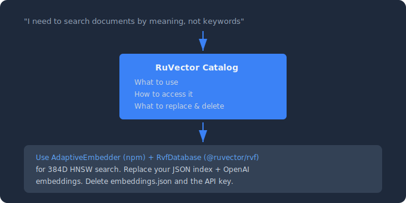
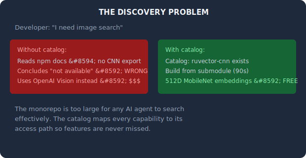
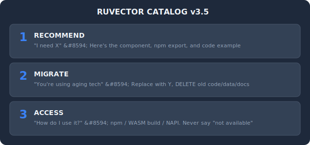
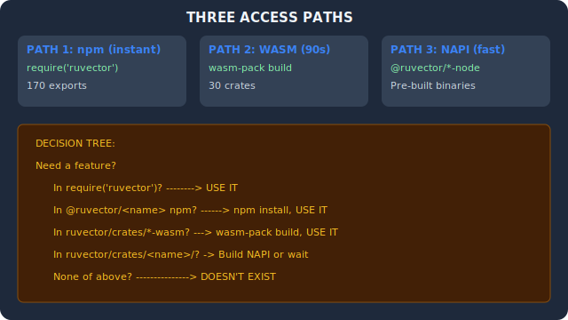
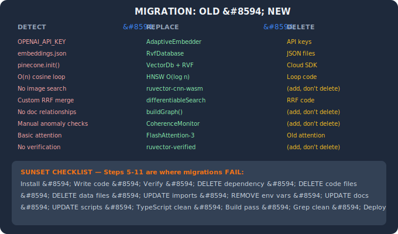
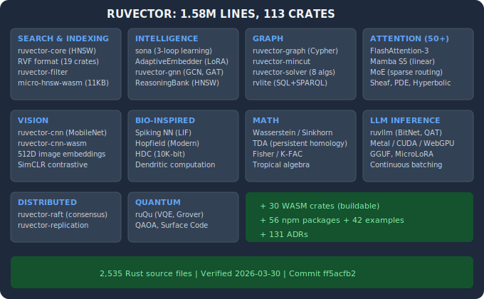

# RuVector Catalog v3.5.0

**The architect's playbook for RuVector — because a 1.58M-line monorepo is too deep for anyone to search alone.**



<details>
<summary>ASCII Version (for AI/accessibility)</summary>

```
"I need to search documents by meaning, not keywords"
                       │
                       ▼
           ┌───────────────────────┐
           │   RuVector Catalog    │
           │  • What to use        │
           │  • How to access it   │
           │  • What to replace    │
           │  • What to delete     │
           └───────────┬───────────┘
                       │
                       ▼
  "Use AdaptiveEmbedder (npm) + RvfDatabase (@ruvector/rvf)
   for 384D HNSW search. Replace your JSON index + OpenAI
   embeddings. Delete embeddings.json and the API key."
```

</details>

---

## The Problem This Solves

RuVector is a monorepo with **113 Rust crates, 56 npm packages, 30 WASM builds, and 200+ technologies**. It has everything from vector search to quantum simulation to spiking neural networks. But that richness creates a discovery problem:



<details>
<summary>ASCII Version (for AI/accessibility)</summary>

```
THE DISCOVERY PROBLEM

Without catalog:                  With catalog:
├── npm docs → no CNN export      ├── Catalog: ruvector-cnn exists
├── "not available" ← WRONG       ├── Build from submodule (90s)
└── Uses OpenAI Vision ← $$$      └── 512D MobileNet embeddings ← FREE
```

</details>

**The catalog exists because the monorepo is too large for any AI agent or developer to search effectively.** Without it, agents default to "not available" when features exist but aren't in the obvious place (npm). The catalog maps every capability to its access path.

---

## What It Does (Three Layers)



<details>
<summary>ASCII Version (for AI/accessibility)</summary>

```
LAYER 1: RECOMMEND — "I need X" → Here's the component
LAYER 2: MIGRATE  — "You're using aging tech" → Replace + DELETE
LAYER 3: ACCESS   — "How?" → npm / WASM build / NAPI
```

</details>

---

## How It Works



<details>
<summary>ASCII Version (for AI/accessibility)</summary>

```
PATH 1: npm (instant)     PATH 2: WASM (90s)      PATH 3: NAPI (fast)
require('ruvector')       wasm-pack build          @ruvector/*-node
170 exports               30 crates                Pre-built binaries

DECISION TREE:
├── In require('ruvector')?        → USE IT
├── In @ruvector/<name> npm?       → USE IT
├── In ruvector/crates/*-wasm/?    → BUILD IT
├── In ruvector/crates/<name>/?    → BUILD NAPI
└── None of above?                 → DOESN'T EXIST
```

</details>

---

## Migration Intelligence

The catalog detects 10 aging technology patterns and provides complete replacement guides:



<details>
<summary>ASCII Version (for AI/accessibility)</summary>

```
DETECT                   → REPLACE              → DELETE
OPENAI_API_KEY           → AdaptiveEmbedder     → API keys
embeddings.json          → RvfDatabase          → JSON files
pinecone.init()          → VectorDb + RVF       → Cloud SDK
O(n) cosine loop         → HNSW O(log n)        → Loop code
No image search          → ruvector-cnn-wasm    → (add)
Custom RRF               → differentiableSearch → RRF code
No doc relationships     → buildGraph()         → (add)
Manual anomaly checks    → CoherenceMonitor     → (add)
Basic attention          → FlashAttention-3     → Old attn
No verification          → ruvector-verified    → (add)

Steps 5-11 of the 15-step sunset checklist are where migrations FAIL.
```

</details>

---

## The RuVector Monorepo at a Glance



<details>
<summary>ASCII Version (for AI/accessibility)</summary>

```
RUVECTOR: 1.58M LINES, 113 CRATES

SEARCH & INDEXING         INTELLIGENCE          GRAPH              ATTENTION (50+)
├── ruvector-core (HNSW)  ├── sona (3-loop)     ├── ruvector-graph  ├── FlashAttention-3
├── RVF format (19)       ├── AdaptiveEmbedder   ├── ruvector-mincut ├── Mamba S5
└── micro-hnsw (11KB)     └── ruvector-gnn       └── rvlite          └── MoE, Sheaf, PDE

VISION                    BIO-INSPIRED          MATH               LLM INFERENCE
├── ruvector-cnn          ├── Spiking NN        ├── Wasserstein    ├── ruvllm (BitNet)
└── ruvector-cnn-wasm     ├── Hopfield          ├── TDA            ├── Metal/CUDA/WebGPU
                          └── HDC (10K-bit)     └── Tropical       └── GGUF, MicroLoRA

DISTRIBUTED               QUANTUM
├── ruvector-raft          ├── ruQu (VQE, Grover)
└── ruvector-delta         └── QAOA, Surface Code

+ 30 WASM crates + 56 npm packages + 42 examples + 131 ADRs
```

</details>

---

## Quick Start

### 1. Install Bun

```bash
curl -fsSL https://bun.sh/install | bash
```

### 2. Clone and install

```bash
git clone https://github.com/mamd69/ruvector-catalog.git
cd ruvector-catalog
bun install
```

### 3. Add the RuVector source (for catalog rebuilds)

```bash
git submodule add https://github.com/ruvnet/ruvector.git ruvector
git submodule update --init --recursive
```

### 4. Ask your first question

In Claude Code:

> use @ruvector-catalog to find technologies for searching documents by meaning

Or via CLI:

```bash
bun src/cli.ts search "search documents by meaning, not keywords"
```

---

## How to Use

### Ask Claude (Recommended)

**Quick search:**
> use @ruvector-catalog to find technologies for detecting errors in AI output

**Migration analysis:**
> use @ruvector-catalog to analyze my codebase for aging patterns and recommend RuVector replacements

**Full proposal (RVBP):**
> use @ruvector-catalog to create an RVBP for building real-time patient monitoring

### Command Line

| Command | What it does |
|---|---|
| `bun src/cli.ts search "query"` | Search for matching technologies |
| `bun src/cli.ts rvbp "problem"` | Generate implementation proposal |
| `bun src/cli.ts list` | Show all 200+ technologies |
| `bun src/cli.ts stats` | Show catalog statistics |
| `bun src/cli.ts verify` | Check if catalog is up to date |

### Deep Analysis (Swarm)

> use @ruvector-catalog to deeply analyze how to build a real-time patient monitoring system and create an RVBP in docs/research/

Multiple AI agents work in parallel for 30-60 seconds, producing architecture-level guidance.

---

## Migration Examples

### Before: OpenAI Embeddings ($0.002/query)

```javascript
const response = await fetch('https://api.openai.com/v1/embeddings', {
  headers: { 'Authorization': `Bearer ${OPENAI_API_KEY}` },
  body: JSON.stringify({ model: 'text-embedding-3-small', input: text })
});
```

### After: RuVector AdaptiveEmbedder (local, free, learns)

```javascript
const { AdaptiveEmbedder } = require('ruvector');
const embedder = new AdaptiveEmbedder({ loraRank: 4, contrastiveLearning: true });
await embedder.init();
const embedding = await embedder.embed(text);
```

### Before: JSON Index with O(n) Search

```javascript
const index = JSON.parse(fs.readFileSync('embeddings.json'));
const results = index.map(e => ({ score: cosine(query, e.vec), ...e }))
  .sort((a, b) => b.score - a.score).slice(0, 10);
```

### After: RVF Binary with O(log n) HNSW

```javascript
const { RvfDatabase } = require('@ruvector/rvf');
const db = await RvfDatabase.openReadonly('index.rvf');
const results = await db.query(queryVector, 10);
```

---

## Industry Solutions

| Industry | Key Capabilities |
|----------|-----------------|
| **Healthcare** | Patient similarity, pharmacogenomics (CYP2D6/CYP2C19), clinical decision support, medical image analysis, HIPAA-compliant federated learning |
| **Finance** | Trading signal verification, fraud detection via graph analysis, compliance audit trails, low-latency processing |
| **Robotics** | Perception pipelines, motion planning, safety-critical decisions, real-time control with spiking neural networks |
| **Edge/IoT** | WASM models as small as 11.8KB, quantized inference, offline-capable AI |
| **Genomics** | Biomarker scoring, genotype analysis, privacy-preserving on-device genomic analysis |

---

## What RuVector Catalog Does NOT Do

- **Not a content generator.** It recommends *infrastructure* technologies, not blog posts.
- **Not an app builder.** It recommends components, not complete applications.
- **Not a chatbot.** It answers one question: "What technologies should I use?"
- **Not a deployment tool.** It tells you what to build and migrate from, not how to deploy.

**What it IS:** The expert architect that maps your problem to the right RuVector capabilities and ensures you complete the full migration — including deleting what you replaced.

---

## File Structure

| File or Folder | What it contains |
|---|---|
| `SKILL.md` | The architect's playbook (problem/solution map, migration intelligence, access paths) |
| `domains/` | Industry-specific guides (healthcare, finance, robotics, edge/IoT, genomics) |
| `src/` | Search engine and proposal generator source code |
| `tests/` | 168 tests validating search quality |
| `docs/` | Architecture decisions and domain design documents |
| `ruvector/` | The RuVector monorepo (git submodule, ~1.58M lines Rust) |

---

## Keeping It Updated

### Update the catalog (do this before each use — takes 3 seconds)

```bash
git pull origin main
```

### Update the RuVector source (when rebuilding the index)

```bash
git submodule update --remote ruvector    # Pull latest RuVector source
bun scripts/build-catalog.ts              # Rebuild the catalog index
bun src/cli.ts verify                     # Check for staleness
```

---

## Changelog

### v3.5.0 (2026-03-30)
- **Migration Intelligence**: 10 aging-pattern detection and replacement guides
- **Sunset Checklist**: 15-step migration completion verification
- **Operational Bridge**: 3 access paths with decision tree
- **Verified Inventory**: 113 crates, 56 npm, 30 WASM (filesystem-verified)
- **Response Adaptation**: Engineer vs non-technical stakeholder modes
- **CNN WASM tested**: MobileNet-V3 512D image embeddings confirmed

### v3.0.0 (2026-03-20)
- Initial V3 with problem-solution map, algorithms index, industry verticals
- 168 search quality benchmarks
- CLI search and RVBP generation

---

## Contributors

| | Role |
|---|---|
| [@mamd69](https://github.com/mamd69) | RuVector Catalog — architecture, V3 implementation, benchmarking, documentation |
| [@stuinfla](https://github.com/stuinfla) | V1 catalog + V3.5 migration intelligence, operational bridge, verified inventory |
| [@ruvnet](https://github.com/ruvnet) | [RuVector](https://github.com/ruvnet/ruvector) — the 1.58M-line monorepo |

---

## Getting Help

**Questions:** [RuVector GitHub Discussions](https://github.com/ruvnet/ruvector)
**Bugs:** [github.com/mamd69/ruvector-catalog/issues](https://github.com/mamd69/ruvector-catalog/issues)
**New industry vertical:** Open a feature request with title "Industry Vertical: [Your Industry]"
